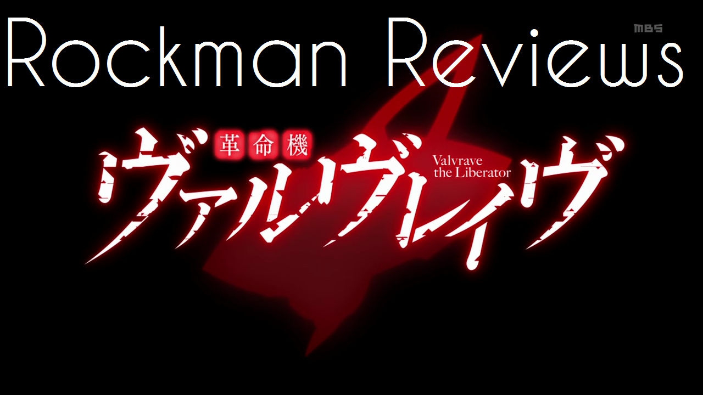

---
{
	title: "Rockmandash Reviews: Valvrave the Liberator [Anime]",
	published: "2014-01-06T01:30:00-05:00",
	tags: ["rockmandash reviews", "valvrave", "valvrave the liberator", "anime", "tayclassic", "trainwreck", "ani-tay"],
	kinjaArticle: true
}
---

Where do I even start with this show? Welcome to Rockmandash Reviews and my second review on TAY, and this is a review of Valvrave the Liberator, the most disappointing anime I've seen in a long time. Valvrave is an original anime mecha made by sunrise, and if you don't know what they have made, go watch more anime because they are pretty well known. I like to call Valvrave the trainwreck of missed potential.

Link to [Video Review](http://dai.ly/x19z3jk)

### Plot

I'll start this off saying when I came into this show, I was expecting the next Code Geass. With unique mechs, a foreign empire invading and similar writing (at least in the beginning), I was expecting great things. What I got was similar to robotics; notes in levels of disappointment. Why does all of my favorite series have to have such lacking spiritual successors? Valverave is about a bunch of space Japanese high school students trying to defend their territory with giant mechas, because space Nazi soviets (who's governments are ran by space vampires ) are trying to conquer them, and the world. Did I forget to mention that everybody who gets into the giant mechas turn into immortal Japanese vampires? The show is absurd as it sounds. This show… has the WORST WRITING EVER. A few of the flaws that the show has are that it's extremely trope-y in execution, when it tries to be serious it fails, it has a bad balance of humor and actual plot development and some of the scenes are just so face palm worthy that It's sad. I can pretty much sum up my other thoughts with this picture.

#### Plot - 5/10

### Characters

Valvrave has alot of decent characters, and here are a few that should be mentioned. Haruto is the Shinji Ikari of the anime aka the [Failure Hero](http://tvtropes.org/pmwiki/pmwiki.php/Main/FailureHero). He complains and is a spineless wimp. He gets quite a bit of character development throughout the series though, and becomes a dependable character. This means he's less annoying later on, but he's also less fun. Next is L-elf, the [The Chessmaster](http://tvtropes.org/pmwiki/pmwiki.php/Main/TheChessmaster). He's like Lelouch, and I love it. After that is Saki, a cynical pop-star, who is well written. Her personality helps make up for Haruto's incompetence. Marie is a Anya clone, and the space Nazis were also enjoyable. Overall the characters were pretty good. At least one aspect of Valvrave's writing was better than average.

#### Characters - 8/10

### Art & Animation

Valverave is quite beautiful. Cool mechs, the areas in space looks great, good character designs, good blending of art and CG, and overall it's a good looking show. The fight scenes are awesome, and everything in not module 77 looks really cool, but nowadays what doesn't? Artistically, the only part that's unique to this show though is the mechs, while most of the show is kinda average. I wish they went for a more unique art style, but what they have is pretty solid.

#### Art & Animation - 8.5/10

### Sound

Valverave sounds good, but it's not memorable. Other than the OP's, i remembered nothing about it and nothing stood out. The voice acting is good, but no characters stood out. The soundtrack was good, but but no tracks stood out. Valvrave's soundtrack is average at it's finest. Nothing stands out but nothing is bad.

#### Sound - 7/10

### Personal enjoyment

I already stated that I came into Valvrave expecting the next Code Geass. That's high expectations for me, because CG is my favorite show ever, and obviously I'm disappointed by this show. Never was I bored by Valverave though, as its absurdity was always fun. Of course, I was disappointed, but I always looked forward to Valvrave at the beginning to see if it would get better, but then later in season 1, I started looking forward to what stupid things would happen next. It's a Trainwreck but it was a fun Trainwreck – like School Days.

#### Personal enjoyment - 7.5/10

### Conclusion

Valvrave the Liberator is interesting. It excels at entertaining, it has good visuals and audio, but it fails in the writing. In a show like a mecha, writing is of the utmost importance, can really make or break a series. Because of that, Valvrave is great, but broken… very broken… the writing is absolutely rubbish, and it's upsetting to see it this way. Let's hope sunrise can knock it out of the ballpark with their next work, but as is, Sunrise's newest effort is Beautiful but Broken.

## Overall - 6.5/10

## Rockmandash Regrets

## Pros:

Good Visuals

Entertaining

## Cons:

Horrible Writing

IT'S REALLY FUCKING STUPID.

***

**Copyright Disclaimer:** Under Title 17, Section 107 of United States Copyright law, reviews are protected under fair use. This is a review, and as such, all media used in this review is used for the sole purpose of review and commentary under the terms of fair use. All footage, music and images belong to the respective companies.

*You can see all my reviews on *[*Rockmandash Reviews*](http://tay.kotaku.com/tag/rockmandash-reviews)*. For An explanation of my review system, *[*check this out*](https://rockmandash12.kinja.com/rockmandash-rambles-an-explanation-on-my-review-system-1619265485)*.*

###### [Rockmandash Rambles: *An Explanation on my Review System* (Updated 11/15/2015)](https://rockmandash12.kinja.com/rockmandash-rambles-an-explanation-on-my-review-system-1619265485)

If you’ve read any of my reviews and wanted to know why I did them the way I do, here’s an…

[Read more](https://rockmandash12.kinja.com/rockmandash-rambles-an-explanation-on-my-review-system-1619265485)

*This show is available on *[*Crunchyroll*](http://www.crunchyroll.com/valvrave-the-liberator)* for Free & Legal streaming.*