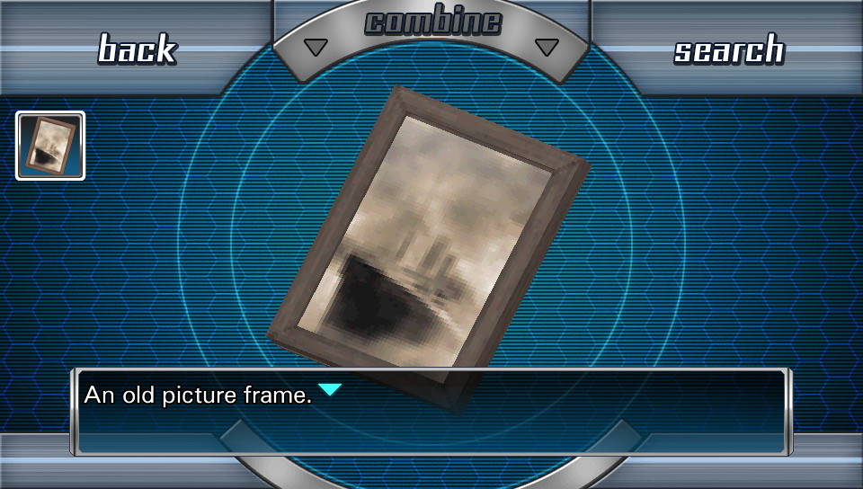
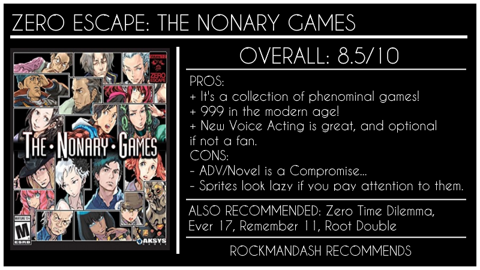

---
{
	title: "RockmanDash Reviews: Zero Escape: The Nonary Games",
	published: "2017-03-25T10:00:00-04:00",
	tags: ["RockmanDash Reviews", "Zero Escape", "999", "Virtues Last Reward", "Visual Novels"],
	kinjaArticle: true
}
---

<video src="./v6l86liwvuq1ffofi0eo.mp4"></video>

Experiences are ephemeral, as the relentless march of time consistently deteriorates our memories, regardless of the hopes and dreams they may cause. From the memories with loved ones to those of the games and movies we adore, these experiences do not age well, always ending up lesser than when we were in a fonder time. While this can be seen as a tragedy, this inherent element of experiences makes the often rare ability of reliving our memories to fit the modern age all that much sweeter, given how fleeting it is.\
\
In this case, the ability to Seek a Way Out once again by being able to replay *999: 9 Hours, 9 Persons, 9 Doors* in a completely remastered form is something that I deeply appreciate. *Zero Escape: The Nonary Games* is an HD remastering in a fashion that all HD remasters should, being the definitive way to play the games in the series while being an affordable collection. It allows those who loved the series to relive the experience in the best way yet, while giving newcomers a gateway into the series in a more affordable and accessible manner.

***

*Zero Escape: The Nonary Games *is a collection of the first two *Zero Escape* games (*999: 9 Hours, 9 Persons, 9 Doors* &* Zero Escape: Virtue’s Last Reward*) while including a complete remastering of the first game, *999*. For those of you not in the know, each game in the *Zero Escape* series follows people captured against their will, forced into life or death situations to play “games”, with these two games following variations of the Nonary Games. If you want more information on the individual games, check out my reviews of them ([999 here](http://rockmandash12.kinja.com/why-i-love-999-nine-hours-nine-persons-nine-doors-so-1688146811#_ga=1.14274167.1523386611.1417386122) and [VLR here](http://rockmandash12.kinja.com/zero-escape-virtues-last-reward-is-nearly-perfect-expe-1713427517)), but for those not interested, here’s a TL;DR: The *Zero Escape* games are great because these games provide some of the best story experiences that both Visual Novels and video games have to offer, being mystery thrillers that grip your attention throughout the entire game and provide some of the most rewarding and best-written twists you can find on an electronic device.

That being said, the original game in the series has not aged well: *999* was originally a DS game and thanks to that system’s “impressive” 256 × 192 screen resolution, this game doesn’t look particularly amazing, especially in the age of retina displays and Ultra High Definition. Also, since the only release of *999* outside of the original was the iOS version which, while in HD, didn’t include any of the gameplay... which is a huge aspect of the game. Anyone interested in playing this game was stuck with the unfortunate decision between two compromised experiences. While *Virtue’s Last Reward* is mostly untouched, there are a lot of changes that went into the *999* remastering, making it the definitive version of the game. Just some of these are:

* **HD Art** - Not a surprise, given that this is the point of a remastering, but now we have *999* in HD, in widescreen (expanded from source, not cropped). Sprites are redone, the 3D models are rendered in higher resolution, a completely new UI, and other minor issues were fixed.
* **Voice Acting** - For almost all of the Novel sections, we have voice acting, which makes it easier for many to get into the game. The voice acting has English and Japanese dual audio, as well as the option to disable voices (by turning down voice audio).
* **High Quality Audio** - Higher bitrate audio for the music in the game. This is the music from the iOS version, but is a significant improvement from the DS version.
* **Content Missing from iOS Version** - While the iOS version had HD art, it was missing escape rooms and the character art were only stills. In *The Nonary Games*, the character art is animated and we have the escape rooms, so it’s the best of both worlds.

* **Flow Chart** - Returning from *Virtue’s Last Reward* and *Zero Time Dilemma* is the flow chart which helps you keep track of where you have gone in the game and allows you to select the portion where you want to play, instead of having to restart the game and hold skip until you get to where you want.

**ADV & Novel Mode** -To try and replicate the dual screen effect from the DS version into systems with only a single screen, *The Nonary Games* implements 2 modes: ADV Mode and Novel Mode. The game will switch between them automatically, but you can also manually switch, too.

* **ADV Mode** represents a more traditional first person Visual Novel Perspective (in Japan, Visual Novels are ADV games, with ADV derived from **Adv**enture)
* **Novel Mode** is more of a third person mode and represents Older Visual Novels, with text superimposed onto the game instead of in a window. Most monologues take place here, making it read more like a book.

Along with all of these changes, *Zero Escape: The Nonary Games *also fixes the problem of the game being limited to handhelds, allowing you to play* 999* and *Virtue’s Last Reward* on many more systems than before. This allows a lot more people the opportunity to play it, and as an example, many in the Visual Novel community only have Windows devices. Before the release, the only system you could play the trilogy on was the 3DS, but now you can also play all of the games on Vita and PC, as well as serving to introduce the series to consoles (PS4).

These changes really help the experience, making the game more enjoyable and less frustrating to play. First, while the art in *999* was never its selling point, the revamped artwork looks great for the most part (especially on the Vita I’ve been playing it on) as it keeps the PS1-esque charm of the game while bringing it into the HD era. Second, the new voice acting and improved music are quite great, which really helps you get immersed in the game. Last but not least, the flow chart makes it easier to go through the game; it lets you jump to points in the game, skipping parts you already read while making it easier to keep track of what you already have done. These are just some of the more noticeable changes, and they all serve to make your time with the game significantly better.

There are exceptions to this however: the sprites, the switching and the flow chart. The sprites look a bit cheap: if you look closely, they look like they were lazily scaled up to a higher resolution and given a filter to smooth out assets. The effect this has is that it makes the characters look flat and are sparse with details (like they’re from a low budget anime) but this isn’t a deal-breaker. The ADV/Novel mode might be though for some diehard fans as the big twist in the game relied on the hardware of the DS, and loses some of it’s impact here. This is a big deal to some, but I’d argue the overall better experience of the game that *The Nonary Games* provides more than makes up for it. Also, some people would also argue that the inclusion of the flow chart takes away from the structure of the original game, but it’s completely optional and you can play the game just like you did in the DS version.

***

*Zero Escape: The Nonary Games* makes a significant amount of changes to bring *999* into the modern age, and all of these changes ultimately make for this to be the definitive version of the game, even though this release is far from perfect. With it being available on many modern systems, the inclusion of the first two games in one package, the fixes in gameplay, and inclusion of better visuals along with new great voice acting, *Zero Escape: The Nonary Games* is an ideal remastering, one that is hard to go wrong with. If you haven’t played the game, prepare for one of the best game series I’ve ever played, and if you have, you now have a fantastic opportunity to replay one of the best games out there. Truly a win-win for everyone.

***

*Thank you for reading! This is Rockmandash Reviews, a blog focused on everything revolving Visual Novels, with stuff like tech and anime every now and then. If you want to check out* *the rest of my Infinity & Zero Escape Marathon, *[*you can do that here*](http://rockmandash12.kinja.com/rockmandash-reviews-infinity-zero-escape-marathon-w-1664979798?rev=1435279519903)*. For an explanation of my review system, *[*check this out*](http://tay.kotaku.com/rockmandash-rambles-an-explanation-on-my-review-system-1619265485)*, and for more of my writing, check out *[*FuwaReviews*](https://fuwanovel.net/reviews-hub/)* and [*AniTAY*](http://anitay.kinja.com/) where I am a contributor!*
