---
{
	title: "RockmanDash Reviews: Zero Time Dilemma - The End of A Dream",
	published: "2016-08-10T17:30:00-04:00",
	tags: ["Rockmandash Reviews", "Zero Escape", "Zero Time Dilemma", "Fuwareviews", "Visual Novel", "Uchikoshi"],
	kinjaArticle: true
}
---

Sometimes life is simply unfair, don’t you think?

Whenever we play a game, we fall into the dream of wanting greatness, forever hoping for a work that fulfills our utmost desires… and while we deceive ourselves with false promises, we forget the reality of a dream. We envision them to be amazing, but in reality they they are often disappointing, falling apart at the very end. It is especially cruel then, when you have a work that goes against the nature of a dream, only to fall back into it, a tragedy that can be seen as the tragedy of life itself, or for me, the tragedy of *Zero Time Dilemma.*

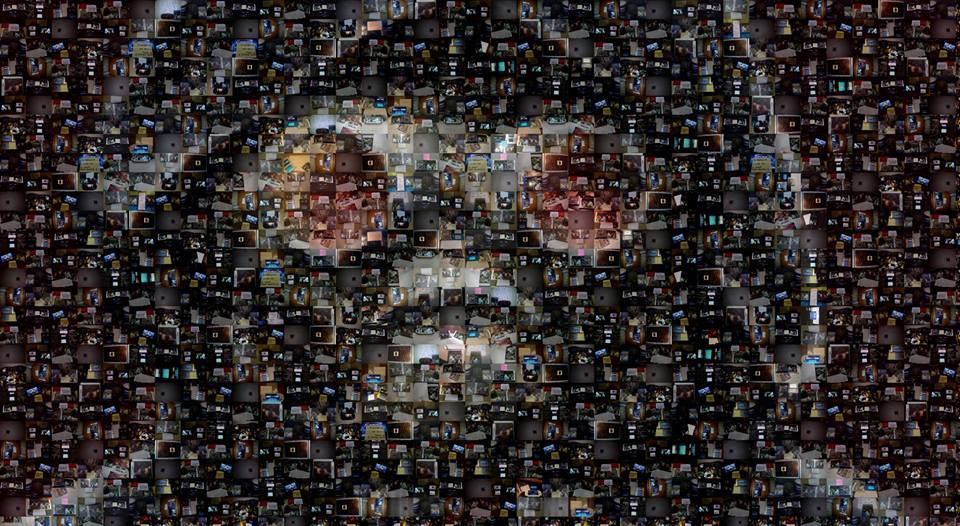

The dream of [Zero Escape](http://rockmandash12.kinja.com/rockmandash-reviews-infinity-zero-escape-marathon-w-1664979798?rev=1470864619775) was one that ensnared fans across the world. With 2 phenomenal games in [*999*](http://rockmandash12.kinja.com/why-i-love-999-nine-hours-nine-persons-nine-doors-so-1688146811) and [*Virtue’s Last Reward*](http://rockmandash12.kinja.com/zero-escape-virtues-last-reward-is-nearly-perfect-expe-1713427517), the Zero Escape dream seemed to be one that would go against all of the odds, providing this perfection we all desired, but we got a wake up call soon after, an awakening that shattered the rose tinted glasses of fans everywhere. On February 13th, 2014, Kotaro Uchikoshi reminded us of the realities of game development that we all wanted to forget: game development is a business, and regardless of what fans or critics say, sales are ultimately what matters. Even though Zero Escape did well in the west, it flopped in Japan, to the point that the 3rd game may not come out due to poor sales. This was devastating news, especially considering the state of the series: The previous game, *Virtue’s Last Reward *was made as a first part of two games, and thus stopped at a cliffhanger. Instead of giving up, fans all over pushed in desperation for this game, showing unwavering support in light of this news. It paid off and 2 years later we miraculously we got Zero Escape 3 in the form of *Zero Time Dilemma… *and while I and everyone else is grateful to be able to play it, it didn’t come without a cost. It’s a dream-like situation of euphoria and excitement of beating the odds but think about this: because of what is essentially equivalent to a snail, the game was derailed, compromised.* Zero Time Dilemma* is a continuation of the dream that ensnares you into hopes of amazing and endless possibilities but is crushed by the weight of reality. If different decisions were made, if we lived in an alternate reality in which this fallout never happened, we could have had a very different *Zero Time Dilemm*a, one that could have been grander, one that could have been truly great.

Before we start talking about the game however…..

***

This review is written by a fan of the series, for the fans of the series. In this review I want to get into the nitty gritty of what makes this game tick, so this review will contain major spoilers of both *Virtue’s Last Reward *as well as *Zero Time Dilemma. *It will have warnings about these spoilers in case you still want to read/watch this but haven’t played the game yet, but it’s still worth keeping in mind. There are things I want to talk about that require delving into spoilers, so I would like to say sorry for those disappointed by this fact, as well as thanks in advance for those who are sticking around for understanding this.

***

 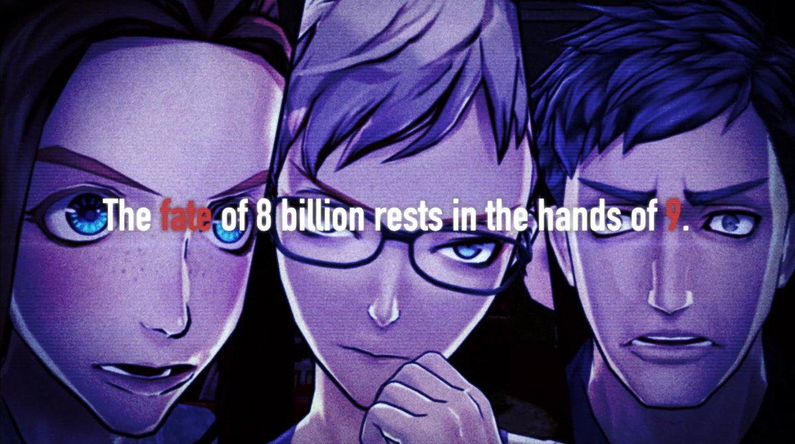

When talking about the story of *Zero Time Dilemma*, everything is rather familiar, yet also so alien at the same time. The premise of *Zero Time Dilemma* is basically everything you would expect with yet another Extreme escape game, this time picking up right where *Virtue’s Last Reward* ended **(AKA THIS IS A BAD STARTING POINT)**, set in the Nevada Test Facility. In this facility, our cast of characters is forced to play what’s called the Decision game, the most straightforward of the series. Simply put, you make decisions that put you or another in a life or death situation, and 6 people need to die before anyone can escape. What really makes the Decision game tick however is how it is combined with the fragment system: In *ZTD*, the cast is broken up into 3 teams and the teams only have consciousness and memories in 90 in game blocks, (with the player experiencing each fragment in random order) and the effect of this is that the emphasis of the story is moved away from a sweeping narrative to the individual decisions and specific scenarios itself. While not as flashy as the others premises, the combination of the Decision game and the Fragment system provide an unique and interesting fantastic foundation that provides an engaging experience, but is hampered by several aspects of the execution: the fragment system itself, retconning of expectations, and limited resources that prevent this game from being as great as the rest.

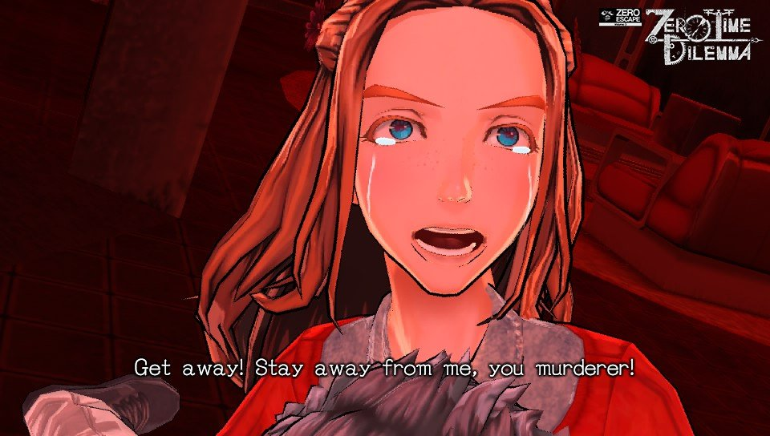

While the flaws aren’t something that will affect everyone who plays it, as the game is still pretty solid for the most part, it’s just impossible to state the importance of the flaws, starting with the issues the fragment system itself creates.This system is the defining trait of *Zero Time Dilemma*, root of the greatness of the game, yet also the biggest issue this game has.* *It’s a system that dramatically changes the game, one that that can get you into the thick of things really quickly, leading to a great early and mid game, but because the story is disjointed as none of the scenes serve to develop anything. This is because you are going in a random order, making explanations harder: each fragment has to quickly focus on one aspect, without the ability to connect explanations because they are self contained. It’s like a string of short stories that slowly move towards an ending, a less enjoyable experience that is harder to remember and less engaging. In my opinion, if they cut the fragments at a certain point and just let it continue linearly for a long stretch of the game (like Coco route long, a good extra 10 hours), it could have been very enjoyable, but that isn’t what happened here. Also, They touted the mystery from the system as an advantage, but the fact that you don’t truly know anything can simply be a big downside later on when you need to know the plot elements in a cohesive fashion to understand and enjoy the story.

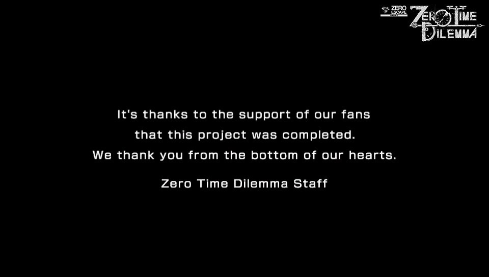

Another issue this game has is an incapability to handle expectations. Unlike the other games in the series, *Zero Time Dilemma* is built around expectations, a fulfillment of experiences we previously had. *Zero Time Dilemma* was billed as a sequel for *VLR*, and it was a necessary one: For the Zero Escape series to be truly complete, *Zero Time Dilemma* needed to conclude the cliffhanger that *VLR *left us.

***

## - WARNING *VLR* SPOILER AHEAD -

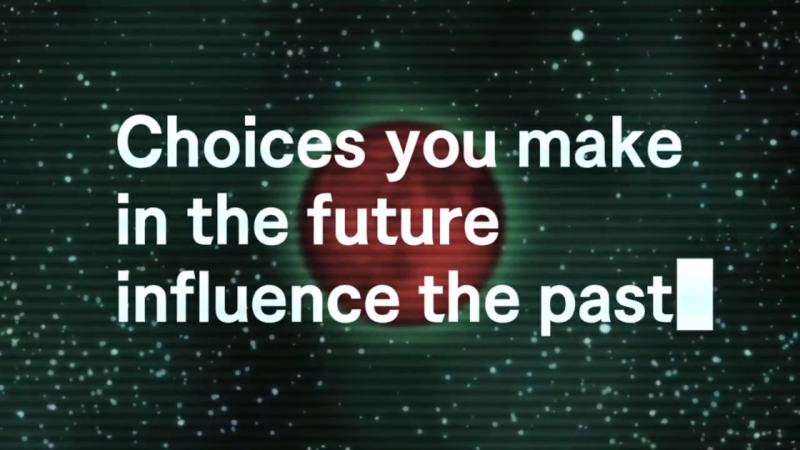

In my review of that game, I stated:

> *VLR *doesn’t have a “good” end: it has an ending that can lead to hope, but is one that is ultimately facing disaster. The characters are dealing with the loss of a promised life, the loss of everything, and the world is still dealing with an apocalyptic situation. To top it all off, we have no idea what’s going to happen to our main characters, being sent to the past. There needed to be a third game, and* VLR* is waiting for it’s Reward, the *ZE3* that it deserves.

We did not get that get that Reward. *VLR* framed *ZTD*, billed it as a conclusion, the story of the characters that were sent to the past to save the world. That was the point of the game, why people clamored so hard for a Zero Escape 3 in the first place… and with a cast of returning characters, everything that this game showed early on seemed like it would do this… but several decisions make me wonder if Uchikoshi (or Spike Chunsoft, if they forced him to write it the way he did) truly understood why people wanted or cared about ZE3, even though I know he understands this. *Zero Time Dilemma* was a game that was only possible because of the support from the fans, but in an attempt to make the game more accessible to new fans, the game retconned key parts of the past game, ignoring or toning down aspects that were reasons people were interested in the first place.

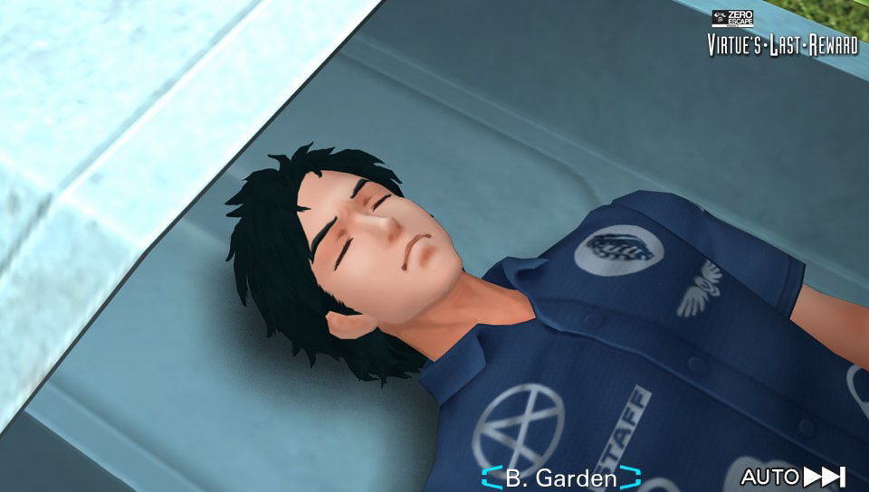

Basically, everything about the secret Another Time ending was thrown out of the window, with key concepts like 4th dimensional beings and Key characters like Kyle Klim and ?/BW completely absent from the game. The main aspect of the *VLR* ending, the devastation of the world by Radical-6 was supposed to be the core of the game, instead we got one that used it as a tool for plot convenience, a set piece: We learn nearly nothing about it, only seeing it get released in an ending or two. A whole organization, Free the Soul is basically absent from the game aside from one conversation, etc. *ZTD* threw out *VLR* and along with it, threw out my connection and interests with it. Even the aspects of *VLR* that do make appearances only were there very briefly, like it was an afterthought, something put in to appease the fans, a depressing and disappointing development.

## - *VLR* SPOILER END -

***

Though, while some may say that one’s expectations of the game shouldn’t shape the game itself, *Zero Time Dilemma* doesn’t even fulfill the expectations it builds up in the game. The fragment system is great at getting you to ask questions, but it’s horrible at answering them due to the limited scope of the character’s knowledge or way it limits the knowledge the player retains. There are many situations where elements were unexplained, but the most notable were the characters: they are simply underdeveloped. The game either doesn’t explain or poorly explains the motives and history of several of the characters. One character in particular (Mira) gets little to no explanation at all on why she’s here, we learn about her past which tells us about her psyche, but not much else. There’s also the fact that this game uses a bunch of things that are plot convenient/deus ex machina-esque in nature to explain things/progress the story like alien technology, or just rushes through several plot points it builds up which leads to an unsatisfying end, making it seem like they copped out.

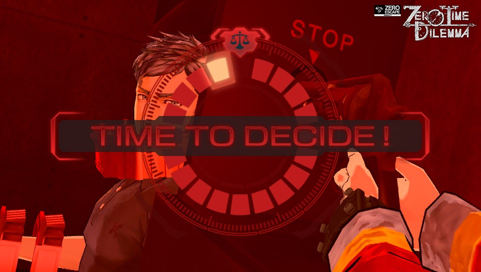

Given all this, one may think that every issue with the game is systematic, but I feel that many are due to the fact that this game is rushed, a possible *Zero Time Dilemma* that the staff had to deal with. I say this because a lot of the choices they made easily could have been effective stylistically if it was smoothed out by more time and more effort. For an example, the fragments like I mentioned before: they could have crafted fragments into a beautiful tale that blew our minds by having the fragments come together in the end. The ending and late game as a whole could have been a lot better, explaining the core of the story instead of using cheap Deus Ex Machinas, and they could have even made the entire work as a whole more enjoyable given more effort put into aspects like presentation or using the concepts in the story better, etc. To me, it felt like the key difference between the games, more the story elements, was that *ZTD* threw out was the craftsmanship that made the previous works stand out, the scripting of a beautiful narrative that built up into an amazing experience. While this work was billed as more philosophical than the previous works in the past, the philosophical and SciFi elements that spiced up the series are much more sparse in nature, the work is much shorter with less explanation in general, etc. More time could have helped this game and it’s rushed nature is something that cannot be overlooked.

And of course… the ending.

***

## - *ZTD* SPOILERS AHOY! -

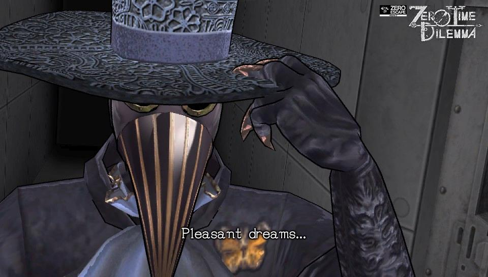

The ending of *ZTD* is basically for me, a combination of everything wrong with *ZTD*. The endings make or break *ZTD*, and people’s opinions are rather split for the most part. I get why people would be satisfied with the ending, as it’s one that flows logically given the events of the game and it wraps up the series, but it’s a contrived ending. It’s filled with plot holes, it has to deal with the fragments which make the lead up to the ending very disjointed, the writing goes down the drain, it relies on plot convenience while underplaying *VLR*, it rides on the rule of cool to finish the story, and more, being an ending that is filled to the brim with problems (at least for me). The ending of *Zero Time Dilemma* surrounds the character Delta, and he’s basically everything wrong with it and more, a bullshit and contrived twist that pops out of nowhere to seemingly be the bad guy that everyone can hate (Yes, it’s hinted in the game but there’s no reason not to show him, *VLR*’s was stated several times and it’s twist felt significantly less contrived), basically the Deus Ex Machina of massive proportions. Delta himself is a horrible character too, with stupid plans (someone wants to kill 8 billion people? Let’s kill 6 billion to prevent that from happening) and a stupid gimmick of “Mind Hacking” that kills any suspension of disbelief if you had any. With Alien technology, wibbly wobbly time travel BS, Shifting in ways that make the whole concept look dumb, the whole ending is a load of bullshit and ultimately leaves me disappointed. It’s the tragedy of* *[*Remember 11*](http://rockmandash12.kinja.com/rockmandash-reviews-remember-11-the-age-of-infinity-1687285802) all over again, an incomplete work that succeeds greatness with a shitty ending, but instead of making an amazing work that was incomplete, they made a complete work that wasn’t amazing.

## - *ZTD* SPOILERS END -

***

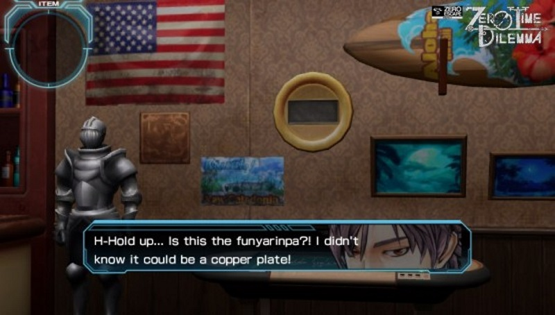

This is a lot of complaints, but they are mostly because I am a fan, because I care. While I have lots of gripes with the game, overall *ZTD* isn’t a bad game, just one that doesn’t match the standards of quality the rest of the series set in my opinion. There are plenty of people who thoroughly enjoyed this game, to the point that they liked it even more than others in the series, and there’s good reason for that. This game still nails what made Zero Escape great (especially early on), with the atmosphere being as immersive as the ones created by Uchikoshi in the past, the engaging tension is here and back with full force, (though, one could argue it’s even more tense and brutal, just ask any AniTAY member who went to AX who got to see me spaz out to Q-END 1), and for the most part the writing is interesting and engaging. It’s a work that serves to conclude a story that really needed a conclusion… but look deeper and you’ll find flaws. Overall, *ZTD* is a game that has a good base and is overall a good experience, it just can’t live up to the rest of the series as it falls apart in the end, which is a shame given everything that comes with it.

***

 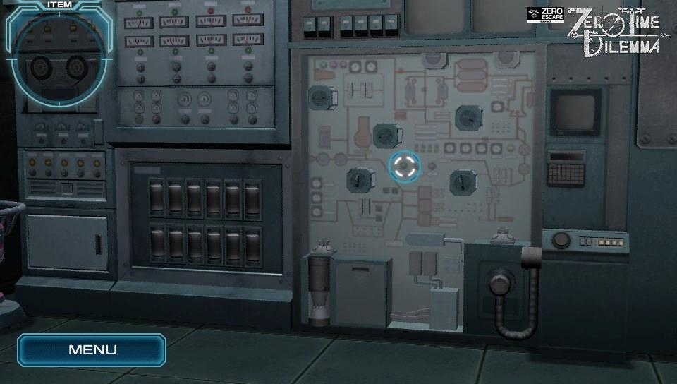

About the gameplay for Zero Time Dilemma… it’s there, and pretty much the same as before? I never really played the Zero Escape series for the gameplay, and *Zero Time Dilemma *does nothing really different or special with the gameplay: it’s mostly the same as *VLR*. It’s worth noting though that what I did talk about last time, the flowchart, is less integrated as a form of gameplay and decision making than the past, it’s something more akin to the normal flow chart that plots out your progression than something that impacts how you experience the game. I have little to say about the puzzles too: they were mostly the same for the most part and I enjoyed them just as much as the last time. Others say that the puzzles got easier, but as I suck with the puzzles anyways, it was equally as hard as before. I appreciate that it’s not just like every other VN without gameplay, but I really don’t have much to say here.

***

 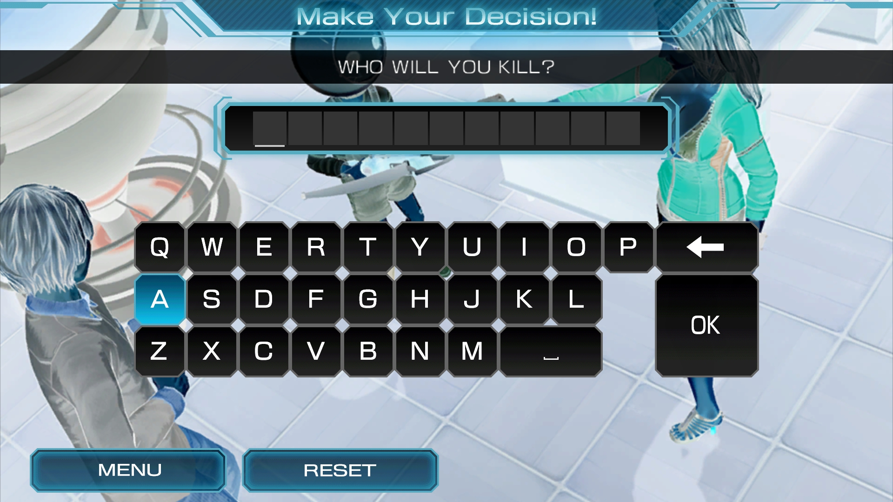

The presentation of this game is ultimately filled with drastic changes, but in my opinion I don’t feel like they drastically affect the experience. One thing is clear though, and that is that the game got hit with a budget cut, meaning that the presentation is even less impressive than in the past. *ZTD* retains the same game engine as *VLR*, and thus the 3D models, but it uses the model in the form of cinematics, fully scripted and animated scenes instead of the typical visual novel affair. It’s a good change in theory, emphasizing the narrative of the game and making it more appealing to the aspect of the gaming market that gets turned off by the amount of reading that comes with the VNs. In practice however, it means less information and a loss of control in regards to pace with jerky and inconsistent visuals due to poor directing. The biggest effect of this is that because everything’s cinematic, it can make the game feel too fast or too slow depending on how you are, for me it felt too fast, as they quickly went through plot events without really explaining it in detail, which was emphasized by the cinematic nature. It’s not all bad though, as when it’s done well, it can be seriously impressive, making the world feel even more alive and immersive than before, but it’s not done all that well in general. The other noteworthy change is the new aesthetic that while looks cleaner and sharper, it also looks blander, and less remarkable. It’s a nice change that spices things up for the series, but it brings along an uninspiring design that is much more muted than before, thus making the game less impressive and less engaging than the past). (It also has the interesting side effect of making it harder to recognize cosplayers.) I’m mixed on the presentation and changes in general, but ultimately it’s not a key aspect of the game and is mostly livable. Also, just a tip: do not skip, regardless of how you’re feeling. It’ll disorient you and make your experience much less engaging. Like movies or TV shows, you have make sure your full attention is on it and skipping throws this off. With print, you can read slowly, get distracted etc, but with cinematics you need to always be paying attention or else you will feel disconnected from the game or miss important plot points.

One place that doesn’t get a lot of changes however, is the soundtrack, which is a good and bad thing. We have amazing Shinji Hosoe return once again, and once again we have another score that comprises of remixes. He does yet another fantastic job with what he remixes, and the score is amazing for the most part, but not every track is remixed,with many of them staying the same as *VLR*. It’s still effective and engaging, but disappointing if you’re already a fan because it makes listening to the soundtrack itself less enjoyable. That being said however, I really do love the new tracks: They’re cold, industrial and haunting, it creates an atmosphere that is almost ethereal in its beauty which really helps you get absorbed into the world. This score is one that aims for a thematic consistency than the epic orchestral nature of *VLR* so it’s not as noticeable as the past, but the highlights are here and when you notice it the score truly becomes amazing. I’ve always believed that Shinji Hosoe’s scores really shined when he worked on trying to make an atmosphere, and the subdued and ambient tracks sound beautiful here. *Placidity*, *Infirmary*,* Locker Room*,* Ustulate Pathos*, these are just some of the great tracks that add so much to one’s experience to the game while being fantastic to listen to, making for yet another great score.

Too bad the voice acting screws over a lot of the music, at least for the English dub. I like the voices for both dubs for the most part, but the Japanese dubbing is of higher quality because the English voice over can be awkward. Even though the voice cast remains the same, the directing of the voices was not up to par, with characters sounding either stilted or disconnected with the scenes they are in. I blame rushed localization, but regardless of who’s to blame, this affects the game and I really wasn’t impressed, with this being something that can seriously hamper your experience. You can still switch on the fly, a feature that’s still as great as before, but I would recommend keeping it in Japanese, the way it was probably meant to be played even though it was released in the west first.

***

 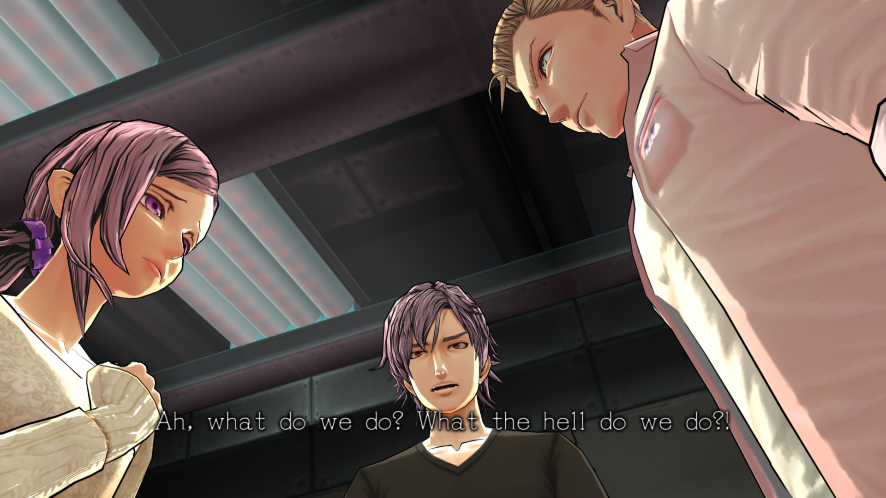

*Zero Time Dilemma* is a game that many have truly enjoyed, but is a step below the rest of the series, the end of the dream. It is the game we all desired, a closure to this fantastic series, but it has issues throughout the game ones that may disappoint you if you’re a diehard fan, and an ending that can be infuriating to many. Even given that though, this is a miracle of a game and still Zero Escape, a solid game that is much better than nothing. If you have an inkling of interest for this game, it’s an experience worth having regardless and I highly recommend it. To me, it’s a disappointing end, the *Remember 11 *of the Zero Escape series, but ultimately, I’m glad it exists. I just wish that the snail wasn’t there.

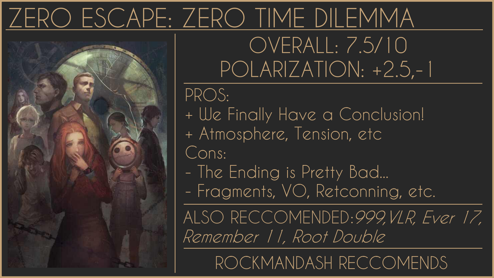

***

***Copyright Disclaimer:**** Under Title 17, Section 107 of United States Copyright law, reviews are protected under fair use. This is a review, and as such, all media used in this review is used for the sole purpose of review and commentary under the terms of fair use. All footage, music and images belong to the respective companies.*

*You can see all my reviews on *[*Rockmandash Reviews*](http://tay.kotaku.com/tag/rockmandash-reviews)* and the rest of my *[*Infinity & Zero Escape *](http://rockmandash12.kinja.com/rockmandash-reviews-infinity-zero-escape-marathon-w-1664979798?rev=1435279519903#_ga=1.28426556.1243070986.1463716221)[*Marathon here*](http://rockmandash12.kinja.com/rockmandash-reviews-infinity-zero-escape-marathon-w-1664979798?rev=1435279519903)*. For An explanation of my review system, *[*check this out*](http://tay.kotaku.com/rockmandash-rambles-an-explanation-on-my-review-system-1619265485)*.*

###### [Rockmandash Reviews: *Infinity & Zero Escape Marathon \[DONE!\]*](https://rockmandash12.kinja.com/rockmandash-reviews-infinity-zero-escape-marathon-w-1664979798)

I’m pretty well known around here for being a Fate/fanboy, but if there’s one thing that I love…

[Read more](https://rockmandash12.kinja.com/rockmandash-reviews-infinity-zero-escape-marathon-w-1664979798)
