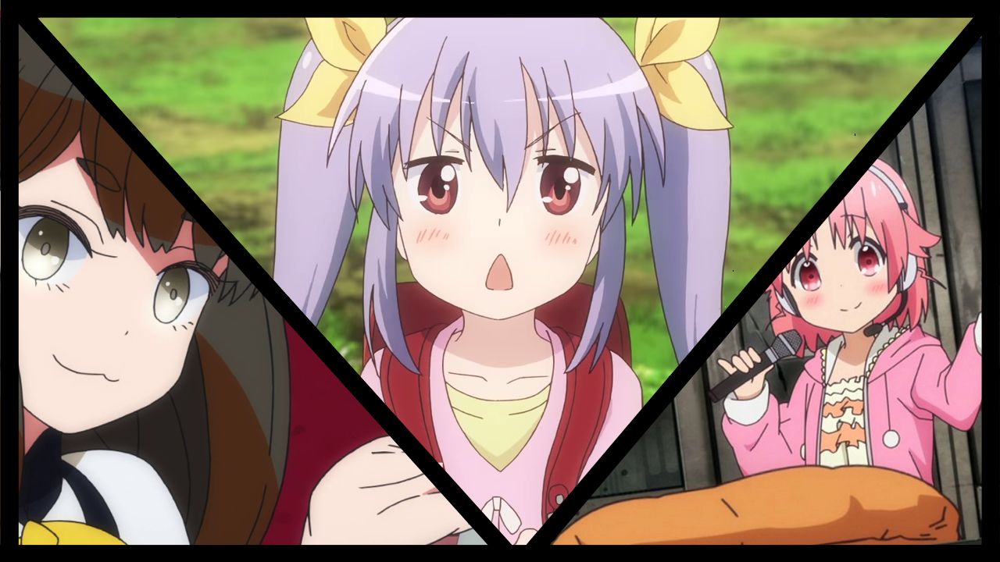

---
{
title: "Rockmandash’s Top 5 Anime of Summer 2015",
tags: ["AniTAY", "Summer 2015", "Top 5", "Top lists", "Top 10", "Anime", "Rockmandash Rambles"],
authors: ['reikaze'],
published: '2015-10-05T10:00:00-04:00',
attached: [],
license: 'cc-by-4',
oldArticle: true
}
---

Everyone has their own preferences, tastes, etc. While the Anime Worth Watching
  articles do a great representation of shows that the people in AniTAY would recommend, It doesn’t exactly represent
  personal preferences, which I always like to keep in mind when some form of discussion happens, like writing. My
  solution? A list of my favorite anime of the season! Welcome to my Top 5 Anime of Summer 2015. 

So, What are the rules of
  this list, you may ask? If it aired/released this season, it can go on this list. I don’t see the point in only giving
  a show one chance during it’s airing season, and this is my list so I’ll list my favorite shows regardless of what
  season it started on. If this means that one show hogs the top spot for 2 seasons, than good for that show! If it’s an
  OVA or movie that came out during the duration of the season I fell in love with, then it may be there. Also, I think
  that the seasonal split is arbitrary and unnecessary, so it’s completely gone here. Sorry about that, but that’s how
  I’m doing it. (That being said, this season’s all new stuff... too much good stuff to do that this time.)

<h4 class="sc-1bwb26k-1 fvCjqJ" id="h111279"><strong>HM#2.<em>
  Rokka: Braves of the Six Flowers</em></strong></h4>

<iframe allow="accelerometer; autoplay; clipboard-write; encrypted-media; gyroscope; picture-in-picture" allowfullscreen="" frameborder="0" height="315" src="https://www.youtube.com/embed/NBxFQkLWSg0" width="560"></iframe>

<strong>Plot Description: </strong>When the Majin awakes from the depths of darkness, the
  deity of fate selects six heroes and bequeaths them with the power to save the world. Adlet, a boy who proclaims
  himself the strongest man in the world, has been selected among “The Heroes of the Six Flowers”. However, as the
  heroes gather, they soon begin to suspect that someone amongst them is an imposter. <em>- Plot Summary from MAL</em>

<strong>Justification &amp; Thoughts: </strong>Normally, HMs for me are usually just
  for shows that were so good that they almost made the list but didn’t, but this season has been rather intersting in
  that regard with a ton of great shows so I’d rather change it around: the rest of the HMs this time are shows that
  were running for the top of this list but totally blew it due to stupid choices.

A
  beautiful world. An Amazing atmosphere. A great opening. An interesting premise. Man... Rokka really had it all, but
  managed to blow it all with a mystery that has dragged way too long, and has been executed in an extremely
  excruciatingly slow manner, with making the plot’s pace falling faster than a roller coaster at a peak and everything
  else the show had going for it vanishing into thin air. I normally don’t like fantasy shows, i’ve been burned out by
  them, but this one had me hooked instantly with what it presented and what it gave us early on. I loved the show, with
  every episode promising a beautiful world that we would explore.. until they stuck us in a forest for like 8 episodes,
  with little progress and development, handled in a way that spoiled the ending and handed us a “read the source
  material” ending. It was rather frustrating, and rather disappointing in the end.

<strong>If interested, you should also check out </strong>the AniTAY review when it
  comes out, and<a class="sc-1out364-0 hMndXN sc-145m8ut-0 gIacKn js_link" data-ga='[["Embedded Url","External link","http://anitay.kinja.com/rokka-the-brave-six-flowers-is-aesthetically-a-pre-his-1716138185",{"metric25":1}]]' href="http://anitay.kinja.com/rokka-the-brave-six-flowers-is-aesthetically-a-pre-his-1716138185" rel="noopener noreferrer" target="_blank"> ShadowHaken’s impressions article</a>.

<h4 class="sc-1bwb26k-1 fvCjqJ" id="h111280">HM#2.<em>
  Ranpo Kitan: Game of Laplace</em></h4>

<iframe allow="accelerometer; autoplay; clipboard-write; encrypted-media; gyroscope; picture-in-picture" allowfullscreen="" frameborder="0" height="315" src="https://www.youtube.com/embed/765kDM0jrBU" width="560"></iframe>

<strong>Plot Description: </strong><em>Ranpo Kitan</em> is inspired by the works of pioneer
  mystery fiction author Edogawa Ranpo, and was also created as a tribute to the 50th anniversary of his death. Though
  it may not seem very apparent that this anime is based on Showa era stories, one of the main characters pays homage to
  Edogawa’s famous detective Kogoro Akechi (and yeah, the real Ranpo did actually write about human chairs). The anime
  follows events through the perspective of Kobayashi, an intelligent but jaded middle school student who is thrust into
  a murder investigation and decides solving heinous crimes is just the thing to break the monotony. He teams up with
  another wunderkind, 17 year old investigator Akechi, to solve various and gruesome murders. <em>- Plot Description
    written by Morie from the Anime You Should Be Watching Article</em>

<strong>Justification &amp; Thoughts: </strong>I guess this one falls into anime
  mystery syndrome, in which anime can’t do a mystery for it’s life. While it started strong with an interesting story,
  amazing OP and a great style that I adored, the plot started tapering off throughout the show and while it still had a
  great style, the lack of good writing and a boring mystery just made the work that much less enjoyable, to the point
  that it’s just OK. Sad days indeed. 

<strong>If interested, you should also check
  out </strong><a class="sc-1out364-0 hMndXN sc-145m8ut-0 gIacKn js_link" data-ga='[["Embedded Url","External link","http://anitay.kinja.com/ranpo-kitan-game-of-laplace-the-anitay-review-1733817681",{"metric25":1}]]' href="http://anitay.kinja.com/ranpo-kitan-game-of-laplace-the-anitay-review-1733817681" rel="noopener noreferrer" target="_blank">Our review from Morie here</a>.

<h3 class="sc-1bwb26k-1 fvCjqJ" id="h111281">5.<em>
  Working!!!</em></h3>

<iframe allow="accelerometer; autoplay; clipboard-write; encrypted-media; gyroscope; picture-in-picture" allowfullscreen="" frameborder="0" height="315" src="https://www.youtube.com/embed/1R3LpZXXjC0" width="560"></iframe>

<strong>Plot Description: </strong>So a former delinquent, her sword-wielding flunkie, a
  chain-smoking chef, and a sadistic manipulator walk into a family restaurant. They are greeted by a girl afraid of
  guys, a guy afraid of grown women, a girl pretending to be missing, and a high schooler that looks like an elementary
  student. Is this the beginning of a convoluted joke? Well, yes, but it’s also just the usual afternoon shift reporting
  in at Wagnaria. <em>- Plot Description by Raitzeno from the Anime You Should Be Watching Article</em>

<strong>Justification &amp; Thoughts: </strong>Along with Ecchi, there’s been a
  surprising trend in this season, and that is rather amazing sequels/continuing seasons, with all of them executed in a
  way that keeps them extremely engaging and a blast to watch. As a matter of fact, this list is rather over represented
  with sequels/season 2’s making a majority of this list, which is a testament of how good these really are. 

 Having progress in a comedy show that spent two seasons pandering and just being
  hilarious? A dream come true! This is <em>Working!!! season 3</em>, a season where all developments you ever would
  would want in this show happen, while cranking up the comedy to another level while actually getting shit done. This
  show is an incredibly well done slice of life comedy show that’s entertaining every minute you watch it, and with this
  season amping everything up to another level, it’s so good that I’d classify this as one of the best comedy anime I’ve
  seen. Really, if you’re looking for a comedy, this is a must watch and you can’t really go wrong unless you loathe
  slice of life.

<strong>If interested, you should also check out </strong>our review from Maelwys
  after the 1 hour special is done.

<h3 class="sc-1bwb26k-1 fvCjqJ" id="h111282"><strong>4.
  <em>School-Live!</em></strong></h3>

<iframe allow="accelerometer; autoplay; clipboard-write; encrypted-media; gyroscope; picture-in-picture" allowfullscreen="" frameborder="0" height="315" src="https://www.youtube.com/embed/UNjHxhljAck" width="560"></iframe>

<strong>Plot Description: </strong>Yuki Takeya and her three friends Kurumi, Yuri and Miki
  make up the Magurigaoka High School School Living Club. Supervised by Megumi Sakura, Megu-nee for short, these four
  girls and their dog named Taroumaru live at Magurigaoka and spend their time working to make the school a better place
  for everyone. Yuki is ever upbeat and in spite of being one of the older members of the club it is the other three
  that have to work to keep Yuki from getting into trouble or breaking the club rules, especially that one about not
  leaving the school grounds, ever. - <em>Plot Description by from the Anime You Should Be Watching Article</em>

<strong>Justification &amp; Thoughts: </strong> <em>School-Live</em> is an amazing
  show, but it’s not exactly as it appears. It defies expectations, constantly tricks you with manipulation of
  perspective and storytelling in general, and is executed in a way that is best described as great... it’s one of the
  best this season, and it’s a really strong show in general. Directed by the same person who did the anime adaptation
  for <em>White Album 2</em>, it juxtaposes different elements extremely well, it handles it’s plot points really well,
  leading you to think one thing but suddenly jerking it another way, and the foreshadowing is one of the best you can
  see out there. I’d like to talk more about this show, but because I don’t really want to spoil it for you... I won’t.
  Don’t worry, though, Everything’s gonna be diejoubu.

<strong>If interested, you
  should also check out </strong><a class="sc-1out364-0 hMndXN sc-145m8ut-0 gIacKn js_link" data-ga='[["Embedded Url","External link","http://anitay.kinja.com/school-live-the-anitay-review-1731967182#_ga=1.53381409.888615642.1438970662",{"metric25":1}]]' href="http://anitay.kinja.com/school-live-the-anitay-review-1731967182#_ga=1.53381409.888615642.1438970662" rel="noopener noreferrer" target="_blank">our review from Messiah here</a>.

<h3 class="sc-1bwb26k-1 fvCjqJ" id="h111283">3. <em>Gatchaman
  Crowds: Insight</em></h3>

<iframe allow="accelerometer; autoplay; clipboard-write; encrypted-media; gyroscope; picture-in-picture" allowfullscreen="" frameborder="0" height="315" src="https://www.youtube.com/embed/O9addLLuAt8" width="560"></iframe>

<strong>Plot Description: </strong><em>Gatchaman Crowds insight</em>, the sequel to <em>Gatchaman
  Crowds</em>, continues to follow the eventful lives of the Gatchaman who are now symbols of peace known all throughout
  Japan. Ichinose Hajime, our main character, has taken Berg-Katze, the villainous being who threatened to destroy the
  world, into herself, and two new characters join the cast - Tsubasa as a new Gatchaman and Gelsadra, an alien visitor.
  Crowds, the remote-controlled consciousnesses that were released into the world by Rui through the power Katze granted
  him, have been repurposed into helpful tools for humanity, but after numerous attacks by the terrorist organization
  “VAPE” and their red Crowds, talk of making Crowds illegal is in the air. Can the Gatchaman do anything to stop the
  the red Crowds? <em>- Plot Description by MaelwysSC113 from the Anime You Should Be Watching Article.</em>

<strong>Justification &amp; Thoughts: </strong>Politics in my anime? Hell yes!!
  While this may not be for everyone and I do have some gripes with how the story is told, this show is rather fantastic
  with it’s execution of it’s themes and the way it explicitly talks about the ideas of human nature does great job
  getting people to think about the world they live in while being a stellar story by itself, with great characters and
  a great premise. By striking at the very core of our society and messing with what it means to be people, the show
  presents ideas and gets you to think more than many works out there, and this is something to admire, something that
  one should hold dear. It’s also truly modern anime, striking at our modern society in a modern way instead of looking
  around to hide, associating with what it believes people are now, something I appreciated, especially when the lessons
  lie in the past. It’s also just a well handled show in general, with great action scenes, amazing development of
  characters and a really well rounded and stylish presentation<strong>. </strong>It’s truly a human story and I can’t
  go through this list without giving it my praises.

<strong>If interested, you should
  also check out </strong><a class="sc-1out364-0 hMndXN sc-145m8ut-0 gIacKn js_link" data-ga='[["Embedded Url","External link","http://anitay.kinja.com/gatchaman-crowds-insight-the-ani-tay-review-1733947368",{"metric25":1}]]' href="http://anitay.kinja.com/gatchaman-crowds-insight-the-ani-tay-review-1733947368" rel="noopener noreferrer" target="_blank">our review from Koda!</a>

<h3 class="sc-1bwb26k-1 fvCjqJ" id="h111284">2.
  Classroom☆Crisis</h3>

<iframe allow="accelerometer; autoplay; clipboard-write; encrypted-media; gyroscope; picture-in-picture" allowfullscreen="" frameborder="0" height="315" src="https://www.youtube.com/embed/4aI319Y9wfo" width="560"></iframe>

<strong>Plot Description: </strong>With aims to one day reach out into the stars, humanity
  has colonized all the planets of the solar system. This story of young high school hopefuls is set in Fourth Tokyo in
  a Japanese Martian prefecture. Iris Shirasaki is a third year student/aspiring test pilot. Mizuki Sera is her
  peer/mechanic and Mizuki’s brother Kaito is their homeroom teacher and the young director of the program developing
  their talents. <em>- Plot Description from Crunchyroll</em>

<strong>Justification &amp; Thoughts: </strong><em>Classroom Crisis </em>is more of
  <em>Gatchaman Crowd</em>’s politics, but this time set in a futuristic setting and a focus on corporate
  bullshit/politics with a heavy dosage of bribery thrown in your way instead of the straightforward human study, which
  may make it more interesting than you think. While some may find this boring (which the MAL score would reflect), the
  relationships of the<strong> </strong>characters, interactions (especially “Nagisa” to the rest of the ATEC Team), and
  actions keep this show great, with the teamwork of ATEC making this really feel like a family you are invested in and
  would relate to, and the politics surrounding it being just absolutely engaging, amazing and extremely interesting if
  you’re into that thing. Combine that with a strong and intriguing story, and you really have something on your hands,
  something I fell in love with.

<strong>If interested, you should also check
  out </strong><a class="sc-1out364-0 hMndXN sc-145m8ut-0 gIacKn js_link" data-ga='[["Embedded Url","External link","http://anitay.kinja.com/classroom-crisis-has-actually-become-a-pretty-decent-sh-1724657078#_ga=1.25584820.888615642.1438970662",{"metric25":1}]]' href="http://anitay.kinja.com/classroom-crisis-has-actually-become-a-pretty-decent-sh-1724657078#_ga=1.25584820.888615642.1438970662" rel="noopener noreferrer" target="_blank">Protonstorm’s article midway through the season</a>, and our
  review from him when it comes out.

<h3 class="sc-1bwb26k-1 fvCjqJ" id="h111285">1. <em>Non
  Non Biyori Repeat</em></h3>

<iframe allow="accelerometer; autoplay; clipboard-write; encrypted-media; gyroscope; picture-in-picture" allowfullscreen="" frameborder="0" height="315" src="https://www.youtube.com/embed/liniqGHdXbM" width="560"></iframe>

<strong>Plot Description: </strong><em>Non Non Biyori Repeat</em> continues following the
  lives of four girls: the first-grader Renge Miyauchi, the fifth-grader Hotaru Ichijo, the seventh-grader Natsumi
  Koshigaya, and the eighth-grader Komari Koshigaya, as they attend school and kill boredom in the village of Asahigaoka
  in the Japanese countryside. <em>- Plot Description by Koda from the Anime You Should Be Watching Article</em>

<strong>Justification &amp; Thoughts: </strong>When you were a child, have you ever
  spent any considerable amount of time wandering around your neighborhood with the sheer curiosity of a child or spent
  time goofing around with friends?<em> Non Non Biyori Repeat</em>, being the masterpiece of slice of life that it is
  (And really, this is an amazing slice of life... one of the best with <em>Silver Spoon &amp;
    Barakamon)</em>,<em> </em>hearkens back to the time of what it is to be a kid, while showing realistic yet charming
  relationships that are extremely well done, putting a smile on your face at all times as you watch this life unfold in
  front of you. It’s not a show of action, but a show that is to be enjoyed... there’s no plot here, or anything at
  all... but what this show does offer is relationships between characters that are both moving and entertaining at all
  times, humor that seems childish, but is rather brilliant. Really though, this show is a panacea, wiping all of your
  issues away as you watch through the show in a state of bliss, smiling and enjoying the scenes as they unfold, from
  the hilarious to the moving.

What sets <em>Non Non Biyori </em>far and away from it’s
  competitors is how it feels to watch, the experience it creates for the viewer. I’m sure everyone here has some fond
  childhood memories that they have, or some they wished to have: well, by being the best slice of life you can imagine,
  <em>Non Non Biyori</em> captures that feeling, and makes you feel it, soothing you as you experience this once again.
  It presents you the wonder of experiencing something new, the feeling of losing something you hold dear but eventually
  learn that everything’s OK, the feeling of just having fun with people you care about... feelings of childhood that
  you won’t ever be able to get back, but can try to get back in a show like this. In this time where we rush everywhere
  to do anything, a break is necessary, and what break is better than relaxing with some childhood experiences? This is
  a great experience, and it’s one I fell in love with.

<strong>If interested, you should also check out</strong> <a class="sc-1out364-0 hMndXN sc-145m8ut-0 gIacKn js_link" data-ga='[["Embedded Url","External link","http://anitay.kinja.com/non-non-biyori-repeat-the-ani-tay-review-1732258015#_ga=1.24085427.888615642.1438970662",{"metric25":1}]]' href="http://anitay.kinja.com/non-non-biyori-repeat-the-ani-tay-review-1732258015#_ga=1.24085427.888615642.1438970662" rel="noopener noreferrer" target="_blank">our review from Koda</a> or <a class="sc-1out364-0 hMndXN sc-145m8ut-0 gIacKn js_link" data-ga='[["Embedded Url","External link","http://anitay.kinja.com/non-non-biyori-may-be-on-repeat-but-i-wouldnt-want-it-1720990507",{"metric25":1}]]' href="http://anitay.kinja.com/non-non-biyori-may-be-on-repeat-but-i-wouldnt-want-it-1720990507" rel="noopener noreferrer" target="_blank">his impressions post</a>.

<small><em>You’re reading Ani-TAY, the anime-focused portion
  of Kotaku’s community-run blog, Talk Amongst Yourselves. Ani-TAY is a non-professional blog whose writers love
  everything anime related. Click </em></small><a class="sc-1out364-0 hMndXN sc-145m8ut-0 gIacKn js_link" data-ga='[["Embedded Url","External link","http://anitay.kinja.com/",{"metric25":1}]]' href="http://anitay.kinja.com/" rel="noopener noreferrer" target="_blank"><small><em>here</em></small></a><small><em>
  to check us out. If you want to read more of my writing, check out </em></small><a class="sc-1out364-0 hMndXN sc-145m8ut-0 gIacKn js_link" data-ga='[["Embedded Url","External link","http://rockmandash12.kinja.com/",{"metric25":1}]]' href="http://rockmandash12.kinja.com/" rel="noopener noreferrer" target="_blank"><small><em>RockmanDash Reviews</em></small></a><small><em> and </em></small><a class="sc-1out364-0 hMndXN sc-145m8ut-0 gIacKn js_link" data-ga='[["Embedded Url","External link","http://kmtech.kinja.com/",{"metric25":1}]]' href="http://kmtech.kinja.com/" rel="noopener noreferrer" target="_blank"><small><em>KMTech</em></small></a><small><em>.</em></small>

