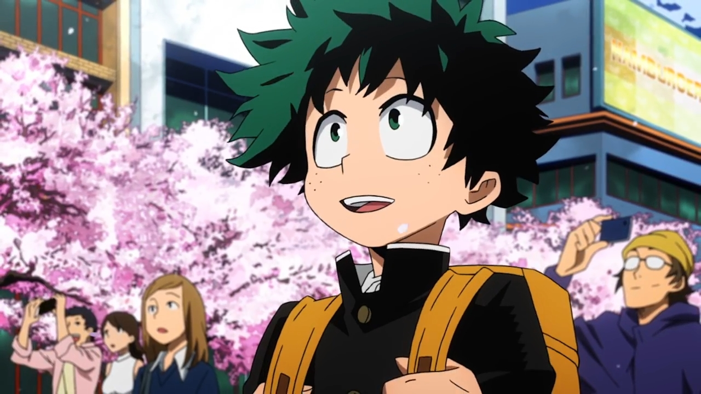
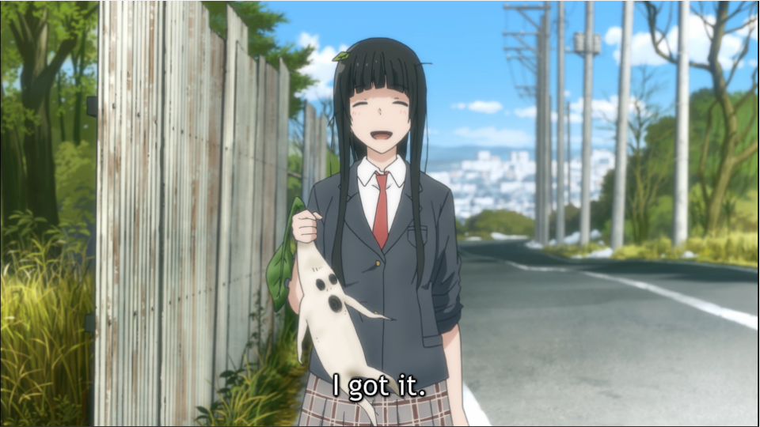

---
{
  title: "RockmanDash’s Top Anime of Spring 2016",
  tags:
    [
      "Rockmandash Rambles",
      "Top Lists",
      "AniTAY",
      "Anime",
      "Top Anime of Spring 2016",
      "Spring 2016",
    ],
  published: "2016-07-19T17:30:00-04:00",
  attached: [],
  kinjaArticle: true,
}
---

<video autoplay="" loop="" muted=""><source src="./dnxfqqwnyix1kfc43whh.mp4" type="video/mp4"/></video>
 It’s that time of year again, where we finish up another season and the reviews
  keep on pouring out. This spring season was pretty great, so I’m gonna tell you what I think are the best! Welcome to
  RockmanDash’s Top 5 Anime of Spring 2016.

<h3 class="sc-1bwb26k-1 fvCjqJ" id="h105976">Thoughts
  on the Season Overall</h3>

If you watch seasonally, you’ll find that there are a few trends with seasons. From
  lackluster to top heavy (my personal favorite), there’s all sorts of seasons but this spring season is one that most
  people rather enjoy: The all around quality season. In a season like this, there’s no real show that will blow you
  away, but everything’s pretty great. It has the side effect of making lists like this more boring and less likely to
  find a personal favorite, but lots of people love it because there’s always something interesting to watch. This
  season was a noticeable example of this type of season in particular because <strong>*SO MUCH STUFF WAS GOOD*</strong>.
  Even in just the AniTAY community, there were people saying this was the best and most enjoyable season they’ve seen,
  which is saying something. That’s not my position, but it was a great season and there were a lot of great shows to
  watch.  

<h2 class="sc-1bwb26k-1 fvCjqJ" id="h105977">Rules
</h2>

My rules of this list are simple: if it aired/released this season, it can go on
  this list. I don’t see the point in only giving a show one chance during it’s airing season, and this is my list so
  I’ll list my favorite shows regardless of what season it started on. If this means that one show hogs the top spot for
  2 seasons, than good for that show! If it’s an OVA or movie that came out during the duration of the season I fell in
  love with, then it may be there. Also, I think that the seasonal split is arbitrary and unnecessary, so it’s
  completely gone here. Sorry about that, but that’s how I’m doing it. 

 Just an
  FYI, the placement of the show in the list is mostly based on my experience and enjoyment of the work, so if you’re
  wondering why something isn’t where you think it should be or you can’t really tell via the justification, that’s
  probably why. Keep in mind, just because a show is lower on the list doesn’t mean it’s bad - all of these are great,
  and a lower placement isn’t a mark against the show, at this point it’s nearly all personal preference.

<h4 class="sc-1bwb26k-1 fvCjqJ" id="h105978"><strong>Dishonorable
  Mention:<em> Re:Zero</em></strong></h4>

<iframe allow="accelerometer; autoplay; clipboard-write; encrypted-media; gyroscope; picture-in-picture" allowfullscreen="" frameborder="0" height="315" src="https://www.youtube.com/embed/UWjiUPTtgDA" width="560"></iframe>

<strong>Made by: </strong>White Fox

<strong>Genre:</strong> Drama, Fantasy 

<strong>Plot Summary: </strong>On the way
  back from the local convenience store, high school student Subaru Natsuki is suddenly transported to another world and
  finds himself in a town straight out of your typical fantasy RPG. Burning with excitement, he explores the town, only
  to be attacked by a group of thugs. To his surprise, he is saved by a mysterious silver-haired girl, and Subaru
  decides to return the favor by helping the girl search for her stolen insignia. When they finally manage to get a
  lead, Subaru and the girl are killed before they can find the culprit or insignia. Subaru then awakens in the same
  place he started, except his injuries are gone and the girl is nowhere to be found. He discovers that by dying, he is
  able to return to a certain point in time—an ability he dubs “Return by Death”. - <em>Plot Summary from
    the </em><a class="sc-1out364-0 hMndXN sc-145m8ut-0 gIacKn js_link" data-ga='[["Embedded Url","External link","http://anitay.kinja.com/the-13-anime-of-spring-2016-you-should-be-watching-1777225329",{"metric25":1}]]' href="http://anitay.kinja.com/the-13-anime-of-spring-2016-you-should-be-watching-1777225329" rel="noopener noreferrer" target="_blank"><em>13 Anime of Spring 2016 You Should Be Watching Article</em></a>

<strong>Justification &amp; Thoughts: </strong><em>Re:Zero </em>is for the most part
  a great show with an interesting premise, solid characters and unique structure<em>,</em> a show that would normally
  be pretty high on a list like this. The reason it’s sitting as a dishonorable mention though is because it blew up on
  my face, irritating me to no end. The stupidity of the main character Subaru was an aspect of the show that always
  annoyed me, but as the show progressed Subaru became a worse and worse character, with every subsequent episode making
  me want to go into the show and beat him up more and more. The show has Subaru acting so stupid to the point that it
  breaks human comprehension, there’s no way any person or character can be as dumb as he is. <em>Re:Zero</em> has it’s
  strong points, but this fell off of my top list because it’s literally making mad when I watch it, and that’s a no go.
  The worst part is the show is doing this not because of the story elements like a good show may do, but because of the
  stupid of a character. Sorry, but no thanks. 

<h4 class="sc-1bwb26k-1 fvCjqJ" id="h105979">Honorable
  Mention: <em>JoJo’s Bizarre Adventure: The Diamond is Unbreakable</em></h4>

<iframe allow="accelerometer; autoplay; clipboard-write; encrypted-media; gyroscope; picture-in-picture" allowfullscreen="" frameborder="0" height="315" src="https://www.youtube.com/embed/UA0se96DWPc" width="560"></iframe>

<strong>Made by: </strong>David Productions

<strong>Genre: </strong>Action, Adventure, Comedy, Drama, Shounen, Supernatural

<strong>Plot Summary:</strong> Josuke Higashikata is just your normal teenager with a gorgeous hairdo, living an
  ordinary life in the town of Morioh. Well, except the fact that he can summon a Stand, a supernatural personification
  of his soul. Oh, and his father’s grandson is around, this guy calling himself Jotaro Kujo, who has a Stand of his
  own. Right, and there’s been this string of murders, involving some artifact called the Bow and Arrow, which is
  somehow connected to a man named Dio. It’s probably important to mention that a bunch of enemy Stand users are popping
  up, too, most of them eager to attack Josuke and his friends with their insane abilities for one reason or another.
  Hm, that’s not an ordinary life at all. Really, that’s downright bizarre. Some might even go so far as to call that
  the beginning of yet another bizarre adventure. - <em>Plot Summary from the </em><a class="sc-1out364-0 hMndXN sc-145m8ut-0 gIacKn js_link" data-ga='[["Embedded Url","External link","http://anitay.kinja.com/the-13-anime-of-spring-2016-you-should-be-watching-1777225329",{"metric25":1}]]' href="http://anitay.kinja.com/the-13-anime-of-spring-2016-you-should-be-watching-1777225329" rel="noopener noreferrer" target="_blank"><em>13 Anime of Spring 2016 You Should Be Watching Article</em></a>

<strong> Justification &amp; Thoughts: </strong>I’m pretty behind JoJo’s, so I
  actually haven’t seen this season.... Sorry! The reason it’s HM? Given my experience with the series, JoJo’s is an
  amazing series to the point that I’m pretty sure it should be on any top list, and I also know several people who
  would probably unleash their wrath if it wasn’t on a list like this so it’s gonna be here.

<h3 class="sc-1bwb26k-1 fvCjqJ" id="h105980">6. <em>Kabaneri
  of the Iron Fortress</em></h3>

<iframe allow="accelerometer; autoplay; clipboard-write; encrypted-media; gyroscope; picture-in-picture" allowfullscreen="" frameborder="0" height="315" src="https://www.youtube.com/embed/Ot_rsaEERHo" width="560"></iframe>

<strong>Made by: </strong>Studio Wit 

<strong>Genre: </strong>Action, Drama, Fantasy, Horror

<strong>Plot
  Summary: </strong> Set in a steampunk-based alternate world, <em>Kabaneri of the Iron Fortress</em> depicts the lives
  of people and societies decades, or possibly centuries, after a zombie apocalypse. The virus’s origination, and what
  happened in the years between then and current times are unknown, but the zombies, otherwise known as Kabane, still
  roam the world. Humanity has had time to adapt to this threat and have built many small, walled-in cities connected
  via rail systems used to transport goods and people. These walls are fortified, and so are the trains that travel
  between them, but the Kabane are relentless. If something goes wrong, that may spell doom for a city, or in the worst
  case, humanity as a whole. Luckily, one young inventor in particular aims to create weapons that will assist in the
  defensive killing of Kabane. <em>Kabaneri</em>’s story begins with him. - <em>Plot Summary from the </em><a class="sc-1out364-0 hMndXN sc-145m8ut-0 gIacKn js_link" data-ga='[["Embedded Url","External link","http://anitay.kinja.com/the-13-anime-of-spring-2016-you-should-be-watching-1777225329",{"metric25":1}]]' href="http://anitay.kinja.com/the-13-anime-of-spring-2016-you-should-be-watching-1777225329" rel="noopener noreferrer" target="_blank"><em>13 Anime of Spring 2016 You Should Be Watching Article</em></a>

<strong>Justification &amp; Thoughts: </strong>At the beginning of the season,
  everyone was hyping Studio Wit’s newest<em> Attack on Titan </em>clone, and now it’s a show that’s getting a lot of
  hate due to a lackluster ending. The true nature of the show lies in between, a solid and enjoyable show throughout
  that stumbled due to bad choices in the story, but had a lot of things going for it with an interesting cast, amazing
  Sawano soundtrack and a cool premise. I had a good time with it regardless and when it was great it was quite
  excellent so it deserves a spot on this list, even if it’s only the beginning of this list. 

<h3 class="sc-1bwb26k-1 fvCjqJ" id="h105981"> 5. <em>Joker
  Game</em></h3>

<iframe allow="accelerometer; autoplay; clipboard-write; encrypted-media; gyroscope; picture-in-picture" allowfullscreen="" frameborder="0" height="315" src="https://www.youtube.com/embed/W1vemcVD5A0" width="560"></iframe>

<strong>Made by: </strong>Production I.G. 

<strong>Genre: </strong>Drama,
  Historical, Military, Mystery, Spy

<strong>Plot Summary: </strong>Lieutenant Colonel
  Yuuki of the Imperial Japanese Army, who is also a skilled spymaster, founds a spy organization called D-Agency that,
  through a harsh training regimen, teaches its trainees a variety of combat, espionage, linguistic, and scientific
  skills, among other helpful tricks. He also drills into his spies three core tenets: “Don’t kill, Don’t get killed,
  Don’t get captured.” All three of these tenets go against the doctrine of the Imperial Japanese Army. After all is
  said and done, Yuuki is left with only 8 members of his training course, who are then sent on various deep undercover
  missions across the globe during the years encompassing World War II. - <em>Plot Summary from the </em><a class="sc-1out364-0 hMndXN sc-145m8ut-0 gIacKn js_link" data-ga='[["Embedded Url","External link","http://anitay.kinja.com/the-13-anime-of-spring-2016-you-should-be-watching-1777225329",{"metric25":1}]]' href="http://anitay.kinja.com/the-13-anime-of-spring-2016-you-should-be-watching-1777225329" rel="noopener noreferrer" target="_blank"><em>13 Anime of Spring 2016 You Should Be Watching Article</em></a>

<strong>Justification &amp; Thoughts: </strong>I’m a sucker for history, so up comes
  a history show about an interesting time period, a combination that got me very excited. This show wasn’t exactly what
  I was hyping it up to be, something that would keep the trend of great historical shows up with the quality of last
  season’s Rakugo, but that didn’t happen. We got a solid Production IG show, but it’s episodic nature kept the show
  from creating an extremely developed story that I could get completely immersed in. What we got wasn’t bad, but it
  wasn’t phenomenal either.

<h3 class="sc-1bwb26k-1 fvCjqJ" id="h105982">4. <em>Macross
  Delta</em></h3>

<iframe allow="accelerometer; autoplay; clipboard-write; encrypted-media; gyroscope; picture-in-picture" allowfullscreen="" frameborder="0" height="315" src="https://www.youtube.com/embed/FVopvQuNQqQ" width="560"></iframe>

<strong>Made by: </strong>Satelight 

<strong>Genre: </strong>Action, Mecha, Military, Music, Romance, Sci-Fi

<strong>Plot
  Summary: </strong>Eight years after the events of <em>Macross F</em>, a mysterious phenomenon known as the Var
  Syndrome is gradually consuming the galaxy. It’s up to a new generation of highly capable Valkyrie pilots to deal with
  this universal menace. And if they didn’t have enough on their plate already, the Aerial Knights Valkyrie fighter team
  from the Kingdom of Wind have come to challenge the Delta Squadron. - <em>Plot Summary from MAL</em>

<strong>Justification &amp; Thoughts: </strong>Recently one of our admins Dexomega
  convinced me to watch Macross, and I fell in love with the combination of music and mech. After watching <em>Macross
    Frontier</em>, a wonderful and serious space opera with a perfect mix of romance and music, I got to see this
  season’s <em>Macross Delta</em> which I quite enjoyed even though it was a lot more silly generic anime stuff. The use
  of music was incredibly effective, the characters were enjoyable, the premise and the actual conflict was engaging,
  and of course seeing the fights were awesome. I’m incredibly glad I’ve been able to see this series and I really quite
  enjoyed this entry in it.

<h3 class="sc-1bwb26k-1 fvCjqJ" id="h105983">3. <em>Space
  Patrol Luluco</em></h3>

<iframe allowfullscreen="" class="core-inset lazyload" data-recommended="false" data-src="https://rockmandash12.kinja.com/ajax/inset/iframe?id=dm-x41c1o4" frameborder="0" height="448" id="dm-x41c1o4" mozallowfullscreen="mozallowfullscreen" scrolling="no" webkitallowfullscreen="webkitAllowFullScreen" width="640"></iframe>

<strong>Made By:</strong> Studio Trigger 

<strong>Genre:</strong>
  Action, Comedy, Space, <strong><em>JUSTICE</em></strong> 

<strong>Plot
  Summary: </strong>Our titular Luluco lives in Ogikubo, where she lives with her father. She’s, in her own words, a
  “super-normal” girl, trying to live a “super-normal” life. Even while the Earth has been invaded and subsequently
  assimilated with aliens. In the midst of this, an accident with her father forces Luluco to seek help from the Space
  Patrol and its leader, OVER JUSTICE. Against her will, she gets drafted into the Space Patrol and made to help them
  with their investigations. Insanity ensues.<strong> </strong>- <em>Plot Summary from the </em><a class="sc-1out364-0 hMndXN sc-145m8ut-0 gIacKn js_link" data-ga='[["Embedded Url","External link","http://anitay.kinja.com/the-13-anime-of-spring-2016-you-should-be-watching-1777225329",{"metric25":1}]]' href="http://anitay.kinja.com/the-13-anime-of-spring-2016-you-should-be-watching-1777225329" rel="noopener noreferrer" target="_blank"><em>13 Anime of Spring 2016 You Should Be Watching Article</em></a>

<strong>Justification &amp; Thoughts: </strong>Trigger’s little short here is some
  of the most fun I’ve had with a short, if not an anime in general. The short structure allows Trigger to showcase
  their manic nature with every episode being short bursts of insanity and fun, and then combined with all the
  references under the sun and you got yourselves an enjoyable work, one of the best shorts out there. Great charcters,
  great gags, fun use of premise: it all adds up here, and the execution of this show makes it a blast to watch, a must
  watch if you liked anything from the studio.

<h3 class="sc-1bwb26k-1 fvCjqJ" id="h105984">2. <em>Flying
  Witch</em></h3>

<iframe allow="accelerometer; autoplay; clipboard-write; encrypted-media; gyroscope; picture-in-picture" allowfullscreen="" frameborder="0" height="315" src="https://www.youtube.com/embed/f-aun7tETE4" width="560"></iframe>

<strong>Made By:</strong> J.C Staff

<strong>Genre:</strong> Comedy, Magic, Shounen, Slice of Life, Supernatural

<strong>Plot
  Summary:</strong> 15-year-old witch Makoto Kowata begins her training as a professional witch by moving from Yokohama
  to Aomori to live with her normal cousins for a time. Although Makoto’s schedule isn’t too different from her cousins,
  her magical background adds some extra spice to her daily life. - <em>Plot Summary from the </em><a class="sc-1out364-0 hMndXN sc-145m8ut-0 gIacKn js_link" data-ga='[["Embedded Url","External link","http://anitay.kinja.com/the-13-anime-of-spring-2016-you-should-be-watching-1777225329",{"metric25":1}]]' href="http://anitay.kinja.com/the-13-anime-of-spring-2016-you-should-be-watching-1777225329" rel="noopener noreferrer" target="_blank"><em>13 Anime of Spring 2016 You Should Be Watching Article</em></a>

<strong>Justification &amp; Thoughts: </strong>While <em>Flying Witch </em>is
  technically about witches, it’s the quintessential slice of life, spending it’s time just doing stuff. It’s hard to
  for me to describe why many love this show so much, but every moment is pure bliss, enjoyable and relaxing to make
  your day all that much better. With funny character interactions, calming and enjoyable scenes, and entertaining
  moments of life that can’t help but put a smile on your face, I fell in love with this show and so did many others.
  It’s Slice of Life but it’s the best kind of Slice of Life, one that immerses yourself into the relaxing world it has
  to offer. Definitely worth a shot if you’ve ever enjoyed a slice of life show.

<h3 class="sc-1bwb26k-1 fvCjqJ" id="h105985">1. <em>Tanaka-kun
  is Always Listless</em></h3>

<iframe allow="accelerometer; autoplay; clipboard-write; encrypted-media; gyroscope; picture-in-picture" allowfullscreen="" frameborder="0" height="315" src="https://www.youtube.com/embed/0MvKQ9xMdzM" width="560"></iframe>

<strong>Made By:</strong> Silver Link

<strong>Genre:</strong> Slice of Life, Comedy 

<strong>Plot Summary:</strong> The
  epitome of slothfulness, Tanaka is a high school boy who dreams of nothing less than expending the least amount of
  energy every day. Helping him in his endeavor is his best friend Ohta, who attempts to keep the lethargic Tanaka
  healthy and happy. Together, they navigate through the bizarre world of new friendships, school, and everyday life. -
  <em>Plot Summary from the </em><a class="sc-1out364-0 hMndXN sc-145m8ut-0 gIacKn js_link" data-ga='[["Embedded Url","External link","http://anitay.kinja.com/the-13-anime-of-spring-2016-you-should-be-watching-1777225329",{"metric25":1}]]' href="http://anitay.kinja.com/the-13-anime-of-spring-2016-you-should-be-watching-1777225329" rel="noopener noreferrer" target="_blank"><em>13 Anime of Spring 2016 You Should Be Watching Article</em></a>

<strong>Justification &amp; Thoughts: </strong><em>Tanaka-kun</em> was a show that
  took me by surprise, a comedy that didn’t seem to be my cup of tea and seemed to be a one trick pony, but proved me
  and many wrong with it’s immense quality. While in a season of really solid shows, <em>Tanaka-kun</em> was the show
  that got the most enjoyment and laughs out of me due to it’s fantastic cast and hilarious relationships. I loved every
  minute of it and throughout the season it was always my go to show whenever I wanted a good time. As more characters
  filtered in, the relationships got more interesting, the show got more jokes, and the show consistently got me excited
  and got me laughing. It was a great comedy from beginning to end and I had a lot of fun with it.

<em>You’re reading Rockmandash Reviews, a blog focused on
  everything revolving Visual Novels, with stuff like Tech and Anime every now and then. If you want to read more of my
  writing, check out </em><a class="sc-1out364-0 hMndXN sc-145m8ut-0 gIacKn js_link" data-ga='[["Embedded Url","External link","http://anitay.kinja.com/",{"metric25":1}]]' href="http://anitay.kinja.com/" rel="noopener noreferrer" target="_blank"><em>AniTAY</em></a><em> and </em><a class="sc-1out364-0 hMndXN sc-145m8ut-0 gIacKn js_link" data-ga='[["Embedded Url","External link","http://kmtech.kinja.com/#_ga=1.91876634.1243070986.1463716221",{"metric25":1}]]' href="http://kmtech.kinja.com/#_ga=1.91876634.1243070986.1463716221" rel="noopener noreferrer" target="_blank"><em>KMTech</em></a><em>.</em>

