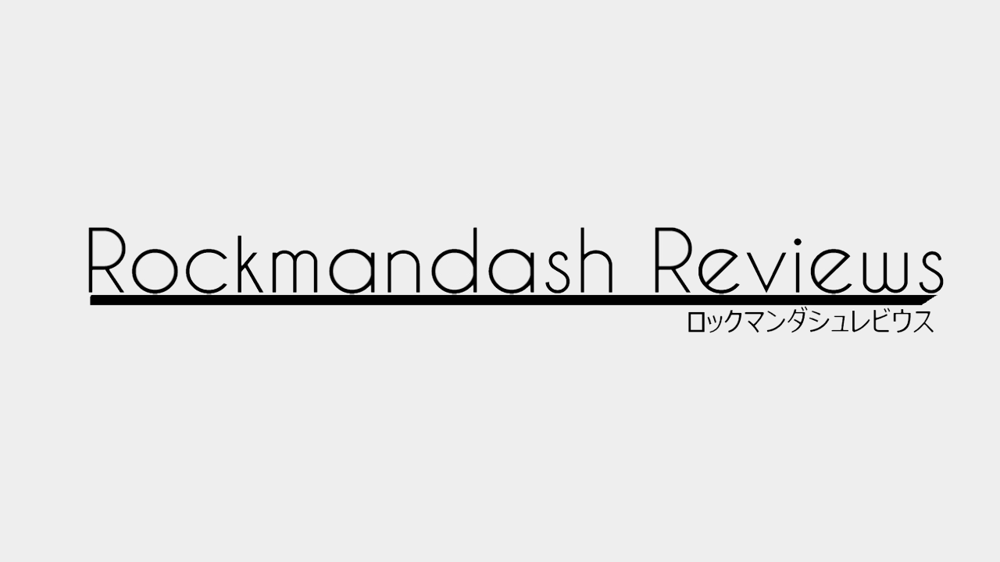

---
{
	title: "Rockmandash's Checklist for Reviews [1.01]",
	published: "2014-11-04T02:33:00-05:00",
	tags: ["Tay-classic", "Rockmandash Rambles", "Review", "Checklist", "Help"],
	kinjaArticle: true
}
---

When I write up a review, there are aspects of the work that I try to cover, and the best reviews in my opinion cover all of these. I decided to make a checklist of aspects that need to be covered in reviews, and I thought I might as well share it. Keep in mind that these are just things I think that should be present in a review and it's not in a specific order.

# Writing

* Premise - interesting or not?
* How is it told - Story Execution, etc
* Pacing - Slow, fast? How does this influence the work?
* Themes and ideals
* How does this make you feel, and how does the writing influence you?
* Are there issues with writing?
* Is it interesting? Why and how?
* Are there plot holes? If so, cover them.
* Is the work well written? How and why?
* Mood and Tone of story
* Character interactions and developments
* Atmosphere it creates - do I feel like I am in this world?
* If it's an adaptation - is faithful? if it's not, is it better or worse? why?

# Gameplay

* Is it fun? What do you like about it?
* Is it well made? polished? Buggy?
* Are there any issues that bother you?
* Any really amazing aspects?
* How does it handle?
* Goals? Objectives?
* Execution: how is it?
* What does it do special; what makes it stand out from the crowd?

# Visuals

* Is it "pleasing to the eye" - does it look good to you?
* Take into account age of the work and circumstances
* Technical: Animation, resolution etc
* What effects?
* Does the visuals fit with the story or what it's trying to do?
* What does it do special; what makes it stand out from the crowd
* Consistency and themes - mood and tone
* changes in successive releases

# Sound

* How does it affect you?
* Does it sound nice, "pleasing to the ear"? Why
* How is it used - It's one thing to sound, nice another to use it well
* how does the usage of this music effect the experience
* What does it do special; what makes it stand out from the crowd
* Mood and tone?
* Themes?
* Voice actors - how did they do?
* Technical?
* Changes in successive releases?

# Enjoyment

* How did it strike a cord with me?
* what did I personally like or dislike?
* how did it make me feel? justify why
* If the feelings are strong enough, then siphon into a seperate article.

Edit - On 11/15, did an very minor edit on this, bringing it up to 1.01
