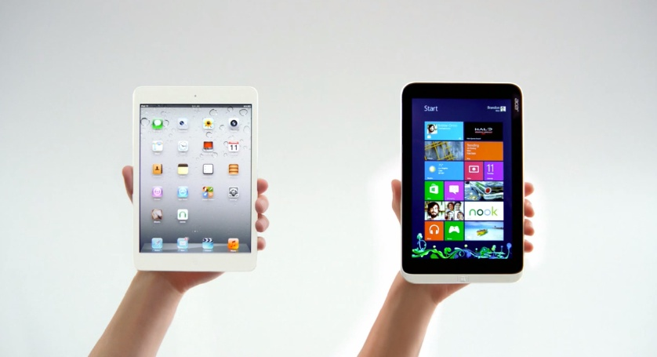

---
{
	title: "Rockmandash's Guide to Tablets for VNs",
	published: "2016-01-24T01:30:00-05:00",
	tags: ["Visual Novels", "Guide", "Rockmandash Rambles", "AniTAY", "On The Go", "Tablets", "FuwaReviews"],
	kinjaArticle: true
}
---

Many people in the VN community have turned to tablets for playing visual novels as they are one of the best options to improve your experience, but when people in the community look for one, they may ran into problems trying to pick the tablet they want to use. Like any electronic device, there are plenty of information on tablets out there, but because there’s so many options out and almost nothing comes from a visual novel perspective, it becomes hard to decide which one you want. Of course, this is because VNs are a niche genre and thinking of what aspects of tablets is important for visual novels is hard when you don’t have experience with both, but I’ll try to help. Welcome to Rockmandash Reviews, and today I have another guide, this one being a request from many people: a Guide to Tablets for Visual Novels.

Before I start, I need to mention that this is an extension to my [*Visual Novels on the Go*](/posts/rockmandashs-guide-to-visual-novels-on-the-go-1686233801) article, so if you need help with software and the pros and cons of getting a tablet for visual novels, check that. Just a refresher though, in that article I decided that the best tablet experience is a windows tablet based off of the x86 architecture, meaning it can run regular windows applications. This means in this video every tablet I am going to be talking about is going to run windows, so this means no iPads, no android tablets, because Windows is the most important part for compatibility with visual novels. Get it? Got it? Good. Let’s move on.

***

# Cheap or expensive?

If you’re interested in getting a tablet for VNs, the first thing you need to decide on, like any other product, is how much you want to spend. Of course, you’re going to get a better product if you spend more, but before you drop hundreds of dollars on a tablet, ask yourself this: what do you need out of it? If you want to replace your laptop or an aging tablet you own, spending a fair bit of money would make sense, but if you are using it to play visual novels, I would recommend getting a cheap one - tablets are inherently a creature comfort, and this is especially the case with VNs. If you are only using it for visual novels, the extra bumps that more expensive tablets give you may not improve your experience with visual novels, so you probably shouldn’t consider them. Yes, better build quality is always better but in respect to nearly everything else, you’re not necessarily getting a better experience - performance doesn’t matter with VNs as they’ll run on nearly anything without a problem, High Resolution screens are a double edged sword in regards to Visual Novels, and spending more on a bigger screen is entirely up to personal preference.

***

# The Quality of the Screen - High Resolution or Not?

When buying a tablet, the most important aspect is the screen, as it dictates your entire experience, and is the biggest differentiating factor when it comes to windows tablets. To me, spending the little amount to get an IPS display is a must as having a good display makes all the difference but paradoxically, as of January 2016 when this video was made more pixels on the display can actually make your games look worse, thanks to bad windows scaling on tablets. When picking up a recently released game, these can look absolutely fantastic Visual novels are almost always built to run one resolution and those are generally low. Thanks to this, windows can make games look flat out blurry -so consider that when playing your game. That being said, high res screens make for a better experience in almost every other case though so this is an important decision you need to make when you buy a tablet, if you want a high res screen for newer content and most tablet cases, or a lower resolution screen for older content.

***

# Subjective Aspects of Screens - Aspect Ratio & Size

While pixel count of a tablet matters in regards to the quality of the screens, there are elements of the screen that aren’t in regards to quality, but are more focused on how you want your device - light and portable or large and immersive? Square and Fit for VNs of the past, or wide and ready for what’s coming up in the future? These are the size of a tablet and the the screen ratio, which is completely personal preference when it comers to visual novels. First, in regards to Size - there are 3 major sizes - 8 inch, 10 inch, and 12-13 inch, each with different purposes. While there may be smaller tablets than 8 inches or larger than 12 inches, I can’t recommend them, as smaller tablets feel cramped when you use them, and large ones are way too large to hold.

If you’ve owned a gaming device before, ask yourself this: do you prefer a console experience or a handheld gaming experience? This preference is pretty similar to the screen size you’ll want on a tablet, as smaller tablets are similar in size to handhelds and larger tablets give you an immersion closer to consoles, and are similar to laptops in general, to the point that the category is pretty much convertibles or 2 in 1s now. Also, ask yourself if you’re going to use your tablet for work and stuff outside of visual novels - if so, go for a 10 or 12 incher - the smaller tablets don’t make for a great experience outside of visual novels as they feel very cramped in the desktop environment.

For VNs, 8 inches is my personal preference, because the compact size lets them be light and easy to hold, making them perfect for entertainment and reading on the go, like a small novel. From my experience, they work really well for especially visual novels because they are small and light so they are easy to carry and play anywhere, but like mentioned earlier, not so great for other tasks. On the other end of the spectrum is 12 inches: too large to use in your hand really and you kinda need a kickstand to use it comfortably, but it’s the popular size for convertibles because it’s plenty of screen real estate for getting work done in the windows environment, and in regards to VNs, it’s more immersive. 10 inches are a mix of both, more comfortable in other applications and more immersive, but manage to be usable in the hand and are portable, but you’ll probably want a kickstand regardless. This is up to personal preference really, and whatever you need will influence you, but if you are just using it for VNs, 8 inches is the best.

As for aspect ratios, that is the way the screen is shaped, the orientation of pixels. There’s the more square 4:3, the wider 16:9, or stuff in between, and they influence how you experience them by having massive black bars when dealing with content that isn’t the orientation. People like 4:3 for reading and tablet apps in general, it’s the orientation of an iPad and people like 16:9 for watching stuff, but in relation to Visual novels, base it on if you read older VNs more or if you read newer ones as a lot of older VNs are 4:3, and a lot of newer ones are 16:9, which at the moment there are more 4:3 VNs out there but most people are probably more used to 16:9. Idealistically, you’d want to get something in between like a 3:2 tablet, which will have bezels no matter what visual novel you play but with smaller bezels in comparison to others, but you can count the number of good 3:2 tablets on one hand and they’re expensive, so that’s kinda out of the question. Personally, I like the wider 16:9 aspect ratio in tablets but I’m a minority in the tech space, and this will come to personal preference.

***

# Performance

Performance doesn’t really matter in VNs as all of them are powerful enough to run VNs fine, but this will come into play if you get a tablet for other use cases. There are 3 types of chips in tablets as of 2015 for windows tablets, all by intel: Atom, core M, and the regular core i series. Atom is essentially a cell phone chip, and you’ll get cell phone like performance out of Atom chips, so they aren’t the greatest for something like editing, but should run light stuff like VNs and web browsing fine. Core M is a low power chip that is made for tablets and thin laptops, being cool enough to not require a fan while giving good enough performance for everything you need unless you’re doing something like editing, while the core i series is your full on laptop chips and will do anything but take up more power. That being said, you’re spending a lot more for the better performing chips so if you’re getting a tablet for VNs, just get an atom, you’ll be fine.

Also, like the processor, ram plays a small part in your experience with VNs, but it’s really important in normal use. I’d highly recommend you go 2gb at minimum, but 4gb is going to provide you a much better experience.

***

# Storage

On the other hand, with storage, get as much as you can afford as visual novels take up space, but if you can’t afford a tablet because of storage, just try to get the best tablet for your money. That being said, make sure it has a micro SD slot, as they make all the difference by being able to add a lot of cheap storage and because it’s removable you can easily load up VNs that you have on another machine.

***

# Etcetera

Consider a Chinese tablet! People don’t like Chinese electronics for completely valid reasons, but with tablets, they’re really ahead of the curve with windows tablets and quality of components at certain price points as the western market kinda gave up on tablets. If you prefer android, there are plenty of dual booting tablets so you can have the best of both worlds.

Before you do any purchases, you definitely need to check out reviews because while something may sound great to someone like me, it may not be the best for you, and someone who goes through reviewing these devices can grade them objectively, as well as teaching you something about a device you should know before you buy a tablet.

Last but not least, I’m going to remind those here, you should install touchmousepointer because it makes small touch targets much easier to hit and it makes the windows tablet experience much less frustrating. Now we’re done with that, time to move onto my recommendations.

***

# My Recommendations (As of January 2016)

Now that you know what type of tablet you want, here are some specific choices that fit the categories out there. I’ve tried to cover as much ground as possible but I’m not perfect so if you know a good tablet, just shoot me a message and I’ll look into if I should add it in. Also, these are subject to change as new devices come out.

## 8 inch Tablets - Small but Portable, Perfect for a VN

**Any Cheap Windows 8 inch tablet with a 1280x800 Display:** For those who are really price conscientious or have a favorite brand they like, any run of the mill 8 inch tablet will do, like the Lenovo Miix 8, Dell Venue 8 Pro (0riginal), Winbook 8, Chuwi vi8, etc, anything you can get on sale, at a great price or as a gift, anything goes. That being said I would say that an 8 inch tablet is a minimum though so don’t go smaller than this as your experience suffers, and stay away from the HP Stream tablets, I tried them and they are pretty bad with static noise issues in the headphone port so they aren’t recommended.

**A High Res, Widescreen Tablet - [_Chuwi Hi8_](http://techtablets.com/chuwi-hi8/) (~$100):** Forget spending $400 dollars on Dell’s Overpriced refresh of the Venue 8 pro, you can get essentially the same thing for $100 dollars. Yes, it’s a Chinese tablet, but it’s fairly impressive for what you get at $100 bucks - mainly a 1080p display that matches other high end small tablets and looks great for a fraction of the price and is a rarity out there, solid build material with it’s metal sides and provides a great experience overall. Hell, it has a feature that only the Chinese tablets have that improves your experience with it, and that is it can dual boot to android so if you like android games, this guy can do it all. Highly recommended! If you’re interested in buying, you can [buy it here](http://www.shareasale.com/r.cfm?u=1190339\&b=573201\&m=52031\&afftrack=\&urllink=www%2Egearbest%2Ecom%2Ftablet%2Dpcs%2Fpp%5F219480%2Ehtml). Also, it’s successor, the Hi8 Pro is a good option as well, with a newer processor and a type c port [for ~$120 here](http://www.shareasale.com/r.cfm?u=1190339\&b=573201\&m=52031\&afftrack=\&urllink=www%2Egearbest%2Ecom%2Ftablet%2Dpcs%2Fpp%5F256039%2Ehtml).

**A High Res, 4:3 Tablet - [_Xiaomi Mi Pad 2_](http://news.softpedia.com/news/xiaomi-mi-pad-2-review-a-tribute-to-ipad-mini-498310.shtml) with Windows (~250):** In Asia, Xiaomi is known as the Apple of China because of the quality of their products, but there’s a few big differences: Xiaomi releases products at great prices (which are, to be fair, hard to get), and use standard parts and software, which allows this guy to play all the VNs you want. Their newest tablet, the Mi Pad 2 is one of the few 4:3 windows tablets at this size, and it matches the quality an iPad Mini with a thin and high quality metal chassis. The only real downside to this for me is the fact it lacks a memory card slot, but other than that, it’s a pretty good pick. The windows version isn’t out as of writing this (comes out on the 26th), but the android version has gotten great reviews and this one won’t disappoint, it’s nice to see good small tablets again. [If you’re interested, here’s the link to buy it](http://www.shareasale.com/r.cfm?u=1190339\&b=573201\&m=52031\&afftrack=\&urllink=www%2Egearbest%2Ecom%2Ftablet%2Dpcs%2Fpp%5F268674%2Ehtml).

***

## 10 Inch Tablets - The Full Size Tablet Experience:

> *(pictured - Teclast X98 Air II)*

**The iPad Experience for Windows- [_Teclast X98 Air III_](/posts/teclast-x98-air-ii-review-an-interesting-dual-booting-1700897037) (~$130):** Do you like iPads? The Teclast X98 Air line is just for you, providing a great overall experience with it’s retina screens, 4:3 aspect ratio, best in class battery life and metal build quality that make it seem way more expensive than it really is, especially when you consider the budget Air III which is ~$130, in comparison to the ~200 I spent for my Air II I had. The Teclast tablets provide a full sized tablet experience that’s great and if you like this form factor, you’ll really like this tablet (It has some port placement oddities and software kinks though). If you’re interested, [here’s the link to buy it](http://shrsl.com/?~b63v).

**The Traditional Tablet- [_Chuwi Hi10_](http://techtablets.com/chuwi-hi10/review/) (~180):** If 4:3 on a windows tablet seems like a weird idea and you’re looking for a more traditional experience, the Chuwi Hi10 is a great option, just sitting under 200. It’s a tablet that provides one of the most complete tablet experiences with full sized usb ports, video out, and a great 16:10 1920x1200 display, and it all adds up to a tablet that really punches above it’s weight class. If you’re interested, [here’s the link to buy it](http://shrsl.com/?~b63s).

**The Budget Beast With a Pen- [_Cube i7 Stylus_](http://techtablets.com/cube-i7-stylus/review/) (~$350):** If you saw the Surface 3 and thought it would be way better with a faster processor or was too much, the Cube i7 stylus is for you! It’s essentially a budget Surface 2 - it has the same 10.6 inch 1080p display with wacom stylus support, but where it differs is it has Core M, but that shouldn’t be too much of an issue as it will do pretty much all the normal tasks you can throw at it along with some light gaming. Really, it’s pretty amazing what these tablets are for the money, it’s specs are kind of amazing for what it is. If you’re interested,[ here’s the link to buy it](http://www.shareasale.com/r.cfm?u=1190339\&b=573201\&m=52031\&afftrack=\&urllink=www%2Egearbest%2Ecom%2Ftablet%2Dpcs%2Fpp%5F227132%2Ehtml).

**The Premium 10 inch tablet - [_*Microsoft Surface 3*_](http://gizmodo.com/microsoft-surface-3-review-the-tablet-i-want-at-the-pr-1696598172) (~$500, Keyboard is an Extra $125):** Microsoft really knows what they’re doing with their tablets. While you’re spending a bit more money for this one in comparison to the Chinese tablets mentioned earlier, you’re getting a device that windows was really designed for, a well thought out 2 in 1 that has the ideal 3:2 aspect ratio, built in pen support, one of the coolest and best designed keyboards for tablets out there, and a polish you won’t find from most OEMs. If you’re interested, here’s the [Microsoft store link](http://www.microsoftstore.com/store/msusa/en_US/pdp/productID.314885500?icid=en_US_Surface3_cat_modG_010316).

***

## 12 Inch Tablets - 2 in 1's, Essentially a Laptop with removable Keyboards (Get the Keyboards):

**THE 2 in 1 - [_Microsoft Surface Pro 4_](http://www.gizmodo.com.au/2015/11/microsoft-surface-pro-4-australian-review/#_ga=1.104176384.1614825977.1451878508) (Starts at $900, Keyboard is an Extra $125):** It’s a device that defined what tablets and 2 in 1s were going to be like, and the newest one is better than ever with a better designed chassis that doesn’t have a tendency to overheat and a really great keyboard, one that moved over to chicklet keys. If you’re looking for a tablet that serves as a laptop with full laptop processors and a tablet that shows others how it’s done, the surface is a great piece of kit that you should check out. If you’re interested in buying, here’s the [Microsoft Store link](http://www.microsoftstore.com/store/msusa/en_US/pdp/productID.325711500?icid=en_US_SurfaceP4_cat_modF_010316).

**Other Convertibles - HP Spectre X2, Dell XPS 12, Lenovo ThinkPad X1, etc** - You know how I said that the Surface is showing others how it’s done? 3 Years after the original concept was shown, Microsoft’s partners have finally followed suit in creating devices that compete by... copying Microsoft, making tablets that are pretty similar to the Surface line while trying to match it in quality. They’re usually cheaper but try to improve on the surface in some way (Trackpoint ftw!). I personally wouldn’t buy one, but if you’re interested, definitely give it a shot.

**Budget 2 in 1 - Teclast X2 Pro (~$350, Keyboard is an extra $35):** If you don’t have that kind of money for a tablet like the Surface Pro 4 but you still need power for day to day tasks, power that atom won’t cut it for, theTeclast X2 Pro is something to consider with it’s 11.6 inch 1080p display, Core M, m.2 storage and 4gb of ram all for under the price of a Surface 3. If you’re interested, [check out the link to buy it here](http://www.shareasale.com/r.cfm?u=1190339\&b=573201\&m=52031\&afftrack=\&urllink=www%2Egearbest%2Ecom%2Ftablet%2Dpcs%2Fpp%5F252601%2Ehtml).

***

*Thanks for reading this article! Rockmandash is a frequent writer of Visual Novels and anime on *[*this blog*](/people/reikaze)* and the *[*AniTAY Blog*](http://anitay.kinja.com/#_ga=1.27039165.1614825977.1451878508)* as well. Come and check them out if you are interested in reviews and opinion pieces on these topics!*
