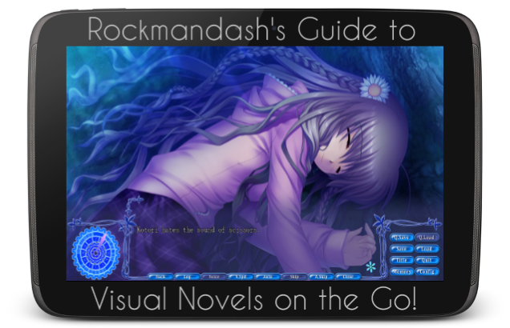
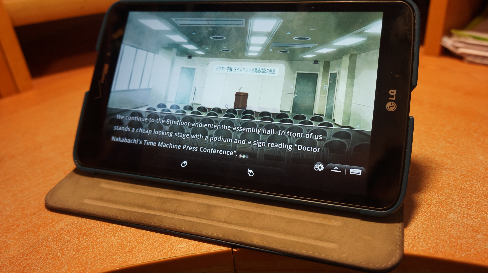
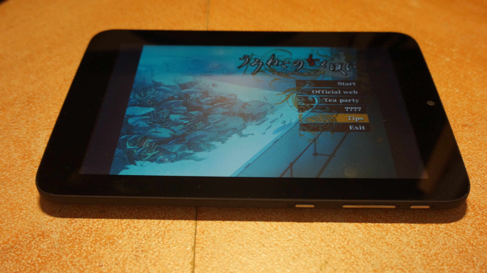

---
{
	title: "Rockmandash's Guide to Visual Novels on the Go",
	published: "2015-02-17T12:45:00-05:00",
	tags: ["Visual Novels", "AniTAY", "Tayclassic", "on the go", "Rockmandash", "FuwaReviews"],
	kinjaArticle: true
}
---

When I first got into the [Visual Novel ](/posts/the-beginners-guide-to-visual-novels-1541975662?rev=1424195118689)genre, there was something that struck me as odd about it: the lack of mobility. I know I prefer to read when I’m around and about, so I thought... What are some ways that we can consume Visual Novels on the go, in a more natural way? How can we read them in similar fashion to actual books? I’ve been spending some time to figure this out, and here are my results: Welcome to my guide to Visual Novels on the Go!

***

**Disclaimer:** The author of this post does not claim any responsibility for the awkward situations you may get into due to this guide and any resulting consequences from the use of this guide is the sole responsibility of the reader/ perpetrator.

***

# ***Why Should I care, and what’s it like ?***

If you’re content with the way you consume Visual Novels, that’s fine, but I think you should at least consider trying out a tablet because it’s a very nice experience. When you think about it, Visual Novels are a lot like books,being text heavy and all, but we consume it like a video game, which causes some ergonomic issues that can get on your nerves and hinder your experience. I am under the firm belief that the best way to get around this is playing VNs on tablets as they are the best of both worlds, with the ergonomics of books, but with all the flexibility the comes with being a video game.Well, it depends on the methods you use, but overall it’s a pretty big improvement in comparison to a laptop or desktop.

Being able to carry the device that can play a VN and bring it wherever you like is an almost liberating freedom, and the reading experience is a lot more comfortable, like reading a book on an ebook reader, touching the screen to go to the next line. Tablets are great for reading and media consumption in general, and that trait passes along to Visual Novels as well.

***

# ***How do I get VNs on a tablet?***

It really depends on the tablet you have, and the the method you use, but for most people with tablets, it’s kinda a pain. Those with Windows tablets should have no issues, as you can just get the Visual Novel in the same way you would with a laptop or desktop, and everything will work like it should but those with an Android or iOS tablet have to jump through some hoops to get most VNs working (And if you have a windows RT tablet… hahahahahahaha).

The biggest issue for Android/ iOS users is that Visual Novels are programmed like games and made in a way that isn’t easy to port. Almost all VNs are made for Windows and aren’t getting ported, so a large number of them just aren’t available on iOS or Android on the way you’d want to get it. There are two main methods for Visual Novels on Android and iOS: Streaming and Applications.

***

## ***Streaming: Splashtop FTW!***

<video src="./1272816347287232940.mp4"></video>

**Pros:**

\+ Can play pretty much anything

\+ More ergonomic

**Cons:**

\- Tethered to network unless you pay monthly

\- Experience depends on connection

I’m sure most of you who have a tablet also have a PC, so one of the most convenient methods is streaming your laptop or desktop in a way that you can use it on a tablet, and the most popular method to do this is Splashtop, which works on both iOS and Android. It’s a streaming app that will send you a remote connection through the internet to your tablet, thus giving you compatibility with almost every visual novel out there. The results are pretty good, and a lot better than what one would expect: good image quality, all the fancy effects from the full version and very little lag.

There are some cons with it though: because you’re streaming from your PC, you’re limited to your wireless network, and if you wanted to stream with a different network, you’d need to find a different method or pay a monthly fee. There’s also the fact that because it’s streaming from your PC, it’s reliant on how good your internet is... and as those on the AniTAY chatroom can tell you, and this meant it at times for me was a lag filled mess, but it was usually not bad. If you’re interested in learning more about Splashtop to stream VNs, check out [Fuwanovel’s guide with Splashtop](http://visualnovelaer.fuwanovel.org/2013/03/android-ios-sundays-play-any-vn-on-your-androidios-devices/).

Edit: While I haven’t personally tried it out, It has been mentioned that Chrome Remote Desktop is quite a good way to go about this as well, and I don’t believe you are limited to your network as well so that’s a pretty good option to take too.

***

## ***Applications: Games and Engines***

**Pros:**

\+ Not restricted to your network or PC

\+ A pretty nice experience in general

**Cons:**

\- Very limited selection, expecially on iOS

If you want to play Visual Novels on your android or iOS tablet when you don’t have internet access, you’ll have to rely on applications that run on the device. That being said, there aren’t a lot of VNs that do run on the devices, but there are a few of them, and there are some tools you can use to get them working, so here are my recommendations.

For those with iOS devices, the walled garden of apple has really screwed you over here, as you’re pretty much limited to the Visual Novels that are on the App Store, and there really aren’t a lot there. A few I’d like to mention however is *999: 9 hours, 9 persons, 9 doors (**aka The best game ever**)*, *Ghost Trick*, and *Banshee’s Last Cry,* but there’s a bit more out there and here’s a [VNDB list of games with English patches and iOS versions (but not necessarily both at the same time, look through it for VNs if you’re interested)](https://vndb.org/v/all?q=;fil=tagspoil-0.plat-ios.lang-en;o=a;s=title;p=1).

As for Android, because of it’s open nature, it’s pretty flexible, and it’s well documented, so I’m just going to go briefly over this, because there’s a [really well done guide on fuwanovel](http://forums.fuwanovel.org/index.php?/topic/1323-android-visual-novel-lets-play-visual-novel-on-the-go/) that you should check out that’s pretty in depth. Other than the very sparse pickings from the Play Store which is even worse than iOS, your primary way to get VNs on android that will run natively will be the VNDS interpreter. VNDS started off as a homebrew project for people with DS flashcarts where they would convert VNs to a format that the DS would be able to run. When Android got popular, they turned this into an app on the Play Store because of how flexible it is. VNDS has a lot of the popular VNs so it’s a pretty decent way to get into some of these games. That being said, VNDS has some cons: you aren’t getting the full experience because the conversion takes the images, music and text but it gets rid of the animations, and portrays it in a different way that can influence your experience. Some people find act of converting it or finding the converted versions to be a con as it can get annoying, but that’s a pretty minor issue. Also, you can also run most of the games that are based off of the kirikiri, Ren’Py and Nscripter games on android via interpreters, which gets a bunch of games, but still misses a lot of VNs I’ve enjoyed like *Kara no Shoujo* or *Muv-Luv Alternative*, which are only on PC in English.

Also, I’m just going to plug in here that handheld game systems like the Vita and 3DS have a decent selection of visual novels as well, like *Hotel Dusk, Zero Escape: Virtue’s Last Reward* or *Danganronpa*, so you shouldn’t overlook them as platforms for VNs on the Go, as they aren’t half bad, but do fall into the same issue as the other platforms that a **LARGE** majority of english VNs are only on PC.

***

# ***So, about those Windows tablets you mentioned…***

**Pros:**

\+ Can play most English VNs

\+ Does it pretty well

\+ Completely portable

**Cons:**

\- can be cost prohibitive

After trying all of those options, I essentially rage quit because of the cons and got a windows tablet, and never really looked back. Windows Tablets for everything else is a pretty mixed bag , but for playing Visual Novels, you couldn’t find anything better. Everything I’ve said that was a pro applies here, but with none of the cons, and the only major con I can think of is that they may be out of some people’s price range, but once you go to a windows tablet, and they aren’t expensive at all: Even the cheapest one out there for like 60 bucks will provide a decent experience for Visual Novels. Being able to play any Visual Novel on the go without any issues is really nice, tapping the screen to progress feels very natural, and it’s much more portable. You can play it pretty much everywhere, and I’ve been doing so, like while I wait for the bus on my daily commute. It just makes VNs much more accessible, and I’ve been able to get through a lot more of them because of it.

Also, one last tip: you may run into issues with the touchscreen where because the game was designed for mouse and keyboard, the touch targets would be hard to hit or something, but this is easily fixed with a third party solution that’s free that turns your screen into a manipulable touchpad called [TouchMousePointer](http://www.lovesummertrue.com/touchmousepointer/en-us/index.html), and once I got that, the experience has been pretty much smooth sailing from there with no issues, essentially near identical to a laptop or desktop in that aspect. There are some VNs that don’t play nice with Windows 8 like *Muv-Luv*, but those still have issues even on desktops, so I don’t think that’s really a con for a Windows Tablet when it comes to VNs.

***

# ***Conclusion***

I think that Windows tablets are really the best way to play Visual Novels, and if you are interested in visual novels, you should pick one up. That being said, even if you don’t have the money, if you have any of the stuff available, you should really give some of these methods a shot. The experience is quite a bit more ergonomic, and it enables you to experience VNs in a better way, in more places.

***

*Rockmandash is a frequent writer of Visual Novels and anime on *[*this blog*](/posts/)* and the *[*AniTAY Blog*](http://anitay.kinja.com/)* as well. Come and check them out if you are interested in reviews and opinion pieces on these topics!*

*Edit 2/19/15 - Added disclaimer and CRD.*
