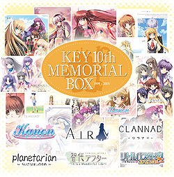

---
{
title: "Rockmandash's State of the Review Address - Key Marathon",
tags: ["Rockmandash12", "Reviews", "State of the Review Adress", "Key Marathon", "Announcement", "Ugghhhhhhhhh", "It'll be tedious", "but it'll be fun."],
authors: ['reikaze'],
published: '2014-03-31T00:02:00-04:00',
attached: [],
license: 'cc-by-4',
oldArticle: true
}
---

This isn't really a full on article but I'm going to be shifting gears a bit in my reviews
  in the next few weeks, so I'd like to get my plans out here. 

First off, I'm going to
  be finally wrapping up the loose ends of my <a class="sc-1out364-0 hMndXN sc-145m8ut-0 gIacKn js_link" data-ga='[["Embedded Url","External link","https://rockmandash12.kinja.com/type-moon-marathon-wip-1534726534",{"metric25":1}]]' href="https://rockmandash12.kinja.com/type-moon-marathon-wip-1534726534" rel="noopener noreferrer" target="_blank">Type Moon Marathon</a>,
  with Melty Blood and Fate Ilya coming up in the next few weeks. Of course, the marathon isn't over, as it'll be
  finishing once the Fate/Stay Night 2014 anime airs ,and there's a few games I still want to do that i'm either too
  lazy to play for review purposes (Fate Extra, Kagetsu Tohya) or aren't completely translated yet (Fate Hollow
  Ataraxia, Mahoutsukai no Yoru). 

<aside class="sc-1rh3ayr-6 jfFNjl inset--story branded-item branded-item--kinja" data-commerce-source="inset">

<a class="sc-1out364-0 hMndXN js_link" data-ga='[["Permalink page click","Permalink page click - inset headline"]]' href="https://rockmandash12.kinja.com/type-moon-marathon-wip-1534726534" rel="noopener noreferrer" target="_blank"><h6 class="sc-1rh3ayr-3 jRIPES">
    Rockmandash Reviews: <i>Type-Moon Marathon</i></h6></a>

In preparation for the Fate/stay night: Unlimited Blade Works Adaptation by Ufotable,
      I decided to…
<a class="sc-1out364-0 hMndXN sc-1rh3ayr-0 kOvmIi js_readmore inset--story__readmore js_link" data-ga='[["Permalink page click","Permalink page click - inset read more link"]]' href="https://rockmandash12.kinja.com/type-moon-marathon-wip-1534726534" rel="noopener noreferrer" target="_blank">Read more</a>

</aside>
Next is a bunch of straggler reviews that don't really belong in any specific
  marathon or catagory. I have a surprise review coming up next week, and I'm going to be finishing my Steins;Gate
  reviews because of the official US release. Other reviews that don't really have any deadline or category is I/O
  (another VN, probably in 1-2 weeks, depending on how busy I am) and Muv-Luv series (1-2 weeks after I/O, to respond to
  all the hubbub dex is making), the Sharin no Kuni fan disk (Review date TBA) and the Durarara! season one review
  (because of season 2, Review date TBA),

After the Straggler reviews is a marathon I'll cry about, a KEY marathon. I'm going
  to try to be as thorough as I can, doing all the Key stuff I can. IS YOUR BODY READY FOR THE FEELZ???? I'll be going
  in chronological order in the game releases for the most part, except I'll be doing Air before Kanon, and I'll be
  doing the anime reviews as well as the Visual Novel reviews. Expect a week to 2 week gap for the reviews, as there is
  a lot of content here to go through. I'll make a separate post like I did for the Type-Moon Marathon too. 

So, here's what to expect once I start this up:

<ol class="sc-1lmbno3-1 sizyJ" data-style="Number" data-type="List">
<li>Air - Seen Anime, haven't played game</li>
<li>Kanon - Seen anime, haven't played game</li>
<li>Clannad - This one will be long. And Amazing.</li>
<li> Planetarian - I already have a <a class="sc-1out364-0 hMndXN sc-145m8ut-0 gIacKn js_link" data-ga='[["Embedded Url","External link","http://petesgameroomforum.com/topic/5346010/1/",{"metric25":1}]]' href="http://petesgameroomforum.com/topic/5346010/1/" rel="noopener noreferrer" target="_blank">mini-review</a> for this on the forums I
    was on before I joined TAY, but i'll do a full review
  </li>
<li>Tomoyo After</li>
<li>Little Busters - Seen anime, haven't played game</li>
<li><a class="sc-1out364-0 hMndXN sc-145m8ut-0 gIacKn js_link" data-ga='[["Embedded Url","External link","http://rockmandash12.kinja.com/rockmandash-reviews-rewrite-visual-novel-1516111258",{"metric25":1}]]' href="http://rockmandash12.kinja.com/rockmandash-reviews-rewrite-visual-novel-1516111258" rel="noopener noreferrer" target="_blank">Rewrite...</a> HAHA I ALREADY DID THIS :D I guess I'll spice it up when
    I get there.
  </li>
<li>Angel Beats [Anime] - Get ready. This one... will be controversial.</li>
<li>Kud Wafter - HORRAY FOR WAITING FOR TRANSLATIONS... :(</li>
<li>Rewrite Havest Festa! - This'll be more about waiting for a translation instead of me being lazy... I guess I
    could learn japanese but KANJI IS HARD :(
  </li>
<li>Angel Beats VN - Also TBA, game isn't even out yet, and who knows when the translation will.</li>
</ol>

