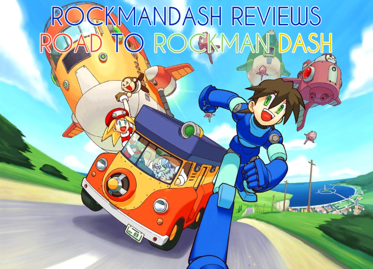

---
{
  title: "Rockmandash's State of the Review: Road To Rockman DASH!",
  tags:
    [
      "Rockmandash Rambles",
      "Rockmandash12",
      "State of the Review",
      "Road to Rockman Dash",
      "Megaman",
      "Legends",
      "EXE",
      "Battle Network",
    ],
  published: "2014-08-20T20:45:00-04:00",
  attached: [],
  kinjaArticle: true,
}
---

It's that time of the year again! The time where I tell you about my review schedule
  changing like 5 months before I actually start writing the new reviews! Like last time, I'm planning on shifting my
  reviews, so I'd like to get my thoughts out so you guys know it, and so I can get my plans out in a form I won't be
  able to lose. GET READY FOR THE ROAD TO ROCKMAN DASH!  

Before I discuss that
  though, I want to discuss my current plans for my writing. As for the <a class="sc-1out364-0 hMndXN sc-145m8ut-0 gIacKn js_link" data-ga='[["Embedded Url","External link","https://rockmandash12.kinja.com/type-moon-marathon-wip-1534726534",{"metric25":1}]]' href="https://rockmandash12.kinja.com/type-moon-marathon-wip-1534726534" rel="noopener noreferrer" target="_blank">Type-Moon review marathon</a>,
  It's pretty much done, thanks to stuff like <a class="sc-1out364-0 hMndXN sc-145m8ut-0 gIacKn js_link" data-ga='[["Embedded Url","External link","http://rockmandash12.kinja.com/rockmandash-reviews-fate-hollow-ataraxia-visual-novel-1612260148",{"metric25":1}]]' href="http://rockmandash12.kinja.com/rockmandash-reviews-fate-hollow-ataraxia-visual-novel-1612260148" rel="noopener noreferrer" target="_blank">Fate/hollow ataraxia</a> coming
  out so I can review. There's a lot of smaller Type-Moon stuff I haven't got to yet, but everything I want to get, I
  already tackled, or it's not out yet. The way I'm going to tackle the FSN anime later this year will be one review at
  the end, with a Rockmandash Rambles inserted at the end of the seasons, and a first impressions.  

<aside class="sc-1rh3ayr-6 jfFNjl inset--story branded-item branded-item--kinja" data-commerce-source="inset">

<a class="sc-1out364-0 hMndXN js_link" data-ga='[["Permalink page click","Permalink page click - inset headline"]]' href="https://rockmandash12.kinja.com/type-moon-marathon-wip-1534726534" rel="noopener noreferrer" target="_blank"><h6 class="sc-1rh3ayr-3 jRIPES">
    Rockmandash Reviews: <i>Type-Moon Marathon</i></h6></a>

In preparation for the Fate/stay night: Unlimited Blade Works Adaptation by Ufotable,
      I decided to…
<a class="sc-1out364-0 hMndXN sc-1rh3ayr-0 kOvmIi js_readmore inset--story__readmore js_link" data-ga='[["Permalink page click","Permalink page click - inset read more link"]]' href="https://rockmandash12.kinja.com/type-moon-marathon-wip-1534726534" rel="noopener noreferrer" target="_blank">Read more</a>

</aside>

As for the <a class="sc-1out364-0 hMndXN sc-145m8ut-0 gIacKn js_link" data-ga='[["Embedded Url","External link","https://tay.kinja.com/rockmandash-reviews-key-marathon-wip-1606707641",{"metric25":1}]]' href="https://tay.kinja.com/rockmandash-reviews-key-marathon-wip-1606707641" rel="noopener noreferrer" target="_blank">Key marathon</a>, It's still
  going strong. We are only half-way with it, after all. The thing is, I can't keep up the pace... I've gone kinda
  writing crazy over the summer, and this key marathon is a daunting task. I've been keeping up a once every 2 week
  schedule, but that's with a lot of prep work and already having opinions because I already experienced the VNs. The
  rest of the stuff is stuff that I've already seen the anime but haven't seen the VN (probably the worst because then I
  don't really have the motivation to go through), or I haven't experienced any of it. It's really hard to go through a
  VN if you've already seen the anime, and I just recently started school, so my time to get through them is lessened.
  After my clannad review, my Key reviews will be more of a monthly affair.

<aside class="sc-1rh3ayr-6 jfFNjl inset--story branded-item branded-item--kinja" data-commerce-source="inset">

<a class="sc-1out364-0 hMndXN js_link" data-ga='[["Permalink page click","Permalink page click - inset headline"]]' href="https://tay.kinja.com/rockmandash-reviews-key-marathon-wip-1606707641" rel="noopener noreferrer" target="_blank"><h6 class="sc-1rh3ayr-3 jRIPES">
    Rockmandash Reviews: <i>Key Marathon</i></h6></a>

Like I said a few months ago, I’m starting up a Key Review Marathon: Reviewing all
      the main Key…
<a class="sc-1out364-0 hMndXN sc-1rh3ayr-0 kOvmIi js_readmore inset--story__readmore js_link" data-ga='[["Permalink page click","Permalink page click - inset read more link"]]' href="https://tay.kinja.com/rockmandash-reviews-key-marathon-wip-1606707641" rel="noopener noreferrer" target="_blank">Read more</a>

</aside>

I'm burned out of VN's. I'm going to try to make up for that with the Ani-Debates
  and other stuff, but you know, other commitments and stuff. You have to be in the right mood to play through them, and
  I'm not in that mood at the moment. Yes, I'm kinda the VN guy here, but the reason why I do VN reviews is not because
  I only like VN's and anime, but because  

<ol class="sc-1lmbno3-1 sizyJ" data-style="Number" data-type="List">
<li>There's nobody else that's doing comprehensive reviews of them, so I feel like I needed to fill up the gap.</li>
<li> I wanted to spread the word, and doing solid reviews is one of the better ways to do so.</li>
<li>They are fun to make.</li>
</ol>
 By doing good reviews of obscure things, I can hopefully convince people to try out
  different stuff, like the bigger reviewers on youtube can do. I want to do other stuff, but the void for VN reviews is
  just so large, and it's hard to fill it up. There's a few other VN's I want to do, but those I can wait on. For now,
  I'm happy with what I have, and i'll take a hiatus from consistently doing VN reviews, and I'll do some more normal
  stuff. I'm going to be wrapping up my VN coverage for a while with a Rockmandash Rambles article about my thoughts on
  the state of VN's in the west.

After the key marathon, I'll stop doing a Consistent review marathon for a while.
  I'll attack some of the reviews sitting in my backlog (like Aoi Bungaku, and Durarara), seasonal anime/new releases,
  and i'll review things that peak my interest, but after it it should be a calm. Eventually though, probably winter or
  whenever I get time, I'm going to start up my ROAD TO ROCKMAN DASH! 

The Road to
  Rockman Dash will be a megaman review marathon, which finishes up with megaman legends. I find it very awkward and
  ironic that I haven't done any megaman reviews, and my username is Rockmandash12, the japanese name for megaman
  legends. But worse... is the fact that I've never finished the legends games. This needs to be fixed... and what
  better way to do it is a megaman review marathon! I'll stick to my roots of tackling traditionally less covered games
  in the series, so I'm going to be avoiding classic and X. Here's what I have in mind: 

<ul class="sc-1lmbno3-0 dpuHif" data-style="Bullet" data-type="List">
<li>Megaman Battle Network ( Not sure if i'm going to split this one up for review purposes. I want to do BN first
    because it gets a bad press from most reviewers... and because I pretty much have all the games and I feel like
    playing it) </li>
<li>Megaman Battle Chip Challenge ( I have it and I've never read any coverage about it. why the hell not?)</li>
<li>Megaman Starforce</li>
<li>Megaman Zero (in collection form on easy because I suck at it for GBA. I really like what inticreates did with the
    megaman formula, but lots of people ignore them. )
  </li>
<li>Megaman ZX &amp; Megaman ZXA</li>
<li>Azure Gunvolt (it'll be pretty late by the time this one comes out :/, not sure if I should push it up, but I
    don't have the TAY review for it. I want to do this because it's done by inticreates, the people who did megaman
    from Zero to ZXA. I may just not do a review of it however.)
  </li>
<li>Megaman Legends 1</li>
<li>Megaman Legends 2</li>
<li>If this lasts long enough, MN9, but I doubt i'll be that slow. Expect a review for that anyways. Not sure if i
    want to do this one though, because there's already so much press and coverage for it.
  </li>
</ul>

I'm kinda curious. which would you guys prefer? Should I save up everything I review
  and release them near each other, or would you prefer if I keep the way of releasing them when I think there's time to
  do so? It would be awesome if you could vote in the strawpoll.

<a class="sc-1out364-0 hMndXN sc-145m8ut-0 gIacKn js_link" data-ga='[["Embedded Url","External link","http://www.strawpoll.me/2374373",{"metric25":1}]]' href="http://www.strawpoll.me/2374373" rel="noopener noreferrer" target="_blank">http://www.strawpoll.me/2374373</a>  Last but not least, I have a desire to do
  a review of lesser known nintendo first party titles. Advance Wars, Custom Robo, Chibi Robo, Starfy, Super Paper Mario
  and such would be on that list. Will give more info when I get closer to that, and if I actually do it. That's it for
  my State of the review, and I thank you for reading this far, even if it's just about my review plans.

