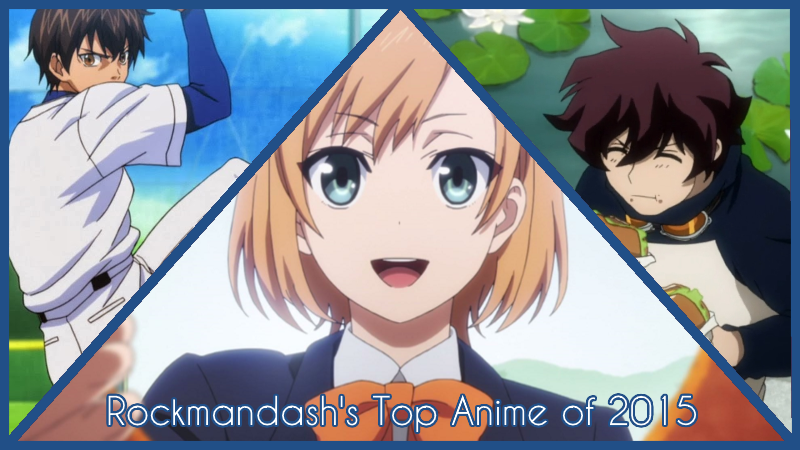
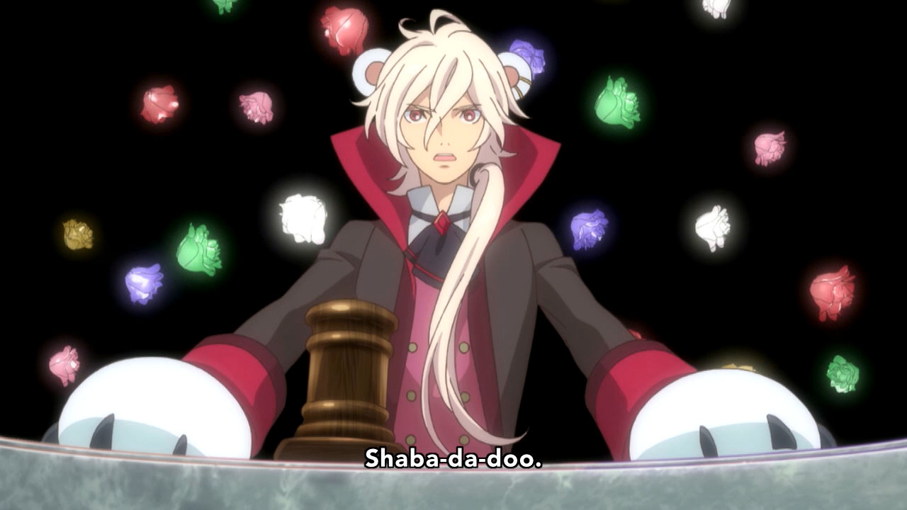
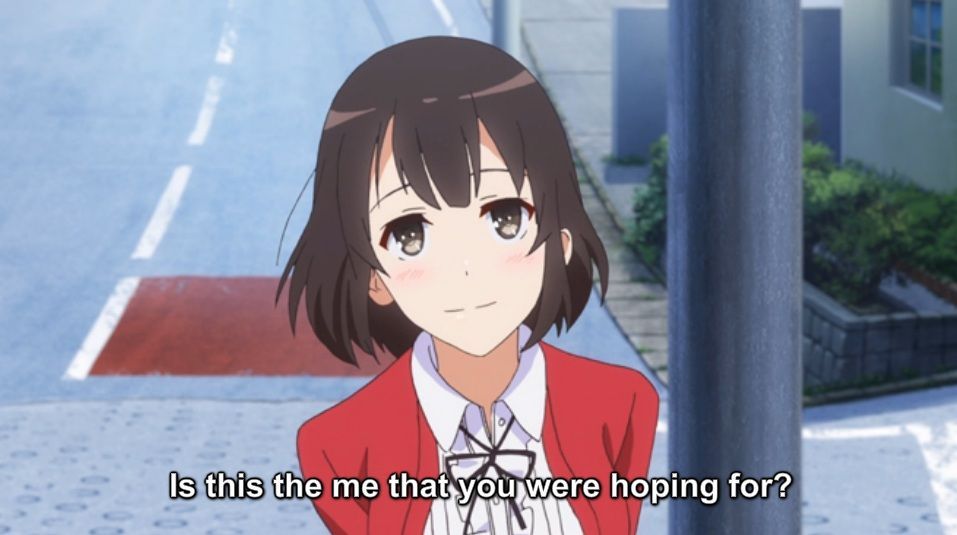
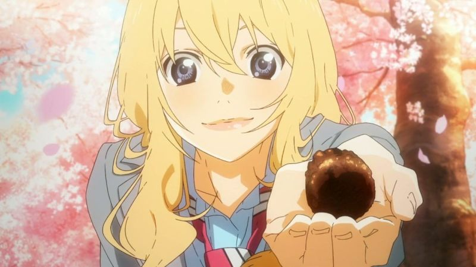
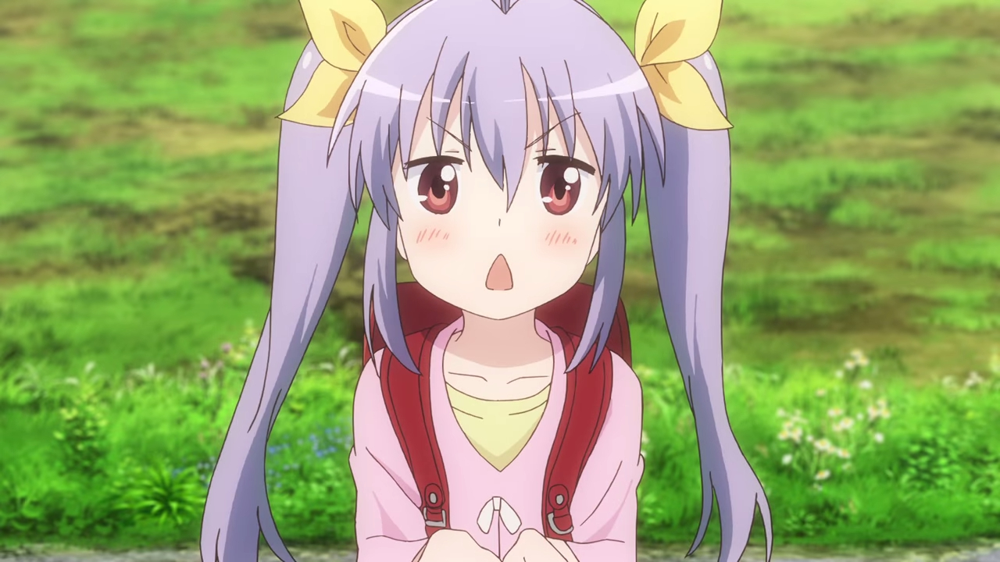
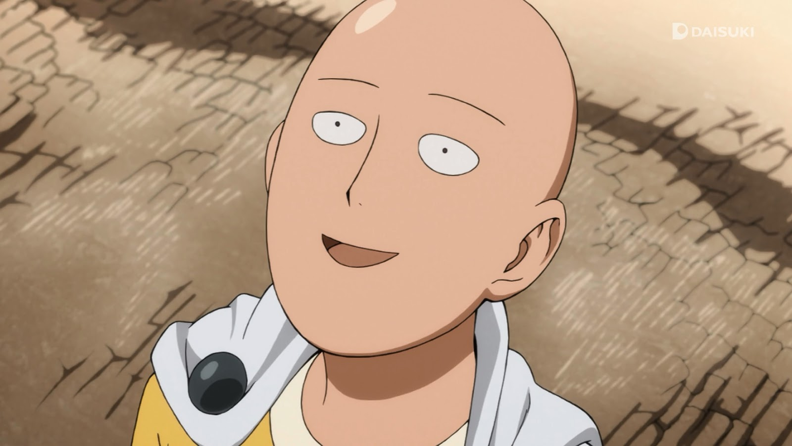
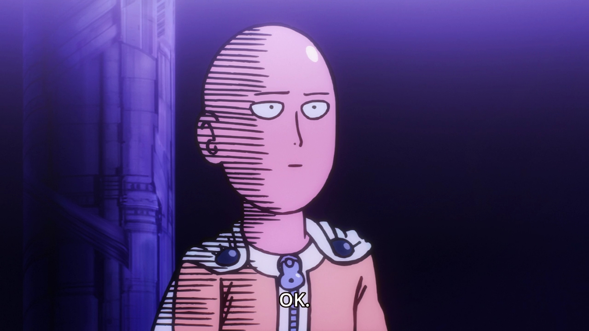
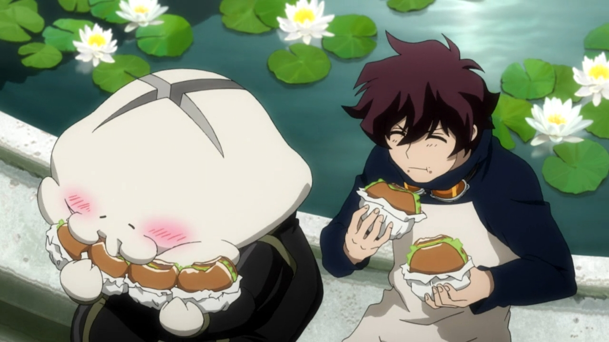

---
{
	title: "RockmanDash's Top 10 Anime of 2015",
	published: "2015-12-29T09:05:00-05:00",
	tags: ["Rockmandash Rambles", "Top Lists", "Top 10", "Anime", "AniTAY", "Top Anime of 2015"],
	kinjaArticle: true
}
---

You know this time of the year, the time of the year when everyone looks back to judge what this year has to offer. In this aspect I’m no different, with lists being something I always have appreciated to show off an individual’s tastes while having fun with the concept of lists in general. Welcome to my favorite anime of the year, my Top 10 Anime of 2015.

So, What are the rules of this list, you may ask? If it aired/released this year, it can go on this list, it’s just how I view it, as I don’t want to restrict a show to just the season it started airing. If this means that one show has a spot for multiple years, than good for that show! If it’s an OVA or movie that came out during the duration of the year I fell in love with, then it may be there.

Just an FYI, the placement of the show in the list is mostly based on my experience and enjoyment of the work, so if you’re wondering why something isn’t where you think it should be or you can’t really tell via the justification, that’s probably why. Also, just because a show is lower on the list doesn’t mean it’s bad - all of these are great, and a lower placement isn’t a mark against the show, at this point it’s nearly all personal preference.

***

#### *HM1: Fate/stay night: Unlimited Blade Works*

**Plot Description**: *Fate/stay night: Unlimited Blade Works* follows Emiya Shirou as he is dragged into a Fight-to-the-death tournament called The Fifth Holy Grail War, where people known as masters fight with Heroes throughout history, known as servants, for a chance to get the Holy Grail, which grants their wishes. This version of *Fate/stay night* is an adaptation of the Visual Novel route with the same name, and in comparison to the Fate route which the 2006 anime by Studio Deen adapted, it focuses more on action, and the main character. Also, Rin Tohsaka is the main heroine of this route/anime in comparison to Saber from the Fate route/2006 anime. – Plot Description from the [Fall 2014 AniTAY Collab](http://anitay.kinja.com/the-ten-anime-of-fall-2014-to-watch-1659473893)

**Justification & Thoughts:** I am one of the biggest Fate fans you can probably meet, which can be seen in the fact that I’ve talked about [Fate/stay night:](http://rockmandash12.kinja.com/fate-stay-night-unlimited-blade-works-tv-is-beautifu-1642722982#_ga=1.57633955.888615642.1438970662) [Unlimited Blade Works](http://anitay.kinja.com/anitay-reviews-fate-stay-night-unlimited-blade-works-1710281838) in countless articles, but one thing is clear: I don’t really care for the adaptation for the show. Really, I hyped it too much, and I felt the burn the whole way through because of it due to the with wonky pacing, rough execution of the story, a joke of a soundtrack that fails to do anything to the show, and overall rather meh execution that turned my favorite route of one of my favorite Visual Novels into a show that rarely managed to engage me at all, a show I tried to love, but couldn’t. Yes, it looks absolutely beautiful with some of the best fight scenes and scenery I have seen in this medium, and Yes, the last few episodes (especially episode 20) were just great, but those didn’t save it for me, the show that looked flawless on paper but came out to be a pretty messy show. It’s not a bad show, and if you’re interested in the series, it’s not a bad work to check out, but it really isn’t for me, a diehard VN guy.

**If interested, you should also check out** [my personal review](http://rockmandash12.kinja.com/fate-stay-night-unlimited-blade-works-tv-is-beautifu-1642722982#_ga=1.78553117.888615642.1438970662) and the [AniTAY review](http://anitay.kinja.com/anitay-reviews-fate-stay-night-unlimited-blade-works-1710281838) here.

***

#### *HM2: Jojo’s Bizarre Adventure - Stardust Crusaders Battle in Egypt*

**Plot Description: **In a Japanese jail sits 17-year-old Joutarou Kuujou: punk, fighter, delinquent...and possessed by a force beyond his control! Around the world, evil spirits are awakening: “Stands,” monstrous invisible creatures which give their bearers incredible powers. To save his mother’s life, Joutarou must tame his dark forces and travel around the world to Cairo, Egypt, where a hundred-year-old vampire thirsts for the blood of his family. But the road is long, and an army of evil Stand Users wait to kill JoJo and his friends... -*Plot Summary from MAL*

**Justification & Thoughts: ***JoJo’s Bizarre Adventure, *which really seems like AniTAY’s anime of the year considering that everyone here talks about it with praise and many have put it high up on their lists. That being said, It’s not the type of show that really hits my personal preferences, but it is pretty great and the inclusion of it on a top list for 2015 seems like something I need to do, even if I’m behind on it.

*Jojo’s Bizarre Adventure* is a show full of over the top action with big burly dudes and absurd scenes are hilarious. It’s action scenes are some of the best I’ve seen in a while, it’s overall quality is consistently high thanks to David Production’s great adaptation of it and the show keeps you constantly engaged with great comedy and awesome oneliners. If this sounds like your type of show, you’ll probably love it.

**If interested, you should also check out **[our review from Morie :)](http://anitay.kinja.com/jojos-bizarre-adventure-stardust-crusaders-the-anitay-1713076402#_ga=1.68499346.241020698.1444271310)

***

### *10. Yuri Kuma Arashi & Gatchaman Crowds Insight*

**Plot Description: ***For Yuri Kuma Arashi - *Long ago, a far-off planet known as Kumaria exploded, turning into a meteor shower that fell upon earth. This led to bears becoming violent and attacking humans, who created the Wall of Severance to separate humans and bears. Several years later, two bears named Ginko Yurishiro and Lulu Yurigasaki disguise themselves as humans and enroll in Arashigaoka Academy, where Ginko takes interest in a human girl named Kureha Tsubaki. - *- Plot Description from Wikipedia*

*For Gatchaman Crowds Insight- Gatchaman Crowds Insight* continues to follow the eventful lives of the Gatchaman who are now symbols of peace known all throughout Japan. Ichinose Hajime, our main character, has taken Berg-Katze, the villainous being who threatened to destroy the world, into herself, and two new characters join the cast - Tsubasa as a new Gatchaman and Gelsadra, an alien visitor. Crowds, the remote-controlled consciousnesses that were released into the world by Rui through the power Katze granted him, have been repurposed into helpful tools for humanity, but after numerous attacks by the terrorist organization “VAPE” and their red Crowds, talk of making Crowds illegal is in the air. Can the Gatchaman do anything to stop the the red Crowds? *- Plot Description by MaelwysSC113 from the Anime You Should Be Watching Article.*

**Justification & Thoughts: **Yeah, I started the list with a tie. Deal with it. The tie is pretty much because I like them for remarkably similar reasons, and with about the same intensity (there are things that bother me personally, but overall I really dig them for both), so the only thing that made sense to me is rolling them both at the same place. At some point in time this year, [Morie-Hime-Nee-Senpai ](https://kinja.com/MementoMorie)got me into shows directed by Kunihiko Ikuhara, the director of the famous Utena and Penguindrum. After Penguindrum, I started watching through the others and considering that *Yuri Kuma Arashi *aired this year, It seemed to be a shame to leave it out of the list. It does a lot right: absolutely amazing visual and narrative directing, great characters, an interesting story that one gets absorbed into, and interesting social commentary that’s thought provoking and really lead the show for me. It’s a show that’s definitely worth watching - if the yuri and 2deep4me aspects don’t bother you.

With *Gatchaman Crowds Insight*, we have... Politics in anime? While this may not be for everyone and I do have some gripes with how the story is told, it’s the dealing with social topics like *Yuri Kuma Arashi *that really got me into *Gatchaman Crowds Insight*, doing great job getting people to think about the world they live in and getting me hooked. while being a stellar story by itself, with great characters and a great premise. By striking at the very core of our society and messing with what it means to be people, the show presents ideas and gets you to think more than many works out there, and this is something to admire, something that one should hold dear. It’s also truly modern anime, striking at our modern society in a modern way instead of looking around to hide, associating with what it believes people are now, something I appreciated, especially when the lessons lie in the past. It’s also just a well handled show in general, with great action scenes, amazing development of characters and a really well rounded and stylish presentation. It’s truly a human story and I can’t go through this list without giving it my praises.

**If interested, you should also check out** [our review of *Yuri Kuma Arashi* from Morie ](http://anitay.kinja.com/yurikuma-arashi-the-ani-tay-review-1694675212#_ga=1.60175918.241020698.1444271310)and [our review of *Gatchaman Crowds *from Koda!](http://anitay.kinja.com/gatchaman-crowds-insight-the-ani-tay-review-1733947368#_ga=1.263205519.241020698.1444271310)

***

### *9. Noragami Aragoto*

**Plot Description: **In the second season of *Noragami, *the main focus is on Bishamon, god of war. She has many shinki due to her being unable to abandon spirits attacked by Ayakashi. She has a large group of shinki with her as leader, causing her trouble as she sometimes cannot tend to all of them properly, especially when one of them gets sick or is in pain. She has a strong hate for Yato, as a dark past binds the two of them. How will the horrifying events dated hundreds of years ago in combination with current evil happenings affect Yato and Yukine? *- Plot Description from MAL*

**Justification & Thoughts:** The first season of Noragami was pretty good, but this season really dialed up the awesome in the story - It’s very engaging, the lore just amped up how interesting the show was, it has great character interactions to the point of tears with extremely touching moments, the characters themselves were fantastic and overall the show and it’s handling of the story was really well rounded. While doing the stuff that made the first season great like the comedy from our not so friendly god Yato, this season really got us closer to the characters while presenting interesting scenarios, it handled tension quite well and was just engaging throughout, a lot of fun to watch. Also, the ending was just amazing, one that you can get absolutely absorbed in and one that really lead to a satisfying show, but one that gets you to want more, the ideal style of ending to me. Can’t wait for more!plz Bones plz continue this series ;-;

**If interested, you should also check out **[some of the Taykobon reviews and Noragami content on AniTAY](http://anitay.kinja.com/tag/noragami)

***

### *8. OreGairu (My Teen Romance SNAFU) S2*

**Plot Description: **So exactly what’s going to happen when Hachiman Hikigaya, an isolated high school student with no friends, no interest in making any and a belief that everyone else’s supposedly great high school experiences are either delusions or outright lies, is coerced by a well meaning faculty member into joining the one member “Services Club” run by Yukino Yukinoshita, who’s smart, attractive and generally considers everyone in her school to be her complete inferior? *- Plot Description of sorts from MAL who got it from CR....*

**Justification & Thoughts: **I’m a pretty big fan of RomComs in general, with this list having quite a bit of SoL and RomComs, but even when you like something, a subversion of that can great. With romance, *OreGairu/SNAFU* is of the best subversions of the genre, and it’s mainly due to having some of the best characters that this year had to offer. It was “something genuine”, showing a rom-com turned drama that shows the essence of people and their interactions, weaving it’s story around messy situations that require our characters to learn, and to grow. It’s a show that shined with a stellar execution that brings out the best of what they are offering, a show that let you get to know the characters and the conflicts, and one that just got into your head with the way people interact. It’s also one with a fair bit of comedy, a show that kept you entertained throughout. Really, *Oregairu *is a really enjoyable show, one that a person can easily fall in love with. Also, it’s opening from Yanagi Nagi makes it all that much better, an icing on the top of the cake for me.

**If interested, you should also check out** [Protonstorm’s AniTAY review :)](http://anitay.kinja.com/my-teen-romantic-comedy-snafu-too-the-ani-tay-review-1714840654)

***

### *7. Saekano - How To Raise A Boring Girlfriend*

**Plot Description: **The life of Tomoyo Aki, a highschool otaku working part time to support his BD hoarding. With remarkable luck, he bumps head-first into, Megumi Kato, the most beautiful girl he has ever seen. Naturally, the meeting twists his life into a complicated torrent of relationships. Eriri Spencer Sawamura, his half-foreigner childhood friend who’s always valued her relationship with MC. Kasumigaoka Utaha, a cold, composed renowned literary genius who shoves everyone aside from our protagonist. What is this? An eroge introduction?

The tale of a small not quite doujin circle, but not quite indie studio’s journey through the tough territory of comiket and beyond. - Plot Description from MAL

**Justification & Thoughts:** Ever since I fell in love with *The World God Only Knows*, I’ve been searching for more of that, a show that manages to pull off a meta romantic comedy that plays off of the tropes we all know and love well with really solid humor and interactions in general. You can’t believe how excited I was when I finally found what I was looking for in *Best Girl: The Animation Winter 2015* *Saekano* which even has the extreme Otaku as the MC! Every episode has been entertaining and hilarious, with absolutely amazing character interactions, excellent execution of meta elements, and just well written comedy in general. All the characters here are just fantastic and the premise really enables this show to use them to their full potential. Really, it’s nothing new, [as Fruity would tell you](http://anitay.kinja.com/ani-tay-podcast-episode-10-from-ani-tay-with-love-1684583335), but I find that it does everything extremely well and I adored every minute of it.

**If interested, you should also check out** [Protonstorm’s impressions article](http://anitay.kinja.com/saekano-knows-how-to-make-itself-better-1682761576#_ga=1.60314286.241020698.1444271310), and[ his AniTAY review of it](http://anitay.kinja.com/saekano-how-to-raise-a-boring-girlfriend-the-ani-tay-1693443663).

***

### *6. Shirobako*

**Plot Description:** I find that most summaries out there about *Shirobako* are a bit deceiving and don’t actually represent what happens in the show, stating that Shirobako is the story of five girls who, after making a short anime while members of their high school animation club, promise to come back together as adults and make their own full anime. I believe that, it’s the story of everyone involved in Shirobako trying to do their best, to succeed with their goals, usually involving the creation of anime. While the 5 girls do make an appearance in the story and are what the story starts with, they are just a piece of the puzzle, a part of the grand scheme, and it actually focuses more on the struggles of the animation studio Musashino, and the people there. *- Plot Description from my review of Shirobako*

**Justification & Thoughts: **The best anime about anime you will ever see has been just quite amazing this season, being extremely informative, and very entertaining. Animation: The Animation *Shirobako* may not be everyone’s cup of tea, but I absolutely adored it, and everything about it. It really made me appreciate all the things that the people making anime have to deal with, and to get this peek into the world of animation is something I really like. It’s also an entertaining slice of life show as well, and I just love the characters and interactions which really add a lot to the show to make it enjoyable, so it’s been nothing but good times for me, even enjoying the time I spent thinking about how the people making this show had to deal with the things it was talking about. Also, I just really love the little things that this show does, like [the little things it does with animation](http://kotaku.com/now-this-is-a-smart-anime-gag-1689819988), [the countless references](http://myanimelist.net/forum/?topicid=1343879), [hypnotizing dancing](https://www.youtube.com/watch?v=ZJLiu8zwAIE), [amazing drifting](https://www.youtube.com/watch?v=VdKKIqDj8ps). It’s been a lot of fun to watch :)

**If interested, you should also check out **[my review of this show](http://anitay.kinja.com/shirobako-the-ani-tay-review-1691227634/), or [Richard’s over on Kotaku](http://kotaku.com/shirobako-is-an-anime-about-making-anime-1680383301#_ga=1.196212073.473183827.1418699279).

***

### *5. Sports Anime 2015 - YowaPedal S2/Ace of Diamonds S2/Haikyuu!! S2/Baby Steps 2*

[http://www.dailymotion.com/video/x2dy12s\_…](http://www.dailymotion.com/video/x2dy12s_yowamushi-pedal-grande-road-opening-1-tv-size-hd-lastgasp-determination_music)

[http://www.dailymotion.com/video/x38nd0o\_…](http://www.dailymotion.com/video/x38nd0o_diamond-no-ace-2-new-opening_videogames)

**Justification & Thoughts: **If you asked the 2014 me of what anime would be on this list, sports anime wouldn’t be in the radar (and it wasn’t last year, as Ping Pong was completely absent from my 2014 list). If there’s one thing I have to give to 2015, It is definitely the year that I got hooked on sports anime, becoming one of my favorite anime genres out there. With the pros of Shounen without many of the flaws, So, you may ask, why 4 shows at the spot, which seems insane given it’s a top 10 list? Simple: I can’t pick between them, with all of them being absolutely fantastic in the experience department, with extremely well done characters, engaging stories, awesome scenarios, all make for a great watch that is almost always entertaining, etc, everything that makes sports anime great and pretty much everything [Koda says in his sports anime post](http://anitay.kinja.com/the-thrill-of-the-game-why-i-love-sports-anime-1690442761). 2015 was a great year for a sports anime fan, and if you like what you’re reading here, I would recommend any of these shows wholeheartedly.

**If interested, you should also check out** the aforementioned post about sports anime, and the many reviews we have: [Koda’s review of Yowamushi Pedal S1](http://anitay.kinja.com/yowamushi-pedal-the-ani-tay-review-1599570106), [Krakken’s review of Grande Road](http://anitay.kinja.com/yowamushi-pedal-grande-road-the-ani-tay-review-1697668045), [Koda’s review of Haikyuu Season 1](http://anitay.kinja.com/haikyuu-the-ani-tay-review-1637543181), and [Kristof’s review of Baby Steps 2](http://anitay.kinja.com/baby-steps-2-the-anitay-review-1728020664).

***

### *4. Your Lie in April*

**Plot Description: **Kousei Arima is a former piano prodigy who lost his ability to hear the piano after the death of his mother. Two years later he has not played the piano since and sees the world in monotone without color but is content with his life until he meets a girl who changes everything. Kaori Miyazono is a free spirited and beautiful violinist who changes Kousei’s perspective and makes his world colorful again, helping him return to the world of music. – Plot Summary from Mdub’s [You Should Be Watching Your Lie in April article](http://anitay.kinja.com/you-should-be-watching-your-lie-in-april-1648891546)

**Justification & Thoughts: **The fact that *Your Lie in April *moved up on this list in comparison to last year is both a testament to the fact that 2015 wasn’t as awesome of a year as 2014 was, but is also a testament to how good this show is, as it got even better in the second half.

[If ](http://anitay.kinja.com/op-eds-a-day-by-ani-tay-roundup-week-10-march-1st-8-1689842460#_ga=1.49179567.888615642.1438970662)[you’ve](http://anitay.kinja.com/is-this-anime-season-really-that-bad-1689767939) [spent](http://anitay.kinja.com/ani-kei-meeting-6-that-distance-1690281769) [any](http://anitay.kinja.com/ani-tay-podcast-episode-11-the-musical-edition-1690095853) [time](http://anitay.kinja.com/op-ed-a-day-66-nanairo-symphony-your-lie-in-apri-1682050967) [on](http://anitay.kinja.com/the-ani-tay-interview-ani-kei-strikes-1679606137) [AniTAY](http://anitay.kinja.com/ani-tays-top-15-anime-openings-of-2014-1672601925) [early](http://anitay.kinja.com/my-best-list-of-best-girls-of-2014-1678411311#_ga=1.90612755.888615642.1438970662) [on](http://anitay.kinja.com/op-ed-a-day-35-hikaru-nara-your-lie-in-april-1682043992) [in](http://tay.kotaku.com/about-the-cliche-love-story-1653388127) [the](http://anitay.kinja.com/ani-kei-meeting-6-that-distance-1690281769) [mear](http://anitay.kinja.com/fataliss-thoughts-on-anime-in-2014-also-my-top-5-list-1678425199), you would know how crazy everyone’s been over this show, and for a good reason. It’s blown my mind with how great it has been, and the emotions it’s evoked has really been something I have loved, and it’s only gotten better since I did my [top 10 anime of 2014](http://anitay.kinja.com/rockmandashs-top-ten-anime-of-2014-1676188044#_ga=1.90612755.888615642.1438970662) list, pushing itself to be one of my favorite romance anime I’ve seen. It’s a show that blends music seamlessly into the storyline better than almost every other show I’ve seen so far (yeah, nothing will beat[ White Album 2](http://tay.kotaku.com/dexs-review-white-album-2-1488422133) or [KnK](http://tay.kotaku.com/rockmandash-reviews-kara-no-kyoukai-the-garden-of-si-1524615358) in this aspect... sorry guys!), has passionate emotions and great characters. How can I not love this show? This show is a blast to watch, I love the development and reactions of the characters (and how relatable the characters were to me, especiallylly Kousei), and the show is just extremely well written. The show gets you emotionally attached with an amazing display of tone and a narrative that’s as moving as the music itself... it’s executed great and it’s pretty amazing.

**If interested, you should also check out **[Mdub’s You should be watching article](http://anitay.kinja.com/you-should-be-watching-your-lie-in-april-1648891546#_ga=1.16277823.888615642.1438970662), [Protonstorm’s resonation article](http://anitay.kinja.com/your-lie-in-april-resonates-with-me-on-multiple-levels-1681269152), [Fatalis’s food for thought article](http://anitay.kinja.com/kousei-s-mom-vs-kaori-food-for-thought-1679874907) and [Mdub’s review](http://anitay.kinja.com/your-lie-in-april-the-ani-tay-review-1691904314#_ga=1.16277823.888615642.1438970662) which I helped write.

***

### *3. Non Non Biyori Repeat*

**Plot Description: ***Non Non Biyori Repeat* continues following the lives of four girls: the first-grader Renge Miyauchi, the fifth-grader Hotaru Ichijo, the seventh-grader Natsumi Koshigaya, and the eighth-grader Komari Koshigaya, as they attend school and kill boredom in the village of Asahigaoka in the Japanese countryside. *- Plot Description by Koda from the Anime You Should Be Watching Article*

**Justification & Thoughts: **Yes, a slice of life is 3rd on the list, but when it’s good as this, it doesn’t matter. When you were a child, have you ever spent any considerable amount of time wandering around your neighborhood with the sheer curiosity of a child or spent time goofing around with friends? Non Non Biyori Repeat, being the masterpiece of slice of life that it is (And really, this is an amazing slice of life... one of the best with *Silver Spoon & Barakamon)*, hearkens back to the time of what it is to be a kid, while showing realistic yet charming relationships that are extremely well done, putting a smile on your face at all times as you watch this life unfold in front of you. It’s not a show of action, but a show that is to be enjoyed... there’s no plot here, or anything at all... but what this show does offer is relationships between characters that are both moving and entertaining at all times, humor that seems childish, but is rather brilliant. Really though, this show is a panacea, wiping all of your issues away as you watch through the show in a state of bliss, smiling and enjoying the scenes as they unfold, from the hilarious to the moving.

What sets *Non Non Biyori *far and away from it’s competitors is how it feels to watch, the experience it creates for the viewer. I’m sure everyone here has some fond childhood memories that they have, or some they wished to have: well, by being the best slice of life you can imagine, *Non Non Biyori* captures that feeling, and makes you feel it, soothing you as you experience this once again. It presents you the wonder of experiencing something new, the feeling of losing something you hold dear but eventually learn that everything’s OK, the feeling of just having fun with people you care about... feelings of childhood that you won’t ever be able to get back, but can try to get back in a show like this. In this time where we rush everywhere to do anything, a break is necessary, and what break is better than relaxing with some childhood experiences? This is a great experience, and it’s one I fell in love with.

**If interested, you should also check out** [our review from Koda](http://anitay.kinja.com/non-non-biyori-repeat-the-ani-tay-review-1732258015#_ga=1.16813360.888615642.1438970662) or [his impressions post](http://anitay.kinja.com/non-non-biyori-may-be-on-repeat-but-i-wouldnt-want-it-1720990507).

***

### *2. One Punch Man*

**Plot Description:** In this new action-comedy, everything about a young man named Saitama screams “AVERAGE,” from his lifeless expression, to his bald head, to his unimpressive physique. However, this average-looking fellow doesn’t have your average problem... He’s actually a superhero that’s looking for tough opponents! The problem is, every time he finds a promising candidate he beats the snot out of them in one punch. Can Saitama finally find an evil villain strong enough to challenge him? Follow Saitama through his hilarious romps as he searches for new bad guys to challenge! *- Plot Description from MAL*

**Justification & Thoughts: **While *One Punch Man* isn’t the savior of anime like how the internet jokingly refers to it, *One Punch Man* is a really good subversion of the superhero genre that’s been flooding the movies one that manages to take the seriousness of the action flicks and turn it into comedy by mocking the tried and true tropes, something I really enjoyed seeing because i’ve gotten so tired of these superhero movies on the silver screen. The core of the strengths this show has is because of the main lead and it’s namesake, Saitama who is one of my favorite leads I’ve seen in a long time. Saitama’s reactions putting a smile on my face throughout the show and the way that he just destroys everything in one punch is played more interestingly than you would think.

Because of the nature of the show, making fun of a really popular and easy to watch show,* One Punch Man* is also easily accessible, and when combined with the fact it’s extremely hilarious, *One Punch Man *is the popular show of the year, an engaging show that I and many others had a blast with. Unlike other shows though, it earns it’s popularity with some of the most engaging action scenes anime has to offer, tons of fluidity in the animation which makes it look great, hilarious interactions, etc. It’s a show that is a joy to experience, and it’s one I loved, definitely a must watch in the year and one of my favorites. It’s a show that maintains a high level of quality, one that makes for a blast to watch at all times. Plus, how the hell do you say no to something with a JAM Project opening like this?

**If interested, you should also check out** [Koda’s review on AniTAY](http://anitay.kinja.com/one-punch-man-the-ani-tay-review-1749225072).

***

### *1. Kekkai Sensen/Blood Blockade Battlefront*

**Plot Description:** A breach between Earth and the netherworlds has opened up over the city of New York, trapping New Yorkers and creatures from other dimensions in an impenetrable bubble. They’ve lived together for years, in a world of crazy crime sci-fi sensibilities. Now someone is threatening to sever the bubble, and a group of stylish superhumans is working to keep it from happening. *- Plot Description from MAL*

**Justification & Thoughts:** I said it back in Spring 2015 that *Kekkai Sensen *at was going to be the top of the list, and now that we’re at the end of the year, here it is, AOTY for me. Written by the genius who brought us the classic Trigun, *Kekkai Sensen* is an amazing episodic show that does a lot right, a show that will hook you in like few shows really can. It’s a show that presents an amazing world, a vibrant, extremely well crafted Monster New York that drags you in with interesting changes to reality, stylization that keeps you constantly engaged, and an atmosphere that makes this setting feeling more alive than pretty much any other setting out there. It doesn’t just end there either: pretty much everything about this show deserves praise, from the extremely memorable and awesome characters (Zapp!) to the brilliant presentation and music (Dat Jazz!) and the absolutely engaging scenarios that happen throughout this story (Chess!). This is a show that I admire as it is the type of show I always look for, being experience first by showing you some absolutely interesting, engaging and amazing scenarios that can either hit hard (Feelz about hamburgers... ;-;), be really entertaining (That guy where all the bad things happen XD) or just be absolutely outstanding to the point that every aspect about this show is just brilliant and and a joy to watch, showing how episodic shows are done right. Almost everything about this show is something I adored (The wait for the last episode.. not so much...) and it all added to a package that as amazing and hit all the right strings for me, Anime of the year.

**If interested, you should also check out** [Maelwys’ review on AniTAY](http://anitay.kinja.com/kekkai-sensen-the-anitay-review-1713944746).

***

*You’re reading Ani-TAY, the anime-focused portion of Kotaku’s community-run blog, Talk Amongst Yourselves. Ani-TAY is a non-professional blog whose writers love everything anime related. Click *[*here*](http://anitay.kinja.com/)* to check us out. If you want to read more of my writing, check out *[*RockmanDash Reviews*](http://rockmandash12.kinja.com/)* and *[*KMTech*](http://kmtech.kinja.com/)*.*
