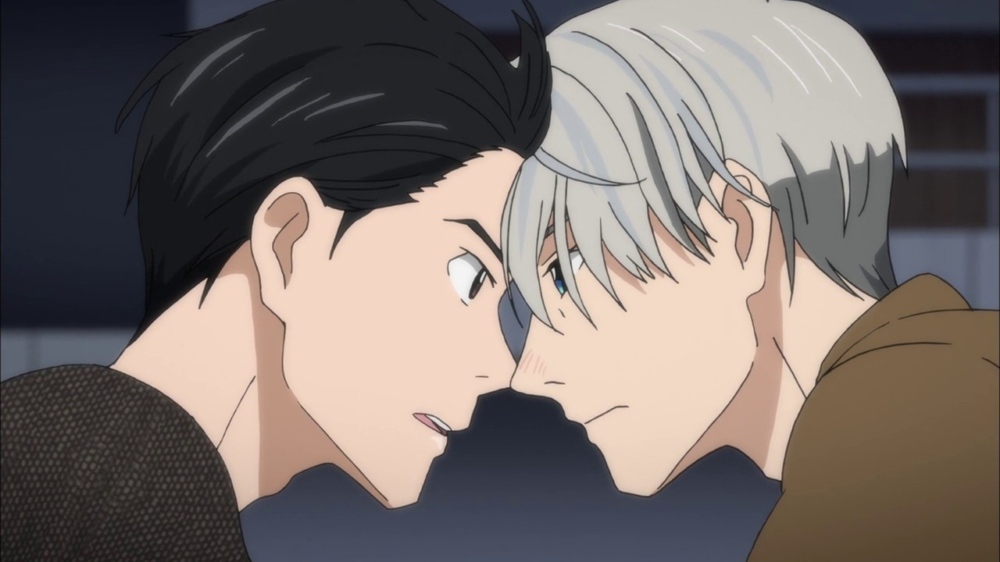
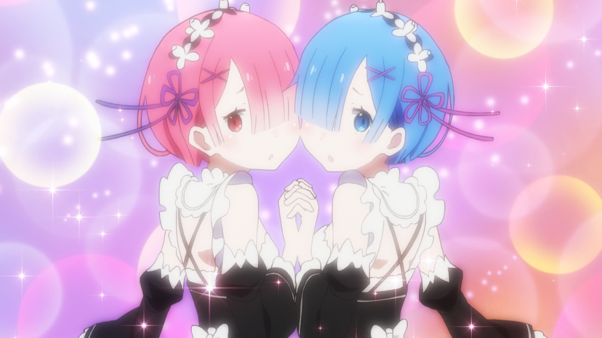
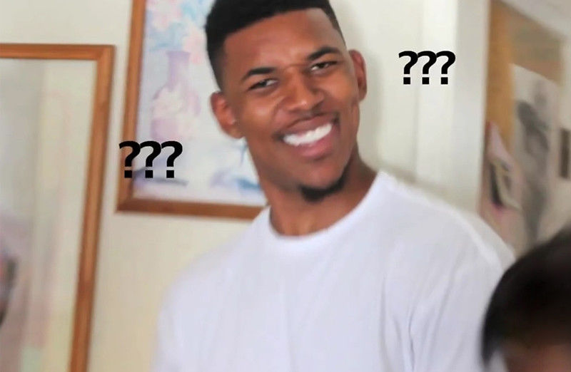

---
{
	title: "RockmanDash's Top 10 Anime of 2016",
	published: "2017-01-01T02:34:00-05:00",
	tags: ["Rockmandash Rambles", "Top Lists", "Anime", "AniTAY", "2016"],
	kinjaArticle: true
}
---

<video src="./tmky74yt3onpoiadf8eo.mp4"></video>

2016\. Just hearing this number brings memories of pain and suffering, a result of the terrible year that it represents. Thankfully for us anime fans though, we didn’t see this trend continue with the hobby we love: 2016 was a great year for anime, blowing us away with amazing experiences, wonderful experiments and more. Here’s what I thought were the best this year.

***

# Thoughts on Anime in 2016

While there was a lot of great anime this year but I have to say, this year was bizarre for anime. I’ve been watching anime seasonally for the past 4 years, and they usually followed a rather predictable cycle: Winter with a few good shows but VERY STRONG shows at the top, Spring with a boatload of good shows, summer being pretty average, and Fall being full of the blockbuster shows of the season, but this year.. well a few went along with the cycle, others said NOPE. Winter and Spring were on point, being some of the best anime seasons I’ve had the chance to experience, but the other 2, were some of the most lackluster. I’d have to say overall it was a good year for anime, but like the rest of the year, definitely bizzare.

***

# Rules

My rules of this list are simple: if it aired/released this year, it can go on this list. I don’t see the point in only giving a show one chance during it’s airing season, and this is my list so I’ll list my favorite shows regardless of what season it started on. If this means that one show hogs the top spot for 2 seasons, than good for that show! If it’s an OVA or movie that came out during the duration of the season I fell in love with, then it may be there. Also, I think that the seasonal split is arbitrary and unnecessary, so it’s completely gone here. Sorry about that, but that’s how I’m doing it.

Just an FYI, the placement of the show in the list is mostly based on my experience and enjoyment of the work, so if you’re wondering why something isn’t where you think it should be or you can’t really tell via the justification, that’s probably why. Keep in mind, just because a show is lower on the list doesn’t mean it’s bad - all of these are great, and a lower placement isn’t a mark against the show, at this point it’s nearly all personal preference.

***

# 10. *Flip Flappers*

**Anime Made By:** Studio 3Hz

**Genre:** Sci-Fi, Fantasy, Magical Girl, Flip Flap

**Plot Summary:** Cocona is a reserved high-schooler who has good grades and attends a prep school, but doesn’t really have any friends. Papika is an unrestrained bundle of energy who hasn’t a care in the world. One day, the two suddenly meet, and are whisked away to the fantastical otherworld of Pure Illusion, where a treasure said to grant any wish lay hidden. - *Plot Summary from the* [*17 Anime of Autumn 2016 You Should Be Watching Article*](http://anitay.kinja.com/the-17-anime-of-autumn-2016-you-should-be-watching-1789451240) 

**Justification & Thoughts:** *What a fantastic way to start a list.* I marathoned this one very recently after hearing members of AniTAY praise it to the moon, and even though I hesitated because Fantasy + Magical Girl aren’t really my cup of tea, what awaited me was some of the best animation of the year, some of the best storytelling you will find in anime, a cohesive experience that would constantly blow your mind, and an anime that can actually create a compelling mystery with fantastic twists. I just wish the last episode didn’t leave me like this:

***

# 9. ***KonoSuba: God’s Blessing on This Wonderful World!***

**Made by:** Studio Deen

**Genre:** Adventure, Comedy, Fantasy, Supernatural

**Plot Description:** Kazuma Sato was just an ordinary hikikomori NEET until he decides to leave his house, quickly finding himself killed and in front of the goddess Aqua. She then gives him the non-choice to either be reincarnated as a dog or be swept into a parallel fantasy world on a mission to defeat the devil king. He is allowed to take one powerful item or ability with him to help even the odds. He sarcastically remarks that he should just take Aqua herself, which immediately binds them together, much to both their chagrin. Aqua, despite being a powerful goddess, is more of a hindrance than a benefit to Kazuma, but she cannot return to the heavens until the devil king has been defeated. - *Plot Description by Kinksy from the* [*12 Anime of Winter 2016 You Should Be Watching Article*](http://anitay.kinja.com/the-12-anime-of-winter-2016-you-should-be-watching-1759823518)

**Justification & Thoughts:** We’ve seen this before, a guy gets sucked into a fantasy world… but you’ve never seen this as hilarious as *Konosuba*. While everything seems normal on first impression, when you look into this world, you’ll quickly realize that it’s absolutely hilarious and insane, and add to this insane world an equally insane cast and you got humor that is some of the best around and that really hold the show throughout. Every time I watched it, I knew I was going to have a good time and this show never disappointed, always making me laugh while putting a big stupid grin on my face. It’s great to see Studio Deen do so well after all of the consistent failure they’ve seen, and I can’t wait for season 2 in a few weeks. :)

***

# 8. *Flying Witch*

**Made By:** J.C Staff

**Genre:** Comedy, Magic, Shounen, Slice of Life, Supernatural

**Plot Summary:** 15-year-old witch Makoto Kowata begins her training as a professional witch by moving from Yokohama to Aomori to live with her normal cousins for a time. Although Makoto’s schedule isn’t too different from her cousins, her magical background adds some extra spice to her daily life. - *Plot Summary from the* [*13 Anime of Spring 2016 You Should Be Watching Article*](http://anitay.kinja.com/the-13-anime-of-spring-2016-you-should-be-watching-1777225329)

**Justification & Thoughts:** While *Flying Witch* is technically about witches, it’s the quintessential slice of life, spending it’s time just doing stuff. It’s hard to for me to describe why many love this show so much, but every moment is pure bliss, enjoyable and relaxing to make your day all that much better. With funny character interactions, calming and enjoyable scenes, and entertaining moments of life that can’t help but put a smile on your face, I fell in love with this show and so did many others. It’s Slice of Life but it’s the best kind of Slice of Life, one that immerses yourself into the relaxing world it has to offer. Definitely worth a shot if you’ve ever enjoyed a slice of life show.

***

# 7. *Girlish Number*

<iframe src="https://www.youtube.com/embed/yJ4UjVK2P64"></iframe>

**Anime Made By:** Diomedea

**Genre:** Comedy, Satire, Slice of Life

**Plot Summary:** Talent, perseverance, mental focus, professionalism, the ability to connect with fans, and luck are all key attributes to becoming successful voice actor. Fledgling voice actress Chitose Karasuma might not have any of those things, but she does have plenty of self-confidence (which may or may not be justified). After beginning her career in relative obscurity, Chitose finally catches her big break and a chance to show everyone that she is a star. The path to the top of the voice acting profession may be beset with adversity, but Chitose intends to rush down that path avoiding as much of it as she can. - *Plot Summary from the* [*17 Anime of Autumn 2016 You Should Be Watching Article*](http://anitay.kinja.com/the-17-anime-of-autumn-2016-you-should-be-watching-1789451240) 

<iframe src="https://www.youtube.com/embed/TG23kENLpKk"></iframe>

**Justification & Thoughts:** *Girlish Number* absolutely fantastic, the latest creation by *My Teen Romantic Comedy SNAFU*’s Author Wataru Watari but with a hint of *Shirobako* and Narcisism. It’s an absolutely amazing watch, noe that shows fascinating parts of an industry I love as well as being a wonderful character study that we would expect from Watari. Love it.

***

# 6. *Ace of Diamonds Season 2*

**Made by:** *Production I.G. , Madhouse*

**Genre:** *Comedy, School, Shounen, Sports*

**Plot Descriptions:** The story follows Eijun Sawamura, a pitcher who joins an elite school with a brilliant catcher named Kazuya Miyuki. Together with the rest of the team, they strive for Japan’s storied Koushien championships through hard work and determination. - *Plot Descriptions from* [*my Top Anime of Fall 2015 list*](http://anitay.kinja.com/rockmandashs-top-5-anime-of-fall-2015-1745376626#_ga=1.238308547.292320693.1457238947)

**Justification & Thoughts:** Yes, this is a leftover from Fall of 2015. Do I care? Not at all. This wouldn’t be my list without some sports anime and this was absolutely one of my favorites I’ve seen, one of the best anime of the year. *Ace of Diamonds*, while slowly progressing through its games this season was consistently exciting, consistently one of the best watches in anime, and I was consistently excited to go and watch it. Nothing beats that, and I hope we get more Ace in the future.

***

# 5. *Haikyuu!! Season 2 & 3*

**Anime Made By:** Production I.G

**Genre:** Shounen, Sports

**Plot Summary:** Having beaten their old rivals Aoba Jousai in the spring prefecture tournament semifinals, Karasuno finally has made it to the final match-up against the reigning undefeated prefecture champions Shiratorizawa Academy, known to be one of the top 8 teams in Japan currently with a team of exceptional powerhouses, captained by the nationally renowned Wakatoshi Ushijima. So if Karasuno’s dreams to make it to nationals is to come to reality, they will first have to face their longest, and most difficult match yet. Can these fledgling crows finally reach the heights they’ve all aspired to? - *Plot Summary from the* [*17 Anime of Autumn 2016 You Should Be Watching Article*](http://anitay.kinja.com/the-17-anime-of-autumn-2016-you-should-be-watching-1789451240) 

**Justification & Thoughts:**

# ***HYPEKYUU!!!!!!!!!!!!!!!!!!!!***

If you couldn’t tell from my *Ace* description above I really love sports anime, and Haikyuu has been an integral part of my sports anime experience. With 2 appearences this year (the reason it edges out Ace) and every episode being as hype as it could be with some of the best animation sequences you can think of, Haikyuu was a show to beat, one that would provide an amazing viewing experience as I watched it. I loved it to bits (even though I already knew what was gonna happen because I read the manga! yay).

***

# 4.***Tanaka-kun is Always Listless***

**Made By:** Silver Link

**Genre:** Slice of Life, Comedy

**Plot Summary:** The epitome of slothfulness, Tanaka is a high school boy who dreams of nothing less than expending the least amount of energy every day. Helping him in his endeavor is his best friend Ohta, who attempts to keep the lethargic Tanaka healthy and happy. Together, they navigate through the bizarre world of new friendships, school, and everyday life. - *Plot Summary from the* [*13 Anime of Spring 2016 You Should Be Watching Article*](http://anitay.kinja.com/the-13-anime-of-spring-2016-you-should-be-watching-1777225329)

**Justification & Thoughts:** *Tanaka-kun* was a show that took me by surprise, a comedy that didn’t seem to be my cup of tea and seemed to be a one trick pony, but proved me and many wrong with it’s immense quality. While in a season of really solid shows, *Tanaka-kun* was the show that got the most enjoyment and laughs out of me due to it’s fantastic cast and hilarious relationships. I loved every minute of it and throughout the season it was always my go to show whenever I wanted a good time. As more characters filtered in, the relationships got more interesting, the show got more jokes, and the show consistently got me excited and got me laughing. It was a great comedy from beginning to end and I had a lot of fun with it.

***

# 3. ReLife

**Anime Made By:** TMS Entertainment

**Genre:** Romance, Drama, Slice of Life

**Plot Summary:** Kaizaki Arata is 27 years old, jobless, and living on the expenses sent by his parents. He quit his first full-time job in just three months, and at the moment, his future is not looking very bright. On the way home (and right after his parents decide to stop sending him money), a man named Yoake Ryo stands in his path. Ryo is a member of the ReLIFE Laboratory, and informs Arata that he has been selected as a ReLIFE test subject. Should Arata choose to accept this offer, all his living expenses will be paid, and, depending on how well this experiment goes, he could even be hooked up with a job! All he has to do is take the ReLIFE drug and go back to high school for a year. Arata, who was unfortunately drunk at the time, signs his life away and wakes up the next day to the surprise of his unusually youthful appearance. - *Plot Summary from the* [*15 Anime of Summer 2016 You Should Be Watching Article*](http://anitay.kinja.com/the-15-anime-of-summer-2016-you-should-be-watching-1785625631) 

**Justification & Thoughts:** With ReLife, the question of “What’s my favorite show of the season” was over before it even began (consider it an Honorable 1st Place). Crunchyroll, for some odd reason, decided to release this show all at the beginning of the season, and I love them for it, enabling me to marathon a show that perfectly matches my preferences. I’m a sucker for romantic dramas, and to see one of them done so well in this fashion is something I really enjoyed. ReLife, more than anything, is about life, giving one a second chance while looking at what makes this tick, and this fuels a thrilling ride of character interactions that allow the viewer to get more and more attached to the cast as they watch. Along with that, ReLife has a great cast of characters with fascinating personalities, and plus, it’s funny, keeping the show always engaging to watch. Definitely a great time, and I can’t wait for more.

***

# 2. ***Kimi no Na wa. (Your Name.)***

**Anime Made By:** CoMix Wave

**Genre:** Drama, Romance, Supernatural

**Plot Summary:** The story is set one month after a comet has fallen for the first time in a thousand years in Japan. Mitsuha, a high school girl living in the countryside, wants to live in the city because she is tired of life in the country. Then, there’s Taki. He’s a high school student living in Tokyo with his friends while working as a part-timer at an Italian restaurant. He also has a strong interest in fine arts involving architecture. One day, Mitsuha dreams of herself as a young man. On the other hand, Taki also has a dream where he is a female student attending high school in the countryside. What’s the secret behind their dreams? - *Plot Summary from MAL*

**Justification & Thoughts:** Yes, my number 2 of this year is the best movie everyone except you have seen. When the internet started to sing it’s praises over the glory of *Kimi no Na wa*, I wasn’t the slightest bit surprised. That is, because during AX 2016, I was able to watch the world premiere of this movie and my mind was completely blown. While I always appreciated Shinkai’s works, I would be what most would describe as a Shinkai Skeptic because I would generally paint a negative picture on them when I talked about them. This is because I never really was engaged with them and the story they had to tell, but *Kimi no Na wa*... had my crying in my seat. Every moment was engaging, every moment was beautful, and most importantly, I was actually enjoying it, unlike so many of his works. This is one of the best anime movies ever made, and it’s easily one of the best this year has to offer. Definitely check it out when you have the chance.

If you’re interested in reading more thoughts about *Kimi no Na wa*, [check out the AniTAY review](http://anitay.kinja.com/kimi-no-na-wa-your-name-the-anitay-review-1783309415)!

***

# ***1. Shouwa Genroku Rakugo Shinjuu***

<iframe src="https://www.youtube.com/embed/K28Lcc-MdJs"></iframe>

**Made by:** Studio Deen

**Genre:** Drama, Historical

**Plot Description:** Framed as a recount to an ex-convict and aspiring pupil, *Shouwa Genroku Rakugo Shinjuu* is a character drama revolving around two budding performers of Japan’s oral comedy tradition—rakugo. Primarily set in the post-WWII Showa Era, the starkness of the period heightens the struggles of the friends as they attempt to make rakugo not only an emotional release, but also a livelihood. With life increasingly fraught with the tribulations of adulthood, they discover what it takes to truly succeed in this art form of “fallen words”, and the harsh sacrifices that must be made. - *Plot Description by Nomadic Dec from the* [*12 Anime of Winter 2016 You Should Be Watching Article*](http://anitay.kinja.com/the-12-anime-of-winter-2016-you-should-be-watching-1759823518)

**Justification & Thoughts:** When talking about how great *Rakugo* is, where do you even start? There was never a doubt in my mind that this was my anime of the year, it’s a fantastic show that (in my opinion) contends with the best I’ve seen, a show that ticks all my boxes by telling an interesting historical story on the decline of the art form of rakugo and the tale of our interesting characters that are fleshed out and feel real. While the plot of *Rakugo* may sound boring because it’s literally about telling stories, it is the execution, how it tells the story that makes this great, being able to handle all of its elements extremely well. The show has fantastic pacing, solid visuals, a great score, amazing characters and the best part: it’s consistently engaging with every episode being better than the last. It’s definitely a must watch, my favorite of the season. my favorite for the year, and one of my favorite anime ever. It’s a timepiece that displays a story of the past extremely well, and a shining example of what shows like this should be like. I never thought I’d say this, but well played Studio Deen, can’t wait for more in a few weeks.

***

*Thank you for reading! This is Rockmandash Reviews, a blog focused on everything revolving Visual Novels, with stuff like tech and anime every now and then. If you want to read more of my writing, check out AniTAY and Fuwanovel.*
