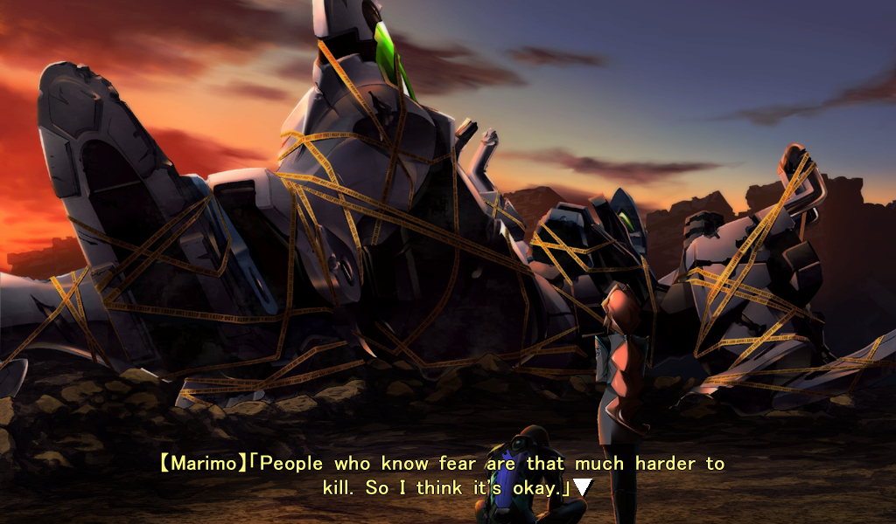

---
{
	title: "Rockmandash's Top 10 Favorite Visual Novels",
	published: "2015-05-11T19:00:00-04:00",
	tags: ["Top 10", "Visual Novels", "FuwaReviews", "AniTAY", "Tayclassic"],
	kinjaArticle: true
}
---

Visual Novels. It’s a medium that many don’t really have much experience with, but it’s certainly one near and dear to my heart, something that has significantly influenced many who have experienced it. Looking at this, I thought it would be interesting if I shared the Visual Novels that I think about when I think about the genre, the best of the best. Welcome to Rockmandash Rambles, and these are my Top 10 Favorite Visual Novels, the Visual Novels that I absolutely fell in love with, the ones I would recommend wholeheartedly to those interested in the genre.

***Note: As my tastes change, I will change this list, so this will be a constantly changing article. Don’t be shocked if you look at this in a month and it’s a totally different article. (but that’s probably not going to happen.) Also, there are a lot of VNs I haven’t played, so don’t get upset if the one you like isn’t here, I may not have played it.***

***Also, here’s the link to a video version of this if interested, but note that this is based off of the first version of the list, so it’s a bit different. (Namely, Muv-Luv is in a totally different place.)***

***

### Honorable Mention #1: *Mahoutsukai no Yoru*

**Plot Description: **Near the end of the Shōwa era in the late 1980s, an old mansion is rumored to be the home of a witch. After moving into the mansion, Aoko Aozaki begins to learn sorcery from a young mage, Alice Kuonji, the rumored witch of the mansion. Unexpectedly, a young boy named Sōjūrō Shizuki is drawn to the mansion and comes to reside with them as well.* - Plot Description from Wikipedia*

**Justification & Thoughts: ***Mahotsukai no Yoru *is a Type-Moon VN set in the late 80’s, with an absolutely phenomenal atmosphere that I fell in love with after playing the demo, then fell in love with even more after playing what was translated, which is about the first half.. This game has some of the best visuals in a VN, the art is just outstanding, and that music… wow. That being said, the issue is that I haven’t played all of *Mahoutsukai no Yoru *because the rest isn’t available in English thanks to the incredibly slow translation by Commie Subs, with it only recently being picked up by Beast’s Lair and actually having some progress. It would be unfair to put this above the others because I haven’t played all of it, so Honorable Mentions for you.

***

### Honorable Mention #2:* White Album 2*

**Plot Description: **Fall, when graduation is only half a year away.Haruki Kitahara, the final member of the light music club that dissolved, plays his guitar by the window after school in preparation for the school festival. It was the one and only adventure of a good student who spent two diligent years on his studies. But when a flowing piano melody and a voice as a clear as bell harmonize with his guitar… He goes from being alone, to being two, then three in the light music club, as the semester he dreamed of, no, hoped for, began. *- Plot Description from MAL*

**Justification & Thoughts: **I love a good romance, and this one is one of my favorites, with the amazing character interactions, moral grey zone and amazing drama. I watched the anime and fell in love with it, and it made me want to play it immediately. It was so good that it put both the anime and VN in very high regard. Unfortunately, I’ve been playing through the game as the translation rolls out, so as of 12/15/15, I’ve only seen Opening Chapter and parts of Closing, so like *Mahoutsukai no Yoru*, I think it would be unfair to put it on this list because I haven’t had the whole experience. If you want to see more thoughts about *White Album 2*, check out [Dexomega’s review of the anime](http://tay.kotaku.com/dexs-review-white-album-2-1488422133), and the [Kotaku review of the anime written by Richard Eisenbeis](http://kotaku.com/white-album-2-is-one-of-last-season-s-hidden-gems-1541072591).

***

### 10. *Kara no Shoujo & Kara no Shoujo 2 *- Beauty at all Costs

**Plot Description: **The year is 1956; a series of bizarre murders rocks the city of Tokyo. Tokisaka Reiji, an ex-cop turned private eye, joins the investigation at the behest of his friend Uozumi Kyozo, a detective in the MPD. At the same time, he takes on a missing persons’ case at a private all-girls high school, as well as a mysterious request from a girl named Toko to find her true self. As Reiji frantically struggles to crack the case, he learns that the murders bear an uncanny resemblance to a case in which his own fiancé was murdered six years ago. But try as he might, the body count just keeps rising... - *Plot Decription from VNDB about KnS1*

**Justification & Thoughts: **Rarely do you find a game that has it’s goals and relentlessly shoots for them, ignoring the fact that what it does may be against societal norms. How interesting is it then that this game very much does that, and that’s a relatively important part of the story? The first *Kara no Shoujo* may be quite possibly the most beautifully gruesome work i’ve experienced, as it’s extremely captivating, yet also is some of the most horrifying material you’ll find in this medium. It’s a weird paradigm, as everything this game does from its characters to it’s setting to the soundtrack ensnares you into some of the most horrifying works out there.

*Kara no Shoujo 2 *is a totally different beast, being a bit more *murder **mystery** *in comparison to the first’s ***murder** mystery, *focusing on completely different characters in comparison to the first one, but still being just as engaging (with an amazing and tear jerking ending to boot). I like it as much as I do the first one, so that’s why they’re now both at the same spot, but they are totally different so keep that in mind.* *If you want to see more thoughts about *Kara no Shoujo*, check out the Kotaku review of the [first game](http://kotaku.com/kara-no-shojo-the-kotaku-review-1486926848#_ga=1.21921464.241020698.1444271310) and the [second here](http://kotaku.com/kara-no-shojo-the-second-episode-the-kotaku-review-1740205675).

***

### 9. *Fate/stay night* – The Nasuverse Epic

**Plot Description: ***Fate/stay night* follows Emiya Shirou as he is dragged into a fight-to-the-death tournament called The Fifth Holy Grail War, where people known as masters fight with heroes from throughout history, known as servants, for a chance to get their wishes granted by the Holy Grail. - *Plot Description adapted from the*[* Fall Collab*](http://anitay.kinja.com/the-ten-anime-of-fall-2014-to-watch-1659473893)* and *[*Sequel Guide*](http://anitay.kinja.com/the-spring-2015-anime-sequel-guide-1689513875)* Written by Myself*

**Justification & Thoughts:** I hope you guys appreciate how good I think the rest of the material here is when *Fate/stay night*, the work that everyone here on AniTAY associates with me, is in 9th place. This epic of a work is by far the topic I’ve talked the most about on my time here, and for a good reason: This work is a well written, engaging epic, and when I say epic, I really do mean it. 3 extremely long routes, ranging from the ideals of altruism, challenging yourself and challenging your ideals, each telling its themes and message in an extremely personal way makes for a tale that truly captivated me. No work I have ever experienced before this has ever focused on the personal ideals nearly as much as Fate/stay night, and no work will ever shape my ideals as much as this one. the themes that they play with, the execution of the ideals in place, it makes for something I absolutely adore. If you want to see more thoughts about Fate… [well… ](http://rockmandash12.kinja.com/rockmandash-reviews-fate-stay-night-visual-novel-1613176306)[there’s a](http://tay.kotaku.com/rockmandash-reviews-fate-zero-ani-tay-1538163593) [lot on](http://tay.kotaku.com/rockmandash-reviews-fate-zero-ani-tay-1538163593) [AniTAY, so](http://anitay.kinja.com/grexs-fate-zero-review-1703148815) [read away from](http://rockmandash12.kinja.com/rockmandash-rambles-fate-stay-night-hype-1633708239) [one of these](http://anitay.kinja.com/fate-stay-night-unlimited-blade-works-s1-ani-tay-revie-1677058631#_ga=1.118566601.1523386611.1417386122) [many links.](http://tay.kotaku.com/type-moon-marathon-wip-1534726534#_ga=1.118566601.1523386611.1417386122)

***

### 8. *G-Senjou no Maou* – The *Death Note *of Visual Novels

**Plot Description: **You play the role of Azai Kyousuke, the son of a legendary gangster infamous in the underworld. You spend your time listening to Bach, playing God at school and covertly working for your stepfather, a ruthless financial heavyweight. This idyllic existence is broken when two individuals appear in the city - a beautiful girl named Usami Haru with hair you could get lost in for days, and a powerful international gangster known only as “Maou”. Almost without delay, the two begin a deadly cat-and-mouse game, bringing you and your friends into the crossfire. Plotting, political intrigue and layer upon layer of interlocking traps are the weapons in this epic battle of wits. *- Plot Description from VNDB*

**Justification & Thoughts: **I absolutely love thrillers. Nothing beats the joys of blazing through intense action, with a high level of anticipation and tension, whether it’s cracking masterful plans or just thrill riding. Think of everything you associate with *Death Note*, all the feelings you have there and transplant that into a visual novel and you pretty much have *G-Senjou no Maou*, but I’d say there are parts that make *G-Senjou no Maou* even better than *Death Note*, and thus one of my favorite stories out there. From the absolute best female lead I’ve ever seen Usami Haru to the absolutely amazing antagonist Maou Voiced by Jun Fukiyama, the characters are fantastic, The game doesn’t end crappily like *Death Note* does by having one of my favorite endings in a work out there, the relationships between the characters is just amazing, the pace that they tell it at is handled really well and is extremely exciting, and the scenerios that this game has in play are just great. If you want to see more thoughts, check out the [FuwaFM podcast](https://www.youtube.com/watch?v=TsjH8bK5nAU) I was in, and my [review of the game](http://tay.kotaku.com/g-senjou-no-maou-the-tay-review-1524540625).

***

### 7. *Zero Escape: Virtue’s Last Reward* – What A Dilemma

**Plot Description: **Virtue’s Last Reward is a visual novel-style game with puzzle elements that traps college student Sigma, a mysterious young woman named Phi, and seven other strangers in a game of life and death.

They are forced to take part in a game known as the Nonary Game: Ambidex Edition, which will place their lives on the line as they try to escape and discover the truth about why they’re there in the first place*. - Plot Description from Askys*

**Justification & Thoughts: **We’re finally getting to Uchikoshi works… finally getting to what I believe are true masterpieces in storytelling, stories that use a genre of storytelling to twist your perceptions while being some of the best Sci-Fi I’ve ever read out there. The *Zero Escape* Series is my entry into the Visual Novel Genre and will always represent everything I believe is right with them: Tight pacing, utilization of the media and mechanics as plot points, some of the best atmosphere ever created in a game, a thrilling story that shows amazing sci fi elements while executing a mystery extremely well and displaying the core and essence of human potential and personality, driven by the gamut of emotions. No game will hook you like *Zero Escape*, no game will blow your minds quite like *Zero Escape*. It’s the epitome of storytelling in my eyes, and I love it.

*Virtue’s Last Reward*, the game that was [running for game of the year over at Kotaku in 2012 ](http://kotaku.com/why-zero-escape-virtues-last-reward-should-be-game-of-5972462)is great but not perfect. I absolutely loved the execution of the prisoner’s dilemma, and the flow chart is the most brilliant thing I’ve ever seen executed in the gameplay of a visual novel, but a lot of this is a repeat of the crown jewel of Uchikoshi’s Infinity series (even more so than 999), and it’s the second game in a trilogy, the stepping stone that has to gimp itself with a pretty iffy ending. I love what it brings, and I love a lot about this, but it’s the little things that differentiate in the top of a list like this for me. I personally don’t have a lot of coverage for this game yet (which I’m working on to change!), but I’m not the only one who loves this as Jason Scherler of Kotaku has [quite a bit of coverage about this game too.](http://kotaku.com/tag/virtues-last-reward)

***

### **6. *Clannad* – The Feels Trip**

**Plot Description: **The story follows Okazaki Tomoya, our snarky delinquent protagonist who you can’t help but love. He’s had a distant relationship with his father since they got into a fight and his father injured his shoulder. One day, on his way to school, he runs into a klutzy and weird girl named Nagisa Furukawa, and as the two of them begin hanging out, Tomoya’s life begins to shift in a new direction. *– Summary from my review*

**Justification & Thoughts: **I love *Clannad*. It’s the series may quite possibly be the best romance I have ever seen, it has some of my favorite characters out there, with some of the best storytelling I’ve seen in a work, some of the best music out there, all in a package that is extremely enjoyable, and a package that will make you cry, make you feel feelz. (unless you go into it swearing that you won’t… seriously, don’t do that….)

I speak a lot about how I put experience above all else when it comes to a story or a work, and this work is probably the biggest reason why. I don’t think a single work of media will shape who I am quite like what *Clannad *did, I don’t think I’ll ever reach a work that will ever make me feelz as much as this work does and I don’t think there’s a work that will succeed in an experience like this for me. I will always appreciate what *Clannad* did to my life, and I’ll always hold it in a high regard because of that. Personal bias, I know, but this is a list of my personal biases. For more thoughts, check out my [Review](http://rockmandash12.kinja.com/rockmandash-reviews-clannad-visual-novel-anime-1609437459).

***

### **5. *Muv-Luv Alternative* – Unlike anything you will Experience**

**Plot Description: ***Muv-Luv Alternative *tells the story of Shirogane Takeru three years after the events of the original *Muv-Luv*; Takeru wakes up believing that everything that had happened was just a dream. However, he notices something wrong: he has been sent back in time to the beginning of the events in *Muv-Luv: Unlimited*. But instead of letting a disaster strike again, he decides to help stop it before it even begins. The solution: helping to complete Alternative IV.* - Plot Description from VNDB*

**Justification & Thoughts:** Do I really have to justify why this is on my list, especially if you’ve spent any time on AniTAY? *Muv-Luv Alternative* is an amazing experience and there’s nothing quite like it: there’s nothing out there does an experience like *MLA*, nothing out there that truly makes you feel what *Muv-Luv Alternative* makes you feel. *Muv-Luv Alternative* is a Visual Novel that takes you along for a ride and completely messes with you, taking every opportunity it can to create a bond with the MC and then smacking you upside the head with PTSD. It’s a game that makes you feel camaraderie yet isolation and alienation, it’s a game that tries to do so much, tries to make you feel all ranges of emotions, and succeeds. There is no work more immersive than the world of *Muv-Luv Alternative*, no work that manipulates you more than *Muv-Luv Alternative*, no work that has made me feel what *Muv-Luv Alternative* made me feel and I love it for that. *Muv-Luv Alternative *is truly unlike anything you’ve seen, and it’s one that everyone should experience, if they can. If you want to see more thoughts on *Muv-Luv*, there’s [the ](http://tay.kotaku.com/why-the-muv-luv-saga-is-the-greatest-story-ive-ever-ex-1544334468)[abundant ](http://dexomega.kinja.com/dex-where-do-i-start-with-muv-luv-1561900783#_ga=1.10150901.1523386611.1417386122)[amount of](http://tay.kotaku.com/muv-luv-the-tay-review-1541968420) [AniTAY articles](http://tay.kotaku.com/rockmandash-reviews-muv-luv-alternative-total-eclipse-1585812547) [written about](http://tay.kotaku.com/rockmandash-reviews-muv-luv-extra-alternative-visua-1567978967) [it](http://tay.kotaku.com/muv-luv-alternative-the-tay-review-1546183909), and if you swing by the AniTAY chatroom some time, I’m sure you’ll run into a discussion about it every day.

***

### 4. *Ever 17: The Out of Infinity* – The start of it all

**Plot Description: ***Ever 17* is the tale of seven individuals who come to be trapped 153 feet within the underwater marine theme park, LeMU. During an apparently normal day at the park, a massive accident happens, placing almost half of the facility underwater. The path to the surface and the communication lines are cut off. In addition, LeMU is under constant assault by severe water pressure, limiting time to find a means of escape to 119 hours. Escape is not the only concern, however; many questions arise as to the legitimacy of the accident and whether or not those trapped there were brought there for a purpose.* - Plot Description from Wikipedia*

**Justification & Thoughts:** And here’s that very crown jewel I mentioned earlier! There’s a lot here that is worse than in the *Zero Escape *series, and in comparison* Ever 17 *feels like a prototype but this is a far more memorable work because what it does well, it does exceedingly well. The soundtrack of this game, the mystery that this game handles, the out of this world atmosphere, the characters that actually are memorable and interesting in comparison to the characters in ZE which are interesting in general but do not really stick out, and the extremely well done endings/final route that will make you feelz or absolutely blow your mind really make this game something I love. This game is one that blew my mind so much that I decided to even do this blog/review thing in the first place, and it’s one that shaped my viewpoints on how a VN (particularly the atmosphere) should be done. I love *Ever 17*, and I hope you do too. If you want to see more of my thoughts on this game, check out the [FuwaFM podcast ](https://www.youtube.com/watch?v=w8q8bOlXRDU)I was in, or [my review](https://rockmandash12.kinja.com/rockmandash-reviews-ever-17-the-out-of-infinity-vis-1626111485) of this game.

[](https://rockmandash12.kinja.com/rockmandash-reviews-ever-17-the-out-of-infinity-vis-1626111485)

###### [Rockmandash Reviews+: *Ever 17: The Out of Infinity* \[Visual Novel\]](https://rockmandash12.kinja.com/rockmandash-reviews-ever-17-the-out-of-infinity-vis-1626111485)

Have you ever experienced a work that left such a strong impression on you that it started to…

[Read more](https://rockmandash12.kinja.com/rockmandash-reviews-ever-17-the-out-of-infinity-vis-1626111485)

***

### 3. *Fate/hollow ataraxia* – The Most Entertaining VN I’ve Played

**Plot Description:** Bazett Fraga McRemitz, a member of the Mages’ Association and a master in the 5th Holy Grail War, wakes on the fourth day of the 5th Holy Grail war with a new servant, Avenger, and no memory of what happened to her beforehand. She and Avenger set off to fight and win the Holy Grail.

Meanwhile, Shirou Emiya lives a peaceful life with all his friends from the 5th Holy Grail War. The Servants sense a new danger while dark creatures appear soon afterward. Shirou sets off to ensure nobody is in danger and finds himself frequently meeting a mysterious girl, Caren Ortensia.

Both Bazett and Shirou find themselves in time loop that lasts four days, beginning of the fourth day of the 5th Holy Grail War. Each time they die or survive four days, they always awake on the first day of the loop aware of what has happened to them since the first time loop began. Determined to end the loop, Bazett, Avenger, and Shirou fight to discover the truth behind what’s causing the endless four days. *–from Wikipedia*

**Justification & Thoughts: **I’m sure you’re all thinking… what? Why is this here? It’s here because of sheer enjoyment factor and brilliant execution: *Fate/hollow ataraxia* is an amazing experience that managed to trump even brilliant writing with solid execution, engaging story and hilarious humor. It has everything I love about Fate/stay night like the focus of ideals and epic fight scenes without everything I disliked (it’s pace isn’t as slow as a snail!), along with a heavy dosage of *Carnival Phantasm* silliness and there’s no way I could say no to this being where it is. This is the most enjoyable Visual Novel I have ever played, and it really deserves it’s place here in my opinion. If you want to see more thoughts on this game, check out my [review](http://rockmandash12.kinja.com/rockmandash-reviews-fate-hollow-ataraxia-visual-novel-1612260148).

***

### 2. *Steins:Gate* – The Story about Time Travel

**Plot Description: **The eccentric mad scientist Okabe, his childhood friend Mayuri, and the otaku hacker Daru have banded together to form the “Future Gadget Research Laboratory,” and spend their days in a ramshackle laboratory hanging out and occasionally attempting to invent incredible futuristic gadgets. However, their claymore is a hydrator and their hair dryer flips breakers, and the only invention that’s even remotely interesting is their Phone Microwave, which transforms bananas into oozing green gel. But when an experiment goes awry, the gang discovers that the Phone Microwave can also send text messages to the past. And what’s more, the words they send can affect the flow of time and have unforeseen, far-reaching consequences—consequences that Okabe may not be able to handle... *- Plot Description from MAL*

**Justification & Thoughts: **There’s nothing better than a good Sci-Fi, and there’s so much done right with *Steins;Gate *that it’s hard to say no to this game. *Steins;Gate* is the story about time travel, it’s a game that actually looks at the mechanics of it in a pseudo-intellectual way and along with the interesting focus and premise, the way that they execute everything is just so great: Like *Muv-Luv Alternative,* this is one of the few games that really attaches you to the MC extremely well, using a connection to make you feel a wide gamut of emotions, once the story picks up, it has a thrilling pace like* G-Senjou no Maou* that I loved, the characters in general are done super well due to some great SoL, The soundtrack is one that I fell in love with due to it’s superb execution and the way that this game handles it’s Sci-Fi is better than any game or any story I can think of. *Steins;Gate* is one of the best stories and Visual Novels I’ve ever had the chance to experience, and it’s seriously great. For more thoughts on Steins;Gate, check out [my review](http://rockmandash12.kinja.com/rockmandash-reviews-steins-gate-visual-novel-1557340615), of the [Kotaku review by Richard Eisenbeis](http://kotaku.com/steins-gate-the-kotaku-review-1559811854#_ga=1.122709963.1523386611.1417386122).

***

### 1. *999: 9 Hours, 9 Persons, 9 Doors* - A True Masterpiece

**Plot Description: **999 opens with our hero Junpei, an average college-aged kid, waking up in a haze of cloudy memory in a place he’s never seen before. As he gets his bearings, he quickly discovers the grim situation he’s in — he’s been kidnapped. Kidnapped, and taken to a ship adrift somewhere in the ocean. He soon meets up with eight other victims and they all discover, together, that they’ve been gathered together by a madman to play through a sick and twisted human experiment called “the Nonary Game.” *- Plot Description from IGN’s Review*

**Justification & Thoughts: **My favorite game. My favorite story. My favorite thing ever? That last one may be a stretch, but the fact that I can even claim that just shows you how much I fell in love with this series (*999* is the first game in the *Zero Escape *series, if you didn’t know), and how much I admire everything Uchikoshi does with this work. This was my entry into the genre and will always be my favorite, the masterful storytelling with the most tense, most amazing atmosphere I have ever seen along with the excellent Sci-Fi and the wonderful score was truly something I have never experienced before, and to see everything done so well here is just something truly outstanding, something I do not ever regret. *999* is everything about *ZE:VLR* and* Ever 17* but without their crippling flaws (it has it’s own though, this isn’t flawless by any means), it’s a game that blew me away with tension and atmosphere and never let me stop getting my mind blown. This was an experience I fell in love with and still love to this day. This is the Magnus Opus of Visual Novels in my eyes, and I really, really love it. If you want to see more thoughts on this game… I really haven’t talked too much about it because I was afraid it would be endless gushing and there’s tons of coverage of it from more traditional game news, but I’ll get to it soon.

***

*This was my top 10 Favorite Visual Novels and I hope you liked seeing this list! Have you played any of these, and if so what are your thoughts? I’d love to hear other people’s top 10’s so list them down below or even do an article like this! Thanks for checking this out!*

*Note: On 12/15/15, I updated this list. I added the video version of it, ML has been pushed up to 5 because of personal preference, Kara no Shoujo has been updated to include KnS 2 at the same spot, and the HMs have been updated because I played them a bit more.*
