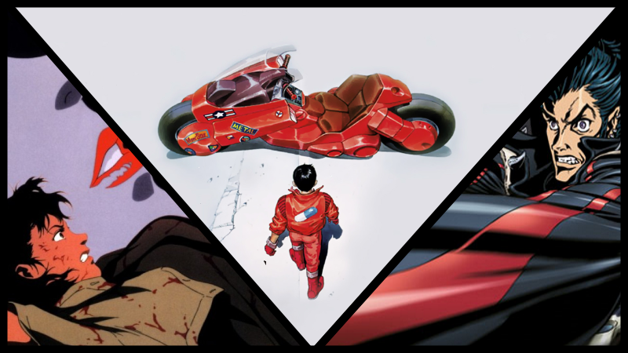
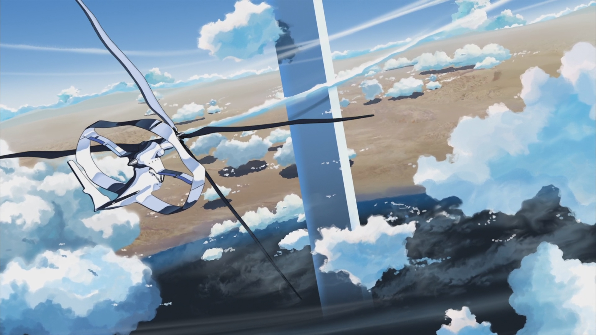
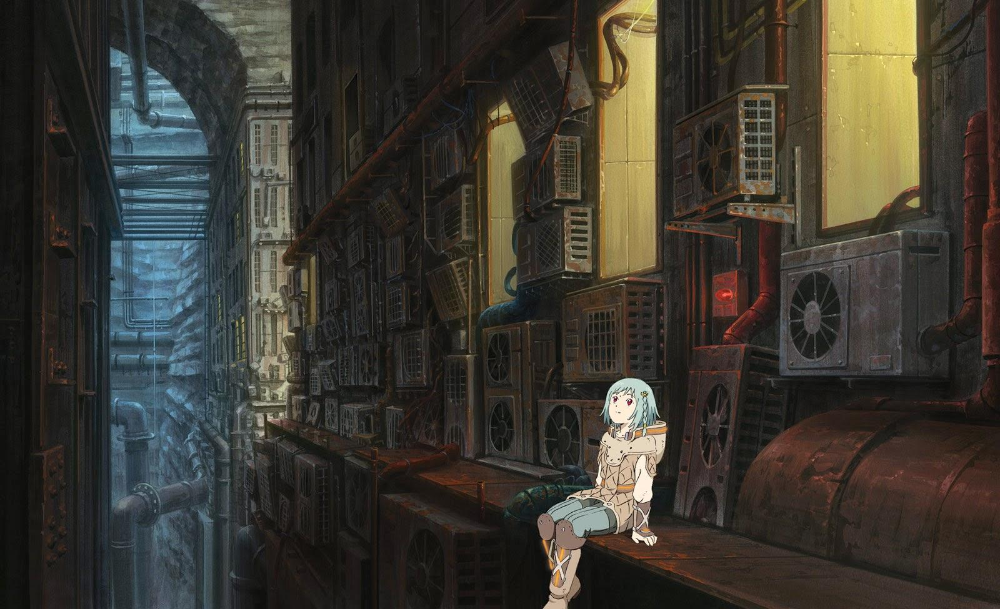
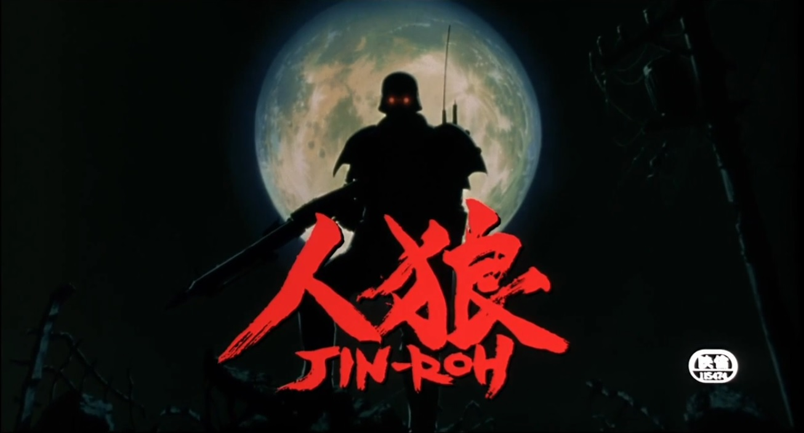
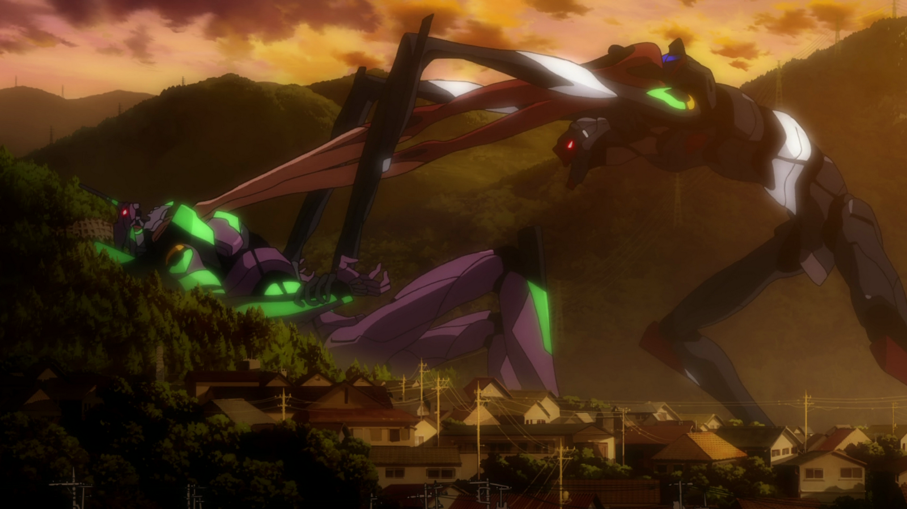
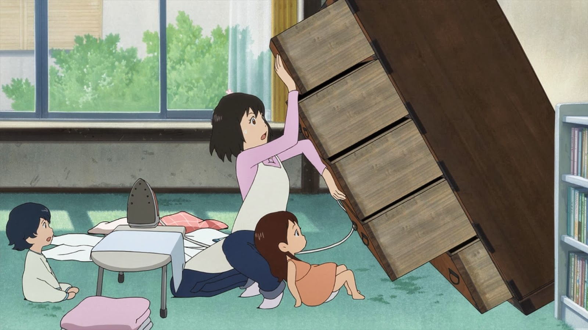
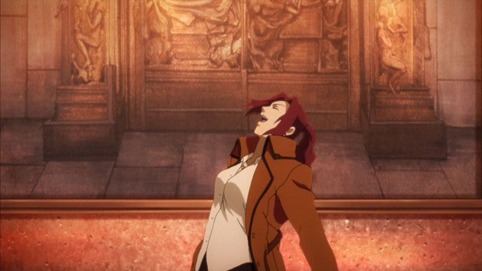

---
{
	title: "RockmanDash's Top 10 Non-Ghibli Anime Films",
	published: "2015-09-21T12:00:00-04:00",
	tags: ["Top 10", "Top Lists", "RockanDash Rambles", "Rockmandash", "Non-Ghibli Movies", "Anime", "Akira", "Kara no Kyoukai", "Redline", "Perfect Blue", "Satoshi Kon", "Jin Roh", "Disappearance of Haruhi Suzumiya", "Wolf Children", "Patema Inverted", "FMA", "Trigun", "Cowboy Bebop", "Tayclassic", "AniTAY"],
	kinjaArticle: true
}
---

When you think about Anime, rarely do you think about Anime films. Almost all of the popular Anime are TV series, and even when you start thinking about Anime Films, most people go straight to Ghibli, for a reason... they make excellent films, and there aren’t a lot of alternatives out there. That being said, these cult classics and obscure titles that are Non-Ghibli Anime Film, while few in number, are some of the best experiences in the medium, and are works many just pass over... so after seeing[ Kotaku’s Bests of Studio Ghibli Movies](http://thebests.kotaku.com/studio-ghiblis-movies-ranked-1718105786), and the beginnings of the AniTAY Movie Night, I decided I’d make a list of the best Anime Movies I’ve seen that aren’t Ghibli.

So, What are the rules of this list, you may ask? I have one main rule for this list: There will be one film per Identity/Group (Director, Company, etc), which means that this isn’t necessarily a top 10 movies in the traditional sense, but more a collection of movie groups associated with one identity, with the film on the list acting as a representative of that group and my personal preference. This is because the list is made with the intent of recommending works to others, to spread the word of their existence and how good they are, so I want a rather diverse list. This rule is to diversify the list so it’s not all just one series while maximizing the recommendations I can give to people as I can mention the other works during their spot. While you may think this is unfair to some films, this is to make the list a better list, and is the way I’m operating this. I apologize in advance.

Also, I’d like to keep in mind that all of the movies here are ones I think are pretty great. Even though it may be lower on the list, that doesn’t mean that it’s a bad work, it’s still a stellar movie and I’d recommend all of these.

***

# **HM#1: *Cowboy Bebop: Knockin’ on Heaven’s Door***

**Plot Description: **As the Cowboy Bebop crew travels the stars, they learn of the largest bounty yet, a huge 300 million Woolongs. Apparently, someone is wielding a hugely powerful chemical weapon, and of course the authorities are at a loss to stop it. The war to take down the most dangerous criminal yet forces the crew to face a true madman, with bare hope to succeed. *- Plot Description from MAL*

**Justification & Thoughts: **For the purpose of a diverse list, I wanted the ones on the main list to be movies mostly unrelated to a series, ones that can be watched standalone, so I only have a few series movies on the list, but there are some rather well known and great series movies that have to be somewhere on this list, so I’ll mention them here.

About *Cowboy Bebop: Knockin’ on Heaven’s door*... It’s ***COWBOY BEBOP***! While it’s just a side story taking place between episodes 22 and 23, it’s more of one of Cowboy Bebop, a show that’s one of the best that anime has to offer with a style you don’t see in modern day shows. Combine one of the best and most memorable dubs in anime history, with great writing, incredibly fluid animation, fantastic by Shinichiro Watanabe and an amazing score Yokko Kano makes this one of the best this media has to offer while expanding on what made the original so great. It’s amazing.

**If interested, you should also check out... **the respective work. Duh! You kinda need experience with Bebop to watch this, so go watch it now! It’s great!

***

# HM#2. Trigun: Badlands Rumble

<iframe src="https://www.youtube.com/embed/jWBEG0VHCZ8"></iframe>

**Plot Description: **20 years after meddling into the bank heist of a notorious robber named Gasback, Vash the Stampede is heading towards Macca City. Rumors say that the legendary thief might appear there causing an enormous influx of bounty hunters in the area who want to collect the $$300,000,000 prize for his head.* - Plot Description from MAL*

**Justification & Thoughts: **Pretty much the same justification as* Cowboy Bebop*: Yes, it’s a short story that happens outside of time, most likely the middle of the TV show, but it takes everything that made the original great and brings it back while expanding on what made it so great in particular, while being totally different than the offerings we have today. Unlike* Bebop* however, this was made much later, so* Trigun: Badlands Rumble* has the advantage of production values, with madhouse at the top of their game, making one of the best looking anime I’ve ever seen.

**If interested, you should also check out **Trigun. Same with Bebop, it’s great and you should probably go see it. If interested, go watch it.

***

# **HM#3.* Full Metal Alchemist: Conqueror of Shamballa***

<iframe src="https://www.youtube.com/embed/M_4nfoT93Rs"></iframe>

**Plot Description: **Munich, Germany, 1923. Two years have passed since Edward Elric was dragged from his own world to ours, leaving behind his country, his friends and his younger brother, Alphonse. Stripped of his alchemical powers, he has been all this time researching rocketry together with Alphonse Heiderich, a young man who resembles his own brother, hoping to one day find a way back home. His efforts so far had proven fruitless, but after lending a hand to a troubled gypsy girl, Edward is thrown in a series of events that can wreak havoc in both worlds. Meanwhile, at his own world, Alphonse Elric ventures deeper into the mysteries of alchemy in search for a way to reunite with his older brother. - *Plot Description from MAL*

**Justification & Thoughts: **This is a personal favorite of mine, so you could swap *FMA:B The Sacred Star of Milos *here, but I can’t really. I love Alternate history, adore it. Next to dystopias, it’s one of my favorite literature genres, so imagine how I felt when I saw *FMA: Conquerer of Shamballa*, a movies of a series that was up there as one of my favorite anime of all time? I loved it, and to this day it’s my favorite part of the series. Regardless of your thoughts of the main series, this movie takes a questionable ending and runs with it, throwing in the hectic Nazi Germany and managing to handle it extremely well in what I would consider to be one of the best anime movie endings of all time, something that manages to bridge the gap between fantasy and our own world in one of the best ways possible, while being an absolutely kickass story by itself. It’s great.

**If interested, you should also check out **some of the works later on this list, and of course, FMA. I’d recommend checking out both *FMA *&* FMA:B*, going *FMA* to this, then *FMA:B* then *Sacred Star of Melos*. It’s a rather great series, so you should have a blast with this one.

***

# **10.* The Place Promised in Our Early Days***

**Plot Description: **In an alternate timeline, Japan was divided after losing World War II: Hokkaido was annexed by “Union” while Honshu and other southern islands were under US sovereignty. A gigantic yet mysterious tower was constructed at Hokkaido and could be seen clearly from Aomori (the northernmost prefecture of Honshu) across Tsugaru Strait. In the summer of 1996, three 9th-graders had made a promise that one day they’ll build an aircraft and unravel the tower’s mystery, but their project was abandoned after the girl, Sayuri Sawatari, began experiencing sleeping sickness and transferred to Tokyo for better treatment. Three years later, Hiroki Fujisawa accidentally found out that Sayuri had been in a coma since then, and he asked Takuya Shirakawa to help him finding a way to revive her. What they don’t know yet is that Sayuri’s unconsciousness is somehow linked with secrets of the tower and the world. - *Plot Description from MAL*

**Justification & Thoughts: **To start up this list, A Shinkai film! No, it’s not *5CM Per Second*, and I’m sure that’s the one most people would put on this list given the rules I set in place and it’s popularity, but this is my favorite of his by far. Makoto Shinkai films are impressive: called the next Miyazaki by some, Shinkai creates some of the most beautiful, visually stunning works you can see out there, with some of the best scenery, music (Tenmon is amazing) and atmosphere in the whole medium, while working with a small amount of people, essentially an indie (He animated his first movie all by himself!). Also, his works are known to be very emotional, handling his themes of separation extremely well, and creating a world and scenario that is rather realistic, but once you’ve seen one, you’ve essentially seen them all. Why *The Place Promised* then? It’s really the best he’s done to me, as it combines a longer length which I believe his film really needs with an Alternate history plot (which is something I rather adore) and Shinkai’s mainstays to create the most meaningful, most engaging, and most powerful film I think he’s ever made.

If that’s the case, you may ask me, why is it at the bottom of my list? That’s more personal preference than anything: I’m relatively vocal about my distaste twords Shinkai films, and every time I see them, I find that I’m never able to connect with them because of the general execution of the characters, and the way that the films are handled. To me, All of Shinkai’s films feel a tad bit distant, and considering these are films focused on romance or themes about the essence of people, this is a rather large flaw. A large part of this is because I believe you as a viewer simply do not spend enough time with the characters to know them or relate to them unless you’re extremely similar to them. My choice for this list, *The Place Promised in Our Early Days*, being full feature length manages to do it’s intended goal better than *5CM Per Second. *That being said, I have to say these works definitely grow on you, and if you do relate to the characters, these can be some of the most powerful films you may see. Almost everything else is done so well that I feel like it deserves a place on this list. (And if I didn’t have it, I’d probably be mobbed by *5CM Per Second *fans....)**

**If interested, you should also check out **the rather popular** **[*5 Centimeters*](http://tay.kinja.com/dexs-review-5-centimeters-per-second-1499521371)* *[*Per Second*](http://anitay.kinja.com/5-centimeters-per-second-manga-review-1699292964), which according to fans is one of the most moving films out there. I’d also recommend the extremely well done [*Garden of Words*](http://tay.kinja.com/the-garden-of-words-the-ani-tay-review-1524606376)*, *which because it’s his newest film, is handled even better, with themes that are really interesting and thought provoking, but runs into the length issue at only 48 minutes. If you want something totally different from him, *Children Who Chase Lost Voices *is rather interesting work, being more ghibli-esque than anything... It’s worth a watch.

***

# **9. *Patema Inverted***

<iframe src="https://www.youtube.com/embed/Aa7sa-Zd-3E"></iframe>

**Plot Description: **Patema lives in an underground world of tunnels, the long-abandoned ruins of a giant industrial complex. Though she is a princess, she is held back by the rules imposed by the elders of her clan. One day when she is exploring in a forbidden zone, she is startled by a strange bat-like creature and tumbles headlong into a void - and out into the wide open world above the surface, a place with reversed physics, where if she let go she would “fall up” into the sky and be lost forever. Age is a student on this surface world, a totalitarian society whose compliant population has been brainwashed against the “sinners who fell into the sky.” When he spies Patema hanging upside-down from a tree, he pulls her down to safety, struggling with all his might to keep her earthbound as she grips on to him for dear life. Together their weights cancel each other out, and once they master the art of navigating competing gravitational forces, they set out to evade the leaders of Age’s world and discover the secret that keeps their worlds apart. - *Plot Description from MAL*

**Justification & Thoughts: **From another writer and director who’s primarily done anime films that’s highly acclaimed, we have Yasuhiro Yoshiura’s *Patema Inverted*, a very interesting, original and well executed sci-fi dystopian story with a premise that just grabs your attention. The themes and concept that this show handles because of this premise and the dystopia it creates is rather great, and with the totalitarian society and opposing realities, this movie is thought provoking and engaging throughout, an experience you don’t see in many anime out there. It’s done pretty well in almost every element you can think of, with great characters, interesting banter and interactions that make the work that much better, an interesting handle of perspectives with good writing and direction overall, a great ending that’s rather fufilling unlike so many other series, and on and on and on. This movie is engaging and entertaining in ways that many aren’t while being something more, being extremely well rounded, and production values that are definitely worthy of a feature film.

Why 9th on the list then? Mainly because while this movie is done really well, so are the rest of the movies on this list, and* Patema Inverted* doesn’t have something extraordinary like the rest of this list, it’s just a really well done movie. It’s more about the rest of this list, and not so much this work itself.

**If interested, you should also check out **Yasuhiro Yoshiura’s other works, [*Time of Eve*](http://anitay.kinja.com/grexs-time-of-eve-review-1720540823)*, *a rather interesting and thought provoking work about how robots interact with humans in a future society, and *Pale Cacoon, *an ONA about a post apocalyptic colony with archives to the past. [Also, check out our review! :D](http://anitay.kinja.com/patema-inverted-ani-tay-review-and-discussion-1678652596)

***

# **8. *Jin-Roh: The Wolf Brigade***

<iframe src="https://www.youtube.com/embed/tmmoBsMw5w0"></iframe>

**Plot Description: **After witnessing the suicide bombing of a terrorist girl, Constable Kazuki Fuse becomes haunted by her image, and is forced to undergo retraining for his position in the Capital Police’s Special Unit. However, unknown to him, he becomes a key player in a dispute between Capital and Local Police forces, as he finds himself increasingly involved with the sister of the very girl he saw die. - *Plot Description from MAL*

**Justification & Thoughts: **Here’s another interesting pick that would probably deviate from most people’s lists, considering how little people know about this film and how it’s vastly overshadowed by other works by Mamoru Oshii. Yes, this is my Mamoru Oshii work for this list as it was written by him, but when people would think about his works, most people would focus on the extremely well regarded and influential* Ghost in the Shell, *a Sci-Fi movie that provides a world and ideas that have inspired a generation. While nowhere near as groundbreaking or influential as *GITS*, *Jin-Roh* is is great for all the same reasons, but why *Jin-Roh* over *GITS*? Because I love alternate history (it has a Germany occupied Japan!), I believe *Jin-Roh* has a cleaner, more focused and stronger narrative that engages you more instead of spending most of it’s times philosophically waxing (It has it’s moments, but for the most part is more narrative focused), and themes that are more relatable to our world than in *GITS* that I just preferred. It’s just personal preference here, nothing more, nothing less.

Mamoru Oshii works are great because they provide a great world with an engaging and fascinating ideas that help think about our own, with *Jin-Roh *focusing on the past with it’s alternate history, and *GITS *the future, handled in a mature way. They are works that handle politics, action, suspense and anything you can think of in an extremely realistic and methodical way, and when combined with the great work by Production I.G., these movies pretty much nail it all: great directing which handles a world and atmosphere leagues better than it’s competition, hand drawn visuals, a stylized aesthetic and fluid animation that are drop dead gorgeous, managing to weather the test of time way better than many in it’s time period, a score that is just flat out brilliant, and anything you can think of.

**If interested, you should also check out** *Ghost In The Shell*, if that wasn’t painfully obvious by my Justification & Thoughts section earlier, or if you want to learn more, check out my [*Why Haven’t I Watched This? *Post on this movie.](http://anitay.kinja.com/why-havent-i-watched-this-jin-roh-the-wolf-brigade-1704963168#_ga=1.162787449.473183827.1418699279) If you can, check out Oshii’s Kerorboros saga, which this is a part of, but most is in manga form or Live Action.

***

# **7. *Redline***

<iframe src="https://www.youtube.com/embed/2t26m_Q6ENo"></iframe>

**Plot Description: **Redline is about the biggest and most deadly racing tournament in the universe. Only held once every five years, everyone wants to stake their claim to fame, including JP, a reckless dare-devil driver oblivious to speed limits with his ultra-customized car—all the while, organized crime and militaristic governments want to leverage the race to their own ends. Amongst the other elite rival drivers in the tournament, JP falls for the alluring Sonoshee—but will she prove his undoing, or can a high speed romance survive a mass destruction race? - *Plot Description from MAL*

**Justification & Thoughts: **We gotta have a dumb, enjoyable film here somewhere, right? *Redline*, being essentially a speed racer clone, is here solely because it’s an amazing experience that demands to be seen, with what could be debated as the best visuals in anime. After 7 years of work with everything being done by hand in HD by Madhouse,* Redline* is an extremely entertaining, adrenaline filled, “mature”, and kickass racing movie that is a treat for the eyes with the most fluid animation in anime, extremely detailed and stylized art, and is just fun to watch, with great humor and entertaining leads. There’s nothing groundbreaking with the story at all, but it’s done well and is entertaining enough, doing the job to showcase what we’re all really watching this for... the beautiful racing action and some of the best visuals in anime.

If my words aren’t enough, go and watch DouchebagChocolat’s review, a review that captures pretty much what makes *Redlin*e great (while being rather entertaining in it’s own right :D)

<iframe src="https://www.youtube.com/embed/LIdIbOx9uG0"></iframe>

***

# **6. *Evangelion: 2.22 You Can (Not) Advance**

<iframe src="https://www.youtube.com/embed/BtvFYAL_hQo"></iframe>

**Plot Description: **In the earliest battles against the monstrous Angels, young Eva pilots Shinji and Rei were forced to carry humanity’s hopes on their shoulders. Now, with the deadly onslaught of the Angels escalating and the apocalyptic Third Impact looming, Shinji and Rei find their burden shared by two new Eva pilots, the fiery Asuka and the mysterious Mari. Maneuvering their enormous Eva machines into combat, the four young souls fight desperately to save mankind from the heavens—but will they be able to save themselves? - *Plot Description from Funimation*

**Justification & Thoughts: ***Neon Genesis Evangelion*, the brainchild of Hideki Anno, has to be somewhere on this list i~~f it wasn’t, fans a.k.a Morie would attack me~~ because of what it has to offer, delving into the psyche of the human mind extremely well, while being a great show on its own right when ignoring everything else. Extremely iconic, extremely memorable, and extremely well done, Eva is a work that should be on everyone’s watch list. On this list, I picked For this list, I picked *Rebuild Evangelion: 2.22 You Can (Not) Advance*, the second film in the rebuild series which is a remake/reimagining/sequel which are filled with little tweaks in comparison to the original 97’ TV series + *End of Evangelion* to make a whole different work.

If you’re an Eva fan, you may ask me, Why did I make that pick 2.22 over *EoE*? Mainly it’s because I didn’t particularly love *EoE* and found that 2.22 was handled extremely well, with the subtle changes like Shinji not being a complete wimp and having an absolutely amazing ending making a huge difference in my enjoyment of the series, turning it from something I felt lukewarm, to something I really enjoyed. There are other reasons why I prefer 2.22 like having an actual budget to make it look beautiful in HD, but really, the subversion was great and the movie is executed extremely well.

**If interested, you should also check out **The original *Neon Genesis Evangelion*, which you kinda really need to watch that before watching rebuild, as your enjoyment is significantly influenced by the original and rebuild is written in a way that is best experienced with prior knowledge of the series. Also check out the rest of the rebuild series, but *3.33 ~~You Can (Not) Have~~ You Can (Not) Redo *may not be your cup of tea. I liked it! Also, check out our reviews of [1.0](http://tay.kinja.com/dexs-review-evangelion-1-0-you-are-not-alone-1456347723) & [2.0](http://tay.kinja.com/dexs-review-evangelion-2-0-you-can-not-advance-1474204132) By Dex and [3.0 by Grex](http://grex.kinja.com/evangelion-3-0-the-ani-tay-review-1676979911).

***

# **5.* Wolf Children***

<iframe src="https://www.youtube.com/embed/8SlB-SpDMKI"></iframe>

**Plot Description: **Wolf Children is about a young woman named Hana who falls in love with her mysterious college classmate who is actually a wolf man. The couple produce two children who also possess their father’s lineage; the big sister Yuki, who was born on a snowy day, and the little brother, Ame, who was born on a rainy day.

The wolf man suddenly dies one day, leaving Hana to raise the two wolf children herself and struggle to keep their secret. But when the family is threatened by eviction, child services, and neighbors annoyed by Ame’s constant crying (and often both Wolf Children’s howling, which the landlady mistakes for pets), Hana decides to move out to the secluded countryside where her kids can roam free. - *Plot Description from TV Tropes*

**Justification & Thoughts: **What a film. Now that we’re at the latter half of this list, we are are the best of the media, the films that one could describe as a masterpiece. This film is *Wolf Children*, a creation from the extremely talented** **Mamoru Hosoda, who’s known for making really high quality works. While they may be a bit ghibli-esque and simplistic for some, they are extremely well executed with a straight and powerful narrative, great production values, the works. They are great films that anyone can enjoy, but are great regardless of that fact. All of his films could slot in this list, but Wolf Children just edges out.

*Wolf Children* manages a coming of age story in a beautiful way, executed in a way that truly deserves the praise it gets by it’s large a. It may not be the most child friendly due to the content, but it’s a story that is extremely touching, rather moving and extremely engaging, with wonderful characters and relationships that just steal the show. It’s a truly ~~wolf ~~human work, and it’s absolutely phenomenal.

**If interested, you should also check out **Hosoda’s other films,* The Girl Who Leapt Through Time* which is rather self explanatory*, Summer Wars *which involves an awesome net world with hacking*, & The Boy and the Beast, *his newest movie.

***

# **4. *The Disappearance of Haruhi Suzumiya***

**Plot Description: **It is mid-December, and SOS Brigade chief Haruhi Suzumiya announces that the Brigade is going to hold a Christmas party in their clubroom, with Japanese hotpot for dinner. The brigade members Kyon, Yuki Nagato, Mikuru Asahina and Itsuki Koizumi start preparing everything for the party, such as costumes and decorations. But a couple of days later, Kyon arrives at school only to find that Haruhi is missing. Not only that, but Mikuru claims she has never known Kyon before, Koizumi is also missing, and Yuki has become the sole member of the literature club. The SOS Brigade seems to have never existed, nor has Haruhi Suzumiya. No one in the school has ever heard about her... except for Kyon. - *Plot Description from MAL*

**Justification & Thoughts: **You wouldn’t expect a masterpiece movie that has been derived from a series that’s nothing but a silly comedy, right? Well, that’s exactly what we have here, a movie manages to keep what the original does great while blowing everyone’s expectations away with a twist on the lackadaisical premise of the series that makes for a phenomenal movie, with an incredibly well executed atmosphere and amazing character development in a series that has almost none. It’s a prime example of using a media to execute a story in a powerful way though, like so much of this list and it hooked me and engaged me throughout the time I went through the story.

**If interested, you should also check out **Other KyoAni works and Movies, as they are rather surprising like this, providing for a much deeper experience than the original show offers, while keeping the charm that made you invested into the series in the first place. While nowhere near as good as this, *Tamako Love Story *is great and comes to mind. Also, I’d love it if you checked out [my article on this movie](http://anitay.kinja.com/the-perfect-day-to-watch-one-of-my-favorite-anime-movie-1672053100), every little bit helps.

***

# **3.* Perfect Blue***

<iframe src="https://www.youtube.com/embed/UXQraSkOOGs"></iframe>

**Plot Description:** Mima Kirigoe, a member of a pop-idol group called “CHAM!”, decides to quit singing to pursue a career as an actress. Some of her fans are displeased with this decision though, particularly a stalker named Me-Mania. As Mima progresses into her new career, those close to her are violently murdered one by one, and Mima begins to lose the ability to distinguish reality from fantasy. - *Plot Description from MAL*

**Justification & Thoughts:** You can’t really have a list of anime films without having a Satoshi Kon film, right? The genius director Satoshi Kon has inspired and influenced so many creative minds and viewers with the masterpieces he has made, groundbreaking films that blend fiction and reality in a way that rarely has been matched. These are really great films that some could debate to be the best films out there, regardless of animated or not, works that truly deserve being called a masterpiece, pushing cinema and animation to the next level.... and if my words aren’t enough, Every Frame A Painting has a great overview on his style and editing, and while it doesn’t capture everything about him, it gives you a good idea on why people love his films so much.

<iframe src="https://www.youtube.com/embed/oz49vQwSoTE"></iframe>

I haven’t seen all of Kon’s works so far so I’m not the best to judge, but I absolutely fell in love with *Perfect Blue* and that’s why it’s on this list, a psychological thriller out of what seems to be a regular idol story, warping into a reality that is more bizarre than fiction in the form of an amazing ride that was an amazing experience. It’s done exceedingly well, and it’s one that should be on your short watch list. Thanks for all the great work in the media, Satoshi Kon, we’ll miss you.

**If interested, you should also check out **All of Satoshi Kon’s works, he’s rather consistent with what he worked on. *Paparika*, *Tokyo Godfather*, *Paranoia Agen*t, etc... it’s all about the duality of life and it’s all extremely well done.

***

# 2*. Akira*

**Plot Description: **It’s the year 2019 in Neo Tokyo, thirty-one years have passed since the start of World War III. A top-secret child with amazing powers of the mind breaks free from custody and accidentally gets a motorcycle gang involved in the project. This incident triggers psychic powers within one of the gang members, Tetsuo, and he is taken by the army to be experimented on. His mind has been altered and is now on the path of war, seeking revenge on the society that once called him weak. -

**Justification & Thoughts: ***AKIRA.... *it’s a work too amazing and too important to not be on a list like this, being one of the best and most influential anime movies out there. Credited as an essential part of getting anime outside of the west, starting what many would consider to be the golden age in the 90s, shaping modern anime as we know it and influencing many works to come with it’s amazing setting of Neo Tokyo and trippy/strong plot that involves lots of screaming **TETSUOOOOO **and** KANEDAAAAAA. ***Akira* is bigger than anything I could ever aim to cover with a few paragraphs so I won’t even try, but what you do need to know is that it’s a great experience and don’t be discouraged from watching it because people say it’s confusing or hard to understand, those aren’t elements that shouldn’t keep you from watching the greatness that is *Akira*.

**If interested, you should also check out... **well, a lot of stuff on this list, and a lot more. It started the “golden age” of anime, so stuff like *GITS*, *Serial Expiraments Lain*, etc will be right up your alley if you liked this one. I also recommend reading the manga as that’s the anime of *Akira* but even better, with the anime serving as an introduction of sorts and barely scratching the surface of what *Akira *truly is. If you’re interested in more by the creator of* Akira* but finish the manga, check out *Steamboy*.

***

# 1. *Kara no Kyoukai: Paradox Spiral*

<iframe src="https://www.youtube.com/embed/J4q_eNz3wMs"></iframe>

> \*Note\* - Video Trailer is not of *Paradox Spiral* in particular, but a trailer of the whole series in general.

**Plot Description: **Set in Japan predominantly during the late 1990s, the series chronicles the life of Ryōgi clan heiress, Shiki Ryōgi, and her relationship with classmate Mikiya Kokutō. Both the light novel and the films are depicted in anachronical order with each chapter/film serving as part of one collective narrative. The series deals with the paranormal and tackles mature themes such as suicide, rape, patricide, incest and murder.Its lore and story draws inspiration from various religious philosophies and psychological concepts such as multiple personalities; the anima and animus; the nature of sin; life, death and reincarnation; and the paradoxical nature of the Taiji.

Paradox Spiral - November 1998: Shiki meets a boy named Tomoe Enjou, a runaway who claims to be a murderer. Shiki allows Tomoe to use her apartment as his hideout, but one day, Tomoe sees his mother whom he’s sure he’s killed. *- Plot Description of Series from Wikipedia, Paradox Spiral from MAL.*

**Justification & Thoughts: **...Unlike the past few on this list and a lot of works here, *Kara no Kyoukai *is series of 7 movies that doesn’t have a large following or massive influence like the others on this list, but it’s my favorite anime movie series out there regardless of that, because what this does have is being absolutely fucking amazing, being the pinnacle of what modern animation can achieve in my opinion. Created by Type-Moon, the same company that brang you *Fate/stay night *and *Fate/Zero*, It has some of the absolute best production values in animation with an amazing score by Yuki Kajiura and mindblowing animation by studio Ufotable, the best atmosphere I’ve ever seen from a movie, great characters, amazing writing and it simply does things in a way that is great, unique, and vastly different, all making for an amazing experience that I fell in love with (and a lot of people too, look anywhere that this series is mentioned and you’ll run into praise).

When I mean vastly different, I truly mean it. The fifth movie in the series and my pick for this list, Paradox Spiral is the prime example of this behavior because it’s a total mindfuck yet it’s so amazing, being a movie completely out of order and making you solve a puzzle every step of the way. Here’s an example: you get to see death of a person who is standing outside, seeing his death.... It’s a truly amazing experience that will blow you away, along with many others who have experienced it.

I can go on and on about this, but really, I don’t think you guys want anymore of this gushing as I already have in [my review](/posts/rockmandash-reviews-kara-no-kyoukai-the-garden-of-si-1524615358) and Digibro does an analysis of the series that I could only dream of doing.. so if you want to hear more about why KnK is so great, check those out.

**If interested, you should also check out **other TM works like* Fate/Zero*, and *Fate/stay night*, but if I were you, I’d check out the VN of* Fate/stay night *if interested. If you knew Japanese, I’d also recommend* Mahoutsukai no Yoru*, another TM VN, but I’m sure many don’t fall in that category.

***

*You’re reading Ani-TAY, the anime-focused portion of Kotaku’s community-run blog, Talk Amongst Yourselves. Ani-TAY is a non-professional blog whose writers love everything anime related. Click *[*here*](http://anitay.kinja.com/)* to check us out. If you want to read more of my writing, check out *[*RockmanDash Reviews*](/people/reikaze)* and *[*KMTech*](http://kmtech.kinja.com/)*.*
