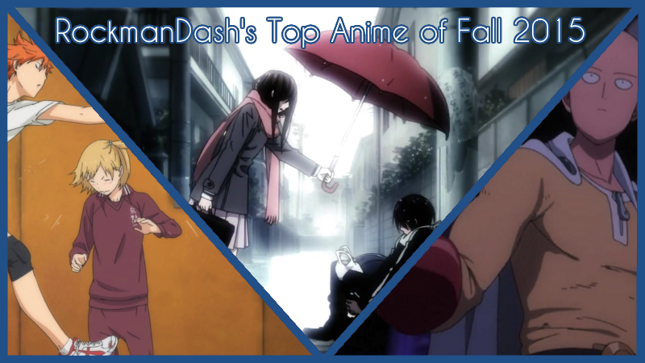
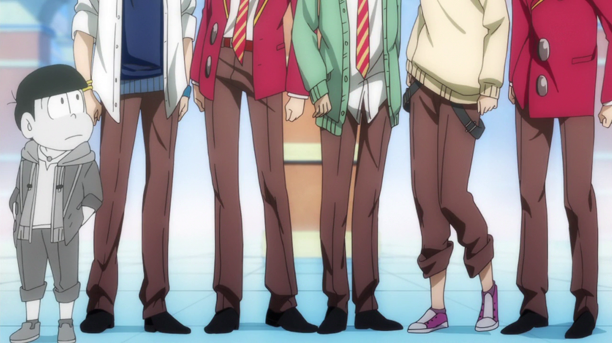
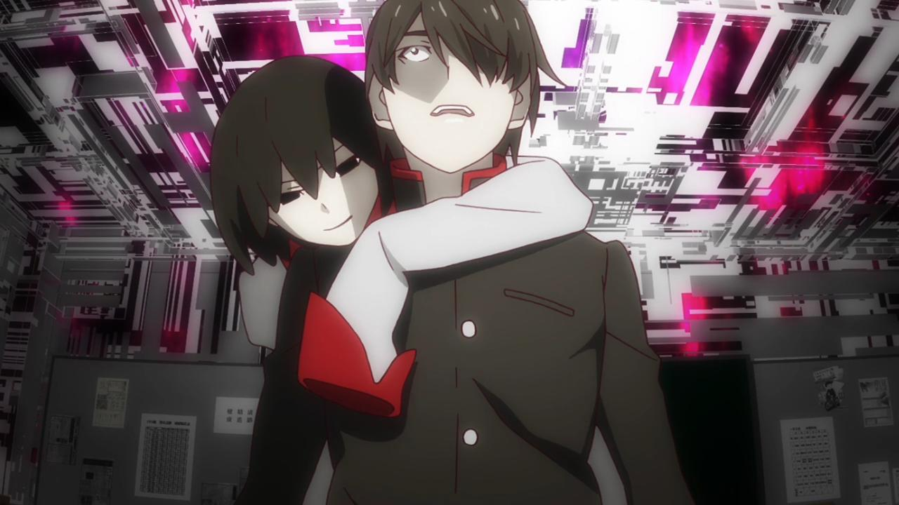
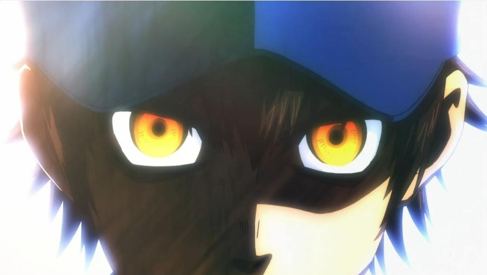
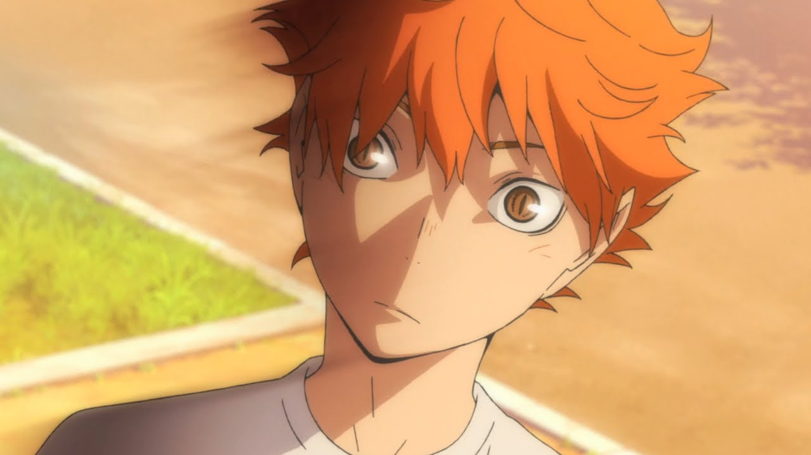
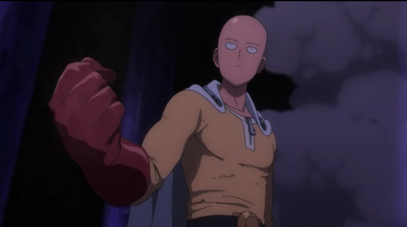
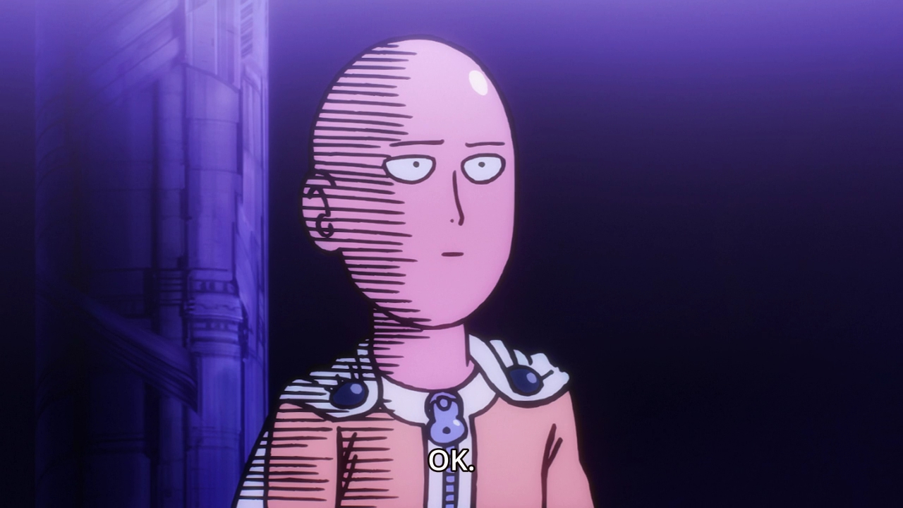

---
{
	title: "RockmanDash's Top 5 Anime of Fall 2015",
	published: "2015-12-29T09:00:00-05:00",
	tags: ["Rockmandash Rambles", "Top lists", "Top 5", "Top 10", "Anime", "AniTAY", "Fall 2015"],
	kinjaArticle: true
}
---

Everyone has their own preferences, tastes, etc. While the Anime Worth Watching articles do a great representation of shows that the people in AniTAY would recommend, It doesn’t exactly represent personal preferences, which I always like to keep in mind when some form of discussion happens, like writing. My solution? A list of my favorite anime of the season! Welcome to my Top 5 Anime of Fall 2015.

So, What are the rules of this list, you may ask? If it aired/released this season, it can go on this list. I don’t see the point in only giving a show one chance during it’s airing season, and this is my list so I’ll list my favorite shows regardless of what season it started on. If this means that one show hogs the top spot for 2 seasons, than good for that show! If it’s an OVA or movie that came out during the duration of the season I fell in love with, then it may be there. Also, I think that the seasonal split is arbitrary and unnecessary, so it’s completely gone here. Sorry about that, but that’s how I’m doing it.

Just an FYI, the placement of the show in the list is mostly based on my experience and enjoyment of the work, so if you’re wondering why something isn’t where you think it should be or you can’t really tell via the justification, that’s probably why. Also, just because a show is lower on the list doesn’t mean it’s bad - all of these are great, and a lower placement isn’t a mark against the show, at this point it’s nearly all personal preference.

***

# ***5. Osomatsu-san***

**Plot Description:** The Matsuno household has six naughty and mischievous sons (who are sextuplets), led by the eldest Osomatsu. They were grade schoolers back in the Shouwa period and the original show *Osomatsu-kun* was a comedy based in that time period, but despite of still living in the same old household, the street view as well as the life style of modern day society have changed drastically, and *Osomatsu-San* is a revival of that original work, but like their lives, the show has became much more modern. - *Plot Decription from MAL, tweaked a bit by the Author*

**Justification & Thoughts:** If you need a funny comedy, *Osomatsu-san* is surprisingly great considering it’s been pretty much under everyone’s radar, and considering that it’s the revival of an old series from the 60’s. It’s pretty hilarious seeing these sextuplets interact with each other, it’s proof that old dogs can learn new tricks, and it’s proof that some types of comedy really are timeless with it’s colorful personalities, funny gags/situations, and self awareness keeping this show hilarious. Also, the 1st episode with the blatant copyright infringement is absolutely amazing, so you should definitely watch it.

***

# ***4. Owarimonogatari***

**Plot Description:** During the month of October of his third year in high school, Koyomi Araragi is introduced to a transfer student named Ougi Oshino by his underclassman Kanbaru Suruga. Ougi tells Koyomi that she has something she wishes to consult with him. When she draws the map of Naoetsu High School, she finds something peculiar. This discovery reveals a tale that wasn’t meant to be told, and this makes Koyomi’s high school life totally different. This is the story that brings to light “what” makes Koyomi Araragi. This is the story that reveals the “beginning” of everything. - *Plot Description from MAL*

**Justification & Thoughts:** You should watch this for [Spooky Ougi](http://i.imgur.com/QbirXpr.jpg), right? More *Monogatari* is a good thing, and *Owarimonogatari* is just as great as ever, with great characters, flashy animation and interesting discussions that take up pretty much the whole show. I really liked how Ougi interacts with the rest of the crew, and the story once again is absolutely fantastic (I particularly liked the first arc), looking forward to more. It’s not for everyone, as it’s not the friendliest for those who haven’t watched a lot of anime or have a distaste towards otaku culture, but for those who like it or have enjoyed *Monogatari* in the past, definitely give it a shot. *Owarimonogatari* is one of the best in the series thus far, handling its themes and characters with style.

***

# ***3. Noragami Aragoto***

<iframe src="https://www.youtube.com/embed/3oFTHxkOzjE"></iframe>

**Plot Description:** In the second season of *Noragami,* the main focus is on Bishamon, god of war. She has many shinki due to her being unable to abandon spirits attacked by Ayakashi. She has a large group of shinki with her as leader, causing her trouble as she sometimes cannot tend to all of them properly, especially when one of them gets sick or is in pain. She has a strong hate for Yato, as a dark past binds the two of them. How will the horrifying events dated hundreds of years ago in combination with current evil happenings affect Yato and Yukine? - *Plot Description from MAL*

**Justification & Thoughts:** The first season of *Noragami* was pretty good, but this season really dialed up the awesome in the story - It’s very engaging, the lore just amped up how interesting the show was, it has great character interactions to the point of tears with extremely touching moments, the characters themselves were fantastic and overall the show and it’s handling of the story was really well rounded. While doing the stuff that made the first season great like the comedy from our not so friendly god Yato, this season really got us closer to the characters while presenting interesting scenarios, it handled tension quite well and was just engaging throughout, a lot of fun to watch. Also, the ending was just amazing, one that you can get absolutely absorbed in and one that really lead to a satisfying show, but one that gets you to want more, the ideal style of ending to me. Can’t wait for more! ~~plz Bones make more plz~~

***

# ***2. Sports Anime:*** ***Ace of Diamonds **S2** / Haikyuu!!*** S2

**Plot Description:** For *Ace of Diamonds* - The story follows Eijun Sawamura, a pitcher who joins an elite school with a brilliant catcher named Kazuya Miyuki. Together with the rest of the team, they strive for Japan’s storied Koushien championships through hard work and determination.

For *Haikyuu* - After losing against Aoba Jousai, the whole Karasuno team feels at a loss. Especially Kageyama and Hinata, who seem to be the most devastated about the defeat. However, the team soon cheers up when a chance for them to go to Tokyo appears. During their training camp there, Karasuno will meet new formidable opponents.

**Justification & Thoughts:** Yes, I realize there’s two shows here. My list, my rules though, and I tend to combine similar things into one listing, with these being both sports anime and second seasons. I know a lot of people don’t really care about sports anime, but as of late they’ve quickly become one of my favorite anime genres as they have great characters and have the positives of Shounen shows without many of the negatives. The ones airing this season are really great, and have been some of the shows I’ve enjoyed the most as this season progressed. (also, I missed the really great [*Baby Steps*](http://anitay.kinja.com/baby-steps-2-the-anitay-review-1728020664) last season, so I gotta make up for that...)

***

# ***1. One Punch Man***

**Plot Description:** In this new action-comedy, everything about a young man named Saitama screams “AVERAGE,” from his lifeless expression, to his bald head, to his unimpressive physique. However, this average-looking fellow doesn’t have your average problem... He’s actually a superhero that’s looking for tough opponents! The problem is, every time he finds a promising candidate he beats the snot out of them in one punch. Can Saitama finally find an evil villain strong enough to challenge him? Follow Saitama through his hilarious romps as he searches for new bad guys to challenge! - *Plot Description from MAL*

**Justification & Thoughts:** What could be number one for Fall 2015 other than *One Punch Man*? **While* One Punch Man* isn’t the savior of anime like how the internet jokingly refers to it, *One Punch Man* is a really good subversion of the superhero genre that’s been flooding the movies one that manages to take the seriousness of the action flicks and turn it into comedy by mocking the tried and true tropes, something I really enjoyed seeing because i’ve gotten so tired of these superhero movies on the silver screen. The core of the strengths this show has is because of the main lead and it’s namesake, Saitama who is one of my favorite leads I’ve seen in a long time. Saitama’s reactions putting a smile on my face throughout the show and the way that he just destroys everything in one punch is played more interestingly than you would think.

Because of the nature of the show, making fun of a really popular and easy to watch show, *One Punch Man* is also easily accessible, and when combined with the fact it’s extremely hilarious, *One Punch Man* is the popular show of the year, an engaging show that I and many others had a blast with. Unlike other shows though, it earns it’s popularity with some of the most engaging action scenes anime has to offer, tons of fluidity in the animation which makes it look great, hilarious interactions, etc. It’s a show that is a joy to experience, and it’s one I loved, definitely a must watch in the year and one of my favorites. It’s a show that maintains a high level of quality, one that makes for a blast to watch at all times. Plus, how the hell do you say no to something with a JAM Project opening like this?

<iframe src="https://www.youtube.com/embed/QImBolnTVH8"></iframe>

**If interested, you should also check out** [Koda’s review on AniTAY](http://anitay.kinja.com/one-punch-man-the-ani-tay-review-1749225072).

***

**Thoughts on the Season Overall** - Fall 2015 was a rough season, probably the most barren I’ve seen thus far. There weren’t a lot of shows that really grabbed me this season, and it made this season harder than ever to pick, because I was barely keeping up on a lot of the shows, and there wasn’t much that caught my interest. It had it’s gold like most seasons do with the few shows being really solid but think most people can agree this was a pretty bad season and it’s one that makes you look forward to the new one.

***

*You’re reading Ani-TAY, the anime-focused portion of Kotaku’s community-run blog, Talk Amongst Yourselves. Ani-TAY is a non-professional blog whose writers love everything anime related. Click [*here*](http://anitay.kinja.com/) to check us out. If you want to read more of my writing, check out [*RockmanDash Reviews*](/people/reikaze) and [*KMTech*](http://kmtech.kinja.com/).*
