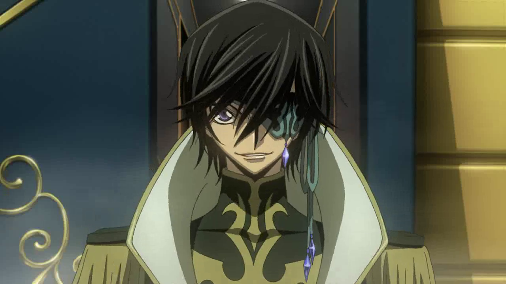

---
{
  title: "Rockmandash's Top 5 Anime of Spring 2015",
  tags:
    ["Rockmandash Rambles", "Top 10", "Spring 2015", "AniTAY", "Tayclassic"],
  published: "2015-07-13T13:25:00-04:00",
  attached: [],
  license: "cc-by-4",
  oldArticle: true,
}
---

Every season comes and goes, and everyone has their own favorites. While the <a class="sc-1out364-0 hMndXN sc-145m8ut-0 gIacKn js_link" data-ga='[["Embedded Url","External link","http://anitay.kinja.com/the-eleven-anime-of-spring-2015-to-watch-1707365283",{"metric25":1}]]' href="http://anitay.kinja.com/the-eleven-anime-of-spring-2015-to-watch-1707365283" rel="noopener noreferrer" target="_blank">Anime Worth Watching </a>articles do a great representation of shows that the people
  in AniTAY would recommend, I think it’s nice to be a bit more specific: Welcome to my Top 5 Anime of Spring 2015. 

So, What are the rules of
  this list, you may ask? If it aired/released this season, it can go on this list. I don’t see the point in only giving
  a show one chance during it’s airing season, and this is my list so I’ll list my favorite shows regardless of what
  season it started on. If this means that one show hogs the top spot for 2 seasons, than good for that show! If it’s an
  OVA or movie that came out during the duration of the season I fell in love with, then it may be there. Also, I think
  that the seasonal split is arbitrary and unnecessary, so it’s completely gone here. Sorry about that, but that’s how
  I’m doing it. 

<strong><em>*Also, a note to the reader* -</em></strong><em> </em>The
  honorable mentions on this list is a bit different than a typical honorable mentions, and probably not in a good way:
  Normally, HMs are solely shows that weren’t good enough to make the list, barely scraping by because of quality, but
  the shows sitting in my HMs for Spring 2015 are a list of shows that emphasize my personal biases, shows that I love
  to the point that they must be mentioned regardless of quality, but ended up being not as great as expected. that
  being said, continue on!

<h4 class="sc-1bwb26k-1 fvCjqJ" id="h7692"><strong>HM#1.<em>
  Punch Line</em></strong></h4>

<strong>Plot Description: </strong>If he sees underwear, humanity will be
  destroyed!? An original anime series from the noitaminA block, Punch Line centers on Yuuta Iridatsu, a high school
  student, with a peculiar habit. When he sees a girl’s panties, he gets so excited he faints! After a certain incident
  with a ghost cat, his soul gets separated from his body. Using his special powers, Yuuta watches the daily lives of
  the inhabitants of an apartment and sometimes plays tricks on them. Eventually, Yuuta decides to unlock the secrets to
  why Earth will be destroyed and tries to save it! <em>- Plot Description from MAL</em>

<strong>Justification &amp; Thoughts: </strong>Zero Escape Lite! Written by Kotaro
  Uchikoshi (AKA my favorite writer ever), I came to <em>Punch line</em> with confused expectations and came out with...
  confused expectations. <em>Punch Line</em> was a weird combination of the fanservice that it presented originally,
  combined with the typical Uchikoshi aspects of SciFi, plot twists, solid characters, etc. It’s playing of expectations
  kinda backfired with me though, as episode one presented itself to be another FLCL, then it kinda died halfway with VN
  adaptation-like pacing to shift itself over to a more traditional Uchikoshi experience. A hybrid of the two would have
  been way awesome, but as is, it’s a fun enough show that handled itself well enough. Check out my review if you’re
  interested. 

<h4 class="sc-1bwb26k-1 fvCjqJ" id="h7693">HM#2. <em>Knights
  of Sidonia Season 2</em></h4>

<strong>Plot Description:</strong> It’s been a thousand years since the Gauna, a
  strange alien race with no known method of communication, destroyed the solar system. A portion of humanity managed to
  escape using enormous “seed ships” like the Sidonia, which have allowed them to maintain the population while drifting
  through space. Nagate Tanikaze is a young man who has been raised deep in the bowels of the ship. When he goes into
  training to pilot the huge robotic weapons known as Gardes, Nagate is entrusted with piloting the legendary unit known
  as Tsugumori. Nagate and his fellow pilots put their lives on the line against the Gauna, in the ultimate battle for
  the survival of humanity! <em>– Plot Description from MAL</em>

<strong>Justification
  &amp; Thoughts: </strong>A Season 2 to the show that I called the 3rd best show of 2014, a show in which I loved every
  minute of??? Considering that I adored S1, how could I not love Season 2? Simple: KoS 2 isn’t the Sidonia I fell in
  love with, the Sidonia that really captured the “coolness” of Japanese SciFi. I admired Sidonia S1 for what it did
  with it’s realistic and serious execution, the brilliant and extremely interesting world, the extremely gripping
  narrative, and an awesome tone that keeps you interested in a story... But they took that and threw that Space SciFi
  Mecha that I fell in love with and replaced it with an extremely out of place Rom Com in space, with a more fitting
  title being <em>“I Can’t Believe My Giant Half-Monster Mecha Girlfriend Is This Cute.” </em><small>(Thanks
    Richard!)</small>

That being said, It’s not a bad show by any means, still being entertaining and
  having its moments, but top 10 of this year material this is not, and its not even top 5 of this season. A lot of the
  issues it has are issues with the manga, being too information light (which were made worse due to it being anime) and
  not really having a solid direction for this aspect, but man, this arc had too much romance, not enough SciFi... and
  this is coming from a person who’s favorite genre is romance. It lost everything Season 1 had, losing all sorts of
  seriousness, tension, world building and Hard SciFi realism that this show did so well... leaving us with... a
  romance... that... doesn’t... fit. :( 

<h4 class="sc-1bwb26k-1 fvCjqJ" id="h7694">HM#3:<em>
  Fate/stay night: Unlimited Blade Works</em></h4>

<strong>Plot Description: </strong><em>Fate/stay night: Unlimited Blade Works</em>
  follows Emiya Shirou as he is dragged into a Fight-to-the-death tournament called The Fifth Holy Grail War, where
  people known as masters fight with Heroes throughout history, known as servants, for a chance to get the Holy Grail,
  which grants their wishes. This version of <em>Fate/stay night</em> is an adaptation of the Visual Novel route with
  the same name, and in comparison to the Fate route which the 2006 anime by Studio Deen adapted, it focuses more on
  action, and the main character. Also, Rin Tohsaka is the main heroine of this route/anime in comparison to Saber from
  the Fate route/2006 anime. <em>– Plot Description from the </em><a class="sc-1out364-0 hMndXN sc-145m8ut-0 gIacKn js_link" data-ga='[["Embedded Url","External link","http://anitay.kinja.com/the-ten-anime-of-fall-2014-to-watch-1659473893",{"metric25":1}]]' href="http://anitay.kinja.com/the-ten-anime-of-fall-2014-to-watch-1659473893" rel="noopener noreferrer" target="_blank"><em>Fall 2014 AniTAY Collab</em></a> 

<strong>Justification
  &amp; Thoughts: </strong>I have a lot to say about <a class="sc-1out364-0 hMndXN sc-145m8ut-0 gIacKn js_link" data-ga='[["Embedded Url","External link","http://rockmandash12.kinja.com/fate-stay-night-unlimited-blade-works-tv-is-beautifu-1642722982",{"metric25":1}]]' href="http://rockmandash12.kinja.com/fate-stay-night-unlimited-blade-works-tv-is-beautifu-1642722982" rel="noopener noreferrer" target="_blank">Fate/stay night:</a>
<a class="sc-1out364-0 hMndXN sc-145m8ut-0 gIacKn js_link" data-ga='[["Embedded Url","External link","http://anitay.kinja.com/anitay-reviews-fate-stay-night-unlimited-blade-works-1710281838",{"metric25":1}]]' href="http://anitay.kinja.com/anitay-reviews-fate-stay-night-unlimited-blade-works-1710281838" rel="noopener noreferrer" target="_blank">Unlimited Blade Works</a>, and I pretty much have, talking
  about it in countless articles. Really, I hyped it too much, and I felt the burn the whole way through because of it
  due to the with wonky pacing, rough execution of the story, a joke of a soundtrack that fails to do anything to the
  show, and overall rather meh execution that turned my favorite route of one of my favorite Visual Novels into a show
  that rarely managed to engage me at all, a show I tried to love, but couldn’t. Yes, it looks absolutely beautiful with
  some of the best fight scenes and scenery I have seen in this medium, and Yes, the last few episodes (especially
  episode 20) were just great, but those didn’t save it for me, the show that looked flawless on paper but came out to
  be a pretty messy show. It’s not a bad show, and if you’re interested in the series, it’s not a bad work to check out,
  but it really isn’t for me and I really didn’t care for it too much. Check out <a class="sc-1out364-0 hMndXN sc-145m8ut-0 gIacKn js_link" data-ga='[["Embedded Url","External link","http://rockmandash12.kinja.com/fate-stay-night-unlimited-blade-works-tv-is-beautifu-1642722982",{"metric25":1}]]' href="http://rockmandash12.kinja.com/fate-stay-night-unlimited-blade-works-tv-is-beautifu-1642722982" rel="noopener noreferrer" target="_blank">my personal review</a> and the <a class="sc-1out364-0 hMndXN sc-145m8ut-0 gIacKn js_link" data-ga='[["Embedded Url","External link","http://anitay.kinja.com/anitay-reviews-fate-stay-night-unlimited-blade-works-1710281838",{"metric25":1}]]' href="http://anitay.kinja.com/anitay-reviews-fate-stay-night-unlimited-blade-works-1710281838" rel="noopener noreferrer" target="_blank">AniTAY review</a> here. 

<h3 class="sc-1bwb26k-1 fvCjqJ" id="h7695">5.
  <em><strong>Yamada-kun and the Seven Witches</strong></em></h3>

<strong>Plot Description: </strong>Ryuu Yamada is known as a delinquent in his high
  school; he has been bored of classes after one year of attending school. One day, he accidentally falls from a flight
  of stairs onto Urara Shiraishi, the ace student of the school. Yamada wakes up to find that he has swapped bodies with
  her! The two try to reverse the change and discover that kissing triggers the body swap. On the suggestion of student
  council vice-president Toranosuke Miyamura, they revive the Supernatural Studies Club. The club encounters other
  “witches” with different powers that are activated with a kiss! <em>- Plot Description from MAL</em>

<strong>Justification &amp; Thoughts: </strong><em>Yamada-kun and the Seven Witches </em>is
  a really fun show, and I enjoyed it so much that it made it on the list! With no real tragic flaws crippling the show,
  <em>Yamada-Kun</em> was a great time, as the Body switching and an assortment of colorful, interesting characters
  really do a great job engaging the audience, and I eventually just binged through the manga after I finished this
  season because of that. Yes, the show is nothing special presentation wise, nothing special story wise, nothing
  special... at all... but the show is just so entertaining, with great writing, great characters (Shiraishi really
  taking the cake here) and a premise that works really well that I couldn’t help but put it on this list. For more
  thoughts, Check out Protonstorm’s AniTAY review. 

<h3 class="sc-1bwb26k-1 fvCjqJ" id="h7696">4. <em>Code
  Geass: Akito the Exiled - Episode 3</em></h3>

<strong>Plot Description: </strong>Akito The Exiled is a <strike>4</strike> 5 part
  OVA series <strike>that’s taken forever to come out</strike> set between Code Geass S1 &amp; S2 about the European
  Union, more specifically the W-0 unit, a unit consisted of <strike>Japanese</strike> Elevens that have to fight in
  situations with next to no survival rates. This episode started off with some SOL with Gypsies, and then bringing it
  back to Code Geass origins focusing on <strike>Lelouch</strike> Kingsley and Britanian’s war against the EU.

<strong>Justification &amp; Thoughts: </strong>I bet you didn’t expect this one, huh? I’m a
  big <em>Code Geass</em> fanboi, and Akito the Exiled Episode 3 was a great example of why <em>Code Geass</em> is my
  favorite anime ever, being a great expreience. As a person who cares primarily about an experience, <em>Code
    Geass </em>never ceases to provide that (at least with the second half, as the first was SoL) with a thrilling way
  of storytelling, great characters, amazing world, elegant handling of geopolitics, fantastic sound design, and more. I
  loved it a lot, and it was pretty well done. While some may bitch about the slice of life, I really appreciated the
  world building it did and the character development that it provides, and it was pretty entertaining throughout the
  whole episode, so no real complaints.

My only real complaint is this ridiculous release schedule... this is an OVA, and
  it’s only <strike>1/4th</strike> 1/5th of a story, given to us in piecemeal and constantly delayed, with this one
  taking an entire year. Does it justify the excruciatingly long year delay? Not exactly sure, but man, is it good.. I
  can’t wait until the whole work rolls around, but what they brang was great and I adored it.

<h3 class="sc-1bwb26k-1 fvCjqJ" id="h7697"><strong>3.
  <em>Shokugeki no Soma (Food Wars!)</em></strong></h3>

<strong>Plot Description: </strong>Yukihira Souma’s dream is to become a full-time
  chef in his father’s restaurant and surpass his father’s culinary skill. But just as Yukihira graduates from middle
  school, his father, Yukihira Jouichirou, closes down the restaurant to cook in Europe. Although downtrodden, Souma’s
  fighting spirit is rekindled by a challenge from Jouichirou which is to survive in an elite culinary school where only
  10% of the students graduate. Can Souma survive? - Plot Description from MAL

<strong>Justification
  &amp; Thoughts: FOOD PORN, WITH SHOUNEN! </strong>Do I really have to say more? This show is constantly engaging, with
  just a fantastic execution of food in general with great presentation of the show, entertaining characters, the
  shounen tempo that makes them so great without the general draggy-ness of them, great comedy and interaction, etc...
  this is a really fun show to watch, and it really deserves its spot on the list. Looking forward to more, I’m already
  caught up on the manga!

<h3 class="sc-1bwb26k-1 fvCjqJ" id="h7698">2. <em>Ore
  Monogarari (My Love Story)/<strong>OreGairu (SNAFU) S2</strong></em></h3>

<strong>Plot Description: </strong>Gouda Takeo is a freshman in high school. (Both
  estimates) Weight: 120kg, Height: 2 meters. He spends his days peacefully with his super-popular-with-girls, yet
  insensitive childhood friend, Sunakawa. One morning, on the train to school, Takeo saves a girl, Yamato, from being
  molested by a pervert. Could this be the beginning of spring for Takeo?<em> -Plot Description from MAL</em>

So exactly what’s going to happen when Hachiman Hikigaya, an isolated high school student
  with no friends, no interest in making any and a belief that everyone else’s supposedly great high school experiences
  are either delusions or outright lies, is coerced by a well meaning faculty member into joining the one member
  “Services Club” run by Yukino Yukinoshita, who’s smart, attractive and generally considers everyone in her school to
  be her complete inferior?<em> - Plot Description of sorts from MAL who got it from CR....</em>

<strong>Justification &amp; Thoughts: </strong>Yes, I’m cheating here with this
  entry because there are 2 shows instead of one, but I couldn’t pick between these two, and they work so well together!
  Both of them are non-traditional interesting takes of the Rom Com Genre, both exceeding with what they want to do,
  going in the complete opposite direction. One one hand,<em> Ore Monogatari</em> has to be the sweetest romance I’ve
  seen in anime, and probably the sweetest I’ll ever see, with a genuine relationship that’s just amazing to watch, like
  eating delicious cake, but <em>OreGairu/SNAFU</em> is “something genuine”, showing a rom-com turned drama that shows
  the essence of people and their interactions, weaving it’s story around messy situations that require our characters
  to learn, and to grow. These are romances that couldn’t be further apart, but both of them are stellar twists on the
  typical formula that really shouldn’t be missed. shows that shine with a stellar execution that brings out the best of
  what they are offering. 

<h3 class="sc-1bwb26k-1 fvCjqJ" id="h7699">1.<em>
  Kekkai Sensen (Blood Blockade Battlefront)</em></h3>

<strong>Plot Description: </strong>A breach between Earth and the netherworlds has
  opened up over the city of New York, trapping New Yorkers and creatures from other dimensions in an impenetrable
  bubble. They’ve lived together for years, in a world of crazy crime sci-fi sensibilities. Now someone is threatening
  to sever the bubble, and a group of stylish superhumans is working to keep it from happening. <em>- Plot Description
    from MAL</em>

<strong>Justification &amp; Thoughts: </strong>Seriously, ask
  yourself this... Could there be anything else topping this list? I mean, really... written by the genius who brought
  us the classic<em> Trigun</em>, <em>Kekkai Sensen</em> is an amazing episodic show that does almost everything right,
  a show that will hook you in like no other show really can. It’s a show that presents an anazing world, a vibrant,
  extremely well crafted Monster New York that drags you in with interesting changes to reality, stylization that keeps
  you constantly engaged, and an atmosphere that makes this setting feeling more alive than pretty much any other
  setting out there. It doesn’t just end there either: pretty much everything about this show deserves praise, from the
  extremely memorable and awesome characters (Zapp!) to the brilliant presentation (Jazz!) and the absolutely engaging
  scenarios that happen throughout this story (Chess!). This is a show that I admire as it is the type of show I always
  look for, being experience first by showing you some absolutely interesting, engaging and amazing scenarios that can
  either hit hard (Feelz about hamburgers... ;-;), be really entertaining (That guy where all the bad things happen XD)
  or just be absolutely outstanding to the point that every aspect about this show is just brilliant and and a joy to
  watch, showing how episodic shows are done right. Cheers to <em>Kekkai Sensen</em>, AOTY candidate for 2015... you
  were amazing.

Also, the ED is just bonkers great, one of the best I’ve seen. Listen to it now, you
  won’t regret it.

<iframe allow="accelerometer; autoplay; clipboard-write; encrypted-media; gyroscope; picture-in-picture" allowfullscreen="" frameborder="0" height="315" src="https://www.youtube.com/embed/j3SlUmr_T4g" width="560"></iframe>

