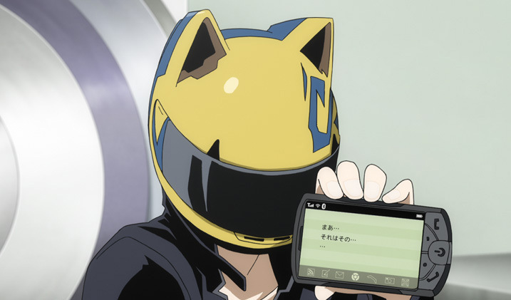
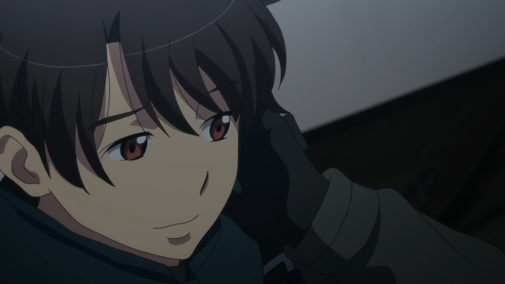
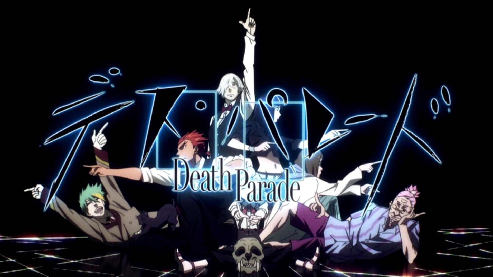
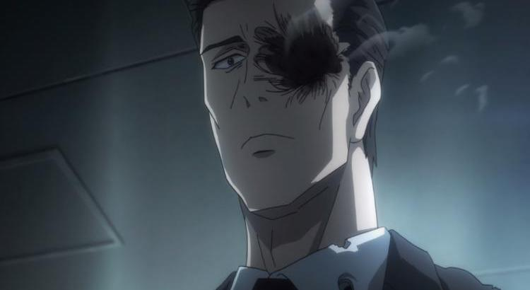
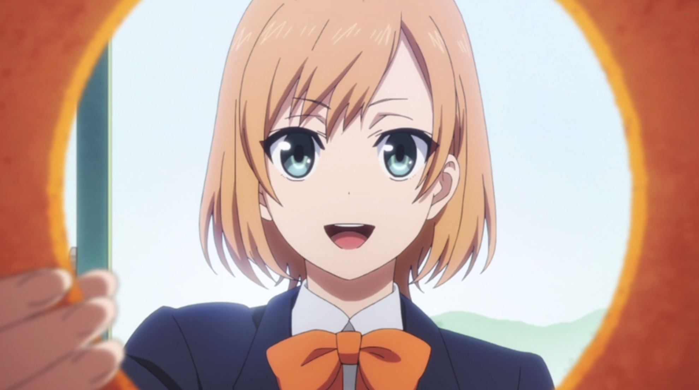
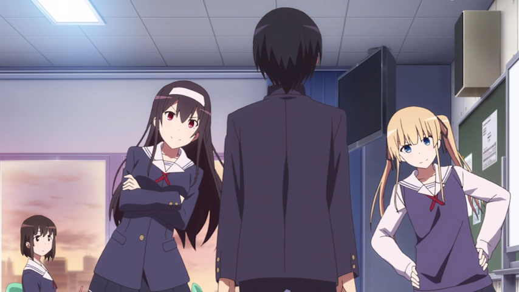
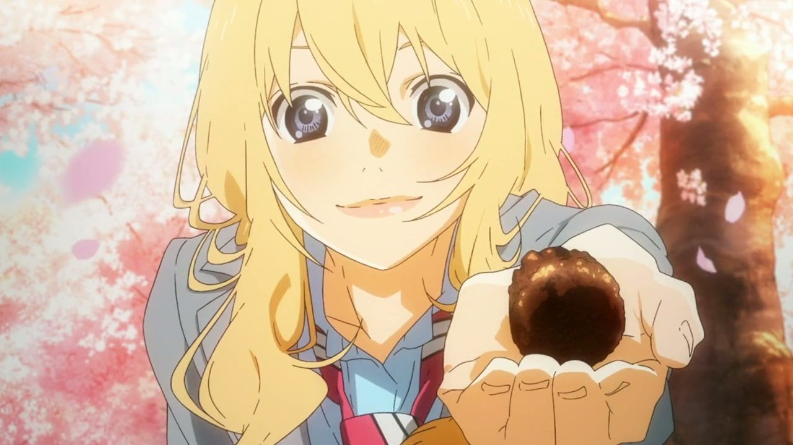

---
{
  title: "Rockmandash's Top 5 Anime of Winter 2015",
  tags:
    ["Rockmandash Rambles", "Top Lists", "Winter 2015", "AniTAY", "Tayclassic"],
  published: "2015-04-02T10:15:00-04:00",
  attached: [],
  license: "cc-by-4",
  oldArticle: true,
}
---

Everyone has their own preferences, tastes, etc. While the <a class="sc-1out364-0 hMndXN sc-145m8ut-0 gIacKn js_link" data-ga='[["Embedded Url","External link","http://anitay.kinja.com/the-seven-anime-of-winter-2015-to-watch-1688346381",{"metric25":1}]]' href="http://anitay.kinja.com/the-seven-anime-of-winter-2015-to-watch-1688346381" rel="noopener noreferrer" target="_blank">Anime Worth</a> <a class="sc-1out364-0 hMndXN sc-145m8ut-0 gIacKn js_link" data-ga='[["Embedded Url","Internal link","http://kotaku.com/five-must-watch-anime-for-winter-2015-1686708546",{"metric25":1}]]' href="http://kotaku.com/five-must-watch-anime-for-winter-2015-1686708546">Watching </a>articles
  do a great representation of shows that the people in AniTAY would recommend, It doesn’t exactly represent personal
  preferences, which I always like to keep in mind when writing. My solution? A list of my favorite anime of the season,
  this time Winter of 2015! Expect these from now on. :) 

So, What are the rules of
  this list, you may ask? If it aired/released this season, it can go on this list. I don’t see the point in only giving
  a show one chance during it’s airing season, and this is my list so I’ll list my favorite shows regardless of what
  season it started on. If this means that one show hogs the top spot for 2 seasons, than good for that show! If it’s an
  OVA or movie that came out during the duration of the season I fell in love with (<strong>*cough*</strong>
<strong><em>AKITO THE EXILED</em> *cough*</strong>), then it may be there. I think that the seasonal split is
  arbitrary and unnecessary, so it’s completely gone here. Sorry about that, but that’s how I’m doing it.

<h3 class="sc-1bwb26k-1 fvCjqJ" id="h113960">Honorable
  Mention #1: <em>Durarara!! X2 Shou</em></h3>

<strong>Plot Description: </strong>Half a year after the turmoil that rocked the
  entire city of Ikebukuro, peace has once again returned to the city, and people are living each day normally. The high
  school students enjoy their days of youth as the strongest and most dangerous man of Ikebukuro works diligently. The
  informant plots (or plans) a new scheme and the headless rider is pursued by the cops as she rides through the
  night... But soon this normal will be cut short by the abnormal. Slowly but surely, the unknown will seize the city
  and face an all new storm. <em>- Plot Description from MAL</em>

<strong>Justification
  &amp; Thoughts: </strong>Uh, If you know anything about my tastes, you would know that <em>Durarara!!</em> is one of
  my favorite shows ever so of course it would be here .. so yeah! Seeing it back again was like seeing an old childhood
  friend for the first time in a few years: Of course, it’s not at the point where it’s at it’s best and the
  interactions are still awkward, but it’s still really nice to see and it’s still just as fun and enjoyable as it
  always was. Really, <em>Durarara!! X2</em> started a bit slow at the beginning, and episode 7 was an absolutely a mess
  in animation, but that’s really OK because it has plenty of time to get back to the level to get back, it’s a new
  studio so of course there’s going to be some growing pains, and most importantly, it still does everything <em>Durarara!!</em>
  S1 did great. It’s still the <em>Durarara!!</em> that people love, and I’m still enjoying the hell out of it. Looking
  forward to the new seasons! (Not the wait though... Tri-split cour??? &gt;_&gt;) For more of my thoughts on
  Durarara!!, check out my <a class="sc-1out364-0 hMndXN sc-145m8ut-0 gIacKn js_link" data-ga='[["Embedded Url","External link","http://anitay.kinja.com/rockmandash-reviews-durarara-anime-1665959528",{"metric25":1}]]' href="http://anitay.kinja.com/rockmandash-reviews-durarara-anime-1665959528" rel="noopener noreferrer" target="_blank">S1 review</a>, and S2 review when
  it comes out. 

<h3 class="sc-1bwb26k-1 fvCjqJ" id="h113961">Honorable
  Mention #2/Guilty Pleasure: <em>Aldnoah.Zero Season 2</em></h3>

<strong>Plot Description: </strong><em>Aldnoah.Zero</em> pretty much consists of
  getting <strong>SLAINED </strong>over and over again. That’s pretty much all you need to know, but if you <strong>REALLY </strong>want
  to know, here’s a real description:

<blockquote class="sc-8hxd3p-0 nvIqO" data-type="BlockQuote">
In 1972, the Apollo 17
  mission found a hypergate to Mars on the surface of the moon. Upon landing, astronauts discovered an enchanted utility
  later referred to as “Aldnoah,” giving the astronauts a status of superiority. Soon, many humans have relocated to
  Mars, and have adapted to the name “Martians.” After Princess Asseylum, a royal Martian princess, descends onto Earth
  in an attempt to create a treaty between both planets, a war breaks out between Earth and Mars, and Martian soldiers
  begin to descend from the sky, riding steel giants, intent on exterminating humanity. - Plot Description From MAL

</blockquote>

<strong>Justification &amp; Thoughts: No, I am not recommending this show. </strong><em>Aldnoah.Zero </em>has
  to be one of the worst shows I have came to adore, and my experience with it is very love/hate, similar to <a class="sc-1out364-0 hMndXN sc-145m8ut-0 gIacKn js_link" data-ga='[["Embedded Url","Internal link","http://tay.kotaku.com/school-days-hq-the-tay-review-1594674728",{"metric25":1}]]' href="http://tay.kotaku.com/school-days-hq-the-tay-review-1594674728">School Days</a>. From the start I never
  had the highest expectations for <em>Aldnoah.Zero</em>, saying that it’s been horrible since the start while people
  were still saying it’s the best thing since sliced bread, but S2 has redeemed itself from the garbage that was Season
  1 by managing to be pretty fucking enjoyable, something that was totally absent from S1 for me. It does this by taking
  a step a notch into absurdity: It’s no longer the train wreck that you can’t stop staring at, it’s escalated to North
  Korea levels of attention grabbing, stupidity and absurdity... it’s so amazing and I can’t help but watching. It’s
  earned it’s spot as one of my top guilty pleasures, it’s a show I love to hate, it’s one of the most interesting
  trolls seen in anime, and I just can’t stop watching... <strong>God damnit. </strong>Check out Koda’s review of <a class="sc-1out364-0 hMndXN sc-145m8ut-0 gIacKn js_link" data-ga='[["Embedded Url","External link","http://anitay.kinja.com/aldnoah-zero-the-ani-tay-review-1637330529",{"metric25":1}]]' href="http://anitay.kinja.com/aldnoah-zero-the-ani-tay-review-1637330529" rel="noopener noreferrer" target="_blank">Aldnoah.Zero S1</a>,
  his review when Season 2 was out. (Dex also has a article about it, so look forward to that ^.^)

<h3 class="sc-1bwb26k-1 fvCjqJ" id="h113962">5. <em>Death
  Parade</em> </h3>

<strong>Plot Description: </strong>After death, humans are either sent to the void
  or reincarnated. But for some, at the instant of their death, they arrive at Quindecim, a bar attended by the
  mysterious white-haired Decim. He challenges them to the Death Game, wherein they wager their lives and reveal their
  true natures. Decim himself is the ultimate arbitrator of who wins and who loses, who will go to the void, and who
  will be reincarnated<em>. - Plot Description from MAL</em>

<strong>Justification
  &amp; Thoughts: </strong>Beautiful animation, fantastic atmosphere, great characters, an excellent execution with the
  concept of death, and an <a class="sc-1out364-0 hMndXN sc-145m8ut-0 gIacKn js_link" data-ga='[["Embedded Url","External link","https://youtu.be/UjjTMNDZi-A",{"metric25":1}]]' href="https://youtu.be/UjjTMNDZi-A" rel="noopener noreferrer" target="_blank">amazing OP</a>
  make for a great watch, and <em>Death Parade </em>is a really quality w as expected from Madhouse. The reason it’s at
  5? The rest of the list is just that good, and it squandered it’s potential at the beginning so I really didn’t care
  for it too much. (The first 2 episodes got me expecting a <em>Zero Escape</em> type of thing, but what I got was an
  episodic game story so I was really disappointed...) That being said, once you hit <a class="sc-1out364-0 hMndXN sc-145m8ut-0 gIacKn js_link" data-ga='[["Embedded Url","External link","https://anitay.kinja.com/death-parade-has-destroyed-all-expectations-1689942332",{"metric25":1}]]' href="https://anitay.kinja.com/death-parade-has-destroyed-all-expectations-1689942332" rel="noopener noreferrer" target="_blank">episodes </a><a class="sc-1out364-0 hMndXN sc-145m8ut-0 gIacKn js_link" data-ga='[["Embedded Url","External link","https://anitay.kinja.com/death-parade-has-destroyed-all-expectations-1689942332#_ga=1.43765477.1523386611.1417386122",{"metric25":1}]]' href="https://anitay.kinja.com/death-parade-has-destroyed-all-expectations-1689942332#_ga=1.43765477.1523386611.1417386122" rel="noopener noreferrer" target="_blank">8 &amp; 9</a>, It improved
  quite a bit, to the point that you can’t help but think.. wow.. that was great. How people and society interact, the
  nature of what it means to be a human, what emotions are, what it means to judge people... these are all handled quite
  well here and it’s pretty enjoyable. For more thoughts, check with out <a class="sc-1out364-0 hMndXN sc-145m8ut-0 gIacKn js_link" data-ga='[["Embedded Url","External link","https://anitay.kinja.com/late-night-drinks-with-a-nomad-death-parade-episode-1-1679848416",{"metric25":1}]]' href="https://anitay.kinja.com/late-night-drinks-with-a-nomad-death-parade-episode-1-1679848416" rel="noopener noreferrer" target="_blank">late night with fruity and dec</a>, <a class="sc-1out364-0 hMndXN sc-145m8ut-0 gIacKn js_link" data-ga='[["Embedded Url","External link","https://anitay.kinja.com/death-parade-has-the-potential-to-become-great-1680091988",{"metric25":1}]]' href="https://anitay.kinja.com/death-parade-has-the-potential-to-become-great-1680091988" rel="noopener noreferrer" target="_blank">Proton’s impressions article</a>, and Proton’s Review when that comes out.

<h3 class="sc-1bwb26k-1 fvCjqJ" id="h113963">4. <em>Parasyte</em>
</h3>

<strong>Plot Description: </strong>The 17-year-old Izumi Shinichi lives with his
  mother and father in a quiet neighborhood in Tokyo. One night, worm-like aliens called Parasytes invade Earth, taking
  over the brains of human hosts by entering through their ears or noses. One Parasyte attempts to crawl into Shinichi’s
  ear while he sleeps, but fails since he is wearing headphones, and enters his body by burrowing into his arm instead,
  taking over his right hand and is named Migi.

Because Shinichi was able to prevent
  Migi from traveling further up into his brain, both beings retain their separate intellect and personality. As the duo
  encounter other Parasytes, they capitalize on their strange situation and gradually form a strong bond, working
  together to survive. This gives them an edge in battling other Parasytes, who frequently attack the pair upon
  realization that Shinichi’s human brain is still intact. Shinichi feels compelled to fight other Parasytes, who devour
  humans as food, while enlisting Migi’s help. - <em>Plot Description from MAL</em>

<strong>Justification &amp; Thoughts: </strong><em>Parasyte</em> is a roller
  coaster, one that may feel off to anyone paying attention to how it deviates from the original, but as one who doesn’t
  know anything about the source at all, I enjoyed the ride, quite a bit. It’s fast yet managed pace pretty great show,
  being well executed, well animated, and engaging throughout. From it’s great pacing, to the interesting premise and
  engaging characters, it’s a show that’s consistently entertaining, very satisfying, and a show you won’t want to miss.
  The reason why it’s where it is on this list is because there were times this season that didn’t nearly grab my
  attention and engage me as it did early on, a lot of aspects in the second half felt pretty rushed and the dubstep
  still bothers me, but otherwise it was a great show that anyone should enjoy. Don’t dismiss it because it’s from an
  older manga, it’s still pretty great! For more thoughts, Check out <a class="sc-1out364-0 hMndXN sc-145m8ut-0 gIacKn js_link" data-ga='[["Embedded Url","External link","http://anitay.kinja.com/parasyte-continues-to-impress-1684106989",{"metric25":1}]]' href="http://anitay.kinja.com/parasyte-continues-to-impress-1684106989" rel="noopener noreferrer" target="_blank">Protonstorm’s </a><a class="sc-1out364-0 hMndXN sc-145m8ut-0 gIacKn js_link" data-ga='[["Embedded Url","External link","http://anitay.kinja.com/parasyte-has-reached-an-all-new-level-1689562055",{"metric25":1}]]' href="http://anitay.kinja.com/parasyte-has-reached-an-all-new-level-1689562055" rel="noopener noreferrer" target="_blank">articles about it</a>, and the <a class="sc-1out364-0 hMndXN sc-145m8ut-0 gIacKn js_link" data-ga='[["Embedded Url","External link","http://anitay.kinja.com/parasyte-the-maxim-the-ani-tay-review-1693768288",{"metric25":1}]]' href="http://anitay.kinja.com/parasyte-the-maxim-the-ani-tay-review-1693768288" rel="noopener noreferrer" target="_blank">AniTAY review by Koda</a>.

<h3 class="sc-1bwb26k-1 fvCjqJ" id="h113964">3<em>.
  Shirobako</em></h3>

<strong>Plot Description:</strong> I find that most summaries out there about <em>Shirobako</em>
  are a bit deceiving and don’t actually represent what happens in the show, stating that<em> Shirobako</em> is the
  story of five girls who, after making a short anime while members of their high school animation club, promise to come
  back together as adults and make their own full anime. I believe that, it’s the story of everyone involved in <em>Shirobako </em>trying
  to do their best, to succeed with their goals, usually involving the creation of anime. While the 5 girls do make an
  appearance in the story and are what the story starts with, they are just a piece of the puzzle, a part of the grand
  scheme, and it actually focuses more on the struggles of the animation studio Musashino, and the people there. <em>-
    Plot Descrpiton from my review of Shirobako</em>

<strong>Justification &amp;
  Thoughts: </strong>The best anime about anime you will ever see has been just quite amazing this season, being
  extremely informative, and very entertaining. <strike><em>Animation: The Animation</em></strike><em> Shirobako</em>
  may not be everyone’s cup of tea, but I absolutely adored it, and everything about it. It really made me appreciate
  all the things that the people making anime have to deal with, and to get this peek into the world of animation is
  something I really like. It’s also an entertaining slice of life show as well, and I just love the characters and
  interactions which really add a lot to the show to make it enjoyable, so it’s been nothing but good times for me, even
  enjoying the time I spent thinking about how the people making this show had to deal with the things it was talking
  about. Also, I just really love the little things that this show does, like <a class="sc-1out364-0 hMndXN sc-145m8ut-0 gIacKn js_link" data-ga='[["Embedded Url","Internal link","http://kotaku.com/now-this-is-a-smart-anime-gag-1689819988",{"metric25":1}]]' href="http://kotaku.com/now-this-is-a-smart-anime-gag-1689819988">the little things it does with animation</a>,
  <a class="sc-1out364-0 hMndXN sc-145m8ut-0 gIacKn js_link" data-ga='[["Embedded Url","External link","http://myanimelist.net/forum/?topicid=1343879",{"metric25":1}]]' href="http://myanimelist.net/forum/?topicid=1343879" rel="noopener noreferrer" target="_blank">the countless references</a>,
  <a class="sc-1out364-0 hMndXN sc-145m8ut-0 gIacKn js_link" data-ga='[["Embedded Url","External link","https://www.youtube.com/watch?v=ZJLiu8zwAIE",{"metric25":1}]]' href="https://www.youtube.com/watch?v=ZJLiu8zwAIE" rel="noopener noreferrer" target="_blank">hypnotizing dancing</a>,
  <a class="sc-1out364-0 hMndXN sc-145m8ut-0 gIacKn js_link" data-ga='[["Embedded Url","External link","https://www.youtube.com/watch?v=VdKKIqDj8ps",{"metric25":1}]]' href="https://www.youtube.com/watch?v=VdKKIqDj8ps" rel="noopener noreferrer" target="_blank">amazing drifting</a>. It’s been a lot of fun to watch :). For more of my
  thoughts on this show, check out <a class="sc-1out364-0 hMndXN sc-145m8ut-0 gIacKn js_link" data-ga='[["Embedded Url","External link","http://anitay.kinja.com/shirobako-the-ani-tay-review-1691227634/",{"metric25":1}]]' href="http://anitay.kinja.com/shirobako-the-ani-tay-review-1691227634/" rel="noopener noreferrer" target="_blank">my review of this show</a>,
  or <a class="sc-1out364-0 hMndXN sc-145m8ut-0 gIacKn js_link" data-ga='[["Embedded Url","Internal link","http://kotaku.com/shirobako-is-an-anime-about-making-anime-1680383301#_ga=1.196212073.473183827.1418699279",{"metric25":1}]]' href="http://kotaku.com/shirobako-is-an-anime-about-making-anime-1680383301#_ga=1.196212073.473183827.1418699279">Richard’s over on Kotaku</a>.

<h3 class="sc-1bwb26k-1 fvCjqJ" id="h113965">2. <em>Saekano:
  Saenai Heroine no Sodatekata</em></h3>

<strong>Plot Description: </strong>The life of Tomoyo Aki, a highschool otaku
  working part time to support his BD hoarding. With remarkable luck, he bumps head-first into, Megumi Kato, the most
  beautiful girl he has ever seen. Naturally, the meeting twists his life into a complicated torrent of relationships.
  Eriri Spencer Sawamura, his half-foreigner childhood friend who’s always valued her relationship with MC. Kasumigaoka
  Utaha, a cold, composed renowned literary genius who shoves everyone aside from our protagonist. What is this? An
  eroge introduction?

The tale of a small not quite doujin circle, but not quite indie
  studio’s journey through the tough territory of comiket and beyond.<em> - Plot Description from MAL</em>

<strong>Justification &amp; Thoughts: </strong>Ever since I fell in love with <em>The
  World God Only Knows</em>, I’ve been searching for more of that, a show that manages to pull off a meta romantic
  comedy that plays off of the tropes we all know and love well with really solid humor and interactions in general. You
  can’t believe how excited I was when I finally found what I was looking for in <em><strike>Best Girl: The Animation
    Winter 2015</strike></em> <em>Saekano</em> which even has the extreme Otaku as the MC! Every episode has been
  entertaining and hilarious, with absolutely amazing character interactions, excellent execution of meta elements, and
  just well written comedy in general. All the characters here are just fantastic and the premise really enables this
  show to use them to their full potential. Really, it’s nothing new, <a class="sc-1out364-0 hMndXN sc-145m8ut-0 gIacKn js_link" data-ga='[["Embedded Url","External link","http://anitay.kinja.com/ani-tay-podcast-episode-10-from-ani-tay-with-love-1684583335",{"metric25":1}]]' href="http://anitay.kinja.com/ani-tay-podcast-episode-10-from-ani-tay-with-love-1684583335" rel="noopener noreferrer" target="_blank">as Fruity would tell you</a>, but I find that it does everything extremely well and
  I’ve been enjoying every minute of it. For more thoughts on <em>Saekano</em>, check out <a class="sc-1out364-0 hMndXN sc-145m8ut-0 gIacKn js_link" data-ga='[["Embedded Url","External link","http://anitay.kinja.com/saekano-knows-how-to-make-itself-better-1682761576",{"metric25":1}]]' href="http://anitay.kinja.com/saekano-knows-how-to-make-itself-better-1682761576" rel="noopener noreferrer" target="_blank">Protonstorm’s impressions article</a>, and<a class="sc-1out364-0 hMndXN sc-145m8ut-0 gIacKn js_link" data-ga='[["Embedded Url","External link","http://anitay.kinja.com/saekano-how-to-raise-a-boring-girlfriend-the-ani-tay-1693443663",{"metric25":1}]]' href="http://anitay.kinja.com/saekano-how-to-raise-a-boring-girlfriend-the-ani-tay-1693443663" rel="noopener noreferrer" target="_blank"> his AniTAY review of it</a>. 

<h3 class="sc-1bwb26k-1 fvCjqJ" id="h113966">1. <em>Your
  Lie in April</em></h3>

<strong>Plot Description: </strong>Kousei Arima is a former piano prodigy who lost
  his ability to hear the piano after the death of his mother. Two years later he has not played the piano since and
  sees the world in monotone without color but is content with his life until he meets a girl who changes everything.
  Kaori Miyazono is a free spirited and beautiful violinist who changes Kousei’s perspective and makes his world
  colorful again, helping him return to the world of music. <em>– Plot Summary from Mdub’s </em><a class="sc-1out364-0 hMndXN sc-145m8ut-0 gIacKn js_link" data-ga='[["Embedded Url","External link","http://anitay.kinja.com/you-should-be-watching-your-lie-in-april-1648891546",{"metric25":1}]]' href="http://anitay.kinja.com/you-should-be-watching-your-lie-in-april-1648891546" rel="noopener noreferrer" target="_blank"><em>You Should Be Watching Your Lie in April article</em></a>

<strong>Justification &amp; Thoughts: </strong>More like Your Cry in April, right? <a class="sc-1out364-0 hMndXN sc-145m8ut-0 gIacKn js_link" data-ga='[["Embedded Url","External link","http://anitay.kinja.com/op-eds-a-day-by-ani-tay-roundup-week-10-march-1st-8-1689842460",{"metric25":1}]]' href="http://anitay.kinja.com/op-eds-a-day-by-ani-tay-roundup-week-10-march-1st-8-1689842460" rel="noopener noreferrer" target="_blank">If </a><a class="sc-1out364-0 hMndXN sc-145m8ut-0 gIacKn js_link" data-ga='[["Embedded Url","External link","http://anitay.kinja.com/is-this-anime-season-really-that-bad-1689767939",{"metric25":1}]]' href="http://anitay.kinja.com/is-this-anime-season-really-that-bad-1689767939" rel="noopener noreferrer" target="_blank">yo</a><a class="sc-1out364-0 hMndXN sc-145m8ut-0 gIacKn js_link" data-ga='[["Embedded Url","External link","http://anitay.kinja.com/is-this-anime-season-really-that-bad-1689767939",{"metric25":1}]]' href="http://anitay.kinja.com/is-this-anime-season-really-that-bad-1689767939" rel="noopener noreferrer" target="_blank">u’ve</a> <a class="sc-1out364-0 hMndXN sc-145m8ut-0 gIacKn js_link" data-ga='[["Embedded Url","External link","http://anitay.kinja.com/ani-kei-meeting-6-that-distance-1690281769",{"metric25":1}]]' href="http://anitay.kinja.com/ani-kei-meeting-6-that-distance-1690281769" rel="noopener noreferrer" target="_blank">spent</a> <a class="sc-1out364-0 hMndXN sc-145m8ut-0 gIacKn js_link" data-ga='[["Embedded Url","External link","http://anitay.kinja.com/ani-tay-podcast-episode-11-the-musical-edition-1690095853",{"metric25":1}]]' href="http://anitay.kinja.com/ani-tay-podcast-episode-11-the-musical-edition-1690095853" rel="noopener noreferrer" target="_blank">any</a> <a class="sc-1out364-0 hMndXN sc-145m8ut-0 gIacKn js_link" data-ga='[["Embedded Url","External link","http://anitay.kinja.com/op-ed-a-day-66-nanairo-symphony-your-lie-in-apri-1682050967",{"metric25":1}]]' href="http://anitay.kinja.com/op-ed-a-day-66-nanairo-symphony-your-lie-in-apri-1682050967" rel="noopener noreferrer" target="_blank">time</a> <a class="sc-1out364-0 hMndXN sc-145m8ut-0 gIacKn js_link" data-ga='[["Embedded Url","External link","http://anitay.kinja.com/the-ani-tay-interview-ani-kei-strikes-1679606137",{"metric25":1}]]' href="http://anitay.kinja.com/the-ani-tay-interview-ani-kei-strikes-1679606137" rel="noopener noreferrer" target="_blank">on</a> <a class="sc-1out364-0 hMndXN sc-145m8ut-0 gIacKn js_link" data-ga='[["Embedded Url","External link","http://anitay.kinja.com/ani-tays-top-15-anime-openings-of-2014-1672601925",{"metric25":1}]]' href="http://anitay.kinja.com/ani-tays-top-15-anime-openings-of-2014-1672601925" rel="noopener noreferrer" target="_blank">AniTAY</a> <a class="sc-1out364-0 hMndXN sc-145m8ut-0 gIacKn js_link" data-ga='[["Embedded Url","External link","http://anitay.kinja.com/my-best-list-of-best-girls-of-2014-1678411311",{"metric25":1}]]' href="http://anitay.kinja.com/my-best-list-of-best-girls-of-2014-1678411311" rel="noopener noreferrer" target="_blank">in</a> <a class="sc-1out364-0 hMndXN sc-145m8ut-0 gIacKn js_link" data-ga='[["Embedded Url","External link","http://anitay.kinja.com/op-ed-a-day-35-hikaru-nara-your-lie-in-april-1682043992",{"metric25":1}]]' href="http://anitay.kinja.com/op-ed-a-day-35-hikaru-nara-your-lie-in-april-1682043992" rel="noopener noreferrer" target="_blank">the</a> <a class="sc-1out364-0 hMndXN sc-145m8ut-0 gIacKn js_link" data-ga='[["Embedded Url","Internal link","http://tay.kotaku.com/about-the-cliche-love-story-1653388127",{"metric25":1}]]' href="http://tay.kotaku.com/about-the-cliche-love-story-1653388127">past</a> <a class="sc-1out364-0 hMndXN sc-145m8ut-0 gIacKn js_link" data-ga='[["Embedded Url","External link","http://anitay.kinja.com/ani-kei-meeting-6-that-distance-1690281769",{"metric25":1}]]' href="http://anitay.kinja.com/ani-kei-meeting-6-that-distance-1690281769" rel="noopener noreferrer" target="_blank">few</a>
<a class="sc-1out364-0 hMndXN sc-145m8ut-0 gIacKn js_link" data-ga='[["Embedded Url","External link","http://anitay.kinja.com/fataliss-thoughts-on-anime-in-2014-also-my-top-5-list-1678425199",{"metric25":1}]]' href="http://anitay.kinja.com/fataliss-thoughts-on-anime-in-2014-also-my-top-5-list-1678425199" rel="noopener noreferrer" target="_blank">months</a>, you would know how crazy everyone’s been over
  this show, and for a good reason. It’s blown my mind with how great it has been, and the emotions it’s evoked has
  really been something I have loved, and it’s only gotten better since I did my <a class="sc-1out364-0 hMndXN sc-145m8ut-0 gIacKn js_link" data-ga='[["Embedded Url","External link","http://anitay.kinja.com/rockmandashs-top-ten-anime-of-2014-1676188044",{"metric25":1}]]' href="http://anitay.kinja.com/rockmandashs-top-ten-anime-of-2014-1676188044" rel="noopener noreferrer" target="_blank">top 10 anime of 2014</a> list, pushing itself to be one of my favorite anime of all
  time. It’s a show that blends music seamlessly into the storyline better than almost every other show I’ve seen so far
  (yeah, nothing will beat<a class="sc-1out364-0 hMndXN sc-145m8ut-0 gIacKn js_link" data-ga='[["Embedded Url","Internal link","http://tay.kotaku.com/dexs-review-white-album-2-1488422133",{"metric25":1}]]' href="http://tay.kotaku.com/dexs-review-white-album-2-1488422133"> White Album 2</a>
  or <a class="sc-1out364-0 hMndXN sc-145m8ut-0 gIacKn js_link" data-ga='[["Embedded Url","Internal link","http://tay.kotaku.com/rockmandash-reviews-kara-no-kyoukai-the-garden-of-si-1524615358",{"metric25":1}]]' href="http://tay.kotaku.com/rockmandash-reviews-kara-no-kyoukai-the-garden-of-si-1524615358">KnK</a>
  in this aspect... sorry guys!), has passionate emotions and great characters. How can I not love this show? This show
  is a blast to watch, I love the development and reactions of the characters (and how relatable the characters were to
  me, expecially Kousei), and the show is just extremely well written. The show gets you emotionally attached with an
  amazing display of tone and a narrative that’s as moving as the music itself... it’s executed great and it’s pretty
  amazing. For more thoughts, Check out <a class="sc-1out364-0 hMndXN sc-145m8ut-0 gIacKn js_link" data-ga='[["Embedded Url","External link","http://anitay.kinja.com/you-should-be-watching-your-lie-in-april-1648891546",{"metric25":1}]]' href="http://anitay.kinja.com/you-should-be-watching-your-lie-in-april-1648891546" rel="noopener noreferrer" target="_blank">Mdub’s You should be watching article</a>,
  <a class="sc-1out364-0 hMndXN sc-145m8ut-0 gIacKn js_link" data-ga='[["Embedded Url","External link","http://anitay.kinja.com/your-lie-in-april-resonates-with-me-on-multiple-levels-1681269152",{"metric25":1}]]' href="http://anitay.kinja.com/your-lie-in-april-resonates-with-me-on-multiple-levels-1681269152" rel="noopener noreferrer" target="_blank">Protonstorm’s resonation article</a>, <a class="sc-1out364-0 hMndXN sc-145m8ut-0 gIacKn js_link" data-ga='[["Embedded Url","External link","http://anitay.kinja.com/kousei-s-mom-vs-kaori-food-for-thought-1679874907",{"metric25":1}]]' href="http://anitay.kinja.com/kousei-s-mom-vs-kaori-food-for-thought-1679874907" rel="noopener noreferrer" target="_blank">Fatalis’s food for thought article</a> and <a class="sc-1out364-0 hMndXN sc-145m8ut-0 gIacKn js_link" data-ga='[["Embedded Url","External link","http://anitay.kinja.com/your-lie-in-april-the-ani-tay-review-1691904314",{"metric25":1}]]' href="http://anitay.kinja.com/your-lie-in-april-the-ani-tay-review-1691904314" rel="noopener noreferrer" target="_blank">Mdub’s review</a>.

Thank you for reading through my list of favorite anime of
  Winter 2015, I really appreciate it! What are some shows of the season you liked, and what are your top 5! I would
  love to see your comments down in the comments below :)

<em>Rockmandash is a frequent writer of Visual Novels and anime on </em><a class="sc-1out364-0 hMndXN sc-145m8ut-0 gIacKn js_link" data-ga='[["Embedded Url","External link","http://rockmandash12.kinja.com/#_ga=1.122760139.1523386611.1417386122",{"metric25":1}]]' href="http://rockmandash12.kinja.com/#_ga=1.122760139.1523386611.1417386122" rel="noopener noreferrer" target="_blank"><em>this blog</em></a><em> and the </em><a class="sc-1out364-0 hMndXN sc-145m8ut-0 gIacKn js_link" data-ga='[["Embedded Url","External link","http://anitay.kinja.com/#_ga=1.196883561.473183827.1418699279",{"metric25":1}]]' href="http://anitay.kinja.com/#_ga=1.196883561.473183827.1418699279" rel="noopener noreferrer" target="_blank"><em>AniTAY Blog</em></a><em>
  as well. Come and check them out if you are interested in reviews and opinion pieces on these topics! For an
  explanation of my review system, </em><a class="sc-1out364-0 hMndXN sc-145m8ut-0 gIacKn js_link" data-ga='[["Embedded Url","Internal link","http://tay.kotaku.com/rockmandash-rambles-an-explanation-on-my-review-system-1619265485#_ga=1.122760139.1523386611.1417386122",{"metric25":1}]]' href="http://tay.kotaku.com/rockmandash-rambles-an-explanation-on-my-review-system-1619265485#_ga=1.122760139.1523386611.1417386122"><em>check this out</em></a><em>,
  and here’s </em><a class="sc-1out364-0 hMndXN sc-145m8ut-0 gIacKn js_link" data-ga='[["Embedded Url","External link","http://rockmandash12.kinja.com/rockmandash-rambles-my-personal-biases-in-reviewing-1688152053",{"metric25":1}]]' href="http://rockmandash12.kinja.com/rockmandash-rambles-my-personal-biases-in-reviewing-1688152053" rel="noopener noreferrer" target="_blank"><em>my biases in reviewing</em></a><em>.</em>

<em>Edit 4/2/15: Watched the last few death parade episodes and really loved it, so now
  it’s sitting at 5. Yatterman Night got knocked off because having 3 HMs is stupid, but you can read my
  writeup </em><a class="sc-1out364-0 hMndXN sc-145m8ut-0 gIacKn js_link" data-ga='[["Embedded Url","External link","https://docs.google.com/document/d/18sr2qNXWLo3N3nnE5fzAGfJK3CMAHOC4eRmW6Q7h-n8/edit?usp=sharing",{"metric25":1}]]' href="https://docs.google.com/document/d/18sr2qNXWLo3N3nnE5fzAGfJK3CMAHOC4eRmW6Q7h-n8/edit?usp=sharing" rel="noopener noreferrer" target="_blank"><em>here</em></a><em>.</em>

