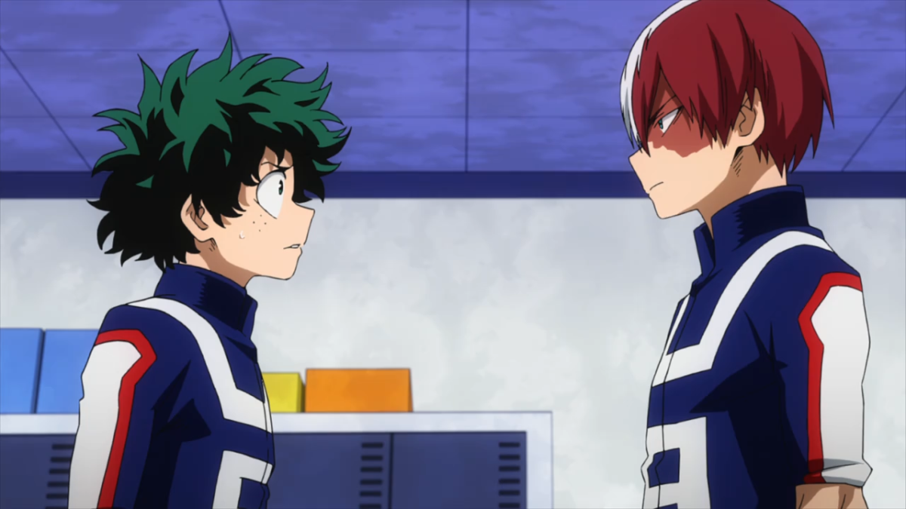
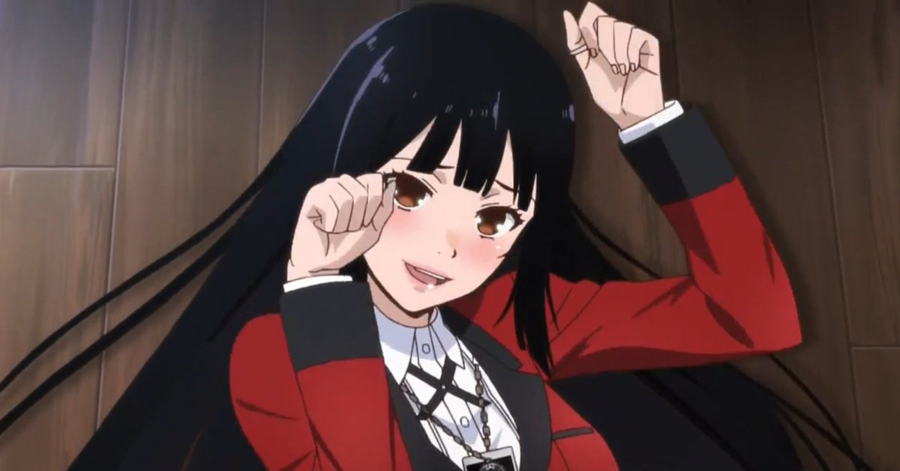

---
{
	title: "RockmanDash's Top Anime of 2017",
	published: "2018-01-22T23:58:00-05:00",
	tags: ["Top Lists", "Rockmandash Rambles", "AniTAY", "Anime"],
	kinjaArticle: true
}
---

<video src="./egqucgky3so5ym0yqp95.mp4"></video>

2017 was a year full of ups and downs, but at the end of the year, it’s hard to help but look back at the positives, the best of the best. This includes anime, and I thought I’d chip in my 2 cents on what I thought were the best this year, My Top anime of 2017.

***

# Rules

My rules of this list are simple: if it aired/released this year, it can go on this list. I don’t see the point in only giving a show one chance during it’s airing season, and this is my list so I’ll list my favorite shows regardless of what season it started on. If this means that one show hogs the top spot for 2 seasons, than good for that show! If it’s an OVA or movie that came out during the duration of the season I fell in love with, then it may be there. I think that the seasonal split is arbitrary and unnecessary, so it’s completely gone here. Sorry about that, but that’s how I’m doing it.

Just an FYI, the placement of the show in the list is mostly based on my experience and enjoyment of the work, so if you’re wondering why something isn’t where you think it should be or you can’t really tell via the justification, that’s probably why. Keep in mind, just because a show is lower on the list doesn’t mean it’s bad - all of these are great, and a lower placement isn’t a mark against the show, at this point it’s nearly all personal preference. With that out of the way, let’s get started!

***

# Thoughts on Anime in 2017:

To be honest, I was pretty underwhelmed by anime in 2017. After the amazing winter season, there was nothing that really grabbed me, nothing that kept me consistently watching anime and as a result, I lapsed in my anime watching significantly. A part of this is due to the fact that many shows I was interested were locked in the double paywall that was amazon strike, which as a poor college student I really couldn’t justify paying for. I could pirate, sure, but I don’t typically watch on a laptop or desktop, and mobile apps and sites for pirating services usually suck ass... so I just watched less anime. RIP\
\
That being said, there were some damn great movies that came out in 2017, and I loved seeing them.* Fate/stay night Heaven’s feel*, *Silent Voice* &* Your Name.* (which I think of it more as a 2016 anime bc saw at AX and thus won’t be on this list) were all fantastic and as someone who loves anime movies I hope other years will be as great as this was for anime movies.

***

# Honorable Mention: *Ancient Magus Bride*

**Anime Made By: **Wit Studio

**Genres:** Slice of Life, Magic, Fantasy

**Plot Summary:** Chise Hatori, an unloved and depressed orphan who has seen strange monsters all her life, sells herself at auction to the highest bidder in an attempt to find a place where she will be wanted, even as a trophy. However, when she is bought by the horned, skull-faced Elias Ainsworth, Chise finds herself the apprentice, and nominal bride of the inhuman mage, who welcomes her into his world full of faeries, magic and wonder. -* Plot Summary from *[***The 9 Anime Of Fall 2017 You Should Be Watching***](https://anitay.kinja.com/the-9-anime-of-fall-2017-you-should-be-watching-1820782315#_ga=2.242176129.283022684.1516595779-1252363867.1516472140)*** article***

**Justification & Thoughts: **I love *Ancient Magus Bride*, a modern day fantasy show that is absolutely stunning, but it’s an honorable mention because it failed to do something that I feel like is mandatory to be in my top lists: *AMB* failed to compel me in a manner that gets me to watch the show every week, to be fully engaged and invested in the show. *AMB *is actually the reason that this list is late (I’m still not caught up :|), but it is definitely worth a watch thanks to its stunning visual design & animation (I feel obligated to watch on my TV because of it), its fantastic setting and an amazing cast. It’s a great watch, but it’s just not all that gripping.

***

# 8. *Recovery of an MMO Junkie*

**Anime Made By: **Signal. MD

**Genres: **Comedy, Romance

**Plot Summary:** Moriko Morioka is a business woman who works long hours at an unsatisfying job…or at least she did, until she quit. Now, Moriko is a shut-in and spends her days absorbed in her favorite MMO, Fruits der Mer. She plays a 20-year-old male character named Hayashi and is a member of a guild. Over time, Moriko/Hayashi becomes close friends with one of her guildmates, a girl named Lily. However, neither of them know each other in real life, so Lily is not aware that Hayashi is actually an adult woman. After all, it’s impossible to know if someone is the same in-game as they are in real life. But what if Lily had a similar secret? **-* Plot Summary from ***[***The 9 Anime Of Fall 2017 You Should Be Watching***](https://anitay.kinja.com/the-9-anime-of-fall-2017-you-should-be-watching-1820782315#_ga=2.242176129.283022684.1516595779-1252363867.1516472140)*** article***

**Justification & Thoughts: ***Recovery of an MMO Junkie* is one of the best romances this year in anime, and that’s not because it does anything outlandish, but because of how grounded it is to reality. *MMO* shows a side of life that isn’t typically shown in anime - romance in life past high school and the results of the harsh realities that is being an adult, with a touch of recovering from depression and video games. With an amazing lead heroine, great character dynamics and a fun romance, it’s definitely worth a watch

***

# 7.* Saekano: How to Raise a Boring Girlfriend ♭*

**Anime Made By: **A-1 Pictures

**Genres: **Comedy, Romance, Drama, Harem, Ecchi\
 \
**Plot Summary: **Tomoya Aki, an otaku, has been obsessed with collecting anime and light novels for years, attaching himself to various series with captivating stories and characters. Now, he wants to have a chance of providing the same experience for others by creating his own game, but unfortunately, Tomoya cannot do this task by himself.

He successfully recruits childhood friend Eriri Spencer Sawamura to illustrate and literary elitist Utaha Kasumigaoka to write the script for his visual novel, while he directs. Super-group now in hand, Tomoya only needs an inspiration to base his project on, and luckily meets the beautiful, docile Megumi Katou, who he then models his main character after.

Using what knowledge he has, Tomoya creates a new doujin circle with hopes to touch the hearts of those who play their game. What he does not realize, is that to invoke these emotions, the creators have had to experience the same feelings in their own lives.*** - Plot Summary from MAL***

**Justification & Thoughts: ***Saekano *is my jam, and one of my favorite series to come out of the last few years. As a person who loves Visual Novels, loves to hear about people making things, loves romantic comedies and loves dramas, *Saekano* is the exact type of show I would fall in love with, and thanks to it’s absolutely fantastic execution, I certainly have. Add to the fact that *Saekano *shares shares many of the strengths that made White Album 2 great because they were made by the same person (Maruto Fumiaki) and what you have left is a very compelling and enjoyable watch, one I fell in love with.

While at the beginning Season 2 seemed like more of* Best Girl: The Animation* with entertaining dialogue, harem antics and meta humor all over the place (which I still loved, mind you because its damn enjoyable), Season 2 finally kicked into what one would expect from Maruto Fumiaki. In *Saekano S2*, everything about the perfect harem setting starts to fall apart, and in it’s place we have a fantastic and engaging drama that is built on well developed characters in an engaging premise. We see everything we loved from the first season be enhanced while *Saekano* becomes a much better show as a whole with more meaningful interactions between characters and a more gripping story in general. This is a work that shows the viewer the impacts of what it means to put your heart and soul into a creative process, what it means to work with others as a team, on creating something and the impacts of working in a team on such a creative work has as a whole. Ultimately, it’s still not a* White Album 2* of romantic perfection as it still overdosing on ecchi and silly antics given it’s harem meta anime roots, but it’s one of my favorite anime, and I definitely encourage you to give it a shot if you think you’d be interested in it.

***

# 6.* Fate/stay night Heaven’s Feel Presage Flower*

**Anime Made By: **Ufotable

**Genres: **Action, Magic, Fantasy, Supernatural, Shounen

**Plot Summary: ***Fate/stay night *follows Emiya Shirou as he is dragged into a fight-to-the-death tournament called The Fifth Holy Grail War, where people known as Masters fight with heroes throughout history, known as Servants, for a chance to get the wish-granting Holy Grail. In *Heaven’s Feel-Presage Flowe*r however, this all just serves as a backdrop to a more personal story, as *Heaven’s Feel* has always been a significant subversion in comparison to the rest of *Fate/stay night*,* *and we should see some of that come to play near the end of* Presage flower*. *Fate/stay night *as a whole is a story about ideals and heroism, what it truly means to be a hero... but unlike the other routes, *Heaven’s Feel *challenges the core concept of hero and the realities of it. Fans of *Zero* will be right at home, and everyone else will be here for a ride.*** - Plot Summary from ***[***The AniTAY Fall 2017 Sequel Guide***](https://anitay.kinja.com/the-official-anitay-fall-2017-sequel-guide-1818721437#_ga=2.171359395.283022684.1516595779-1252363867.1516472140)

**Justification & Thoughts: **To me, there are 2 types of good adaptations: the first is to make a work better than the original, with the primary goal to create a great work that stands on its own right, even if it isn’t accurate to the source. The second, is to create a work that is focused more on accuracy, not to translate a work scene by scene or whatever, but to create a work that captures the essence of what made the original great try to transplant the experience of the original work in the new medium.

In my opinion, while none of the other* Fate/stay night* anime managed to do either of these, *Presage Flower* definitely does, fitting squarely into the second type of good adaptation. The original visual novel presented an experience unlike anything else i’ve played and it had a profound impact on me and how I view the world around me. To see someone that really understands the work, to see someone really put effort into portraying the essence and experience of the best route in *Fate/stay night*... to see ufotable do* Fate/stay night *justice after I was so disapointed with [*Unlimited Blade Works*](https://rockmandash12.kinja.com/fate-stay-night-unlimited-blade-works-tv-is-beautifu-1642722982#_ga=2.42424486.283022684.1516595779-1252363867.1516472140) really made me happy.* Heaven’s feel* acts as a fascinating subversion of the other parts of *Fate/stay night*, so you do need to see the previous parts of *Fate/stay night* before you watch* Heaven’s feel*, but if you have, what you’ll get out of* Fate/stay night Heaven’s Feel Presage Flower* is a well developed cast of characters, some of the best visuals in the industry with ufotable on a movie budget, a fantastic soundtrack from Yuki Kajiura, and a gripping story, even if it’s only a 3rd of the complete work that is *Heaven’s feel*, and is a tad bit rushed due to the nature of the work.

***

# 5. *Saga of Tanya the Evil*

**Anime Made By: **NUT

**Genres: **Military, Magic, Action

**Plot Summary: **In an alternate version of the year 1924, war rages on, but the most deadly soldier around is neither a grizzled old veteran, nor a wise and patient general. Rather, it is a very young girl by the name of Tanya Gurtcheff, whose mind for tactics and affinity for magic are both second to none. While most of Tanya’s military colleagues either applaud her endless victories, or fear her merciless attitude, not a soul is aware of her true nature. Despite appearances, Tanya is no mere little girl, but a ruthlessly efficient Japanese salaryman, reincarnated into this parallel world after angering a being which called itself “God”, as a wager to see if hardship and turmoil would kindle religious devotion. Eager to prove “God” wrong, Tanya is prepared to use every trick in her arsenal and claw her way to the top of this new reality, in order to once again live a comfy and peaceful existence ***- Plot Summary from ***[***The 8 Anime Of Winter 2017 You Should Be Watching***](https://anitay.kinja.com/the-8-anime-of-winter-2017-you-should-be-watching-1792572408#_ga=2.141893041.283022684.1516595779-1252363867.1516472140)*** article***

**Justification & Thoughts: **Tanya was a really fun, engaging ride. Like the character Tanya herself, Saga of Tanya the Evil the show overcame all exceptions, even as the system was rigged against it’s favor. A show with a loli as a main character in a boring and grey war show, made with a brand new studio... nothing good could have come out of it, but it managed to be amazing. What we got was a fascinating alternate history twist on world war 1 with our main character not being your typical little girl, but a deeply logical Japanese businessman turned into a little girl and facing a relentless battle against god, aka being X! Seeing this conflict was extremely entertaining, adding onto the enjoyment that comes from Tanya as a character, and the amazingly animated fights bring the show into another level, with this being one of my favorite action anime of the year. All and all, a stellar show.

***

# 4. *Silent Voice*

**Anime Made By: **Kyoto Animation

**Genres: **Romance, Coming of Age, Drama

**Plot Summary: **As a wild youth, elementary school student Shouya Ishida sought to beat boredom in the cruelest ways. When the deaf Shouko Nishimiya transfers into his class, Shouya and the rest of his class thoughtlessly bully her for fun. However, when her mother notifies the school, he is singled out and blamed for everything done to her. With Shouko transferring out of the school, Shouya is left at the mercy of his classmates. He is heartlessly ostracized all throughout elementary and middle school, while teachers turn a blind eye.

Now in his third year of high school, Shouya is still plagued by his wrongdoings as a young boy. Sincerely regretting his past actions, he sets out on a journey of redemption: to meet Shouko once more and make amends.\
\
*Koe no Katachi* tells the heartwarming tale of Shouya’s reunion with Shouko and his honest attempts to redeem himself, all while being continually haunted by the shadows of his past.***- Plot Summary from MAL***

**Justification & Thoughts:** Honestly, While I enjoyed the manga of *Silent Voice and* knew it was pretty good, I wasn’t really sure what to expect from the movie of *Silent Voice*, given all the hype from everyone on the internet. Even though I saw the source though, that didn’t lessen the impact of the work for me: KyoAni pulled some movie magic and made a gripping and compelling work, great in basically every way except one.\
\
For me, the pinnacle of a movie experience is being immersed in a human story, and when I witnessed the believable characters faced in a gut wrenching yet ultimately realistic situation, I couldn’t help but felt engaged and entranced, to the point that I was crying in the theaters. The production values were absolutely supurb as KyoAni on a movie budget lead to some absolutely jaw dropping scenes, the voice acting, while not to everyone’s tastes was very effective, and the story was compelling and thought provoking, getting me to walk out of the theaters thinking about how actions effect the lives of others. My one real issue with the movie though, is that it’s a movie: the story is structured in a serialized manner, and the adaptation can’t change that. So, what we got with the movie adaptation of Silent voice was a series of peaks and valleys, with no real satisfying rising action in the story. It felt like KyoAni should have made this a TV anime, but it’s still a great movie and a must watch.

***

# 3. *Descending Stories: Showa Genroku Rakugo Shinju S2*

**Anime Made By:** Studio Deen\
\
**Genre: **Drama, Historical\
\
**Plot Summary:** Following the conclusion of rakugo practitioner Yakumo Yurakutei VIII’s dramatic story of his past growing up under the names Bon and Kikuhiko and his tumultuous friendship with fellow rakugo trainee Sukeroku Yurakutei II and relationship with the geisha Miyokichi, the story shifts to Yakumo’s student Yotaro as he takes on the title of Sukeroku Yurakutei III. Despite becoming well beloved in the rakugo community, Yotaro still struggles with escaping the spectre of his checkered past and finding his own style of rakugo, all while trying to juggle his personal life and helping the field of rakugo evolve with the times, instead of dying out. ***- Plot Summary from the ***[***8 Anime of Winter 2017 You Should Be Watching***](https://anitay.kinja.com/the-8-anime-of-winter-2017-you-should-be-watching-1792572408)*** Article***

**Justification & Thoughts:** It would not be an understatement to say that* Rakugo* is one of the best shows I’ve ever seen. Season 1 was phenomenal; a beautiful and extremely well executed historical drama that absolutely took me and the AniTAY community by surprise. While *Rakugo*’s premise might not strike you as something you’d be interested in watching because it’s simply telling stories, where *Rakugo *shines is the brilliant execution: how it tells the story is what that makes this great, being able to handle all of its elements extremely well. The show has fantastic pacing, solid visuals, a great score, amazing characters and the best part: it’s consistently engaging with every episode being better than the last.\
\
Season 2 was more of* Rakugo *Season 1 which is great, but Season 2 made a fundamental change that takes away from what made me love the show so much, thus the placement at 3 for this year. Season 1 of R*akugo *was a historical set piece, a flashback to a time when master Yakumo was growing up, in one of my favorite settings. Going from a historical coming of age to a more modern story following a yotaro/former criminal as he does rakugo... it wasn’t exactly what I was hoping for. Definitely worth a watch, and the ending is phenomenal, but it isn’t as golden as Rakugo Season 1.

***

# 2. *KonoSuba: God’s Blessing on This Wonderful World! 2*

**Anime Made By: **Studio Deen

**Genre: **Comedy, Slice of Life, Isekai/Another World

**Plot Summary: ***Konosuba* tells the story of Kazuma, a shut-in otaku NEET. Following his sudden death and rebirth into a new fantasy world, Kazuma thought that his new life would be that of an amazing video game hero. However, this fantasy world quickly proved that not to be the case. Kazuma is paired up with useless allies, has mediocre stats, and every time he does something good it seems to just cause more problems for him. After living in this world for a while, he thought that he might grow used to things, but this too is clearly not the case. To make matters worse, after narrowly defending the town from a roving Ancient Weapon/Natural Disaster, Kazuma inadvertently teleported the exploding core of the machine to an aristocrat’s mansion. Now he is suspected of treason. Will his fantasy life ever stop trying to screw him over? **- *Plot Summary from the***[*** 8 Anime of Winter 2017 You Should Be Watching Article***](http://anitay.kinja.com/the-8-anime-of-winter-2017-you-should-be-watching-1792572408)

**Justification & Thoughts: **KO - NO - SU - BA! Spending time with these lovable idiots in Konosuba is always a blast, but with season 2*, Konosuba* is a contender for the best comedy that anime has to offer. Every moment is a blast to watch, and this show had me laughing harder than I thought I could thanks to great character dynamics, hilarious subversions from the fantasy isekai tropes, and entertaining hijinks at every corner. While the animation quality might have dipped, they use the animation more effectively, to make the gags better, to make the show more entertaining, and it really worked. Every moment, every episode had my laughing, and I was always looking forward to the newest episode of this show. I don’t think I’ve laughed as hard as I did with* Konosuba *this season, and I’m not sure if I will ever again.

***

# 1. *Girls’ Last Tour*

**Anime Made By: **White Fox

**Genre: **Sci-Fi, Adventure, Slice of Life

**Plot Summary: **What was once civilization is now desolate ruins. In this bleak landscape travel two girls, Chito and Yuuri, in their nifty Krattenkrad- sort of an armored motorbike with tank treads. They wander from place to place amongst what remains of a civilization they only know about from stories, looking for food, fuel and parts to continue their journey, all whilst having encounters, conversations, and the occasional crisis. The world may be (mostly) empty, but they’ve got each other. - ***Plot Summary from ***[***The 9 Anime Of Fall 2017 You Should Be Watching***](https://anitay.kinja.com/the-9-anime-of-fall-2017-you-should-be-watching-1820782315#_ga=2.242176129.283022684.1516595779-1252363867.1516472140)*** article***

**Justification & Thoughts: ***Girls’ Last Tour* is a show that resonates with me, and I truly felt in love with it, in a manner that screamed to me AOTY, and quite possibly a place in my top 10 anime list. It ticks a lot of boxes: *Girls Last Tour* is a fantastic post apocalyptic slice of life adventure (things I would enjoy by themselves) and thanks to an absolutely amazing execution, we got an incredibly fun yet meaningful show to watch. The slice of life that makes the show feel easy to digest, but it’s also fascinating and engaging in a meaningful manner thanks to the post apocalyptic setting that is thought provoking and keeps you asking questions throughout. The real core of the story is the characters though, like all good slice of life shows are: while we only really focus on our 2 lead characters, they felt like real human beings in a fascinating situation of growing up in a post apocalyptic setting, really unknown about how the world works due to the lack of information in that era, and their interactions between each other were some of the most enjoyable and entertaining I’ve seen all year.

It’s production is amazing too. The music perfectly captures the atmosphere and mood of the world and scenes it has, the ops and eds are some of the most memorable I’ve seen, and the visuals are surprisingly good. Ultimately this show looks a bit basic due to the moe blob art style (which I actually loved because it served to get me to love the characters more as I thought it was very fitting and endearing), but the world that* GLT* portrays is absolutely jaw dropping at times and it has some of the best visual directing I’ve seen in anime. The way that they tease the next topic by hiding it on screen in previous scenes, the way they they provide visual information in a natural manner is superb and lead to *Girls’ Last Tour* looking way better than it’s blobs suggest it should be.\
But if you asked me what was the best part about *Girls’ Last Tour*, I would have to say how consistently compelling it is. At all moments, this work is compelling, endearing, entertaining and engaging - never was there a moment that I didn’t enjoy with this work (both actually watching the show or thinking about the mysteries that the show constructs). So many of the decisions made in this show fit exactly what I love, and I loved this show to no end. Give it a shot!

***

*Thank you for reading! This is Rockmandash Reviews, a blog focused on everything revolving Visual Novels, with stuff like tech and anime every now and then. If you want to check out more of my writing, check out *[*FuwaReviews*](https://fuwanovel.net/reviews-hub/)* and *[*AniTAY*](http://anitay.kinja.com/#_ga=2.29830716.283022684.1516595779-1252363867.1516472140)* where I am a contributor!*
