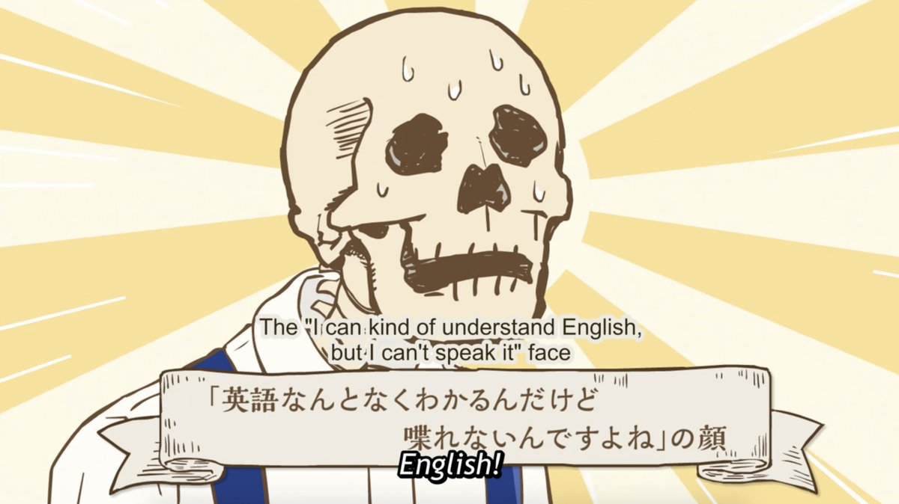
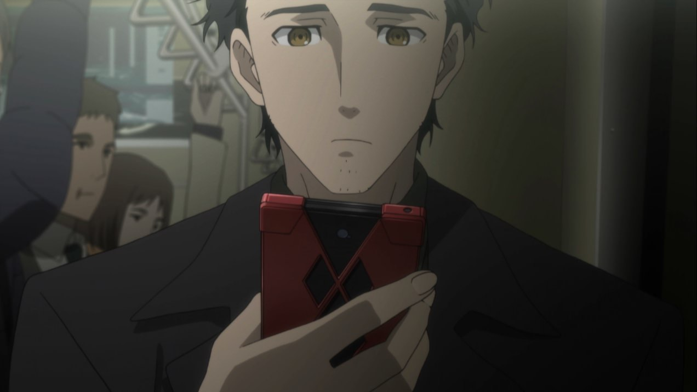
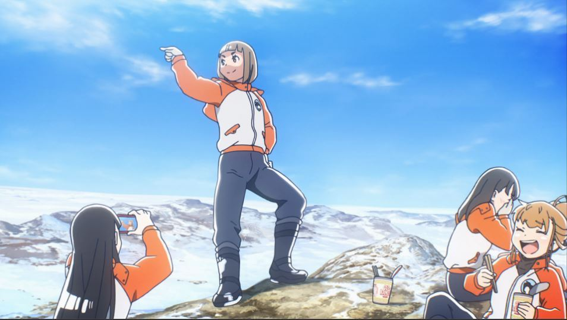
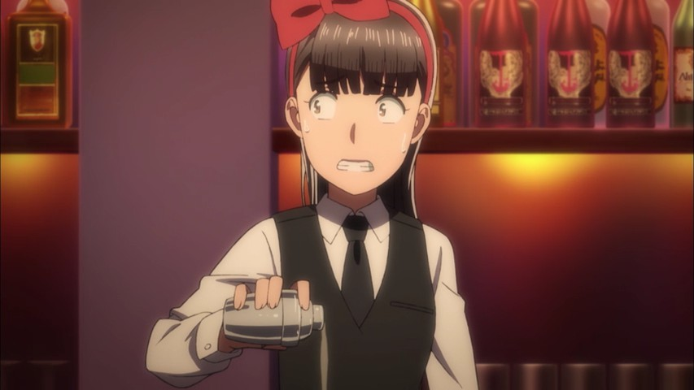
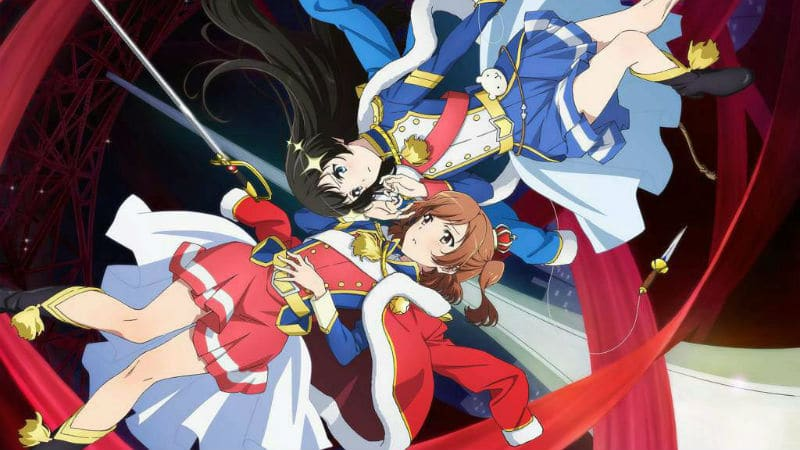
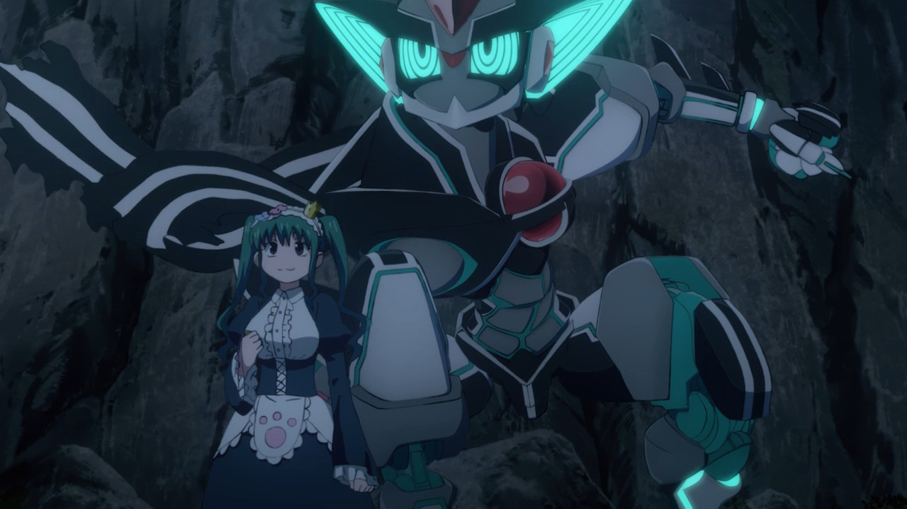
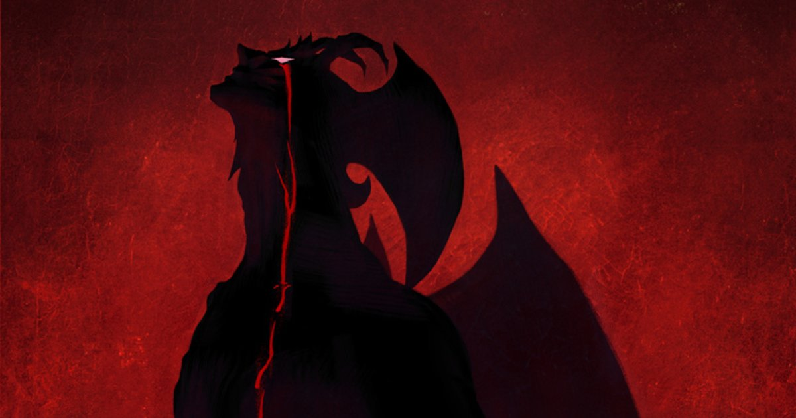
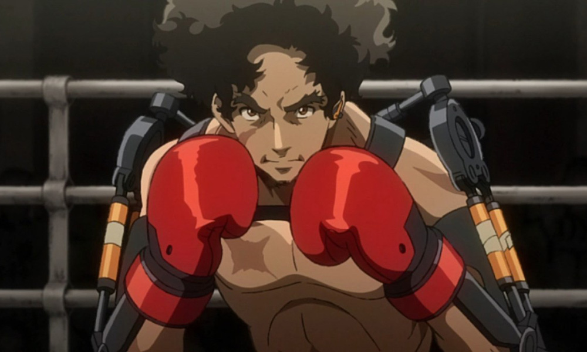
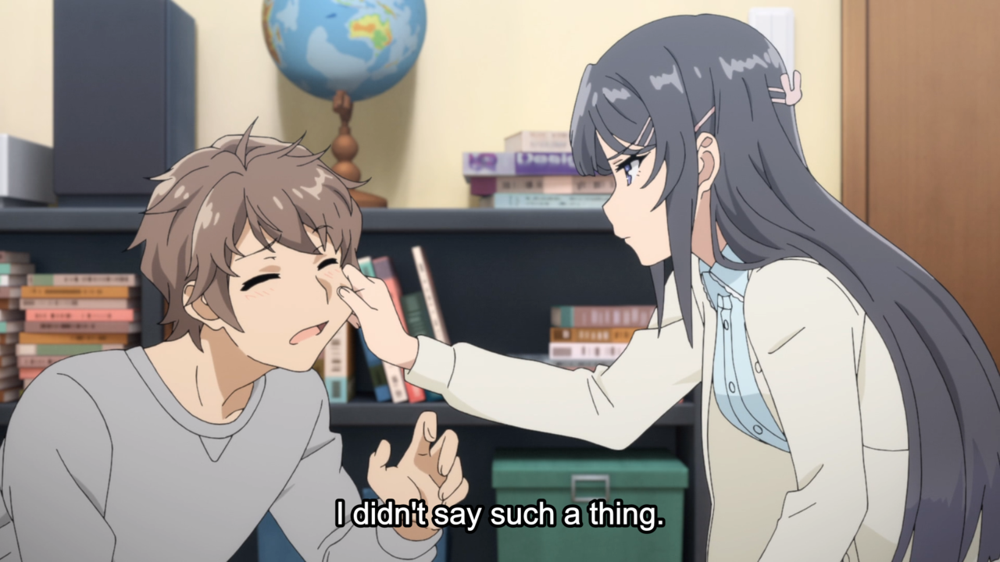
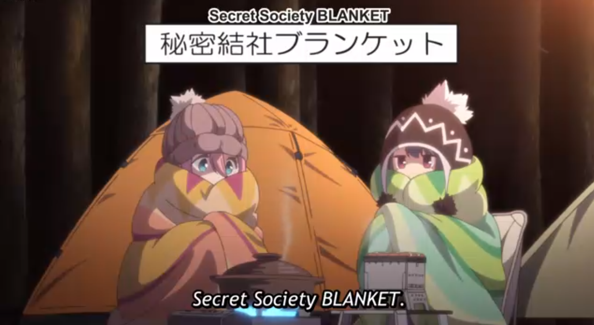

---
{
  title: "RockmanDash's Top Anime of 2018",
  tags: ["Top lists", "Rockmandash Rambles", "AniTay", "Anime"],
  published: "2019-01-07T21:46:00-05:00",
  attached: [],
  kinjaArticle: true,
}
---

<video autoplay="" loop="" muted=""><source src="./umxuwi2jxu0veyok2qqj.mp4" type="video/mp4"/></video>
There’s so many things that define 2018 for me, but at the end of the year, it’s
  hard to help but look back at the positives, the best of the best in regard to anime. Here’s my two cents on my
  favorite anime of the year, my top anime of 2018.

<h2 class="sc-1bwb26k-1 fvCjqJ" id="h103318">Rules
</h2>
<video autoplay="" loop="" muted=""><source src="./agiz2alqtfoa2rrjhjw0.mp4" type="video/mp4"/></video>

My rules of this list are simple: if it aired/released this year, it can go on this
  list. I don’t see the point in only giving a show one chance during it’s airing season, and this is my list so I’ll
  list my favorite shows regardless of what season it started on. If this means that one show hogs the top spot for 2
  seasons, than good for that show! If it’s an OVA or movie that came out during the duration of the season I fell in
  love with, then it may be there. I think that the seasonal split is arbitrary and unnecessary, so it’s completely gone
  here. Sorry about that, but that’s how I’m doing it.

Just an FYI, the placement of
  the show in the list is mostly based on my experience and enjoyment of the work, so if you’re wondering why something
  isn’t where you think it should be or you can’t really tell via the justification, that’s probably why. Keep in mind,
  just because a show is lower on the list doesn’t mean it’s bad - all of these are great, and a lower placement isn’t a
  mark against the show, at this point it’s nearly all personal preference. With that out of the way, let’s get
  started!

<h2 class="sc-1bwb26k-1 fvCjqJ" id="h103319">Thoughts
  on Anime in 2018:</h2>

A part of this is my own circumstance, but a part of it was anime itself: while
  there were some really great anime this year, and I absolutely adore a lot of the shows on this list, outside of this
  there was only a handful of shows that actually kept my interest. Even if I had time to make the seasonal lists, I’m
  not quite sure if I would have been able to find enough shows to fill out the 5 I usually have per season.

That being said, like 2017, there were some damn great movies that came out in 2018, and I
  loved seeing them. <em>Liz and the Blue Bird, Maquia, Night is Short, Walk on Girl,</em> I enjoyed all of the anime
  movies I went to see this year and some of them were just stunning. Shame I wasn’t able to see Mirai, but I had a
  great anime movie year.

One thing about 2018 I did appreciate a lot however, is that because of the anime
  that came out this year, I feel like I finally know what I enjoy in a work - it’s all about the characters. Before I
  thought I enjoyed works that focused on the story first and foremost, disregarding other elements to create a more
  engaging work, but ultimately I’ve learned that I can enjoy a show regardless of it’s premise, so long as the
  interactions between the characters are entertaining and engaging. While I do enjoy a good sci-fi or action show, well
  written, realistic and complex characters are what I love for in a work, and I think this list definitely shows that,
  at least up in the top.

<h2 class="sc-1bwb26k-1 fvCjqJ" id="h103320">Honorable
  Mention: <em>Steins;Gate 0</em></h2>

<strong>Anime Made By: </strong>White Fox

<strong>Genres: </strong>Sci-Fi,
  Slice of Life, Drama, Thriller

<strong>Plot Summary: </strong>The eccentric,
  self-proclaimed mad scientist Rintarou Okabe has become a shell of his former self. Depressed and traumatized after
  failing to rescue his friend Makise Kurisu, he has decided to forsake his mad scientist alter ego and live as an
  ordinary college student. Surrounded by friends who know little of his time travel experiences, Okabe spends his days
  trying to forget the horrors of his adventures alone. 

 While working as a receptionist at a college technology forum, Okabe meets the
  short, spunky Maho Hiyajo, who later turns out to be the interpreter at the forum’s presentation, conducted by
  Professor Alexis Leskinen. In front of a stunned crowd, Alexis and Maho unveil Amadeus—a revolutionary AI capable of
  storing a person’s memories and creating a perfect simulation of that person complete with their personality and
  quirks. Meeting with Maho and Alexis after the presentation, Okabe learns that the two were Kurisu’s colleagues in
  university, and that they have simulated her in Amadeus. Hired by Alexis to research the simulation’s behavior, Okabe
  is given the chance to interact with the shadow of a long-lost dear friend. Dangerously tangled in the past, Okabe
  must face the harsh reality and carefully maneuver around the disastrous consequences that come with disturbing the
  natural flow of time. <em>- Plot Summary from MAL </em> 

<strong>Justification and
  Thoughts:</strong> Huh. If you told me before the show aired that <em>Steins;Gate 0</em> wouldn’t make my top 10 list,
  I probably wouldn’t have believed you. I loved the <a class="sc-1out364-0 hMndXN sc-145m8ut-0 gIacKn js_link" data-ga='[["Embedded Url","External link","https://rockmandash12.kinja.com/rockmandash-reviews-steins-gate-0-visual-novel-ps4-1790389958",{"metric25":1}]]' href="https://rockmandash12.kinja.com/rockmandash-reviews-steins-gate-0-visual-novel-ps4-1790389958" rel="noopener noreferrer" target="_blank">Visual Novel</a>
  of Steins;Gate 0, and the anime definitely had it’s moments, some even better than the VN, ... but the show rubbed me
  the wrong way. A part of this might be that Steins;Gate 0 isn’t as good as I thought it was or it might have been a
  poor adaptation or it might have been fatigue since I played and reviewed the Visual Novel recently, but I just didn’t
  really enjoy it as much as when I played the Visual Novel or as much as I thought it would. 

This anime is still <em>Steins;Gate</em> so the strengths like the enjoyable cast,
  the engaging science and fun slice of life still applies and honestly it’s a better adaptation than I should have
  expected. I think most would say that it’s an objectively good anime, and you can see that from it’s MAL score. It’s
  just that this is my list based on my enjoyment of the show and there were just moments that were either rushed or
  incredibly dull during the anime to the point where I wasn’t a big fan. The second half in my opinion is a bit all
  over the place, too focused to cram new stuff or non-relevant aspects of the show instead of focusing on what makes
  for enjoyable. Also to me, the strengths of <em>Steins;Gate 0</em> is how it manages to convey Okabe’s downtrodden
  feeling after the events unfolded, but the anime doesn’t really do that element of the work justice. It’s a shame, but
  what are you gonna do. :c

<h2 class="sc-1bwb26k-1 fvCjqJ" id="h103321">10.<em> A
  Place Further than the Universe</em></h2>

<strong>Anime Made By: </strong>Madhouse 

<strong>Genres: </strong>Adventure, “Cute Girls Doing Cute Things”

<strong>Plot
  Summary: </strong>Mari Tamaki is second year high school student, who never did anything memorable in her life. Her
  fear of failure prevented her to do anything out of ordinary. When she decides to change it and do something she won’t
  forget, Mari meets Shirase, a girl who’s considered a weirdo by the rest of her class. Her nickname is “Arctic” since
  it’s all she ever talks about. Mari listens to Shirase’s story and is moved by it to the point, where she decides to
  join her in her pursuit of going to Antarctica, despite it’s nearly impossible for high school girls to achieve it.
  <em>- Plot Summary from </em><a class="sc-1out364-0 hMndXN sc-145m8ut-0 gIacKn js_link" data-ga='[["Embedded Url","External link","https://anitay.kinja.com/the-11-anime-of-winter-2018-you-should-be-watching-1823315059",{"metric25":1}]]' href="https://anitay.kinja.com/the-11-anime-of-winter-2018-you-should-be-watching-1823315059" rel="noopener noreferrer" target="_blank"><em>The 11 Anime of Winter 2018 You Should Be Watching</em></a><em>
    article</em>

<strong>Justification and Thoughts: </strong><em>A Place Further than the
  Universe</em> is an absolutely phenomenal show. The journey we watch as our colorful and cute cast grows throughout
  their adventure is gripping, entertaining, emotional. <em>APFttU</em> is a touching story about friendship, defying
  odds and finding closure in your life, a truly moving story that’s executed exceedingly well. It’s a story that I
  enjoyed... but it didn’t really resonate with me, like so many others in this list. 

<em>A Place Further than the Universe</em> isn’t what I was expecting it to be, more a slice of life drama/cute girls
  doing cute things show than a true adventure show, an enjoyable watch throughout thanks to it’s quirky cast and
  entertaining character interactions. With so much charm<!-- --> , i<!-- --> t’s easy to understand why it’s chart
  topping so many other people’s lists, and it <!-- -->stands a<!-- --> s one of my favorites of the year. 

<h2 class="sc-1bwb26k-1 fvCjqJ" id="h103322">9. <em>Liz
  and the Blue Bird</em></h2>

<iframe allow="accelerometer; autoplay; clipboard-write; encrypted-media; gyroscope; picture-in-picture" allowfullscreen="" frameborder="0" height="315" src="https://www.youtube.com/embed/yyysLf1FkvE" width="560"></iframe>

<strong>Anime Made By: </strong>Kyoto Animation

<strong>Genres: </strong>Romance,
  Slice of Life, Drama, Music

<strong>Plot Summary: </strong>Mizore Yoroizuka and
  Nozomi Kasaki are two close friends who are part of the Kitauji High School music club. Quiet and reserved Yoroizuka
  plays the oboe while lively and popular Kasaki plays the flute. The group has decided to play Liz and the Blue Bird, a
  song inspired on a fairy tale about the relationship between a girl and a bird. The musical piece puts both Mizore and
  Nozomi on the spotlight due to a solo part by Yoroizuka and forces the two girls to reexamine their friendship. <em>-
    Plot Summary from MAL </em>

<strong>Justification and Thoughts: </strong><em>Liz and the Blue Bird </em>is
  exactly what I love to see out of a movie. It’s a meticulously crafted, focused and straightforward story about
  relationships that delves into motivations, communication and personalities in a way I just can’t help but love. It’s
  a movie with heart, a movie with soul, it captures the feeling of youth and love amazingly and the movie as a whole is
  done exceedingly well. Like every KyoAni Movie, it’s an absolutely stunning watch, and it’s an emotional drama that’s
  absolutely one of the best i’ve seen. It’s tangentially related to <em>Sound Euphonium</em>, but other than the
  setting and cameo appearances from characters in <em>Sound</em>, it doesn’t really relate to that work so there’s no
  real excuse not to watch this movie if it sounds appealing - it’s a great work that you should try to go and see.

<h2 class="sc-1bwb26k-1 fvCjqJ" id="h103323">8.<em>
  Hinamatsuri</em> </h2>

<strong>Anime Made By: </strong>feel.

<strong>Genres: </strong>Comedy,
  Sci-fi, Seinen, Slice of Life, Supernatural 

<strong>Plot Summary: </strong>Yakuza
  member Yoshifumi Nitta is lounging around his apartment, admiring his vase collection, when a giant metal capsule
  appears from thin air and knocks him on the head. Inside the pod is Hina, a strange girl with psychokinetic powers and
  a penchant for breaking expensive vases. Having blackmailed Nitta into feeding her, clothing her, and sending her to
  school (because she saw it on television), Nitta’s new parental life is seemingly going to be full of the antics that
  only a telekinetic middle-schooler can incur. <em>- Plot Summary from </em><a class="sc-1out364-0 hMndXN sc-145m8ut-0 gIacKn js_link" data-ga='[["Embedded Url","External link","https://anitay.kinja.com/the-11-anime-of-spring-2018-you-should-be-watching-1826001138",{"metric25":1}]]' href="https://anitay.kinja.com/the-11-anime-of-spring-2018-you-should-be-watching-1826001138" rel="noopener noreferrer" target="_blank"><em>The 11 Anime of Spring 2018 You Should Be Watching</em></a><em> </em> <em>article</em>

<strong>Justification and Thoughts: </strong><em>Hinamatsuri</em> is an absolute
  riot. With a wacky yet extremely engaging cast, it’s a show that’s so out there that it’s hard not to laugh at every
  one of it’s gags. Easily the best comedy of the year if not one of the best pure comedies that anime as a medium has
  to offer,<em> Hinamatsuri </em>was such a blast! The combo of entertaining comedy and enjoyable slice of life meant
  that it was a joy to watch every week, the cast was extremely strong with not just an enjoyable main cast but an
  enjoyable side cast, and the premise is just quirky and silly in a way that just puts a smile on your face. Definitely
  one of my favorites of the year.

<h2 class="sc-1bwb26k-1 fvCjqJ" id="h103324">7.
  <strong><em>Revue Starlight</em></strong></h2>

<strong>Anime Made By: </strong>Kinema Citrus 

<strong>Genres: </strong>Drama, Slice of Life, Music, School

<strong>Plot
  Summary: </strong>Karen Aijo is a student at a school famous for its theater and arts program, as she trains alongside
  her classmates to be the best on stage. But a mysterious audition process has already begun and started wrapping in
  her classmates as they both literally and figuratively duel to be the star. <em>- Plot Summary from </em><a class="sc-1out364-0 hMndXN sc-145m8ut-0 gIacKn js_link" data-ga='[["Embedded Url","External link","https://anitay.kinja.com/the-11-anime-of-winter-2018-you-should-be-watching-1823315059",{"metric25":1}]]' href="https://anitay.kinja.com/the-11-anime-of-winter-2018-you-should-be-watching-1823315059" rel="noopener noreferrer" target="_blank"><em>The 10 Anime of Summer2018 You Should Be Watching</em></a><em> article</em>

<strong>Justification and Thoughts: </strong>Revue Starlight is something special.
  To me, Revue Starlight is best described as<em> Ikuhara</em> light in all the right ways - filled with symbolism,
  great characters, great themes and is creative in ways other shows aren’t, but not in a way that’s too overbearing
  like so many shows of this ilk tend to be. The music is phenomenal, the cast is outstanding, the drama is engaging and
  emotional, the character development was a joy to watch and the visuals were top notch. I loved the show and have no
  real gripes about it. Really underappreciated show since it was trapped in the hell that is HiDIVE, with lots of
  twists and turns that I enjoyed. Definitely give it a shot! 

<h2 class="sc-1bwb26k-1 fvCjqJ" id="h103325">6.
  <strong><em>Planet With</em></strong></h2>

<strong>Anime Made By: </strong>J.C. Staff

<strong>Genres: </strong>Action,
  Mecha, Sci-Fi

<strong>Plot Summary: </strong>Soya Kuroi, a high schooler with no
  memories of his past, lives in a small apartment in a Japanese coastal city with a gothic maid named Ginko and an
  anthropomorphic cat called Sensei. One day, several large, unidentified, and rather odd looking objects emerge and
  approach several cities across the world, including the town Soya lives in. In response to the mysterious objects, a
  team of sentai-esque mecha superheroes emerge to combat the threat. Soya however finds himself fighting the
  superheroes for reasons at first unknown to him, but as he does memories start to come back to him, and the fate of
  the world becomes increasingly perilous, as things get weirder and weirder… <em>- Plot Summary from </em><a class="sc-1out364-0 hMndXN sc-145m8ut-0 gIacKn js_link" data-ga='[["Embedded Url","External link","https://anitay.kinja.com/the-11-anime-of-winter-2018-you-should-be-watching-1823315059",{"metric25":1}]]' href="https://anitay.kinja.com/the-11-anime-of-winter-2018-you-should-be-watching-1823315059" rel="noopener noreferrer" target="_blank"><em>The 10 Anime of Summer2018 You Should Be Watching</em></a><em> article</em>

<strong>Justification and Thoughts:</strong> What a nice throwback to the mid 2000's
  of anime. <em>Planet With</em> is an anime that has let time by, and hearkens back memories of anime I used to adore
  but they just don’t make nowadays. When I was younger, I used to watch almost nothing but mecha, but as time went by,
  the amount of mecha and the quality of mecha seemed to wither. Given this, it was really refreshing to see a quality
  mecha that echos the ones I used to adore so much. A mecha action sci-fi that doesn’t take itself too seriously, is an
  enjoyable watch throughout, has great action, has a great cast, and has a rocking soundtrack, what else would you want
  from a show? Thanks J.C. Staff for making <em>Planet With</em>, the world would be a slightly worse place without it.

<h2 class="sc-1bwb26k-1 fvCjqJ" id="h103326"><strong>5.
  <em>Devilman Crybaby</em></strong></h2>

<strong>Anime Made By: </strong>Science Saru (Masaaki Yuasa) 

<strong>Genres: </strong>Action, Supernatural, Horror, Drama, Mature Audiences

<strong>Plot Summary: </strong>Akira Fudo is a good kid, but is unremarkable otherwise. So
  when Akira’s childhood friend, Ryo, suddenly reappears and asks Akira for help, Akira immediately offers to help him,
  no matter the danger.

Ryo asks Akira to help him combat an emerging demon invasion, but on the pair’s
  first encounter with demons, Akira is possessed by the demon Amon. With his strong heart, Akira is able to overcome
  Amon’s influence and is endowed with with new demonic powers.

With his new power,
  Akira must fight to protect humanity and his loved ones against this demonic force. But can Akira protect his loved
  ones while controlling the beast inside him or will he have to face a more human foe should his powers be discovered?
  <em>- Plot Summary from </em><a class="sc-1out364-0 hMndXN sc-145m8ut-0 gIacKn js_link" data-ga='[["Embedded Url","External link","https://anitay.kinja.com/the-11-anime-of-winter-2018-you-should-be-watching-1823315059",{"metric25":1}]]' href="https://anitay.kinja.com/the-11-anime-of-winter-2018-you-should-be-watching-1823315059" rel="noopener noreferrer" target="_blank"><em>The 11 Anime of Winter 2018 You Should Be Watching</em></a><em>
    article</em>

<strong>Justification and Thoughts: </strong>If you were to point a gun at my head
  and ask me what do I think is the best anime of 2018, I’d probably point twords <em>Devilman Crybaby</em>. Yuasa’s
  Netflix hit was supurb... one of the best anime I’ve ever seen. Why is it 5th then, you may ask? While it has
  extremely strong themes, absolutely amazing soundtrack, fascinating visuals and more, this is a gut-wrenching show to
  get through, never relenting with it’s pain. It’s so gripping that the pain experienced throughout the show doesn’t
  keep you from dropping the show, but even though it’s so good, that pain keeps it from going so high in my opinion. In
  many ways, it’s rather similar to <a class="sc-1out364-0 hMndXN sc-145m8ut-0 gIacKn js_link" data-ga='[["Embedded Url","External link","https://rockmandash12.kinja.com/rockmandash-rambles-subarashiki-hibi-1819665488",{"metric25":1}]]' href="https://rockmandash12.kinja.com/rockmandash-rambles-subarashiki-hibi-1819665488" rel="noopener noreferrer" target="_blank"><em>Subarashiki Hibi</em></a><em> </em>with
  it’s near universal praise and strong themes, but unlike <em>Subahibi</em> I was engaged enough with <em>Devilman
    Crybaby</em> to not actively start to dislike the work. Yuasa does it again! Another masterpiece, even if I don’t
  quite love it as much as others on this list.

<h2 class="sc-1bwb26k-1 fvCjqJ" id="h103327"><strong>4.
  <em>Megalo Box</em></strong></h2>

<strong>Anime Made By: </strong>TMS Entertainment / 3xCube 

<strong>Genres: </strong>Action, Cyberpunk, Sci-fi, Sports (Boxing)

<strong>Plot Summary: </strong>In a not-so-distant future, an exoskeleton-enhanced form of
  boxing named Megaloboxing has become the most popular sport. Joe, a young fighter, dreams of becoming champion yet is
  stuck with a deadbeat trainer throwing underground matches for petty cash. Everything changes when he meets Yuri, the
  Megalonia Champion, and is motivated to find out what it takes to become number one. <em>- Plot Summary
    from </em><a class="sc-1out364-0 hMndXN sc-145m8ut-0 gIacKn js_link" data-ga='[["Embedded Url","External link","https://anitay.kinja.com/the-11-anime-of-spring-2018-you-should-be-watching-1826001138",{"metric25":1}]]' href="https://anitay.kinja.com/the-11-anime-of-spring-2018-you-should-be-watching-1826001138" rel="noopener noreferrer" target="_blank"><em>The 11 Anime of Spring 2018 You Should Be Watching</em></a><em>
    article</em>

<strong>Justification and Thoughts: </strong><em>Megalo Box</em> is a really special
  anime. I’m a sucker for the 90's action anime that were serious when it comes to style and presentation and this is a
  show that harkens back to that era. With it’s throwback presentation, thrilling start and easily the best soundtrack
  this year with it’s adrenaline pumping beats and amazing insert rap songs that I listened through throughout the
  season<!-- --> , <em>Megalo Box </em>will stand easily as one of my favorites. The first few episodes absolutely
  gripped me, and the show never really let go<!-- --> . It’s a fantastic and thoroughly enjoyable ride as a show with
  engaging characters, and amazing fights, standing as one of the best of the year. 

<h2 class="sc-1bwb26k-1 fvCjqJ" id="h103328">3. <em>Night
  Is Short, Walk On Girl</em></h2>

<iframe allow="accelerometer; autoplay; clipboard-write; encrypted-media; gyroscope; picture-in-picture" allowfullscreen="" frameborder="0" height="315" src="https://www.youtube.com/embed/RGHXqjCbyEQ" width="560"></iframe>

<strong>Anime Made By: </strong>Science Saru (Masaaki Yuasa)

<strong>Genres: </strong>Comedy, Romance

<strong>Plot
  Summary: </strong>On a mysterious night that seems to last for a year, an ordinary college student continues to chase
  one of his underclassmen, a girl with black hair—the girl of his dreams. Up until now, he has been relying on a simple
  plan, which is to calculatingly bump into her every day while making it seem like a meaningful coincidence. However,
  his efforts remain futile as their relationship is not progressing at all.

Meanwhile, the black-haired girl believes that everything is connected by fate and
  endeavors to experience as many new things as possible, leaving it all for destiny to decide. While strolling along
  the lively streets of Kyoto, she discovers that the very beginning of her fateful journey—a book she had as a child—is
  currently being sold in a second-hand bookstore. Upon knowing this, the college student eyes another opportunity to
  run into her “by chance”: this time, he hopes to get the book before she does and finally grasp the thread of fate
  that could connect their hearts. - Plot Summary from MAL 

<strong>Justification
  and Thoughts:</strong> We have two Yuasa works in the same list! But, in an ironic twist of fate, they’re very
  different works and I enjoy them for the opposite reasons. We’re entering into <em>this show is incredibly enjoyable
    to watch at every moment through out</em> territory, shows that I had a blast while watching without any gripes
  during my viewing experience. This spiritual successor to <em>Tatami Galaxy</em> was frankly everything I could have
  hoped for out of an anime movie - an over the top, wacky and fun romance that knows what is does and nails every bit
  of execution throughout. I loved the quirky and memorable cast, the wacky events that were going on, the uniquely
  Yuasa presentation that absolutely fits the work, basically every part of the viewing experience was a blast. It’s a
  consistently engaging, fun watch that ended up as one of my favorites of the year. If you can, definitely try to see
  <em>Night is Short, Walk On Girl</em>, it’s yet another Yuasa great you won’t want to miss.

<h2 class="sc-1bwb26k-1 fvCjqJ" id="h103329">2. <em>Rascal
  Does Not Dream of Bunny Girl Senpai</em></h2>

<strong>Anime Made By: </strong>CloverWorks 

<strong>Genres: </strong> Supernatural, Drama, Romance, Comedy 

<strong>Plot
  Summary: </strong>Sakuta Azusagawa is a second year high school student living in a world where Adolescent Syndrome is
  a mysterious affliction that affects certain young adults in different ways, hence the name. Sakuta has had his own
  issues with Adolescent Syndrome, but while spending time in the library, he sees a beautiful girl walking around
  dressed as a bunny girl. This is Mai Sakurajima, who it turns out is essentially becoming invisible to more and more
  people. Sakuta sets out to help Mai in her predicament and will come to help out many others with their issues. <em>-
    Plot Summary from </em><a class="sc-1out364-0 hMndXN sc-145m8ut-0 gIacKn js_link" data-ga='[["Embedded Url","External link","https://anitay.kinja.com/the-9-anime-of-fall-2018-you-should-be-watching-1830673937",{"metric25":1}]]' href="https://anitay.kinja.com/the-9-anime-of-fall-2018-you-should-be-watching-1830673937" rel="noopener noreferrer" target="_blank"><em>The 9 Anime of Fall 2018 You Should Be Watching</em></a> <em>
    article</em>

<strong>Justification and Thoughts:</strong> I’m a sucker for romances/dramas with a
  great cast, and <em>Bunny Girl</em>’s cast had me in love. The music was great and the presentation was solid, but
  while the name might make you assume this show is trash, the best part of <em>Bunny Girl </em>is the characters, and
  oh boy, this cast was great. So many of these shows have extremely shallow characters, basically walking archetypes,
  but with <em>Bunny girl</em> we got multidimensional characters, a cast that had depth and acted like actual humans
  instead of tsunderes or something like that. <em>Bunny Senpai</em> is like the perfect blend of <em>Monogatari</em>
  and <em>SNAFU</em>, structured like the best parts of <em>Monogatari </em>and focused in supernatural phenomenon but
  having the character depth that made <em>SNAFU</em> so great.

The relationship
  between Sakuta and Mai was something special. Both characters on their own were phenominal, but seeing them interact,
  talk problems out and have a healthy relationship with banter that was just phenomenal, really what i’d love to see in
  every show. It takes a show like bunny girl to get you to appreciate how important idle banter between characters is
  in regards to one’s enjoyment of a show given how it fills your moment to moment experience, and after watching the
  show, I definitely won’t take it for granted. 

 Each arc of <em>Bunny Girl</em> was great and I thoroughly enjoyed the show
  throughout, but the standout was at the end with Kaede’s arc. I don’t think i’ve changed my opinion on a character so
  fast, but the way they executed that arc was phenomenal and I can’t wait for more. Onto the movie!!! Absolutely loved
  <em>Bunny Girl</em>, and it stands as one of my favorite anime i’ve seen, ever. Probably in my top 25 of all time.

<h2 class="sc-1bwb26k-1 fvCjqJ" id="h103330">1. <em>Yuru
  Camp</em></h2>

<strong>Anime Made By: </strong>C-Station 

<strong>Genres: </strong>Slice of Life, Comedy, “Cute Girls Doing Cute Things”

<strong>Plot Summary: </strong>Rin is a young high school girl and solo camping enthusiast. While winter camping at a
  spot with spectacular views of Mt. Fuji, she runs into new transfer student Nadeshiko, who knows nothing about camping
  but IS an adorable goofball. Nadeshiko then catches the bug and joins the schools Outdoor activities Club. From there
  we get the charming camping and camping related adventures of Rin, Nadeshiko, and the Outclub. <em>- Plot Summary
  from </em><a class="sc-1out364-0 hMndXN sc-145m8ut-0 gIacKn js_link" data-ga='[["Embedded Url","External link","https://anitay.kinja.com/the-11-anime-of-winter-2018-you-should-be-watching-1823315059",{"metric25":1}]]' href="https://anitay.kinja.com/the-11-anime-of-winter-2018-you-should-be-watching-1823315059" rel="noopener noreferrer" target="_blank"><em>The 11 Anime of Winter 2018 You Should Be Watching</em></a><em>
  article</em>

<strong>Justification and Thoughts:</strong> <em>Secret Society BLANKET spreads
  it’s influence further</em>. To me, the best slice of life shows do more than just comedy and day to day life- they
  have an almost uncanny, amazing ability to capture a raw feeling and present that feeling in a manner that provides
  pure bliss to the viewer. In this regard,<em> Yuru Camp </em>is an almost quintessential example of a great SoL. Sure,
  I could rattle off <em>Yuru Camp</em>’s great points like how I really enjoyed the well rounded cast, the jokes were
  really funny, I loved the presentation, the opening is catchy as all hell, etc but this wouldn’t even come close to
  why <em>Yuru Camp</em> is such a great show.

<em>Yuru Camp</em> captures the
  excitement that goes into camping perfectly - the wonder of the nice views that you see along the way, the
  anticipation from the escape from normality, the fun times of looking at the stuff you’ll need to buy for the trip,
  and then actually getting to your destination and having a great time. Even if you’re not a fan of camping, it’s gonna
  convey this feeling to you, reminding of what it’s like to go traveling with your goofball friends as they do silly
  things, having a great time. The feeling of adventure, the feeling of seeing cool and unknown places with all the
  quirks that comes with that, and the feeling of just having a great time by yourself or with friends: every moment
  <em>Yuru Camp </em>is pure bliss, enjoyable and relaxing to make your day all that much better. Add to this Nadeshiko
  being my spirit animal that put a smile on my face throughout, and I have to say... I love <em>Yuru Camp</em> and it’s
  my AOTY of 2018, and one of my favorite anime I’ve ever seen.

<em>Thank you for reading! If you want to check out more of my
  writing, check out my blog </em><a class="sc-1out364-0 hMndXN sc-145m8ut-0 gIacKn js_link" data-ga='[["Embedded Url","External link","https://rockmandash12.kinja.com/",{"metric25":1}]]' href="https://rockmandash12.kinja.com/" rel="noopener noreferrer" target="_blank"><em>RockmanDash Reviews</em></a><em>, as
  well as </em><a class="sc-1out364-0 hMndXN sc-145m8ut-0 gIacKn js_link" data-ga='[["Embedded Url","External link","https://fuwanovel.net/reviews-hub/",{"metric25":1}]]' href="https://fuwanovel.net/reviews-hub/" rel="noopener noreferrer" target="_blank"><em>FuwaReviews</em></a><em>
  and </em><a class="sc-1out364-0 hMndXN sc-145m8ut-0 gIacKn js_link" data-ga='[["Embedded Url","External link","http://anitay.kinja.com/#_ga=2.29830716.283022684.1516595779-1252363867.1516472140",{"metric25":1}]]' href="http://anitay.kinja.com/#_ga=2.29830716.283022684.1516595779-1252363867.1516472140" rel="noopener noreferrer" target="_blank"><em>AniTAY</em></a><em> where I am a contributor.
  Also </em><a class="sc-1out364-0 hMndXN sc-145m8ut-0 gIacKn js_link" data-ga='[["Embedded Url","External link","https://twitter.com/RockmanDash12",{"metric25":1}]]' href="https://twitter.com/RockmanDash12" rel="noopener noreferrer" target="_blank"><em>follow me on Twitter</em></a><em>
  if interested!</em>

