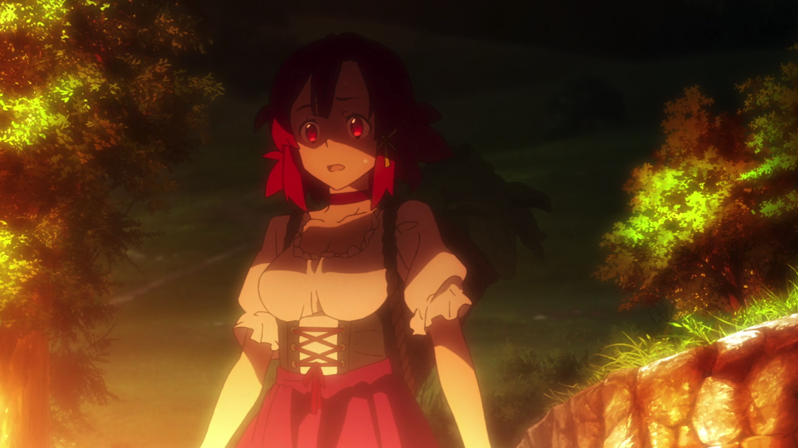
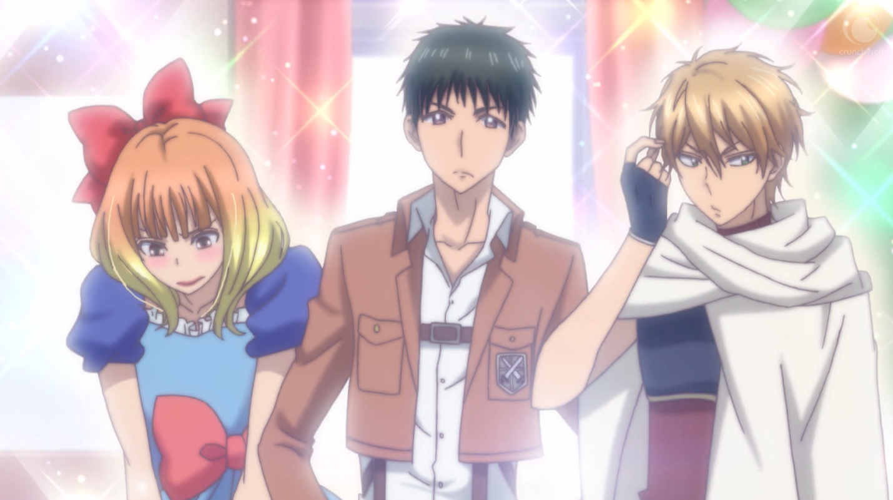
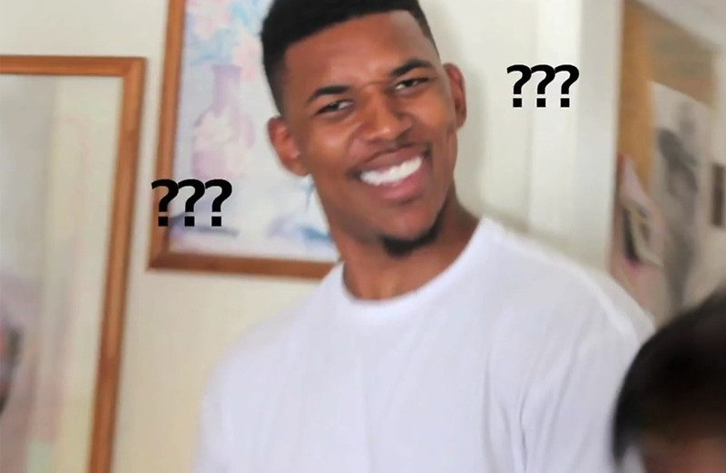

---
{
	title: "RockmanDash's Top Anime of Fall 2016",
	published: "2017-01-01T00:46:00-05:00",
	tags: ["Rockmandash Rambles", "Top Lists", "AniTAY", "Anime", "Fall 2016"],
	kinjaArticle: true
}
---

Fall. It’s the season of blockbusters, the big hitters that blow our minds... usually. This year, because 2016 has a habit of making everything bizarre, with this fall’s great shows being much more low key than the usual big hitters, It does have greats though, and here’s my list of them: Welcome to Rockmandash’s Top Anime of Fall 2016!

***

## Thoughts on the Season Overall

Meh? After coming off of the fantastic winter and spring seasons of anime, one may get their hopes up for summer... but dreams remained dreams as they got meh. Like most people, in my opinion, the Fall 2016 season of anime wasn’t all that great: while it had it’s greats (the top is STACKED) there were very few shows that compel you to watch every week. Basically this list was pretty much what I actually finished this season, as many shows compelled me to keep on watching. Disappointing, but everything has its ups and downs.

***

## Rules

My rules of this list are simple: if it aired/released this season, it can go on this list. I don’t see the point in only giving a show one chance during it’s airing season, and this is my list so I’ll list my favorite shows regardless of what season it started on. If this means that one show hogs the top spot for 2 seasons, than good for that show! If it’s an OVA or movie that came out during the duration of the season I fell in love with, then it may be there. Also, I think that the seasonal split is arbitrary and unnecessary, so it’s completely gone here. Sorry about that, but that’s how I’m doing it.

Just an FYI, the placement of the show in the list is mostly based on my experience and enjoyment of the work, so if you’re wondering why something isn’t where you think it should be or you can’t really tell via the justification, that’s probably why. Keep in mind, just because a show is lower on the list doesn’t mean it’s bad - all of these are great, and a lower placement isn’t a mark against the show, at this point it’s nearly all personal preference.

***

## Honorable Mention: *Shelter*

**Anime Made By:** Porter Robinson, A-1 Pictures

**Genre: **Anime, Music Video

**Plot Summary: ***Shelter* is a music video for the song “Shelter”, a collaborative effort of western artists Porter Robinson and Madeon. The story follows a 17 year-old girl named Rin who lives in a simulation. Each day she is able to create a world based on her imagination, and spends her time exploring her fantastical designs. Rin feels lonely because of a lack of human contact, but this all changes one day when the simulation taps into her repressed memories and reveals how she came to be in this world… - *Plot Summary from the *[*17 Anime of Autumn 2016 You Should Be Watching Article*](http://anitay.kinja.com/the-17-anime-of-autumn-2016-you-should-be-watching-1789451240) 

**Justification & Thoughts:** *Shelter *is a fantastic movie video/short, one that can elicit more emotions in 5 minutes than most 24 episode feelz anime can in their entire run. It’s a short done exceedingly well, a prime example of how one should do this kind of thing and I was blown away by it, as well as many others. The reason it’s HM (no, not because I don’t think it’s an anime) is that I have a hard time comparing a short like this to full sized anime and couldn’t really place it anywhere.

***

### 5. *WWW.Working!!*

**Anime Made By: **A-1 Pictures

**Genre: **Comedy, Slice of Life

**Plot Summary: **With the recent bankruptcy of his father’s company, high schooler Daisuke Higashida is forced to decide between getting a part time job to continue to pay for his train pass or ride over 15 kilometers to school everyday. Daisuke sensibly picks the more pragmatic option of getting a part time job at a local family diner. Though his new job isn’t physically as demanding as a 15km bike ride, Daisuke’s new job is mentally taxing due to his quirky co-workers. To add insult to injury, the information about the bankruptcy at his father’s business was all an elaborate ruse to get Daisuke to pay for his own amenities. - *Plot Summary from the *[*17 Anime of Autumn 2016 You Should Be Watching Article*](http://anitay.kinja.com/the-17-anime-of-autumn-2016-you-should-be-watching-1789451240) 

**Justification & Thoughts: **I love the *Working! *series. It’s a great comedy show surrounding the Waganaria store, and while the main cast is gone from *WWW.Working!!*, the comedy is still here, as well as everything else that comes from this show. That is, being one of the most amusing and engaging comedy shows with wacky characters and wacky hijinks. I’d actually argue that I enjoyed *www.Working!! *even more than the original *Working!! *because of the new cast having a (personally) less frustrating dynamic than in the past. For some it can still get old, but for others, it’s definitely a fun time.

***

### 4. *Yuri on Ice*

**Anime Made By: **MAPPA

**Genre: **Sports, Drama, Romance

**Plot Summary: **After Japanese figure skater Yuri Katsuki suffers a major defeat and embarrassment at the international Grand Prix Finale, he finds himself at a crossroads in his career. At 23, he’s not the best or the youngest athlete, but he’s not ready to give up either. Yuri returns to his hometown to try and get back in touch with why he loves skating. After a video of Yuri practicing a routine from his longtime idol, prodigy skater Viktor Niforikov, is leaked to the web, Viktor is inspired to shake up his own life and mentor his fan. With Viktor as his new coach, Yuri is challenged to find his own, bold style after a career of living cautiously. But to come out on top, he’ll have to face another Yuri - 15 year old wunderkind Yuri Plisetsky - who isn’t too happy about someone else winning Viktor’s attention. - *Plot Summary from the *[*17 Anime of Autumn 2016 You Should Be Watching Article*](http://anitay.kinja.com/the-17-anime-of-autumn-2016-you-should-be-watching-1789451240) 

**Justification & Thoughts: **Ah, *Yuri on Ice*. It’s a fantastic sports show, one that tells a moving story about the skater Yuri Katsuki’s efforts to fight back into prominence. It’s a brilliantly executed show that was a briliant watch every week thanks to fantastic skate scenes, absolutely brillant timing/pacing of events, well developed relationships (that are much more than Yaoi bait, trust me), and more. I particularly enjoyed the way it handled exposition and it’s OP/EDs were great too. That being said, the animation issues it had at times and the lackluster ending definitely knocked it down a peg for me. I still really enjoyed it, and it’s definitely one of the best of the year, but not AOTS/AOTY for me.

***

### 3. *Flip Flappers*

**Anime Made By: **Studio 3Hz

**Genre: **Sci-Fi, Fantasy, Magical Girl, Flip Flap

**Plot Summary: **Cocona is a reserved high-schooler who has good grades and attends a prep school, but doesn’t really have any friends. Papika is an unrestrained bundle of energy who hasn’t a care in the world. One day, the two suddenly meet, and are whisked away to the fantastical otherworld of Pure Illusion, where a treasure said to grant any wish lay hidden. - *Plot Summary from the *[*17 Anime of Autumn 2016 You Should Be Watching Article*](http://anitay.kinja.com/the-17-anime-of-autumn-2016-you-should-be-watching-1789451240) 

**Justification & Thoughts: ***WOAH. *I marathoned this one very recently after hearing members of AniTAY praise it to the moon, and even though I heasitated because Fantasy + Magical Girl aren’t really my cup of tea, what awaited me was some of the best animation of the year, some of the best storytelling you will find in anime, a cohesive experience that would constantly blow your mind, and an anime that can actually create a compelling mystery with fantastic twists. I just wish the last episode didn’t leave me like this:

***

## 2. *Haikyuu!! Season 3*

**Anime Made By: **Production I.G

**Genre: **Shounen, Sports

**Plot Summary: **Having beaten their old rivals Aoba Jousai in the spring prefecture tournament semifinals, Karasuno finally has made it to the final match-up against the reigning undefeated prefecture champions Shiratorizawa Academy, known to be one of the top 8 teams in Japan currently with a team of exceptional powerhouses, captained by the nationally renowned Wakatoshi Ushijima. So if Karasuno’s dreams to make it to nationals is to come to reality, they will first have to face their longest, and most difficult match yet. Can these fledgling crows finally reach the heights they’ve all aspired to? - *Plot Summary from the *[*17 Anime of Autumn 2016 You Should Be Watching Article*](http://anitay.kinja.com/the-17-anime-of-autumn-2016-you-should-be-watching-1789451240) 

**Justification & Thoughts:**

## ***HYPEKYUU!!!!!!!!!!!!!!!!!!!!***

I really love sports anime, and Haikyuu has been an integral part of my sports anime experience. Every episode being as hype as it could be with some of the best animation sequences you can think of, Haikyuu was a show to beat, one that would provide an amazing viewing experience as I watched it. This season was no exception, and I loved it to bits (even though I already knew what was gonna happen because I read the manga! yay).

***

### 1. *Girlish Number*

**Anime Made By: **Diomedea

**Genre: **Comedy, Satire, Slice of Life

**Plot Summary: **Talent, perseverance, mental focus, professionalism, the ability to connect with fans, and luck are all key attributes to becoming successful voice actor. Fledgling voice actress Chitose Karasuma might not have any of those things, but she does have plenty of self-confidence (which may or may not be justified). After beginning her career in relative obscurity, Chitose finally catches her big break and a chance to show everyone that she is a star. The path to the top of the voice acting profession may be beset with adversity, but Chitose intends to rush down that path avoiding as much of it as she can. - *Plot Summary from the *[*17 Anime of Autumn 2016 You Should Be Watching Article*](http://anitay.kinja.com/the-17-anime-of-autumn-2016-you-should-be-watching-1789451240) 

**Justification & Thoughts: **Girlish Number absolutely fantastic, the latest creation by *My Teen Romantic Comedy SNAFU*’s Author Wataru Watari* *but with a hint of *Shirobako *and Narcisism. It’s an absolutely amazing watch, noe that shows fascinating parts of an industry I love as well as being a wonderful character study that we would expect from Watari. Love it.

Also, did I forget to mention *best girl Chitose*? Chitose is the most entertaining, most self centered, most expressionful character I’ve ever seen in anime, and her alone made every episode worth it. I loved Girlish Number, and it easily took AOTS for me.

***

*Thank you for reading! This is Rockmandash Reviews, a blog focused on everything revolving Visual Novels, with stuff like tech and anime every now and then. If you want to read more of my writing, check out AniTAY and Fuwanovel.*
