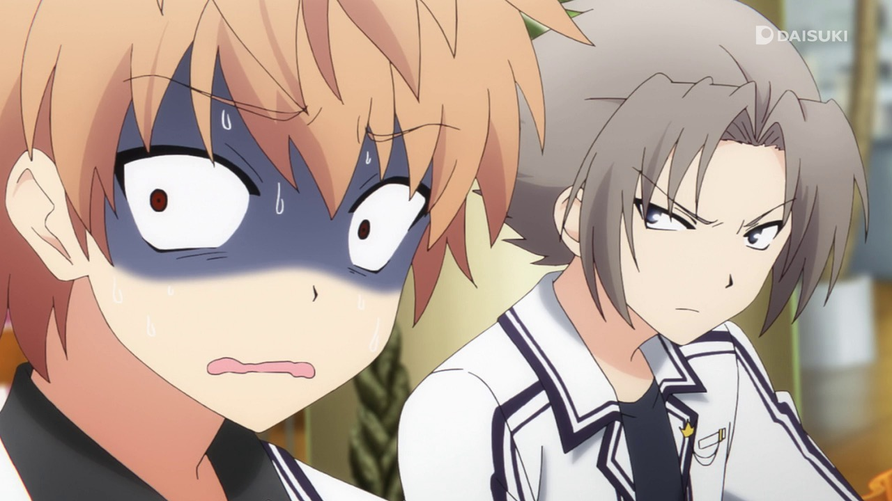
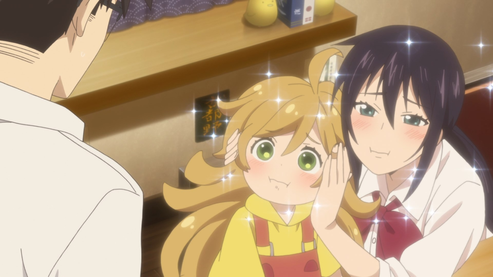

---
{
	title: "RockmanDash's Top Anime of Summer 2016",
	published: "2016-10-15T21:15:00-04:00",
	tags: ["rockmandash rambles", "rockmandash random", "Anitay", "anime", "Summer 2016", "top 10", "top lists"],
	kinjaArticle: true
}
---

<video src="./ajfimkceuftdczlw2rzq.mp4"></video>

After a couple of fantastic seasons, it was about time for some readjustment, right? The Summer 2016 season just ended, and like always, I’ve compiled a list of what I think are the best. Welcome to Rockmandash’s Top Anime of Summer 2016!

***

# Thoughts on the Season Overall

After coming off of the fantastic winter and spring seasons of anime, one may get their hopes up for summer... but dreams remained dreams as they got meh. Like most people, in my opinion, the Summer 2016 season of anime wasn’t all that great: no standout shows, and very few shows that compel you to watch every week. Hell, during the middle of the season, I had to stop following as much but usually when this happens, I’m still following a fair amount of shows week by week. This time, there was maybe one or two, much lower than what I’m used to seeing. That being said, unlike the sentiment online that believed Re:Zero was the only interesting show of the season, there was still a lot of great shows, some truly hidden gems. That’s what this list is going to have!

***

# Rules

My rules of this list are simple: if it aired/released this season, it can go on this list. I don’t see the point in only giving a show one chance during it’s airing season, and this is my list so I’ll list my favorite shows regardless of what season it started on. If this means that one show hogs the top spot for 2 seasons, than good for that show! If it’s an OVA or movie that came out during the duration of the season I fell in love with, then it may be there. Also, I think that the seasonal split is arbitrary and unnecessary, so it’s completely gone here. Sorry about that, but that’s how I’m doing it.\
\
\
Just an FYI, the placement of the show in the list is mostly based on my experience and enjoyment of the work, so if you’re wondering why something isn’t where you think it should be or you can’t really tell via the justification, that’s probably why. Keep in mind, just because a show is lower on the list doesn’t mean it’s bad - all of these are great, and a lower placement isn’t a mark against the show, at this point it’s nearly all personal preference.

***

# Honorable Mention: ***Fate/kaleid liner Prisma☆Illya 3rei!!*** 

<iframe src="https://www.youtube.com/embed/pNzi-3NG1Rk"></iframe>

**Anime Made By: **Silver Link

**Genre: **Magical Girl, Action, Fantasy

**Plot Summary: **Illya and the gang have finished their battle against the heroic spirit residing in the eighth class card. They’re back in vacation mode again, looking to make the most of what they have left of summer break. But their hopes get crushed in the blink of an eye. An all-too-unrealistic silhouette appears before them when they go to investigate the strange event at Mount Enzou. After a short skirmish, the entire space ends up being warped. Illya wakes up in a wintry Fuyuki City... in a parallel world.

This is the world where Miyu was born and raised. - *Plot Summary from MAL*

**Justification & Thoughts: **Here’s a conundrum: you know something’s gonna be good because you have seen the previous adaptations, and you’ve experienced the source material... but you haven’t actually experienced the work itself. I really loved 3rei, but I didn’t watch all of 3rei, thus HMs for you. This is not because I didn’t like it, but because I was already caught up in the manga and retreading stories in different mediums can be annoying to see for everything, even if the equidistant versions are rather similar (though the anime amps up the fanservice.). If you’re a fan of fate, the twists that this does on F/SN are fascinating and makes for a trilling ride.

***

# 7. *Planetarian*

<iframe src="https://www.youtube.com/embed/u_uy1yrP7gI"></iframe>

**Anime Made By:** David Productions

**Genre: **Drama, Sci-Fi

**Plot Summary: **Years after humanity lead their species and the planet along with them into a state of near extinction, men known as “Junkers” traverse the lands in use of anything useful. One such junker finds himself at the dangerous “Sarcophagus City”, and in this journey, he finds a relic of the past: a planetarium. Inside this planetarium is Hoshino Yumemi, a bright robot who wants to continue to show the stars to others even given the decrepit state of mankind, and throughout this series, we see the interactions between the two as they aim to see the twinkling of eternity that will never fade. - *Plot Summary from the *[*15 Anime of Summer 2016 You Should Be Watching Article*](http://anitay.kinja.com/the-15-anime-of-summer-2016-you-should-be-watching-1785625631)

**Justification & Thoughts: **Beautiful, emotional, memorable, endearing—these are just some of the words that one can use to describe *Planetarian* and its OVA adaptation made by David Production (of *JoJo’s Bizarre Adventure* fame), a work that will truly touch your heart. It’s short and sweet, being only five OVAs, but unlike most VNs,* Planetarian* is linear and short, making an adaptation possible in the fashion they did, and it was done rather effectively. *Planetarian* maximizes its limits, being a very focused and well-executed work that is almost movie-like in its storytelling, a great direction for a Key work. It enables them to do what people love about them, which works well with what it tries to do, which in my opinion is being a condensed version of everything great about Key (the makers of works like *Clannad*), without any of the negatives. The show provides the great parts of slice of life without the fluff, it’s engaging to watch throughout, and as one would expect from a Key work, it packs plenty of feelz. It’s a fantastic ride, and it’s definitely one to check out, especially now that is available in an animated form.

***

# 6. *Alderamin in the Sky*

**Anime Made By: **Madhouse

**Genre: **Military, Fantasy, Adventure

**Plot Summary: **In a militaristic fantasy world, the kind of world where soldiers use guns powered by adorable, magic little spirtes, the Katjvarna Empire is locked in a struggle with the Kioka Republic. Into this conflict stumbles our protagonist, one Itka Solork. He’s lazy, sarcastic, a philanderer...and he’s also a natural genius at military strategy and tactics. After a series of events, including an encounter with royalty, he finds himself a very reluctant soldier, and along with his companions—including old friend Yatori, a badass redhead whose ferocity with a blade is matched only by her devotion to her duty—Ikta finds himself on the path to being the one thing he never wanted to be: a hero. - *Plot Summary from the *[*15 Anime of Summer 2016 You Should Be Watching Article*](http://anitay.kinja.com/the-15-anime-of-summer-2016-you-should-be-watching-1785625631)

**Justification & Thoughts: **Alderamin is an interesting one, being a work that falls into genres I’m not too big a fan on (fantasy) but it spins it in a way that makes it rather engaging to see (thanks to it’s focus on the military) and honestly, it’s way better than I expected. The premise may not be the most original, but thanks to madhouse’s magic touch, they made it compelling to watch, telling a military drama tale that shows bonds of characters and the horrors of war. It’s fantasy setting allows for an interesting blend of feudal and modern tactics, and the characters in this work are enjoyable to see while being engaging to learn about, making for a solid show throughout. It’s only 13 episodes and made by madhouse so we probably won’t see more, but what it has to offer is good time and worth a watch.

***

# 5. *New Game!*

<iframe src="https://www.youtube.com/embed/XvWD1Cqx4X8"></iframe>

**Anime Made By: **Doga Kobo

**Genre: **Comedy, Seinen, Slice of Life

**Plot Summary: **Having grown up on the Fairies’ Story game series, Aoba Suzukaze joins Eagle Jump Games, the company that makes the series, as an artist fresh out of high school. Her direct supervisor turns out to be Yagami Kou, the character designer she’s admired since first picking up the games.*New Game!* is a cute, upbeat story of a young woman getting used to her new game development job, her eccentric and playful coworkers, and the adult world of juggling life and work. - *Plot Summary from the *[*15 Anime of Summer 2016 You Should Be Watching Article*](http://anitay.kinja.com/the-15-anime-of-summer-2016-you-should-be-watching-1785625631)

**Justification & Thoughts: **Ahh... New Game. It’s everyone’s favorite show about cute game developer artists doing cute things! While there’s nothing surprising with this one, being Doga Kobo’s entry into the season, you’re getting a a fun and entertaining slice of life (loosely) based on the game industry and it definitely did it’s job making life all that much better. Every episodes is 30 minutes of fun as characters are entertaining to watch and the jokes are funny, never ceasing to put a smile on your face. If you’re really into development, there’s going to be stuff that bothers you, but it shouldn’t hinder your experience of the show.

***

# 5. *Food Wars! The Second Plate*

**Anime Made By: **J.C. Staff

**Genre: **Shounen, Ecchi

**Plot Summary: **Yukihira Souma’s dream is to become a full-time chef in his father’s restaurant and surpass his father’s culinary skill. But just as Yukihira graduates from middle school, his father, Yukihira Jouichirou, closes down the restaurant to cook in Europe. Although downtrodden, Souma’s fighting spirit is rekindled by a challenge from Jouichirou which is to survive in an elite culinary school where only 10% of the students graduate. Can Souma survive? *- Plot Summary from MAL (Season 1 Page)*

**Justification & Thoughts: **Food Wars is back! And It’s just as great as before! Basically, everything I said about it last year applies here, as it’s still shounen with food instead of fights, it still has a wonderufl and colorful cast of characers, and most importantly, it isone of the most fun shows to watch. It’s worth a watch, but just warning you that if you can’t really handle fanservice in anime, this is a no go. *Too bad the manga falls downhill after this.*

***

# 4. *Mob Psycho 100*

**Anime Made By: **BONES

**Genre: **Comedy, Supernatural

**Plot Summary: **Shigeo Kageyama (nicknamed Mob) is just a normal, quiet, shy, physically unimpressive, try-hard sort of kid. But this student at the adroitly named Salt Middle School has an ability that he prefers to keep low-key… Shigeo just happens to be the world’s most powerful psychic! Thankfully, he has the (self) renowned and (self) proclaimed psychic/spiritualist Arataka Reigen as his mentor to guide him on the proper (and profitable) use of his time and abilities. This comedic supernatural series follows Mob’s dealings with spirits, other esper-type humans, as well as his fellow middle schoolers. - *Plot Summary from the *[*15 Anime of Summer 2016 You Should Be Watching Article*](http://anitay.kinja.com/the-15-anime-of-summer-2016-you-should-be-watching-1785625631)

**Justification & Thoughts: **Mob Psycho is notable for 2 reasons: It’s made by ONE, and it’s BONES. ONE, being the man behind One Punch Man, is also the creator of this work and it shows, with many attributes of that show being avaolible here. If you enjoyed the humor and style of that show, you’ll be right at home with Mob Psycho, and it made every moment fun to watch. It’s also a showcase of animation from BONES, who took ONE’s lackluster art and made it into something stylistic and spectacular, a feast for the eyes. Definitely watch the OP and EDs, they’re exapmles of artists pushing the limits of the medium, and it’s absolutely fascinating to see.

***

# 3. *91 Days*

**Anime Made By: **Shuka

**Genre: **Action, Drama, Historical

**Plot Summary: **Angelo Lagusa is just your average boy living in Prohibition-era America, complete with loving parents and an adorable little brother. Sadly, things immediately go sour when Angelo’s entire family is killed in a mafia dispute, only nearly escaping himself. Years later, Angelo receives a mysterious letter identifying his family murderers, all prominent members of the mobster Vanetti family. With nothing else to live for, he sets out on a quest for revenge, determined to put the killers down and finally let his family rest. Things can hardly be expected to go smoothly when gangsters are involved, but what does that matter? Angelo won’t let anything stand in his way. - *Plot Summary from the *[*15 Anime of Summer 2016 You Should Be Watching Article*](http://anitay.kinja.com/the-15-anime-of-summer-2016-you-should-be-watching-1785625631)

**Justification & Thoughts:**

In anime, we always talk about how great it is for something to be different, but there’s nothing wrong with something that’s extremely well executed to blow your minds. 91 days doesn’t attempt to set new ground and is everything it seems it is, but it’s amazing for it. Set in Lawless, an unknown city in america, We see a tale of revenge against the mafia that murdered our main character’s family, and this gruesome story of revenge is oh so sweet, with amazing character reactions and strategic maneuvering that is trilling to watch. Other than a few moments where the story felt a bit rushed and the animation got durpy, this show is a blast and its a must watch for any anime fan who enjoys a good story.

***

# 2. *ReLife*

**Anime Made By: **TMS Entertainment

**Genre: **Romance, Drama, Slice of Life

**Plot Summary: **Kaizaki Arata is 27 years old, jobless, and living on the expenses sent by his parents. He quit his first full-time job in just three months, and at the moment, his future is not looking very bright. On the way home (and right after his parents decide to stop sending him money), a man named Yoake Ryo stands in his path. Ryo is a member of the ReLIFE Laboratory, and informs Arata that he has been selected as a ReLIFE test subject. Should Arata choose to accept this offer, all his living expenses will be paid, and, depending on how well this experiment goes, he could even be hooked up with a job! All he has to do is take the ReLIFE drug and go back to high school for a year. Arata, who was unfortunately drunk at the time, signs his life away and wakes up the next day to the surprise of his unusually youthful appearance.** **- *Plot Summary from the *[*15 Anime of Summer 2016 You Should Be Watching Article*](http://anitay.kinja.com/the-15-anime-of-summer-2016-you-should-be-watching-1785625631) 

**Justification & Thoughts: **With ReLife, the question of “What’s my favorite show of the season” was over before it even began (consider it an Honorable 1st Place). Crunchyroll, for some odd reason, decided to release this show all at the beginning of the season, and I love them for it, enabling me to marathon a show that perfectly matches my preferences. I’m a sucker for romantic dramas, and to see one of them done so well in this fashion is something I really enjoyed. ReLife, more than anything, is about life, giving one a second chance while looking at what makes this tick, and this fuels a thrilling ride of character interactions that allow the viewer to get more and more attached to the cast as they watch. Along with that, ReLife has a great cast of characters with fascinating personalities, and plus, it’s funny, keeping the show always engaging to watch. Definitely a great time, and I can’t wait for more.

***

# 1. *Kimi no Na wa. (Your Name.)*

**Anime Made By: **CoMix Wave

**Genre: **Drama, Romance, Supernatural

**Plot Summary: **The story is set one month after a comet has fallen for the first time in a thousand years in Japan. Mitsuha, a high school girl living in the countryside, wants to live in the city because she is tired of life in the country. Then, there’s Taki. He’s a high school student living in Tokyo with his friends while working as a part-timer at an Italian restaurant. He also has a strong interest in fine arts involving architecture. One day, Mitsuha dreams of herself as a young man. On the other hand, Taki also has a dream where he is a female student attending high school in the countryside. What’s the secret behind their dreams? - *Plot Summary from MAL*

**Justification & Thoughts:** When the internet started to sing it’s praises over the glory of* Kimi no Na wa*, I wasn’t the slightest bit surprised. That is, because during AX 2016, I was able to watch the world premiere of this movie and my mind was completely blown. While I always appreciated Shinkai’s works, I would be what most would describe as a Shinkai Skeptic because I would generally paint a negative picture on them when I talked about them. This is because I never really was engaged with them and the story they had to tell, but *Kimi no Na wa*... had my crying in my seat. Every moment was engaging, every moment was beautful, and most importantly, I was actually enjoying it, unlike so many of his works. This is one of the best anime movies ever made, and for it to not take the number one spot would be disrespectful to it.

If you’re interested in reading more thoughts about *Kimi no Na wa*, [check out the AniTAY review](http://anitay.kinja.com/kimi-no-na-wa-your-name-the-anitay-review-1783309415)!

***

*Thank you for reading! This is Rockmandash Reviews, a blog focused on everything revolving Visual Novels, with stuff like tech and anime every now and then. If you want to read more of my writing, check out AniTAY and KMTech. Also, If you’re wondering where Re:Zero is on this list, I wasn’t the biggest fan, *[*you can read my article on why*](http://anitay.kinja.com/why-re-zeros-subaru-is-a-flawed-character-explained-th-1787023598)*.*
