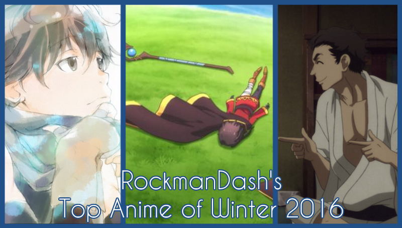
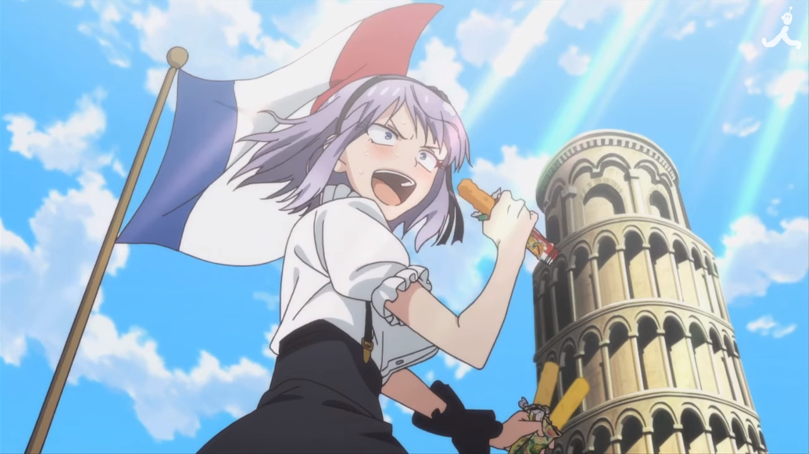
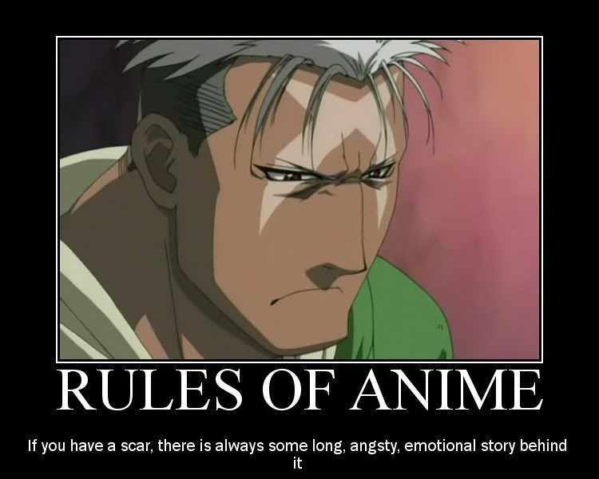
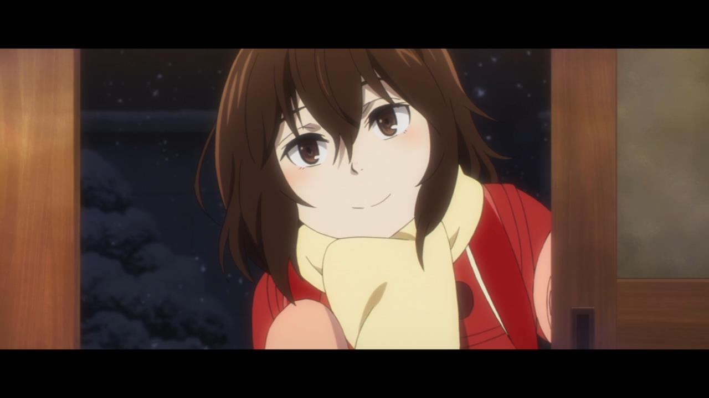
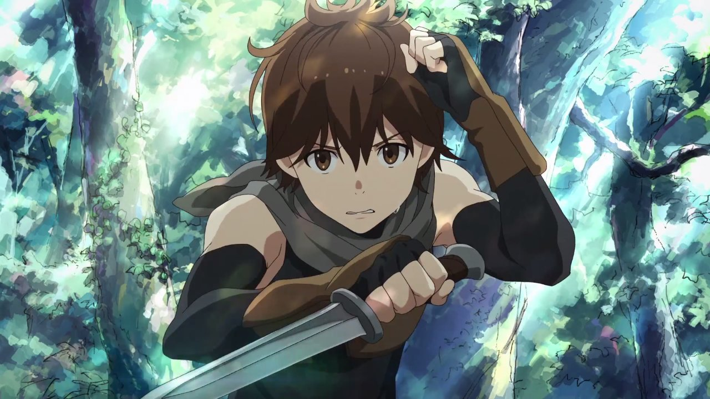
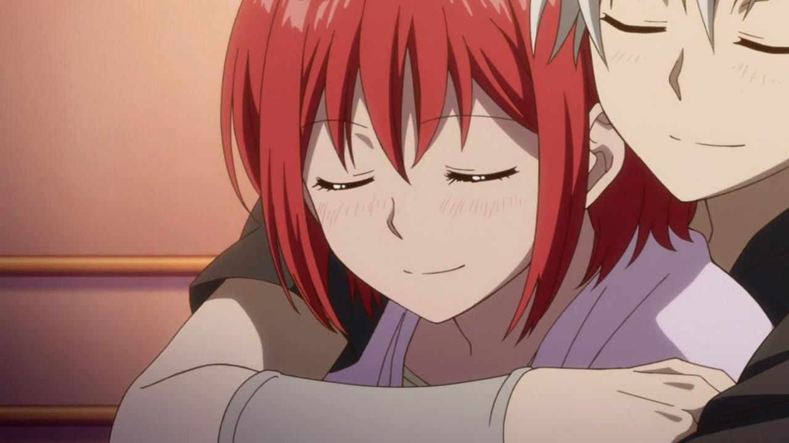
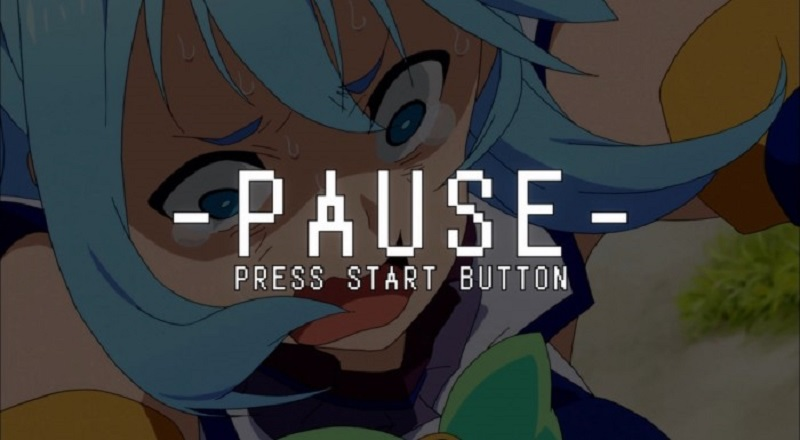
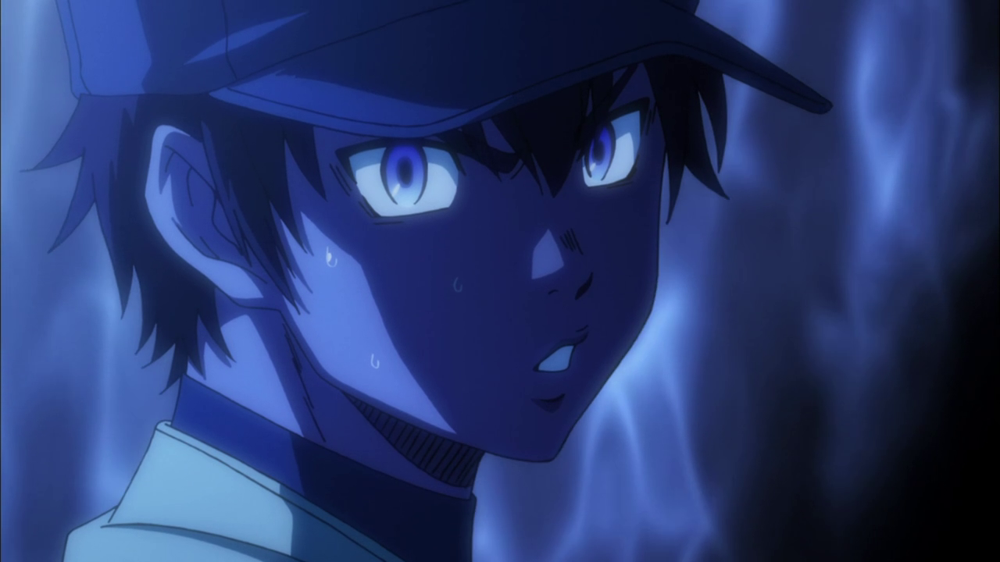
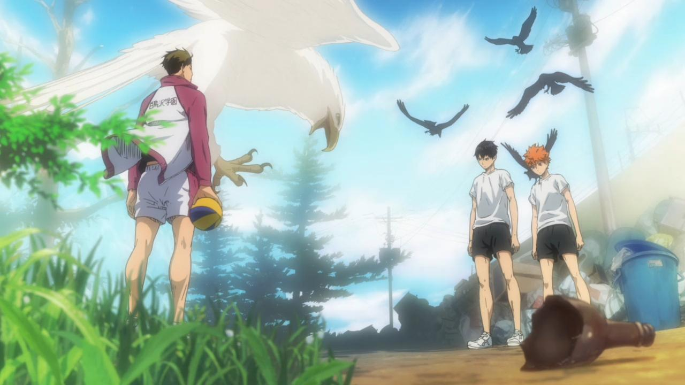
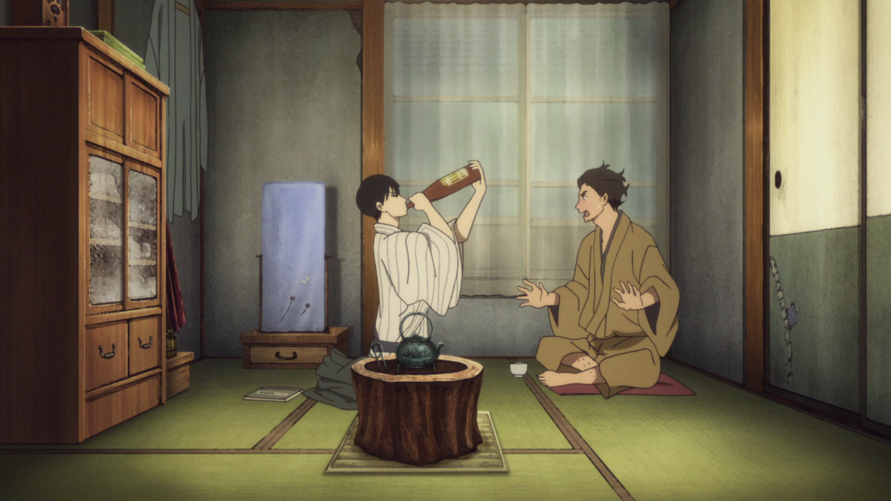

---
{
	title: "RockmanDash's Top Anime of Winter 2016",
	published: "2016-04-07T11:00:00-04:00",
	tags: ["Rockmandash Rambles", "Top lists", "AniTAY", "Anime", "Top Anime of Winter 2016", "Winter 2016"],
	kinjaArticle: true
}
---

It’s that time of year again, where we finish up another season and the reviews keep on pouring out. We’ve got a good season this time around, and like usual, I’m gonna tell you what I think are the best! Welcome to RockmanDash’s Top 5 Anime of Winter 2016.

***

#### Thoughts on the Season Overall

From my time spent watching anime, I’ve always found the winter anime to be my favorite. While it didn’t have the big titles like the fall season and for the most part the shows are just average or below average, it’s a season that has been consistently top loaded with the best shows of the year like* NagiAsu*. This structure of winter seasons, while not is one everyone likes because the overall quality is pretty low and there aren’t that many shows, it’s one that keeps me engaged and entertained, and it has the shows that truly gets me to appreciate the media. This season is no exception to all of these and I’d argue it’s even an stronger example of this than most: the top here are of higher average quality than most top shows in my experience of watching seasonally. While many people have overlooked this season, I’ve been very much engaged, and I have to say, this is one of my favorite seasons in a while.

Why? The biggest reason has to be the acts of two studios stepping up their game: A-1 Studios and Studio Deen. A-1 Studios, as a studio that has little permanent staff, instead relying on freelancers has it’s ups in downs with this season happening to be up, but Deen, who has been consistently terrible, doing a bad job with works like *Log Horizon 2* and* Fate/Stay Night 2006* have really pulled a once and lifetime miracle. Want to know why? Read on!

***

#### Rules

My rules of this list are simple: if it aired/released this season, it can go on this list. I don’t see the point in only giving a show one chance during it’s airing season, and this is my list so I’ll list my favorite shows regardless of what season it started on. If this means that one show hogs the top spot for 2 seasons, than good for that show! If it’s an OVA or m ovie that came out during the duration of the season I fell in love with, then it may be there. Also, I think that the seasonal split is arbitrary and unnecessary, so it’s completely gone here. Sorry about that, but that’s how I’m doing it. Also, different from this season is the number cap: I kept myself to 5 every time, but I’m dropping that now, allowing for more shows in a good season and less in a bad. That also means HMs for the most part should be gone, unless there’s a show that’s bad that I was hoping to be good or something. I also changed the formatting of it, so it may look quite different from the previous top lists.

Just an FYI, the placement of the show in the list is mostly based on my experience and enjoyment of the work, so if you’re wondering why something isn’t where you think it should be or you can’t really tell via the justification, that’s probably why. Also, just because a show is lower on the list doesn’t mean it’s bad - all of these are great, and a lower placement isn’t a mark against the show, at this point it’s nearly all personal preference.

***

### *7. Boku dake ga Inai Machi - Erased*

**Made by: ***A-1 Pictures*

**Genre: ***Mystery, Psychological, Seinen, Supernatural*

**Plot Description:** Satoru Fujinuma is a seemingly unsuspecting man who works in a pizza shop. However, despite his rather plain appearance, he actually has the power to travel back in time before tragic, life-threatening events can happen and uses this to prevent the events from happening. When Satoru’s mother is murdered, he is flung 18 years into the past before a horrific string of kidnappings and murders rocked the quiet town he grew up in. Now Satoru must figure out how to prevent his mother’s death and how the kidnappings might tie into this future event. - *Plot Description by Koda89 from the *[*12 Anime of Winter 2016 You Should Be Watching Article*](http://anitay.kinja.com/the-12-anime-of-winter-2016-you-should-be-watching-1759823518)

**Justification & Thoughts: **This is **the **anime of the season, the one that everyone watched and talked about. While it was definitely good enough to warrant the hype and discussion of the show, it’s poor handling of mystery, it’s rushed second half of the show and contrived BS at times knock it down a notch in comparison to the best of the season. It’s absolutely a solid show with care to visual directing that we haven’t seen in TV anime in ages, it has great characters that get you invested in the dilemmas that they go through and it’s very compelling and engaging, enough to warrant the hype and adoration everyone had for it. While it’s a good show, it only barely makes it into my list of the top anime of the season, If only it wasn’t let down by a disappointing second half.

**Subjective RockmanDash Reviews Score: *8.4/10***

***

### ***6. Grimgar of Fantasy and Ash***

**Made by:** A-1 Pictures

**Genre: ***Fantasy, Action, Adventure, Drama*

**Plot Description: **Waking up with only faint memories, an unlikely group of young adventurers is forced to find their way in the unfamiliar world of Grimgar. Having no money, a bargain is struck to join a volunteer army in exchange for a basic wage. With no prior combat experience, the group must learn their roles in the heat of battle or face the harsh reality of destitution.- *Plot Description by Unimplied from the *[*12 Anime of Winter 2016 You Should Be Watching Article*](http://anitay.kinja.com/the-12-anime-of-winter-2016-you-should-be-watching-1759823518)

**Justification & Thoughts: ***Grimgar* is a show takes its name to heart, a tragic tale of loss focused on kids that were ripped out of their world, forced to confront the struggle of kill or be killed itself. It’s a show that takes its scenario to heart, with actions that deal with realistic consequences which makes the show all that much more relatable and interesting, IMO. While it’s a show that has a rather slow pace that prevents you from really being completely engaged, the show really connects you to the cast well, being the most personal show in a while in my opinion – the show really allows you to get into the heads of the characters and care about the issues they deal with and the losses they have to endure through, if you really get into the show (It has one of the most interesting character deaths in recent times for an example). While it’s not for everyone, this is a show has an intimate style that I really appreciate (thanks VNs) and it’s a work that I fell in love with. It may be the show that finally gets me to read LNs, and I appreciate it for that.

**Subjective RockmanDash Reviews Score: *8.6/10***

**If you’re interested in this work, check out **the AniTAY review when it comes out, and[ my post about death in this show](http://anitay.kinja.com/a-discussion-about-death-in-grimgar-of-fantasy-and-ash-1760266202).

***

### ***5. Akagami no Shirayukihime Season 2***

**Made by:** *Studio Bones*

**Genre: ***Drama, Fantasy, Romance*

**Plot Description: **With Zen and Shirayuki having finally come to terms with their own feelings for one another, life for the two finally seems to have stabilized. However, when an invitation arrives for Shirayuki to return to her homeland Tanbarun, a series of forces, both friendly and malevolent, arise that could rupture their recently established relationship. - *Plot Description by Krakken from the *[*12 Anime of Winter 2016 You Should Be Watching Article*](http://anitay.kinja.com/the-12-anime-of-winter-2016-you-should-be-watching-1759823518)

**Justification & Thoughts: **While one of the lesser talked about shows of the season, Shirayukihime was a show that never disappointed me as it was a nice romance with an incredibly sweet relationship. The show is a show that is almost solely focused on the cast, and it does its characters exceedingly well, with the interactions between them consistently putting a smile on your face. The main appeal of the show to many, the romance between our two leads in this show is as great as it ever has been, one of the most enjoyable romances out there as they consistently improve each other while having moments where you can only describe as cute and adorable, seeing them was great. The rest of the cast isn’t a slouch either as well, being equally enjoyable and making every moment fun to watch. While it wasn’t action packed or anything, it never ceased to put a smile on my face and that’s worth the recommendation in my book.

**Subjective RockmanDash Reviews Score: *8.8/10***

**If you’re interested in this work, check out **the AniTAY review when it comes out.

***

### *4. KonoSuba: God’s Blessing on This Wonderful World!*

**Made by:** *Studio Deen*

**Genre: ***Adventure, Comedy, Fantasy, Supernatural*

**Plot Description:** Kazuma Sato was just an ordinary hikikomori NEET until he decides to leave his house, quickly finding himself killed and in front of the goddess Aqua. She then gives him the non-choice to either be reincarnated as a dog or be swept into a parallel fantasy world on a mission to defeat the devil king. He is allowed to take one powerful item or ability with him to help even the odds. He sarcastically remarks that he should just take Aqua herself, which immediately binds them together, much to both their chagrin. Aqua, despite being a powerful goddess, is more of a hindrance than a benefit to Kazuma, but she cannot return to the heavens until the devil king has been defeated. - *Plot Description by Kinksy from the *[*12 Anime of Winter 2016 You Should Be Watching Article*](http://anitay.kinja.com/the-12-anime-of-winter-2016-you-should-be-watching-1759823518)

**Justification & Thoughts: **We’ve seen this before, a guy gets sucked into a fantasy world… but you’ve never seen this as hilarious as *Konosuba*. While everything seems normal on first impression, when you look into this world, you’ll quickly realize that it’s absolutely hilarious and insane, and add to this insane world an equally insane cast and you got humor that is some of the best around and that really hold the show throughout. Every time I watched it, I knew I was going to have a good time and this show never disappointed, always making me laugh while putting a big stupid grin on my face. It’s great to see Studio Deen do so well after all of the consistent failure they’ve seen, and I can’t wait for season 2. :)

**Subjective RockmanDash Reviews Score: 8.8/10**

**If you’re interested in this work, check out **the AniTAY review when it comes out.

***

### ***2. Sports Anime:***** *****Ace of Diamonds *****S2***** / Haikyuu!!***** S2**

**Made by:** *Production I.G. (Haikyuu & Ace), Madhouse (Ace only)*

**Genre: ***Comedy, School, Shounen, Sports*

**Plot Descriptions: **For *Ace of Diamonds* - The story follows Eijun Sawamura, a pitcher who joins an elite school with a brilliant catcher named Kazuya Miyuki. Together with the rest of the team, they strive for Japan’s storied Koushien championships through hard work and determination.

For *Haikyuu *- After losing against Aoba Jousai, the whole Karasuno team feels at a loss. Especially Kageyama and Hinata, who seem to be the most devastated about the defeat. However, the team soon cheers up when a chance for them to go to Tokyo appears. During their training camp there, Karasuno will meet new formidable opponents.

\- *Plot Descriptions from *[*my Top Anime of Fall 2015 list*](http://anitay.kinja.com/rockmandashs-top-5-anime-of-fall-2015-1745376626#_ga=1.238308547.292320693.1457238947)

**Justification & Thoughts: **Yes, these are holdouts from last season. Yes, there are 2 anime in one spot, and they were also both here in the second spot last season as well. Do I care? Not really, as these are some of the best of anime and I love them too much to care. I know a lot of people don’t really care about sports anime, but as of late they’ve quickly become one of my favorite anime genres due to their consistently amazing execution, with the positives of Shounen shows without many of the negatives. The ones airing this season are really great, and have been some of the shows I’ve enjoyed the most as this season progressed. *Ace of Diamonds*, while slowly progressing through its games this season was consistently exciting while *Haikyuu!!* (or how AniTAY members like to call it, *Hypekyuu!!) *showed us awesome matches and got the viewer constantly hyped. These are some of the best shows anime has to offer, definitely check it out.

**Subjective RockmanDash Reviews Score: 9.2/10**

**If you’re interested in this work, check out **my review of [*Ace of Diamonds*](http://anitay.kinja.com/ace-of-diamond-seasons-1-2-the-anitay-review-1765876386#_ga=1.238764227.292320693.1457238947) and Koda’s review of [*Hakyuu!!*](http://anitay.kinja.com/haikyuu-the-ani-tay-review-1637543181)*.*

***

### *1. **Shouwa Genroku Rakugo Shinjuu***

**Made by:** *Studio Deen*

**Genre: **Drama, Historical

**Plot Description: **Framed as a recount to an ex-convict and aspiring pupil, *Shouwa Genroku Rakugo Shinjuu* is a character drama revolving around two budding performers of Japan’s oral comedy tradition—rakugo. Primarily set in the post-WWII Showa Era, the starkness of the period heightens the struggles of the friends as they attempt to make rakugo not only an emotional release, but also a livelihood. With life increasingly fraught with the tribulations of adulthood, they discover what it takes to truly succeed in this art form of “fallen words”, and the harsh sacrifices that must be made. - *Plot Description by Nomadic Dec from the *[*12 Anime of Winter 2016 You Should Be Watching Article*](http://anitay.kinja.com/the-12-anime-of-winter-2016-you-should-be-watching-1759823518)

**Justification & Thoughts:** When talking about how great *Rakugo *is, where do you even start? It’s a fantastic show that (in my opinion) easily earns its place as best show of the season and is an early contender for anime of the year: It’s a show that tells an interesting historical story on the decline of the art form of rakugo and the tale of our interesting characters that are fleshed out and feel real. While the plot of *Rakugo* may sound boring because it’s literally about telling stories, it is the execution, how it tells the story that makes this great, being able to handle all of its elements extremely well. The show has fantastic pacing, solid visuals, a great score, amazing characters and the best part: it’s consistently engaging with every episode being better than the last. It’s definitely a must watch, my favorite of the season and one of my favorite anime ever. It’s a timepiece that displays a story of the past extremely well, and a shining example of what shows like this should be like. I never thought I’d say this, but well played Studio Deen, can’t wait for more.

**Subjective RockmanDash Reviews Score: 9.2/10**

**If you’re interested in this work, check out **the AniTAY review when it comes out and[ Morie’s episodic posts](http://anitay.kinja.com/tag/showa-genroku-rakugo-shinju).

***

*You’re reading Ani-TAY, the anime-focused portion of Kotaku’s community-run blog, Talk Amongst Yourselves. Ani-TAY is a non-professional blog whose writers love everything anime related. Click *[*here*](http://anitay.kinja.com/)* to check us out. If you want to read more of my writing, check out *[*RockmanDash Reviews*](http://rockmandash12.kinja.com/)* and *[*KMTech*](http://kmtech.kinja.com/)*.*