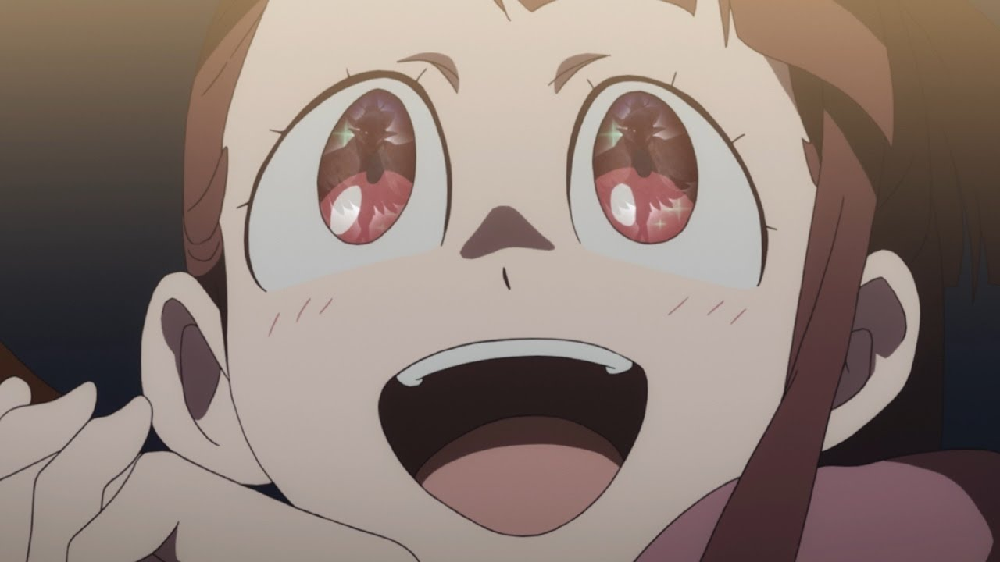
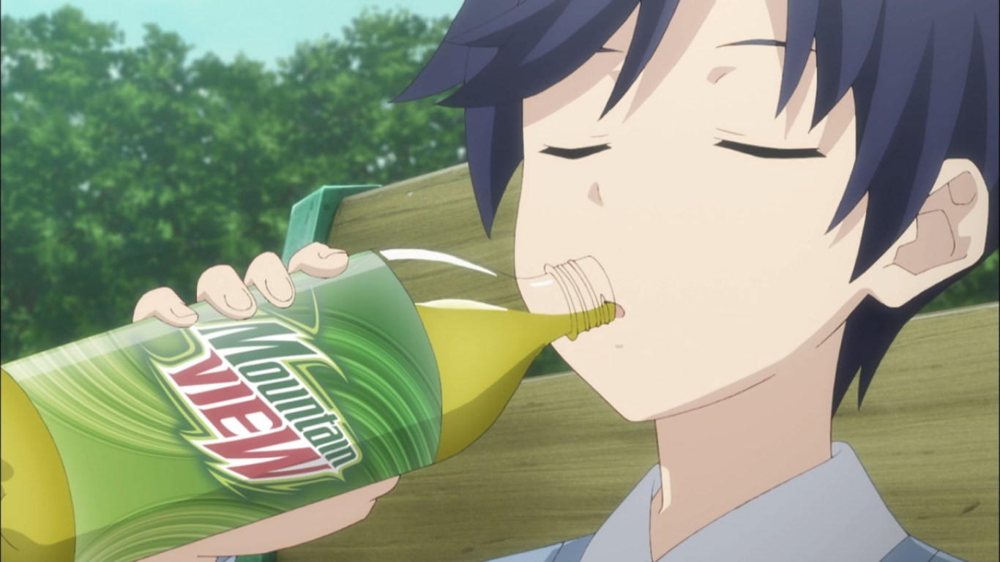

---
{
	title: "RockmanDash's Top Anime of Winter 2017",
	published: "2017-04-03T10:00:00-04:00",
	tags: ["RockmanDash Rambles", "Top Lists", "anitay", "anime", "winter 2017"],
	kinjaArticle: true
}
---

Winter is always one of my favorite seasons of anime. There’s never a lot of shows out during this season, but in every winter we get excellent shows that manage to be the best of the year, shows that make anime worth watching. This season is absolutely no exception, and here’s my list of them: Welcome to Rockmandash’s Top Anime of Winter 2017!

***

## **Thoughts on the Season Overall**

While the rest of the anime community was dying to see spring come, saying this was a lackluster season, I was quite enjoying it, with a core of amazing shows that winter always seems to have. Sequels to amazing shows, surprise hits, and great adaptations of works with great source led to a great season, and I couldn’t be happier with the way it turned out.

***

## **Rules**

My rules of this list are simple: if it aired/released this season, it can go on this list. I don’t see the point in only giving a show one chance during it’s airing season, and this is my list so I’ll list my favorite shows regardless of what season it started on. If this means that one show hogs the top spot for 2 seasons, than good for that show! If it’s an OVA or movie that came out during the duration of the season I fell in love with, then it may be there. Also, I think that the seasonal split is arbitrary and unnecessary, so it’s completely gone here. Sorry about that, but that’s how I’m doing it.

Just an FYI, the placement of the show in the list is mostly based on my experience and enjoyment of the work, so if you’re wondering why something isn’t where you think it should be or you can’t really tell via the justification, that’s probably why. Keep in mind, just because a show is lower on the list doesn’t mean it’s bad - all of these are great, and a lower placement isn’t a mark against the show, at this point it’s nearly all personal preference.

***

#### *Honorable Mention: Rewrite Season 2* 

**Anime Made By:** 8bit

**Genre: **Action, Comedy, Supernatural, Romance, School

**Plot Summary: **The story of Rewrite follows our protagonist Kotarou, who lives an average life in the environmental conscious Kazamatsuri, a city that is a forerunner in ecological studies. He lives a normal life for the most part, until Kotarou decides to make the occult research society go into the forest looking for unidentified mysterious animals. Instead of UMAs however, Kotarou finds himself in the middle of a conspiratorial conflict and with a weird power. Unknown to most, there is an underground war between 2 factions fighting for a way to save the earth: the Superhumans known as Guardian, and the Summoners known as Gaia. - *Plot Summary from the *[*Rewrite AniTAY review*](http://anitay.kinja.com/rewrite-the-anitay-review-1787384450)

**Justification & Thoughts:** Let’s get this straight: You probably shouldn’t watch* Rewrite* Season 2, but it definitely deserves mentioning.. not because it’s a fantastic show, but because it’s by far the \*most improved\* show I’ve ever seen. *Rewrite* Season 1 was a steaming pile of garbage, a show with almost no redeeming values due to a fundamental lack of understanding of the source material by the anime staff. It was clusterfuck of epic proportions, with 8bit showing once again that they have no idea how to manage a visual novel: it mashed together all the routes into one horrifying thing that would occupy your TV, it was simultaneously too fast and too slow, it spent a massive amount of time on boring slice of life that didn’t serve any purpose, etc.

Season 2 however, is a passable show, and is one that actual humans can enjoy! This can be mostly contributed to the different structures of the routes covered: in season one, they tried to adapt the common route, as well as simultaneously adapt 5 separate routes, but in season 2, we have 2 linear stories: Moon and Terra. They managed a faithful adaptation that was entertaining, moving, etc. It was surprisingly good, and I enjoyed it every Sunday it came out.

***

### *6. Slice of Life: Maid Dragon, Interviews with Monster Girls, Gabriel Dropout*

**Anime Made By: **Kyoto Animation (*Maid Dragon*), A-1 Pictures (*Interviews with Monster Girls*), Doga Kobo (*Gabriel Dropout*)

**Genre: **Comedy, Slice of Life, Making fun of Satania (*Gabriel Dropout*)

**Plot Summary:**

***Maid Dragon: ***When Miss Kobayashi rescues a dragon named Tohru on her way home from work, the mythic creature falls for the office worker and agrees to repay an eternal debt. Taking the form of a human maid, Tohru begins to familiarize herself with the normal ways of the new world. Not long into her services to Kobayashi, however, other dragons begin to show up and take interest in humans. The once ordinary life of a quiet woman becomes a whirlpool of excitement and lighthearted comedy in this slice of life by Kyoto Animation, the studio behind *The Melancholy of Haruhi Suzumiya* and *Nichijou*.

***Interviews with Monster Girls:*** Takahashi Tetsuo, a high school biology teacher, has always been fascinated with *Ajin*, the official term for humans with mutations matching mythological monsters. However, their incredible rarity has thwarted all of his attempts to actually meet any - until his school has a sudden influx of them at the beginning of a new term. His three new students and the new math teacher are all *Ajin* - and prefer to be called a more modern and cute term, *Demi*. Takahashi-sensei now spends his lunch breaks and afterschool time cheerfully interviewing these monstergirls, learning what’s fact and what’s fiction while trying to help them solve their everyday high school problems.

***Gabriel Dropout*:** Gabriel Tenma is the perfect role model for the other Angels in Heaven. She is perfect in every way: Cute, Smart, Kind, Pro-active and very Sociable. As part of an Angel´s education, they have to spend some time living in the Earth with the humans they will protect. However, on Earth Gabriel ended up discovering the world of the MMO games and her life would make a turn … for the worse. She has become a recluse, with garbage piling up and sheer laziness ruling the day. This is the story of Gabriel and her everyday High School life by dealing with humans, other angels and even other demons while she only wants to be left alone and play more games!

**Justification & Thoughts: **There were a lot of great Slice of Life shows this season, and all of them were quite enjoyable, but I found that while all of them should be mentioned in some form, I didn’t think that any of them really warranted a spot on the list as individuals given how great the top shows of this season were, so I thought I would compile them all together (Though, *Gabriel Dropout* was slow to get good early on this season). They were all very entertaining shows that were executed well, doing what all good slice of life shows should do: they all continuously showed us different aspects of the characters we see, were all consistently entertaining, had amusing character interactions, were filled with funny jokes, and more. If you’re looking for an entertaining slice of life or just a show to entertain you while you’re trying to deal with a bad day, these are all a show I’d recommend.

***

### 5. ***ACCA: 13-Territory Inspection Dept.***

**Anime Made By: **Madhouse

**Genre:** Political Drama, Slice of Life, Bread

**Plot Summary: **In the Kingdom of Dowa, there are 13 separate, but equally important autonomous states. The peace of the central government is kept by a giant organization called ACCA, made up of many departments that handle affairs both within and between the states. These... are their stories. Jean Otus, the second in command of the ACCA Inspection Agency, is an absent-minded man tasked with an important job: travel the kingdom and audit each state’s bureaucratic organization. Through his travels, Jean gets swept up in rumors of a coup d’etat, and he may be involved whether he wants to or not. - *Plot Summary from the*[* 8 Anime of Winter 2017 You Should Be Watching Article*](http://anitay.kinja.com/the-8-anime-of-winter-2017-you-should-be-watching-1792572408)

**Justification & Thoughts:**

*ACCA* is a deceiving show in every way, you can think about it. You think the show is going in one direction, but it goes in a completely unexpected direction. You might assume some things about it, but then the show laughs at your assumptions. Ultimately though, while it wasn’t what I or anyone really expected, it was a very compelling show. Great mystery, interesting twists throughout, an atmosphere that made this show incredibly unique and style that no show this season could even compare with... all of this made this a phenomenal show and *ACCA* was an enjoyable ride, even if the ending was a bit disappointing.

***

### 4. *Scum’s Wish*

**Anime Made By: **Lerche

**Genre: **Psychological Drama, Romance, NTR

**Plot Summary: **Hanabi Yasuraoka and Mugi Awaya are a highschool couple and they are in love. With other people. To add to their heartache, their respective objects of affection, teachers whom they have each known since childhood, are apparently falling in love with each other. In turn, Hanabi and Mugi have their own admirers. This love polygon becomes the foundation for a perceptive dissection of love, loneliness, and the muddled nature of human interaction. - *Plot Summary from the*[* 8 Anime of Winter 2017 You Should Be Watching Article*](http://anitay.kinja.com/the-8-anime-of-winter-2017-you-should-be-watching-1792572408)

**Justification & Thoughts: **If you like dramas, there is no better place to look than at* Scum’s Wish*. It’s a refreshing show, one that revels in desires and character interactions unlike anything an anime (or TV in general) has covered, but while it’s so vastly different, it feels so relatable, because it is simply the execution of a human story. While the desires of the characters can be considered as the title suggests, the desire of something one can never get, and having to live our live without being able to even dream of it is something that is ultimately relatable, and that is the magic of this show. we see human problems with human relationships and human characters, wrapped in a package that is compelling, engaging and more. While this show may not be for everyone, for those who it is for, they will absolutely love it.

***

### 3. *Saga of Tanya the Evil*

**Anime Made By: **NUT

**Genre: **Military, Magic

**Plot Summary: **In an alternate version of the year 1924, war rages on, but the most deadly soldier around is neither a grizzled old veteran, nor a wise and patient general. Rather, it is a very young girl by the name of Tanya Gurtcheff, whose mind for tactics and affinity for magic are both second to none. While most of Tanya’s military colleagues either applaud her endless victories, or fear her merciless attitude, not a soul is aware of her true nature. Despite appearances, Tanya is no mere little girl, but a ruthlessly efficient Japanese salaryman, reincarnated into this parallel world after angering a being which called itself “God”, as a wager to see if hardship and turmoil would kindle religious devotion. Eager to prove “God” wrong, Tanya is prepared to use every trick in her arsenal and claw her way to the top of this new reality, in order to once again live a comfy and peaceful existence

**Justification & Thoughts: **Like the character Tanya, the show *Saga of Tanya the Evil *beats all the odds in a world made for it to fail, defying everything one would expect from it. A show with a loli as a main character in a boring and grey war show, made with a brand new studio... nothing good could have come out of it, but it managed to be amazing. After* Izetta *bombed last season with an almost identical premise, we expected that out of Tanya... but instead we got what *Izetta *should have been, a fascinating alternate history twist on world war 1 with our main character not being your typical little girl, but a deeply logical Japanese businessman turned into a little girl and facing a relentless battle against god, aka being X! Seeing this conflict was extremely entertaining, adding onto the enjoyment that comes from Tanya as a character, and the amazingly animated fights. All and all, a stellar show.

***

### 2. ***Shouwa Genroku Rakugo Shinjuu Season 2***

**Anime Made By: **Studio Deen

**Genre: **Drama, Historical

**Plot Summary: **Following the conclusion of rakugo practitioner Yakumo Yurakutei VIII’s dramatic story of his past growing up under the names Bon and Kikuhiko and his tumultuous friendship with fellow rakugo trainee Sukeroku Yurakutei II and relationship with the geisha Miyokichi, the story shifts to Yakumo’s student Yotaro as he takes on the title of Sukeroku Yurakutei III. Despite becoming well beloved in the rakugo community, Yotaro still struggles with escaping the spectre of his checkered past and finding his own style of rakugo, all while trying to juggle his personal life and helping the field of rakugo evolve with the times, instead of dying out. - *Plot Summary from the*[* 8 Anime of Winter 2017 You Should Be Watching Article*](http://anitay.kinja.com/the-8-anime-of-winter-2017-you-should-be-watching-1792572408)

**Justification & Thoughts: **It would not be an understatement to say that Rakugo is one of the best shows I’ve ever seen. Season 1 was phenomenal; a beautiful and extremely well executed historical drama that absolutely took me and the AniTAY community by surprise. While the plot of Rakugo may sound boring because it’s literally about telling stories, it is the execution, how it tells the story that makes this great, being able to handle all of its elements extremely well. The show has fantastic pacing, solid visuals, a great score, amazing characters and the best part: it’s consistently engaging with every episode being better than the last.

Season 2 is more of everything great about Rakugo Season 1... but while the quality of Rakugo never falters, being a phenomenal show until the end, Season 2 made a fundamental change that takes away from what made me love the show so much, so personally I didn’t enjoy season 2 as much. Season 1 of Rakugo was a historical set piece, a flashback to a time when master Yakumo was growing up and his story, in one of my favorite settings. Going from a historical coming of age to a more modern story following a yotaro/former criminal as he does rakugo... it wasn’t exactly what I was hoping for. Definitely worth a watch, and the ending is phenomenal, but it isn’t as golden as Rakugo Season 1.

***

### 1. ***KonoSuba: God’s Blessing on This Wonderful World! Season 2***

**Anime Made By: **Studio Deen

**Genre: **Comedy, Slice of Life, Isekai/Another World

**Plot Summary: ***Konosuba* tells the story of Kazuma, a shut-in otaku NEET. Following his sudden death and rebirth into a new fantasy world, Kazuma thought that his new life would be that of an amazing video game hero. However, this fantasy world quickly proved that not to be the case. Kazuma is paired up with useless allies, has mediocre stats, and every time he does something good it seems to just cause more problems for him. After living in this world for a while, he thought that he might grow used to things, but this too is clearly not the case. To make matters worse, after narrowly defending the town from a roving Ancient Weapon/Natural Disaster, Kazuma inadvertently teleported the exploding core of the machine to an aristocrat’s mansion. Now he is suspected of treason. Will his fantasy life ever stop trying to screw him over? - *Plot Summary from the*[* 8 Anime of Winter 2017 You Should Be Watching Article*](http://anitay.kinja.com/the-8-anime-of-winter-2017-you-should-be-watching-1792572408)

**Justification & Thoughts: **Konosuba Season 2 might just be the funniest anime that I have ever seen. Season one of Konosuba was already a riot, a show that both played with the tropes of a fantasy & isekai story as well as dealing with an amazing cast, season 2 amps it up. The cast is funnier, the scenarios are more entertaining, the antics are better, etc. While the animation quality might have dipped, they use the animation more effectively, to make the gags better, to make the show more entertaining, and it really worked. Every moment, every episode had my laughing, and I was always looking forward to the newest episode of this show. I don’t think I’ve laughed as hard as I did with Konosuba this season, and I’m not sure if I will ever again.

***

*Thank you for reading! This is Rockmandash Reviews, a blog focused on everything revolving Visual Novels, with stuff like tech and anime every now and then. If you want to check out more of my writing, check out *[*FuwaReviews*](https://fuwanovel.net/reviews-hub/)* and*[* AniTAY*](http://anitay.kinja.com/)* where I am a contributor!*