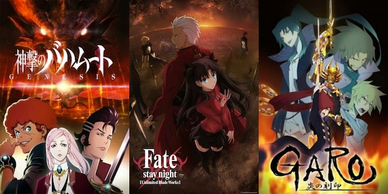
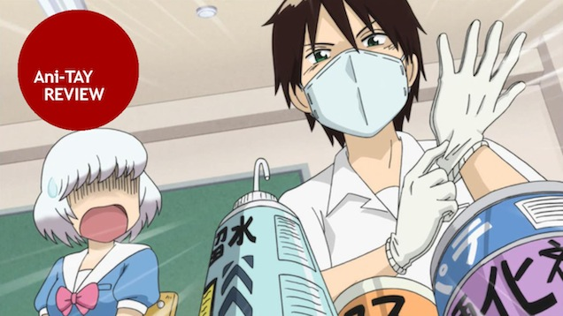

---
{
	title: "Rockmandash's Top Ten Anime of 2014",
	published: "2014-12-30T12:00:00-05:00",
	tags: ["Rockmandash Rambles", "Top 10", "AniTAY", "Top 10 Anime of 2014", "2014", "Top Lists"],
	kinjaArticle: true
}
---

In my opinion, 2014 has been a great year in anime, and just an interesting year in general. It's the first year that I really kept up seasonally with anime, It's the first year I've stuck around TAY/AniTAY and I've found some shows that I love and would consider some of my favorites… so I kinda have to do this. Today, I'm sharing my favorite anime of the year.

***

#### Honorable Mention: **Fate/stay night: Unlimited Blade Works**

**Summary: ***Fate/stay night: Unlimited Blade Works* follows Emiya Shirou as he is dragged into a Fight-to-the-death tournament called The Fifth Holy Grail War, where people known as masters fight with Heroes throughout history, known as servants, for a chance to get the Holy Grail, which grants their wishes. This version of *Fate/stay night* is an adaptation of the Visual Novel route with the same name, and in comparison to the Fate route which the 2006 anime by Studio Deen adapted, it focuses more on action, and the main character. Also, Rin Tohsaka is the main heroine of this route/anime in comparison to Saber from the Fate route/2006 anime. *– Summary from the *[*Fall 2014 AniTAY Collab*](https://anitay.kinja.com/the-ten-anime-of-fall-2014-to-watch-1659473893)

###### [The Ten Anime of Fall 2014 To Watch](https://anitay.kinja.com/the-ten-anime-of-fall-2014-to-watch-1659473893)

Today Ani-TAY fires back with a list of ten anime this season to watch, collated from the…

[Read more](https://anitay.kinja.com/the-ten-anime-of-fall-2014-to-watch-1659473893)

**Justification & Thoughts:** How ironic. Before it was airing, I was [hyping this up like no end](https://rockmandash12.kinja.com/rockmandash-rambles-fate-stay-night-hype-1633708239), [desperately hoping that](https://rockmandash12.kinja.com/fate-stay-night-unlimited-blade-works-first-impression-1642723894) [they'd do the VN justice](http://rockmandash12.kinja.com/rockmandash-reviews-fate-stay-night-visual-novel-1613176306?rev=1407787126382), hoping that it would be one of the best anime I've ever seen…. But now that the first cour is done, it's not even my top ten of the year. I'm so conflicted on my thoughts with this show: It's pretty good and I know that UBW gets better later, but that doesn't really excuse how meh this show can be at times. The visuals are glorious, the fight scenes are awesome, and they are doing the arc justice for the most part, but I have major issues with the show. The internal monologuing is completely gone (which was one of the best parts of the VN), the soundtrack is a complete disappointment, there's something off about the show with the writing that just makes me kinda bored, disconnected as I'm watching it. That being said, I'm still enjoying it, but nowhere near as much as I thought I would. It maybe because I'm used to marathoning the VN and waiting a week is just wrecking the pacing for me, but it's nowhere near as good as I was hoping. I have it here in honorable mentions because I don't want to put my final judgment on this show until it's completely done, and there are other shows that deserve to be in this list moreso than F/SN. See my article when it's out for my full thoughts on this cour, and I'll do a full review when it's done. Let's hope it pulls a *Steins;Gate *and becomes amazing after episode 12.

###### [Rockmandash Rambles: *Fate/stay night* Hype!](https://rockmandash12.kinja.com/rockmandash-rambles-fate-stay-night-hype-1633708239)

Over the past few months, I've been writing about everything related to Fate/stay night, and…

[Read more](https://rockmandash12.kinja.com/rockmandash-rambles-fate-stay-night-hype-1633708239)

***

#### 10. Date A Live 2

**Summary: **Shido Itsuka, who used to be a normal high school student at Raizen High, meets the first Spirit, Tohka, and awakens his power to "seal the Spirit's power". Though they may be feared and hated beings due to their immense power, Spirits were always alone and knew only combat and death. Shido, the only one in the world with the power to seal the Spirits' might, hurls himself into life-threatening dates with the beautiful Spirits in order to save them. *- Summary from MAL*

**Justification & Thoughts:** Sorry, guilty pleasure time, but Date A Live 2 is amazing and I really loved it! I'm a fan of Romance anime (which will make itself VERY apparent as you read through this list), and this is one of my favorite Rom-Com Animes of this year. It was just the right amount of insanity and fun in a show, and **IMS FOR THE WIN, IMS FOR LIFE**. It's so well done, it's just so awesome that I can't help but love it... it's really one of the most entertaining harem shows you will see, if you are into that. Check [Dex's](https://anitay.kinja.com/date-a-live-2-is-my-biggest-surprise-this-season-1579962492) [articles](http://anitay.kinja.com/dexs-review-date-a-live-2-1590778711) for more thoughts, as they pretty much reflect mine.

###### [*Date A Live 2* is my Biggest Surprise this Season](https://anitay.kinja.com/date-a-live-2-is-my-biggest-surprise-this-season-1579962492)

It's been a season of surprising strength so far with shows like Brynhildr in the Darkness, If Her…

[Read more](https://anitay.kinja.com/date-a-live-2-is-my-biggest-surprise-this-season-1579962492)

***

#### 9. Inari, Konkon, Koi Iroha

**Summary:** *Inari Konkon* follows Inari Fushimi, a clutzy, shy girl who just happens to have a crush on Kouji Tanababashi. She manages to embarrass herself in front of her crush and flees from the scene to a local shrine where she saves a fox pup named Kon from falling into the river. Due to this, the guardian deity of the shrine, Uka reveils herself to Inari and grants her a wish. Inari being the clumsy middle school girl she is, wishes to be the girl that her crush likes… but soon realizes that this isn't what she wants and asks to turn back to her original self. Things don't go exactly as planned, and Uta has to give some of her powers to turn Inari back to her original form. What follows is a story of change and growing up, a story of facing the consequences for your actions. - *Summary from *[*the Ten Anime No One Saw article.*](http://anitay.kinja.com/the-top-ten-anime-of-2014-that-no-one-saw-1674308533)

**Justification & Thoughts:** Inari Konkon is a great show because it's engaging, the pacing is perfect, and the character's change is wonderful. The interactions they have with each other, the relationships that change and growth of each character as they react to the situation is done very well, and because of it, there is no part of the story that us dull. It's also hilarious and adorable to boot. Also, say it again with me, **IMS FOR THE WIN, IMS FOR LIFE**. They really do a great job, and I'm looking forward to what they do in the future. [Check out Thatsmapizza's review of the manga for another opinion](https://thatsmapizza.kinja.com/tay-explores-comics-inari-konkon-koi-iroha-1615388769).

###### [TAY Explores Comics: Inari, Konkon, Koi Iroha](https://thatsmapizza.kinja.com/tay-explores-comics-inari-konkon-koi-iroha-1615388769)

I've always had an interest in religious figures since I was a child. So, whenever I see a piece of

[Read more](https://thatsmapizza.kinja.com/tay-explores-comics-inari-konkon-koi-iroha-1615388769)

***

#### 8. Your Lie in April

**Summary:** Kousei Arima is a former piano prodigy who lost his ability to hear the piano after the death of his mother. Two years later he has not played the piano since and sees the world in monotone without color but is content with his life until he meets a girl who changes everything. Kaori Miyazono is a free spirited and beautiful violinist who changes Kousei's perspective and makes his world colorful again, helping him return to the world of music. *– Summary from Mdub's *[*You Should Be Watching Your Lie in April article*](https://anitay.kinja.com/you-should-be-watching-your-lie-in-april-1648891546)

###### [You Should Be Watching *Your Lie in April*](https://anitay.kinja.com/you-should-be-watching-your-lie-in-april-1648891546)

Your Lie in April needs all the hype it can get, so this is a quick and dirty intro to the show/why

[Read more](https://anitay.kinja.com/you-should-be-watching-your-lie-in-april-1648891546)

**Justification & Thoughts:** A show that blends music seamlessly into the storyline, has passionate emotions and great characters? How can I not love this show? Seriously, this show is a blast to watch, I love the development and reactions of the characters (as a person who grew under [Tiger Parents](http://www.pbs.org/wnet/need-to-know/pitchroom/tiger-parenting-good-for-children/6462/), I can really relate to Kousei, moreso than any other character I've seen in anime), and the show is just extremely well written. The show gets you emotionally attached with an amazing display of tone and a narrative that's as moving as the music itself... it's executed great and it's pretty amazing. I'm looking forward to more, and I hope it stays amazing.

***

#### 7. Parasyte

**Summary: **The 17-year-old Izumi Shinichi lives with his mother and father in a quiet neighborhood in Tokyo. One night, worm-like aliens called Parasytes invade Earth, taking over the brains of human hosts by entering through their ears or noses. One Parasyte attempts to crawl into Shinichi's ear while he sleeps, but fails since he is wearing headphones, and enters his body by burrowing into his arm instead, taking over his right hand and is named Migi.

Because Shinichi was able to prevent Migi from traveling further up into his brain, both beings retain their separate intellect and personality. As the duo encounter other Parasytes, they capitalize on their strange situation and gradually form a strong bond, working together to survive. This gives them an edge in battling other Parasytes, who frequently attack the pair upon realization that Shinichi's human brain is still intact. Shinichi feels compelled to fight other Parasytes, who devour humans as food, while enlisting Migi's help. - *Summary from MAL*

**Justification & Thoughts: **From the brilliant pacing, to the interesting premise and the awesome characters (Migi = best hand), I am really having a blast with Parasite, and it's so well executed that I can't help but watch it. It's extremely engaging, it's consistently entertaining, and the situations that the characters get themselves into are great. Watching Shinichi grow, develop and change throughout the show is phenomenal, the events and action in this show is great, and it's just a blast. It's one of the few shows in the year that made me go: **I NEED TO WATCH THIS NOW** because of how well executed it was, and that excitement and urge to watch is why I have this on the list.

***

#### 6. Golden Time

**Summary: **Tada Banri, a newly admitted student at a private law school in Tokyo, found himself completely lost after the opening ceremony, trying to find his way to the freshman orientation. At that moment, he ran into another lost freshman from the same school, Yanagisawa Mitsuo, and they hit it off at once. Somehow arriving at their intended goal just on time, there appeared in front of the two a beautiful girl holding a bouquet of roses. The girl then whacked Mitsuo across the face with the bouquet and handed the flowers over to him. "Freshman, congratulations," was all she said, and then left. The stylish, well dressed, perfect woman that had swung at Mitsuo was his childhood friend, Kaga Kouko. As children they had promised to marry each other one day, fulfilling their dreams. In order to escape from her, Mitsuo had gone out secretly and taken the examination for this well known private college, but now she showed up in the freshman orientation hall. She too had taken the law school entrance examination, catching up with him there. *- Summary from MAL*

**Justification & Thoughts: **My romance loving side is showing. Again. Written well, realistic characters (except for that damn ghost), awesome interactions, great comedy, and solid drama lead me to love this show. I got sucked into the narrative as a part of Feels Thursday, and I loved every bit of it, getting me attached and engaged with the characters and the plot. Also, it's written by the writer of Toradora, and it really shows: it's just as good as Toradora in almost every way, even having a better ending. Check out Dex's and UI 2.0's [Review + Discussion](https://tay.kinja.com/ani-tay-golden-time-review-and-discussion-1556588276) if you want more thoughts.

###### [Ani-TAY: Golden Time Review and Discussion](https://tay.kinja.com/ani-tay-golden-time-review-and-discussion-1556588276)

This review will be slightly different from the usual Ani-TAY. What's new? Dexomega and I, are…

[Read more](https://tay.kinja.com/ani-tay-golden-time-review-and-discussion-1556588276)

***

#### 5. Tonari no Seki-Kun

**Summary: **Tonari no Seki-kun is a short series that follows Rumi Yokoi. Yokoi tries to be a model student and pay attention in class. Unfortunately for her, she sits right next to Toshinari Seki, a guy who, instead of focusing on class, likes to play with various toys and games on his desk. Seki's resulting actions often distract Yokoi and pull her focus away from her studies. Is Tonari no Seki-kun really the master of killing time like its subtitle suggests, or was it all just a waste of time? *- Summary from*[* Koda89's review*](https://tay.kinja.com/tonari-no-seki-kun-the-ani-tay-review-1581524248)

###### [*Tonari no Seki-kun*: The *Ani-TAY* Review](https://tay.kinja.com/tonari-no-seki-kun-the-ani-tay-review-1581524248)

Tonari no Seki-kun is a short series that follows Rumi Yokoi. Yokoi tries to be a model student and

[Read more](https://tay.kinja.com/tonari-no-seki-kun-the-ani-tay-review-1581524248)

**Justification & Thoughts: **I'm typically not a big fan of short anime, but this comedy anime convinced me otherwise... It's one of the best comedies out there, and one of the best short anime out there. It's hilarious, well rounded, brilliantly paced, has a great concept, and an amazing vocal performance by Kana Hanazawa really makes this show great. Really, for what it is, it's damn near perfect, and I couldn't ask for more. It's a great comedy, and I urge everyone to watch it... you'll be hooked, just like I was. For more thoughts, check out the above mentioned review by Koda89, or [Richard's review](https://kotaku.com/if-you-were-ever-bored-in-class-watch-tonari-no-seki-k-1583643416).

[ ](https://kotaku.com/if-you-were-ever-bored-in-class-watch-tonari-no-seki-k-1583643416)

###### [If You Were Ever Bored in Class, Watch *Tonari no Seki-kun*](https://kotaku.com/if-you-were-ever-bored-in-class-watch-tonari-no-seki-k-1583643416)

Every season there are many short-form anime that go largely ignored by anime fans. But every once…

[Read more](https://kotaku.com/if-you-were-ever-bored-in-class-watch-tonari-no-seki-k-1583643416)

***

#### 4. Nisekoi

**Summary: **Raku Ichijou is an average high school student. He also happens to be the sole heir to the head of a Yakuza Family called the Shuei-gumi. Ten years ago, Raku made a promise... a secret promise with a girl he met. They promised one another that they will "get married when they reunite." Since then, Raku never let go of the pendant the girl gave him.

Then one day, a beautiful girl named Chitoge Kirisaki transfers into Raku's class. Their chemistry was more than off. There was not a moment where they were not fighting. But by a weird turn of events, Raku and Chitoge agree to become fake lovers. Although his heart is really interested in his classmate Kosaki Onodera, Raku must continue pretending to be Chitoge's boyfriend. *- Summary from MAL*

**Justification & Thoughts:**

I'm a sucker for Rom-Coms, if you haven't learned from this list. **Best Girl - The Animation 2014 **drew me in so fast that you can't believe it... and I fell in love. This is a hilarious and entertaining Romantic comedy series that had everyone fighting over who was best girl (stop lying to yourself, you know it's Onodera....) while just enjoying a very shafty over the top romantic comedy with great characters, entertaining visuals, great writing, and just interesting character interactions in general. I like this show quite a bit more than the rest here on AniTAY, so it's way higher on my list than most, people would even dare, but I'm that big of a fan of it. I can't wait for season 2, such a great show. By that, I mean it litterally as I couldn't wait and now it's one of my favorite manga. For more thoughts, check out UI 2.0's [review of it](https://tay.kinja.com/nisekoi-is-a-harem-romantic-comedy-anime-that-centers-a-1582395958), or Richard's [review of it](http://kotaku.com/nisekoi-is-the-epitome-of-a-cliche-rom-com-anime-1581878466).

###### [Ani-TAY: Nisekoi Review](https://tay.kinja.com/nisekoi-is-a-harem-romantic-comedy-anime-that-centers-a-1582395958)

Nisekoi is a harem/romantic comedy anime that centers around Raku Ichijo who is the son of the…

[Read more](https://tay.kinja.com/nisekoi-is-a-harem-romantic-comedy-anime-that-centers-a-1582395958)

***

#### 3. Knights of Sidonia

**Summary: **It's been a thousand years since the Gauna, a strange alien race with no known method of communication, destroyed the solar system. A portion of humanity managed to escape using enormous "seed ships" like the Sidonia, which have allowed them to maintain the population while drifting through space. Nagate Tanikaze is a young man who has been raised deep in the bowels of the ship. When he goes into training to pilot the huge robotic weapons known as Gardes, Nagate is entrusted with piloting the legendary unit known as Tsugumori. Nagate and his fellow pilots put their lives on the line against the Gauna, in the ultimate battle for the survival of humanity! *– Summary from MAL*

**Justification & Thoughts: **So, let's get to pretty much the only serious anime on this list XD. If you can get past the CG Visuals, you are greated to a treat: a brilliant and extremely interesting world that actually gets development throughout the show and feels like it could be real, concepts that you probably never thought of, an extremely gripping narrative, and an awesome tone that keeps you interested in a story. Nothing but praise for this show, a shame that it's only on Netflix. Also, it's really cool... probably the mecha I've enjoyed the most in the past few years, and when I really like a mecha... I really like a mecha (#CodeGeassFanboi). I think Hideo Kojima's quote about it really nails what makes Knights of Sidonia special:

> "It's a kind of anime that we haven't seen for a while that has that sci-fi spirit. Using digital technology cultivated through games, it creates animation that encapsulates Japan's cultural assets like manga, cel animation, kanji, giant robots, etc. What's born is a unique made-in-Japan work that could never be cooked up in Hollywood. Japanese culture has lost its "cool," and Knights of Sidonia will be the white knight that saves it."

If you want more thoughts, check out Richard's review of [Knights of Sidonia](https://kotaku.com/knights-of-sidonia-is-a-mecha-anime-with-a-realistic-tw-1603375533).

###### [*Knights of Sidonia* Is a Mecha Anime with a Realistic Twist](https://kotaku.com/knights-of-sidonia-is-a-mecha-anime-with-a-realistic-tw-1603375533)

An isolated human colony ship is on the run from aliens and the only effective defense they have…

[Read more](https://kotaku.com/knights-of-sidonia-is-a-mecha-anime-with-a-realistic-tw-1603375533)

***

#### 2. Gekkan Shoujo Nozaki-Kun

**Summary: **High school student Chiyo Sakura has a crush on schoolmate Umetarou Nozaki, but when she confesses her love to him, he mistakes her for a fan and gives her an autograph. When she says that she always wants to be with him, he invites her to his house and has her help on some drawings. Chiyo discovers that Nozaki is actually a renowned shoujo manga artist named Sakiko Yumeno. She then agrees to be his assistant in order to get closer to him. As they work on his manga, they encounter other schoolmates who assist them or serve as inspirations for characters in the stories. *– Summary from Wikipedia*

**Justification & Thoughts: **One of the best comedies you will ever see, and I loved every bit of it. It's a well executed subversion and lampshading of the Shoujo manga genre, focused on being an entertaining comedy with every time spent making you laugh. I loved it, and it's one of the most entertaining shows I've watched out there. If you want more of my thoughts, check out [my review](http://anitay.kinja.com/gekkan-shoujo-nozaki-kun-rockmandashs-ani-tay-review-1634657276), and [Richard's review](https://kotaku.com/anime-hilariously-explores-what-makes-something-romant-1648772997).

[ ](https://kotaku.com/anime-hilariously-explores-what-makes-something-romant-1648772997)

###### [Anime Hilariously Explores What Makes Something "Romantic"](https://kotaku.com/anime-hilariously-explores-what-makes-something-romant-1648772997)

You’ve seen the same romantic scene a thousand times in a thousand different movies and, yet, every

[Read more](https://kotaku.com/anime-hilariously-explores-what-makes-something-romant-1648772997)

***

#### 1. Nagi no Asukara

**Description: **Since long ago, human civilization had lived on the ocean floor. However, there were many humans who wanted to live above the surface and they moved to land creating a fundamental separation between the two. After their school closes down, four 14-year old middle school students from the sea village, Shioshishio, have to attend Mihama Middle School on the surface. What follows is their struggles to adjust to a new environment and the relationships between the sea and land people, while dealing with their own newfound feelings that have just started appearing with the end of their childhood. *– Summary from Wikipedia*

**Justification & Thoughts: **This is pretty much the reason why I made this list. Such a great show. Absolutely beautiful visuals that blew my mind (one of the best in the industry), amazing music... and the writing by Mari Okada. It's an absoutely well written show with great drama, great characters, great interactions, and on and on and on. I was hooked the second I started watching it, and I absolutely fell in love with the show, so much so that it's now one of my favorite anime, currently sitting at #7. I don't think I've seen a coming of age quite like this one, and I loved every bit of it. If you want more of my thoughts, [check out my review](https://rockmandash12.kinja.com/rockmandash-reviews-nagi-no-asukara-anime-1567969970).

###### [Rockmandash Reviews: *Nagi no Asukara* \[Anime\]](https://rockmandash12.kinja.com/rockmandash-reviews-nagi-no-asukara-anime-1567969970)

Welcome to Rockmandash Reviews! Today I’m reviewing one of my favorite anime, Nagi no Asukara, a…

[Read more](https://rockmandash12.kinja.com/rockmandash-reviews-nagi-no-asukara-anime-1567969970)
