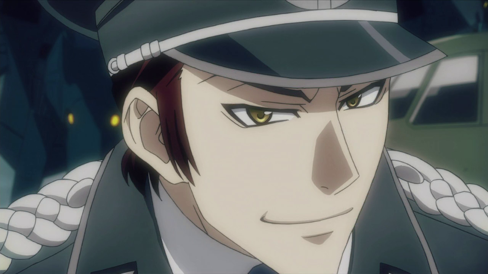
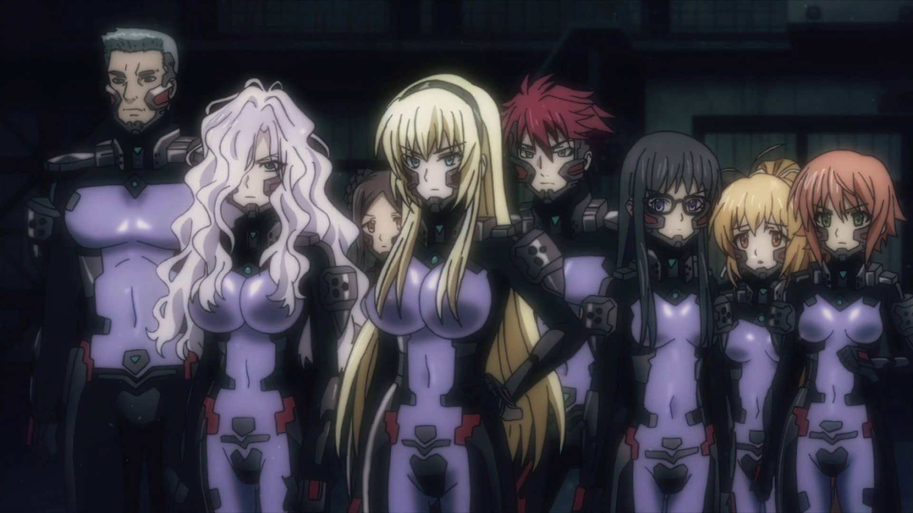
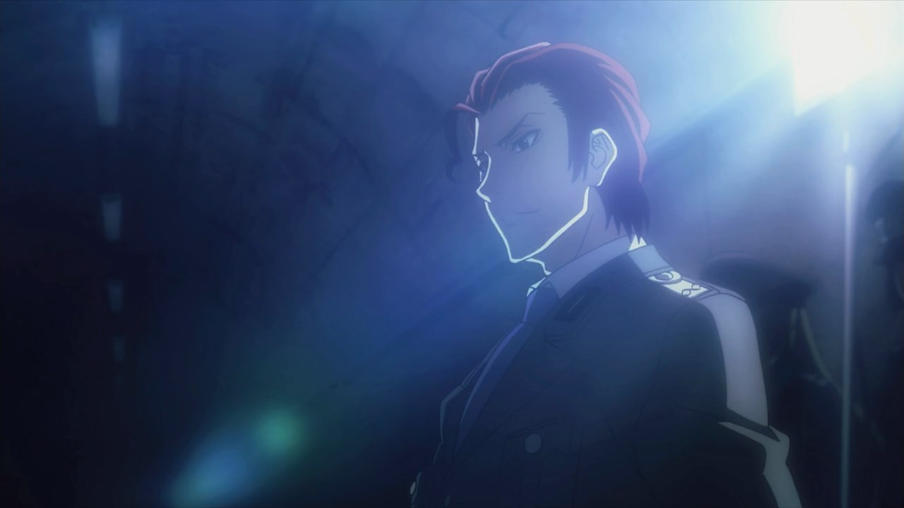
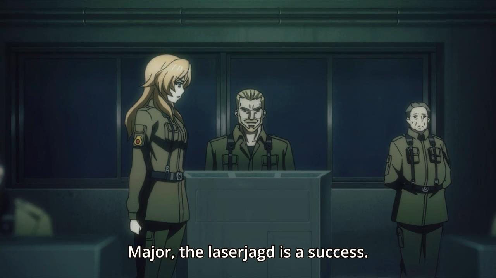
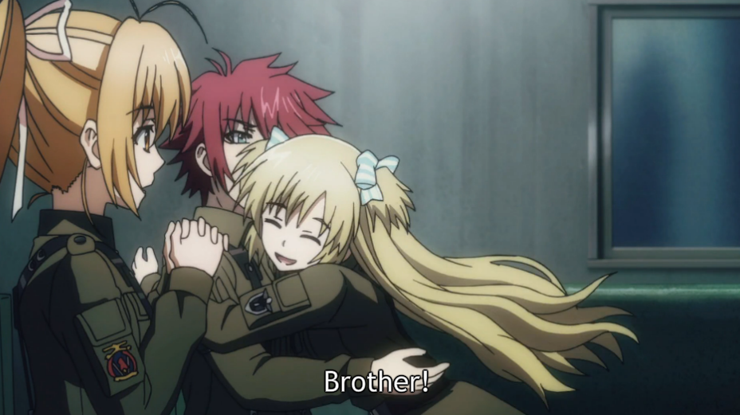
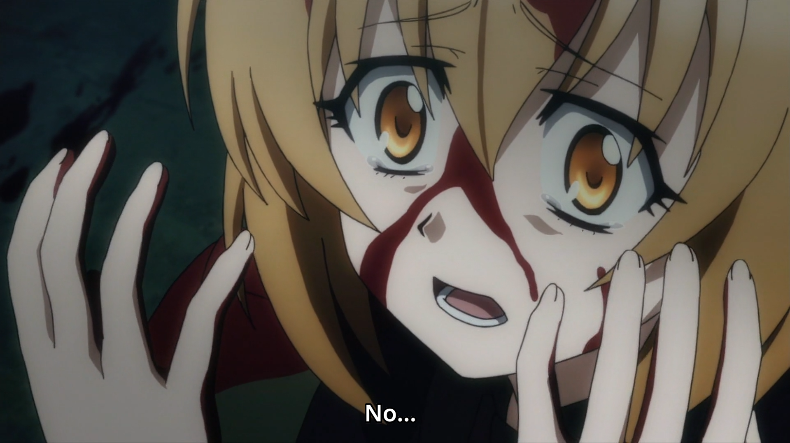
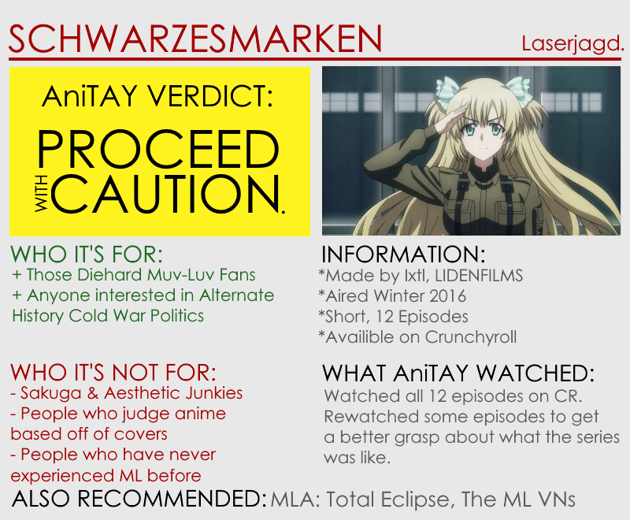

---
{
	title: "Schwarzesmarken : The Ani-TAY Review",
	published: "2016-03-27T14:00:00-04:00",
	tags: ["The AniTAY Review", "Rockmandash Reviews", "Schwarzesmarken", "Muv-Luv", "Winter 2016", "AniTAY", "Review"],
	kinjaArticle: true
}
---

<video src="./cgghbrzjlrzppewibhlw.mp4"></video>

Set in alternate 1980’s East Germany where BETA (Beings of Extraterrestrial Origin) devastate the Earth, the [*Muv-Luv* ](http://tay.kinja.com/rockmandash-reviews-muv-luv-extra-alternative-visua-1567978967#_ga=1.213102999.247934920.1454126956)spinoff called *Schwarzesmarken* follows the 666th TSF Squadron, also known as the “Black Marks”. This TSF squad that the show takes its name after is no ordinary squad however, as they are the best that East German military has to offer, using tactics that most wouldn’t dare to use. This isn’t a completely good thing however as this puts them in risk of plenty of obstacles, from dealing with foreign powers, authoritarian communist leaders, secret police and of course the BETA themselves. Does *Schwarzesmarken *manage to be the *Muv-Luv *gateway all of the VN fans hoped it was going to be, or does it just end up being purged from the Stazi of our memories? Let’s find out.

# A Focus on the Human Story in a World of Antagonizing Aliens

While other shows with a similar premise may only focus on the impending attack and not care about anything else, *Schwarzesmarken *has the guts to tell us a story about humanity itself, something that this series has always excelled in. When you think about it, the show we’re talking about is one where aliens attack humanity, but the writing is strong enough that the politics of it all is it’s strongest point. It’s great.

As mentioned earlier, *Schwarzesmarken* is set in alternate 1980’s Germany (more specifically the world we see in* Muv-Luv Alternative*) and because of this setting that is rarely used, *Schwarzesmarken* in terms of writing stands out from the others in the genre while appealing to anyone who has an interest in the cold war or history in general. It allowed the show to look at the world in a vastly different angle than most would, and due to this different approach, the show was able to show us a story of human conflict that was engrossing and engaging (in concept at least). I just wish that they were able to show more of this world in the show, as they didn’t tell us anything about the differences that would have significantly shaped the show (in this universe FYI the bombs were dropped on Berlin), and most of what we get to see is military facilities with very few establishing shots. Also, *Muv-Luv* fans will appreciate being able to see another angle of the world that they’re so invested in, and as one of those *Muv-Luv* fans, I really appreciated this.

***

# The things about *Muv-Luv* that fans came to love

Even though *Schwarzesmarken *decided to ditch the *Muv-Luv* name, it’s very much Muv-Luv, and fans who loved the series know exactly what they’re getting into here, which is primarily military and politics. From the show’s handling of its military action with relatively realistic tactics (from what I hear anyways, I’m not expert), to the the consistently great politics, this show isn’t a masterpiece of writing that encapsulates everything a story like this should like *Muv-Luv Alternative* does, but it’s damn good in these aspects anyways . This show takes what it aims to do and does them well, a military show that knows what it’s doing.

# A Not So Graceful Start

*Muv-Luv* has never been a series that’s been great at starting up, and that’s no different this time. It was a show that opens up on info dumping while prominently showing off the annoying characters of Theodore and Katia who most likely pissed off every viewer at some point or another. The handling of the characters was OK at best, and does nothing to show that it’s not just another generic and boring mecha show, which the show suffers for. While I don’t think it was particularly as bad as others said the first few episodes were (Nick Creamer from ANN called it “hot garbage”), I can’t honestly say that they were particularly great episodes either, all being episodes where I wished they could be better than they were. Hell, the first episode literally starts off with info dumping, which while not bad enough to make you drop it immediately, it isn’t something that anyone would like to see there. Considering that this is only a 12 episode show and the rest may not interest you unless you are a particular type of person, keep this in mind as you go watch the show, it’s not the best thing out there.

***

# The things about *Muv-Luv* that consistently bothered people

*Muv-Luv* has never been a work that was easy to get into, and I’d argue that these issues can be more pronounced here than in anywhere else in the series (except for the fanservice, TE has that wrapped up). From the start that made it look rather generic (one male character in a TSF Squadron that is mostly chicks? Seriously?) to the gore and technical content that can make people really bored if they aren’t interested in that kind of stuff to the harem bullshit that plagues the series, there are attributes in this show that dramatically hinder it and can be a deal breaker depending on the type of person you are.

***

# Suspension of Disbelief

Every show has suspension of disbelief issues for some, but due to the *Schwarzesmarken’s *attempts to make it seem serious, I felt that the show runs into suspension of disbelief issues more than others: The more realistic a show portrays itself, the harder time it has to suspend one’s disbelief. Some of the actions the characters take seem to defy all logic, like Theodor Eberbach’s actions later on revolving around his sister, or the lieutenant’s insistence on making Eberbach do actions against his will early on for an example. The suits will be a source of frustration for many newcomers, the fact that it deviates from history to a significant agree and makes everything animeified will urk those diehard history buffs, and on and on.

This is a very subjective thing and differs from person to person, but the fact that it comes into play more here than in other works is an issue: when you can no longer believe that a world does not work within the boundaries it sets, then it can ruin their experience. For me personally, as someone who has played the main series, my biggest gripe with this is that there was very little perceivable difference between the 80s which SM is based on in comparison to the rest of series. **(minor spoilers ahead)**

Just to say a few of my gripes, the reason that most of the TSF pilots in the ML Trilogy are females are because most of the men died, but we still don’t see that many men as TSF pilots even 30 years before the point we were in the main trilogy, there is no major difference between the technology and design of the TSFs, (I get the military approach to the world which would mean that military tech would be ahead of our cold war technology, but the fact that the TSFs have the same fancy UI with the same visual fidelity absolutely baffles me), and because the 666th does Laserjagd, the strategy seems remarkably similar to the main trilogy until the end (other than the fact that the East Germans seem remarkably incompetent and the west takes the BETA much lighter than they do in the main trilogy). I’m sure someone can find rational methods to explain all my gripes, but they have negatively hurt my experience with the show and due to the nature of this show and the show should be able to explain discrepancies itself.

While this definitely won’t be an issue for everyone, I’m sure there was something here that broke the suspension of belief for many others, and that’s not really a good thing.

***

# Not really for Newcomers

[Discalibur did an entire post on this issue ](http://discalibur.kinja.com/why-you-shouldnt-watch-schwarzesmarken-if-you-havent-pl-1752059957)so I’m not going to say too much on it here but I’ll say this: Even though it is almost independent from the original story so lots of *Muv-Luv* fans were hoping it would be a good entry point, it uses the source as a crutch to explain a lot of things. Go read the *Muv-Luv VN* when it comes out later this year if you’re interested in the series.

***

# No Visual Spice

It’s been nearly 4 years since [Total Eclipse](http://tay.kinja.com/rockmandash-reviews-muv-luv-alternative-total-eclipse-1585812547), but there’s almost nothing you can point to and say that it looks better than TE. In fact, the show looks so mediocre that I’d argue it looks worse in many ways. From the blurred and bland aesthetic that’s used all over the show to the CG that looks like it was ripped straight out of TE, the show looks cheap and it consistently failed to impress from a visual aspect. The worst offender for me was just how dull everything was: I get that this is a setting where communists with their utilitarianism would rule over design flare, so of course it’s not going to be extravagant as a Ghibli film, but honestly everything looked like a different shade of grey to me. The color palate is so dull, It does the job, but nothing more. It seems like the root cause of the show’s visual issues that it tries too hard to be too “edgy”, with a visual aesthetic that aims to be dark and gritty at all times without taking into consideration an aesthetic design. Next time, a more traditional approach would be appreciated, Age.

***

# The Colorful Cast of Characters

Schwarzesmarken is a twelve episode show that aims to tackle a lot of ground in terms of topics, but because of this it can’t devote its entire time on its characters. From amazing to annoying, the characters in this show aren’t without their issues. For the most part, the cast is serviceable, being entertaining but a tad bit underdeveloped, but the few standouts are what really dictate your experience with the cast in this show and really should be mentioned: Lise Hohenstein, Theodor Eberbach, and Katia Waldheim.

Lise as a character is tragic and insane but amazing to watch; just watching her is painful but exciting at the same time.* *The other two characters Katia and Theodore Eberbach, are prime examples of characters that can really get on your nerves. Katia is annoying to a fault, not being able to read the atmosphere at all. She consistently insists in her ideology that everyone needs to work together when dealing with people in a surveillance state while just being irritating in general. On the other hand, Eberbach has a severe case of angst, from the constant complaining to the excessive yelling that he unleashes at the other crew, which can be equally as annoying.

Considering that these three get the most amount of screen time, the characters in Schwarzesmarken can really be seen as mixed because of their influence, but overall the cast isn’t that bad. Most were pretty good, but these three can really shape your opinion and it may not be all positive.

# Post Credit Scene Syndrome

Schwarzesmarken has a really bad habit of **PUTTING IMPORTANT PARTS OF THE PLOT AFTER THE CREDITS** and it’s not extremely clear that they do this. This means, if you don’t sit through the credits and see all of these, the show has a really disjointed feeling, and there were times where I would forget about this so I was missing out on stuff. I figured I was forgetting something and couldn’t find it so I just continued on, but this rather irked me and I only remembered about it while reading comments on reddit. That’s… not really great. Can we just make it a rule to never put important scenes after credits unless the show makes it apparent that we should stick in after the credits?

Schwarzesmarken’s no TDA or MLA, but it’s another solid entry into the Muv-Luv universe, one that any Muv-Luv fan would enjoy. While solid at it’s core, it has it’s issues that keeps it from being the best that the series offer, to the point that I’d recommend you only check it out if you’re a fan of the series.

***

*You’re reading Ani-TAY, the anime-focused portion of Kotaku’s community-run blog, Talk Amongst Yourselves. Ani-TAY is a non-professional blog whose writers love everything anime related. Click *[*here*](http://anitay.kinja.com/)* to check us out. If you want to read more of my writing, check out *[*RockmanDash Reviews*](/authors/reikaze)* and *[*KMTech*](http://kmtech.kinja.com/)*.*
