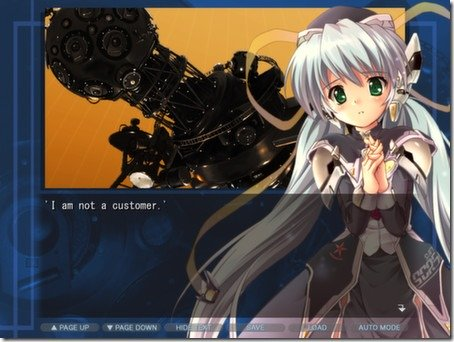

---
{
  title: "Sekai Project Interview about Bringing Visual Novels To The West",
  tags: ["Sekai Project", "Visual Novels", "interview", "Siliconera"],
  published: "2014-09-12T20:56:14-04:00",
  attached: [],
  license: "cc-by-4",
  oldArticle: true,
}
---

Siliconera, the place to find news about obscure japanese video games that most people do
  not care about, did an <a class="sc-1out364-0 hMndXN sc-145m8ut-0 gIacKn js_link" data-ga='[["Embedded Url","External link","http://www.siliconera.com/2014/09/12/sekai-project-interview-bringing-visual-novels-west/",{"metric25":1}]]' href="http://www.siliconera.com/2014/09/12/sekai-project-interview-bringing-visual-novels-west/" rel="noopener noreferrer" target="_blank">interview with the CEO of Sekai Project</a>,
  a company who kinda popped out of nowhere and decided to publish awesome VN's in the west. If you have an interest in
  VN's, check it out! 

<aside class="sc-1rh3ayr-6 jfFNjl inset--story branded-item branded-item--kinja" data-commerce-source="inset">

<a class="sc-1out364-0 hMndXN js_link" data-ga='[["Permalink page click","Permalink page click - inset headline"]]' href="http://www.siliconera.com/2014/09/12/sekai-project-interview-bringing-visual-novels-west/" rel="noopener noreferrer" target="_blank"><h6 class="sc-1rh3ayr-3 jRIPES">Sekai
    Project Interview: Bringing Visual Novels To The West - Siliconera</h6></a>

SIliconera caught up with Sekai Project CEO, Raymond Qian, to ask a few quick
      questions about the…
<a class="sc-1out364-0 hMndXN sc-1rh3ayr-0 kOvmIi js_readmore inset--story__readmore js_link" data-ga='[["Permalink page click","Permalink page click - inset read more link"]]' href="http://www.siliconera.com/2014/09/12/sekai-project-interview-bringing-visual-novels-west/" rel="noopener noreferrer" target="_blank">Read more</a>

</aside>

