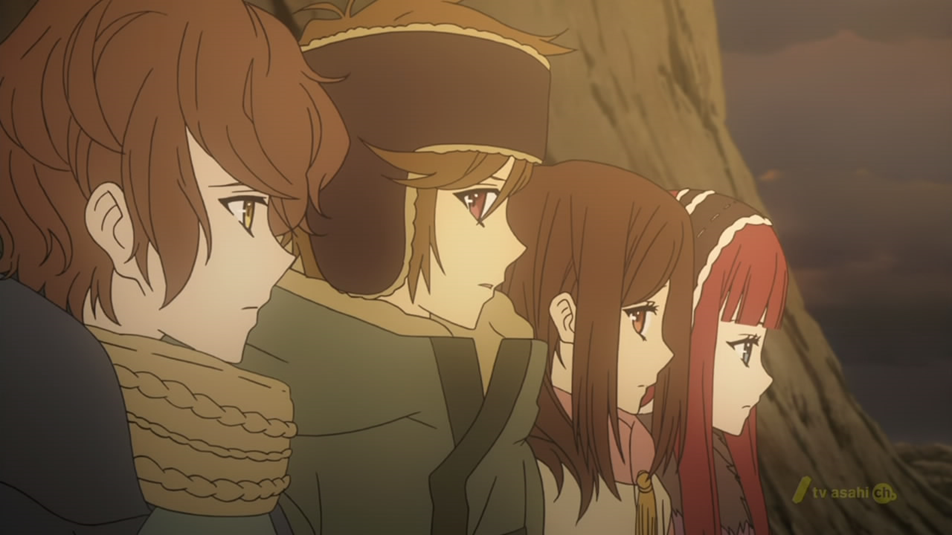
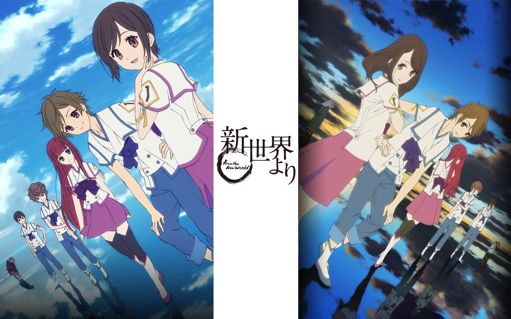
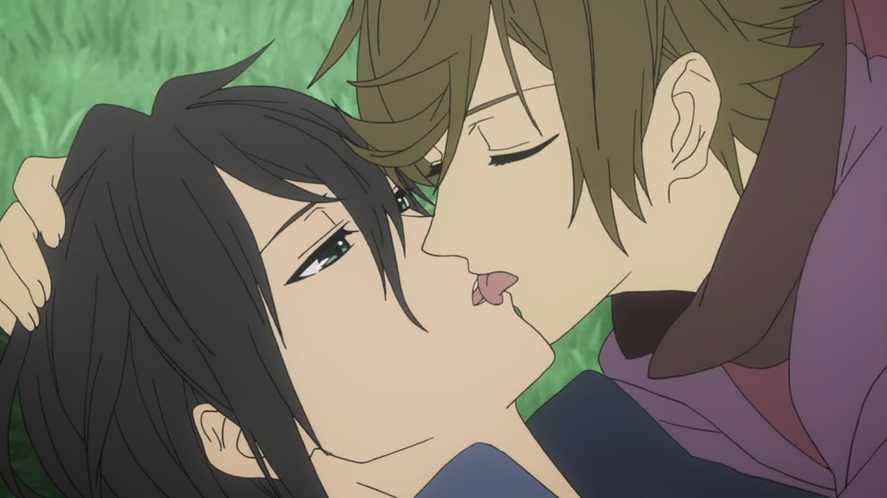
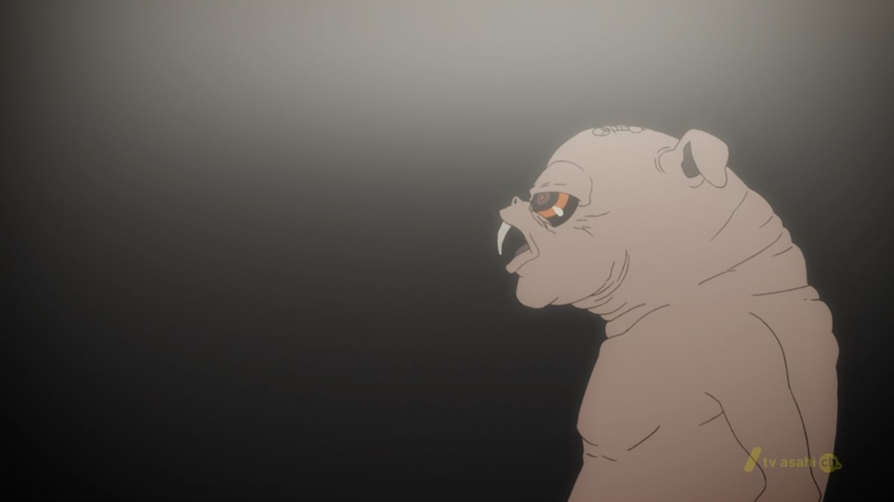
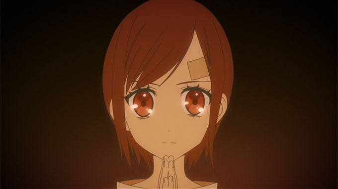
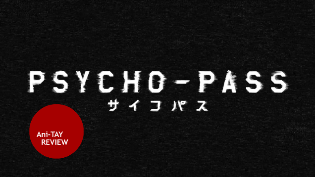
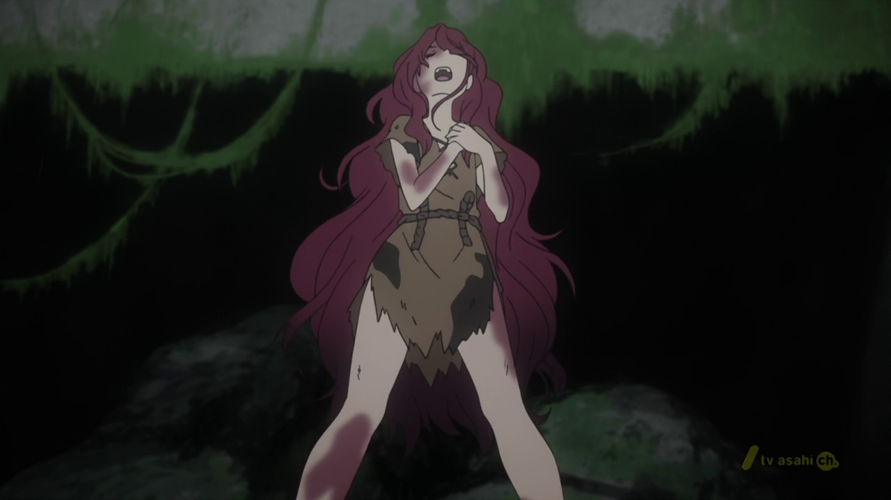
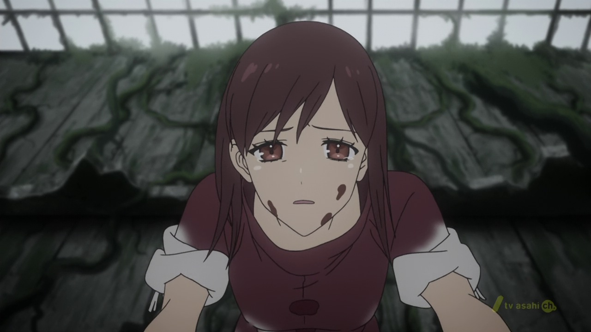
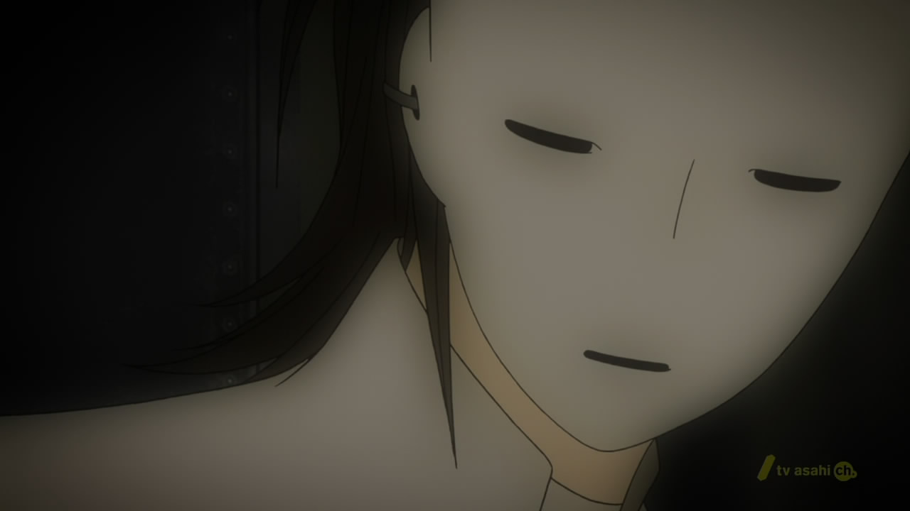

---
{
  title: "Shin Sekai Yori is a Great, Believable, Coming of Age Dystopian Anime",
  tags:
    [
      "Rockmandash Rambles",
      "Shin Sekai Yori",
      "Anime",
      "Ani-TAY",
      "Rockmandash Reviews",
    ],
  published: "2014-12-22T13:10:00-05:00",
  attached: [],
  license: "cc-by-4",
  oldArticle: true,
}
---

A few weeks ago, I watched an anime that's been recommended to me several times:
  <em>Shin Sekai Yori</em>, or <em>From the New World</em>. It's one of the few anime dystopians I've seen (which has to
  by my favorite genre of <a class="sc-1out364-0 hMndXN sc-145m8ut-0 gIacKn js_link" data-ga='[["Embedded Url","External link","http://rockmandash12.kinja.com/1984-review-1659903477",{"metric25":1}]]' href="http://rockmandash12.kinja.com/1984-review-1659903477" rel="noopener noreferrer" target="_blank">literature</a> FYI), so I thought I'd talk about it.

<strong>Disclaimer: This
  is my pure thoughts on the show and thus structures can be damned. If you want a more structured, less ramble-y review
  of Shin Sekai Yori, check out the one</strong> <a class="sc-1out364-0 hMndXN sc-145m8ut-0 gIacKn js_link" data-ga='[["Embedded Url","External link","https://tay.kinja.com/cleverly-titled-anime-review-shin-sekai-yori-1494395136",{"metric25":1}]]' href="https://tay.kinja.com/cleverly-titled-anime-review-shin-sekai-yori-1494395136" rel="noopener noreferrer" target="_blank"><strong>MainProtagonist</strong></a>
<strong>posted earlier this year.</strong>

<aside class="sc-1rh3ayr-6 jfFNjl inset--story branded-item branded-item--kinja" data-commerce-source="inset">

<a class="sc-1out364-0 hMndXN js_link" data-ga='[["Permalink page click","Permalink page click - inset headline"]]' href="https://tay.kinja.com/cleverly-titled-anime-review-shin-sekai-yori-1494395136" rel="noopener noreferrer" target="_blank"><h6 class="sc-1rh3ayr-3 jRIPES">Cleverly
    Titled Anime Review: Shin Sekai Yori</h6></a>

Hello all! Today I am getting off of my butt to review a nifty little series called
      Shin Sekai…
<a class="sc-1out364-0 hMndXN sc-1rh3ayr-0 kOvmIi js_readmore inset--story__readmore js_link" data-ga='[["Permalink page click","Permalink page click - inset read more link"]]' href="https://tay.kinja.com/cleverly-titled-anime-review-shin-sekai-yori-1494395136" rel="noopener noreferrer" target="_blank">Read more</a>

</aside>

What is <em>Shin Sekai Yori</em> exactly? It's an adaptation of the novel with the
  same name, and it's a Sci-fi, Coming of Age Dystopian that takes place millions of years from now where there's been
  people who have psychic powers, but live in a world with a seemingly primitive society. If you are interested in this
  plot, i'd recommend it to you as it's an interesting, well done story that I think anybody interested in the ideals of
  it will enjoy. 

It has a well constructed world yet it's a despicable one: the primitive society
  formed in this new world will spurn anybody who has any modern ideals or lives in current society because they reject
  what we come to know, but the way this show rejects it is so well executed that it's to be admired. As with any good
  dystopian, there are many elements that I find despicable about this society, from it's total oppression of the people
  to how outdated it felt, to the homosexual relationships in the story (which does play an important role) but that
  tension between the society of the work and the viewer is one of the strengths of a dystopian, an essential one that
  shows the weaknesses of a world so we can avoid them in ours. That being said, rarely does a show create such a large
  dissonance between the society and the watcher as much as <em>Shin Sekai Yori</em> did, purposely going out of it's
  way to alienate you from the experience by doing things that one in our society would find alienating. To me, a
  dystopian is supposed to create a dissonance between the reader/watcher, and <em>Shin Sekai Yori</em> is one I
  appreciated, but it was one I had to grow to like as I really didn't like it at the start, and I felt really alienated
  from it. It's a love/hate relationship. 

You may wonder, why would I grow to like a world I disliked? It's because of how
  well executed it is, fleshed out, well developed and extremely well integrated the world is into the story. Like a
  good dystopian should, it makes a point (which I'll leave up to your interpretation) that justifies flaws in the
  world. While being a despicable world at times, it's an intriguing world with a bloodstained history, one that has
  half a foot in the future, but another foot in the past. They throw oodles of information about the situation of the
  society, the more you watch, the more information about this world appears. It's a like if there was a world built
  around the ideas of the hedgehog's dilemma and fear, influencing every part of society in horrific ways. 

To me, the history of it is probably the best part of it, bridging the gap between the
  story and now, helping to give a perspective on how different the world is. It helps make the show that much more
  believable, that much more engaging and it's something that anime rarely does. That trend of doing the unexpected
  continues on in other aspects of this show: rarely in anime do you see a society so well fleshed out, rarely do you
  have a story in anime that everything is important to the plot and the development in the world... it's this nice
  change of pace that I really appreciate, and I love how<em> Shin Sekai Yori </em>has these elements that I love out of
  traditional dystopians like 1984 and BNW, and the dystopian elements it shows (especially at the end... ;-;) is done
  really well. It also makes me wish anime had more dystopians, and i'd love for some recommendations if you guys know
  of any others. (Come on guys! You know you want to do a dystopian! <strong>PLEASE???</strong>) 

That being said, <em>Shin Sekai Yori</em> is much more than a dystopian, if you
couldn't tell from the title: it's a really well done Coming of Age story. It tells the tale of a group of children
born in this society, and how they grow up with this world effecting them and they get ample development throughout
the work. You're in with them for the ride, starting from a clean slate, trying to curiously stumble through this
unknown, new world and it's done extremely well. Seeing these characters challenge the status quo of the world and
deal with the situations the story throws at them is quite engaging, and the way it's done is believable and . The
show has a dynamic to it where every aspect of the show serves to either develop the world or the characters we follow
which is something I wish I saw more often in anime. 

There is no bad guy to the story, and even the characters that seem to be a bad guy
  are well rounded, interesting characters, executed in ways you would <strong>NEVER</strong> expect. It utilizes it's
  world to create a moral ambiguity where everyone is justified with their actions. It utilizes this ambiguity to make a
  point (something I rarely see) pushing it far past something like <a class="sc-1out364-0 hMndXN sc-145m8ut-0 gIacKn js_link" data-ga='[["Embedded Url","External link","https://anitay.kinja.com/psycho-pass-protonstorms-ani-tay-review-1634716298",{"metric25":1}]]' href="https://anitay.kinja.com/psycho-pass-protonstorms-ani-tay-review-1634716298" rel="noopener noreferrer" target="_blank"><em>Psycho</em></a><a class="sc-1out364-0 hMndXN sc-145m8ut-0 gIacKn js_link" data-ga='[["Embedded Url","External link","http://anitay.kinja.com/psycho-pass-2-the-ani-tay-review-1673700249",{"metric25":1}]]' href="http://anitay.kinja.com/psycho-pass-2-the-ani-tay-review-1673700249" rel="noopener noreferrer" target="_blank"><em>-</em></a><a class="sc-1out364-0 hMndXN sc-145m8ut-0 gIacKn js_link" data-ga='[["Embedded Url","Internal link","http://tay.kotaku.com/fabulous-fyst-trainime-review-psycho-pass-1482700742",{"metric25":1}]]' href="http://tay.kotaku.com/fabulous-fyst-trainime-review-psycho-pass-1482700742"><em>Pass</em></a> to me,
  making it feel like a cohesive world, building up and helping to create a great atmosphere.

<aside class="sc-1rh3ayr-6 jfFNjl inset--story branded-item branded-item--kinja" data-commerce-source="inset">

<a class="sc-1out364-0 hMndXN js_link" data-ga='[["Permalink page click","Permalink page click - inset headline"]]' href="https://anitay.kinja.com/psycho-pass-protonstorms-ani-tay-review-1634716298" rel="noopener noreferrer" target="_blank"><h6 class="sc-1rh3ayr-3 jRIPES"><i>Psycho-Pass</i>:
    Protonstorm's Ani-TAY Review</h6></a>

      The year is 2113, and society is far from what one might know it as today. Technology has…
<a class="sc-1out364-0 hMndXN sc-1rh3ayr-0 kOvmIi js_readmore inset--story__readmore js_link" data-ga='[["Permalink page click","Permalink page click - inset read more link"]]' href="https://anitay.kinja.com/psycho-pass-protonstorms-ani-tay-review-1634716298" rel="noopener noreferrer" target="_blank">Read more</a>

</aside>

<iframe allow="accelerometer; autoplay; clipboard-write; encrypted-media; gyroscope; picture-in-picture" allowfullscreen="" frameborder="0" height="315" src="https://www.youtube.com/embed/3pv30jzhnxI" width="560"></iframe>

About that atmosphere? Just amazing. It's what gets you hooked into the story, to
  experience this weird world with this unique tone with qualities I can't describe. It's so immerse, and it's so well
  done that everything bleeds in together and makes for this believable and cohesive experience. It's damn good. A core
  part of that amazing brilliant music, which is absolutely amazing with great violin that helps supplant the tone into
  a point of prominence. It supports the story in ways that words could not and amplifying everything else. It's really
  unlike anything you'll hear in anime, and it makes an impact: it hones in on the raw feelings that may be bouncing
  around at the time: unknown, loneliness, peace, tension, etc. It's a soundtrack that is ethereal, haunting,
  memorizing, beautiful, soothing, pleasing to the ears... all at once and it makes for an out of this world experience
  that does exactly what it should.

I managed to get this far without mentioning the ending? Better get onto that: it
was a nice change of pace, wrapping up everything it needed to, explaining stuff and actually having some falling
action (<a class="sc-1out364-0 hMndXN sc-145m8ut-0 gIacKn js_link" data-ga='[["Embedded Url","External link","https://anitay.kinja.com/tokyo-ghoul-the-ani-tay-review-1636678069",{"metric25":1}]]' href="https://anitay.kinja.com/tokyo-ghoul-the-ani-tay-review-1636678069" rel="noopener noreferrer" target="_blank">something that </a><a class="sc-1out364-0 hMndXN sc-145m8ut-0 gIacKn js_link" data-ga='[["Embedded Url","External link","http://anitay.kinja.com/akame-ga-kill-the-ani-tay-review-1671140613",{"metric25":1}]]' href="http://anitay.kinja.com/akame-ga-kill-the-ani-tay-review-1671140613" rel="noopener noreferrer" target="_blank">quite a few</a> <a class="sc-1out364-0 hMndXN sc-145m8ut-0 gIacKn js_link" data-ga='[["Embedded Url","External link","http://anitay.kinja.com/aldnoah-zero-the-ani-tay-review-1637330529",{"metric25":1}]]' href="http://anitay.kinja.com/aldnoah-zero-the-ani-tay-review-1637330529" rel="noopener noreferrer" target="_blank">shows nowadays can't</a>
<a class="sc-1out364-0 hMndXN sc-145m8ut-0 gIacKn js_link" data-ga='[["Embedded Url","External link","http://anitay.kinja.com/chaika-the-coffin-princess-avenging-battle-the-ani-1669678729",{"metric25":1}]]' href="http://anitay.kinja.com/chaika-the-coffin-princess-avenging-battle-the-ani-1669678729" rel="noopener noreferrer" target="_blank">figure out</a> <a class="sc-1out364-0 hMndXN sc-145m8ut-0 gIacKn js_link" data-ga='[["Embedded Url","External link","http://anitay.kinja.com/terror-in-resonance-the-ani-tay-review-1640199423",{"metric25":1}]]' href="http://anitay.kinja.com/terror-in-resonance-the-ani-tay-review-1640199423" rel="noopener noreferrer" target="_blank">is a </a><a class="sc-1out364-0 hMndXN sc-145m8ut-0 gIacKn js_link" data-ga='[["Embedded Url","External link","http://anitay.kinja.com/tokyo-esp-the-ani-tay-review-1641119141",{"metric25":1}]]' href="http://anitay.kinja.com/tokyo-esp-the-ani-tay-review-1641119141" rel="noopener noreferrer" target="_blank">good thing</a>)
while being very satisfying. It ends in a way that shows really should end, and I appreciated it.

<aside class="sc-1rh3ayr-6 jfFNjl inset--story branded-item branded-item--kinja" data-commerce-source="inset"><a class="sc-1out364-0 hMndXN sc-1rh3ayr-2 lcMGRt inset--story__thumb js_link" data-ga='[["Permalink page click","Permalink page click - inset photo"]]' href="https://anitay.kinja.com/tokyo-ghoul-the-ani-tay-review-1636678069" rel="noopener noreferrer" target="_blank">
<video autoplay="" loop="" muted=""><source src="./or9sskeryrsked2hr3vf.mp4" type="video/mp4"/></video>
</a>

<a class="sc-1out364-0 hMndXN js_link" data-ga='[["Permalink page click","Permalink page click - inset headline"]]' href="https://anitay.kinja.com/tokyo-ghoul-the-ani-tay-review-1636678069" rel="noopener noreferrer" target="_blank"><h6 class="sc-1rh3ayr-3 jRIPES"><i>Tokyo
    Ghoul</i>: The <i>Ani-TAY</i> Review</h6></a>

      Ken Kaneki is a quiet and reserved bookworm who manages to score a date with a stunningly…
<a class="sc-1out364-0 hMndXN sc-1rh3ayr-0 kOvmIi js_readmore inset--story__readmore js_link" data-ga='[["Permalink page click","Permalink page click - inset read more link"]]' href="https://anitay.kinja.com/tokyo-ghoul-the-ani-tay-review-1636678069" rel="noopener noreferrer" target="_blank">Read more</a>

</aside>

All that being said, it's pretty great, but<em> Shin Sekai Yori </em>is not perfect,
  so I'll just briefly talk about some less than great aspects here.

1. <strong>THE
  DAMN TIME JUMPS. </strong>If there's one thing that annoys me the most, it's when stories do not have a continuous
  story line, and when they randomly jump.... which Shin Sekai Yori has. These time skips happen almost at random times,
  and every time they did it, it threw me out of a loop. Was not a fan. Apparently these time skips were in the original
  novel so I can't put blame on the anime, but it still annoyed me nonetheless.

2. <em>It's not here to entertain you.</em> It's here to make the best of what it
  did in quality and writing which it did a great job with. This means of execution though, may limit how much you liked
  it. You may be bored at times, and it may feel dragged out. As a story, <em>Shin Sekai Yori </em>is great. As
  entertainment? Not so much.

3. <em>The pacing is slow</em>. While not an issue for
  me, it's still an issue to some.... but if that'll detract you, you obviously are not the intended audience for this
  story. The pacing helped to develop everything in the story and I never personally had an issue with it but it can be
  a bit dull.

4. <em>The Visuals</em>. I personally am willing to give them a pass mainly because
  they look solid considering the relatively small budget they have... but it has it's issues. Sometimes it would go off
  model which would bother me, but it's not so bad that it'll hinder your experience. It's muted, subdued and
  experimental visual appearance works well, but may bother some and doesn't look amazing. It does look realistic and
  really nice at other times though, so it's mostly a wash to me. That being said visuals aren't really here to be
  amazing, but here to help the atmosphere. In that aspect, it does the job pretty well.

That being said, the experience that <em>Shin Sekai Yori</em> gives is out of this
  world and it fully justifies going through some relatively minor pain points. It's an ethereal, unique and interesting
  experience that I thoroughly enjoyed, and it's one that should be experienced. I have to say thanks to everyone that
  recommended this to me, as this was a work that engaged me to the fullest extent, and it was something that is quite
  different than a lot of shows nowadays. It was a show that showed what anime could do, and it was a great example of a
  dystopian, a genre I love. It's really what the title says: a great, believable, coming of age dystopian anime, and
  there's not much more I can ask for.

