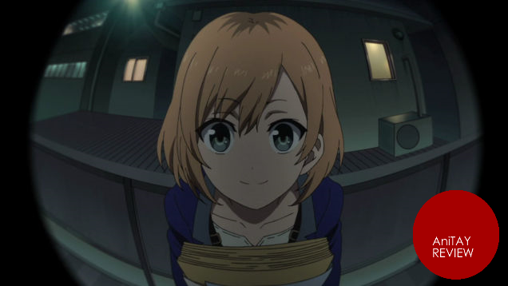
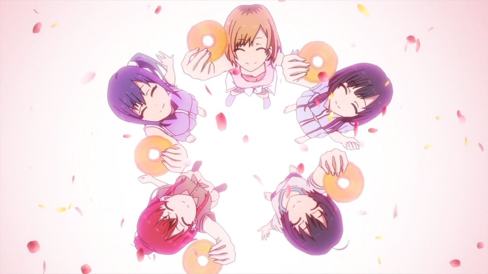
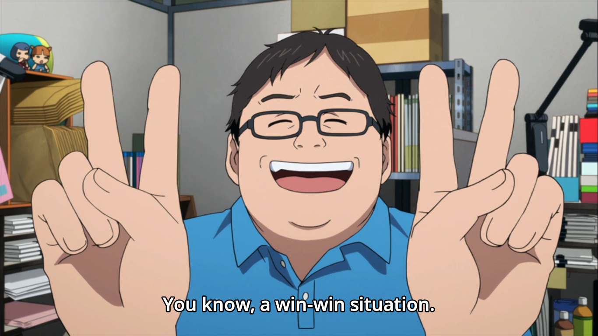
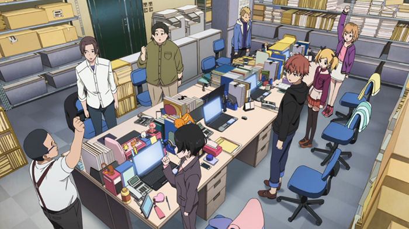
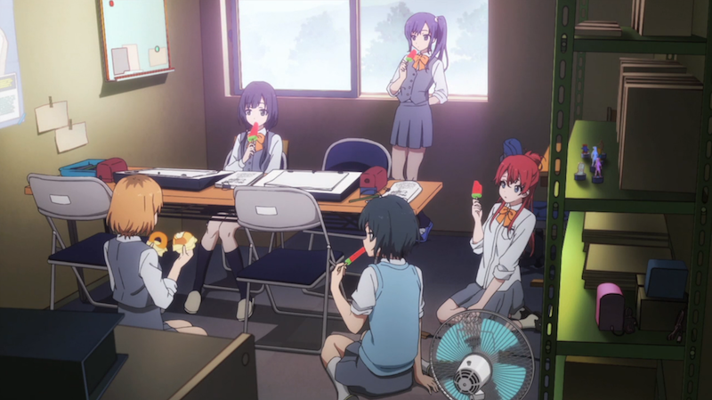
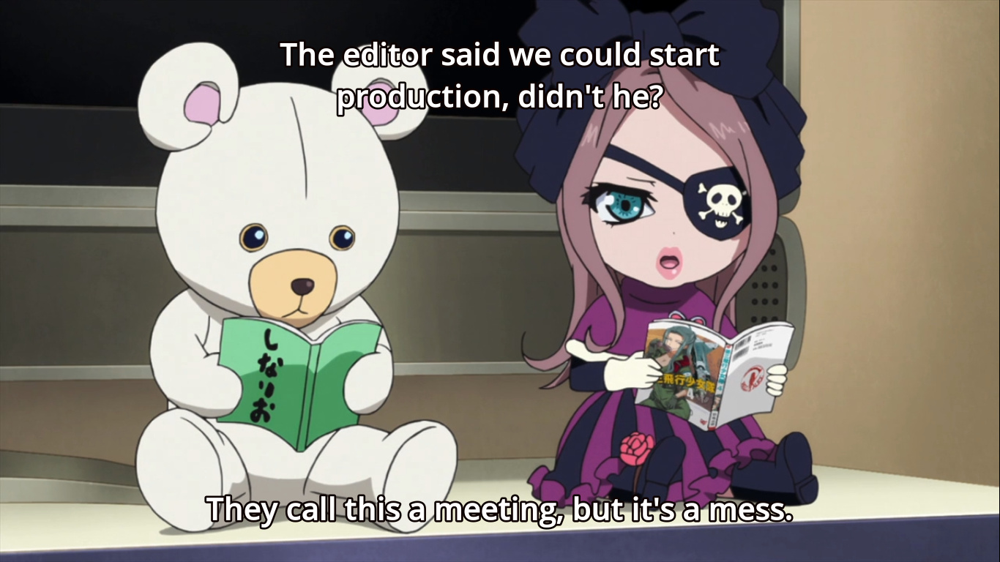
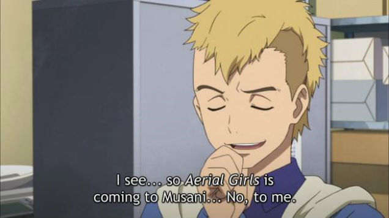
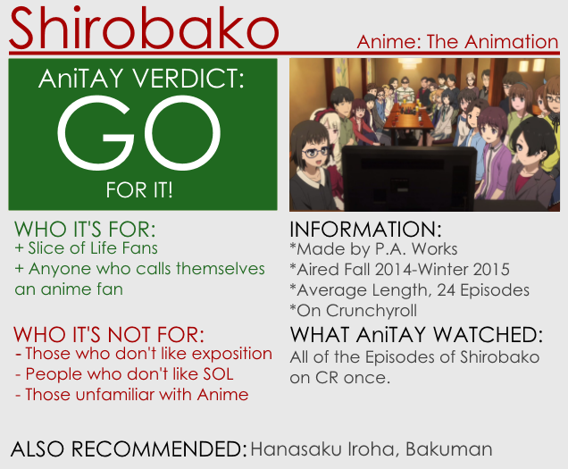

---
{
	title: "Shirobako : The Ani-TAY Review",
	published: "2015-03-30T09:15:00-04:00",
	tags: ["Rockmandash Reviews", "AniTAY", "The Ani-TAY Review", "Tayclassic", "Shirobako", "Winter 2015", "Fall 2014"],
	kinjaArticle: true
}
---

What is Anime? To many, it's a form of entertainment. To others, it's a form of art, and to others, it's a way of life. As a viewer of anime, we only get to see one side of what anime is but* ~~Anime: The Animation~~ Shirobako* is aiming to change that, showing the side of anime you may know about, but never see. This a review of the anime about making anime made for anime fans, and it's everything I expected out if it and more.

# **An Entertaining Slice of Life**

While *Shirobako* is primarily an anime about anime, don't start it with the assumptions that it's a documentary or only about the production of anime, because that's doing this show a grave disservice. This show isn't just a girls doing cute things show like most of the plot summaries out there may mislead you to think, stating that it's the story of five girls who promise to come back together as adults and make their own full anime, after making a short anime while members of their high school animation club. From actually watching the show, it's not so much the story of 5 girls, but the story of teamwork, a story about everyone involved in production, or just anyone in this show trying to do their best, to succeed with their goals. While the 5 girls do make an appearance in the story and are pretty much the backbone of the story, they are just a piece of the puzzle, a part of the grand scheme, and it actually focuses more on the struggles of the animation studio Musashino, and the people there. Through the lens of the production assistant, Aoi Miyamori (who I really worry about due to her massive delusions of bears and pirate viking dolls that give us exposition and even make PVs), we get to see how everyone grows, changes and deals with issues that anybody who's ever made anything can really relate to.

*Shirobako* is a great slice of life that will keep you invested in this show and entertain you throughout with solid writing, awesome humor, and solid character interactions. Like *Hanasaku Iroha*, this show is a great example of how to do a slice of life well: it has characters that are entertaining to watch, it has interesting events and twists that help develop the character while being an entertaining story in its own right, and a unique setting that makes it stand out from the crowd, keeps you watching, and informs you about an experience you probably haven't experienced before while connecting to those you are familiar with. The story in general really captured the feeling of pressure and deadlines really well, captured the feelings and struggles of people involved with production, and just did what it had to do really well. It just conveys it so well to the point that it makes it pretty obvious that these are issues and things near and dear to their heart, and due to the execution, they managed to make it feel natural.* Shirobako *is a great, well written slice of life that I really enjoyed along with many others.

# Entertaining Characters

<video src="./fkaazcthqjkbmr6woxep.mp4"></video>

On that vein, we might as well talk about the characters, which are surprisingly well rounded and really enjoyable (with one person being pretty controversial in that aspect, but i'll talk about that later). This show doesn't really attach you to the characters like [*Nagi no Asukara*](http://tay.kotaku.com/rockmandash-reviews-nagi-no-asukara-anime-1567969970?rev=1427559451166)* *or [*Hanasaku Iroha*](/posts/rockmandash-reviews-hanasaku-iroha-anime-1642709329) which spends its whole time developing the characters, but that's almost a given because of the vast differences that these shows have set out to do, and the amazing interactions and representation of people very much make up for it. There's a character for everything in this show, from the jaded optimistic to that one guy who always ruins things, and they aren't just cookie cutter characters as every character is designed in a way that was quite memorable, adding to the charm and entertainment to the show. One character absolutely takes the cake in that aspect here though, and that was the absolutely adorable Kunogi who you couldn't keep your eyes off of whenever she was on screen… really impressive. It was really great to see how the characters interacted and grew: From the artists to the 3D CGI people to the people in the production, everyone involved is growing, changing, and watching this was great, while the interactions made up most of the entertainment value of the show.

# A Look into the Industry

*Shirobako* is an anime about making anime, and they do a damn good job at informing you about what it's like, what it's about and just a ton of stuff about it. It's the best anime about anime you will ever see, it's extremely informative, and it's a peak into the world of animation that you probably don't know about ([like salaries!](http://www.crunchyroll.com/anime-news/2014/11/19/a-shirobako-guide-to-anime-industry-salaries)). It gets you invested in the work it represents by covering tons of viewpoints: it shows you how people are and what they do, the struggles of everyone trying to succeed (I found the director's struggles of trying to take someone's work and spin it into a different medium while keeping it intact and the argument between the 2D artists and the CGI people pretty memorable), and the frenetic pace that comes with delivering the shows on time. It has it all and it's pretty great. Honestly, if you have any interest in the medium, you will get something out of it and I think it makes you appreciate everything that goes into this medium that we may take for granted. It's a different viewpoint of something we all hold dear, and it's a nice breath of air. One aspect in particular I appreciated in* Shirobako* was how it deals with issues of adapting works in the second half of the show, because so many anime nowadays are adaptations and it really clarifies why there are such differences in animation, so many stylistic choices and how much of a pain it is to do an adaptation… really, this part in particular will hit home with pretty much any anime fan out there, and it's done very well.

# Progressive Animation

I don't think that this really has to be said because it's P.A. Works doing what P.A. Works does best, but as one would expect, this show had some amazing production values and it looks great. Of course, it didn't really stand out too much in the visuals department like in [*Glasslip*](http://anitay.kinja.com/glasslip-ani-tay-review-and-discussion-1641880502) or other P.A. Works shows because there's not really much they can do about an animation company and animation work, but it had their overall polish that we've come to expect from the company and it looks quite pleasing, with nice fluid animation, great keyframes, great key frames of key frames and a nice aesthetic design in general. In no way is this show a Jiggly Jiggly Heaven, and it looks pretty great.

# The Little Things

It's the little things that differentiate the good from the great, and it's these little things that make *Shirobako *so great… because it has a lot of them. [With the little things it does with animation](http://www.google.com/url?q=http%3A%2F%2Fkotaku.com%2Fnow-this-is-a-smart-anime-gag-1689819988\&sa=D\&sntz=1\&usg=AFQjCNG4OYUubODC2yfcXXhcdrKBZY1lcQ), [the countless references that I could go on and on about but unfortunately don't really know all of them](http://www.google.com/url?q=http%3A%2F%2Fmyanimelist.net%2Fforum%2F%3Ftopicid%3D1343879\&sa=D\&sntz=1\&usg=AFQjCNGSUHNo_2bSk-qTvGuKwD2gqfmPdA) because there's SO MANY OF THEM [(hell, some people play themselves)](https://pbs.twimg.com/media/B0FjUQ6IQAAkH5m.jpg),[ hypnotizing dancing,](https://www.youtube.com/watch?v=ZJLiu8zwAIE) [spoken emoticon,](https://pbs.twimg.com/media/B9zniOHCAAA8gRW.png) [and amazing drifting](https://www.youtube.com/watch?v=VdKKIqDj8ps), you can't say that the people who were making this didn't care… there's so many little things that make the experience that much better, and help make this show great.

# Slow Start

A lot of people were turned off by this show originally because it started off really slow. We were learning the ropes, and getting to know things, but it wasn't really that interesting early on for most people and it was just pretty slow, and not that engaging. I'm sure viewers can agree that it really picked up around the midpoint of the season, when they started the adaptation arc. Maybe this slow start was intentional, who knows, but it's there and it's worth a mention.

# Rated N: Not for Everyone

<video src="./wqm3qggifjnamhel2fzj.mp4"></video>

I love *Shirobako*, but as enjoyable it can be for someone like me, this is a show that is definitely not for everyone. From the primarily slice of life working scenario to pretty large amount of jargon this show throws at you, *Shirobako* is a show that is for those that are interested in anime, and those that like slice of life shows, but not really anybody else. It's one of those shows where a single sentence tells you everything about it, and if you dislike that sentence, too bad, so sad. It's an anime about making anime, with all of the pros and cons that come with that. Your mileage may vary depending on how much interest you have in the medium, and how much you care about character development in comparison to a strong narrative.

# Taro

Taro gets a lot of hate. Yes, he may be the amalgamation of every annoyance the creators of *Shirobako* have ever encountered in anime production, personified and put into the anime to say "See!? This is the sort of BS that we have to put up with/that screws up production!" but he's still a relatively entertaining character who got a lot better as the story went on, and without him, this show wouldn't be where it is. Yes, he's that guy, the person who always drags down the production, fucks things up, and is just relatively incompetent in general but as a character I found him to be pretty entertaining and he kinda needs to be there... because no matter what you do with groups, there's always that one guy, the person who ruins everything. Honestly, I think the hate against him is a feat because we have Mr.Funny Story literally halting production of the show and screwing over the whole plot multiple times, but yeah, people dislike Taro, and I didn't think he was all that bad.

*Shirobako* is a [great slice of life](http://anitay.kinja.com/a-life-worth-watching-for-why-i-love-the-slice-of-life-1684551635) anime that gives us a different look into the industry while being extremely fun in the process. Yes, it's not the most action packed, moving thing out there but one has to appreciate what they've done here, and watching it makes you learn why you should appreciate it. If you find this interesting and call yourself an anime fan, this is a must watch.

***

*Rockmandash is a frequent writer of Visual Novels and anime on *[*his blog*](/people/reikaze)* and **AniTAY **as well. Come and check them out if you are interested in reviews and opinion pieces on these topics! For an explanation of my review system, *[*check this out*](http://tay.kotaku.com/rockmandash-rambles-an-explanation-on-my-review-system-1619265485)*, and here's *[*my biases in reviewing*](/posts/rockmandash-rambles-my-personal-biases-in-reviewing-1688152053)*.*

*Thanks to Toshi Nakamura of Kotaku for letting me use his comment that was on *[*Richard's review of Shirobako*](http://kotaku.com/shirobako-is-an-anime-about-making-anime-1680383301)*, and thanks to Protonstorm for helping with these reviews like always. ^.^*
