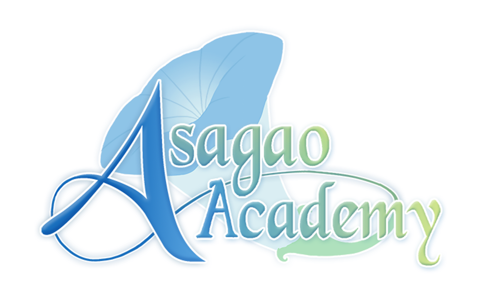

---
{
	title: "Apparently making Otome games about YouTubers is a thing now.",
	published: "2014-10-31T19:10:00-04:00",
	tags: ["Visual Novel", "Otome", "Youtubers", "Kickstarter", "WTF", "Tayclassic"],
	kinjaArticle: true,
	hideFromIndex: true
}
---

This is a thing, and it has popular youtubers like JonTron and PBG.... Why is this a thing. I'm trying to say words but they are not coming out of my mouth. I'd say that I'd buy it to support the western VN community, but I'm not sure if I should get this... For those interested..... [LINKU HEREEEEE](https://www.kickstarter.com/projects/94110993/asagao-academy-normal-boots-club)

###### [Asagao Academy: Normal Boots Club](https://www.kickstarter.com/projects/94110993/asagao-academy-normal-boots-club)

A fan-made otome dating sim and visual novel featuring JonTron, PBG, Continue?, DYKGaming,…

[Read more](https://www.kickstarter.com/projects/94110993/asagao-academy-normal-boots-club)