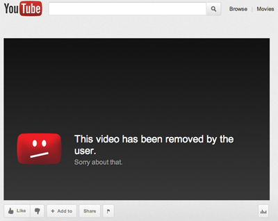
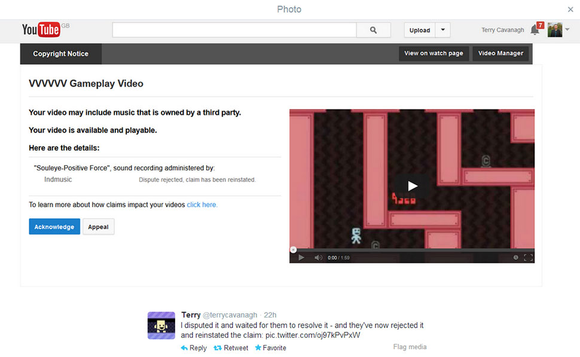

---
{
	title: "Thinking of quitting YouTube....",
	published: "2014-01-26T03:22:00-05:00",
	tags: ["Rockmandash12", "Content ID", "TayClassic", "Rant", "Angry", "Quit", "YouTube", "sadness"],
	kinjaArticle: true
}
---

So, I'm contemplating quitting content creation on YouTube (if you actually watch my stuff, I make reviews), or only uploading stuff from events... YouTube's gone full retard and i'm just about to give up with it.

The biggest reason why i'm deciding on quitting YouTube is that YouTube is very unfriendly and cold to new content creators who are not LP'ers, and it makes it damn near impossible to get any significant amount of views. The low view counts are really getting to me. Spending a week+ to make reviews with a ton of prep work and effort doesn't seem like it's worth it when you get 500 views at most, and somebody can put out crap and get hundreds, if not thousands of more views. YouTube's making me feel insignificant in the world, and it seems like a waste of time if none of my viewpoints get out. Might be selfish and #firstworldproblems of me, but i feel like i'm just wasting my time. Don't get me wrong, I started to make videos for fun, but when it's like 5 people seeing your viewpoint, what is the point?

Next up is the bullshit that happens when you put a video out onto YouTube, the net known as Content ID, and the punishment of failing a claim which is a copyright strike. I'm so damn tired of Content ID. Anytime I do ANYTHING modern that's not totally obscure, I get this really fucking annoying content ID flag. Without Question. My Steins;Gate Review, my Valvrave review, and Fate/Stay Night: Unlimited Blade Works Movie Review (btw the fucking whole movie is up on YouTube yet I can't fucking get a review up?) all got tagged. I'm the type of person who believes in rules and content ID taking down any form of review is blasphemy. Under Title 17, section 107 of United States Copyright law, reviews are protected:

> ### Quote:
>
> Notwithstanding the provisions of sections 106 and 106A, the fair use of a copyrighted work, including such use by reproduction in copies or phonorecords or by any other means specified by that section,** for purposes such as criticism, comment,** news reporting, teaching (including multiple copies for classroom use), scholarship, or research, is not an infringement of copyright.

yet they can take down my review? I edited (and later took down) my Steins;Gate review in fear of getting a copyright strike, but when I posted my Valvrave the Liberator review, it got a strike. I petitioned for a claim, saying it's fair use, and under copyright law, it is. 2 weeks later, I hop on my YouTube account and see that A. my Valvrave the liberator review got taken down and B. I got a copyright strike. I can't upload more than 15 minutes on YouTube now, and if this happens 2 more times, there is a possibility of losing my account. I've had my YouTube account for a really long time now, and there is no way that I'm going to lose it now. So I raged, quickly took down everything with a content ID flag. Content ID is the biggest piece of crap ever. It flags so much, is a headache to deal with, and even inhibits creators of the content (Here's an article on how the creator of VVVVV got a Content ID flag... [http://kotaku.com/that-still-ain…](https://kotaku.com/that-still-aint-right-youtube-1508544702)) I'm just done. This piece of crap inhibits content creators, and makes it damn near impossible for anybody who wants to do reviews to start.\
\
Why not move out of youtube? I route you to point 1, the low view counts issue. NOBODY, and I mean NOBODY watches gaming stuff on anything other than twitch and youtube, and twitch is a streaming site that doesn't store content. There's no views, and/or interaction on any of these other sites. Vimeo,dailymotion, etc... i wouldn't go onto these sites to watch gaming or anime stuff. Youtube has a great viewing and comment system(at least for starting discussion, if you ignore the TROLLOLOLOLOL) but i feel like they have a vendetta against content creators.\
\
So... after that rant, what do you guys think? Even if I quit youtube for an extended period of time, I don't think i'll be missed, and I'll continue to do my written reviews. It seems like a better idea every day...

###### [That Still Ain't Right, YouTube](https://kotaku.com/that-still-aint-right-youtube-1508544702)

Back in December the YouTube ContentID fiasco was punctuated by a copyright claim against indie…

[Read more](https://kotaku.com/that-still-aint-right-youtube-1508544702)
