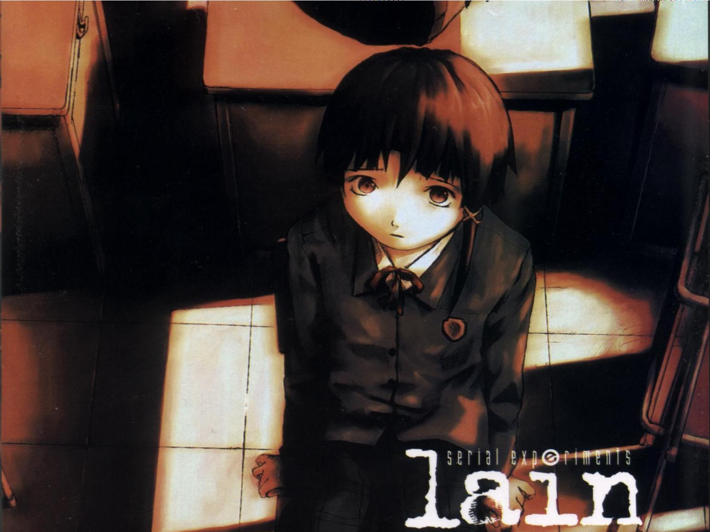
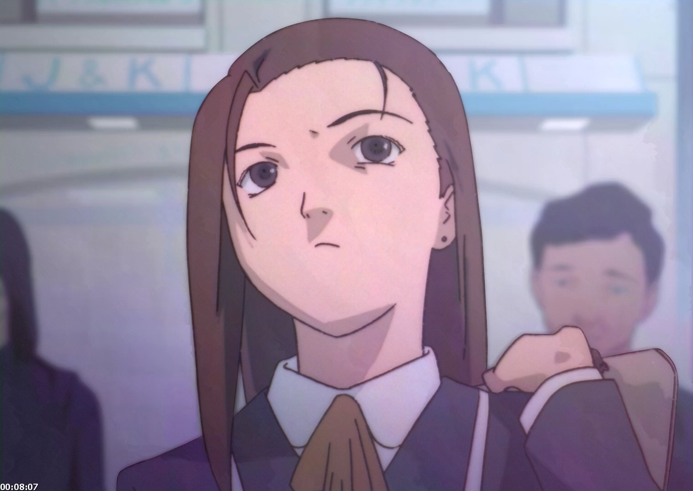
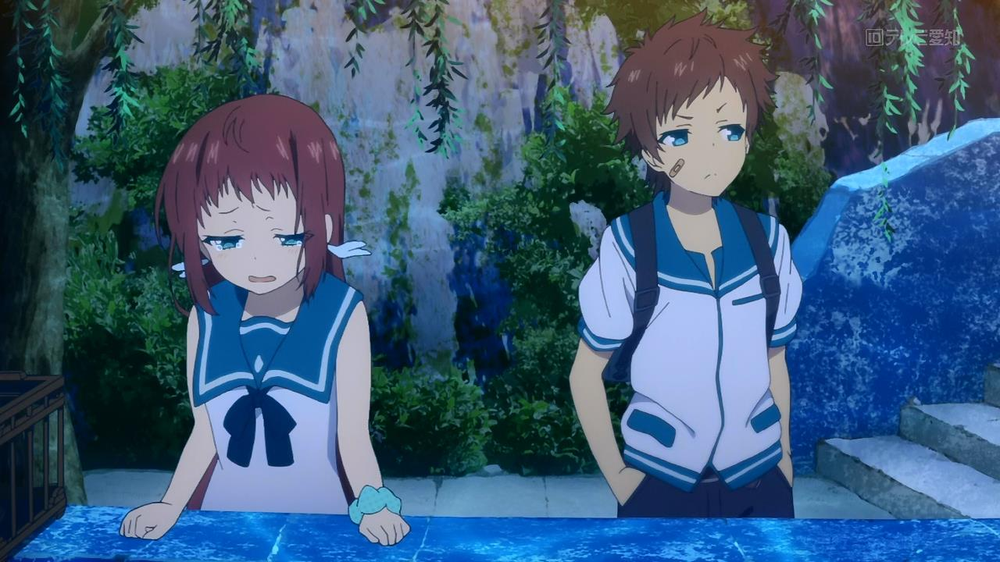
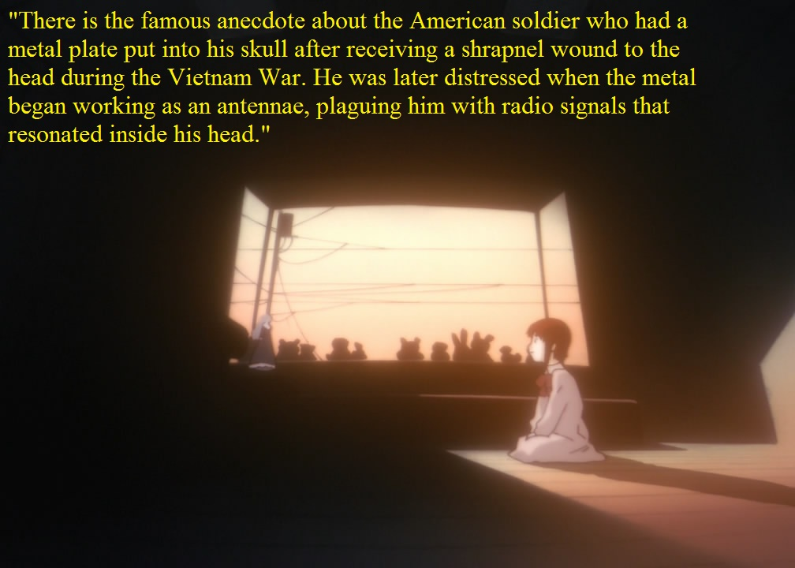
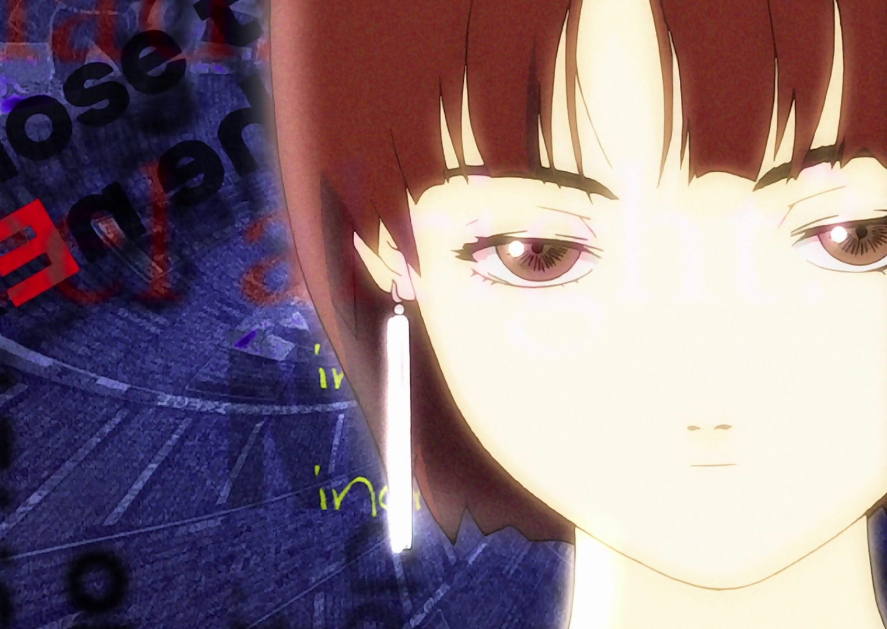
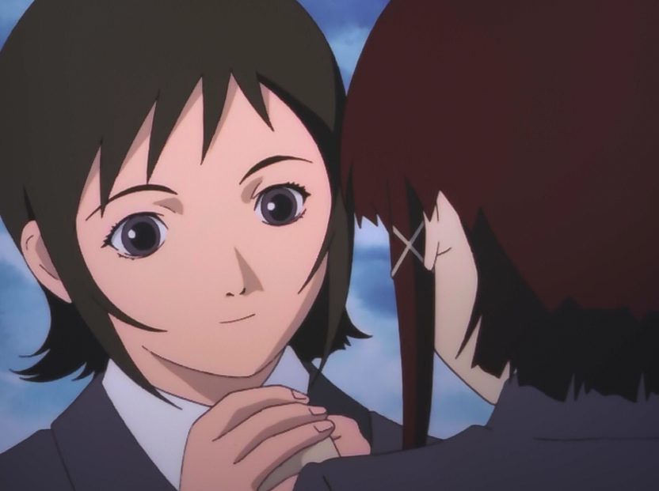
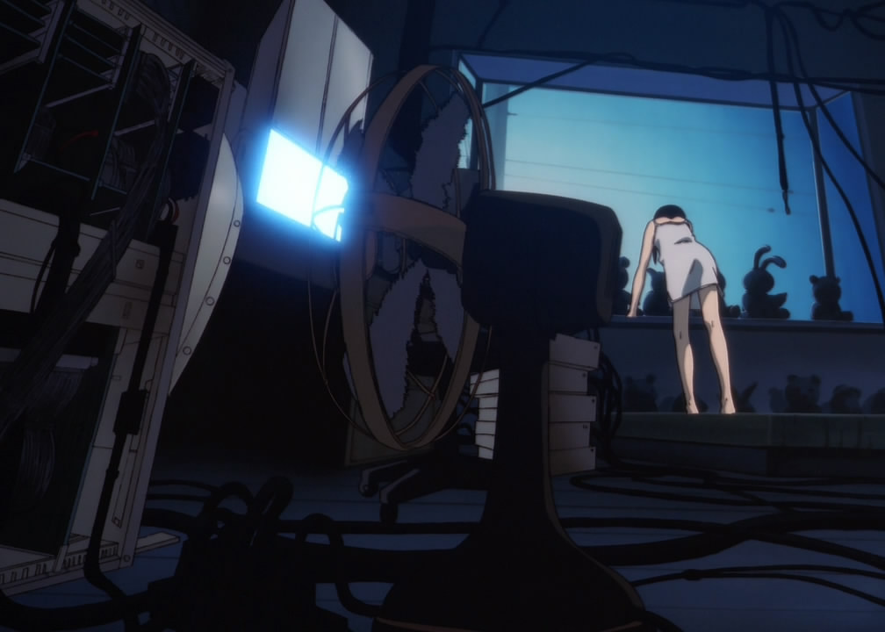

---
{
title: "Some Rambling about Serial Experiments Lain",
tags: ["Rockmandash Rambles", "TAY-Classic", "Serial Experiments Lain", "Lain", "expiramental", "90's", "Anime", "Ani-TAY"],
authors: ['reikaze'],
published: '2014-11-25T16:39:00-05:00',
attached: [],
license: 'cc-by-4',
oldArticle: true
}
---

There are 2 things that I can tell you about Lain that I have a concrete opinion on: I
  like it, and you should watch it. I don't think that I can objectively watch <em>Serial Experiments Lain</em>, and
  making a review of Lain is something that I find absurd and completely out of the table. I just can't do it... and I'm
  astonished that people can create concrete opinions with this show.... so I'm going to ramble on about my thoughts on
  <em>Serial Experiments Lain</em>. This article is going to be the most rambly of rambles, with no cohesion at all. I
  apologize for the messiness of it, and I'd like to hear your thoughts on it and the series.

<em>Lain</em> is an
  experience. Like<em> Evangelion</em>, Lain is a show that you should watch to experience it, as it's an interesting
  experience that everyone will get something out of. (Don't be wimpy like me and keep on pushing it back because you
  are afraid that it's too much of a mindfuck). I didn't think it was that much of a mindfuck (<a class="sc-1out364-0 hMndXN sc-145m8ut-0 gIacKn js_link" data-ga='[["Embedded Url","External link","https://rockmandash12.kinja.com/rockmandash-reviews-i-o-visual-novel-1563212529",{"metric25":1}]]' href="https://rockmandash12.kinja.com/rockmandash-reviews-i-o-visual-novel-1563212529" rel="noopener noreferrer" target="_blank">after I/O, nothing's a mindfuck. That being said, I/O is pretty similar to lain, so if you like lain, check I/O out</a>)
  Lain is such a vague experience that everything is up to one's interpretation. It's so surreal, so philosophical, that
  one's viewpoints, analysis ability and state of mind drastically shape the experience and opinions that they have on
  the themes that this show runs through. It's one that everyone may not appreciate, but should give a chance. Maybe
  you'll love it like other people I've seen. Maybe you'll like it but not love it like I did, or maybe you'll dislike
  it. Who knows? The show leaves it up to you, and that's something I'm going to respect.

<aside class="sc-1rh3ayr-6 jfFNjl inset--story branded-item branded-item--kinja" data-commerce-source="inset">

<a class="sc-1out364-0 hMndXN js_link" data-ga='[["Permalink page click","Permalink page click - inset headline"]]' href="https://rockmandash12.kinja.com/rockmandash-reviews-i-o-visual-novel-1563212529" rel="noopener noreferrer" target="_blank"><h6 class="sc-1rh3ayr-3 jRIPES">
    Rockmandash Reviews: <i>I/O</i> [Visual Novel]</h6></a>

 Ever 17 is a fantastic visual novel written by Kotaro Uchikoshi and Takumi Nakazawa.
      While…
<a class="sc-1out364-0 hMndXN sc-1rh3ayr-0 kOvmIi js_readmore inset--story__readmore js_link" data-ga='[["Permalink page click","Permalink page click - inset read more link"]]' href="https://rockmandash12.kinja.com/rockmandash-reviews-i-o-visual-novel-1563212529" rel="noopener noreferrer" target="_blank">Read more</a>

</aside>

This show is a show that I enjoy, and it made my think about shows like this....
  I miss shows like this where the creator can do whatever they want to without compromising on their ideals, or goals
  with the show. With the way anime is, focused on what sells well instead of what's interesting or good, we'll never
  get a show like this. Today, while we do get a lot of great anime (<a class="sc-1out364-0 hMndXN sc-145m8ut-0 gIacKn js_link" data-ga='[["Embedded Url","External link","https://anitay.kinja.com/this-is-one-of-the-best-eras-of-anime-stop-saying-it-s-1607791047",{"metric25":1}]]' href="https://anitay.kinja.com/this-is-one-of-the-best-eras-of-anime-stop-saying-it-s-1607791047" rel="noopener noreferrer" target="_blank">and I'll argue all day that this time in anime is pretty awesome</a>), but one
  aspect I've noticed is that shows now are too afraid to embrace it's ideals, to go the full way out. They are too
  afraid to be bold, to try something really out there. Producers, animation studios, etc are playing it safe: they
  don't want to do experimental things (similar to the gaming industry, but not as bad...). The practice makes sense, as
  making anime is expensive, and the investors want a return on the investments they make, but this compromises on the
  experience on a show. We don't see a lot of these surreal shows like this nowadays... we don't see many shows that run
  on philosophical ideals, or shows so surreal and doesn't give a fuck about what the audience thinks about it. (but
  they do exist: F/Z is nihilism in a nutshell, Kaiba questions what a person is, Psycho Pass looks at a system
  controlled by computers and what that entails to the psyche and the beliefs of society)

<aside class="sc-1rh3ayr-6 jfFNjl inset--story branded-item branded-item--kinja" data-commerce-source="inset">

<a class="sc-1out364-0 hMndXN js_link" data-ga='[["Permalink page click","Permalink page click - inset headline"]]' href="https://anitay.kinja.com/this-is-one-of-the-best-eras-of-anime-stop-saying-it-s-1607791047" rel="noopener noreferrer" target="_blank"><h6 class="sc-1rh3ayr-3 jRIPES">This is
    One of the Best Eras of Anime, Stop Saying It Sucks</h6></a>

      Today I came across a peculiar number of people touting the usual opinions that "anime is dead",…
<a class="sc-1out364-0 hMndXN sc-1rh3ayr-0 kOvmIi js_readmore inset--story__readmore js_link" data-ga='[["Permalink page click","Permalink page click - inset read more link"]]' href="https://anitay.kinja.com/this-is-one-of-the-best-eras-of-anime-stop-saying-it-s-1607791047" rel="noopener noreferrer" target="_blank">Read more</a>

</aside>
The atmosphere is something to be mentioned: A mix between outdated technology and
  hyper-advanced tech creates this half cyberpunk, half 90's world that is weird yet charming. The world this creates is
  one of the better near cyberpunks out there, and it's very enjoyable. (I personally think I/O's is a bit more
  enjoyable and it's future proofed a bit more) <em>Lain</em> was made to be inherently dated, but the dated nature
  doesn't detract from the show.<em> Lain</em> shows us how far we've gone since the 90s; while the tech shown is
  horribly outdated (with the exception of the Mind interface where one dives into the net), but the ideals are not
  outdated and that's the most important part.

<em>Lain</em> is a work of art, and it doesn't explain itself. It's a cyberpunk
  mystery that does what it wants to do, without the influence of anyone else. It doesn't care if you don't know what it
  wants it to do, it'll just continue to do what it wants to do. It's set out to get it's ideals out, and it does so in
  a sporadic way. Normally themes are themes, left to be found by analysis. In<em> Serial Experiments Lain</em>, trippy
  themes are central to the story. Personally, I was never really confused by <em>Lain</em>. It has a simple and
  understandable method of storytelling which keeps this complex show from flying over the viewer's heads, via
  straightforward plot progression. Almost everything about the show flows from one scene to another. Also, the fact we
  follow IRL Lain throughout <em>Serial Experiments Lain</em> is a blessing, as we can get the story from a slightly
  understandable way, due to the way that the story is explained to us and by the endless confusion she has. Also, I
  love how information dense it is: it really feels like you are getting a lot more out of your 20 minutes than usual.

The mystery is one of Lain's strong points. Nothing is clearly defined, and
  everything is left ambiguous. As you watch through the show, you really don't have a clue of who these people are, or
  what it is trying to do. It keeps all these things relevant, while leaving everything up to your interpretation. It's
  a feeling of mystery that is superb, and it really nails it, unlike so many shows out there. It's the type of mystery
  that gets you thinking, asking you questions, which is what every mystery should strive for. Just some of the
  questions I was thinking about while watching this show is:

<ul class="sc-1lmbno3-0 dpuHif" data-style="Bullet" data-type="List">
<li>What is this world like, what is happening?</li>
<li>Who and what are the voices?</li>
<li>What truly is the wired?</li>
<li>Who is Lain, and which lain is the real lain?</li>
<li>Who is the God? Is the other lain a god? What is a god?</li>
<li>What is real and what's fake? Or what's digital and what's reality?</li>
<li>How does the net influence a person?</li>
<li>How different can personalities be online in comparison to in real life?</li>
</ul>

All of these add up to create a surreal experience, and surrealism is probably the
  best way to describe Lain. It's a show that is up to your interpretation, and to me, that's one of the big themes of
  the show: one only exists via those who perceive it. this matches up with my ideals that something is only accepted as
  the truth when a one accepts it as the truth, and objective facts are only the truth when society/humanity accepts it
  as the truth. Lain is an existence greater than herself, with more than one Lain, and a large influence that a little
  girl would never have.

We follow one Lain, the Lain of IRL, and until the middle of
  the show, the Lains are two distinct characters, completely opposite. Lain of web and Lain of IRL are very different
  and what Lain of the web does is out of this world. so the question is, who is Lain? I can't really answer that for
  you, it's up to you to come up with your own interpretation about it.

That being said, there are parts I do have opinions on, and I'd like to talk about them.
  (not concrete thoughts on the show, but my own personal opinions that are my bias thus I decided not to do a review of
  this.)

First, the visuals: It has that 90's look and feel to it, and it's definitely dated.
  It's not amazing, but it does the job, with only the faces bothering me. I think it compliments the show in a way, but
  it could have been done better... but that's just me nitpicking, really.

<iframe allow="accelerometer; autoplay; clipboard-write; encrypted-media; gyroscope; picture-in-picture" allowfullscreen="" frameborder="0" height="315" src="https://www.youtube.com/embed/t9CXmEUwvgM" width="560"></iframe>

Next, the music. I LOVVVEEE the music in <em>Lain</em>. Hell, the music is what finally got
  me to watch the show. English that isn't utter rubbish? Voice acting that's very solid in general which helps to make
  up for the art? The soothing, calming and atmospheric tracks that set the mood for the show perfectly? AND THAT OP?
  Sooo goood. Just listen to some, and I hope you enjoy them.

Also, The shot composition surprised me. Anime doesn't typically care about it, and
  lain has some really good shot composition. Actual framing, not some cobbled together scene composition that doesn't
  help the story at all. The way scenes are shown help the show. What they show and don't show serves a purpose, and use
  of scenes to convey info is a technique not typically used in anime, and I really hope it is used a bit more.

Last but not least, my enjoyment of the show: I was never hooked with <em>Lain</em>.
  There are elements that hooked me, but the main story and the show itself, not so much. I never felt anticipated for
  the next episode. It's so calm and serene... it doesn't build tension, or really attempt to, to my dismay. I enjoyed
  quite a bit, but to get me hooked is the difference between good and amazing to me. To me, Lain is a work of art,
  nothing more, nothing less... and that's not necessarily a bad thing. I respect <em>Lain</em>, I like <em>Lain</em>,
  and I think It's a good show, but i'm not attached to <em>Lain</em>.

