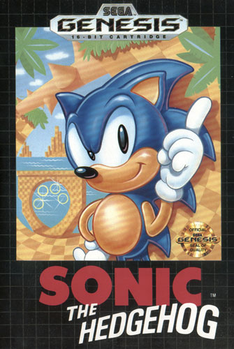
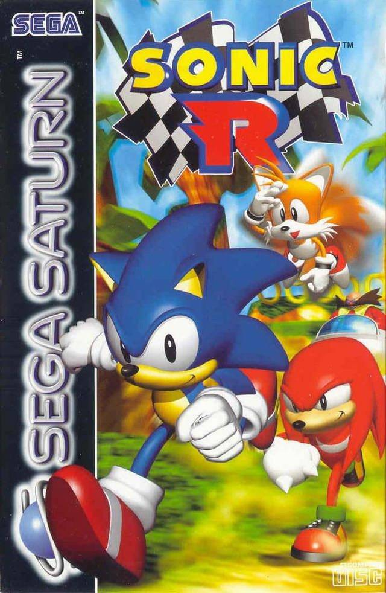
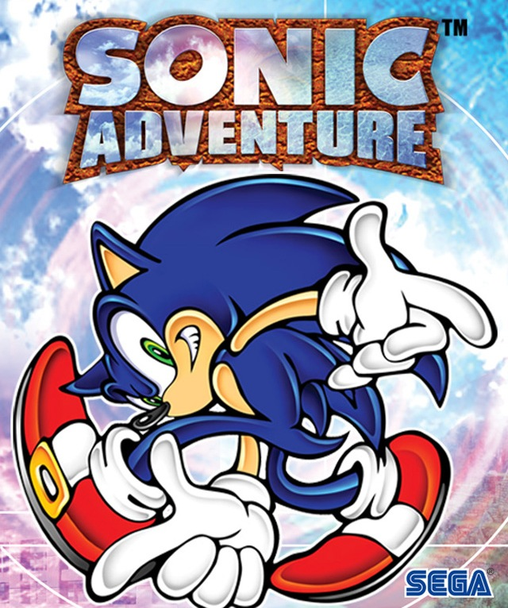
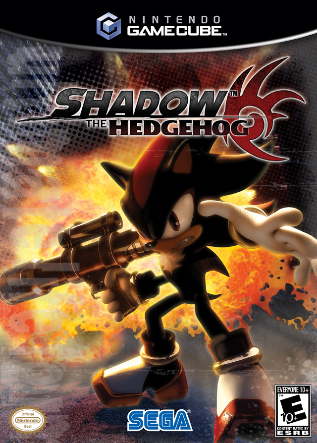
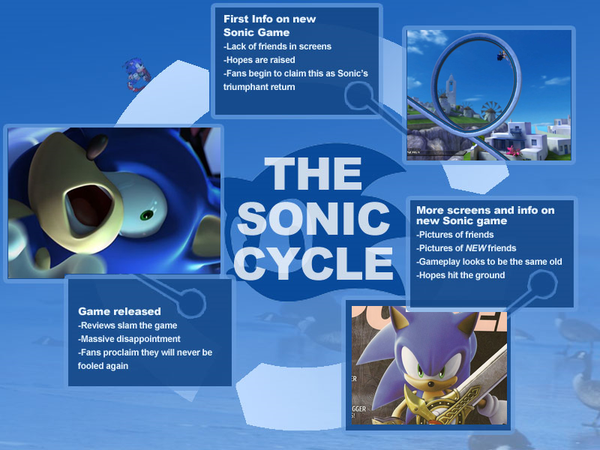
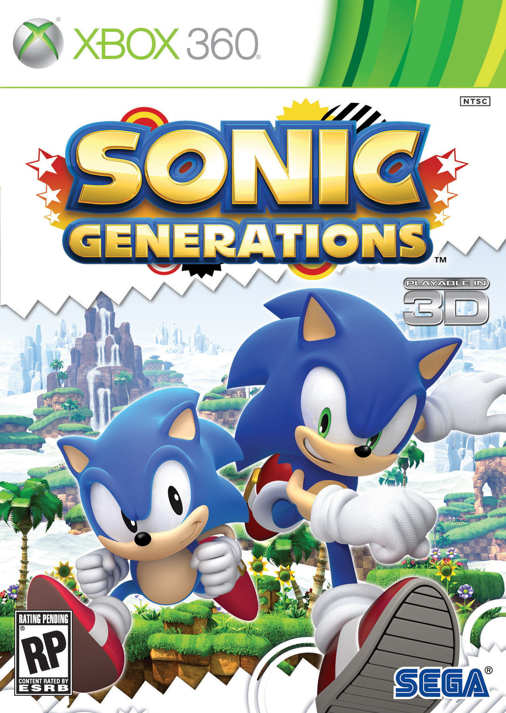
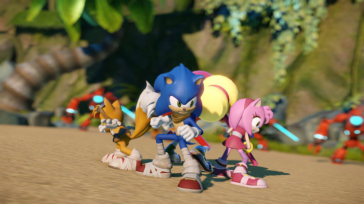

---
{
	title: "Sonic: Up's and Downs [Opinion]",
	published: "2014-02-07T02:42:00-05:00",
	tags: ["Sonic", "Sega", "Mario", "Sonic Boom", "Rockmandash12", "Opinion", "Up's", "Downs", "Tay-Classic", "tayclassic"],
	kinjaArticle: true
}
---

Welcome to Rockmandash Reviews! Today, I'm going to be talking about Sonic the Hedgehog, because of the announcement of Sonic Boom. As this reminded me of sonic games in the past, I thought I would go and talk about the Just a side warning, this is my opinion, and what I think about sonic.

I'm going to be looking at purely the games themselves…. not about the hype around it, or any media at the time of release.

## Up's: Classic Sonic

1990\. Sega needed a mascot for the Mega Drive to compete with Nintendo's Mario. What they made was an excellent platformer: Sonic the Hedgehog. With the creation of Sonic the Hedgehog, we got what's known as "Classic Sonic", with Sonic 1, Sonic CD, Sonic 2, and Sonic 3 & Knuckles.

#### Why this is great

We got a fast and fun platformer, with a huge world to explore that was fairly linear. What I mean by that is that the levels were huge and you can explore all you want, but the game structure was linear. This let the player play however they wanted: Extremely fast, or at a nice brisk pace. They nailed the control and physics in a 2D plane, and the games had great level design.

#### Vs Mario

Quality-wise, Sonic games were up to par, and even debatably better than the mario counterparts. They were neck to neck, and they were awesome.

## Downs: Saturn Sonic

After Sonic 3\&K, Sonic disappeared off of the face of the planet, and we didn't get anything for a while, other than spinoffs

#### Why this sucks

…. no games. Just spinoffs. None of them were any good, and after the massive popularity of sonic 3, you would think they would make some High Quality Saturn 2D sonic, but we didn't get that. Sonic X-Treme looked promising, but it was probably going to be meh.

#### Vs Mario

Nothing Vs Mario 64? Of course Mario was destroying sonic at the time. Mario 64 is debatably one of the best Mario games ever, and it revolutionized gaming.

## Up's: Dreamcast Sonic

1999\. The launch of the Dreamcast. Sonic was back with Sonic Adventure. In full 3-D, it was fast and fun. Sonic got a redesign, and it was a lot of fun. Some can debate this was the point of no return for sonic, but as someone who played the dreamcast sonic games to death, I'd have to disagree.

#### Why this is great

With the Sonic Adventure, they got a great feeling of control with sonic in a 3-D world. Especially in SA2, sonic felt great to control, and the levels were fast. The Level designs split the aspects of older sonics, which was mixed, but I enjoyed them. SA2's personally my favorite sonic game, because of the control of sonic in the fully 3D world.

#### Vs Mario

Vs Sunshine? I'd say gameplay wise, they are pretty equal. They are both fun, but they have their flaws as we look back on them.

## Downs: Sonic's "Dark Ages"

After Sega left the console business, sonic got progressively worse. Heroes was fine, but then shadow the hedgehog (my least favorite of the series), Sonic 06, Sonic Black Knight, Sonic Riders… the list goes on and on about how many bad sonic games there were.

#### Why this sucks

They added gimmicks, the controls got sloppy, too serious for it's own good, and everything about this era sucked (except music). Sonic lost focus, and it got too buzy. I enjoyed quite a bit of these games, but they really were not very good. I mean, it gave birth to the dreaded sonic cycle, and that's just horrible.

#### VS Mario

Mario Stayed consistently good. Sonic Didn't. Nuff Said.

## Up's: Modern Sonic

Sonic Unleashed. A great game plagued with a bad idea. True to form, this game refocused sonic. Sonic was the only playable charecter, The games were fast as all hell, and the games looked great. Sonic Unleashed, Sonic Colors, Sonic 4 episode 2 and Sonic Generations are games I consider Modern Sonic.

Why this is great Like how classic sonic captured control in 2D and Dreamcast sonic captured control in 3D, Modern Sonic captured the speed of sonic, while slowly adding both great control in 2D and great control in 3D. It was focused, high Octane Sonic, and it was amazing. Modern Sonic was a return to form.

#### Vs Mario

This is where the Vs Mario debate gets interesting. It seems like Modern sonic was being itself with Unleashed and Generations, but you can see how modern sonic was trying to be Mario. Colors was very similar to galaxy in quality, world and story telling. I'd say the sonic games were better, but that's my opinion.

## Downs: Post Generations

After releasing one of the most critically acclaimed sonic games, what does Sega do? SCREW IT ALL UP. A new generation of gaming means new possibilities, and they botched that with lost worlds, which frustrated gamers with piss poor level design, and a slower sonic. Sonic boom was just announced, and with sonic boom, comes a new redesign and a cartoon. Many people are still getting their thoughts out, but I've never seen a sonic game I've disliked so much.

## Why this sucks

They are changing their intended audience… instead of focusing on everybody, they are narrowing their audience to just kids. With that, they are forgetting what made modern sonic great: Focus. The new sonic games have no focus at all, and are just trying to appeal to kids. They don't want people like me to play their games anymore… which is disappointing. I love sonic, but if Sega doesn't want me to buy their game, I won't. Like they don't want me to play VC3, and Yakuza... this is the same.

#### Vs Mario

**GET YOUR MARIO OUT OF MY SONIC.** Critically, Mario 3D World did much better than Lost Worlds, but you can see Nintendo influence trickling into sonic. Personally, I believe that all that Nintendo influence has been ruining the quality of sonic games, lost worlds even had Nintendo help develop yet it still sucked. (not that I dislike Nintendo or anything, it's just that they have no place in Sega.) Sonic Team isn't a horrible dev, you saw what they did with colors and generations. They just need focus, and less gimmicks. With Nintendo trying to back them up… that's not going to happen. With western influence, that's not going to happen. Sonic Boom will be a bad game. It looks bad, and probably will play bad. They got rid of one of the greatest perks sonic had in recent years, the hedgehog engine which made sonic games look just as nice as the cut scenes, and they are getting rid of the game play I love. We are entering into a new age for sonic, and looking at the past, it's probably going to be a dark one.
