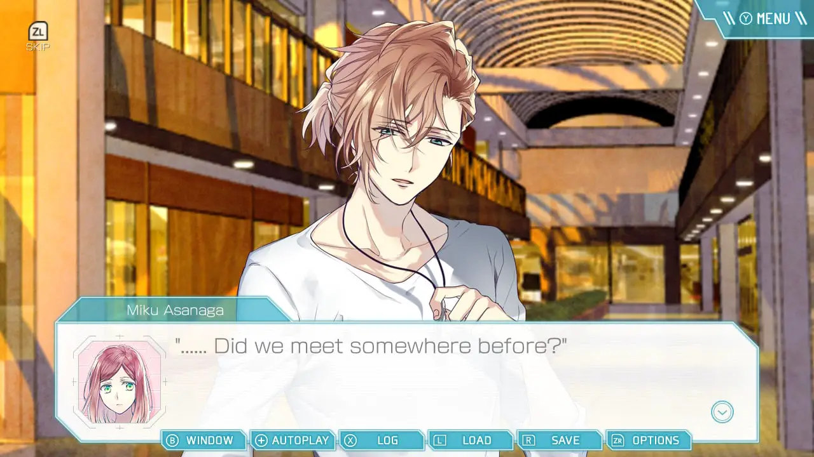
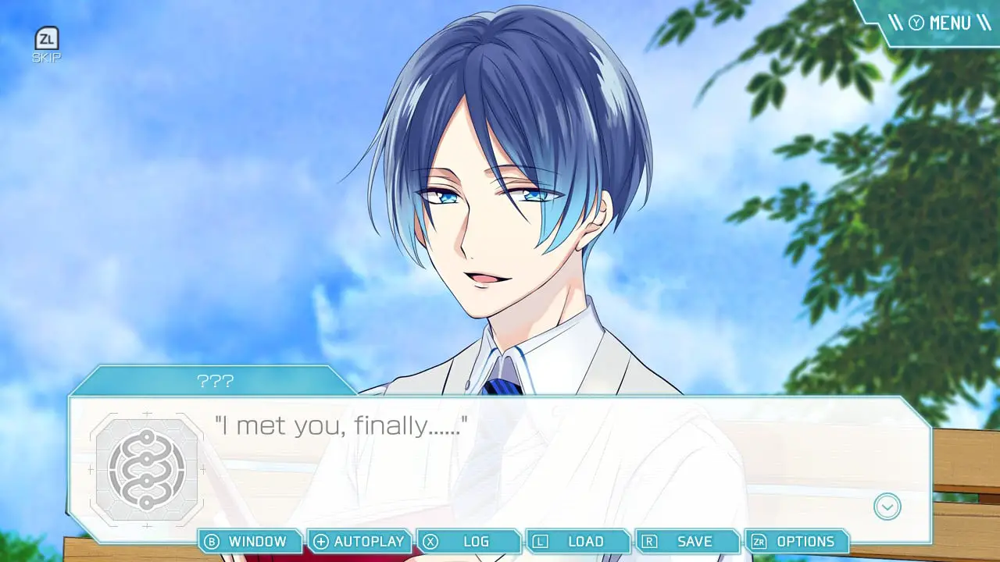

---
{
  title: "Spiral Memoria: The Summer I Meet Myself Review – Like a Forgettable Date",
  published: "2020-08-17T09:42:45-07:00",
  ogLink: "https://noisypixel.net/spiral-memoria-review-switch/",
}
---

Otome visual novel typically hit on a few recognizable beats. You have your Japanese setting, innocent heroine, and a group of hot boys coming to shake up your life. Sadly, the OperaHouse-developed Spiral Memoria ends up taking this general description and creating an entire game surrounding it.  Spiral Memoria hits the beats of a standard Otome but never does anything more than expected while stumbling in other elements in the process.

[Spiral Memoria: The Summer I Meet Myself Review - Noisy Pixel](https://www.youtube.com/embed/9ngWX5BvxYc?feature=oembed)

_Spiral Memoria_ is inherently about memory. Our main heroine Miku is an amnesiac girl who is tasked with finding her memories and figuring out her situation through the narrative, which also leads her through four romance routes. The game’s amnesic story and the circumstance surrounding the main character are interesting, but I couldn’t get past just how generic the setup is.

It doesn’t stop at an amnesiac lead either, character interactions and various plot points seem to be pulled from the basic foundation of the genre. The more significant issue is that there’s a good story here somewhere, but the lack of character growth makes it incredibly hard to totally invest yourself.

Three tragic flaws hurt _Spiral Memoria_ the most. First is the main character, Miku. She’s effectively a self-insert, and that’s frustrating because it makes her incredibly bland. The problem with her being an amnesic is that she’s a blank slate and without a personality. Through poor execution, this ends up making the chemistry with most of the lead characters come across as forced for the sake of romance.

The second flaw is that all of the routes are about the same scenario, just from different perspectives. The same events happen regardless of what route you play. This means once you’ve played one, you’re retreading the same story beats in the rest. Effectively, this makes every route feel like a common route and makes it tough to get through additional playthroughs.

Lastly, the game’s length in relation to its depth. _Spiral Memoria_ is incredibly short, and as a result, it never can adequately build up. There are no real relationships; the characters never go beyond the archetypes that they are cast because there’s simply no time to develop them. This can be seen as a positive as the game doesn’t overstay its welcome, but come on, we’re trying to fall in love here.

When it comes to specific routes, the whole game boils down to a choice made in the beginning, meaning you’re predestined for that character, breaking the typical “Meet the boys before you date them” exposition. This choice undermines an interesting plot twist that appears in about the middle of the game, but it doesn’t do much with it, so the twist is just set dressing that gets old by your second playthrough.

As for the main boys, Sosuke Okouchi is entirely forgettable. There’s so little substance in the first route that they’re like, “Remember the two events in the game” when they happened like 15 minutes ago at the most. The second route with Hayato Minakata is better, as he has more of a personality, and the themes include family instead of straight relationships. It’s not that special, but with this game, you take what you can get.

One would expect the doctor Kazuma Yukawa’s route to have more interesting content, but the elements of the story are once again not fleshed. My biggest gripe with this route is that it starts incredibly slow, which makes it tough to believe in their relationship. Still, he’s likable and appealing as the route plays with the older gentleman dynamic.

The last route with Rin Okazaki is honestly the only one that has actual chemistry and the only time in which the story isn’t focused entirely on Miku. They actually take time to develop the romance, and Miku gets the chance to help someone else instead of just receiving help and being a damsel in distress. So out of the four routes, this was my favorite, but it’s still pretty standard.

How much one’s enjoyment of the game is determined by the amount in which one goes to otomes for wish fulfillment – if you play otomes for the story, you’ll probably be disappointed. Still, if you play to engage with a romantic experience, these might be enough.

When it comes to presentation, Spiral Memoria has some pretty good character illustrations, and the CGs really sell the romance. Sadly, the backgrounds don’t share this same quality as they are this strange low-res watercolor-like mess. It’s incredibly jarring and doesn’t do anything for the game appeal. The music is just generic and bland, with only one stand out track that I can think of.

_Spiral Memoria_ manages to be a competent otome game, doing everything that is expected from the genre, but in the process fails to make a distinctive experience, leaving the game entirely forgettable. The story is generic, the structure is inherently flawed, and the presentation is average. If you’re simply looking to have pretty boys romance you, then you may be okay with what this game offers, but the premise seems to be pulled right out of a standard list of what makes an otome game.
