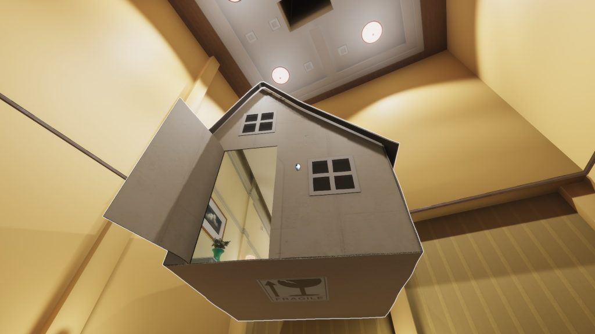
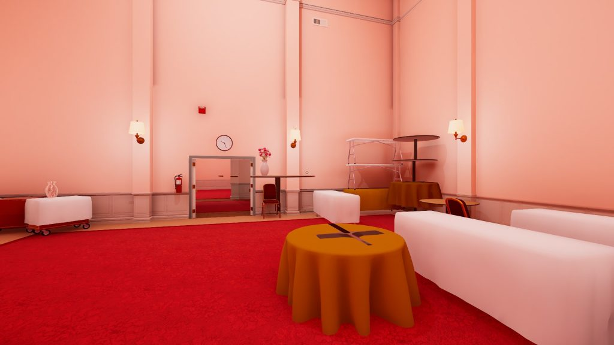
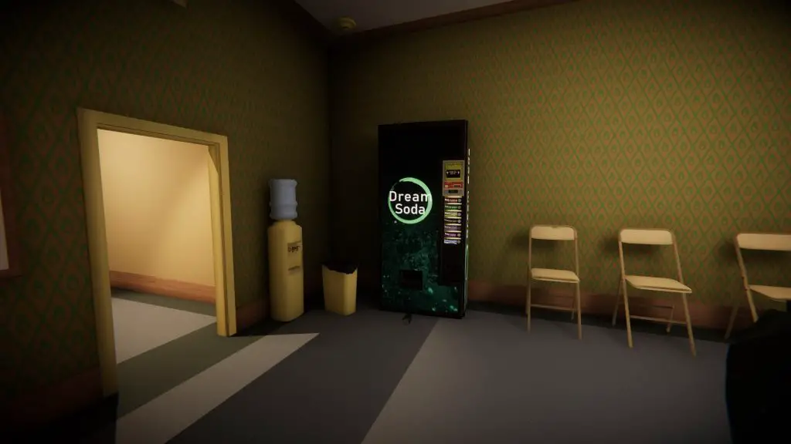
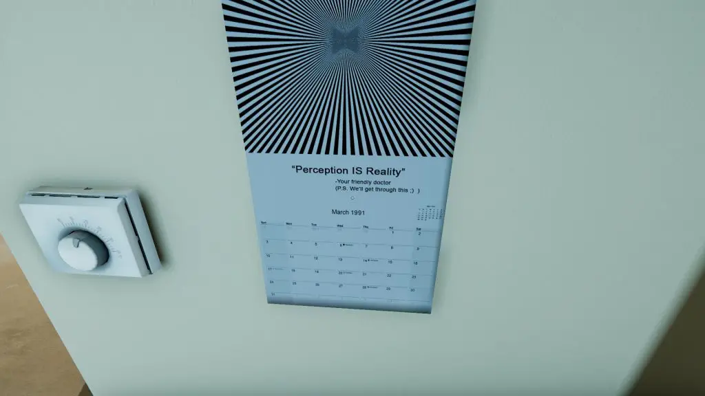

---
{
  title: "Superliminal Review – Cool Perspective But Missing Substance",
  published: "2020-11-25T11:46:33-08:00",
  ogLink: "https://noisypixel.net/superliminal-review-pc-ps4-xbox-one-switch/",
}
---

We often take our perspective for granted as we assume the way things appear is the way they have to be. Sometimes, a change in perspective might be just what you need, but other times, it might not do anything at all. _Superliminal_ is a game that aims to bend one’s perspective to create a unique experience and while it leads to a meaningful gameplay difference, the overall experience isn’t anything too memorable in practice.

<!-- ezoic_video_placeholder-under_first_paragraph-640x360-999998-clearholder -->

<!-- ezoic_video_placeholder-under_first_paragraph-640x360-999998-nonexxxclearxxxblock -->

<!-- ezoic_video_placeholder-under_first_paragraph-426x240-999998-clearholder -->

<!-- ezoic_video_placeholder-under_first_paragraph-426x240-999998-nonexxxclearxxxblock -->

<!-- ezoic_video_placeholder-under_first_paragraph-384x216-999998-clearholder -->

<!-- ezoic_video_placeholder-under_first_paragraph-384x216-999998-nonexxxclearxxxblock -->

[Superliminal Review - Noisy Pixel](https://www.youtube.com/embed/Odw9BPzIQ3Y?feature=oembed)

_Superliminal_ is all about perspective, and the way it plays with this theme is the selling point. During gameplay, you can manipulate specific objects, and when you interact with them, the objects’ size becomes fixed to how it appears on your screen, and when you place them the physical size changes. So, if you pick up a chess piece, you can make it larger by putting it far away from you or smaller by placing it nearby.

<!-- ezoic_video_placeholder-under_second_paragraph-640x360-999997-clearholder -->

<!-- ezoic_video_placeholder-under_second_paragraph-640x360-999997-nonexxxclearxxxblock -->

<!-- ezoic_video_placeholder-under_second_paragraph-426x240-999997-clearholder -->

<!-- ezoic_video_placeholder-under_second_paragraph-426x240-999997-nonexxxclearxxxblock -->

<!-- ezoic_video_placeholder-under_second_paragraph-384x216-999997-clearholder -->

<!-- ezoic_video_placeholder-under_second_paragraph-384x216-999997-nonexxxclearxxxblock -->

*Superliminal *uses this idea of perspective throughout its puzzle gameplay and can feel quite rewarding when it all comes together. Resizing an object to knock down walls or making a ramp out of signs are just some of the cool ways to progress. I was amazed by how the developer utilized their understanding of perspective to create these unique puzzle layouts.

That said, the experience of playing through the puzzles tends to overstay its welcome as the solutions never change. The core gameplay of resizing objects means you’ll run back and forth in a room or drop items and catch them to get the size you want, which becomes rather dull.

Another issue is that too much of the gameplay ends up being trial and error as you attempt to find the item you can manipulate because they are not clearly marked. If items were a specific color or had some distinguishing element instead of your cursor just turning into a hand, the experience would be much more pleasant.

<!-- ezoic_video_placeholder-mid_content-640x360-999996-clearholder -->

<!-- ezoic_video_placeholder-mid_content-640x360-999996-nonexxxclearxxxblock -->

<!-- ezoic_video_placeholder-mid_content-426x240-999996-clearholder -->

<!-- ezoic_video_placeholder-mid_content-426x240-999996-nonexxxclearxxxblock -->

<!-- ezoic_video_placeholder-mid_content-384x216-999996-clearholder -->

<!-- ezoic_video_placeholder-mid_content-384x216-999996-nonexxxclearxxxblock -->

\
_Superliminal’s_ been exclusive to the Epic Games Store since last year, but this updated release on Steam includes developer commentary and a Challenge mode. Challenge mode offers the same puzzles with arbitrary restrictions, and the developer commentary is what it says on the tin. These aren’t enough to justify the purchase if you’ve already played it but are a nice inclusion if you haven’t.

I should mention that the perspective tricks of *Superliminal *aren’t just gameplay-related. For example, some textures make hallways look like you’re walking to a dead end, but it’s actually the path forward. The visuals play with the concept of rasterization, which provided some of the more unique gameplay moments as the levels aim to trick you visually.

<!-- ezoic_video_placeholder-long_content-640x360-999995-clearholder -->

<!-- ezoic_video_placeholder-long_content-640x360-999995-nonexxxclearxxxblock -->

<!-- ezoic_video_placeholder-long_content-426x240-999995-clearholder -->

<!-- ezoic_video_placeholder-long_content-426x240-999995-nonexxxclearxxxblock -->

<!-- ezoic_video_placeholder-long_content-384x216-999995-clearholder -->

<!-- ezoic_video_placeholder-long_content-384x216-999995-nonexxxclearxxxblock -->

\
As pleasant and charming as the world of *Superliminal *can be, it comes off like a game created from a source engine. Still, the music is relaxing, and I’d definitely listen to it outside the game, but it’s mostly subdued to the point where it rarely calls attention to itself.

While _Superliminal_ forges its own path through its gameplay mechanics, its story doesn’t stand out in the slightest. The developers seemed to play with a sort of meta-narrative similar to games like Stanley Parable, but it’s not incredibly engaging or exciting. The message doesn’t really leave an impact, and the story bits are so spread out and disjointed that it fails to create a cohesive experience.

It doesn’t help that each level has a different tone. Jumping from a warm hotel to a dark horror-themed environment doesn’t make for a cohesive message, even if it provides an engaging atmosphere. The overarching message of _Superliminal_ didn’t resonate with me at all, and this is without mentioning the Achilles heel to the story – the short length, which is about 3 hours.

_Superliminal_ offers unique gameplay elements for a fun evening, but the experience won’t leave an impact. Its perspective features turn out to be more of a novelty or a practical tech demo than a way to create an engaging narrative. While that alone might make it worth giving a try if you’re looking for an interesting experience, the idea of _Superliminal_ works better on paper than in execution.

<!-- ezoic_video_placeholder-longer_content-640x360-999994-clearholder -->

<!-- ezoic_video_placeholder-longer_content-640x360-999994-nonexxxclearxxxblock -->

<!-- ezoic_video_placeholder-longer_content-426x240-999994-clearholder -->

<!-- ezoic_video_placeholder-longer_content-426x240-999994-nonexxxclearxxxblock -->

<!-- ezoic_video_placeholder-longer_content-384x216-999994-clearholder -->

<!-- ezoic_video_placeholder-longer_content-384x216-999994-nonexxxclearxxxblock -->
