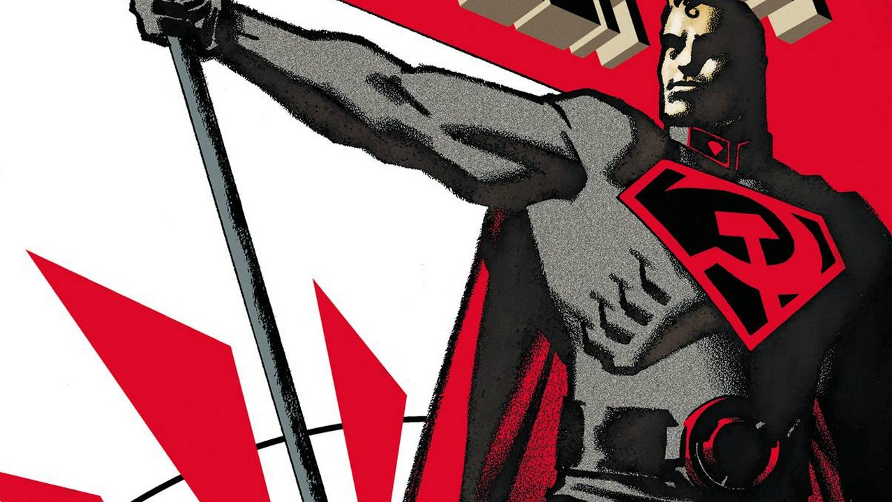
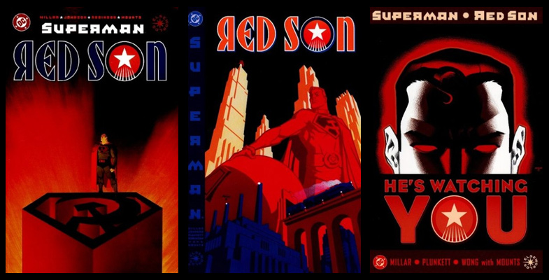
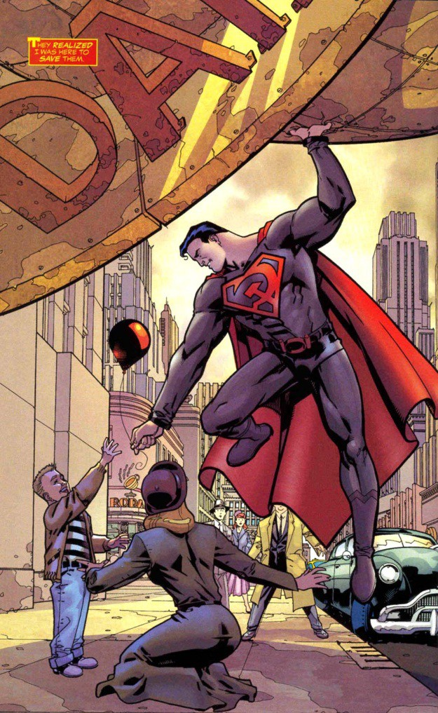
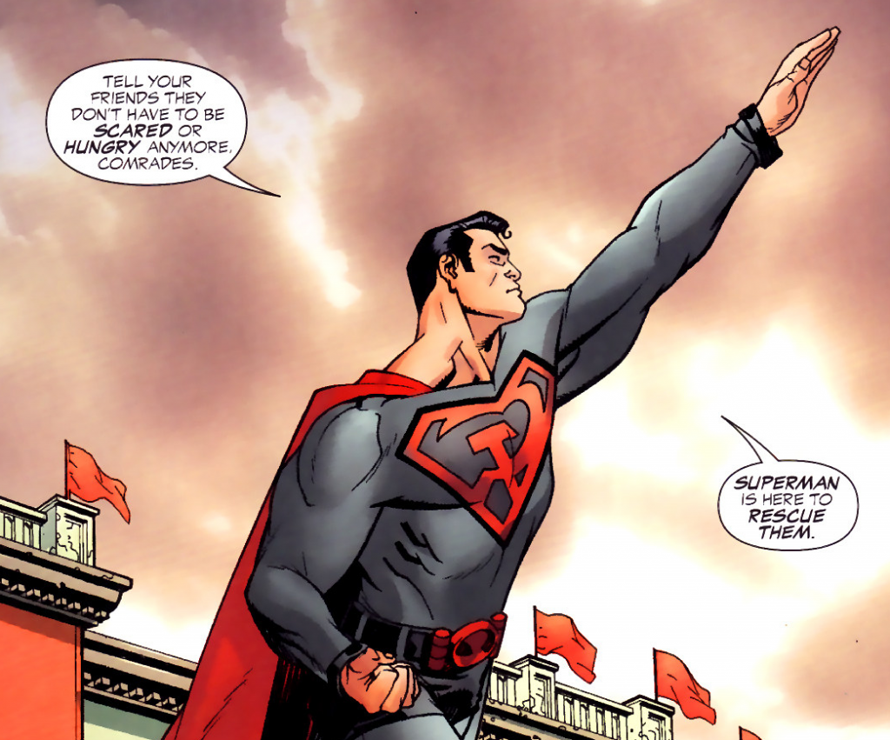

---
{
  title: "Superman: Red Son is A Fantastic Superman Story You'd Never Expect",
  tags:
    [
      "Superman Red Son",
      "Alternate History",
      "Superman",
      "Rockmandash Rambles",
      "TAY",
    ],
  published: "2016-02-22T01:25:01-05:00",
  attached: [],
  kinjaArticle: true,
}
---

We see so many stories pull twists on the tried and true, but rarely will you
  ever see a twist like this. In a twist of fate, Superman in <em>Red Son</em> becomes a Comrade of Order and
  Perfection, instead of the hero of freedom and justice, and this twist as great as you may think it is.

<em>Superman: Red Son </em>is a graphic novel released in 2004 (so yeah, not new
  in any way, sorry bout that) that is a twist of the classic tale of Superman: instead of crashing into the middle of
  Kansas, he crashes into a collective farm in Ukraine during the cold war, thus changing the entire outlook on his
  story. From Lex Luthor leading the United States while being not completely evil to our Comrade Superman standing
  right in step with the other Man of Steel (Stalin) with Batman serving as a rebel freedom fighter, this is a story
  that plays with it’s heroes and characters well, keeping the core of what they are the same while changing the
  complete dynamic of how they act to make it even more interesting and engaging. For an example, many core aspects of
  Superman is the same, everything he stands for and everything around him is totally flipped around. 

While its an interesting story about the the superhero that defined how we
perceive super heroes, the heroic aspects and feats (while still prevalent in the story) take a step back for the
political Alternate history aspect of the story to step forefront into the center of the stage. It’s a cold war story,
but it’s not your typical one: as even though Superman is a man in red, he is still who he is, and it takes a
different perspective on the tale of the cold war than most people here in the west would perceive it. It’s a tale
that takes no side, one that does not portray either in a moral light and instead spends time clashing the core of the
characters with the core of ideals in the era and questioning if either of the ideals or characters are truly right or
not, or which are the most compatible with what they were trying to achieve. It’s a well built world that anyone can
appreciate, and its one I rather enjoyed.

This is especially odd coming from me, as writing an Article about an american
  Graphic Novel is the last thing I would expect myself writing (and probably many of you if you’ve seen what I’ve
  written in the past, given that I focus primarily on Japanese Visual Novels). Even though I’m the type of person who
  rather dislikes the whole Superhero trend in moves and barely knows anything about the famous Man of Steel, <em>Superman
    Red Son </em>a work that I enjoyed thoroughly because of the different perspective it holds. I love history, and
  alternate history is up there as one of my favorite genres, showing us a different perspective on things while
  crafting worlds that go against what we know while still being well built and deeply fascinating, and this is what
  separates this work from what I usually talk about. Eastern works are almost all apolitical and while I respect that
  and appreciate that, it means that eastern works gloss over concepts that are worthwhile to check out, and western
  works do.

<em>Superman Red Son </em>is a short story that manages to be clever, creative,
  engaging and interesting, both relating to how they twist the characters themselves and how they deal with the world
  they created. This was an awesome read that I had a great time with (and so did many others), being one of the most
  unique twists with it’s alternate history while still maintaining a level of quality storytelling that many works that
  aim to change ultimately do not have. It’s a great work that I would check out if any of this interests you, you
  probably won’t be disapointed.

Also, while rushed, the ending’s pretty great as well,
  unlike the ending to this article. Go check it out! 

<em>You’re reading TAY, Kotaku’s community-run blog. TAY is
  written by and for Kotaku readers like you. We write about games, art, culture and everything in between. Want to
  write with us? Check out our tutorial </em><a class="sc-1out364-0 hMndXN sc-145m8ut-0 gIacKn js_link" data-ga='[["Embedded Url","Internal link","http://tay.kotaku.com/the-new-taytorial-1659855583",{"metric25":1}]]' href="http://tay.kotaku.com/the-new-taytorial-1659855583"><em>here</em></a><em>
  and join in. If you want to read more of my writing (even though it has nothing to do with this), check
  out </em><a class="sc-1out364-0 hMndXN sc-145m8ut-0 gIacKn js_link" data-ga='[["Embedded Url","External link","http://anitay.kinja.com/#_ga=1.93871646.241020698.1444271310",{"metric25":1}]]' href="http://anitay.kinja.com/#_ga=1.93871646.241020698.1444271310" rel="noopener noreferrer" target="_blank"><em>AniTAY</em></a><em>, </em><a class="sc-1out364-0 hMndXN sc-145m8ut-0 gIacKn js_link" data-ga='[["Embedded Url","External link","http://rockmandash12.kinja.com/",{"metric25":1}]]' href="http://rockmandash12.kinja.com/" rel="noopener noreferrer" target="_blank"><em>RockmanDash Reviews</em></a><em> and </em><a class="sc-1out364-0 hMndXN sc-145m8ut-0 gIacKn js_link" data-ga='[["Embedded Url","External link","http://kmtech.kinja.com/#_ga=1.52063530.247934920.1454126956",{"metric25":1}]]' href="http://kmtech.kinja.com/#_ga=1.52063530.247934920.1454126956" rel="noopener noreferrer" target="_blank"><em>KMTech</em></a><em>.</em>

