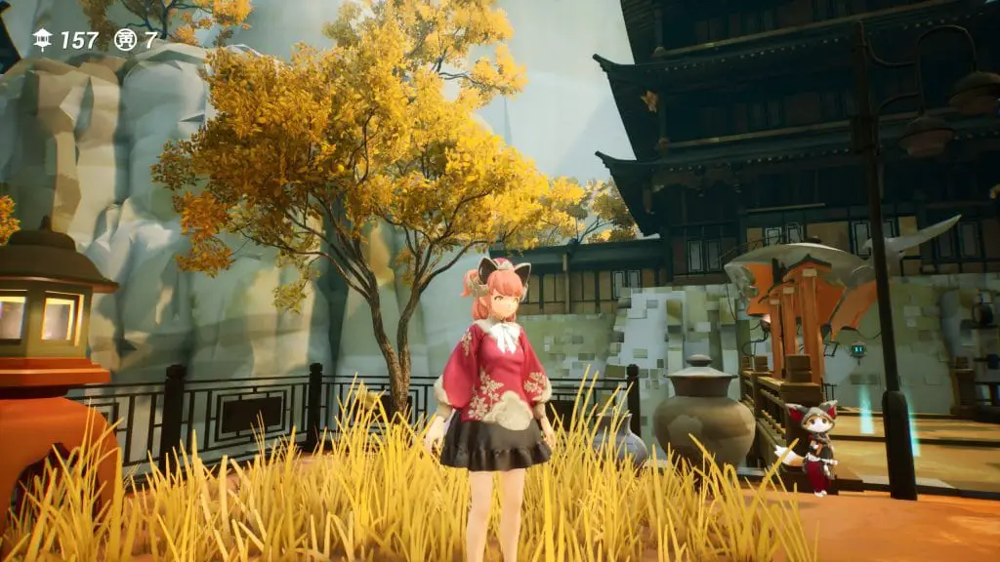
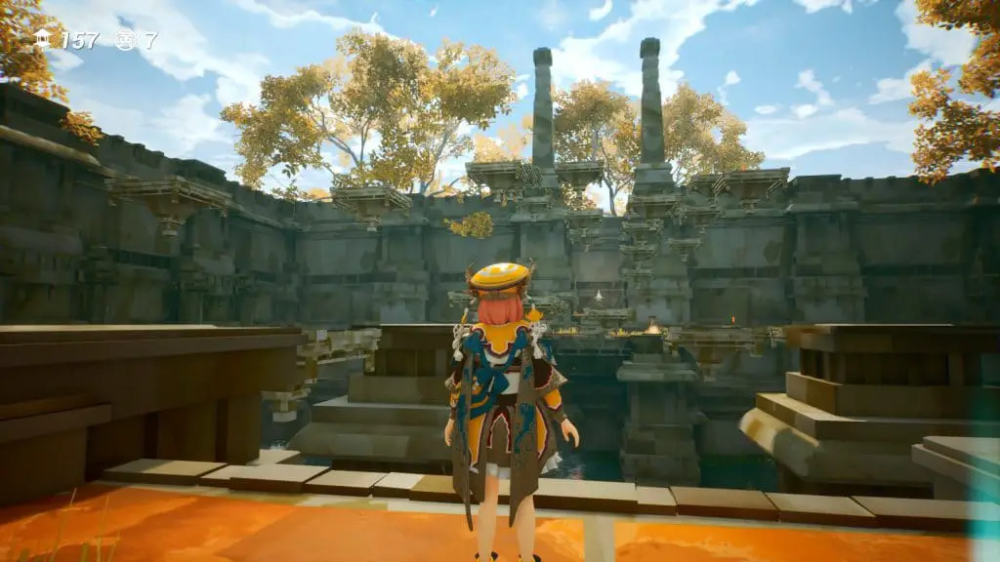
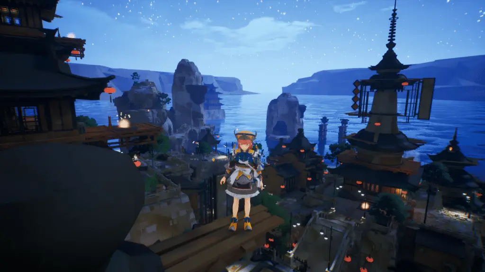
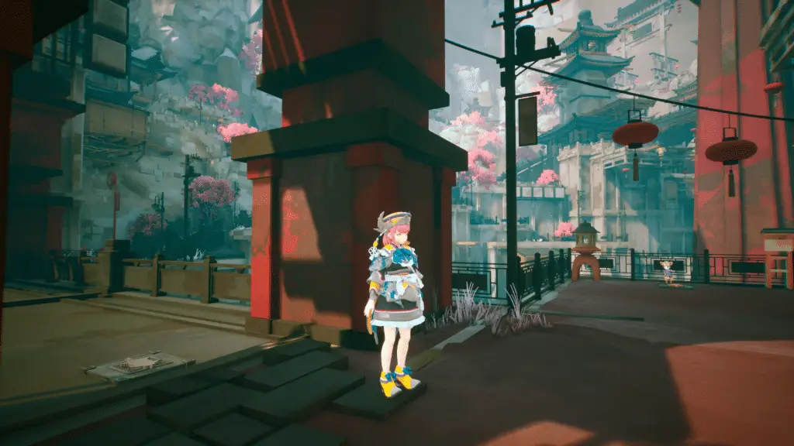
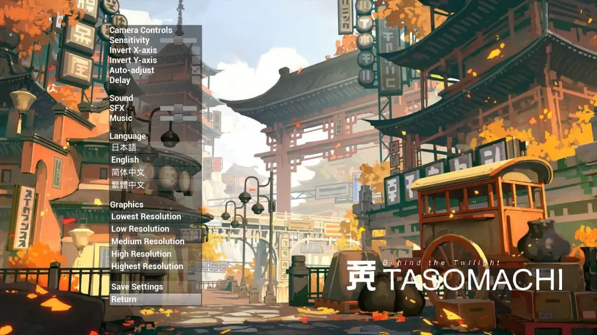

---
{
  title: "Tasomachi: Behind the Twilight Review – Not Ready for Prime Time",
  published: "2021-04-13T06:59:46-07:00",
  ogLink: "https://noisypixel.net/tasomachi-behind-the-twilight-review-pc/",
}
---

There was a time that the 3D Platformer genre appeared to be dead, but it feels like we’ve hit a bit of a Renaissance in recent years. The newest entry in the genre is _Tasomachi: Behind the Twilight_ – a charming adventure collectathon made by a single developer, nocras. This happens to be a truly beautiful game and succeeds in its goal of presenting this genre to the modern era, but it’s marred by technical issues, leaving me feeling like it isn’t ready for prime time.

[YouTube video player](https://www.youtube.com/embed/eAdyU0Hynj8)

_Tasomachi_’s visuals and its world immediately stand out. The art direction is striking, and the environments are incredibly unique. The levels are inspired by East Asian architecture and are visually stunning, especially at night. The general layout makes them fun to explore, which is the most appealing part of these games.

The character designs complement this presentation, but it’s just a shame that the only real characters are the protagonist and cats. To add to that, the music is well-orchestrated, from composer ujico, and the soundtrack does an exceedingly good job at setting the atmosphere of the area you’re in, offering the perfect mood as you progress through the levels. The only problem is that there aren’t a lot of tracks, and I was wishing for more variety about halfway through the game.

As for the gameplay, _Tasomachi_ stylistically hails from an era of games that time has left behind. The 3D platformer collectathon was most prevalent in the N64 days with games like* Mario 64* and* Banjo Kazooie*. While not exactly unique, the genre has been out of vogue for so long that any new entry is appreciated.

_Tasomachi_ focuses on getting you immersed in exploration and adventure. The adventure is set in large levels that are dense in detail and filled with collectibles. The game encourages you to have a good time wandering around without a major time limit so you can properly get to know the places you’re visiting. It’s a throwback to a more innocent time, and the feeling of wandering around in this world is something I couldn’t help but love. It also happens to be why 3D Platformers are one of my favorite genres.

_Tasomachi_’s collectibles called Sources of the Earth aren’t big rewards like stars in* Mario 64* but are fairly easy to acquire and are spread out all across the world like in* Mario Odyssey*. However, these sources felt more rewarding than the moons in _Odyssey_ because the reward matched the achievement. For most things, _Tasomachi_’s small reward of a source is satisfying. For big achievements, the source is usually paired with something else, like expanding the level or gaining a movement mechanic.

This positive attribute is partially caused by a problem in the game though, as you are artificially limited on how you move,  what you can get, and where you can go. I understand the latter two since it encourages you to come back to levels later. Not having your whole moveset at the beginning, though, gives a bad impression because _Tasomachi’s_ beginning isn’t the best representation of its finer aspects.

Jumping gets you no height, and this action alone causes some simple moves to feel tricky. It’s as if you made an entire platformer based on 3D Zelda platforming. When you acquire the double-jump and dash, _Tasomachi_ really comes into its own and spotlights the depth of exploration. Still, I don’t understand why they couldn’t just give you the full moveset from the beginning. Sure, the design of the earlier challenge sanctuaries wouldn’t have pushed your understanding of the basic mechanics as much, but I think I would have just preferred more complex mechanics from the get-go.

_Tasomachi_ isn’t just by the books, though, as they’ve streamlined the gameplay to allow for that emphasis on exploration. There aren’t enemies in the game, so your only focus is the platforming and the world. It’s bizarre, but the lack of conflict is kind of appreciated as it allows you to slow down and admire your surroundings.

All the challenge revolves around how you maneuver your character through the environmental obstacles. There are three phases of gameplay: The open-world section as mentioned earlier, sanctuary areas, and flying on the airship. The airship only appears at the end of the game, so it’s effectively a nonfactor in the gameplay loop. When fully absorbed, _Tasomachi_ is incredibly satisfying.

The open-world sections are fairly chill, while the sanctuary areas bring an intensity that keeps you focused and immersed in the platforming. These sacred tree sanctuaries are very well executed. Each room requires you to solve a platforming obstacle that is long enough to be challenging but not too long to become dull.

On the technical side, _Tasomachi_ is in really rough shape. I’ve had this game crash on me about every hour on my desktop, which is likely a compatibility issue with AMD graphics. Even if we ignore the crashing, _Tasomachi_ is still full of janky moments of gameplay. The airdrop action, in particular, stood out to me as being wildly inconsistent and awkward. When a platform is moving, you’ll be basically flung across the map when you jump. Walking up steps also presents issues as it appears like you magically jump up when you’re just walking.

Sadly, the visuals aren’t spared from this. The English text and UI come across as extremely cheap. The lighting on the main character is incredibly flat at all times, which causes it to stick out like a sore thumb.  The character animations are rough: there are basically no animations associated with the main character, and she doesn’t blink ever, which genuinely bothered me. Further, Even though the worlds are well lived in, there are barely any NPCs, making the world feel empty and hollow. All of this adds to make the game look soulless. Sure, the world is beautiful, but everything other than the buildings needs work.

_Tasomachi_ feels like it’s missing polish and charm. The story and its presentation are thoroughly an afterthought, to the point that the full-screen effects don’t stretch on an ultrawide monitor. A huge omission is that there isn’t a list of the total sources – so you can never see which ones you do or do not have. There are basically no settings either, no resolution options, no options for windowed, you can select from visual prefixes, and that’s about it. The Achilles heel for me is button mapping on controllers: they’re awkward, and you can’t remap them. Oftentimes you’ll need to jump and the airdrop in quick succession, but the airdrop is mapped to Y while jump is A… meaning that you’ll need to claw grip to play.

_Tasomachi_ is an atmospheric 3D platformer collectathon that succeeds in the area, but there’s a massive lack of polish, making me feel like it’s wasn’t ready to be released. I can see what this experience was aiming for, which is said as an accomplishment to the single developer who created it. However, a lot of optimization and options need to be added for this adventure to be considered finished. Still, it’s possible to have fun and overlook the flaws, but they are glaringly apparent by taking a step back.
