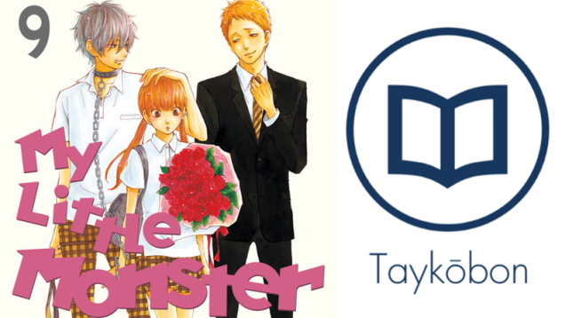

---
{
	title: "Taykōbon Redesigned Assets",
	published: "2015-09-03T13:11:32-04:00",
	tags: [],
	kinjaArticle: true,
	hideFromIndex: true
}
---

**Taykōbon Blimp:** We recently redesigned the Taykobon assets, changing the logo from the T> to a book, fixing the error in the name with the o and changing the typography to look more aesthetically pleasing. Along with that, The header image has been tweaked, and so has the banner for the kinja subblog. If you notice any issues or have a complaint with any of the new assets, shoot them here or message me on Skype or my[ ConTAYct page](/posts/rockmandash12s-contayct-page-1533827853), I’ll have to redo them in a week’s time anyways.... :/

