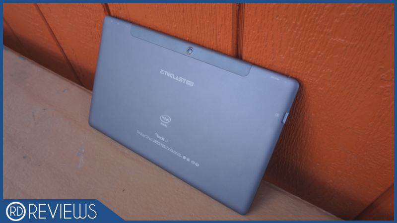
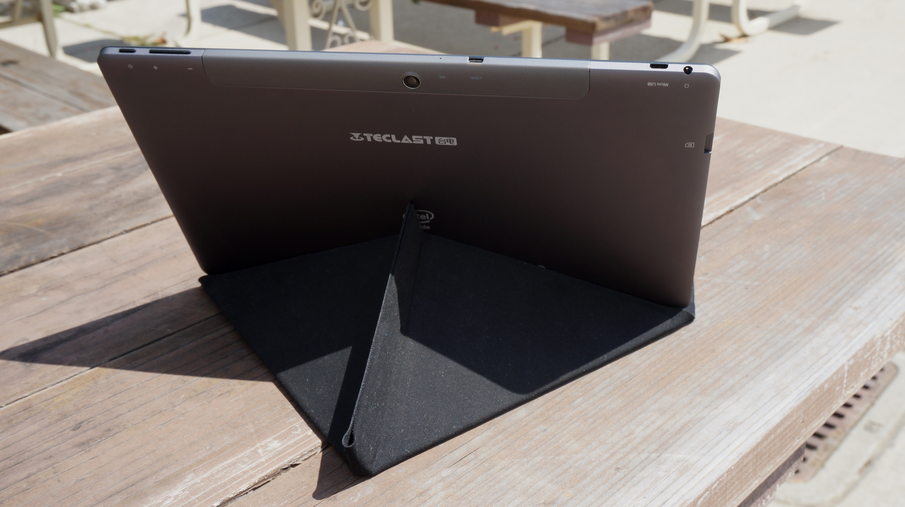
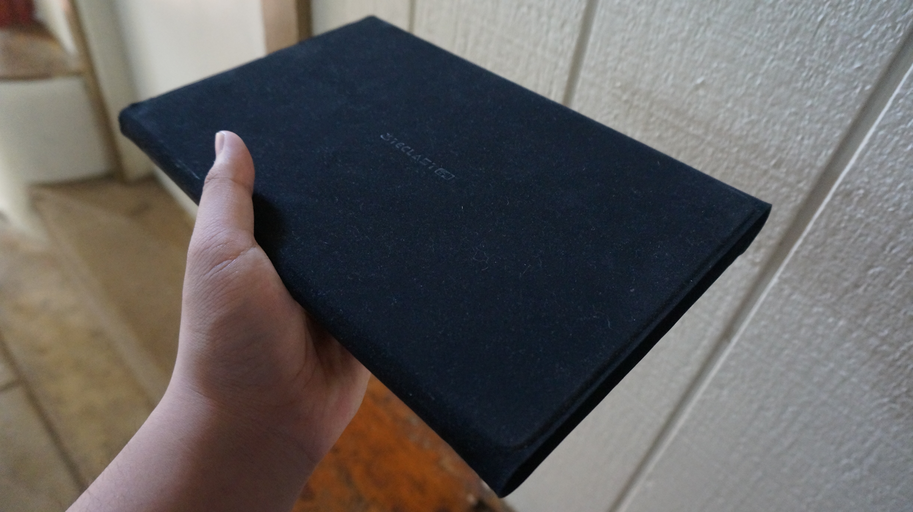
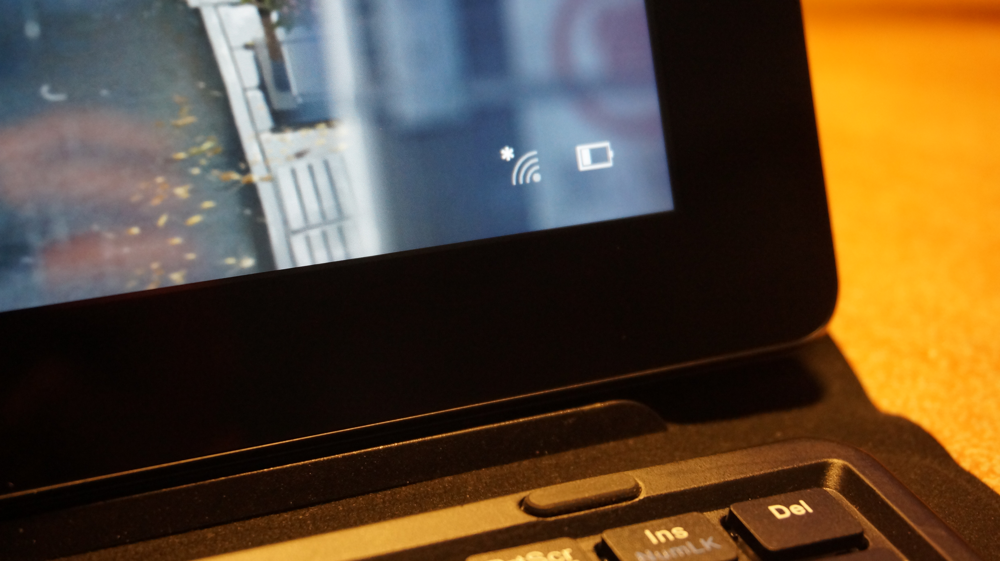
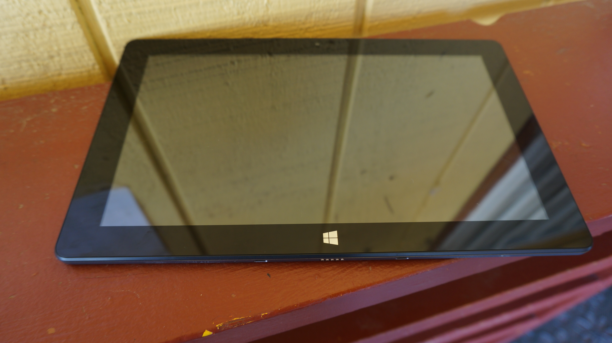

---
{
	title: "Teclast Tbook 11 Review: Can A Chinese 2 in 1 Be Any Good?",
	published: "2016-05-23T00:00:00-04:00",
	tags: ["RockmanDash Reviews", "Teclast", "Tbook 11", "Teclast Tbook 11", "Dual Boot", "Tablet", "Review", "2 in 1"],
	kinjaArticle: true
}
---

In 2011, when the original iPad came out, tablets were marketed as the next revolution in computing, inspired by a dream for a Post PC world. When looked at from a modern perspective, while it has definitely had it’s impact, Post PC is a dream that looks incredibly silly given that tablets themselves have become like the PCs they strived to go away from, thanks to products like the Surface. The onslaught of 2 in 1s inspired by Microsoft’s tablet have changed the landscape of tablets to the point that you can’t make really a tablet without a keyboard: the 2 in 1 space has been commoditized (in which goods become less distinguishable from each other) with every type of budget device aiming to get a slice of this pie. Today for review we have one of those commodity tablets for review in the form of the Teclast Tbook 11, a tablet that doesn’t have anything special about it’s specs and design, but while it is commodity some aspects, it has interesting features that differentiate it from the rest.

***

# What is it?

The Teclast Tbook 11 is a 10.6 inch tablet made by a relatively unknown Chinese tablet manufacturer called Teclast. Unlike the last tablet I reviewed from them (The [Teclast x98 Air II](/posts/teclast-x98-air-ii-review-an-interesting-dual-booting-1700897037)) which was eerily similar to the iPad, the Tbook 11 in particular isn’t necessarily a clone of anything, instead serving as an example of the generic 2 in 1 tablet(as long as you buy the additional keyboard). While Teclast isn’t the most well known in the west, to those who know them they make solid devices that are great for the money, and this guy is no different.

It’s a rectangular tablet that has the same Cherry Trail chip that so many of these windows devices have been packing lately, but what makes it interesting is what they threw in this guy for the price and what stuff it can do: for under 200 dollars, you have a metal unibody, 10.6 inch 1080p tablet with 4gb of ram, blowing away most of it’s competition that have cheap 1280x800 displays, and 2 gb of ram. To put this into perspective, the Teclast Tbook 11 is comparable to the Surface 3 for half the price, and you’d be shocked to hear that such a cheap device has a surprisingly comparable experience. Also, to add to this, the Tbook 11 is the first dual booting cherry trail tablet, being able to run both windows and android, which is a feature that makes it stand out from most of it’s competition. How cool is that? Here are the specs if you’re interested.

|                      |                                                             |
| -------------------- | ----------------------------------------------------------- |
| **Teclast Tbook 11** |                                                             |
| **CPU**              | Intel Atom Cherry Trail X5-Z8300 Quad Core @ 1.84Ghz        |
| **Memory**           | 4 GB LPDDR3, 64 GB eMMC + SD slot up to 128gb               |
| **Display**          | 9.7 inch, 2048 x 1536 IPS LCD (@208 ppi)                    |
| **Dimensions**       | 27.50 x 16.97 x 0.84 cm / 10.83 x 6.68 x 0.33 inches        |
| **Cameras**          | 2MP Rear / 2MP Front                                        |
| **Connectivity**     | BT, Wi-Fi, micro USB, Micro HDMI, 3.5mm, Pogo Keyboard Port |
| **Battery**          | 7500mAh Battery                                             |
| **OS**               | Windows 10, Android 5.1                                     |
| **Pricing**          | [$180 USD @ Gearbest](http://shrsl.com/?~ckjl)              |

***

# Design

While a tad bit on the uninspired side, the Teclast Tbook 11 is a handsome little device all things considered: it’s nothing special, but it isn’t bad looking either, just kinda plain. There’s not much you can say about it’s design aesthetically, as it’s a tablet and looks like it: it’s a rectangular slab of metal and glass with a plain black front and dark grey metal rear housing. I guess the nicest thing I can say about the tablet’s aesthetic is that it reminds me of the [Nexus 10](http://gizmodo.com/google-nexus-10-review-it-s-pretty-pretty-5956304) from 3 years ago which I was rather fond of, because both have the same rather nice dark grey color scheme, a plastic insert at the top with a centered camera, and speakers on the side. There are some big differences though, as that the Tbook 11 is a much less rounded off device, striking a more mature and business oriented look than google’s charming nexus, but you could just say that it looks more generic instead.

Another difference between the two is build quality: while that Nexus had plastic and most people would expect plastic in this price range, the Tbook 11 is made out of metal (with a bit of plastic at the top for wireless reception), which it looks and feels great, comparable to devices that cost much more than the $180 this guy asks for. I’m also just surprised by how comfortable this, other metal tablets I’ve owned felt weird, too cold to the touch but this is nice to hold in almost any situation. We’ve seen this trend of what used to be only for high end trickle down to mid range, and the build of this tablet is a prime example of that, which is really nice to see.

Similar in quality to the build is the display: The screen is a 10.6 inch 1080p screen, which isn’t the best in the world, but it sure does look like it. Great detail, solid viewing angles, crisp colors, This display is one that looks great and would be unthinkable at this price range a few years ago. Though, this isn’t the best out there as if you compare it to other tablets, it is on the budget side of things all things considered, with a lowly 207 PPI to it’s name. It’s certainly not as crisp as some of the ultra high displays out there, and you can definitely see pixels if you’re paying attention to the screen, but it’s lower PPI will never be a hindrance to your experience, and it sometimes even serves more of a benefit due to the poor scaling for high resolution displays on windows.

Even though the landscape has changed in comparison to a few years ago when the only good display on a windows tablet was pretty much just the* *Surface* *line and a few Chinese tablets, high resolution tablets are still the exception, not the rule. It’s one of the best displays you can get at this price point on windows, and while there is other Chinese competition and devices from more well known OEMs like the Asus Transformer T100 Chi* *in spitting range of price at 250, most at or near this price range are a lousy 1280x800 affair. The Tbook 11 has a great display, with my only real complaints being that ’s not laminated (which means the gap between the display and the glass is not fused together, thus being noticeable), but so are most tablets in this price range and that the display is a fingerprint magnet which means you have to wipe it off once in a while. It comes with a preapplied screen protector which you could use if you wanted to which would make the fingerprints much less of an issue, but touch sensitivity is worse and it feels worse so it’s a trade off there.

Unlike the Teclast x98 Air I reviewed which bundled all of the ports in the bottom right corner, which lead to clearance issues and ergonomic awkwardness, all of the ports (except for the connector to the keyboard) are on the top of this tablet, getting out of your way when using it as a laptop and being the most ergonomic for a tablet. It works well and I wish more tablet manufacturers put ports on the top, it’s out of the way and doesn’t inhibit your experience while it may at different locations. As for the ports itself, the tablet has the 3.5 mm headphone jack and Micro USB (for changing and USB input via OTG) on the left side, the micro HDMI cable in the middle, and the right has the power button and volume rocker. This is a bit annoying given that you can’t use a USB device and charge at the same time and it’s competition has full sized USB ports, but at least it has the micro HDMI port which makes it a lot more usable if you need to work on bigger projects.

***

# Using it

Throw away any preconceptions you have with tablet computing, thoughts like they are too slow and not able to do the work you need to do. These aren’t netbooks from 2010, and low cost devices are finally fast enough to handle the tasks people need would do on a daily basis while providing a great user experience. This tablet is like the experience of a surface 3 but half the cost, at a price that’s actually reasonable given the specs of the machine. While you may assume that it sucks because it’s a Chinese device, the experience is pretty solid for the most part. While these atom chips won’t be replacing your PC for demanding tasks like video editing or PC gaming (and you shouldn’t expect anything to do so at this price range..), for everyday tasks like typing up word documents or scrolling through the web, this tablet can handle it no problem thanks to the Cherry Trail (the X5-8300) processor and 4GB of ram. I’ve been using this for school work and even some photo editing for AniTAY, and it’s been rock solid the entire time.

Really, performance has been impressive throughout, even in comparison to bay trail devices. Gaming is even feasible - while you shouldn’t try 3D games too much, with that being a stutter filled, low resolution mess (I tried to play Rocket League and had to drop to all low settings 800x480 to get 20-25 fps, not pleasant) but lighter stuff like VNs, older games and indies all work great on this and I’ve been having a good time gaming on this guy, even if you really shouldn’t think of this as a gaming device. You can really stretch the performance of this chip, I plugged it into my 4k TV out of curiosity and it was able drive it at full resolution rather well, which would have chugged or not even be possible on Bay Trail (of course, if you tried to do something intensive like game on 4k, then the tablet would start to cry or something like that).

What you’re going to notice most in comparison to Bay Trail devices is that most Bay Trail devices packed only 2 gb of ram, and the 4gb of ram on a lot of the Cherry Trail devices is big here though, making multitasking and general use all that more smoother. While some may say that enough is enough with ram on mobile devices, as one who uses a lot of tabs and generally hits my computer hard, more the merrier I say. I’ve been impressed by the performance of this guy throughout my experience using it, it’s been rock solid throughout my experience. Also, while performance is average on windows, it’s pretty much top of the line on android, performing very well there. For those who are interested, here are some benchmarks:

[Open *imgur.com*](http://imgur.com/a/dUDVC)

This gallery also has battery life, which is a solid 6 hours. While it’s no king of battery life and only average in respect to most tablets and laptops nowadays, in my experience it has been great as I never had to worry about my battery life, being able to get through the day every day unless I forgot to charge it. Leaving the power cord isn’t even a big deal though, because the device uses Micro USB Type B to charge (the same as non apple phones), so usually you can find one no problem. It’s worth noting though that this tablet doesn’t come with a charging block, so you may need to buy one anyways. Overall though, a good experience in regards to battery life.

Tablets like the x98 air were loved because it was one of the first Windows tablets with a good screen and a large battery to boot, showing to the world that Chinese tablets have an experience that is comparable to the Western tablet. Think have changed though, and the evolution two in ones show a different story in both tier one OEMs and Chinese ones like this: these two and ones are a lot more useful as these are real productivity machines, providing an experience that is surprisingly solid, being able to do real work and use them on a daily basis. Really, the longer I use this, the more I think that these tablet 2 in 1s are Netbooks done right, the fulfillment that many had in regards to portable, low cost computing. While Chromebooks are getting better every day and are still better at some tasks due to the more traditional form factor and larger screen, there are some aspects sing something like this allows you to do everything you need to and really makes one think this is what netbooks should have been like in the first place, thin and light yet fast enough to handle everything while having the long battery life you want... The iPad didn’t kill netbooks, it changed the essence of them, making netbooks into tablet 2 in 1s.

So, about that keyboard that makes this experience that much better: this tablet technically has two keyboards made for it, one a folio style keyboard and one a transformer style keyboard. I have the folio style keyboard as the transformer one wasn’t in stores, so I will be talking about that, but if ever get the transformer style keyboard, I’ll definitely update this post for it.

The folio keyboard isn’t a clone really of anything a major manufacturer has made, but it’s a style that lots of cheaper OEMs have been using, so while you may have not seen something like this, it isn’t unique to this device. It’s a nice design, with a soft touch fabric which feels really nice when using it (though the keyboard side is just plastic) and only costs 30 dollars which is in stark contrast to something like Microsoft’s type cover even though they work rather similarly: they both use magnets to hold it to the tablet, both have a soft touch fabric exterior, and both act as as protection for the screen of the device. For the most part, it’s a great experience with it being easy to enter in text and given it’s portable nature it makes for a great writing machine that you can take anywhere you want to go without worrying about weight or stuff like that.

It does have it’s problems though, as while it looks great and makes for a great way to storage the device, it’s not the best thing to type on, especially on your lap as like on the surface line, it can be tricky to try to balance on your lap, as there’s no real hinge, only fabric to connect the keyboard section and the tablet. You fold the back and rest the tablet on it, which while working well on a table, means you have to balance something balancing on something else, it’s not ideal. There’s also some annoyances with the layout, the keyboard is pretty small because the tablet is small, but more annoyingly is a shrunken shift key on the right to make space for the up arrows. This lead to plenty of typos in my experience using this, it really should be that the shift key should be normal sized with the arrow half, the way they have it set up now is pretty awkward. Also, the touchpad is small and while it does the job with nice clicky buttons and precise control, being faster and more precise than by hand, it’s not an amazing touchpad as 2 finger scrolling is pretty unreliable, to the point where I just stopped trying. (this does have the side effect of trying to tap the screen when using a different computer though so keep that in mind :P)

Even with all the gripes though, the keyboard works well for the most part and makes this a device I can really do work on, allowing you to do many tasks so much more easier. There’s a lot of text entering in the world when it comes to work and this keyboard makes the job that much easier. It’s also a far better solution to a Bluetooth keyboard too as the the Pogo connection is reliable unlike Bluetooth, and the touchpad keyboard combo makes navigating the UI easier, especially windows as it is just a better experience with a keyboard and mouse. I’d definitely recommend the transformer keyboard instead of my folio one, but this one even with it’s flaws still serve to improve the experience.

The size of the tablet is also a nice touch as well: When I first got this device, I was worried the 10 inch size was going to be too small to use comfortably as a laptop especially because I tried devices similar to this but with a 1366x768 display and it was not really pleasant to me, but thanks to the Tbook’s 1080p resolution this wasn’t really an issue at all, leaving you with lots of space to work with depending on your scaling setting. This is a great middle ground between the two worlds of laptop, with 10 inches being a great size for a tablet but usable for a laptop, and I’ve been really enjoying it.

[Open *imgur.com*](http://imgur.com/a/iGCyU/embed)

Worth noting: this device has cameras, but please don’t use them as you’ll look like a fool and they’re not the greatest. We’re looking at a 2 megapixel affair on both cameras, and while you can get passable results, it’s the type of camera you’d expect for skying and not much more. It’s not the worst I’ve seen but if you have a camera from this decade, you probably have a better one than this so use that instead. Also worth noting: the front camera is reversed for some reason, which can get really annoying if you actually use it for some reason.

I’ve been pretty positive about this device because I have had an enjoyable experience with this tablet, but the device has a ton of really weird small issues that can make using the device not as pleasant as it should: from a finicky micro SD card slot that doesn’t detect SD cards after reboots, to the Headphone port being really tight to the point that it feels like you’re going to damage the device, the device has little things that keep it from being something you’d recommend people, things that keep it from being a daily use device.

There was one thing about my unit that was particularly bad though, bad enough that one may call it a deal breaker for some: The WiFi card is weaker than and has issues holding to a signal in comparison. While this may just be a flaw from my device, poor WiFi is more annoying then no WiFi and it influences nearly everything you do when using a mobile device. Most of the time content loads fine and it usually does not influence the experience, but it is noticeably worse than other devices, drops from the network more frequently and chugging along when doing something like bandwidth intensive like streaming video. For example, there were many times where trying to stream videos would pause and stutter, which is annoying because we think of tablets as content consumption devices and this really inhibits the use as one. It also has the unfortunate side effect being of even more frustrating on android in particular because almost everything you can do on that platform expects you to have internet. For me, this makes the android side much less useful because content consumption is so much better on android with a more optimized web browser, better apps for watching videos etc. It’s a really frustrating Achilles heel to a device, and it’s a shame it has to be this way.

***

## Like

**The display** - High resolution IPS displays are great and this is no different. Coupled with a great size and this is a solid experience.

**The build quality** - All metal build feels nice and premium, comfortable yet high end. Really great job with the build.

**The experience as a 2 in 1** - As good as it’s more expensive rivals, a great production experience that gives confidence in regards to replacing a laptop.

## No Like

**Weak WiFi performance** - WiFi is our world and poor connection only leads to frustration. Also has the side effect of making Android much less useful.

**Odd keyboard decisions** - Why would you make the shift smaller for the arrows? Why doesn’t 2 finger scrolling work? Ugh.

**Weird things here and there -** Weird things like headphone port tightness and micro SD card slot making the experience worse...

***

## Should you buy it?

Maybe. I would recommend getting a two in one tablet, but recommending this in particular becomes hard to do because of the WiFi performance. Overall, A 2 in 1 tablet similar to this can provide a well rounded, solid experience (especially for the money), but even with all of that, issues like bad WiFi that effect everything you do will significantly influence your experience. If you have really solid internet or are interested in buying it regardless of weaker than average WiFi, you can get it from [GearBest for $180](http://shrsl.com/?~ckjl).

I mentioned it a few times in the review but this is an example of comoditization. While it does have things that seem odd and it seems like it has specs that a few tablets to offer this much at this price, it is not the only one like this: There’s a lot of great tablets coming out, with other Chinese tablets being pretty similar. For example, you’re interested in something like this, the Chuwi Hi10 or Hi Book as they have virtually the same specs and they dual boot, so I would recommend those instead. If you don’t want to deal with a no name OEM, there’s also the Asus Transformer T100 Chi you can give a shot but that has it’s own issues like it’s keyboard being Bluetooth, for an example. Really though, 2 in 1 tablets are a great experience for the budget and I would definitely recommend one of these for anyone looking for a modern day computer.

***

*Kevin Mai - Rockmandash12 is a frequent writer of Visual Novels and anime on *[*his blog*](/posts/#_ga=1.122760139.1523386611.1417386122)* and the *[*AniTAY Blog*](http://anitay.kinja.com/#_ga=1.182989094.1052958133.1463607106)*, but does have a pretty deep interest in the world of tech with all Tech related content available on *[*KMTech*](http://kmtech.kinja.com/#_ga=1.182989094.1052958133.1463607106)*. If you’re interested, come check them out!*

****Disclaimer:*** This tablet was provided by the online retailer Gearbest for the purpose of review, but there was no editorial control or any involvement in the review process. Also, the keyboard was purchased for the sake of the review.*
