---
{
  title: "Teclast X98 Air II Review: An Interesting Dual Booting Chinese Tablet",
  tags:
    [
      "Rockmandash Reviews",
      "Review",
      "Reviews",
      "Teclast X98 Air II",
      "Tablet",
      "Dual Boot",
      "Chinese",
      "Budget",
      "Tech",
    ],
  published: "2015-04-29T18:00:00-04:00",
  attached: [],
  license: "cc-by-4",
  oldArticle: true,
}
---

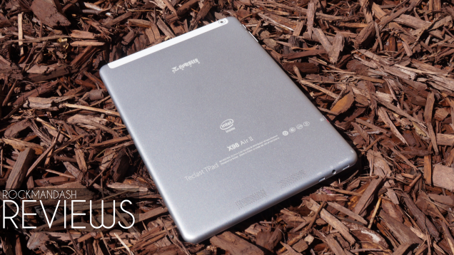
Confession time: I’m an idiot who carries two tablets. I have my Android tablet because
  it’s great at doing tablet stuff like media consumption, but Windows tablets are quite a bit better for productivity
  and the windows exclusive programs out there are great. Enter the Teclast X98 Air II, a dual booting Chinese tablet
  that runs both Android and Windows for $200 USD with a retina iPad display for a fraction of the cost. Is this truly
  the fully <a class="sc-1out364-0 hMndXN sc-145m8ut-0 gIacKn js_link" data-ga='[["Embedded Url","Internal link","http://gizmodo.com/intel-dualos-stuffing-android-and-windows-into-the-sam-1496006962",{"metric25":1}]]' href="http://gizmodo.com/intel-dualos-stuffing-android-and-windows-into-the-sam-1496006962">realized dream of dual OS tablets</a>,
  or is it a flawed compromise like critics have been saying? I’d have to go with the former.

<h3 class="sc-1bwb26k-1 fvCjqJ" id="h110372"><strong>What
  is it?</strong></h3>
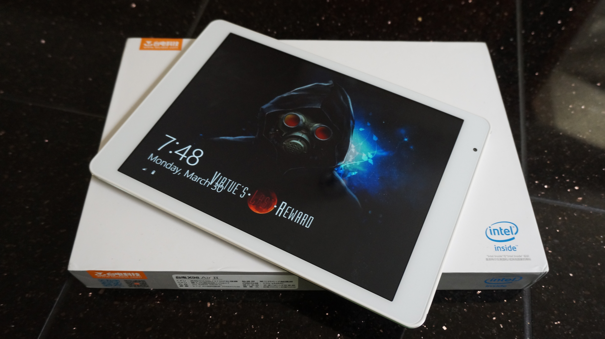

The Teclast X98 Air II is a dual booting tablet made by a Chinese brand you’ve
  probably never heard of. It’s one of many iPad Air clones with a 9.7 inch, 2048x1536 display and an eerily similar
  design, but where it differs from apple’s titan of a tablet is that these usually sell for around 200 USD, and along
  with the different price comes different specs. These rock a Quad Core Intel Atom, and this x86 processor enables this
  machine to boot into both Android and Windows. There’s a whole bunch of tablets like this one that are made by
  different brands like Onda and iCube that are pretty much identical, with minor differences between each other (this
  one has Micro HDMI for an example, but is only in white), but they’re pretty much all the same. Here’s the specs that
  you can expect from a tablet like this, more specifically the specs of my Teclast:

<table class="first-text">
<thead>
<tr>
<th><strong> </strong></th>
<th><strong><strong>Teclast X98 Air II</strong></strong></th>
</tr>
</thead>
<tbody>
<tr>
<td><strong><strong><strong>CPU</strong></strong></strong></td>
<td>Intel Atom Baytrail Z3746F Quad Core @ 2.16Ghz, x86</td>
</tr>
<tr>
<td><strong><strong><strong>Memory</strong></strong></strong></td>
<td>2 GB LPDDR3, 32 GB eMMC + SD slot up to 64gb </td>
</tr>
<tr>
<td><strong><strong><strong>Display</strong></strong></strong></td>
<td>9.7 inch, 2048 x 1536 IPS LCD (@264 ppi) </td>
</tr>
<tr>
<td><strong><strong><strong>Dimensions</strong></strong></strong></td>
<td>240 x 169 x 7.4mm, 498g  </td>
</tr>
<tr>
<td><strong><strong><strong>Cameras (That suck)</strong></strong></strong></td>
<td>5MP Rear / 2MP Front</td>
</tr>
<tr>
<td><strong><strong><strong>Connectivity</strong></strong></strong></td>
<td>BT 4.0, Wi-Fi 802.11 b/g/n, micro USB, Micro HDMI, 3.5mm  </td>
</tr>
<tr>
<td><strong><strong><strong>Battery</strong></strong></strong></td>
<td>8500mAh Battery </td>
</tr>
<tr>
<td><strong><strong><strong>OS</strong></strong></strong></td>
<td>Windows 8.1 Bing, Android 4.4</td>
</tr>
<tr>
<td><strong><strong><strong>Pricing</strong></strong></strong></td>
<td>$200 USD @ <a href="http://www.geekbuying.com/item/Teclast-X98-Air-II-Intel-Bay-Trail-T-Z3736F-Quad-Core-2-16-GHz-9-7-Inch-Tablet-PC-Android-4-4--Support-Windows-8-1--2048-1536-IPS-2GB-32GB-335781.html" rel="noopener" target="_blank">Geekbuying</a></td>
</tr>
</tbody>
</table>

<h3 class="sc-1bwb26k-1 fvCjqJ" id="h110373"><strong>Why
  Does it Matter?</strong></h3>
I like to think of these Chinese tablets as both similar to
  those those <a class="sc-1out364-0 hMndXN sc-145m8ut-0 gIacKn js_link" data-ga='[["Embedded Url","Internal link","https://lifehacker.com/three-cheap-but-awesome-alternatives-to-the-apple-cinem-1500692411",{"metric25":1}]]' href="https://lifehacker.com/three-cheap-but-awesome-alternatives-to-the-apple-cinem-1500692411">budget 27 inch Korean panels that were essentially Apple Cinema Displays but for a fraction of the cost</a>,
  and a great example of why brands aren’t everything: Yes, there are issues, but the gains really outweigh the
  negatives and these would have never happened without these Chinese brands. Yes, these tablets aren’t perfect and you
  risk not having customer service, but as a tradeoff, you get something that is surprisingly good. No tier 1 OEM sells
  a tablet this nice at this price point, and these even have the ability to run both Android and Windows! Outside of
  these Chinese OEMs, there’s really nothing like this, and in comparison this tablet is pretty well spec’d, feature
  filled, and great for the money.

<aside class="sc-1rh3ayr-6 jfFNjl inset--story branded-item branded-item--lifehacker" data-commerce-source="inset"><a class="sc-1out364-0 hMndXN sc-1rh3ayr-2 ifHGla inset--story__thumb js_link" data-ga='[["Permalink page click","Permalink page click - inset photo"]]' href="https://lifehacker.com/three-cheap-but-awesome-alternatives-to-the-apple-cinem-1500692411" rel="noopener noreferrer" target="_blank">
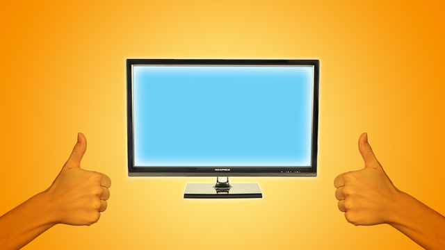
<svg aria-label="Lifehacker avatar" height="64" viewbox="0 0 64 64" width="64" xmlns="http://www.w3.org/2000/svg"><g fill="none" fill-rule="evenodd"><path d="M0 0h64v64H0z" fill="#94B330"></path><path d="M17 8v48h8V9l-8-1zm13 0h5v14.7c1.35-.42 3.2-.6 4.67-.6C44.9 22.1 49 26.74 49 32v24h-5V32.02c0-2.6-2-4.66-4.63-4.66H35V56h-5V8z" fill="#FFF"></path></g></svg></a>

<a class="sc-1out364-0 hMndXN js_link" data-ga='[["Permalink page click","Permalink page click - inset headline"]]' href="https://lifehacker.com/three-cheap-but-awesome-alternatives-to-the-apple-cinem-1500692411" rel="noopener noreferrer" target="_blank"><h6 class="sc-1rh3ayr-3 jRIPES">Three
    Cheap but Awesome Alternatives to the Apple Cinema Display</h6></a>

Whether you're a fan of Apple or not, you have to admit, they make some of the most
      beautiful…
<a class="sc-1out364-0 hMndXN sc-1rh3ayr-0 kAeDoV js_readmore inset--story__readmore js_link" data-ga='[["Permalink page click","Permalink page click - inset read more link"]]' href="https://lifehacker.com/three-cheap-but-awesome-alternatives-to-the-apple-cinem-1500692411" rel="noopener noreferrer" target="_blank">Read more</a>

</aside>

<h3 class="sc-1bwb26k-1 fvCjqJ" id="h110374"><strong>Design</strong>
</h3>
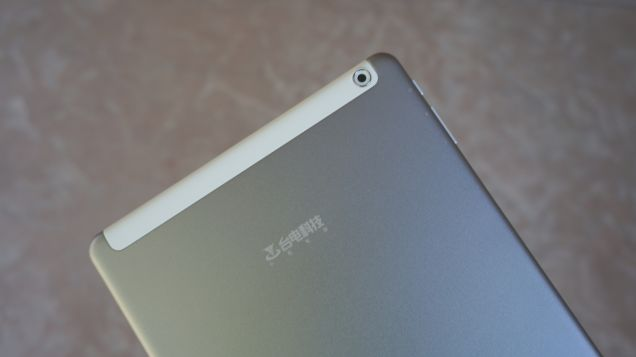

We’re all thinking it. It looks like an iPad. It’s an iPad clone and it isn’t
  embarrassed about it. From the 9.7 inch, 2048x1536 PPI display that is pretty much identical to the iPad Air, to the
  champhered edges that grace the edges of this device, The Teclast X98 Air II embraces being an iPad clone in a way
  that you would really expect from a Chinese manufacturer. Yes, I would have preferred something original, but it does
  it’s job and actually works pretty well. it’s an iPad Air running windows and android, and it’s a design that
  works.

That being said, it’s actually built in a way that wouldn’t totally embarrass
  Apple if this was an Apple made device, and you’d probably be impressed by how nice it is: it has an aluminium chassis
  for 200 dollars, something the Google made Nexus 7 or 9 can’t even claim. It’s really something you really don’t see
  in this price point and it’s really nice: It feels great in the hand, and it even has a nice, powdered texture to the
  device, making it no so slippery, and easy to handle. It feels premium, and it feels like quality.

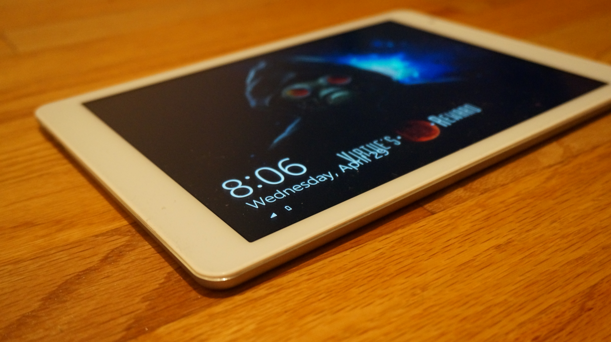
Same can be said for the screen: it’s a beautiful high resolution IPS display,
and it makes content looks absolutely great. Everything i’ve thrown at it looks really great, the colors look
fantastic, It’s crazy bright and i’ve been quite impressed in general. There are a few things that may annoy people
though as it’s not laminated like the <a class="sc-1out364-0 hMndXN sc-145m8ut-0 gIacKn js_link" data-ga='[["Embedded Url","Internal link","https://gizmodo.com/ipad-air-2-review-when-thin-actually-means-something-1652966327",{"metric25":1}]]' href="https://gizmodo.com/ipad-air-2-review-when-thin-actually-means-something-1652966327">iPad Air 2</a>
is, and annoyingly reflective at times, but other than that it’s really a beautiful panel and never really got in the
way of my usage of it.

<aside class="sc-1rh3ayr-6 jfFNjl inset--story branded-item branded-item--gizmodo" data-commerce-source="inset"><a class="sc-1out364-0 hMndXN sc-1rh3ayr-2 ihdhCm inset--story__thumb js_link" data-ga='[["Permalink page click","Permalink page click - inset photo"]]' href="https://gizmodo.com/ipad-air-2-review-when-thin-actually-means-something-1652966327" rel="noopener noreferrer" target="_blank">
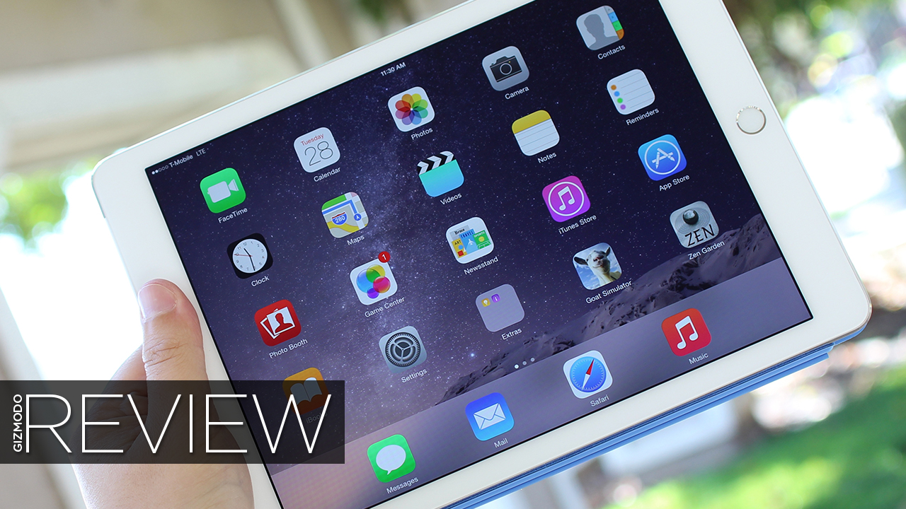
<svg aria-label="Gizmodo avatar" height="64" viewbox="0 0 64 64" width="64" xmlns="http://www.w3.org/2000/svg"><g fill="none" fill-rule="evenodd"><path d="M0 0h64v64H0z" fill="#18AFED"></path><path d="M16.67 46.94A22.04 22.04 0 0 1 11 32.43C11 16.09 24.58 10 33.15 10c8.41 0 14.6 4.13 14.85 4.3a4.22 4.22 0 0 1-1.48 7.58 4.1 4.1 0 0 1-3.1-.61c-.11-.07-4.5-2.9-10.27-2.9-5.37 0-12.77 3.54-12.77 14.06 0 5.98 4.45 13.04 12.6 13.04 4.6 0 7.83-1.23 9.7-2.42v-6.22h-6.36a4.16 4.16 0 0 1-4.13-4.18 4.16 4.16 0 0 1 4.13-4.19h10.5A4.2 4.2 0 0 1 51 32.64V45.1c0 1.13-.5 2.21-1.3 3-2.79 2.73-8.87 5.9-16.88 5.9a21.4 21.4 0 0 1-16.16-7.06z" fill="#FFF"></path></g></svg></a>

<a class="sc-1out364-0 hMndXN js_link" data-ga='[["Permalink page click","Permalink page click - inset headline"]]' href="https://gizmodo.com/ipad-air-2-review-when-thin-actually-means-something-1652966327" rel="noopener noreferrer" target="_blank"><h6 class="sc-1rh3ayr-3 jRIPES">iPad Air
    2 Review: When Thin Actually Means Something</h6></a>

Gadgets get thinner every year. That's a given. But the iPad Air 2 crosses a
      threshold where thin…
<a class="sc-1out364-0 hMndXN sc-1rh3ayr-0 idkyLZ js_readmore inset--story__readmore js_link" data-ga='[["Permalink page click","Permalink page click - inset read more link"]]' href="https://gizmodo.com/ipad-air-2-review-when-thin-actually-means-something-1652966327" rel="noopener noreferrer" target="_blank">Read more</a>

</aside>
There are some downsides to the design however, and the one that through me off
  the most is the absolutely baffling placement of pretty much everything. It feels like the placement of the ports, the
  buttons etc, are different for the sake of being different, and it’s kinda hard to get used to. All of the Buttons are
  on the left side which is different from the typical right, and all of the ports are on the very left bottom right
  next together. To be fair, this works out really well when using the tablet in landscape, as nothing is really
  blocking your hand and it’s easy to reach the buttons, but it’s really hard to get used to and has been throwing me
  off since I got it.

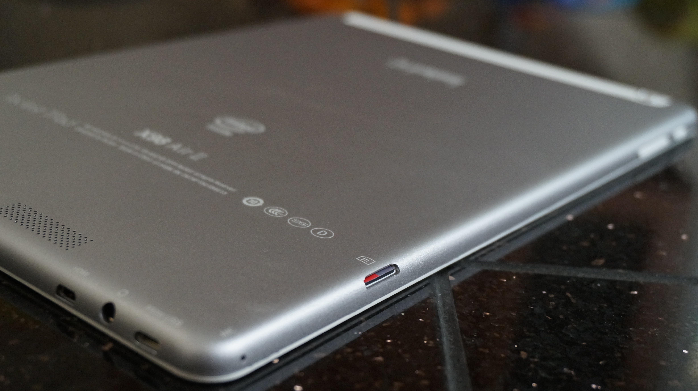
Continuing the placement ranting, there’s a huge cardinal sin when it comes to
placement, and it really deserves it’s own paragraph: the speakers are on the back, which makes very little sense on a
tablet. I mean, it’s a 9.7 inch tablet and they decide that it would be great to have the sound blasting at a random
point in the back of the tablet.... what? Makes absolutely no sense, front facing speakers or at least side mounted
would have been much nicer. They don’t sound horrible, but still... why???

Also, total first world problems, but it’s only available in white. One more reason
  to get the Cube, which is the only one of these dual booters that’s black.

<h3 class="sc-1bwb26k-1 fvCjqJ" id="h110375"><strong>Using
  it</strong></h3>
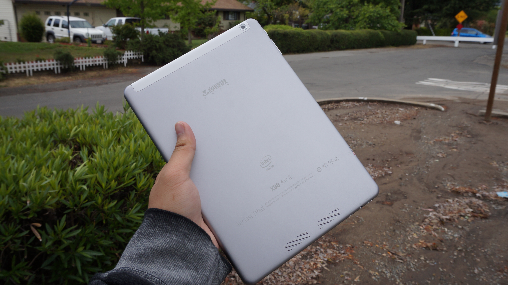

I guess I should start this off by saying that you run risks by using a device like
  this. You don’t get any customer service, the polish of the software and QC is nowhere near as high as something from
  tier 1 OEMs, and buying it can be a hassle, but if you’re OK with that, then you’re getting a pretty nice experience.
  Strangely enough, buying it was probably the worst part of my experience with this tablet, as the site I originally
  was going to buy it said that they had it in stock but they didn’t. They also failed to notify me about this so I was
  sitting here for like a week wondering where it was until I checked and they never shipped it out.... not cool.

It also requires a bit of tinkering as well, as it’s not really great out of the box, and
  setting it up, getting it working was really annoying. It comes already in the OS and you need to reset it, and go
  through the process again, android doesn’t come with the typical setup prompt even when you do that, some people are
  having issues even connecting to the play store, everything was really fuzzy and low rez on android out of the box,
  but I did a system update and it was back to normal, getting everything in english is annoying if you don’t know the
  settings.... you’ll run into some issues early on, and you’ll have to be able to deal with them. The worst bit was my
  issues with it randomly shutting down: if you used the charger from box while using windows, it would randomly shut
  down, not indicating anything about why it was doing so. It stopped happening when I tried a not crap charger, so
  yeah, keep that in mind. If you’re looking for a perfect experience every time, just get a Tier 1 Tablet, as this
  requires a bit of tinkering to get it working right.

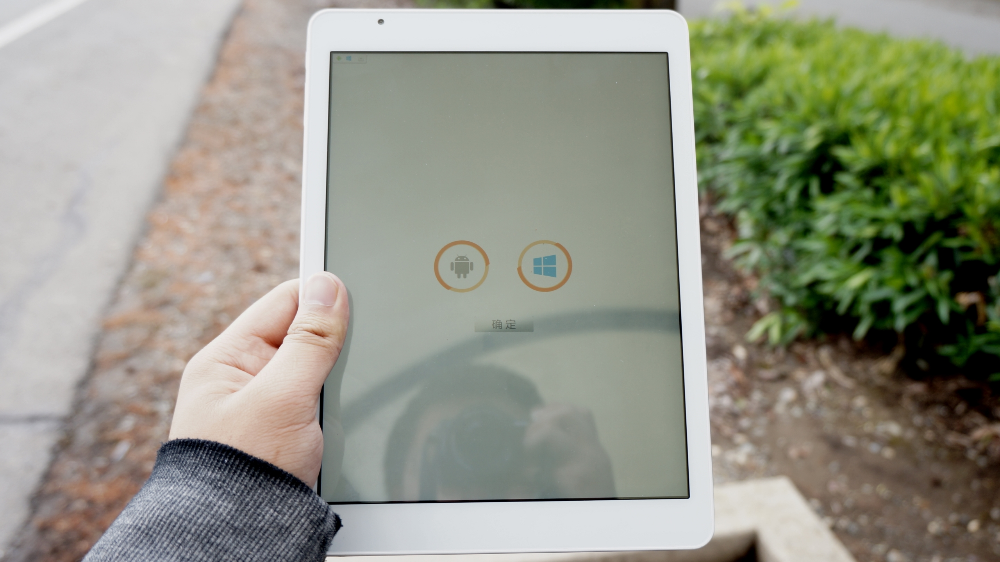
After I set everything up though, it’s been all sorts of awesome. It’s unlike
anything you’ve probably used as it dual boots both android and windows, but exactly like what you’d expect out,
because it’s so similar to everything you’ve used before as the software is pretty much the same (sans dual booting
stuff and a bad android skin). Honestly, I wish every tablet could run both android and windows, as each OS has it’s
strengths and weaknesses. Android on tablets is infinitely more user friendly and suited for this form factor, utterly
destroying windows when it comes to stuff like web browsing, reading and media consumption in general, but windows has
it’s windows applications and absolutely wrecks android when using it as a desktop or any type of content
creation. 

The ability to run both OS’s makes this tablet significantly more useful than if it
  only had one of them, being able to fit into both situations. I can run windows programs when I want to, and use the
  more intuitive to use android when I want to. Switching is easy as well, as all you need to do is click power and
  volume up when booting the device to bring up a menu where you select which OS you want to go to and it works pretty
  well. My personal usage has been using android as a default because I like android on tablets more, then using windows
  when I need to use a windows application. It works pretty well, and it’s a really nice system.

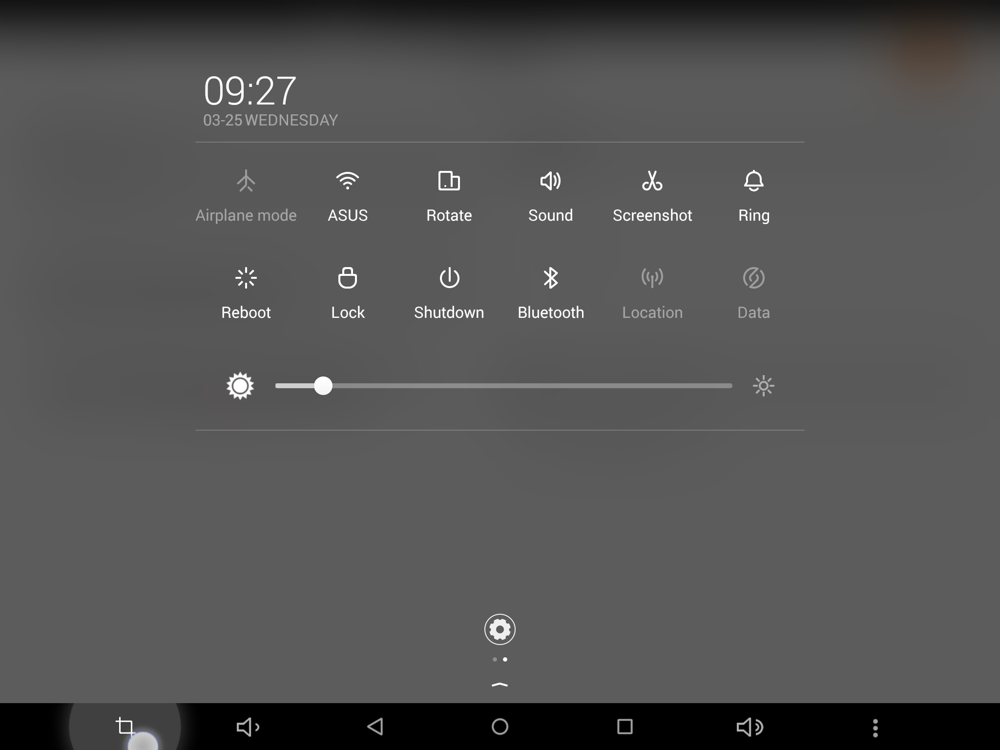

Speaking of Android, this tablet’s build of Android (4.4 Kitkat, don’t be fooled by
  the lollipop buttons) comes with a relatively annoying skin that is trying way too hard to be an iPad. In comparison
  to stock, it’s a total mess, but it’s livable. It tweaks the settings, launcher and notification shade to try to look
  like iOS, but it fails for the most part. It’s launcher is an iPad clone with no app drawer, it’s setting is white
  (and actually looks quite nice) in comparison to the black on 4.4 kitkat, and the notification shade... where do I
  start... It’s pretty bad. They tweaked it in a way that makes it much less useful than the one on stock android and
  doesn’t look all that great: it’s a weird scramble between 4.4’s notification shade and iOS’s. It is, however easier
  to reach in comparison to the n9, so there’s that. Also, the skin comes with a built in theme engine that can make
  things look pretty spiffy, like this screenshot down below, but it’s no material design. The skin is definitely one of
  the most annoying aspects of this tablet as it’s pretty heavy, but it’s not crippling. If you don’t want to deal with
  this and still want a tablet like this, There’s a tablet called the Cube i6 Air that comes with stock 4.4 which you
  should give a shot if interested, but that one doesn’t have HDMI and has a weird matte coating to the screen.Also,
  There’s also the fact that the tablet is 4:3, which means that not everything is optimized for it. Thanks to tablets
  like the Nexus 9, and the Nokia N1, this may change soon, but it didn’t bother me too much.

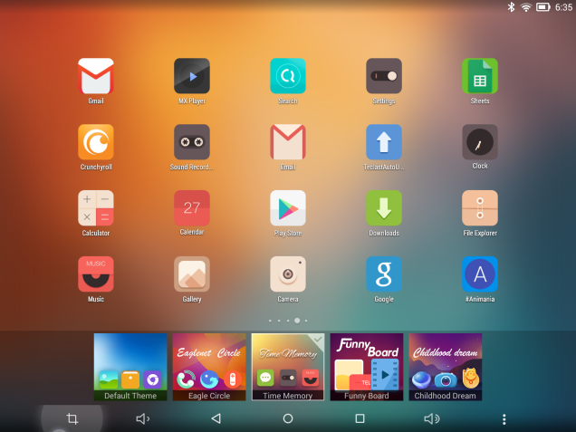

That being said, I was surprised by how the skin dealt with buttons: there’s a lot
  of space at that black bar, and they use the space to add functionality. They add a screenshot button, volume rockers,
  and even an overflow menu button make that bar feel more full, and more feature packed in comparison to other android
  tablets. The buttons aren’t customizable, which is a missed opportunity because the damn home button is in the middle
  of the screen, which is still the worst place ever for it, but adding functionality is a nice usage of space and feels
  quite a bit better than stock’s implementation.

Windows is a pretty different affair.
  Teclast didn’t touch it at all, so it’s the same windows tablet experience you get from something like the Dell Venue
  Pro 8 or the the <a class="sc-1out364-0 hMndXN sc-145m8ut-0 gIacKn js_link" data-ga='[["Embedded Url","Internal link","http://gizmodo.com/microsoft-surface-3-review-the-tablet-i-want-at-the-pr-1696598172",{"metric25":1}]]' href="http://gizmodo.com/microsoft-surface-3-review-the-tablet-i-want-at-the-pr-1696598172">Surface 3</a>.
  Don’t expect to run everything on it, but it keeps up with general tasks quite well. If you’re one of those people
  wondering it too, yes,<a class="sc-1out364-0 hMndXN sc-145m8ut-0 gIacKn js_link" data-ga='[["Embedded Url","Internal link","http://gizmodo.com/can-a-cheap-windows-tablet-replace-your-desktop-1684130353#_ga=1.18573945.1523386611.1417386122",{"metric25":1}]]' href="http://gizmodo.com/can-a-cheap-windows-tablet-replace-your-desktop-1684130353#_ga=1.18573945.1523386611.1417386122"> it can replace your desktop</a>,
  and it does better than most tablets in this aspect, as it has a micro HDMI port! Like the Dell Venue 8 Pro that Sean
  Buckley used, the Teclast X98 Air II handled windows like a champ, and you don’t need to look for the perfect
  dongle... just plug in the cable!

I have to say though, coming from tablets like the DVP 8, it’s really nice to run
  with a high enough resolution so you actually have space to work with, as using the desktop or the OS in general
  doesn’t feel cramped at all, and other than these Chinese tablets, there’s nothing in this price range that offers
  that. Tablets that run windows at it’s price have pretty low res screens, usually 1280x800, and on windows, that makes
  such a big difference. You’d have to go up to the Surface 3 to get a decent resolution, and this still beats that out
  when it comes to resolution. Windows needs to catch up when it comes to high res displays, and tablets like this go a
  long way to help that.

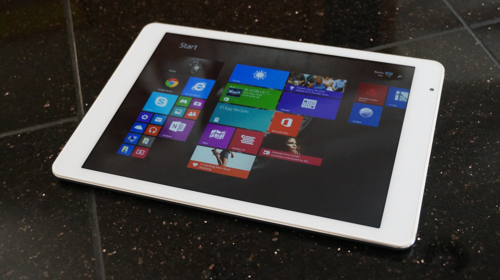

As for performance, I have no complaints, but those who are pickier than will
  probably have some. It’s Quad Core Bay trail processor is distinctly last generation and is the same one in the <a class="sc-1out364-0 hMndXN sc-145m8ut-0 gIacKn js_link" data-ga='[["Embedded Url","Internal link","http://gizmodo.com/intel-compute-stick-review-don-t-buy-it-1699377058",{"metric25":1}]]' href="http://gizmodo.com/intel-compute-stick-review-don-t-buy-it-1699377058">Intel Compute Stick</a>, but
  unlike that product, this one isn’t half bad. In tests, it’s pretty similar performance wise to a Snapdragon 800 and
  in my time with it I’ve had little to no lag in my usage with it, but there are aspects that aren’t really fluid: it
  slowed down when charging with a fast charger due to throttling, or when the GPU is really being stressed. Also,
  Teclast put some really cheap eMMC in here which hinders the experience, leading to little delays in loading in
  comparison to tablets like the iPad which may bother you. Really though, the performance is pretty solid for the most
  part, but it’s not perfect.

I didn’t watch too many movies on this tablet because I
  try to avoid black bezels as much as possible and 4:3 isn’t the best ratio when it comes with videos, but from the
  time I spent watching videos (<a class="sc-1out364-0 hMndXN sc-145m8ut-0 gIacKn js_link" data-ga='[["Embedded Url","External link","http://anitay.kinja.com/",{"metric25":1}]]' href="http://anitay.kinja.com/" rel="noopener noreferrer" target="_blank">usually anime</a>),
  it’s pretty nice due to the brilliant screen. You can say that about a lot of tablets though, so yeah...

<aside class="sc-1rh3ayr-6 jfFNjl inset--story branded-item branded-item--kinja" data-commerce-source="inset">

<a class="sc-1out364-0 hMndXN js_link" data-ga='[["Permalink page click","Permalink page click - inset headline"]]' href="http://anitay.kinja.com/" rel="noopener noreferrer" target="_blank"><h6 class="sc-1rh3ayr-3 jRIPES">AniTAY | Everything Anime and Beyond</h6></a>

Everything Anime and Beyond
<a class="sc-1out364-0 hMndXN sc-1rh3ayr-0 kOvmIi js_readmore inset--story__readmore js_link" data-ga='[["Permalink page click","Permalink page click - inset read more link"]]' href="http://anitay.kinja.com/" rel="noopener noreferrer" target="_blank">Read more</a>

</aside>
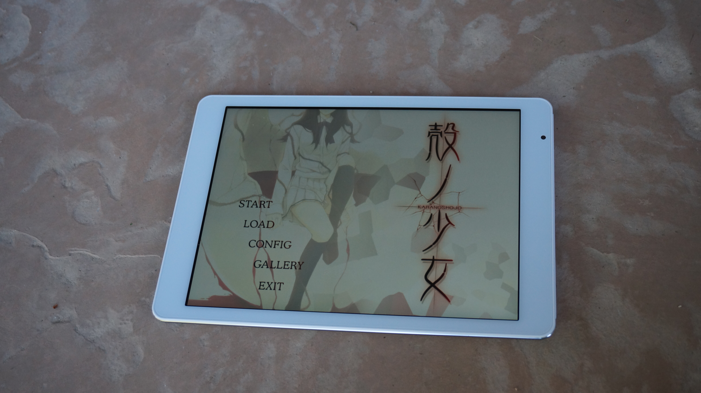

As for gaming, you have a wide selection of games to choose from, because you have
  both the android library of games and the windows library of games. Don’t expect to run demanding games on this: High
  resolution + Atom does not equal a great PC gaming experience. I’ve been playing a ton of lighter games on this though
  because it’s a portable windows machine and playing PC games on the go is all kinds of fun. If you follow what I
  normally write, you would probably know that I’m a big<a class="sc-1out364-0 hMndXN sc-145m8ut-0 gIacKn js_link" data-ga='[["Embedded Url","External link","https://rockmandash12.kinja.com/the-beginners-guide-to-visual-novels-1541975662",{"metric25":1}]]' href="https://rockmandash12.kinja.com/the-beginners-guide-to-visual-novels-1541975662" rel="noopener noreferrer" target="_blank"> Visual Novel</a> fan,
  and the primary reason I got this tablet was because of <a class="sc-1out364-0 hMndXN sc-145m8ut-0 gIacKn js_link" data-ga='[["Embedded Url","External link","http://rockmandash12.kinja.com/rockmandashs-guide-to-visual-novels-on-the-go-1686233801",{"metric25":1}]]' href="http://rockmandash12.kinja.com/rockmandashs-guide-to-visual-novels-on-the-go-1686233801" rel="noopener noreferrer" target="_blank">Visual Novels on the go</a>. Really, if this was all this review was about, I could
  rave on and on as this is absolutely amazing for that purpose, the best VN experience I’ve ever had, it’s sooo good
  and if you want a tablet for VNs, this is a no brainer at the price point it’s at. The 4:3 screen ratio is awesome
  here because almost all VNs are 4:3, and the screen makes them look really nice, especially on modern VNs which can
  render text at a higher resolution. 

<aside class="sc-1rh3ayr-6 jfFNjl inset--story branded-item branded-item--kinja" data-commerce-source="inset"><a class="sc-1out364-0 hMndXN sc-1rh3ayr-2 lcMGRt inset--story__thumb js_link" data-ga='[["Permalink page click","Permalink page click - inset photo"]]' href="https://rockmandash12.kinja.com/the-beginners-guide-to-visual-novels-1541975662" rel="noopener noreferrer" target="_blank">
<video autoplay="" loop="" muted=""><source src="dt2sgbswno93qzsckozl.mp4" type="video/mp4"/></video>
</a>

<a class="sc-1out364-0 hMndXN js_link" data-ga='[["Permalink page click","Permalink page click - inset headline"]]' href="https://rockmandash12.kinja.com/the-beginners-guide-to-visual-novels-1541975662" rel="noopener noreferrer" target="_blank"><h6 class="sc-1rh3ayr-3 jRIPES">
    Rockmandash's Beginner's Guide To Visual Novels</h6></a>

What exactly is a Visual Novel? Why should I care, and why are you talking about
      them? The Visual…
<a class="sc-1out364-0 hMndXN sc-1rh3ayr-0 kOvmIi js_readmore inset--story__readmore js_link" data-ga='[["Permalink page click","Permalink page click - inset read more link"]]' href="https://rockmandash12.kinja.com/the-beginners-guide-to-visual-novels-1541975662" rel="noopener noreferrer" target="_blank">Read more</a>

</aside>

As for the camera... it isn’t the worst thing I’ve seen with generally accurate colors and
a not horrible dynamic range, and the <a class="sc-1out364-0 hMndXN sc-145m8ut-0 gIacKn js_link" data-ga='[["Embedded Url","External link","http://imgur.com/a/xrmIP#0",{"metric25":1}]]' href="http://imgur.com/a/xrmIP#0" rel="noopener noreferrer" target="_blank">pictures I took</a> are pretty
acceptable for Facebook or Instagram posts, but do you really want to be shooting with a 9.7 inch Chinese <a class="sc-1out364-0 hMndXN sc-145m8ut-0 gIacKn js_link" data-ga='[["Embedded Url","Internal link","http://gizmodo.com/the-first-new-ipad-camera-shots-pretty-good-but-dont-5893176",{"metric25":1}]]' href="http://gizmodo.com/the-first-new-ipad-camera-shots-pretty-good-but-dont-5893176">tablet</a>? You’ll
probably have a better camera on your phone.

Also, this tablet has solid battery life (it better have solid battery life, given
  the 8500 mAh battery), giving me about 8 hours on my video loop test, where I had the screen on 50% bightness, playing
  my 720p rip of <em>Code Geass: Akito the Exiled</em> on loop on windows. Normally, it gets me through 1-2 days of
  usage during normal use, and I’ve had no issues with battery life in general. 
<h4 class="sc-1bwb26k-1 fvCjqJ" id="h110376"><strong>Like</strong></h4>
It’s a Dual Booting tablet,
  and the Dual Booting works really well. It’s great in almost every situation, and I don’t think I can come back from a
  Dual Booting tablet.  

It’s 200 dollars! Let that sink in. This is half the cost of the Nexus 9 and iPad
  Air 1, $300 Dollars cheaper than the Surface 3 and iPad Air 2, and it provides a great experience, something pretty
  different than your typical tablet. It’s the best windows tablet experience you can have south of the Surface 3, and
  it’s one of the better android experiences in that price range, if you don’t mind the larger size.
<h4 class="sc-1bwb26k-1 fvCjqJ" id="h110377"><strong>No Like</strong></h4>
It’s a budget Chinese tablet from a no name brand, and it’s an import. There’s no customer
  support, there’s little QC, setup is a pain, etc. When buying stuff like this, you run a risk, and this tablet has
  that risk.

The skin’s pretty gross. There’s some niceties in it, but the notification
  shade...

The placement of nearly everything is a joke. Buttons on the wrong side, all
  the ports near each other, and the cardinal sinner... Rear Facing speakers, not even side mounted... Who thought these
  were good ideas?

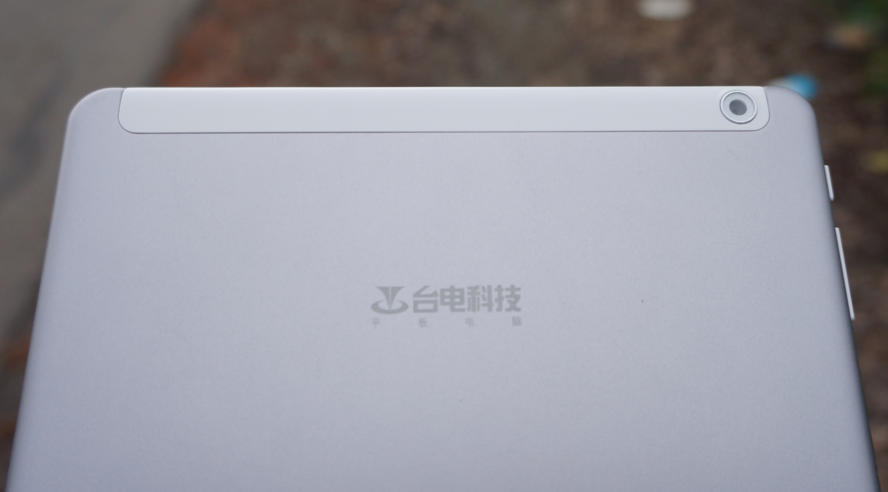<h3 class="sc-1bwb26k-1 fvCjqJ" id="h110378"><strong>Should You Buy
it?</strong></h3>
Maybe. If you can deal with the issues that it has, I’d say yes as it’s
a stellar value. I personally do not regret buying this one bit, but there are plenty of people that would be better
suited by a tablet from a tier 1 OEM. That being said, If you don’t mind not having customer service, dealing with
quirks that come with using a device like this, want a great experience, and an feature that you can’t find on a
regular device that makes the device so much better, you can’t go wrong here. The dream of Dual Booting Tablets is
finally realized, and it’s pretty great. 

For the low cost of $200 dollars, you’re getting a device that aims high and mostly
  succeeds at providing a great experience, one that has been consistently surprising me. I’d personally recommend the
  <a class="sc-1out364-0 hMndXN sc-145m8ut-0 gIacKn js_link" data-ga='[["Embedded Url","External link","http://techtablets.com/cube-i6-dual-os/review-2/",{"metric25":1}]]' href="http://techtablets.com/cube-i6-dual-os/review-2/" rel="noopener noreferrer" target="_blank">Cube i6 Air </a>over my teclast if you don’t need HDMI because it fixes the
  android build and other gripes, and but really, you can’t go wrong with these Dual Booting tablets.

<em>Kevin Mai - Rockmandash12 is a frequent writer of Visual
  Novels and anime on </em><a class="sc-1out364-0 hMndXN sc-145m8ut-0 gIacKn js_link" data-ga='[["Embedded Url","External link","http://rockmandash12.kinja.com/#_ga=1.122760139.1523386611.1417386122",{"metric25":1}]]' href="http://rockmandash12.kinja.com/#_ga=1.122760139.1523386611.1417386122" rel="noopener noreferrer" target="_blank"><em>his blog</em></a><em> and
  the </em><a class="sc-1out364-0 hMndXN sc-145m8ut-0 gIacKn js_link" data-ga='[["Embedded Url","External link","http://anitay.kinja.com/#_ga=1.107530946.1523386611.1417386122",{"metric25":1}]]' href="http://anitay.kinja.com/#_ga=1.107530946.1523386611.1417386122" rel="noopener noreferrer" target="_blank"><em>AniTAY Blog</em></a><em>, but does have a pretty deep interest
  in the world of Tech. If you’re interested, come check this out!</em> 

<aside class="sc-1rh3ayr-6 jfFNjl inset--story branded-item branded-item--kinja" data-commerce-source="inset">

<a class="sc-1out364-0 hMndXN js_link" data-ga='[["Permalink page click","Permalink page click - inset headline"]]' href="http://rockmandash12.kinja.com/#_ga=1.122760139.1523386611.1417386122" rel="noopener noreferrer" target="_blank"><h6 class="sc-1rh3ayr-3 jRIPES">
    RockmanDash Reviews</h6></a>

rockmandash12
<a class="sc-1out364-0 hMndXN sc-1rh3ayr-0 kOvmIi js_readmore inset--story__readmore js_link" data-ga='[["Permalink page click","Permalink page click - inset read more link"]]' href="http://rockmandash12.kinja.com/#_ga=1.122760139.1523386611.1417386122" rel="noopener noreferrer" target="_blank">Read more</a>

</aside>

