---
{
	title: "Thanks, Kyoto Animation.",
	published: "2019-07-30T12:00:00-04:00",
	tags: ["Rockmandash Rambles", "Kyoto Animation Appreciation Week", "KyoAni Appreciation Week", "Kyoto animation", "clannad", "Clannad: After Story", "Disappearance of Haruhi Suzumiya", "haruhi", "haruhi suzumiya", "KyoAni"],
	kinjaArticle: true
}
---

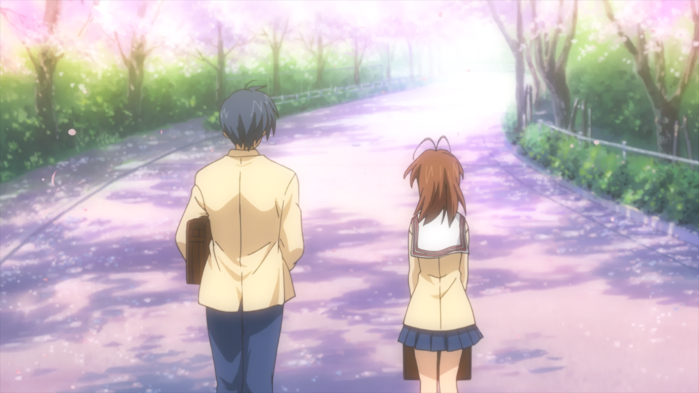

Kyoto Animation might be one of the most quintessentially anime companies out there. With their bright colors, heartfelt slice of life shows, and an extremely cute aesthetic, it’s hard not to associate them with them with anime and the culture that surrounds the medium. KyoAni, however, is a company unlike any other in the world of anime: Despite these defining traits, or maybe because of them, KyoAni excels in conveying strong, powerful messages that can resonate with the viewer on a deep, personal level. For me, seeing the tragic fire and all the news around it has been absolutely gut-wrenching because of how they’ve managed to shape my life for the better. But it’s because of their impact that I’d like to take a trip down memory lane and talk about some of the positives, rather than focusing on the tragedy. This is my journey with KyoAni through *Clannad* and *The Disappearance of Haruhi Suzumiya*, and I hope you join me in this journey as well.

**Just a warning - there will be slight spoilers for *Clannad* and the *Disappearance of Haruhi Suzumiya* in this article.**

***

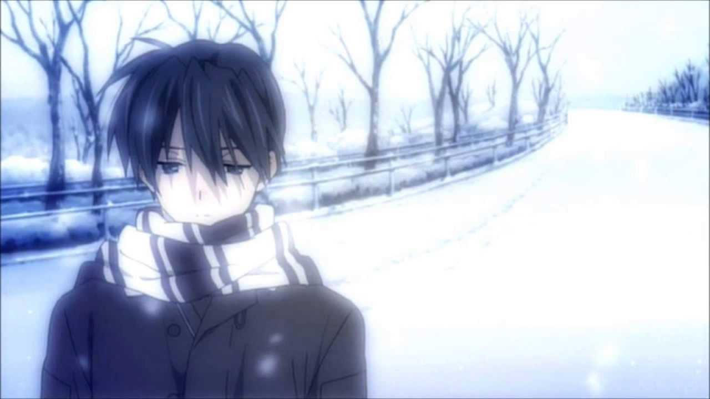

While other anime and other works of fiction might look to the world of fantasy, heroism, or other forms of escapism, one of the biggest reasons why I adore so many of KyoAni’s works is because they are inherently grounded to reality. Sure, they have their fantastical elements, but many of their shows are focused on the stories we have to tell in our modern society, our reality, and in the process have helped me find my footing in my reality. KyoAni has strived at making us reflect on the human relationships we have, and I have learned to love and appreciate the world around us because of them.

When I was in middle school in the late 00’s, my world was falling apart. My parents were considering getting divorced and were arguing constantly; being at home was complete misery. I grew up in a strict asian household, and my dad was tearing me apart with his constant aggression and criticism. He wanted me to be singularly focused on school, and in his pursuit of his ambitions for me having the best schooling possible, he did several things that really changed my life - he got mad at me whenever he saw me doing something unrelated to school, and he made me transfer to a school with better teaching on paper, but without anyone I really knew.

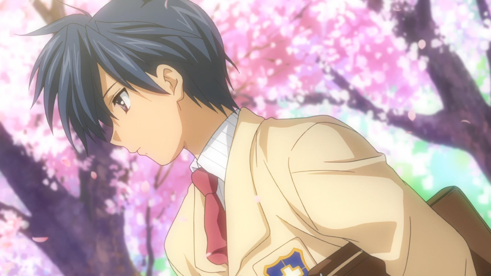

Back then, probably because what my dad told me was all that I knew, I was all in with what he had to say to me. I used to think that being smart and rich was the end-all be-all to life, and looked down on people who had different priorities in life. I never was the smartest kid in my class with an awful memory, but I tried my hardest so I wouldn’t be “like them”, people who I believed gave up on all pretenses of “living the good life” at an early age simply because they wanted to have fun. I had to be someone, had to do things, or else my life would be a failure. My dad would say stuff like “work hard for your first 20 years of your life, and you’ll be able to live easy for the rest of it”, and so I did - the result was me completely burning out, in middle school.

My grades started slipping as a result. Like any kid, I was into video games, and my dad saw this as the cause of my slipping grades. He destroyed my DS with a hammer, took off the door of my room, and sent me spiraling into depression. Nowhere was safe - depression permeated all aspects of life. I had no sense of privacy, I had no friends and being near family was just an awful experience. I felt like a husk of myself, I felt that everything important to me was going horribly wrong.

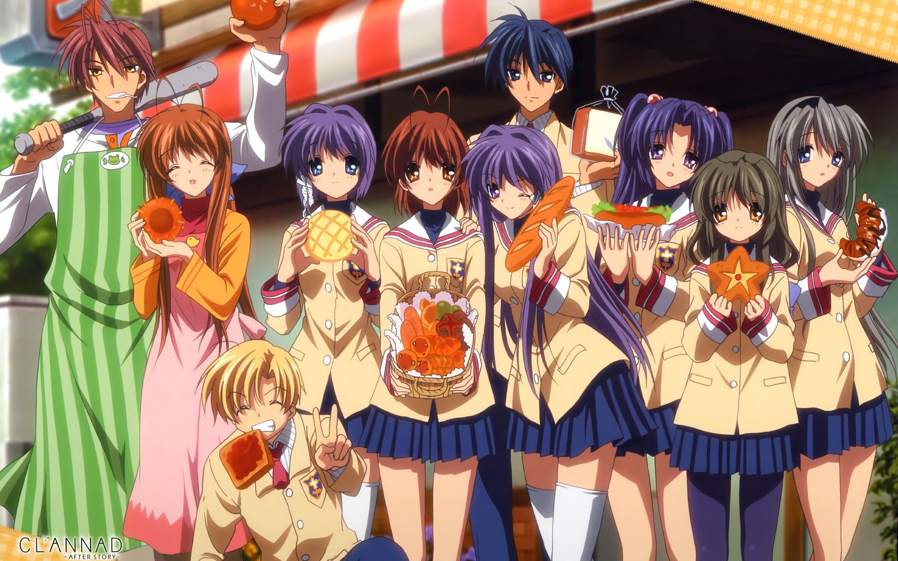

Thanks to Key and KyoAni’s* *[*Clannad*](https://rockmandash12.kinja.com/rockmandash-reviews-clannad-visual-novel-anime-1609437459), however, I started to look at things in a different light. I was starting to get into anime and visual novels at the time, reading stuff like* 999* and watching shows like *Soul Eater*, and before long, I stumbled across *Clannad*. It wasn’t a definitive cure to my depression or situation, but *Clannad* was the starting point in realizing that my outlook on both society and life wasn’t healthy. First and foremost, *Clannad* is about family, but not necessarily in the way you might associate family. The main character Tomoya Okazaki grew up in a tragic family situation - his mother died when he was young and his dad spiraled into depression as a result, becoming an insufferable drunk. He used to play basketball but could no longer play because he got into a fight with his father which injured his arm to the point where he could no longer raise it. He became a delinquent as a result, but through finding his “family” of friends and people he cared about, he found happiness.

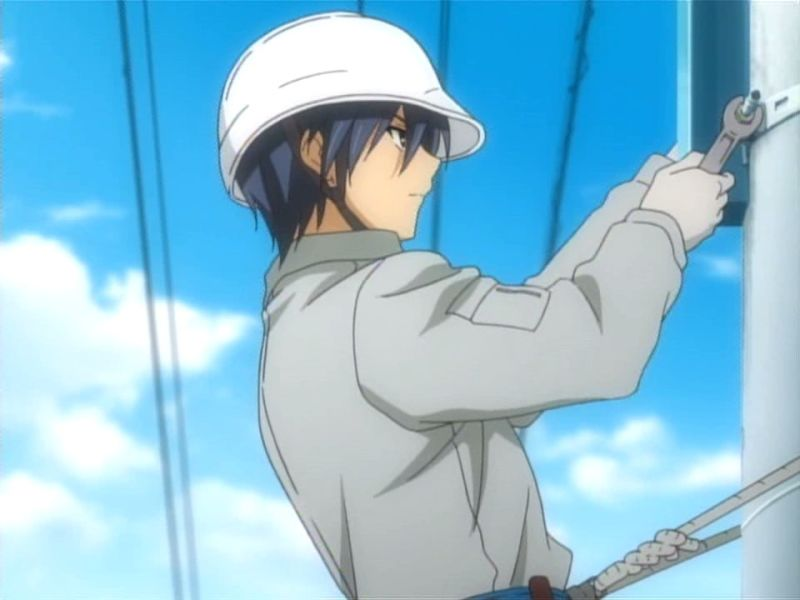

Even though he didn’t live a prestigious, wealthy life, he had a life that was fulfilling and meaningful. Even with a broken family, living a life despite being the epitome of everything my dad taught me to looked down at, Tomoya was someone who made the best of their situation, and with results that I would say was certainly better than where I was at the time. While in my singularly focused attempt to strive for what my dad told me, I found nothing but misery. It was the perfect work for me at the perfect time, it made me realize that the life I lived was one driven by falsehoods. Sure, higher education is something to strive for; sure, becoming someone is nice; but it isn’t everything. Living with people you care about, finding happiness in the life you live is far more important than whatever you become - if you’re miserable living your life, no amount of success means anything. I’m genuinely disappointed to say, but it took* Clannad *for me to realize that everyone is human, and there’s no reason to be classist - everyone’s trying their best, the difference is fighting against the circumstances that they’re put in.

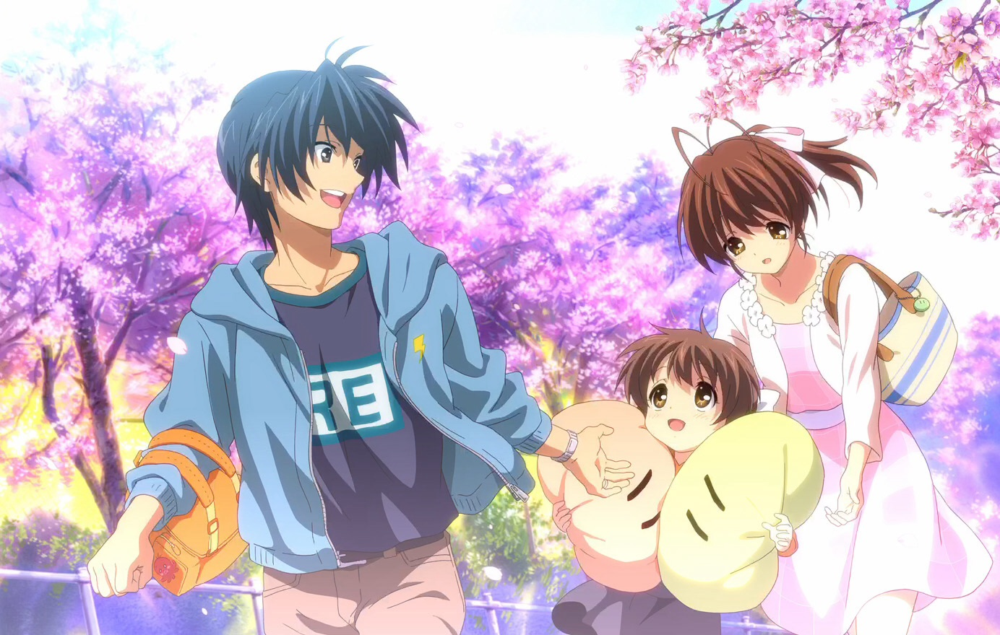

I was inspired to view these troubling times as a way to make me stronger. *Clannad*’s positive outlook on the world was a turning point in my life, and I was determined to live a happy life instead of a successful life. Consequently, I started being more outgoing, making friends and studying in groups when I was struggling. I aspired to be a better person, and to increase my self-esteem rather than belittle or undervalue myself. Thanks to KyoAni and Key, my life has drastically changed, legitimately more than almost any event in my life.

***

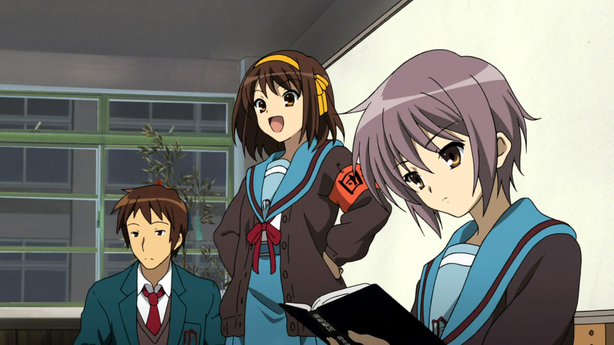

No other work will ever compare to the impact that *Clannad* will have on my life, but that’s not to say other works haven’t had a lasting impact on my life, like *The Disappearance of Haruhi Suzumiya*. The *Haruhi* series is a fundamentally different kind of show, and to be honest, I couldn’t stand it on my first watch. The first part of the series, *The Melancholy of Haruhi Suzumiya* is a show about nonsensical events, in a nonsensical order. It’s a show about a wacky girl who strives for the unnatural and never finds it, but because of her desire to be unique, unnatural things happen all around her. Time-travelers, aliens, and espers play a significant role in the show, and as someone who doesn’t particularly find much value in the fantastical, Haruhi’s antics really didn’t do much for me, but I kept watching primarily because of Kyon.

Kyon is a peculiar lead: even though he acts like he’s bothered by the overly energetic Haruhi dragging him everywhere for whatever shenanigans she has planned, he doesn’t fight against Haruhi’s actions that much. Even though the show portrays Kyon to the audience as a straight man that just wants normality in his life, it is honestly unclear if he truly dislikes these events. He’s a kid who grew up wanting to be a superhero, wanting for all of these things to happen someday, even if he gave up years back.

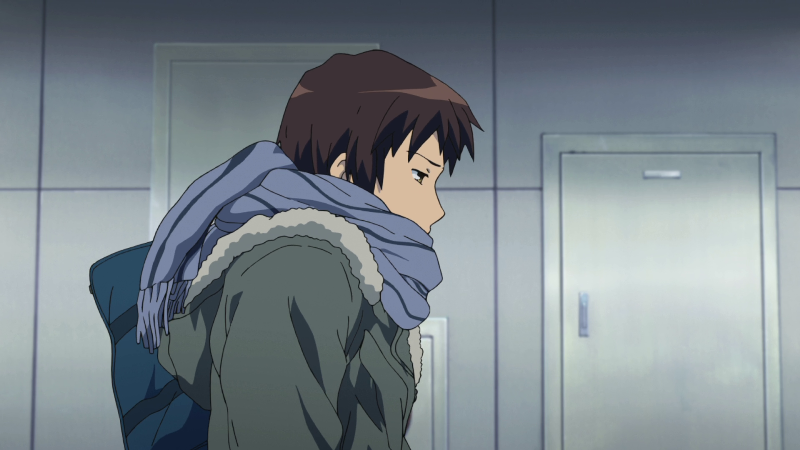

All of this changes with the [*Disappearance of Haruhi Suzumiya*](https://anitay.kinja.com/the-perfect-day-to-watch-one-of-my-favorite-anime-movie-1672053100). Suddenly, on one random day, everything changes. Gone are the aliens, time-travelers, and espers; gone are all the antics; gone is the titular character of the series, Haruhi Suzumiya; and KyoAni does such an amazing job at conveying this loss to the audience.

I’m a sucker for a work that can capture an atmosphere, and almost nothing captures the beautifully melancholic feeling of winter quite like *Disappearance. *KyoAni then one-ups that by transitioning that melancholic feeling into the loss of something you hold dear. This movie sucks you into a world where the things you take for granted are suddenly gone. Even if you think something can be a burden on first impression, there’s so many positives to going along with people you know and love. Everything’s the same, but there’s something terribly wrong about the situation we’re in: all the colors, all the vibrance of the daily scenes you passed by are now gone. It’s an incredibly engaging and moving movie, easily one of my favorites of all time.It’s so easy to take for granted the life we have and to be dismissive of the events to disconnect from your surroundings, but by doing so, we ignore what we hold near and dear to our hearts. Kyon was faced with this, given the life he said he wanted so much, but this change made him realize something he never would have otherwise. Instead of thinking about the SOS Brigade with disdain as he often did, Kyon found himself truly loving and appreciating them in their absence. Kyon grew leaps and bounds in the movie, accepting that it’s okay to be childish at times, able to let his true feelings out that he truly loves being with Haruhi, loves the antics, and to love the life he lives.

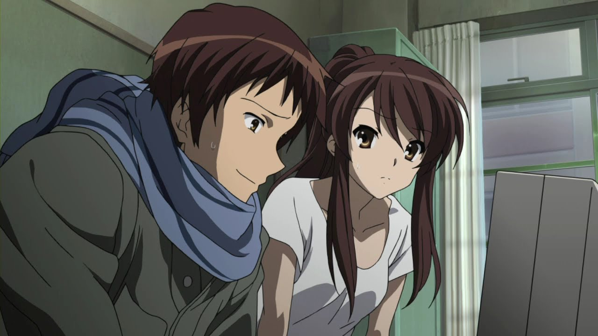

Unfortunately, we don’t have that privilege to go to a place where everything’s fine and dandy like in a film. We’re here on this Earth, a world where many people who have created such works near and dear to our hearts are no longer with us. But what I took from this film, and what others should take from this film in the wake of these events is not the desire to go back, but the appreciation for what we had. I think just as many of us facing this tragedy, KyoAni meant a lot more to me than I would have ever admitted weeks before these events. I took them for granted, and am now finding myself in a world that is entirely bizarre. I don’t understand why anyone would want to do such a senseless act of violence to people who have helped countless people.<!-- --> I have a hard time even grasping that these events actually happened. But even so, with these events, we are now going to have to live with the fact that some of the people who were incredibly influential in the creation of these works that have had significant impacts on our lives are now gone. But instead of wallowing in despair, we have to move on, and the company that’s allowed me to move on is the very same company we’re all talking about - the company which made works that let me appreciate what we took for granted: KyoAni.

***

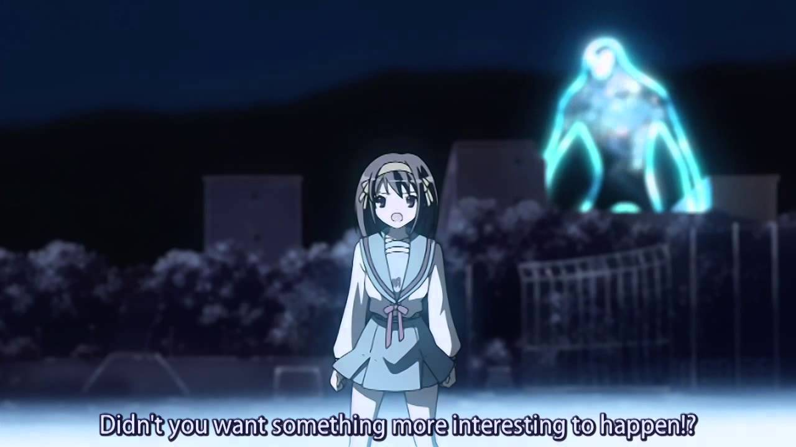

I think a lot of people tend to describe anime as an inherently escapist medium. From extraordinarily bright and colorful isekai worlds to fantastical stories that show feats of heroism from otherwise ordinary high school students, anime is often looked down upon because of how unrealistic it can be. My dad certainly treated it like such, and talking to many older people in the west, they certainly see it to be the case.

I feel these same people also tend to extrapolate this description to the fans of the medium, assuming that the reason people watch anime is because they want to avoid their drab and boring lives. They use this as an excuse to look down upon anime fans, but anime and the effects that they have on people is the furthest thing from these assumptions in my experience. It’s so easy to lose yourself in your thoughts, falling deeper and deeper into the spiral of your singular mindset. Without anime and KyoAni, I never would have been able to look at life in a way that is healthy and sustainable. Without them, I never would have been able to appreciate what I otherwise would have taken for granted.

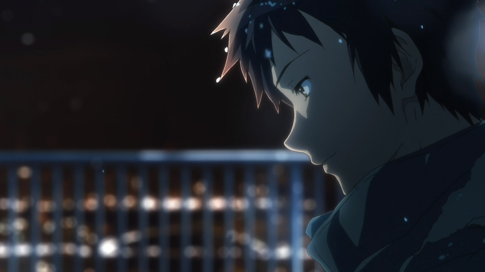

So, KyoAni: Thanks. Thanks for helping me get through dark times, thanks for making me a better person, and thanks for helping me look at my life and our world in a more positive manner. Regardless of what happens in the future, I will always hold KyoAni near and dear to my heart, and even if things go bad, I’ll always appreciate the works that have moved me and allowed me to find my footing in reality. Thanks for everything, and even though the current situation isn’t great, I wish KyoAni the best, just as they did for me in my moment of need.

***

*Thanks for reading, this is my article for the *[*KyoAni Appreciation Week*](https://anitay.kinja.com/announcing-kyoani-appreciation-week-s-1836579367)* and I hope you enjoyed it. Linked here are my KyoAni articles, so if you liked this one feel free to check those out.*

