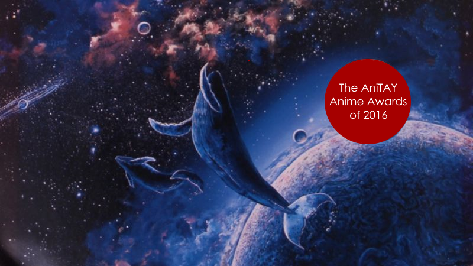
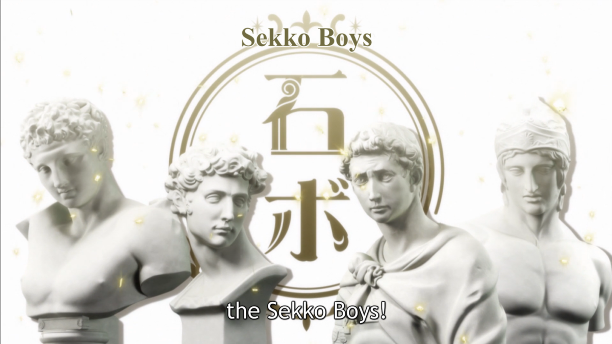
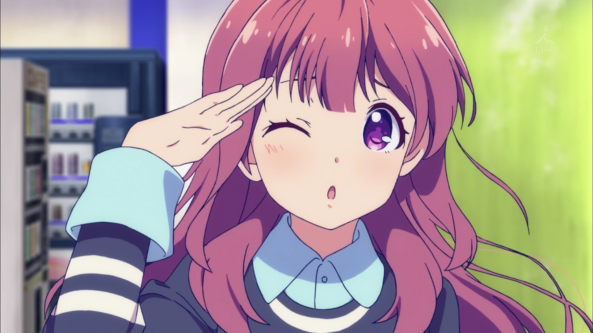

---
{
	title: "The AniTAY Anime Awards 2016: Suggestions & Voting",
	published: "2017-01-04T00:00:00-05:00",
	tags: ["The AniTAY Anime Awards", "The AniTAY Awards", "2016", "Anime", "AniTAY", "Ani-TAY Collaboration", "AniTAY Collaboration"],
	kinjaArticle: true
}
---

The end of the year always causes reminiscing, where we try to define the time spent. As a result, top lists and awards quickly arise, and here at AniTAY, we are not immune. So, when we saw that others were doing Anime Awards in the style of The Game Awards, we thought we’d do it with our own spin. Welcome to The *AniTAY Anime Awards* of 2016!

The AniTAY Anime Awards is a collaborative effort by members in the AniTAY community to decide the best of the best of this year. However we always try to put our own spin on these kinds of projects because when we see groups that don’t leverage different opinions, the results can radically differ from what the actual viewer think, and offer little choice. That’s why this Award process is open to you!

This article will cover the nominations selected by AniTAY members mucking around on a Google Docs sheet. While what we got here is pretty good, AniTAY is a community, and we can’t do this without everyone’s help! If you see anything missing or have any suggestions (outside of the OP/ED category, editing that is an effort in futility, and we’re probably going to make a separate collab for that) [fill out this form](https://goo.gl/forms/vkQpnunBrOHtReiz1) and I’ll try to take suggestions and add it to the list. Suggestions will be closed on 1/2/2017.

As a community effort, We will also let everyone have a voice in the awards as well. We’ll be doing this by having 2 awards, the Author’s Awards and the Reader’s Awards! This way we can keep our voice while including everyone in the process! Make your vote count by [filling this form here](https://goo.gl/forms/eNBI7yvgsD9EzHXS2). Voting will be closed 1/9/2017, when we release the results in it’s own separate article.

Anyways, enough about the Awards, you’re here to see what we think: Here are the nominees! (Note: It has been decided to push *Your Name* until next year’s awards so more people can have the opportunity to watch the film, so it will not be nominated here.)

***

## Anime of the Year

<video src="./kimbbtm2pcggwob3jorq.mp4"></video>

Here’s the category you’re all here for: Anime of the Year. There’s been a lot of great shows this year, but here’s the best. From Comedy to Fantasy to Drama, these are the shows we were immersed in, made us laugh or cry, and made us fall in love: The Best Anime of 2016.

#### Nominees:

* *Rakugo*
* *Konosuba*
* *Re:Zero*
* *Tanaka-Kun*
* *Flying Witch*
* *91 Days*
* *Mob Psycho 100*
* *Yuri on Ice*
* *Flip Flappers*
* *Haikyuu*

***

## Hidden Gems (Under 60k)

<video src="./jqslzqzwxiosf4reknya.mp4"></video>

Shows that unfortunately flew under the radar and didn’t get the attention they deserved. While the seasonal favorites were making waves, these obscure shows were glimmering treasures waiting to be discovered. The number of viewers (going by MAL) was way below 60,000—and sometimes not even half of that. These are the hidden gems of 2016.

#### **Nominees:**

* *Bubuki Buranki*
* *Space Patrol Luluco*
* *Amanchu!*
* *MGRP*
* *Flip Flappers*
* *Girlish Number*
* *Macross Delta*
* *Anne-Happy*

***

## Best Drama

*‘Cause I feeeeeeel!* The Best Drama Award is for the shows that give us a major case of the feels. They can move you to tears and give you characters to empathize with—some you may find a lot in common with. Say hello to the Best Dramas of 2016.

#### **Nominees:**

* *Rakugo*
* *The Great Passage*
* *March comes in like a Lion*
* *91 Days*
* *ReLIFE*
* *Shelter*
* *Grimgar*
* *Koyomimonogatari*
* *Durarara!!*
* *Food Wars*
* *Haikyuu!!*
* *Euphonium 2*
* *Re:Zero*
* *Joker Game*
* *Planetarian*

***

## Best Animated

<video src="./jb4gginmkrben9appmq7.mp4"></video>

What do you watch anime for? Maybe great story, great music, or something else, but many watch shows for visuals, shows that look stunning at every moment. These are the shows that had the most fluid animation, looked amazing or more: The best Animated shows of 2016.

#### **Nominees:**

* *Thunderbolt Fantasy*
* *Flip Flappers*
* *March Comes in Like a Lion*
* *Ping Pong Girls*
* *Concrete Revolutio*
* *Shelter*
* *Tales of Zestiria the X*
* *Mob Psycho 100*
* *Kabaneri*
* *The Great Passage*
* *Grimgar*
* *Kiznaiver*

***

## Best Action

<video src="./zbswsqgjujk7sb3om4dd.mp4"></video>

*Action*! These are the shows that get your blood pumping, and your adrenalin skyrocketing. Animation that excel in the fast, the frenetic, the flashy and the weighty. Shows that make you feel every punch, soar every flight, and leaves you breatheless with every exertion. To those shows whose kineticism is made tangible, we honor with our “Best Action” Award.

#### **Nominees:**

* *Thunderbolt Fantasy*
* *Mob Psycho 100*
* *Jojo Part 4*
* *My Hero Academia*
* *Bungou Stray Dogs*
* *Ushio to Tora*
* *Flip Flappers*
* *Kabaneri*
* *Concrete Revolutio*
* *Drifters*
* *Mobile Suit Gundam: Iron-Blooded Orphans*

***

## Best Comedy

<video src="./gzahxl3mthgc7bsgoomk.mp4"></video>

Some shows try to make you fall in love with a story, others try to wow you with spectacle. Others, like the shows here, try to put a smile on your face, to get you laughing out loud: These are the best comedies of 2016!

#### **Nominees:**

* *Kiss Him Not Me*
* *Tanaka-kun*
* *Mayoiga*
* *KonoSuba*
* *Handa-kun*
* *Sakamoto-kun*
* *Osomatsu-kun*
* *Luluco-chan*
* *Anne Happy*
* *Assassination Classroom*
* *Keijo!!!!!!!!!*
* *Girlish Number*
* *www.Working!!*
* *Dagashi Kashi*
* *Sekkou Boys*
* *Please Tell Me! Galko-chan*
* *Bannanya (Nyaa~)*
* *Flying Witch*

***

## Best Romance

<video src="./gwknvvj9nqq05uhxzfda.mp4"></video>

Romance shows: The shows that get our hearts stirring, those that get us thinking in love dodecahedrons and more. These are the shows we loved to love, the Best Romance shows of 2016.

#### **Nominees:**

* *Rakugo*
* *Yuri on Ice*
* *Planetarian*
* *Super Lovers*
* *Netoge*
* *Oji-san to Marshmallow*
* *Orange*
* *Kiznaiver*
* *Snow White with the Red Hair*
* *ReLIFE*

***

## Best Slice-of-Life

<video src="./fe4vqfdrfhpibtqlwp0p.mp4"></video>

Sometimes it’s the simple things in life that are the sweetest, most touching, most profound, or simply the most enjoyable. This award celebrates those shows that don’t need big overarching plots or extraordinary events to keep us interested, but instead invests us in wanting to experience the small slices of ordinary daily life that their characters go through. These are your Best Slice-of-Life Anime for 2016:

#### **Nominees:**

* *New Game!!*
* *Amanchu!*
* *Flying Witch*
* *Anne Happy*
* *Sweetness and Lightning*
* *Tanaka-kun*
* *Love Live Sunshine*
* *www.Working!!*
* *Udon*

***

## Best Sports Anime

<video src="./k8lr4hjofcciebz3xqrt.mp4"></video>

While many people don’t watch sports anime due to fears of them being like animated lets plays or something like that, those who watch these know what those people are missing out. These are some of the best shows of the year, shows about teamwork, shows with amazing stories about the people who make the cast up, some of the best animation of the year, etc: these are the best sports anime of the year.

* *DAYS*
* *Battery*
* *Keijo!!!!!!!!*
* *Ping Pong Girls*
* *March Lion*
* *Yuri on Ice*
* *Haikyuu*
* *Bakuon!!*
* *Tiger Mask*

***

## **Best OP**

This year was absolutely flooded with top quality OPs, but these were the ones to best combine stunning visuals with amazing songs. These were the OPs you just could not skip no matter what.

#### **Nominees:**

* *Yuri on Ice*
* *Drifters*
* *March Comes in Like a Lion*
* *Thunderbolt Fantasy*
* *Occultic;Nine*
* *Kabaneri of the Iron Fortress*
* *Rakugo*
* *Tanaka-kun*
* *Mob Psycho 100*
* *Durarara!!*
* *91 Days*
* *Amanchu!*
* *Sakamoto*
* *New Game!*
* *Bubuki Buranki*
* *Danganronpa*
* *Big Order*
* *Erased*
* *Joker Game*
* *Kiznaiver*
* *Ninja Girl & Samurai Master*
* *Jojo’s Bizarre Adventure*
* *Poco’s Udon World*

***

## **Best ED**

Many people like to skip the ED, but this year made that a harder task to do than usual, as we were gifted with an unusually large crop of addicting EDs. Some of these EDs were so good they even made us wish the episode would end just so we could see them again, even if we loved the show they were attached to.

#### **Nominees:**

* *Yuri on Ice*
* *March Comes in Like a Lion*
* *Bubuki Buranki*
* *Kabaneri of the Iron Fortress*
* *Flip Flappers*
* *Luluco*
* *Tanaka-kun*
* *SEKKO BOYS*
* *Assassination Classroom*
* *Mob Psycho 100*
* *Re:Zero*
* *Sweetness & Lightning*
* *ERASED*
* *Konosuba*
* *Bungo Stray Dogs*
* *Magical Girl Raising Project*
* *Jojo’s Bizarre Adventure*
* *Poco’s Udon World*
* *Grimgar*

***

## **Best Male Character**

This year gave us quite a large range of characters taking the spotlight, and this couldn’t be better seen than in the *Best Male Character *nominees. Everything from figure skaters and manga artists to plaster busts, this year had it all.

#### **Nominees:**

* Ohta (*Tanaka-Kun*)
* Tanaka (*Tanaka-Kun*)
* Kikuhiko (*Rakugo*)
* Sukeroku (*Rakugo*)
* Cmdr. Itami (*GATE*)
* Kazuma (*Konosuba*)
* Subaru (*Re:Zero*)
* A plaster bust of Mars (*SEKKO BOYS*)
* A plaster bust of St George (*SEKKO BOYS*)
* A plaster bust of Hermes (*SEKKO BOYS*)
* A plaster bust of Medici (*SEKKO BOYS*)
* Yuri Katsuki (*Yuri on Ice*)
* Yuri Plisetsky (*Yuri on Ice*)
* Viktor Nikiforov (*Yuri on Ice*)
* Satoru Fujinuma (*ERASED)*
* Josuke Higashikata (*JoJo’s Bizarre Adventure*)
* Reigen (*Mob Psycho 100*)

***

## **Best Female Character**

The bold, the brash, the rejected, and the moe- 2016 brought plenty of endearing choices to make the race for *Best Female Character *a widely debated discussion in anime circles.

#### **Nominees:**

* Myaano (*Tanaka-kun*)
* Shiraishi (*Tanaka-kun*)
* Ecchizen (*Tanaka-kun*)
* EKUSUPUROSION! (Megumin from* Konosuba*)
* Aqua (*Konosuba*)
* Darkness (*Konosuba*)
* Everyone in *New Game!*
* Chitose (*Girlish Number*)
* Satoru’s mom (*ERASED*)
* Yukako Yamagishi (*JoJo’s Bizarre Adventure*)
* Reimi (*JoJo’s Bizarre Adventure*)
* Mary (*Grimgar*)
* Rem (*Re:Zero*)
* Ram (*Re:Zero*)
* Emilia (*Re:Zero*)
* YAYAYA (*Bloodivores*)

***

## AniTAY Favorites(?)

<video src="./dliz934mi0i5llsx2qdi.mp4"></video>

Last but not Least, AniTAY Favorites! This is one we included to spice things up, to make this list truly our own. These are shows that AniTAY was fixated on, either loved or discussed about for days on end. Take a look at what makes AniTAY, AniTAY!

#### **Nominees:**

* *Schwarzesmarken*
* *Jojo’s Bizzare Adventure*
* *Tanaka-kun/Sakamoto*
* *Big Order*
* *Keijo*
* *Macross Delta*
* *ConRev*
* *Bloodivores*
* *Orange*
* *Mayoiga*
* *Flip Flappers*

***

*Thanks for checking out AniTAY and the AniTAY Anime Awards!* *Ani-TAY is the anime-focused portion of Kotaku’s community-run blog, Talk Amongst Yourselves where writers love everything anime related. Click *[*here*](http://anitay.kinja.com/)* to check us out, and remember to participate by*[* suggesting *](https://goo.gl/forms/vkQpnunBrOHtReiz1)*and *[*voting*](https://docs.google.com/forms/d/e/1FAIpQLScVJxYTUaCx6r2axf-yfsSoBVMVSHoEJFFjvc8fHgaBDetBWQ/viewform?c=0\&w=1)*!*
