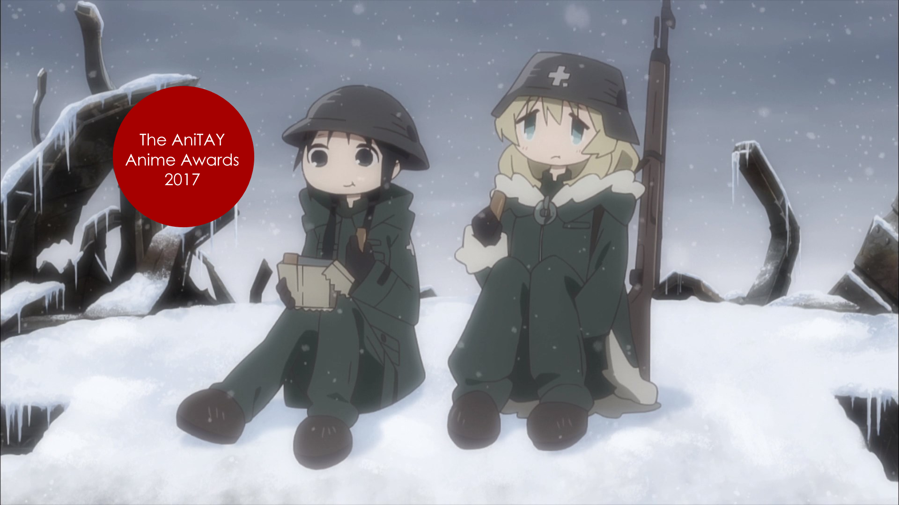

---
{
	title: "The AniTAY Anime Awards 2017 : Suggestions & Voting",
	published: "2018-01-11T19:15:00-05:00",
	tags: ["The AniTAY Anime Awards", "2017", "AniTAY", "anitay collaboration", "Ani-TAY Collaboration"],
	kinjaArticle: true
}
---

At the end of every year, everyone seems to reminisce back on the events we witnessed, and we try to define the time that just passed in all sorts of ways. One such method is top lists and Awards, and here at AniTAY, we are not immune in this behavior. Returning from last year is The *AniTAY Anime Awards, *a collaborative effort by members in the AniTAY community to decide the best of the best of what 2017 had to offer, and we would love your help.

AniTAY has always been community first, and we always try to put our own community spin on these kinds of projects because the different opinions fed by the diversity of the community leads to better results. That’s why this Award process is open to everyone!

This article will cover the nominations selected by AniTAY members mucking around on a Google Docs sheet. While what we got here is pretty good, we can’t do this without everyone’s help! If you see anything missing or have any suggestions [fill out this form](https://docs.google.com/forms/d/e/1FAIpQLSfFTID83kA7-v3EbQp0S80PXW2QKyZR75n6CArlSfj80_zyFA/viewform?usp=sf_link) or post comments on the sheet and I’ll try to take suggestions and add it to the list. Suggestions will be closed on 1/8/2017.

Like last year, we’ll be running 2 awards, the Author’s Awards and the Reader’s Awards. This way we can keep our voice while including everyone in the process. Make your vote count by [filling this form here](https://docs.google.com/forms/d/e/1FAIpQLSfWLv6b2MOGUW1nDgTScNm8skFpBfa5GuC0lgwtbaO-lM5xmg/viewform?usp=sf_link). Voting will be closed 1/15/2017, when we release the results in a separate article.

Anyways, enough about the Awards, you’re here to see what we think: Here are the nominees! (Note: *Your Name* was pushed to this year’s awards so more people would have the opportunity to watch the film)

***

# **Anime of the Year**

<video src="./smc2tznc3jnh4rp74nvj.mp4"></video>

Here’s the category you’re all here for: Anime of the Year. There’s been a lot of great shows this year, but here’s the best. From Comedy to Fantasy to Drama, these are the shows we were immersed in, made us laugh or cry, and made us fall in love: The Best Anime of 2017.

**Nominees:**

* *Your Name*
* *Silent Voice*
* *Saga of Tanya the Evil*
* *Konosuba S2*
* *Miss Kobayashi’s Dragon Maid*
* *Descending Stories: Showa Genroku Rakugo Shinju S2*
* *ACCA: 13th Territory Inspection Department*
* *My Hero Academia S2*
* *Attack on Titan S2*
* *Tsukigakirei*
* *Made in Abyss*
* *Owarimonogatari S2*
* *Recovery of an MMO Junkie*
* *Ancient Magus Bride*
* *Kekkai Sensen & Beyond*
* *Land of the Lustrous*
* *Girls Last Tour*

***

# **Hidden Gems (Under 70k)** 

<video src="./lgstraeqvzz3qslpdeho.mp4"></video>

Shows that unfortunately flew under the radar and didn’t get the attention they deserved. While the seasonal favorites were making waves, these obscure shows were glimmering treasures waiting to be discovered. The number of members (going by MAL) was way below 70,000—and sometimes not even half of that. These are the hidden gems of 2017.

**Nominees:**

* *Land of the Lustrous*
* *March comes in like a lion S2*
* *Konohana Kitan*
* *ACCA: 13-ku Kansatsu-ka*
* *GARO: Vanishing Line*
* *Symphogear AXZ*
* *Descending Stories: Showa Genroku Rakugo Shinju S2*
* *Kemono Friends*
* *KADO: The Right Answer*
* *Tsugumomo*
* *18if*

***

# **Best Animated**

<video src="./slxwa1ii9wuwkprurjch.mp4"></video>

What do you watch anime for? Maybe great story, great music, or something else, but many watch shows for visuals, shows that look stunning at every moment. These are the shows that had the most fluid animation, looked amazing or more: The best Animated shows of 2017.

**Nominees:**

* *Miss Kobayashi’s Maid Dragon*
* *Saga of Tanya the Evil*
* *Little Witch Academia*
* *My Hero Academia S2*
* *Re:Creators*
* *Touken Ranbu*
* *Made in the Abyss*
* *Land of the Lustrous*
* *Ancient Magus Bride*
* *Girls’ Last Tour*

***

# **Best Action**

<video src="./rgdpquhllioiviwbmdtj.mp4"></video>

*Action*! These are the shows that get your blood pumping, and your adrenalin skyrocketing. Animation that excel in the fast, the frenetic, the flashy and the weighty. Shows that make you feel every punch, soar every flight, and leaves you breatheless with every exertion. To those shows whose kineticism is made tangible, we honor with our “Best Action” Award.

**Nominees:**

* *Saga of Tanya the Evil*
* *Attack on Titan S2*
* *My Hero Academia S2*
* *Re:Creators*
* *Inuyashiki*
* *Touken Ranbu*
* *Kekkai Sensen & Beyond*
* *Juuni Taisen*
* *GARO: Vanishing Line*
* *Food Wars S2*

***

# Best Drama

<video src="./fhlsxlkg8myrowcvimzr.mp4"></video>

‘Cause I feeeeeeel! The Best Drama Award is for the shows that give us a major case of the feels. They can move you to tears and give you characters to empathize with—some you may find a lot in common with. Say hello to the Best Dramas of 2017.

**Nominees:**

* *Your Name*
* *Silent Voice*
* *Scum’s Wish*
* *Descending Stories: Showa Genroku Rakugo Shinju S2*
* *ACCA: 13th Territory Inspection Department*
* *Tsuki ga Kirei*
* *Saekano S2*
* *Made in Abyss*
* *Inuyashiki*
* *Koi no Uso (Love and Lies)*
* *March comes in like a lion S2*
* *Recovery of an MMO Junkie*
* *Just Because*

***

# **Best Romance**

<video src="./yrkmgvmxarizdu6t2mri.mp4"></video>

Romance shows: The shows that get our hearts stirring, those that get us thinking in love dodecahedrons and more. These are the shows we loved to love, the Best Romance shows of 2017.

**Nominees:**

* *Your name*
* *Silent Voice*
* *Scum’s Wish*
* *Saekano S2*
* *Tsukigakirei*
* *Koi to Uso (Love and Lies)*
* *Tsurezure Children*
* *Welcome to the Ballroom*
* *Just Because!*
* *Recovery of an MMO Junkie*

***

# **Best Comedy**

<video src="./zpeib7ifqevun7v3kcif.mp4"></video>

Some shows try to make you fall in love with a story, others try to wow you with spectacle. Others, like the shows here, try to put a smile on your face, to get you laughing out loud: These are the best comedies of 2017!

**Nominees:**

* *Konosuba S2*
* *Maid Dragon*
* *Interviews With Monster Girls*
* *Gabriel DropOut*
* *Love Tyrant*
* *Sakura Quest*
* *Gamers!*
* *Tsurezure Children*
* *Aho Girl*
* *New Game!!*
* *Blend S!*
* *Umaru-chan S2*

***

# **Best OP**

This year was absolutely flooded with top quality OPs, but these were the ones to best combine stunning visuals with amazing songs. These were the OPs you just could not skip no matter what.

**Nominees:**

* *18if*
* *ACCA: 13-ku Kansatsu-ka*
* *Alice & Zoroku*
* *Welcome to the Ballroom*
* *Gabriel DropOut*
* *Inuyashiki*
* *Kakegurui*
* *Miss Kobayashi’s Dragon Maid*
* *Ancient Magus Bride*
* *Re:Creators*
* *KADO: The Right Answer*
* *Attack on Titan S2*
* *Made in Abyss*
* *Love Tyrant*
* *Saga of Tanya the Evil*
* *Girls’ Last Tour*
* *Blend S*
* *Konosuba S2*

***

# **Best ED**

Many people like to skip the ED, but this year made that a harder task to do than usual, as we were gifted with an unusually large crop of addicting EDs. Some of these EDs were so good they even made us wish the episode would end just so we could see them again, even if we loved the show they were attached to.

**Nominees:**

* *Kakegurui*
* *Miss Kobayashi’s Dragon Maid*
* *Scum’s Wish*
* *KADO: The Right Answer*
* *Saga of Tanya the Evil*
* *Eromanga Sensei*
* *Umaru Chan*
* *Girls’ Last Tour*

***

# **Best Male Character**

<video src="./vrxaulsim9lkqkt4bs4e.mp4"></video>

This year gave us quite a large range of characters taking the spotlight, and this couldn’t be better seen than in the *Best Male Character *nominees. Everything from figure skaters and manga artists to plaster busts, this year had it all.

**Nominees:**

* *Kiriyama Rei *- March comes in like a lion S2
* *Harunobu Nikaidou* - March Comes in like a Lion S2
* *Zouroku *- Alice & Zoroku
* *Inuyashiki Ichirou* - Inuyashiki
* *Ainsworth Elias* - Ancient Magus Bride
* Araragi Koyomi - Owarimonogatari S2
* Reg- Made in Abyss
* Takahashi Sensei - Interviews with Monster Girls
* Phos - Land of the Lustrous (¯\\\_(ツ)\_/¯)

***

# **Best Female Character**

<video src="./qjdtamzp0hbun7cobeou.mp4"></video>

The bold, the brash, the rejected, and the moe- 2017 brought plenty of endearing choices to make the race for *Best Female Character *a widely debated discussion in anime circles.

**Nominees:**

* Kawamoto Momo - March Comes in like a lion S2
* Kamui Kanna - Miss Kobayashi’s Dragon Maid
* Tooru / Kobayashi - Miss Kobayashi’s Dragon Maid
* Hatori Chise - Ancient Magus Bride
* Suzukaze Aoba - New Game!!
* Yagami Kou - New Game!!
* Chikojouin Magane - Re:Creators
* Oshino Ougi - Owarimonogatari S2
* Chain Sumeragi- BBB\&B
* Mordred- Fate/Apocrypha
* Guri - Love Tyrant
* Mafuyu Hoshikawa - BLEND-S
* Shizuku Ichijo - Alice & Zoroku
* Riko - Made in Abyss
* Phos - Land of the Lustrous (¯\\\_(ツ)\_/¯)
* Konatsu - Rakugo

***

# AniTAY Favorites(?)

<video src="./w5emiibmrll494wgwxzi.mp4"></video>

Last but not Least, AniTAY Favorites! This is one we included to spice things up, to make this list truly our own. These are shows that AniTAY was fixated on, either loved or discussed about for days on end. Take a look at what makes AniTAY, AniTAY! (Note: This section is very much subject to change)

**Nominees:** 

* *Black CLOOOOOVEEEER*
* *Tsukigakirei*
* *Descending Stories: Showa Genroku Rakugo Shinju S2*
* *Love Tyrant*
* *Eromanga-sensei*
* *Land of the Lusterous*
* *Girls’ Last Tour*
* *GARO: Vanishing Line*

*Thanks for checking out AniTAY and the AniTAY Anime Awards!* *Ani-TAY is the anime-focused portion of Kotaku’s community-run blog, Talk Amongst Yourselves where writers love everything anime related. Click *[*here*](http://anitay.kinja.com/)* to check us out, and remember to participate by*[* suggesting *](https://docs.google.com/forms/d/e/1FAIpQLSfFTID83kA7-v3EbQp0S80PXW2QKyZR75n6CArlSfj80_zyFA/viewform?usp=sf_link)*and *[*voting*](https://docs.google.com/forms/d/e/1FAIpQLSfWLv6b2MOGUW1nDgTScNm8skFpBfa5GuC0lgwtbaO-lM5xmg/viewform?usp=sf_link)*!*
