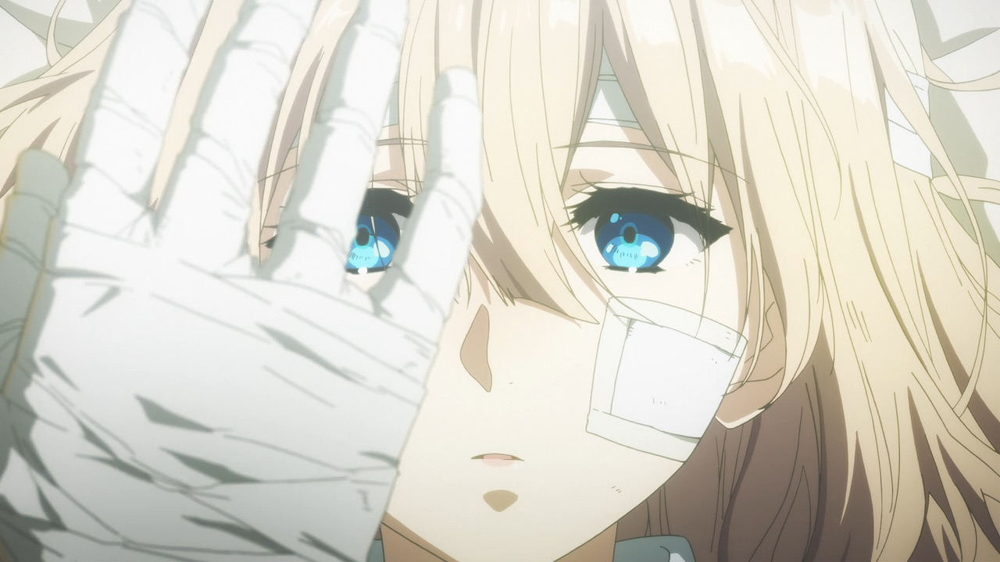

---
{
  title: "The AniTAY Anime Awards 2018 : Suggestions & Voting",
  tags:
    [
      "The AniTAY Anime Awards",
      "AniTay",
      "Ani-TAY Collaboration",
      "AniTAY Collaboration",
      "2018",
    ],
  published: "2018-12-28T14:42:00-05:00",
  attached: [],
  license: "cc-by-4",
  oldArticle: true,
}
---

2018's been a wild ride, and along with it, so has anime. From the comfy <em>Yuru
  Camp</em> to the controversial <em>Goblin Slayer</em>, we’ve had a lot this year! Now that the year’s over though,
  it’s time to look back, and what better way to look back on the anime this year than our annual <em>AniTAY Anime
    Awards,</em>a collaborative effort by members in the AniTAY community to decide the best of the best!

AniTAY has always been
  community first, and we always try to put our own community spin on these kinds of projects because the different
  opinions fed by the diversity of the community leads to better results. That’s why this Award process is open to
  everyone!

This article will cover the nominations selected by AniTAY members mucking
  around on a Google Docs sheet. While what we got here is pretty good, we can’t do this without everyone’s help! If you
  see anything missing or have any suggestions <a class="sc-1out364-0 hMndXN sc-145m8ut-0 gIacKn js_link" data-ga='[["Embedded Url","External link","https://docs.google.com/forms/d/e/1FAIpQLSeuwe2CG8uPU8udvWFAwkKSRExVx2iAZpM9fXv0T2VK_nSw7w/viewform?usp=sf_link",{"metric25":1}]]' href="https://docs.google.com/forms/d/e/1FAIpQLSeuwe2CG8uPU8udvWFAwkKSRExVx2iAZpM9fXv0T2VK_nSw7w/viewform?usp=sf_link" rel="noopener noreferrer" target="_blank">fill out this form</a>
  or post comments on the sheet and I’ll try to take suggestions and add it to the list. Suggestions will be closed on
  12/31/2018.

Like last year, we’ll be running 2 awards, the Author’s Awards and the Reader’s
  Awards. This way we can keep our voice while including everyone in the process. Make your vote count by <a class="sc-1out364-0 hMndXN sc-145m8ut-0 gIacKn js_link" data-ga='[["Embedded Url","External link","https://docs.google.com/forms/d/e/1FAIpQLScQSXekRigWYrKX-JltN1uKZTaRV2I-1Ddbc75faVl_7eAzJw/viewform?usp=sf_link",{"metric25":1}]]' href="https://docs.google.com/forms/d/e/1FAIpQLScQSXekRigWYrKX-JltN1uKZTaRV2I-1Ddbc75faVl_7eAzJw/viewform?usp=sf_link" rel="noopener noreferrer" target="_blank">filling this form here</a>. Voting will be closed 1/13<!-- -->
  /2019, when we release the results in a separate article.

There has been some slight
  changes to the formula this year however: we gave anime movies their own section, added a Slice of Life section, and a
  <em>Most Trash Show </em>Section. Hope you enjoy the tweaks and look forward to seeing your votes! Enough of my
  rambling, onto the nominees! 

<h2 class="sc-1bwb26k-1 fvCjqJ" id="h1811"><strong>Anime
  of the Year</strong></h2>

Here’s the category you’re all here for: Anime of the Year. There’s been a lot of
  great shows this year, but here’s the best. From Comedy to Fantasy to Drama, these are the shows we were immersed in,
  made us laugh or cry, and made us fall in love: The Best Anime of 2018.
<h4 class="sc-1bwb26k-1 fvCjqJ" id="h1812">
<strong>Nominees:</strong></h4>
<ul class="sc-1lmbno3-0 dpuHif" data-style="Bullet" data-type="List">
<li><em>A Place Further Than The Universe</em></li>
<li><em>Devilman Crybaby</em></li>
<li><em> Dragon Pilot: Hisone and Masotan </em></li>
<li><em>Golden Kamuy</em></li>
<li><em>Hinamatsuri</em></li>
<li><em>Megalo Box</em></li>
<li><em>Planet With</em></li>
<li><em>Rascal Does Not Dream of Bunny Girl Senpai</em></li>
<li><em>Revue Starlight</em></li>
<li><em>Violet Evergarden</em></li>
<li><em>Yuru Camp</em></li>
</ul>

<h2 class="sc-1bwb26k-1 fvCjqJ" id="h1813"><strong>Anime
  Movie of the Year</strong></h2>

Anime is more than just silly TV cartoons... it’s also on the big screen! While
  there aren’t a lot of anime movies, here were the anime movies that came out this year, and they were great. <a class="sc-1out364-0 hMndXN sc-145m8ut-0 gIacKn js_link" data-ga='[["Embedded Url","External link","https://anitay.kinja.com/quick-psa-if-you-aren-t-watching-anime-movies-you-re-1828543985",{"metric25":1}]]' href="https://anitay.kinja.com/quick-psa-if-you-aren-t-watching-anime-movies-you-re-1828543985" rel="noopener noreferrer" target="_blank">If you aren’t watching anime movies, you’re missing out. </a>
<h4 class="sc-1bwb26k-1 fvCjqJ" id="h1814"><strong>Nominees:</strong></h4>
<ul class="sc-1lmbno3-0 dpuHif" data-style="Bullet" data-type="List">
<li><em>Flavors of Youth</em></li>
<li><em>Liz and the Blue Bird</em></li>
<li><em>Maquia: When the Promised Flower Blooms</em></li>
<li><em>Mirai</em></li>
<li><em>My Hero Academia: Two Heroes</em></li>
<li><em>Night Is Short, Walk On Girl</em></li>
</ul>

<h2 class="sc-1bwb26k-1 fvCjqJ" id="h1815"><strong>Hidden
  Gems (Under 85k) </strong></h2>

Shows that unfortunately flew under the radar and didn’t get the attention they
  deserved. While the seasonal favorites were making waves, these obscure shows were glimmering treasures waiting to be
  discovered. The number of members (going by MAL) was way below 85,000—and sometimes not even half of that. These are
  the hidden gems of 2018.
<h4 class="sc-1bwb26k-1 fvCjqJ" id="h1816"><strong>Nominees:</strong>
</h4>
<ul class="sc-1lmbno3-0 dpuHif" data-style="Bullet" data-type="List">
<li><em>Amanchu! Advance</em></li>
<li><em>Baki</em></li>
<li><em>Boarding School Juliet</em></li>
<li>Comic Girls</li>
<li><em>Dragon Pilot</em></li>
<li><em>Hanebado</em></li>
<li><em>Lupin III Part V</em></li>
<li><em>Megalo Box</em></li>
<li><em>Mitsuboshi Colors</em></li>
<li><em>Planet With</em></li>
<li><em>Revue Starlight</em></li>
<li><em>Run with the Wind</em></li>
<li><em>SSSS Gridman</em></li>
<li><em> Umamusume </em></li>
<li><em>Yagate Kimi ni Naru (Bloom Into You) </em></li>
</ul>

<h2 class="sc-1bwb26k-1 fvCjqJ" id="h1817"><strong>Best
  Animated</strong></h2>

What do you watch anime for? Maybe great story, great music, or something else, but
  many watch shows for visuals, shows that look stunning at every moment. These are the shows that had the most fluid
  animation, looked amazing or more: The best Animated shows of 2018.
<h4 class="sc-1bwb26k-1 fvCjqJ" id="h1818"><strong>Nominees:</strong></h4>
<ul class="sc-1lmbno3-0 dpuHif" data-style="Bullet" data-type="List">
<li><em>Baki</em></li>
<li><em>Devilman Crybaby</em></li>
<li><em>Dragon Pilot: Hisone and Masotan</em></li>
<li><em>Iroduku: The World in Colors</em></li>
<li><em>Megalo Box</em></li>
<li><em>Revue Starlight</em></li>
<li><em>Run With the wind</em></li>
<li><em>SSSS Gridman</em></li>
<li><em>Violet Evergarden</em></li>
</ul>

<h2 class="sc-1bwb26k-1 fvCjqJ" id="h1819"><strong>Best
  Action</strong></h2>

<em>Action</em>! These are the shows that get your blood pumping, and your adrenalin
  skyrocketing. Animation that excel in the fast, the frenetic, the flashy and the weighty. Shows that make you feel
  every punch, soar every flight, and leaves you breatheless with every exertion. To those shows whose kineticism is
  made tangible, we honor with our “Best Action” Award.
<h4 class="sc-1bwb26k-1 fvCjqJ" id="h1820"><strong>Nominees:</strong></h4>
<ul class="sc-1lmbno3-0 dpuHif" data-style="Bullet" data-type="List">
<li><em>Baki</em></li>
<li><em>Banana Fish</em></li>
<li><em>Devilman Crybaby</em></li>
<li><em>Golden Kamuy</em></li>
<li><em>Gridman</em></li>
<li><em> JoJo’s Bizarre Adventure: Golden Wind </em></li>
<li><em>Killing Bites</em></li>
<li><em>Lupin V</em></li>
<li><em>Megalo Box</em></li>
<li><em>Overlord II &amp; III</em></li>
<li><em>Planet With</em></li>
</ul>

<h2 class="sc-1bwb26k-1 fvCjqJ" id="h1821"><strong>Best
  Drama</strong></h2>

‘Cause I feeeeeeel! The Best Drama Award is for the shows that give us a major case
  of the feels. They can move you to tears and give you characters to empathize with—some you may find a lot in common
  with. Say hello to the Best Dramas of 2018.

<strong>Nominees:</strong>

<ul class="sc-1lmbno3-0 dpuHif" data-style="Bullet" data-type="List">
<li>A Place Further than the Universe</li>
<li>After the Rain</li>
<li>Bunny Girl Senpai</li>
<li>Iroduku: The World in Colors</li>
<li>Violet Evergarden</li>
<li>Yagate Kimi ni Naru (Bloom Into You)</li>
</ul>

<h2 class="sc-1bwb26k-1 fvCjqJ" id="h1822"><strong>Best
  Romance</strong></h2>

Romance shows: The shows that get our hearts stirring, those that get us thinking in
  love dodecahedrons and more. These are the shows we loved to love, the Best Romance shows of 2018.
<h4 class="sc-1bwb26k-1 fvCjqJ" id="h1823"><strong>Nominees:</strong></h4>
<ul class="sc-1lmbno3-0 dpuHif" data-style="Bullet" data-type="List">
<li><em>After the Rain</em></li>
<li><em>Boarding School Juliet</em></li>
<li><em>Bunny Girl Senpai</em></li>
<li><em>Irodoku: The World in Colors</em></li>
<li><em>Tada-kun wa Koi wo Shinai</em></li>
<li><em>Teasing Master Takagi-san</em></li>
<li><em>Yagate Kimi ni Naru (Bloom Into You) </em></li>
</ul>

<h2 class="sc-1bwb26k-1 fvCjqJ" id="h1824"><strong>Best
  Comedy</strong></h2>

Some shows try to make you fall in love with a story, others try to wow you with
  spectacle. Others, like the shows here, try to put a smile on your face, to get you laughing out loud: These are the
  best comedies of 2018!
<h4 class="sc-1bwb26k-1 fvCjqJ" id="h1825"><strong>Nominees:</strong>
</h4>
<ul class="sc-1lmbno3-0 dpuHif" data-style="Bullet" data-type="List">
<li><em>Asobi Asobase</em></li>
<li><em>Cells at Work</em></li>
<li><em>Comic Girls</em></li>
<li><em>Grand Blue</em></li>
<li><em>Hinamatsuri</em></li>
<li><em>Jashin-chan no Dropkick</em></li>
<li><em>Mitsuboshi Colors</em></li>
<li><em>Pop Team Epic</em></li>
<li><em>Teasing Master Takagi-san</em></li>
<li><em>Uchuu Senkan Tiramisu</em></li>
<li><em>Wotakoi</em></li>
<li><em>Zombieland Saga</em></li>
</ul>

<h2 class="sc-1bwb26k-1 fvCjqJ" id="h1826"><strong>Best
  Slice of Life</strong></h2>

Sometimes, there’s nothing more enjoyable than watching people chill out and do
  their stuff. These are the best Slice of Life shows, the shows that make amazing out of the mundane.
<h4 class="sc-1bwb26k-1 fvCjqJ" id="h1827"><strong>Nominees:</strong></h4>
<ul class="sc-1lmbno3-0 dpuHif" data-style="Bullet" data-type="List">
<li><em>Amanchu! Advance</em></li>
<li><em>Cells at Work</em></li>
<li><em>Gakuen Babysitters</em></li>
<li><em>Grand Blue</em></li>
<li><em>Hinamatsuri</em></li>
<li><em>Iroduku</em></li>
<li><em>Mitsuboshi Colors</em></li>
<li><em>Slow Start</em></li>
<li><em>Teasing Master Takagi-san</em></li>
<li><em>Wotakoi</em></li>
<li><em>Yuru Camp</em></li>
</ul>

<h2 class="sc-1bwb26k-1 fvCjqJ" id="h1828">Best OP
</h2>

<iframe allow="accelerometer; autoplay; clipboard-write; encrypted-media; gyroscope; picture-in-picture" allowfullscreen="" frameborder="0" height="315" src="https://www.youtube.com/embed/4PPjBgpaYaA" width="560"></iframe>

This year was absolutely flooded with top quality OPs, but these were the ones to best
  combine stunning visuals with amazing songs. These were the OPs you just could not skip no matter what.

<h4 class="sc-1bwb26k-1 fvCjqJ" id="h1829"><strong>Nominees:</strong></h4>
<ul class="sc-1lmbno3-0 dpuHif" data-style="Bullet" data-type="List">
<li><em>Asobi Asobase</em></li>
<li><em>Baki</em></li>
<li><em>Banana Fish (OP2 - Freedom)</em></li>
<li><em>Cardcaptor Sakura: Clear Card (OP1)</em></li>
<li><em>Darling in the Franxx</em></li>
<li><em>Hanebado</em></li>
<li><em>Kokkoku</em></li>
<li><em>Lupin V</em></li>
<li><em>Megalo Box</em></li>
<li><em>Overlord III</em></li>
<li><em>Revue Starlight</em></li>
<li><em>Toji no Miko (OP1)</em></li>
<li><em>Tonari no Vampire</em></li>
<li><em>Wotakoi</em></li>
<li><em>Yuru Camp</em></li>
<li><em>Zombieland Saga</em></li>
</ul>

<h2 class="sc-1bwb26k-1 fvCjqJ" id="h1830"><strong>Best
  ED</strong></h2>

<iframe allow="accelerometer; autoplay; clipboard-write; encrypted-media; gyroscope; picture-in-picture" allowfullscreen="" frameborder="0" height="315" src="https://www.youtube.com/embed/AVHRBAYdsCw" width="560"></iframe>

Many people like to skip the ED, but this year made that a harder task to do than usual, as
  we were gifted with an unusually large crop of addicting EDs. Some of these EDs were so good they even made us wish
  the episode would end just so we could see them again, even if we loved the show they were attached to.

<h4 class="sc-1bwb26k-1 fvCjqJ" id="h1831"><strong>Nominees:</strong></h4>
<ul class="sc-1lmbno3-0 dpuHif" data-style="Bullet" data-type="List">
<li><em>Asobi Asobase</em></li>
<li><em>Baki</em></li>
<li><em>Banana Fish </em></li>
<li><em>Bunny Senpai</em></li>
<li><em>Dragon Pilot</em></li>
<li><em>Hakata Tonkotsu Ramens</em></li>
<li><em>Irodoku: The World in Colors</em></li>
<li><em>Lupin V</em></li>
<li><em>Overlord III</em></li>
</ul>

<h2 class="sc-1bwb26k-1 fvCjqJ" id="h1832"><strong>Best
  Male Character</strong></h2>

This year gave us quite a large range of characters taking the spotlight, and this
  couldn’t be better seen than in the <em>Best Male Character </em>nominees. Everything from figure skaters and manga
  artists to plaster busts, this year had it all. 
<h4 class="sc-1bwb26k-1 fvCjqJ" id="h1833"><strong>Nominees:</strong></h4>
<ul class="sc-1lmbno3-0 dpuHif" data-style="Bullet" data-type="List">
<li> Akira Fudo -<em> Devilman Crybaby</em></li>
<li>Aslan Jade Callenreese (Ash) - <em>Banana Fish</em></li>
<li>Daisuke Jigen - <em>Lupin III Part V</em></li>
<li>Doug - <em>Double Decker</em></li>
<li>Immortal Sugimoto- <em>Golden Kamuy</em></li>
<li> Junk Dog/Joe<em> - Megalobox </em></li>
<li>Koutarou Tatsumi -<em> Zombieland Saga</em></li>
<li>Narumi - <em>Karakuri Circus</em></li>
<li>Sakuta Azusagawa - <em>Rascal Does Not Dream of Bunny Girl Senpai</em></li>
<li>White Blood Cell - <em>Cells at Work</em></li>
</ul>

<h2 class="sc-1bwb26k-1 fvCjqJ" id="h1834"><strong>Best
  Female Character</strong></h2>

The bold, the brash, the rejected, and the moe- 2018 brought plenty of endearing
  choices to make the race for Best Female Character a widely debated discussion in anime circles. 
<h4 class="sc-1bwb26k-1 fvCjqJ" id="h1835"><strong>Nominees:</strong></h4>
<ul class="sc-1lmbno3-0 dpuHif" data-style="Bullet" data-type="List">
<li> Akane Shinjou - <em>SSSS Gridman </em></li>
<li> Ayano Hanesaki -<em> Hanebado </em></li>
<li> Fujiko - <em>Lupin </em></li>
<li>Hanako - <em>Asobi Asobase</em></li>
<li> Hisone Amakasu-<em> Dragon Pilot: Hisone and Masotan </em></li>
<li> Koito Yuu<em> - Yagate Kimi ni Naru </em></li>
<li> Mai Sakurajima - <em>Rascal Does Not Dream of Bunny Girl Senpai </em></li>
<li> Nadeshiko Kagamihara - <em>Yuru Camp </em></li>
<li> Nagisa Aragaki -<em> Hanebado </em></li>
<li> Olivia - <em>Asobi Asobase</em></li>
<li> Red Blood Cell - <em>Cells at Work </em></li>
<li> Rin Shima - <em>Yuru Camp </em></li>
<li> Saki Nikaidou - <em>Zombieland Saga </em></li>
<li> Shirogane Saiga- <em>Karakuri Circus </em></li>
<li> Violet Evergarden -<em> Violet Evergarden </em></li>
<li> Zero Two - <em>Darling in the Franxx </em></li>
</ul>

<h2 class="sc-1bwb26k-1 fvCjqJ" id="h1836">Most Trash
  Show</h2>

For some reason, AniTAY really likes garbage shows, to the point where we have a
  whole subcategory of AniTAY’ers called animasochists. This is to you, the ones who suffer through the trashiest of
  trash... for some reason. 
<h4 class="sc-1bwb26k-1 fvCjqJ" id="h1837"><strong>Nominees:</strong>
</h4>
<ul class="sc-1lmbno3-0 dpuHif" data-style="Bullet" data-type="List">
<li><em>Alice or Alice: Siscon Niisan to Futago no Imouto</em></li>
<li><em>Angels of Death</em></li>
<li><em>Baki</em></li>
<li><em>Conception</em></li>
<li><em>How NOT To Summon a Demon Lord </em></li>
<li><em>Jashin-chan Dropkick</em></li>
<li><em>Killing Bites</em></li>
<li><em>Märchen Mädchen</em></li>
<li><em>Miss caretaker of Sunohara-sou</em></li>
<li><em>My Sister,My Writer</em></li>
<li><em>Overlord III</em></li>
</ul>

<h2 class="sc-1bwb26k-1 fvCjqJ" id="h1838"><strong>AniTAY
  Favorites(?)</strong></h2>

Last but not Least, AniTAY Favorites! This is one we included to spice things up, to
  make this list truly our own. These are shows that AniTAY was fixated on, either loved or discussed about for days on
  end. Take a look at what makes AniTAY, AniTAY! (Note: This doesn’t indicate quality or anything, just shows that
  AniTAY liked a lot.)
<h4 class="sc-1bwb26k-1 fvCjqJ" id="h1839"><strong>Nominees: </strong>
</h4>
<ul class="sc-1lmbno3-0 dpuHif" data-style="Bullet" data-type="List">
<li><em>A Place Further Than The Universe</em></li>
<li><em>Baki</em></li>
<li>Devilman Crybaby</li>
<li><em>Golden Kamuy</em></li>
<li><em>Killing Bites</em></li>
<li><em>Megalo Box</em></li>
<li><em>SSSS.Gridman</em></li>
<li><em>Violet Evergarden</em></li>
<li><em>Yuru Camp</em></li>
</ul>
<em>Thanks for checking out AniTAY and the AniTAY Anime Awards!</em> <em>Ani-TAY
  is the anime-focused portion of Kotaku’s community-run blog, Talk Amongst Yourselves where writers love everything
  anime related. Click </em><a class="sc-1out364-0 hMndXN sc-145m8ut-0 gIacKn js_link" data-ga='[["Embedded Url","External link","http://anitay.kinja.com/",{"metric25":1}]]' href="http://anitay.kinja.com/" rel="noopener noreferrer" target="_blank"><em>here</em></a><em> to check us out, and
  remember to participate by</em><a class="sc-1out364-0 hMndXN sc-145m8ut-0 gIacKn js_link" data-ga='[["Embedded Url","External link","https://docs.google.com/forms/d/e/1FAIpQLSfFTID83kA7-v3EbQp0S80PXW2QKyZR75n6CArlSfj80_zyFA/viewform?usp=sf_link",{"metric25":1}]]' href="https://docs.google.com/forms/d/e/1FAIpQLSfFTID83kA7-v3EbQp0S80PXW2QKyZR75n6CArlSfj80_zyFA/viewform?usp=sf_link" rel="noopener noreferrer" target="_blank"><em> suggesting </em></a><em>and </em><a class="sc-1out364-0 hMndXN sc-145m8ut-0 gIacKn js_link" data-ga='[["Embedded Url","External link","https://docs.google.com/forms/d/e/1FAIpQLSfWLv6b2MOGUW1nDgTScNm8skFpBfa5GuC0lgwtbaO-lM5xmg/viewform?usp=sf_link",{"metric25":1}]]' href="https://docs.google.com/forms/d/e/1FAIpQLSfWLv6b2MOGUW1nDgTScNm8skFpBfa5GuC0lgwtbaO-lM5xmg/viewform?usp=sf_link" rel="noopener noreferrer" target="_blank"><em>voting</em></a><em>!</em> 

