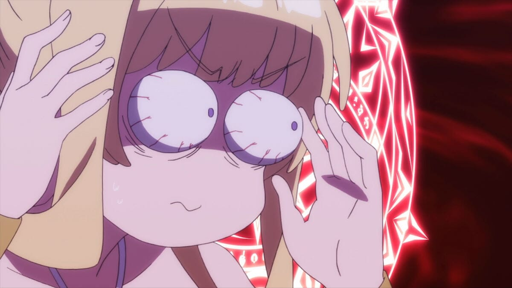

---
{
	title: "The AniTAY Anime Awards 2019 : Suggestions & Voting",
	published: "2019-12-21T09:00:00-05:00",
	tags: ["The AniTAY Anime Awards", "AniTAY", "Ani-TAY Collaboration", "AniTAY Collaboration", "2019"],
	kinjaArticle: true
}
---

It’s almost a comforting clockwork - we go through the year watching great anime, and then when we creep up ever closer to the end of our calendars, we spend our time reflecting back on the brightest moments for anime. Welcome to our annual *AniTAY Anime Awards*, a collaborative effort by members in the AniTAY community to decide the best of the best!

AniTAY, now more than ever is community first, and we always try to put our own community spin on these kinds of projects because the different opinions fed by the diversity of the community leads to better results. That’s why this Award process is open to everyone!

This article will cover the nominations selected by AniTAY members mucking around on a Google Docs sheet. While what we got here is pretty good, we can’t do this without everyone’s help! If you see anything missing or have any suggestions [fill out this form](https://docs.google.com/forms/d/e/1FAIpQLSfEo_bHWEeyDGhqF77cRrSCOVlwgiDrPfsghJ_8vEprbjMCyg/viewform?usp=sf_link) or post comments on the sheet and I’ll try to take suggestions and add it to the list. Suggestions will be closed on 12/30/2019.

Like always, we’ll be running 2 awards, the Author’s Awards and the Reader’s Awards. This way we can keep our voice while including everyone in the process. Make your vote count by [filling this form here](https://docs.google.com/forms/d/e/1FAIpQLSeYCb-Ftzj8gEueZzzXbGAq69rg9x5DB7qMl7aNv0k07FkCNA/viewform?usp=sf_link). Voting will be closed 1/13/2020, when we release the results in a separate article.

This year, we added a sequel category, which we felt was necessary given the number of shows that are sequels. Hope you enjoy the tweaks and look forward to seeing your votes! Enough of my rambling, onto the nominees!

***

## Anime of the Year

Here’s the category you’re all here for: Anime of the Year. There’s been a lot of great shows this year, but here’s the best. From Comedy to Fantasy to Drama, these are the shows we were immersed in, made us laugh or cry, and made us fall in love: The Best Anime of 2019.

#### **Nominees:**

*Promised Neverland*

*Kaguya Love is War*

*Demon Slayer*

*Beastars*

*Carole and Tuesday*

*Mix*

*Lord El-Melloi*

*Dororo*

*Vinland Saga*

*O Maidens in Your Savage Season*

*Fruits Basket 1st Season*

*Blade of The Immortal*

*Astra Lost in Space*

*BoogiePop and Others*

*Given*

***

## AniTAY Movie of the Year

Anime is more than just silly TV cartoons... it’s also on the big screen! While there aren’t a lot of anime movies, here were the anime movies that came out this year, and they were great. If you aren’t watching anime movies, you’re missing out.

#### **Nominees:**

*Code Geass: Lelouch of the Re;surrection*

*Fate/stay night Movie: Heaven’s Feel - II. Lost Butterfly*

*Tanya of Evil*

*Promare*

*Rascal Does Not Dream of a Dreaming Girl*

*Konosuba Movie*

*DanMachi Arrow of the Orion*

*Black Fox*

*One Piece Stampede*

*Dragon Ball Super: Broly*

***

## Sequel Of the Year

There’s nothing better than seeing an old favorite, and that’s what this category, Sequel of the Year is about! These are the best of the best continuations of the best of the best.

*Mob Psycho II*

*Attack on Titan S3 Part 2*

*My Hero Academia S4*

*Chihayafuru 3*

*Senki Zesshou Symphogear XV*

*Radiant 2*

*High Score Girl 2*

*Is it Wrong to Pick Up Girls in a Dungeon? 2*

*Psycho-Pass 3*

*Aggretsuko 2nd Season*

***

## Hidden Gems (Under 75k)

Shows that unfortunately flew under the radar and didn’t get the attention they deserved. While the seasonal favorites were making waves, these obscure shows were glimmering treasures waiting to be discovered. The number of members (going by MAL) was way below 75,000—and sometimes not even half of that. These are the hidden gems of 2019.

#### **Nominees:**

*Granbelm*

*Mix*

*Kono Oto Tomare*

*Cop Craft*

*Endro~!*

*Sarazanmai*

*Stars Align*

*Null and Peta*

*Demon Girl Next Door*

*Iruma-kun*

*Ascendance of a Bookworm*

*Kemurikusa*

***

## Best Animated

What do you watch anime for? Maybe great story, great music, or something else, but many watch shows for visuals, shows that look stunning at every moment. These are the shows that had the most fluid animation, looked amazing or more: The best Animated shows of 2019.

#### **Nominees:**

*Rilakkuma & Kaoru*

*Mob Psycho 100 2*

*Promare*

*Beastars*

*Fire Force*

*Demon Slayer*

*Vinland Saga*

*Miru Tights*

*Promised Neverland*

*Babylon*

*Dragon Ball Super: Broly*

*Attack on Titan Season 3 Pt. 2*

***

## Best Action

*Action*! These are the shows that get your blood pumping, and your adrenalin skyrocketing. Animation that excel in the fast, the frenetic, the flashy and the weighty. Shows that make you feel every punch, soar every flight, and leaves you breatheless with every exertion. To those shows whose kineticism is made tangible, we honor with our “Best Action” Award.

#### **Nominees:**

*Dororo*

*Promare*

*Fire Force*

*Demon Slayer*

*Vinland Saga*

*Radiant S2*

*No Guns Life*

*Dragon Ball Super: Broly*

*Fate/Grand Order: Absolute Demonic Front - Babylonia*

***

## Best Drama

! The Best Drama Award is for the shows that give us a major case of the feels. They can move you to tears and give you characters to empathize with—some you may find a lot in common with. Say hello to the Best Dramas of 2019.

**Nominees:**\
*Beastars*

*Kono Oto Tomare*

*Blade of the Immortal*

*O Maidens in Your Savage Season*

*Carole and Tuesday*

*Vinland Saga*

*Astra Lost in Space*

*Given*

*Stars Align*

***

## Best Romance

Romance shows: The shows that get our hearts stirring, those that get us thinking in love dodecahedrons and more. These are the shows we loved to love, the Best Romance shows of 2019.

#### **Nominees:**

**Kono Oto Tomare**

**Kaguya-Sama Love is War**

**We Never Learn!**

**The Quintessential Quintuplets**

**Ao-chan Can’t Study**

**Senyruu Girl**

**High Score Girl 2**

**Astra Lost in Space**

**Given**

***

## Best Comedy

Some shows try to make you fall in love with a story, others try to wow you with spectacle. Others, like the shows here, try to put a smile on your face, to get you laughing out loud: These are the best comedies of 2019!

#### **Nominees:**

*Cautious Hero*

*Kaguya Love is War*

*Isekai Quartet*

*Ao-chan can’t study*

*O Maidens in Your Savage Season*

*HItoribocchi*

*Didn’t I Say to Make My Abilities Average in the Next Life?!*

*Demon Girl Next Door*

***

## Best Slice of Life

Sometimes, there’s nothing more enjoyable than watching people chill out and do their stuff. These are the best Slice of Life shows, the shows that make amazing out of the mundane.

#### **Nominees:**

*Senryuu Shoujo*

*Hitoribocchi*\
*Mix*

*Didn’t I Say to Make My Abilities Average in the Next Life?!*

*Endro~!*

*Ascendance of a Bookworm*

*The Helpful Fox Senko-san*

***

## Best OP

This year was absolutely flooded with top quality OPs, but these were the ones to best combine stunning visuals with amazing songs. These were the OPs you just could not skip no matter what.

#### **Nominees:**

Dororo “Kaen” by Ziyoou-vachi

Promised Neverland - “Touch Off” by UVERworld

Mob Psycho 100 II - “99.9" by MOB CHOIR feat. sajou no hana

Kaguya-Sama - “Love Dramatic feat. Rikka Ihara by Masayuki Suzuki

Domestic Girlfriend - “Kawaki wo Ameku” by Minami

Boogiepop and Others - “shadowgraph” by MYTH＆ROID

Carole and Tuesday “Kiss Me” by Carole & Tuesday (Nai Br.XX & Celeina Ann)

Demon Slayer - “Gurenge” by LiSA

Fire Force - “Inferno” by Mrs.GREEN APPLE

Astra Lost in Space - “Star\*frost” by nonoc

A Certain Scientific Accelerator - “Shadow is the Light” by THE SIXTH LIE

Cop Craft - “Rakuen Toshi” by Masayoshi Ooishi

Granbelm - “Tsuki wo Ou Mayonaka” by Eir Aoi

Beastars “Wild Side”

Vinland Saga “Dark Crow” by MAN WITH A MISSION

Seven Deadly Sins “Rob the Frontier” by UVERworld

No Guns Life - “Motor City” by Kenichi Asai

Radiant 2 - “Naraku” by Halo at Yojohan

Cautious Hero - “TIT FOR TAT” by MYTH\&ROID

ORESUKI: Are You the Only One that Loves Me? - “Papapa” by Shuka Saitou

Didn’t I Say to Make My Abilities Average in the Next Life?! - “Smile Skill = Suki Skill!” by Akaki Chikai

Ascendance of a Bookworm - “Masshiro” by Sumire Moroboshi

High Score Girl 2 - “flash” by sora tob sakana

***

## Best ED

Many people like to skip the ED, but every now and then you’ll run into one that you just can’t get out of your head. Some of these EDs were so good they even made us wish the episode would end just so we could see them again, even if we loved the show they were attached to.

#### **Nominees:**

Black Clover - “against all gods” by m-flo

Mob Psycho 100 II - “Ikiru Hitobito” by sajou no hana

Kaguya-Sama - “Chikatto Chika Chika”​ by Chika Fujiwara

Carole & Tuesday - “Hold Me Now” by Carole & Tuesday (Nai Br.XX & Celeina Ann)

Hitoribocchi - “Bakushou Bocchi-juku Kouka” by Hitori Bocchi

Sarazanmai - “Stand by Me” by the peggies

Bungo Stray Dogs - “Lily” by Luck Life

Fire Force - “veil” by Keina Suda

Radiant 2 - “Chitto mo Shiranakatta” by Emi Nakamura

***

## Best Male Character

What’s better than our lovable bois? Welcome to our *Best Male Character *nominees, a category that has everything from loner NEETs, to obsessed fighting maniacs.

#### **Nominees:**

Tanjirou Kamado - Demon Slayer

Inosuke Hashibira - Demon Slayer

Askeladd - Vinland Saga

Thorkell - Vinland Saga

Kanata Hoshijima - Lost in Space Astra

Inui Juuzou - No Guns Life

Manji - Blade of the Immortal

Yu Ishigami - Kaguya Love is War

Legoshi - Beastars

Kyo Sohma - Fruits Basket

Lutz - Ascendance of a Bookworm

Ray - Promised Neverland

Kei Mikhail Ignatov - Psycho-Pass 3

***

## Best Female Character

The bold, the brash, the rejected, and the moe- 2019 brought plenty of endearing choices to make the race for Best Female Character a widely debated discussion in anime circles.

#### **Nominees:**

Emma - Promised Neverland

Sugawara Niina - O Maidens

Aries Springs - Lost in Space Astra

Mary Steinberg - No Guns Life

Chika Fujiwara - Kaguya-Sama:Love is War

Ai Hayasaka - Kaguya-Sama:Love is War

Dororo - Dororo

Clara - Welcome to Demon School! Iruma-kun

Haru - Beastars

Tohru Honda - Fruits Basket

Aru Honshou - Hitoribocchi

Ocoho - Radiant 2

Meiza Endust (Mei) - Endro~!

Grey - Lord El-Melloi

Yuuko Yoshida (Shamiko) - Demon Girl Next Door

Momo Chiyoda - Demon Girl Next Door

Ristarte - Cautious Hero

Rin Asano - Blade of the Immortal

Pansy - ORESUKI: Are You the Only One that Loves Me?

***

## Most Trashiest Trash of the Year

For some reason, AniTAY really likes garbage shows, to the point where we have a whole subcategory of AniTAY’ers called animasochists. This is to you, the ones who suffer through the trashiest of trash... for some reason.

#### **Nominees:**

*Are You Lost?*

*Arifureta: From Commonplace to World’s Strongest*

*Do You Love Your Mom and Her Two-Hit Multi-Target Attacks?*

*Domestic Girlfriend*

*Magical Girl Spec-Ops Asuka*

*Hensuki: Are you willing to fall in love with a pervert, as long as she’s a cutie?*

*Why the hell are you here, Teacher!?*

*Magical-Senpai*

*Miru Tights*

*Nobunaga-sensei’s Young Bride*

*ORESUKI Are you the only one who loves me?*

*Val X Love*

***

## AniTAY Favorites(?)

Last but not Least, AniTAY Favorites! This is one we included to spice things up, to make this list truly our own. These are shows that AniTAY was fixated on, either loved or discussed about for days on end. Take a look at what makes AniTAY, AniTAY! (Note: This doesn’t indicate quality or anything, just shows that AniTAY liked a lot.)

#### **Nominees:**

*Babylon*

*Astra Lost in Space*

*Endro!*

*Mix*

*O Maidens in Your Savage Season*

*Miru Tights*

*Demon Girl Next Door*

*Sarazanmai*

*Val X Love*

*The Price of Smiles*

*Hitoribocchi*

*Kaguya Love is War*

***

*Thanks for checking out AniTAY and the AniTAY Anime Awards!* *Ani-TAY is the anime-focused portion of Kotaku’s community-run blog, Talk Amongst Yourselves where writers love everything anime related. Click *[*here*](http://anitay.kinja.com/)* to check us out, and remember to participate by*[* suggesting *](https://docs.google.com/forms/d/e/1FAIpQLSfEo_bHWEeyDGhqF77cRrSCOVlwgiDrPfsghJ_8vEprbjMCyg/viewform?usp=sf_link)*and *[*voting*](https://docs.google.com/forms/d/e/1FAIpQLSeYCb-Ftzj8gEueZzzXbGAq69rg9x5DB7qMl7aNv0k07FkCNA/viewform?usp=sf_link)*!*
