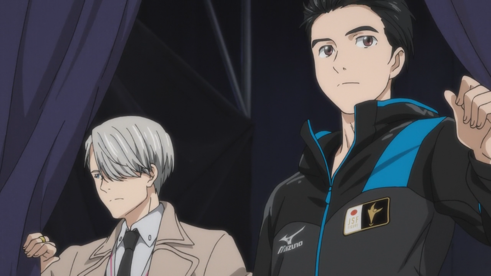

---
{
	title: "The AniTAY Anime Awards of 2016",
	published: "2017-01-12T13:20:00-05:00",
	tags: ["The AniTAY Anime Awards", "2016", "AniTAY", "Anime", "AniTAY Collaboration", "Ani-tay collaboration"],
	kinjaArticle: true
}
---

Another year, another round of anime. 2016 has been a rather eventful year, both IRL and in Anime, but before we get swept in confusion, AniTAY is here to help sort things out (For anime at least). Welcome to The *AniTAY Anime Awards* of 2016, where AniTAY Authors and AniTAY members pick the best of the best Anime of the year!

The AniTAY Anime Awards is a collaborative effort by members in the AniTAY community to decide the best of the best of this year, and this year (2016) was the inaugural year for these awards. We always try to put our own spin on these kinds of projects because when we see groups that don’t leverage different opinions, the results can radically differ from what the actual viewer think, and offer little choice. That’s why this Award process was open to the community and the decisions made were fascinating. We ran a poll both internally asking the authors of AniTAY as well as asking all the readers, so we have two sets of results. Here we go!

***

## Author Awards

Here’s what the authors of AniTAY have to say! We here at AniTAY are an opinionated bunch, a group of people who vary drastically yet all magically have a consensus on certain things. We watch a lot of anime, so expect some different results than from most.

***

#### Author’s Pick for AniTAY Favorites:* Jojo’s Bizarre Adventure: Diamond is Unbreakable*

***

#### Author’s Pick for Best Female Character: Chitose (*Girlish Number*)

***

#### Author’s Pick for Best Male Charcter: Tanaka & Kikuhiko (*Tanaka-Kun *& *Rakugo*)

 

***

#### Author’s Pick for Best ED: *Flip Flappers*

***

#### Author’s Best OP: *Shōwa Genroku Rakugo Shinjū*

***

#### Author’s Best Sports: *Haikyuu!!*

***

#### Author’s Pick for Best Slice of Life: *Tanaka-Kun*

***

#### Author’s Pick for Best Romance: *ReLIFE*

***

#### Author’s Pick for Best Comedy: *Tanaka-Kun*

***

#### Author’s Pick for Best Animated: *Mob Psycho 100*

***

#### Author’s Pick for Best Action: *Jojo’s Bizarre Adventure*

***

#### Author’s Pick for Best Drama: *Shōwa Genroku Rakugo Shinjū*

***

#### Author’s Pick for Hidden Gem: *Girlish Number*

***

#### Author’s Pick for Anime Of The Year: *Shōwa​ ​Genroku​ ​Rakugo​ ​Shinjū*

***

## Reader Results

Now for the Community’s results! The community that reads AniTAY is pretty varied, but that doesn’t stop them from watching great anime! The picks were pretty similar to the author vote, but they diverge in key points. Read on to see!

***

#### Reader’s Pick for AniTAY Favorites: *Jojo’s Bizarre Adventure & Flip Flappers*

 

***

#### Reader’s Pick for Best Female Character: Rem & Megumin (*Re:Zero* & *Konosuba*)

 

***

#### Reader’s Pick for Best Male Character: Reigen (*Mob Psycho 100*)

***

#### Reader’s Pick for Best OP & ED: Re:Re & Sore wa Chiisana Hikari no Youna (*Erased*)

***

#### Reader’s Pick for Best Sports: *Haikyuu!!*

***

#### Best Slice of Life: *Tanaka-Kun*

***

#### Best Comedy: *Konosuba*

***

#### Best Romance: *Yuri on Ice*

***

#### Best Action: *Mob Psycho 100*

***

#### Best Animated: *Mob Psycho 100*

#### 

***

#### Best Drama: *Shōwa Genroku Rakugo Shinjū*

***

#### Hidden Gem: *Flip Flappers*

***

#### Anime Of The Year: *Re:Zero*

***

*Thanks for checking out AniTAY and the AniTAY Anime Awards!* *Ani-TAY is the anime-focused portion of Kotaku’s community-run blog, Talk Amongst Yourselves where writers love everything anime related. Click *[*here*](http://anitay.kinja.com/)* to check us out!*