---
{
  title: "The AniTAY Anime Awards of 2019",
  tags:
    [
      "The AniTAY Anime Awards",
      "2019",
      "AniTAY",
      "Anime",
      "Ani-TAY Collaboration",
    ],
  published: "2020-01-24T09:00:00-05:00",
  attached: [],
  kinjaArticle: true,
}
---

<video autoplay="" loop="" muted=""><source src="./wyy1t54dainwezlvpygu.mp4" type="video/mp4"/></video>
The emergence of <em>Demon Slayer</em>, the laugh out loud romantic comedy that
  was <em>Kaguya</em>, the awfulness that was shows like <em>ORESUKI</em>! There was so much in regards to anime in
  2019, and here at AniTAY we’re gonna tell you what we think is great! Welcome to The AniTAY Anime Awards of 2019,
  where AniTAY Authors and AniTAY readers pick the best of the best Anime of the year!

The AniTAY Anime Awards
  is a collaborative effort by members in the AniTAY community to decide the best of the best of each year. We always
  try to put our own spin on these kinds of projects because when we see groups that don’t leverage different opinions,
  the results can radically differ from what the actual viewer think, and offer little choice. That’s why this Award
  process was open to the community and the decisions made were fascinating. We ran a poll both internally asking the
  authors of AniTAY as well as asking all the readers, so we have two sets of results. Here we go!

<h2 class="sc-1bwb26k-1 fvCjqJ" id="h101536">Reader
  Results</h2>
Let’s start with the Community’s results! This is the consensus reached by a
  wide variety of readers on this site, and as always the results are interesting!

<h3 class="sc-1bwb26k-1 fvCjqJ" id="h101537">Reader’s
  Pick for AniTAY Favorites: <em>Kaguya-sama: Love Is War</em></h3>
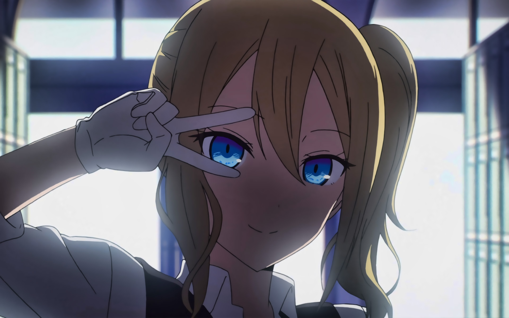

<h3 class="sc-1bwb26k-1 fvCjqJ" id="h101538">Reader’s
  Pick for Most Trash Show:<em> Do You Love Your Mom and Her Two-Hit Multi-Target Attacks?</em></h3>
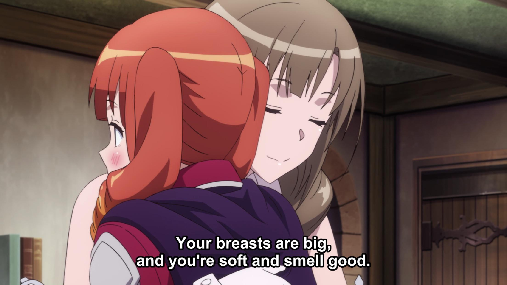

<h3 class="sc-1bwb26k-1 fvCjqJ" id="h101539">Reader’s
  Pick for Best Male Character: Tanjirou Kamado - <em>Demon Slayer</em></h3>
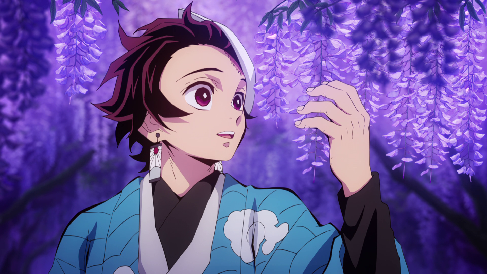

<h3 class="sc-1bwb26k-1 fvCjqJ" id="h101540">Reader’s
  Pick for Best Female Character: Emma - <em>Promised Neverland</em></h3>
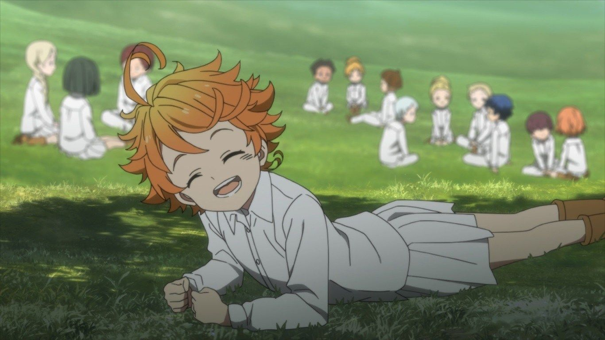

<h3 class="sc-1bwb26k-1 fvCjqJ" id="h101541">Reader’s
  Pick for Best ED:<em> Kaguya-sama: Love Is War</em> - “Chikatto Chika Chika”​ by Chika Fujiwara</h3>

<iframe allow="accelerometer; autoplay; clipboard-write; encrypted-media; gyroscope; picture-in-picture" allowfullscreen="" frameborder="0" height="315" src="https://www.youtube.com/embed/OdZrFtIGzfU" width="560"></iframe>

<h3 class="sc-1bwb26k-1 fvCjqJ" id="h101542">Reader’s
  Pick for Best OP: <em>Kaguya-sama: Love Is War</em> - “Love Dramatic feat. Rikka Ihara by Masayuki Suzuki</h3>

<iframe allow="accelerometer; autoplay; clipboard-write; encrypted-media; gyroscope; picture-in-picture" allowfullscreen="" frameborder="0" height="315" src="https://www.youtube.com/embed/gChTHeHp3wQ" width="560"></iframe>

<h3 class="sc-1bwb26k-1 fvCjqJ" id="h101543">Reader’s
  Pick for Best Slice of Life: <em>Ascendance of a Bookworm</em></h3>
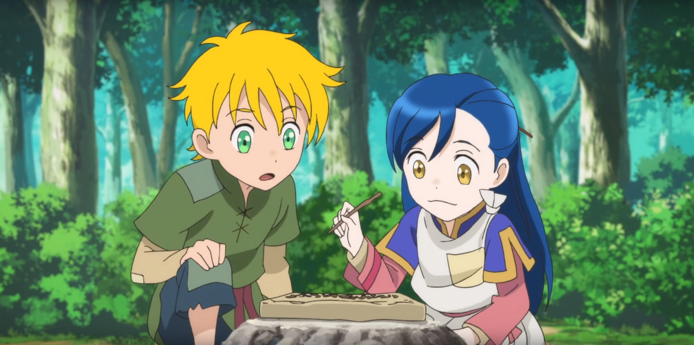

<h3 class="sc-1bwb26k-1 fvCjqJ" id="h101544">Reader’s
  Pick for Best Comedy: <em>Kaguya-sama: Love Is War</em></h3>
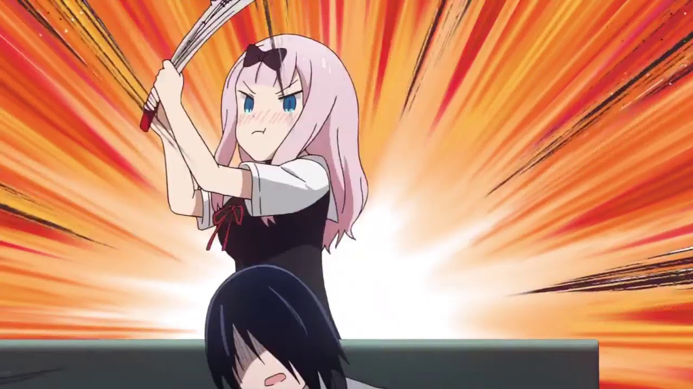
<h3 class="sc-1bwb26k-1 fvCjqJ" id="h101545">Reader’s Pick for Best Romance:
  <em>Kaguya-sama: Love Is War</em></h3>
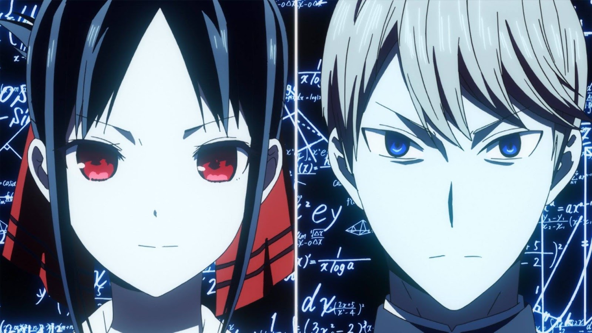

<h3 class="sc-1bwb26k-1 fvCjqJ" id="h101546">Reader’s
  Pick for Best Drama: <em>O Maidens in Your Savage Season, Carole and Tuesday, Vinland Saga</em></h3>
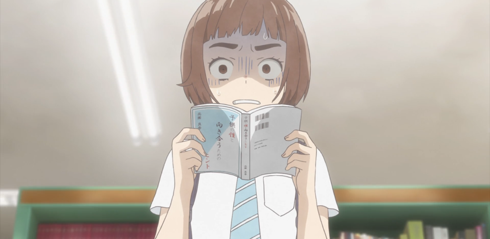

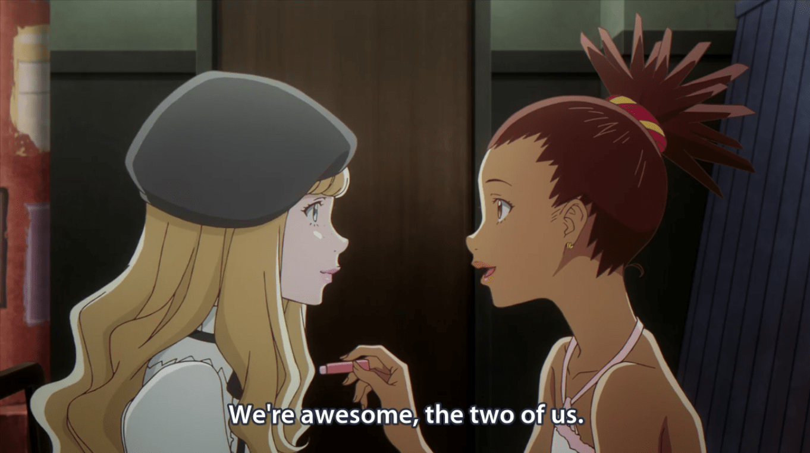
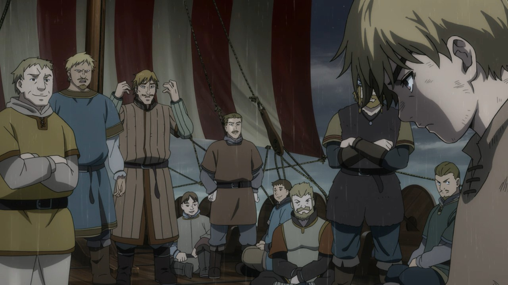

<h3 class="sc-1bwb26k-1 fvCjqJ" id="h101547">Reader’s
  Pick for Best Action: <em>Demon Slayer</em></h3>
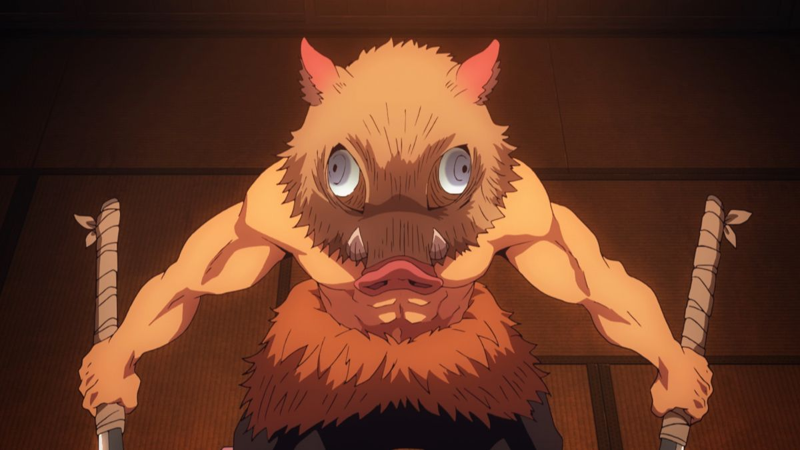

<h3 class="sc-1bwb26k-1 fvCjqJ" id="h101548">Reader’s
  Pick for Best Animated: <em>Demon Slayer</em></h3>
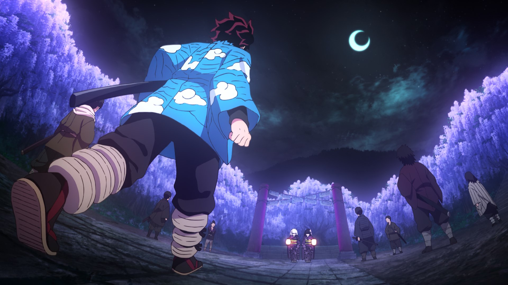

<h3 class="sc-1bwb26k-1 fvCjqJ" id="h101549">Reader’s
  Pick for Hidden Gem: <em>Ascendance of a Bookworm</em></h3>
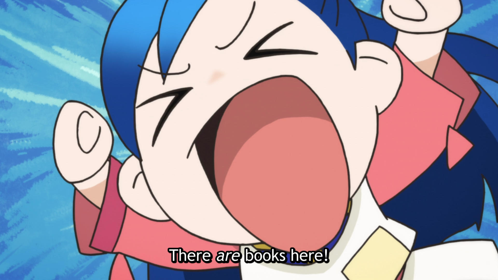

<h3 class="sc-1bwb26k-1 fvCjqJ" id="h101550">Reader’s
  Pick for Sequel of the Year: <em>Mob Psycho 100 II</em></h3>

<h3 class="sc-1bwb26k-1 fvCjqJ" id="h101551">Reader’s Pick for Anime Movie
  of the Year: <em>Promare</em></h3>
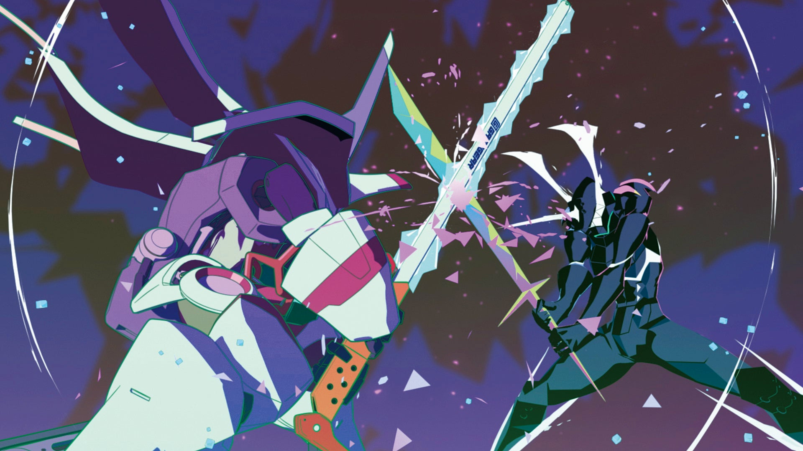

<h3 class="sc-1bwb26k-1 fvCjqJ" id="h101552">Reader’s
  Pick for Anime of the Year: <em>Demon Slayer</em></h3>
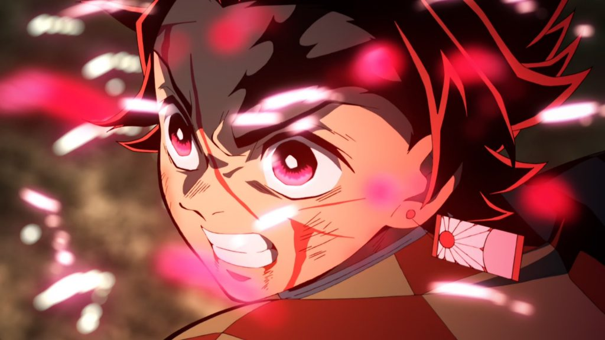

<h2 class="sc-1bwb26k-1 fvCjqJ" id="h101553">Author
  Awards</h2>
Here’s what the Authors of AniTAY decided! We here at AniTAY are an
  opinionated bunch, a group of people who vary drastically yet all magically have a consensus on certain things. We
  watch a lot of anime, so expect some different results than from most. This year there was quite a lot of ties!

<h3 class="sc-1bwb26k-1 fvCjqJ" id="h101554">Author’s
  Pick for AniTAY Favorites: <em>Kaguya-sama: Love Is War &amp; Astra Lost in Space</em></h3>
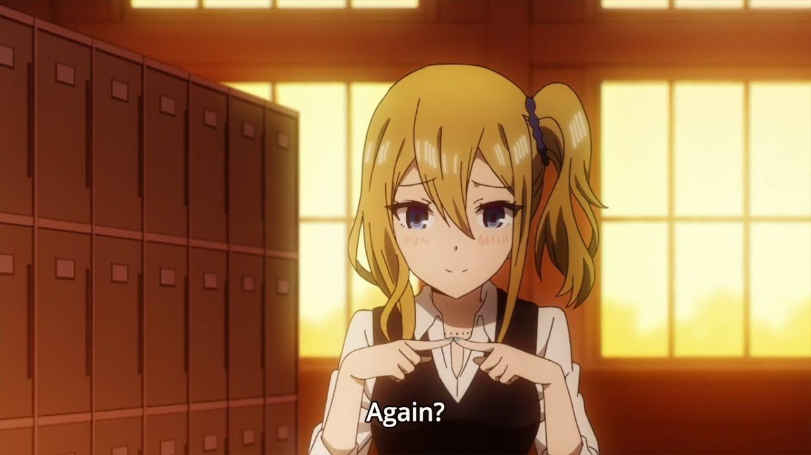

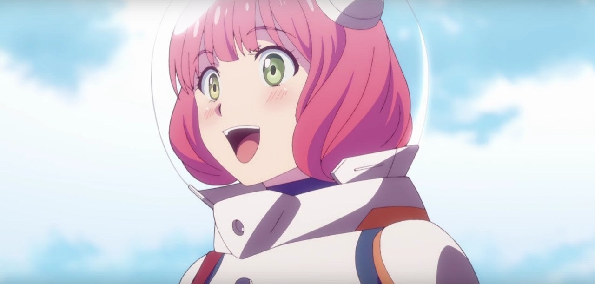

<h3 class="sc-1bwb26k-1 fvCjqJ" id="h101555">Author’s
  Pick for Most Trash Show: <em>Domestic Girlfriend &amp; ORESUKI Are you the only one who loves me?</em></h3>
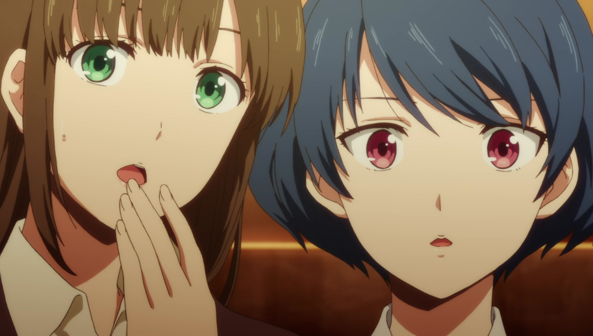

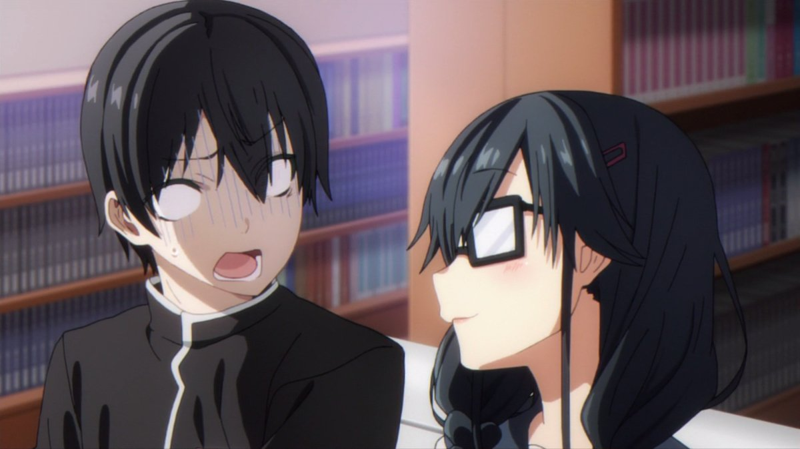<h3 class="sc-1bwb26k-1 fvCjqJ" id="h101556">Author’s Pick for Best Male
Character: Askeladd - <em>Vinland Saga</em></h3>
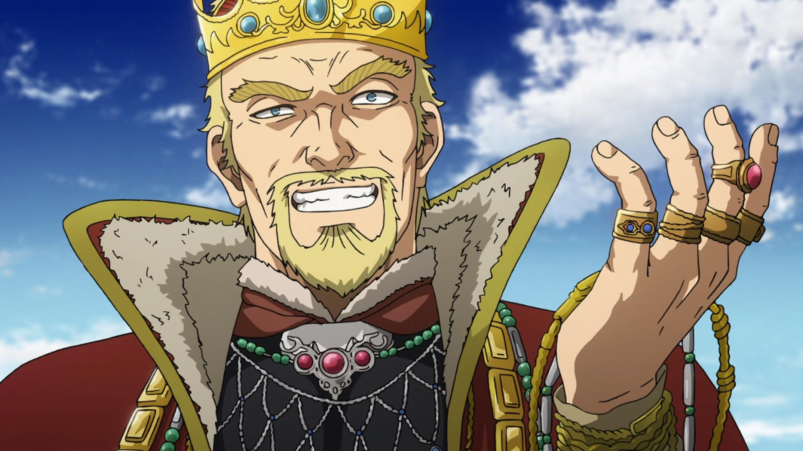

<h3 class="sc-1bwb26k-1 fvCjqJ" id="h101557">Author’s
  Pick for Best Female Character: <em>Emma - Promised Neverland &amp; Clara - Welcome to Demon School! Iruma-Kun</em>
</h3>
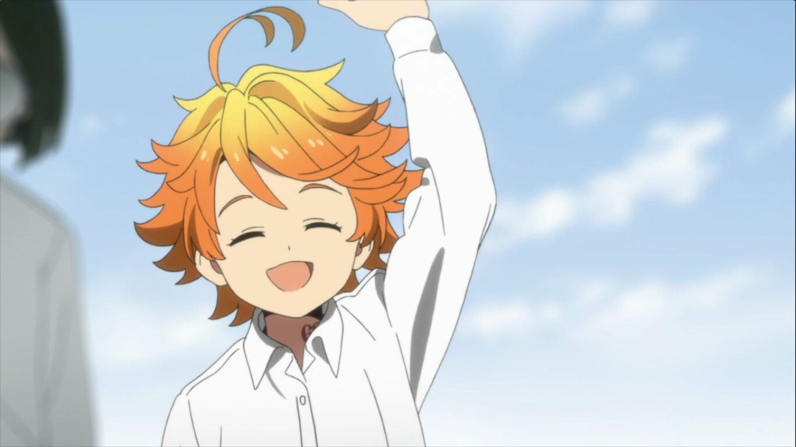

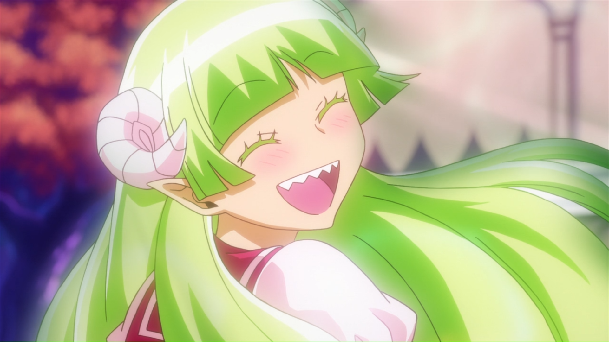

<h3 class="sc-1bwb26k-1 fvCjqJ" id="h101558">Author’s
  Pick for Best ED: <em>Kaguya-sama: Love Is War</em> - “Chikatto Chika Chika”​ by Chika Fujiwara</h3>

<iframe allow="accelerometer; autoplay; clipboard-write; encrypted-media; gyroscope; picture-in-picture" allowfullscreen="" frameborder="0" height="315" src="https://www.youtube.com/embed/OdZrFtIGzfU" width="560"></iframe>

<h3 class="sc-1bwb26k-1 fvCjqJ" id="h101559">Author’s
  Pick for Best OP: <em>Dororo - </em>“Kaen” by Ziyoou-vachi</h3>

<iframe allow="accelerometer; autoplay; clipboard-write; encrypted-media; gyroscope; picture-in-picture" allowfullscreen="" frameborder="0" height="315" src="https://www.youtube.com/embed/W78Wl1V6BoM" width="560"></iframe>

<h3 class="sc-1bwb26k-1 fvCjqJ" id="h101560">Author’s
  Pick for Best Slice of Life:<em> Ascendance of a Bookworm</em></h3>
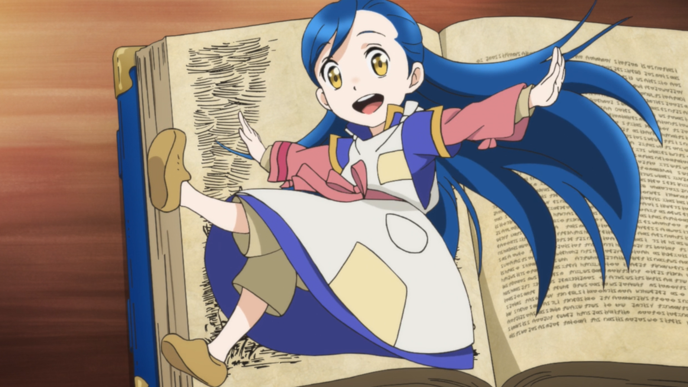

<h3 class="sc-1bwb26k-1 fvCjqJ" id="h101561">Author’s
  Pick for Best Comedy: <em>Kaguya-sama: Love Is War</em></h3>
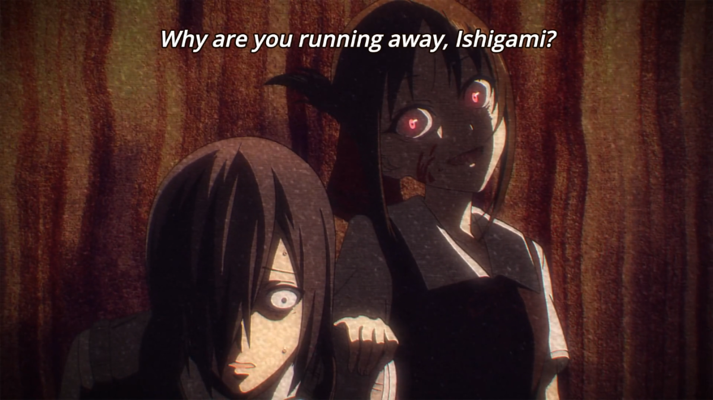

<h3 class="sc-1bwb26k-1 fvCjqJ" id="h101562">Author’s
  Pick for Best Romance: <em>Kagya-sama: Love Is War</em></h3>
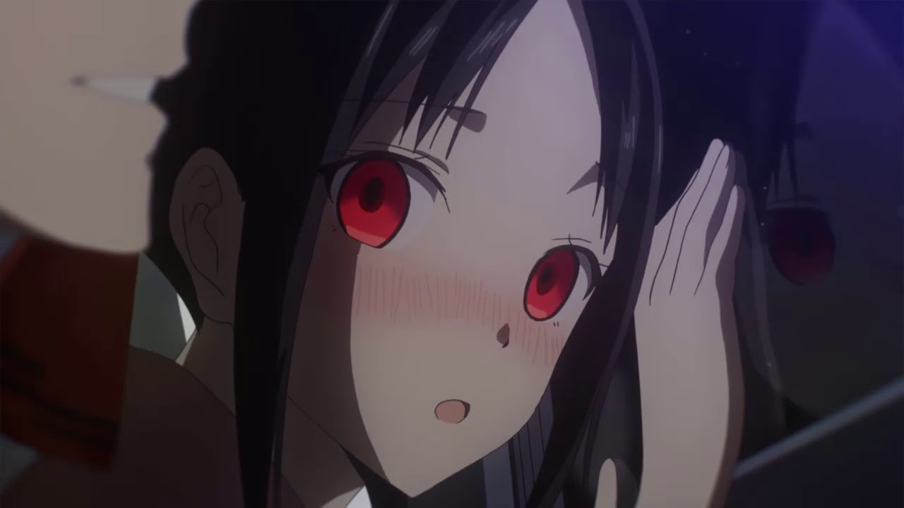

<h3 class="sc-1bwb26k-1 fvCjqJ" id="h101563">Author’s
  Pick for Best Drama: <em>Vinland Saga &amp; O Maidens in Your Savage Season</em></h3>
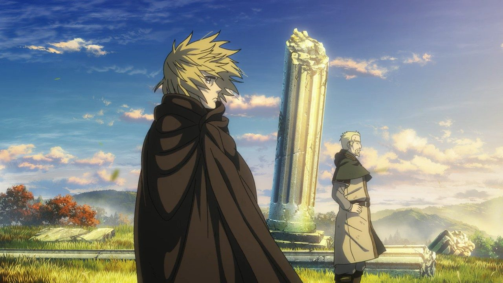

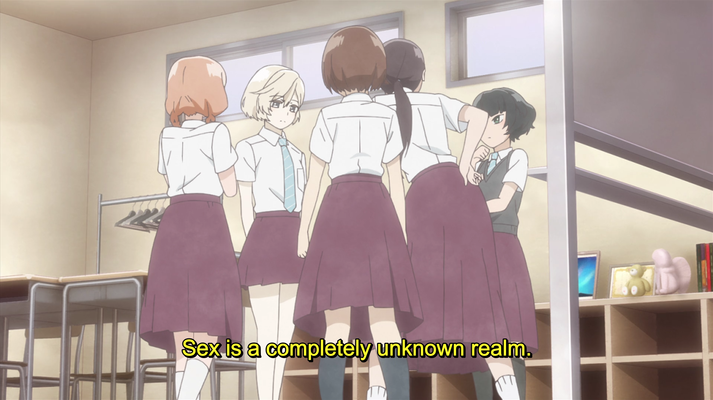

<h3 class="sc-1bwb26k-1 fvCjqJ" id="h101564">Author’s
  Pick for Best Action: <em>Demon Slayer &amp; Dororo</em></h3>
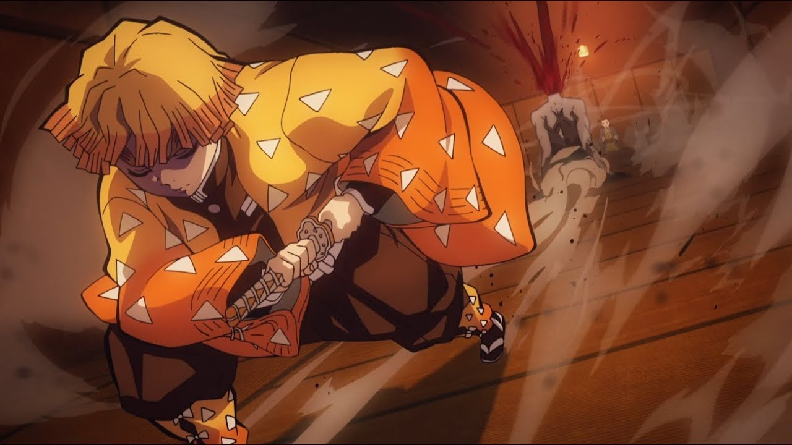
<h3 class="sc-1bwb26k-1 fvCjqJ" id="h101565">Author’s Pick for Best
  Animated:<em> Mob Psycho 100 II</em></h3>
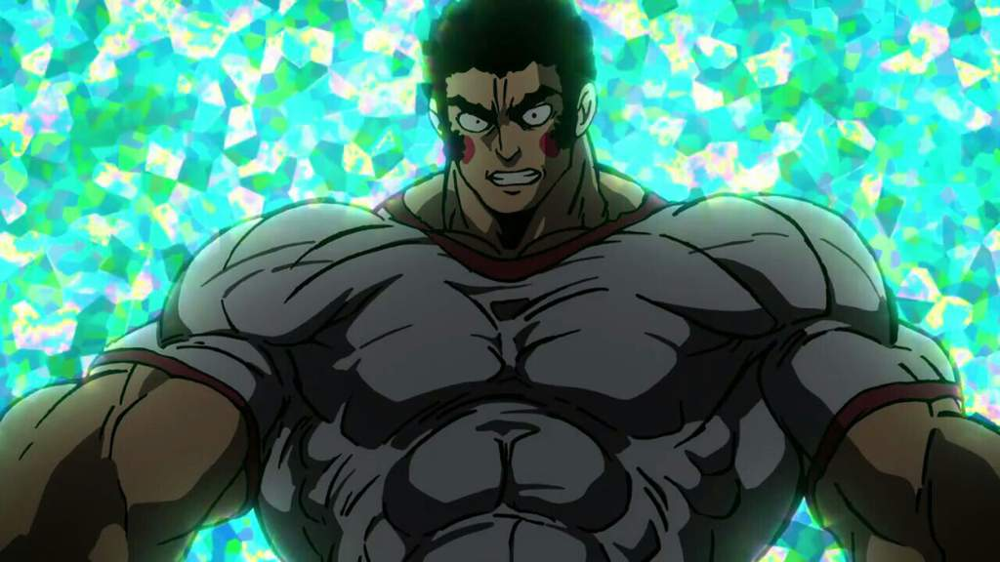

<h3 class="sc-1bwb26k-1 fvCjqJ" id="h101566">Author’s
  Pick for Hidden Gem:<em> Endro~!</em></h3>
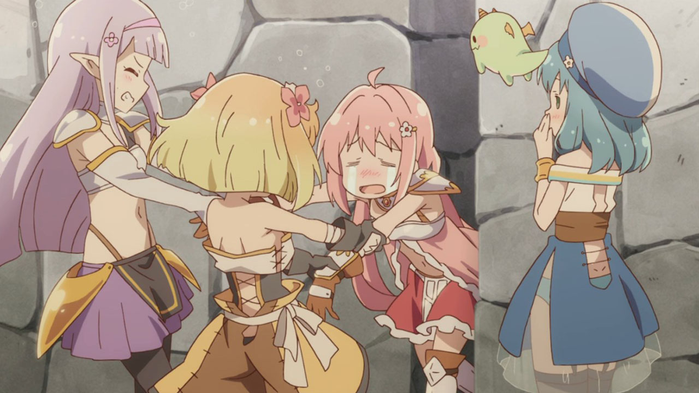

<h3 class="sc-1bwb26k-1 fvCjqJ" id="h101567">Author’s
  Pick for Sequel of the Year: <em>Mob Psycho 100 II</em></h3>
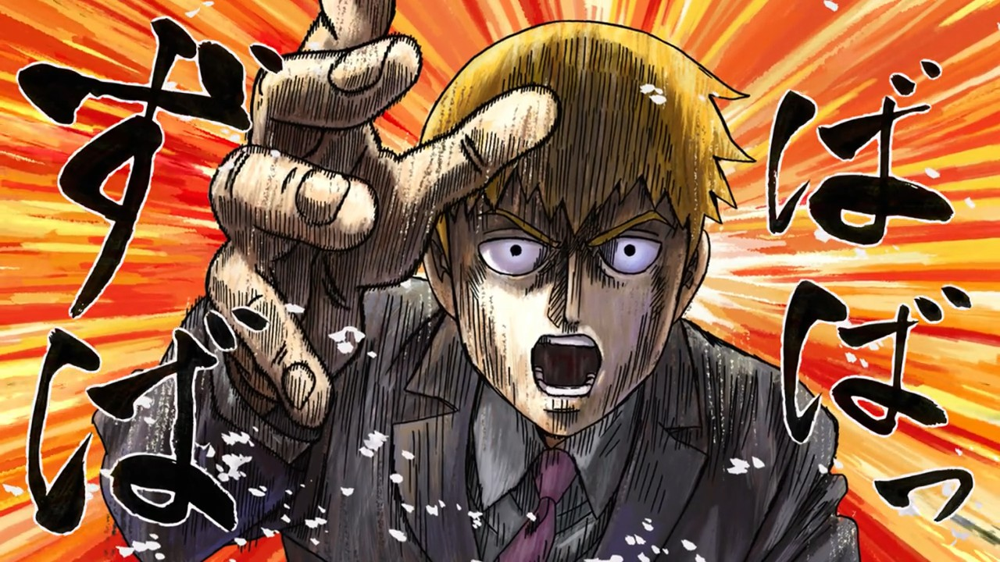

<h3 class="sc-1bwb26k-1 fvCjqJ" id="h101568">Author’s
  Pick for Anime Movie of the Year: <em>Promare</em></h3>
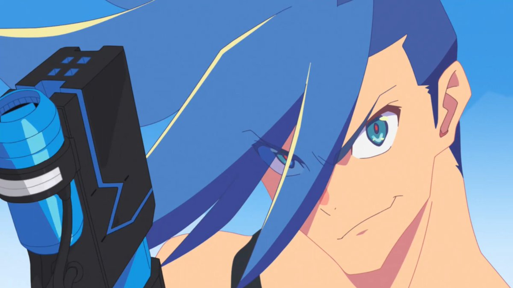

<h3 class="sc-1bwb26k-1 fvCjqJ" id="h101569">Author’s
  Pick for Anime of the Year: <em>Vinland Saga</em></h3>
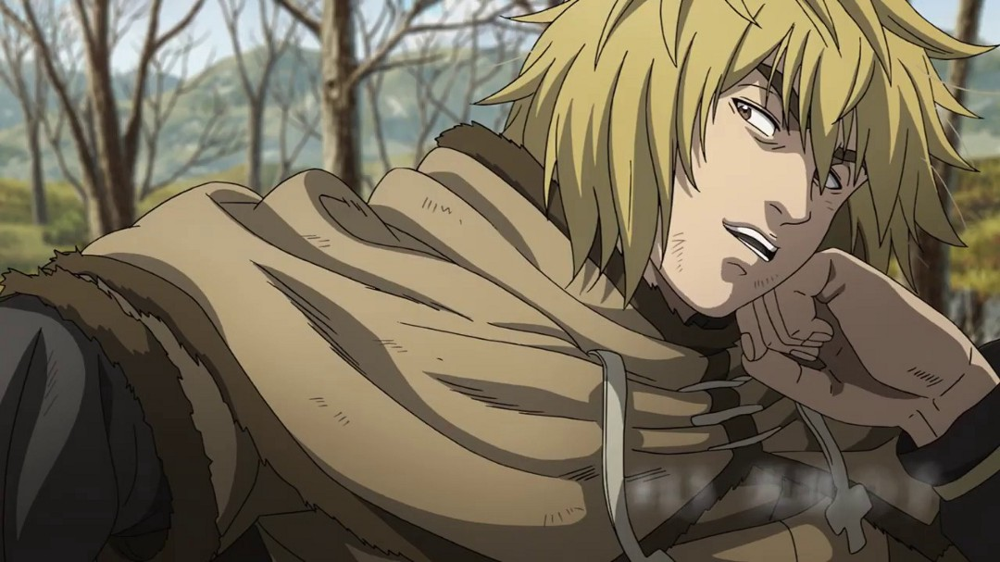

<em>Thanks for checking out AniTAY and the AniTAY Anime
  Awards! Ani-TAY is the anime-focused portion of Kotaku’s community-run blog, Talk Amongst Yourselves where writers
  love everything anime related. Click here to check us out!</em> 

<em>If you want more thoughts on Anime of 2019, check out the </em><a class="sc-1out364-0 hMndXN sc-145m8ut-0 gIacKn js_link" data-ga='[["Embedded Url","External link","https://anitay.kinja.com/anitay-podcast-season-5-episode-1-anitays-top-anime-of-1841155150",{"metric25":1}]]' href="https://anitay.kinja.com/anitay-podcast-season-5-episode-1-anitays-top-anime-of-1841155150" rel="noopener noreferrer" target="_blank"><em>AniTAY Podcast Here</em></a><em>!</em>

