---
{
	title: "The Beautiful Geopolitical World Building of Trails' Crossbell Arc - Reikaze Rambles",
	published: "2020-07-06T21:30:00-04:00",
	tags: ["Reikaze Rambles", "Rockmandash Rambles", "RockmanDash Reviews", "AniTAY", "TAY", "Trails", "Kiseki", "Crossbell", "Trails From Zero", "Trails To Azure"],
	kinjaArticle: true
}
---

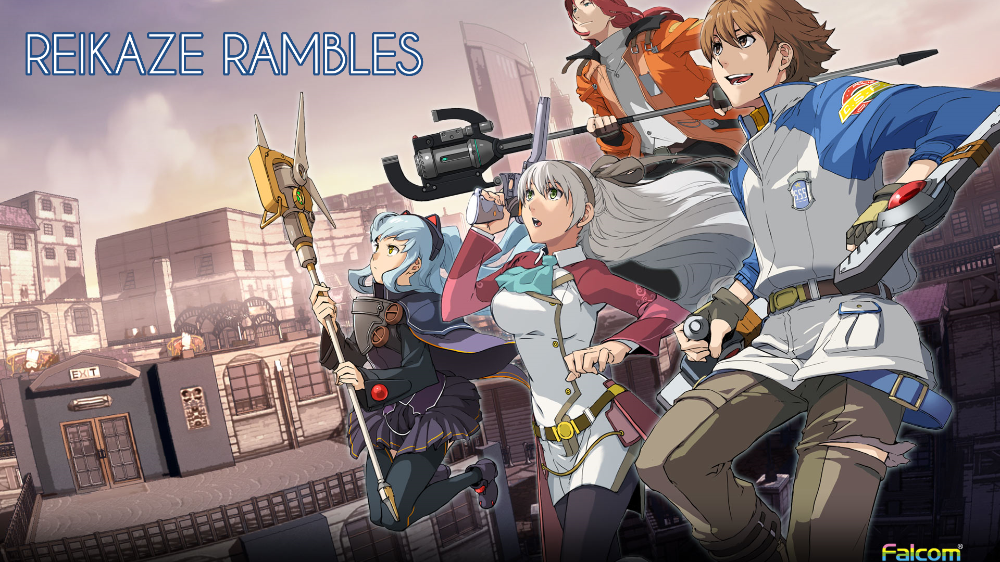

I don’t think I’ve made it any kind of secret, ([*especially if you follow me on twitter*)](https://twitter.com/Reikaze0) that i’m a big fan of Falcom and in particular, their Trails series. Recently, *Trails From Zero* and* Trails to Azure*, which are currently stuck in localization purgatory, were made playable in English thanks to the efforts of fans. These are incredible games that I recommend and are legitimately some of my favorites... but rather than just talk my straight thoughts on the game, I feel compelled to spend some time talking about the brilliance that is the setting of Crossbell, and the beautiful political storytelling that is the Crossbell Arcs - how it inverts the traditional storytelling paradigm and has city drive the story, instead of the story driving the world building.

***

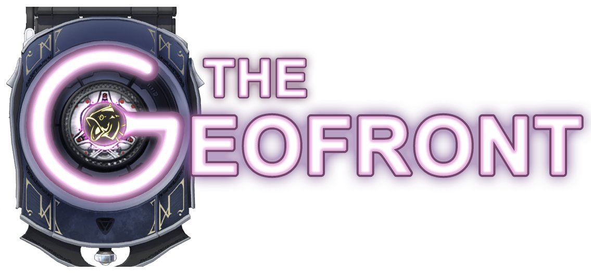

**Disclaimer-** this video doesn’t spoil any specific story elements of the Trails games, but talks in great length about the geopolitics of the setting and it’s correlations with real life locations. I try to avoid mentioning specific events, but the stuff I say might be spoiling events indirectly so if you want to go into *Zero *and *Azure* blind, I’d recommend leaving now.

Also, I’d just like to shout out [Geofront](https://geofront.esterior.net/) - the work put into quality of life improvements are just as impressive as the work put into the translation itself.... and the chests. A little touch that adds so much character to the games, legitimately was dismayed when I got to *Azure *and those weren’t there. They do incredible work and playing their release of *Zero* was great. Right now, [Geofront only has released a patch for* Zero*](https://geofront.esterior.net/2020/03/15/trails-from-zero-out-now/), but they are planning on releasing a patch for Azure - I played an older TL but i’d recommend waiting if you can.\
\
One more also: I made a video verison of this article! Feel free to check it out:

<iframe src="https://www.youtube.com/embed/GjLbKxs4cgs"></iframe>

***

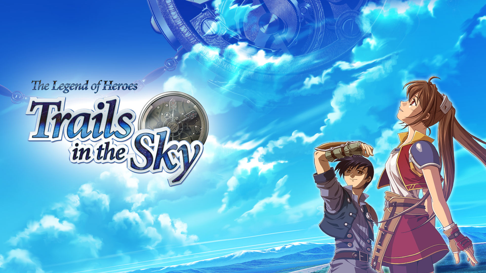

My experience with the first game I’ve played in the series, *Trails in the Sky* was a bit of being at the *right place,at the right time*:* *[*Sky* revived my love for a genre I came to hate at the time.](https://tay.kinja.com/my-love-for-falcom-games-or-how-falcom-shaped-my-exper-1752613309) Thanks to a one two punch of amazing characters and amazing storytelling, sky quickly became one of my favorite games ever, to the point in which I’d say it’s my favorite RPG of all time, and second favorite game period, right behind *The Legend of Zelda: Breath of the Wild.*

Personally, what makes Falcom works truly special, truly unique from anything else I’ve played is the attention to world-building they’ve managed throughout the series, leading to an amazing and incredible world that one can’t help but feel attached to. We see all these AAA devs try to use giant open worlds and throw money to try to create an immersive world that feels real - yet few have created works that seem to come close.

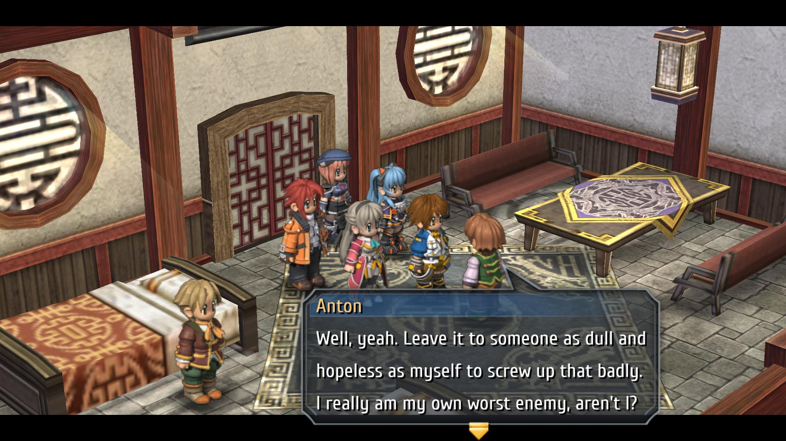

Falcom, the small Japanese dev has managed to accomplish this, not with technical tricks or graphical fidelity, but with attention to detail and excellent writing. NPCs aren’t just NPCs - they are written as people who have their own lives. Everyone has their own story, “NPC”s are just people who you don’t have direct involvement in the story. The places you visit feel incredibly alive because the individuals feel alive. The places aren’t huge, but incredibly detailed - these aren’t giant empty husks but compact and fleshed locations that feel like places where real people live. These places are also inherently weaved into the main story itself, with important people being inherently linked to the place.

The more time I spend away from Trails, the more I couldn’t help but be wowed about how incredible the world they’ve built was and how others simply just aren’t there. Locations aren’t just places you visit, but places people live, real cities that are alive, real nations that have real political differences and viewpoints. The geopolitics of Zemuria is convincing and compelling, in depth to a level that could be confused with real life locations.

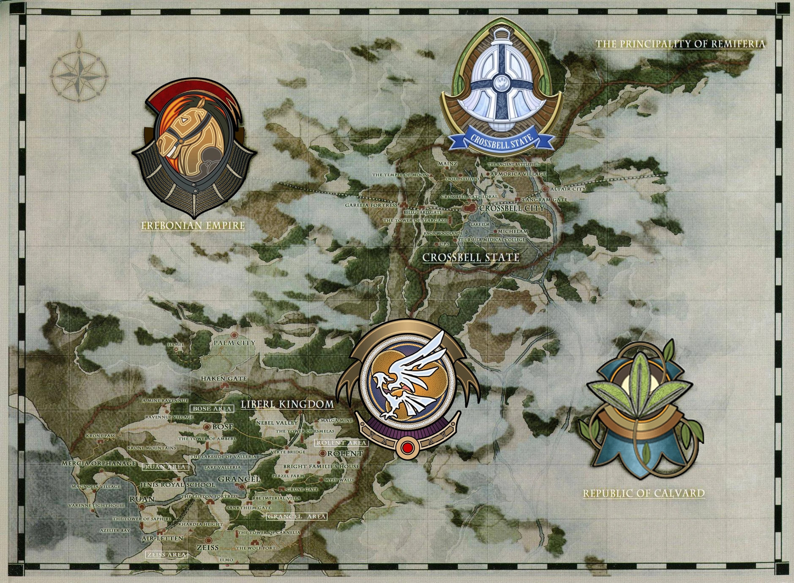

The driving force of the newer games of the story, from my viewpoint then, is primarily to grow and develop the world. Sure, there’s an overarching story that connects the story, but the world is an inherent part of that plot progression. Sky focused on the small kingdom of Liberl, a nation with a power void and reeling from an invasion, and the* Cold Steel arc* is focused on the giant empire of Erobonia, the nation that invaded in *Sky*, with rising tensions between the glowingly authoritarian national government and the regional powers that are ran by the nobles of the nation and represent tradition. But, there was something that has to be said - the more you play through the *Cold Steel* arc, the more you can’t help but feel like something’s truly missing, a feeling that’s totally justified... because something was missing.

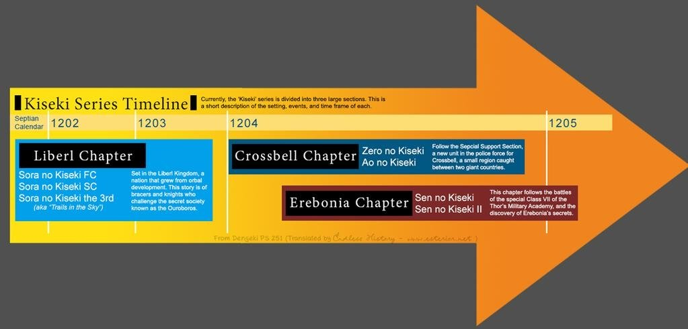

The first two games in the *Trails of Cold Steel *series take place at the same time as another series. While you’re focused on the civil war in Erebonia, other just as significant events occur in the city of Crossbell that you witness from a big picture perspective, but don’t really get to see what happens, which goes against the nature of Trails’ world building. This is of course, because those events are thoroughly explored in the Crossbell arc,* Trails from Zero* and *Trails To Azure*, the games sent in the said city.

Even before I played the Crossbell games, Crossbell was a location I was eagerly awaiting to visit. It almost seemed like a time Anachronism; a place that couldn’t possibly exist given the developing nature of the world. To give some background - The trails games take place on a continent called Zemuria, specifically in the west half of the continent. When these games take place, From Septian Calendar S1202 through S1206, and the world is rapidly industrializing thanks to Orbal revolution. Orbals, just technology wise, are effectively a clean power source for anything and can effectively do anything, drive vehicles, power electronics, and more.

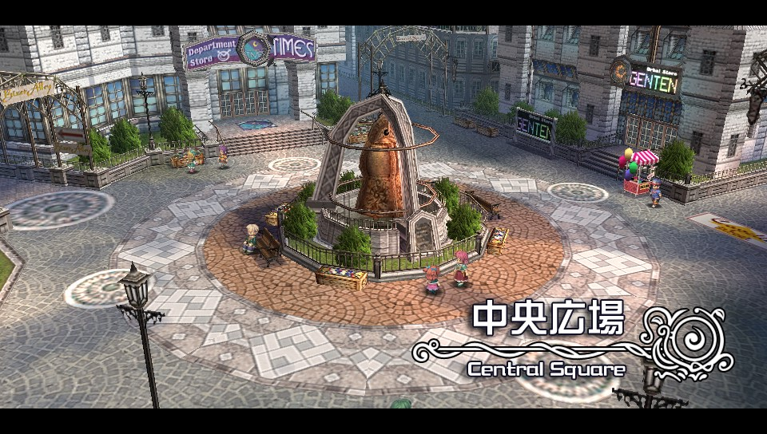

Compared to our world, It’s like the 2nd and 3rd industrial revolutions all crammed into an incredibly short time period, and it leads to incredible variants in technology throughout the world, even more so than ours - the location of Sky, Liberl, is a nation that has great air infrastructure with an airport in every town but is a nation that hasn’t fully industrialized, and Erebonia is a nation with a vast rail network connecting the giant empire together, but both feel Pre-World War 2 in technology in regards to infrastructure, for the most part.

Enter the city of Crossbell, a modern metropolis comparable to what we have in our world. Crossbell, in the world of Zemuria is incredibly special - while most of the world has bits and pieces of technology, Crossbell has everything - an airport, rail infrastructure, orbal cars and busses zipping around, glistening skyscrapers like the Orchis Tower, Amusement parks, and the internet! Crossbell is a major economic hub where everything comes together, a city straddled between two major powers - the Empire of Erobonia, and the equally large Republic of Cavard... which leads us into the political situation of Crossbell and the genius of the games. There’s so much depth with the setting that the geopolitics of the game itself drives the story!

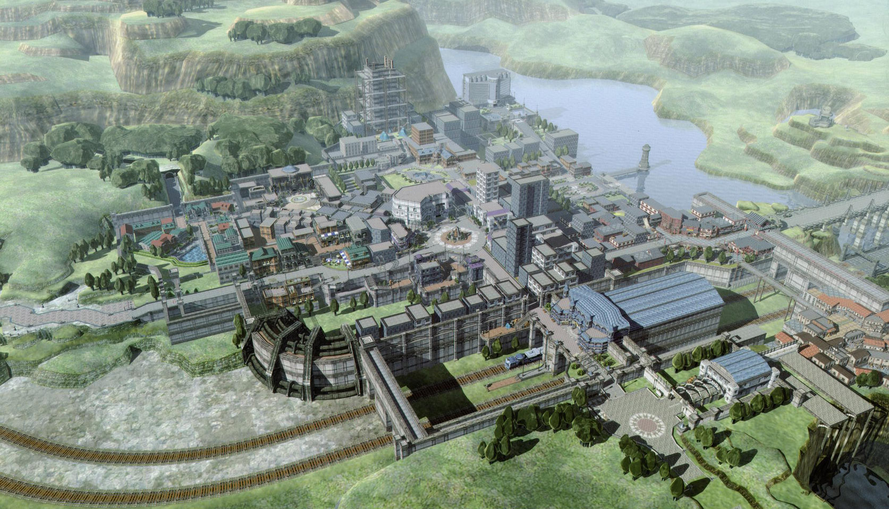

Crossbell, is a self-governing buffer state that, after being fought over and traded hands several times, was made to be a tributary state where both nations serve as a suzerain over Crossbell. This is simultaneously a bane and a boon for Crossbell - Crossbell’s economic prowess is a result of its status of being a hub between them but their political nature leaves Crossbell beholden to both nations and incapable of making its own decisions. Its legislature is effectively designed to be ineffective, it’s police can’t really enforce the law on citizens from either the empire or from the republic.

The State of Crossbell itself is effectively a character and is really the focus of the game. Trapped by major powers with its fate basically dictated by them, but became rich and powerful because of that it’s hard not to think of places like Hong Kong and Kashmir, and the dread because the nature of the state itself is hanging on a thread. *Zero *and* Azure* immerses you into the game and allows you to feel everything about the city- it’s people, places, but most definitely the situation.

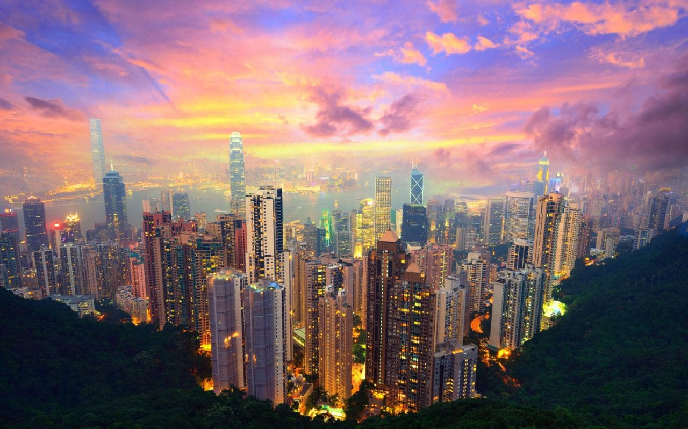

While technically politically closest to[ Andora](https://www.youtube.com/watch?v=T49ERQDuBGc), Hong Kong is definitely the closest emotionally and situationally because of its situation as an economic gateway and hub, the balance between Hong Kong’s British past and Chinese influence is a rather similar situation, and the uncertainty and impending doom, the lack of having your own real voice in what happens in the land you love and live in, it’s all eerily similar to the situation of Hong Kong and now with the protests. How important is the self-rule of Crossbell if it’s effectively overruled by the two suzerain states?\
\
Kashmir comes to mind because of its landlocked existence between two warring powers and disputed nature. Hong Kong doesn’t have to deal with the impending doom of being invaded by a nation if each other asserts more sovereignty over the nation, Kashmir does. The hostility between nations is much more like a Kashmir situation than a Hong Kong situation.

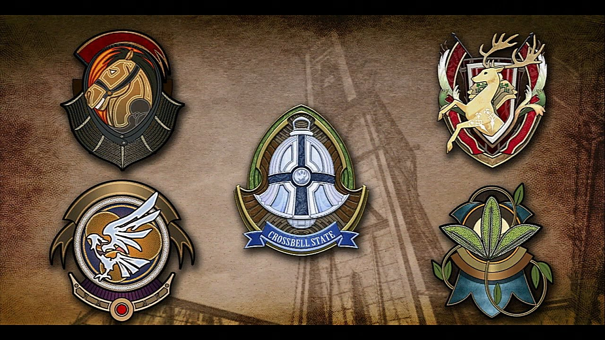

Yet at the same time, Crossbell is unique - it has way more influence than both Hong Kong or Kashmir - it has a premise and impact that is much more significant than each of those states - while it doesn’t have much political power, it’s one of the most important economic hubs of the continent and as a result can stand with the others in conferences like the West Zemuria Trade Conference which it hosts.

There’s something really compelling about a city like this, with the different feuding factions, with the technological advancement, it all adds up to be an incredibly intriguing location with depth, and heart. And the best part about all of this is that the way that Crossbell is implemented into the story of* Zero* and *Azure* means that you as a player gets to feel all of this political tension as the SSS has an incredible intimacy with the city - the people, the locations, and the political structure as all of this affects you in one way or another. Hell, even the themes of the game, seeking the truth and getting over barriers either feed into the setting or are founded because of the setting itself.

A dark future seemingly looms above the city, what can be done about it? How does that affect the citizens and what are the dynamics that such scenarios cause? There’s so many strong emotions that lead as a result of the setting and it’s one of my favorite settings in fiction.

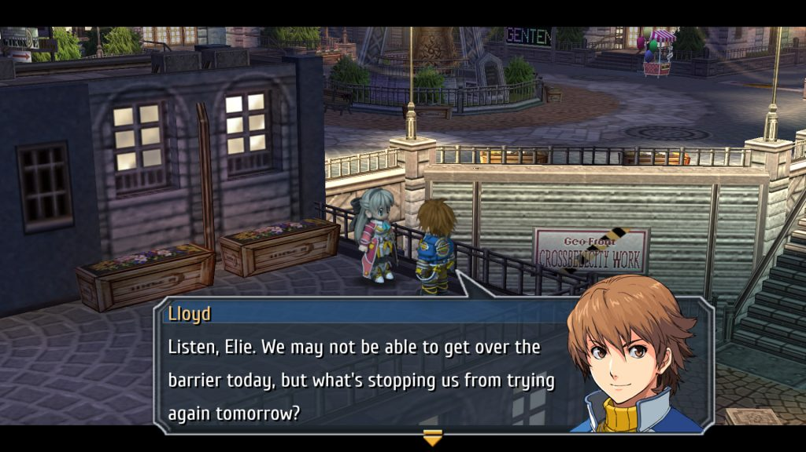

In the Crossbell arc, events are driven by the nature of the Crossbell state, and the political events of Crossbell are the important story elements of* Zero *and *Azure*. The Crossbell arc isn’t a story driven by victory like so many other games. The games effectively immerse you in this political reality and throughout your hours in this city you get to feel, stew and think about the political situations of this city. All the events and characters feed into the story of the city. I can only think of a few times that a work has effectively made the setting a character - [*428: Shibuya Scramble*](https://rockmandash12.kinja.com/rockmandash-reviews-428-shibuya-scramble-1830053550), *Legend of the Galactic Heroes *comes to mind, and I’ve loved it every time.

There’s no real “good or bad” guy, there’s political differences. Crossbell and the SSS are placed in a tricky situation where there’s no objective good, there’s powers in place that mean you can’t just win, and this grounded nature truly makes these games special. This fact has made Crossbell’s storytelling some of the most compelling, engaging, relatable content out there. This is one of the few works I’ve experience that \*gets\* geopolitics, and I’m really glad I’ve had the opportunity to play it.

***

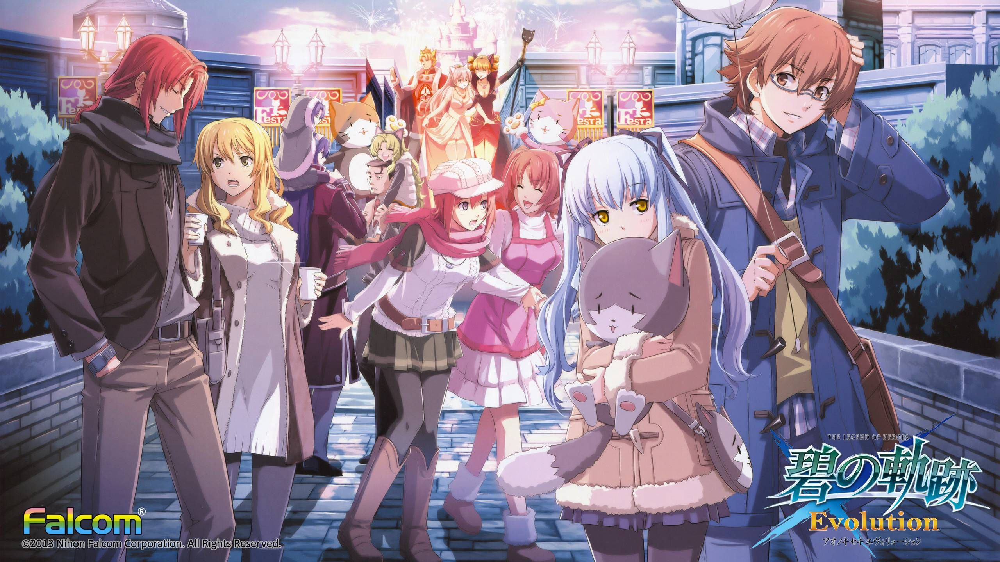

The Crossbell arc then, is special because it pulls off something I can’t help but be impressed by. From it’s world building alone, Falcom has managed to tell a compelling geopolitical story that’s legitimately some of the best I’ve personally seen. By drawing parallels to real life political situations, it creates an atmosphere of dread that’s inherent to locations that are in scenarios like Crossbell and makes for an incredibly convincing and moving story. It’s a masterclass in political storytelling, and I’m incredibly glad I had the opportunity to play this game.

PS. I do have to mention that there are plenty of merits to the games outside of the setting, with the primary one being that the cast of Crossbell is so lovable (**TIO IS BEST GIRL**) but, you can see [my two](https://twitter.com/Reikaze0/status/1245225010517569536) [twitter threads](https://twitter.com/Reikaze0/status/1256501786090696704) for more of my thoughts of the game. If you want a review of my thoughts, let me know.

***

*Thank you for reading! This is Rockmandash Reviews/Reikaze Rambles, a blog focused on whatever I’m interested in: Visual Novels, Tech, RPGs and more! If you want to check out more of my writing, check out * [*FuwaReviews*](https://fuwanovel.net/reviews-hub/) * and *[*AniTAY*](http://anitay.kinja.com/#_ga=2.29830716.283022684.1516595779-1252363867.1516472140)* where I am a contributor and *[*follow me on Twitter*](https://twitter.com/RockmanDash12)*.*
