---
{
	title: "The Boy and the Beast : The AniTAY Review",
	published: "2016-03-09T00:00:00-05:00",
	tags: ["The AniTAY Review", "The Boy and the Beast", "Rockmandash Reviews", "Movie", "Mamoru Hosoda", "AniTAY", "Tayclassic"],
	kinjaArticle: true
}
---

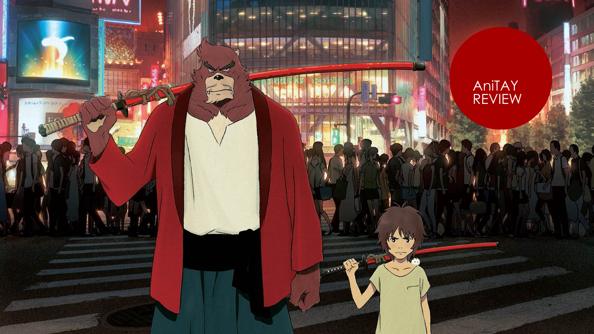

For those who like anime movies, a new film by Mamoru Hosoda brings a round of excitement, as he constantly pumps out quality films. Being the next film after the critically acclaimed *Wolf Children* has to be tough, but *The Boy and the Beast* is a film that does not disappoint, adding another great movie to Hosoda’s list of works.

### *The Boy and the Beast *is Another Great Coming Of Age Story

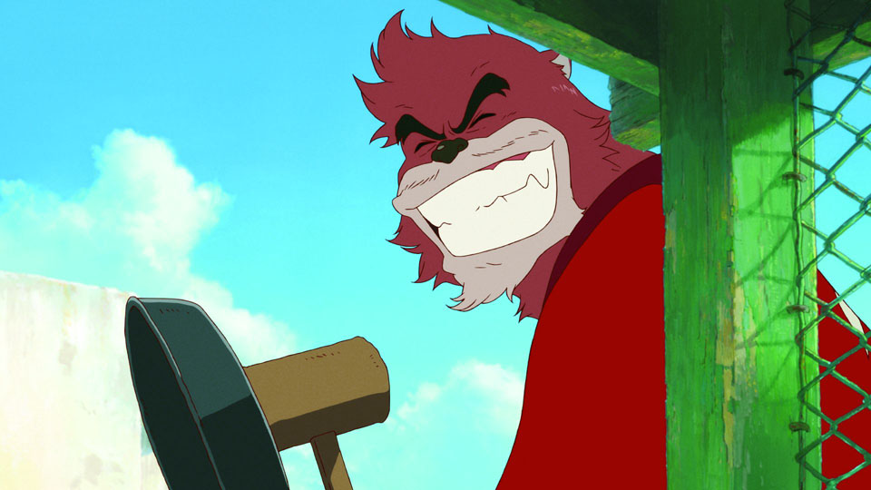

Mamoru Hosoda is great at constructing stories that are polished and entertaining, and to nobody’s surprise, *The Boy and the Beast *is no different. If you’ve liked the stories in his previous films, or if you like Ghibli-like films you’ll be perfectly at home here as the style of the story he tells is very similar, but good and different enough to keep things interesting and engaging. While the story isn’t perfect (I’ll talk about the issues later), Hosoda’s consistency with writing is to the point that every time I go and watch one of his works, I come in expecting a well constructed film that’ll put a smile on my face, and *The Boy and the Beast* provides that with a coming of age and great character interactions between the cast.

We start out the story following a 9 year old child named Ren (later known as Kyuuta), right after his mother has passed away. In despair because of his loss and curiosity where his father was, Ren decides to run away from his guardians into the busy streets of Tokyo with no plan on what to do. While brooding in the streets, he encounters a beast who we learn later on is named Kumatetsu. Ren follows Kumatetsu into the world of beasts (called *Jūtengai* in the film*)*, where Kumatetsu takes in Ren as an apprentice, and they live and grow together, each fixing the flaws that other has while developing their character in general. It’s an interesting premise and even though it’s tried and true, they handle it well: due to the way that they treat Ren/Kyuuta, instead having it a temporary adventure like most films would, this is his life. It’s not until he’s much older that he returns to our world, and this dichotomy between his worlds is an aspect that is handled well, one of my favorite parts of the story.

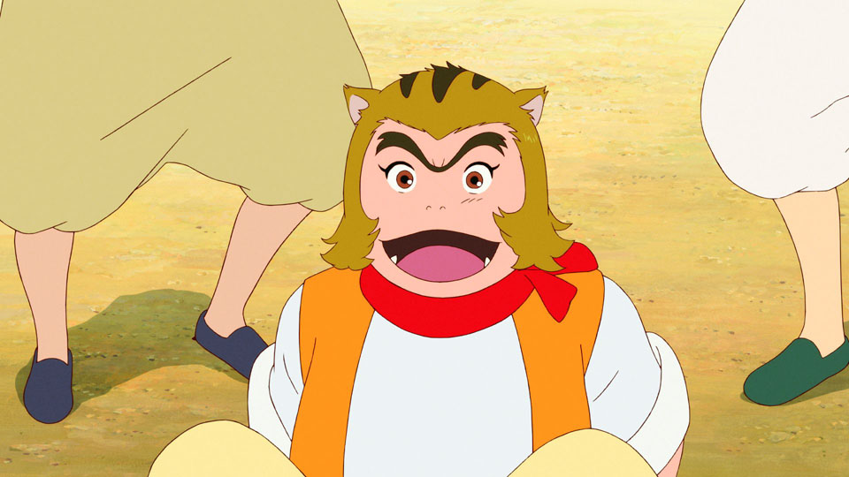

*The Boy and the Beast *first and foremost though,* *is a film about growing up, about growth and camaraderie, a happy and upbeat story with a fair bit of comedy about family and how those around you influence you. Everyone here wants to be stronger, they want to improve themselves to beat the challenges they have to confront. Seeing this strengthening of the self and others is almost awe inspiring, with every character bettering each other (even if some of the characters are rather one dimensional). Also, I’d like to say that *The Boy and the Beast *handles it’s themes really well, better than most films I’ve seen recently: it doesn’t necessarily shove down its themes of strength and growth down your throats, but it does make them prominent. It truly feels like every scene was focused around them, and this is something I rather appreciated.

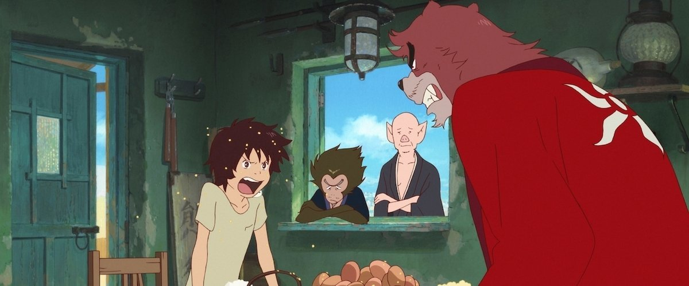

The effects of these themes is that it is a movie that gets you to care about the characters, and it consistently has great character interactions. While our main duo of Ren/Kyuuta and Kumatetsu steal the show and put a smile on the face of the viewers every time they are on the screen, every time any of the characters interact, they build off on each other. They interact in a way that feels authentic while being entertaining, they feel like they are truly growing and interacting in a way that people who had those personalities would, and it’s limited cast allows you to get to know the personalities of those in the movie and enjoy them all. Through it’s great characters, the work gets you to care about the story it provides, and the way it handles this is rather amazing in my opinion.

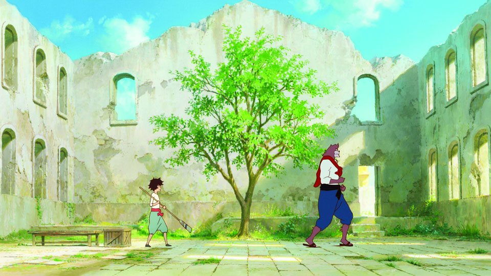

Overall though, *The Boy and the Beast *is another well polished Mamoru Hosoda coming of age film, one that will please anyone who liked his films and more: it’s a well executed story that is moving and engaging, one of the most enjoyable stories I’ve seen and it’s one that’ll appeal to many. It’s a movie full of character and charm that’ll get anyone interested in the film, and it’s a blast to watch while maintaining the quality we all expect from it.

***

### *The Boy and the Beast *is Hosoda’s Best Looking Film Yet

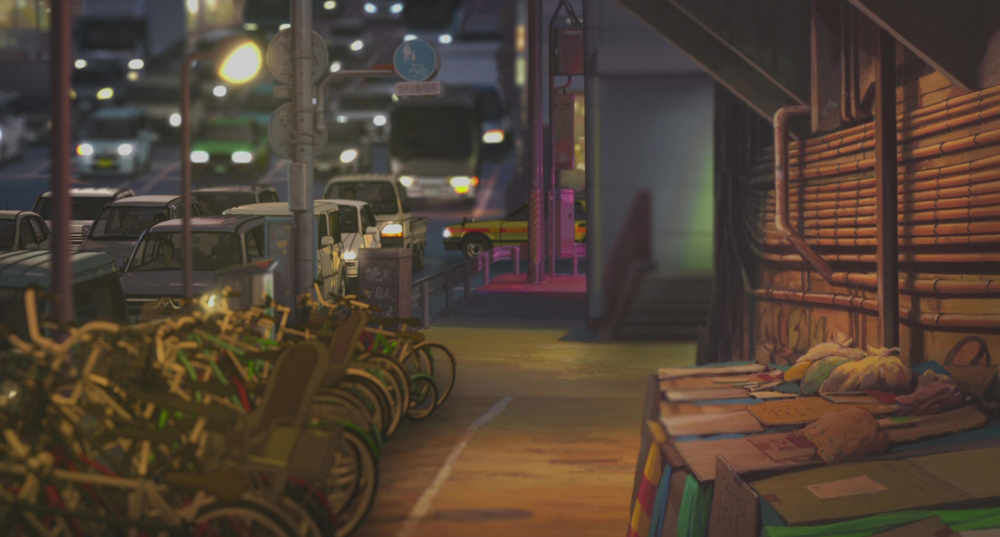

If you’ve been paying attention to the staff who’ve been working on Hosoda’s films, you’d know that they’ve traditionally been made by Studio Madhouse, a studio known for their high production values and amazing visuals in works like known for works like [*One Punch Man*](http://anitay.kinja.com/one-punch-man-the-ani-tay-review-1749225072)*, *Satoshi Kon’s films, and the absolutely stunning *Redine. **The Boy and The Beast *is the first Hosoda film to completely buck this trend, instead made by Studio Chizu, which is Hosoda’s own animation studio. This honestly is not a concern however, because if I didn’t check to see who made this movie, I honestly wouldn’t have been the wiser: this is the best looking Hosoda film yet, and man is it gorgeous. From the absolutely [gorgeous backgrounds](http://imgur.com/a/2udkD) to the amazing visual directing with amazing shot composition, the visuals are some of the best that animation has to offer. If you asked me, it’s up there with [Shinkai movies](http://tay.kinja.com/the-garden-of-words-the-ani-tay-review-1524606376) in my eyes with an insane amount of polish and detail in the shots that one can’t help but be impressed by.

It’s more than just scenery though: the movie is based around a specific fight and the animation is silky smooth, fight or no fight. In the fight scenes though, it’s well choreographed, and the animation throughout the scenes are great: fast and fluid, beautiful and consistent. Motion is impressive and the world looks interesting and alive, with the way they show the small details being the absolute highlight: they show like the way that sweat and blood looks and moves looking impressive throughout and makes the film look better than your traditional anime film. I just wish all anime could be this nice visually, but that’s a pipe dream.

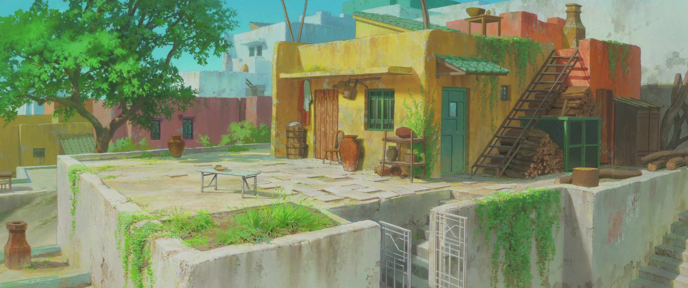

Speaking of things that I wish all works could have but is impossible, I have to mention how much I appreciate the shot composition, and how much it made a difference. Most directors nowadays don’t really pay that much attention to visually directing the shot and using the frame nearly as much as Hosoda does in this work (IMO), and Hosoda uses it so well that one of his previous works, *Wolf Children*, got a great video by [*Every Frame a Painting*](https://www.youtube.com/watch?v=pdSKot0psNg)* *which explained how great some of it’s shots are. (this video being just a specific shot actually.) The way that Hosoda uses the position of the scene to enhance your experience of the events or even tell stories is absolutely fantastic and impressed me consistently throughout the film. If you go and watch this film, you’re in for a treat with the visuals, as they are some of the best animation has to offer.

***

### The Dub is Pretty Great

Normally, anime fans here on AniTAY typically watch our anime in subtitles, having to read the words so we can understand it because there are usually no dubs out for the anime we are watching. Movies, which when brought over to the West are almost always an exception to this, and with The Boy and the Beast, I had the chance to go and see the movie in the theatres, in a dub. I gotta say, I rather liked it; all the actors really fit their characters well and they all gave a great performance. I am not an expert, but the experience listening to them throughout was solid and never once did I really think that it was unnatural or that someone else should have played a role. Everyone did their job well and it was one of the better dubs that I’ve seen (though, movie dubs are usually better than their TV counterparts for anime).

### The Story Isn’t Exactly Perfect...

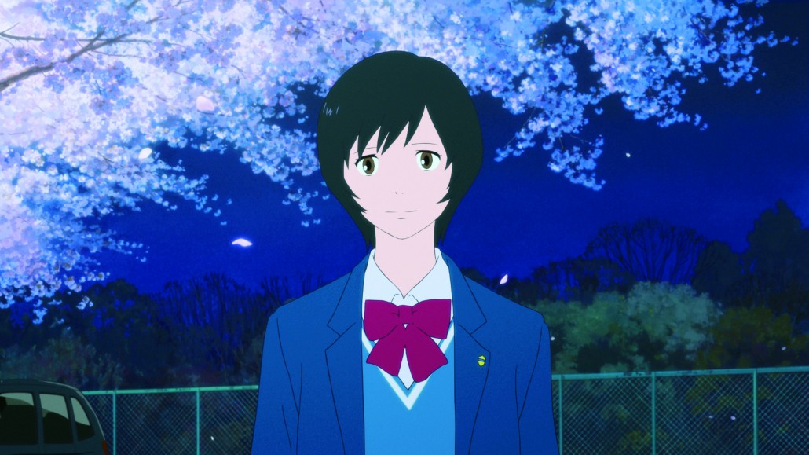

... because as much praise as I give it, it’s not a perfect film, and it’s weakest parts are the writing issues. These issues aren’t gamebreaking perse, but they do effect how one experiences the film. The most notable is the fact that it’s not all that original - we have a traditional coming of age story with a mythical world, and this may bother some. It’s well done, so I don’t think it’s that much of an issue, but if you’re looking for something innovative and different (or if you were looking for another feelzy *Wolf Children*), this isn’t it. To add to that, the direction of the story is rather unclear throughout the beginning part of the story, making it hard to grasp what the story is trying to do. You can stay on the ride and just go through what the story does, but knowing how and why a story does something through it’s direction is a trait that many appreciate.

Also, you’ll find at the end of the film that there are some minor issues as well. The story in the latter half of the story starts shifting from our world and the world of the beasts (Juutengai), and at that point the story started getting a bit messier, by moving from certain scenes too fast, doing things that seem far fetched and out of context in the world they built to the point that it may stretch your suspension of disbelief and having a romance that one can describe a cliche and generic, even if the characters do build off of each other in an interesting way. These aren’t something that’s going to break the movie, but it’s definitely worth mentioning.

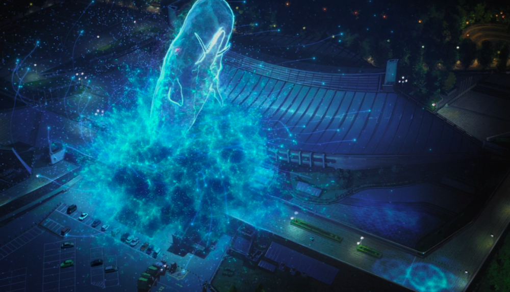

Also, the antagonist that was essentially pulled out of nowhere at the end, while making sense thematically, felt rather forced and like a bunch of BS. You still have something you can improve Hosoda!

***

### **The Background Music is entirely in the Background**

*The Boy and the Beast* has rather great music, each fitting with the world and the scene it is trying to create, but like so many other movies, it’s completely sitting in the background, only serving to augment the other aspects of the story without portraying any sense of importance or identity itself. The whole movie has solid tracks composed of the traditional, grandiose tracks you would associate with someone like Ghibli, but as I was writing this review I couldn’t recall any track or scene where there was music that particularly stood out, and that’s not the best sign to me. It signifies to me at least that attention wasn’t put to this aspect as much as others. This definitely won’t hurt your experience too much as so many films treat the soundtrack as completely in the background, but given everything else, it seems like a bit of a letdown to me, even if it’s good.

 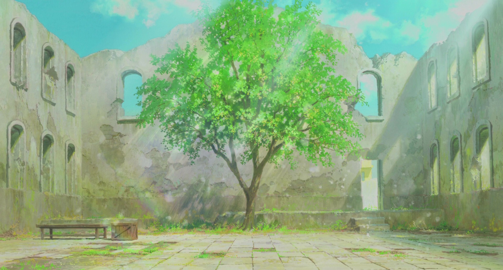

From the engaging coming of age tale to the breathtaking visuals, Mamoru Hosoda has created another fantastic tale that anyone can enjoy. While it’s not the most original, it’s a movie that is done exceedingly well and is enjoyable and likeable to the point that you can recommend it to anyone. If you asked me, I’d say *The Boy and the Beast *is an amazing film that is definitely worth the price of admission.

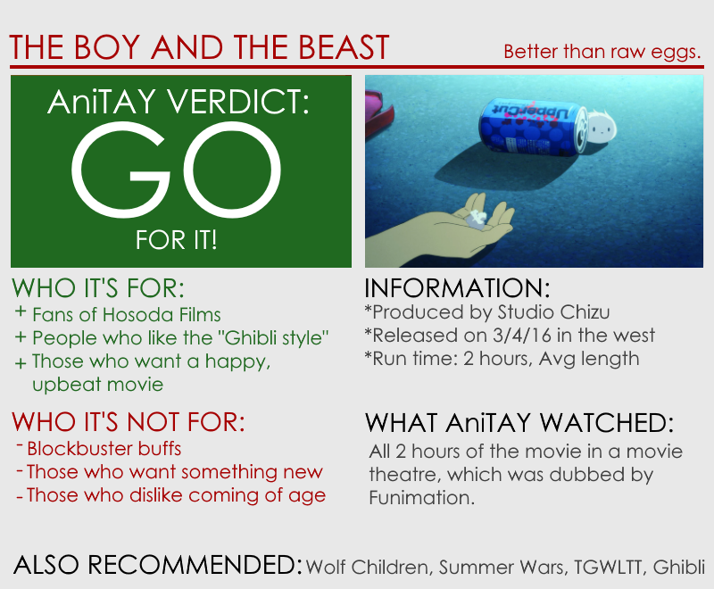

***

*You’re reading Ani-TAY, the anime-focused portion of Kotaku’s community-run blog, Talk Amongst Yourselves. Ani-TAY is a non-professional blog whose writers love everything anime related. Click *[*here*](http://anitay.kinja.com/)* to check us out. If you want to read more of my writing, check out *[*RockmanDash Reviews*](http://rockmandash12.kinja.com/)* and *[*KMTech*](http://kmtech.kinja.com/)*.*