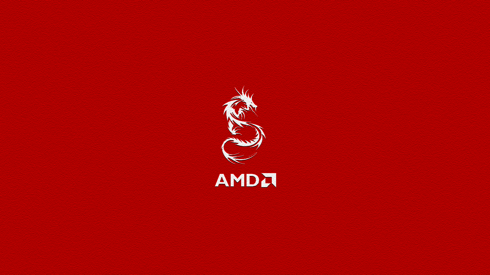
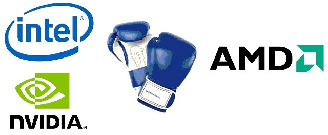
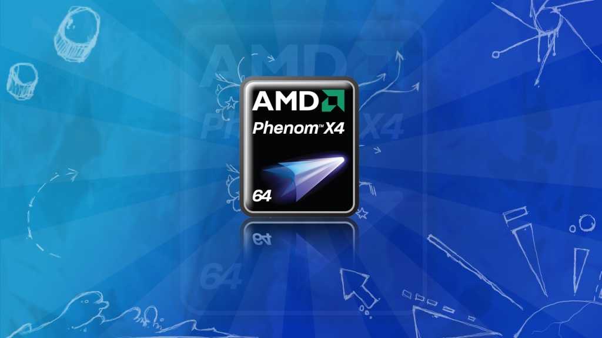
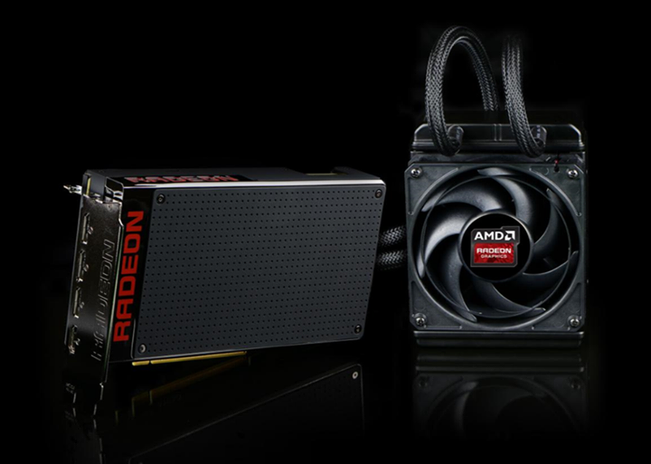

---
{
title: "The Disappointment that is AMD",
tags: ["Opinion", "PC", "AMD", "Rockmandash Rambles"],
authors: ['reikaze'],
published: '2015-06-25T01:22:02-04:00',
attached: [],
license: 'cc-by-4',
oldArticle: true
}
---

With the launch of the Radeon Fury X, If you’re a PC gamer, you’re probably
  feeling a pretty familiar feeling right now. Once again, the hype train steams by, only to deliver something that
  could never match those expectations. We hoped for the best, but reality decided that the best was too much for us.
  This is what it’s like to be a fan of AMD, and a fan of PC Gaming in general.

AMD (The company that provides parts for the current consoles), have been the second place
  value option when it comes to the PC for quite some time now: while they provided great products, the competition
  Intel and Nvidia always provided something better, if a bit more expensive. AMD has typically competed by making
  something that’s better for the money, but this has led to problems in the past: because they have less R&amp;D in
  comparison to the competition and because of this, they may get behind technologically or performance wise,
  disappointing everyone in the fact that they aren’t nearly as competitive as they really should be. 

Competition is important. It’s what pushes innovation, and it’s what leads to better
  products. This couldn’t be more true when there’s only 2 main competitors, and this is exactly the situation that the
  PC field is in: there’s only 2 main CPU makers, and only 2 GPU makers, and AMD is one of them for both CPU and GPU.
  Regardless of your preference in chip maker, these slumps are absolutely horrible for the PC field, because whenever
  they happen, the companies gets lazy: they stop iterating as hard, and they stop pushing the boundaries. 

We’ve seen this pattern of disappointment over and over again. In 2006, After the
  long slump that Intel had in performance due to the mistake that’s known as Pentium 4 , they released the <a class="sc-1out364-0 hMndXN sc-145m8ut-0 gIacKn js_link" data-ga='[["Embedded Url","External link","http://www.anandtech.com/show/2045/",{"metric25":1}]]' href="http://www.anandtech.com/show/2045/" rel="noopener noreferrer" target="_blank">Core 2</a> series. It
  shook up the Desktop PC market by being more efficient and more powerful than anything in the market by a landslide.
  They responded with the overpriced, and frankly slow in comparison <a class="sc-1out364-0 hMndXN sc-145m8ut-0 gIacKn js_link" data-ga='[["Embedded Url","External link","http://www.anandtech.com/show/2378",{"metric25":1}]]' href="http://www.anandtech.com/show/2378" rel="noopener noreferrer" target="_blank">Phenom</a> line. People
  said “just wait, they’ll catch up” and but they didn’t, until 2009 with the <a class="sc-1out364-0 hMndXN sc-145m8ut-0 gIacKn js_link" data-ga='[["Embedded Url","External link","http://www.anandtech.com/show/2702",{"metric25":1}]]' href="http://www.anandtech.com/show/2702" rel="noopener noreferrer" target="_blank">Phenom II line</a>, a
  whole 3 years later, where they finally got competitive, price to performance at least. It was 3 years of wait until
  we get better, we’ll do it right the next time. This happened later again in 2011, when Intel shaked up the market
  again with the amazing <a class="sc-1out364-0 hMndXN sc-145m8ut-0 gIacKn js_link" data-ga='[["Embedded Url","External link","http://www.anandtech.com/show/4083/the-sandy-bridge-review-intel-core-i7-2600k-i5-2500k-core-i3-2100-tested",{"metric25":1}]]' href="http://www.anandtech.com/show/4083/the-sandy-bridge-review-intel-core-i7-2600k-i5-2500k-core-i3-2100-tested" rel="noopener noreferrer" target="_blank">Sandy bridge</a> which brought us the
  powerful, price competitive, and efficient modern quad core that you’ll still find on spec recommendations today. AMD
  had no response, and one can debate they still have no response today, as all they’ve done is throw more cores at the
  problem. They said wait for <a class="sc-1out364-0 hMndXN sc-145m8ut-0 gIacKn js_link" data-ga='[["Embedded Url","External link","http://www.anandtech.com/show/4955/the-bulldozer-review-amd-fx8150-tested",{"metric25":1}]]' href="http://www.anandtech.com/show/4955/the-bulldozer-review-amd-fx8150-tested" rel="noopener noreferrer" target="_blank">bulldozer</a> and FX chips for
  years, and when the FX chips landed, we got a joke. It was bundle of weak cores, and they tried to stay competitive
  with <a class="sc-1out364-0 hMndXN sc-145m8ut-0 gIacKn js_link" data-ga='[["Embedded Url","External link","http://www.anandtech.com/show/6396/the-vishera-review-amd-fx8350-fx8320-fx6300-and-fx4300-tested",{"metric25":1}]]' href="http://www.anandtech.com/show/6396/the-vishera-review-amd-fx8350-fx8320-fx6300-and-fx4300-tested" rel="noopener noreferrer" target="_blank">Vishera </a>by dropping the prices, but the intel chips
  are still much better than AMD architecturally and still destroy them in lower threaded applications, so Intel hasn’t
  been doing any performance increases. Now we’re hoping for Zen to shake things up, but can we really trust them? Are
  you really going to expect them to catch up after 5 years of fans saying wait, they’re going to do wonders with the
  next release? AMD is significantly behind Intel, and it’s going to take a lot to catch up, make competition and choice
  actually matter.

On the GPU side, it’s never been as bad with <a class="sc-1out364-0 hMndXN sc-145m8ut-0 gIacKn js_link" data-ga='[["Embedded Url","External link","http://www.anandtech.com/show/2841",{"metric25":1}]]' href="http://www.anandtech.com/show/2841" rel="noopener noreferrer" target="_blank">AMD trading blows</a>
<a class="sc-1out364-0 hMndXN sc-145m8ut-0 gIacKn js_link" data-ga='[["Embedded Url","External link","http://www.anandtech.com/show/5261/amd-radeon-hd-7970-review",{"metric25":1}]]' href="http://www.anandtech.com/show/5261/amd-radeon-hd-7970-review" rel="noopener noreferrer" target="_blank">with Nvidia</a> when it comes to who does the best in price, power
  consumption and performance, but as of late, it has been. Ever since Nvidia released <a class="sc-1out364-0 hMndXN sc-145m8ut-0 gIacKn js_link" data-ga='[["Embedded Url","External link","http://www.anandtech.com/show/6774/nvidias-geforce-gtx-titan-part-2-titans-performance-unveiled",{"metric25":1}]]' href="http://www.anandtech.com/show/6774/nvidias-geforce-gtx-titan-part-2-titans-performance-unveiled" rel="noopener noreferrer" target="_blank">Titan</a> in 2013, AMD has been behind in absolute performance, and
  ever since the <a class="sc-1out364-0 hMndXN sc-145m8ut-0 gIacKn js_link" data-ga='[["Embedded Url","External link","http://www.anandtech.com/show/8526/nvidia-geforce-gtx-980-review",{"metric25":1}]]' href="http://www.anandtech.com/show/8526/nvidia-geforce-gtx-980-review" rel="noopener noreferrer" target="_blank">Maxwell</a> release last year, they’ve been behind in power
  consumption, performance and releasing the product, so they’ve been hyping up the Radeon Fury X. People were saying
  “it’s a 980 ti (Nvidia’s flagship) killer” and “wait, it’ll wreck Nvidia!” but this is the same retoric that we’ve
  been saying because we want to see AMD competitive. Now that the benchmarks are out, it’s a disappointment. It’s not
  the killer they all said it would, and while it performs pretty good in a lot of situations, it’s behind the flagship,
  and all of AMD’s new GPUs other than Fury are the same as last years. 

This is the
  sad state of PC, where we are waiting for innovation, where one company dominates the market as the other lags behind.
  We are told that the next CPU or GPU will be the one that changes the market, but it’s never the case. It’s always a
  bunch of hype, never delivering, never changing. This is the disappointment that is AMD, hyping of something that will
  never reach it’s set expectations, the disappointment nobody wants.

