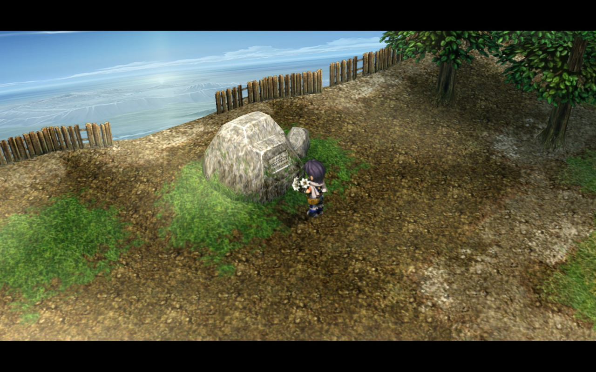
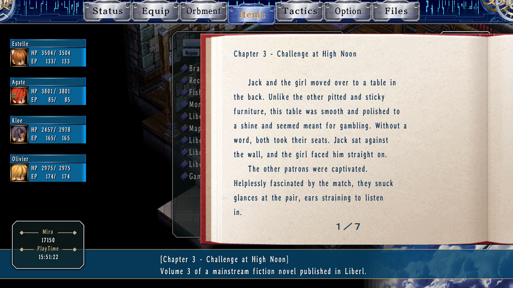
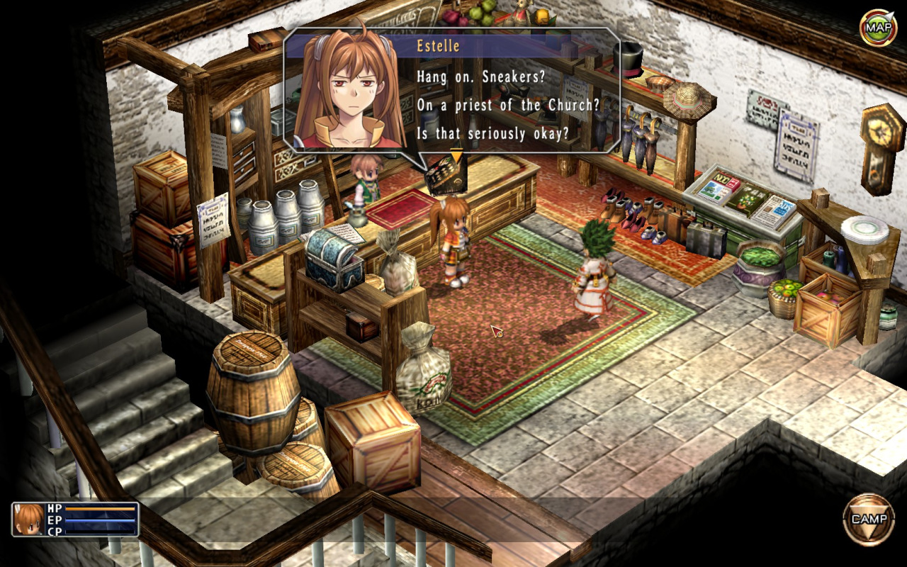
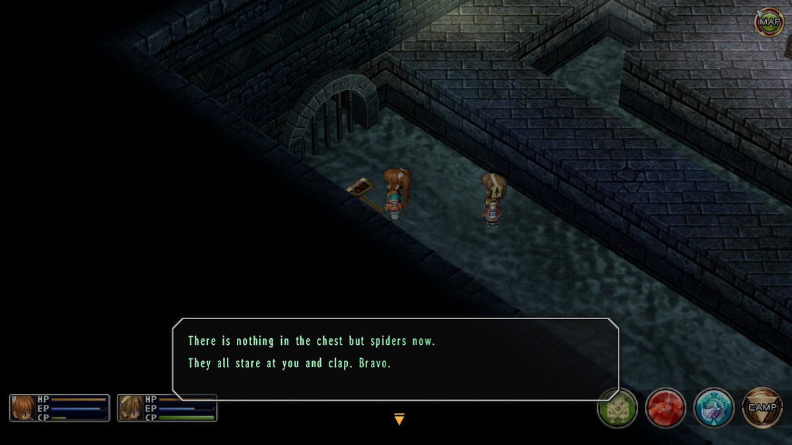
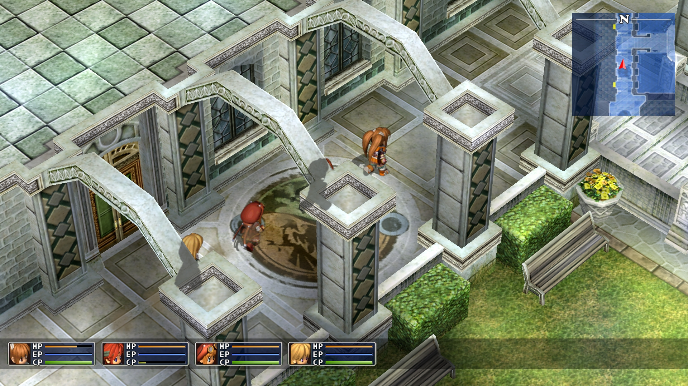
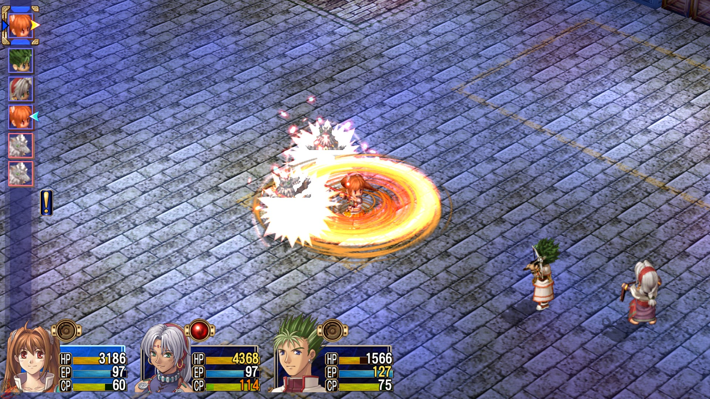
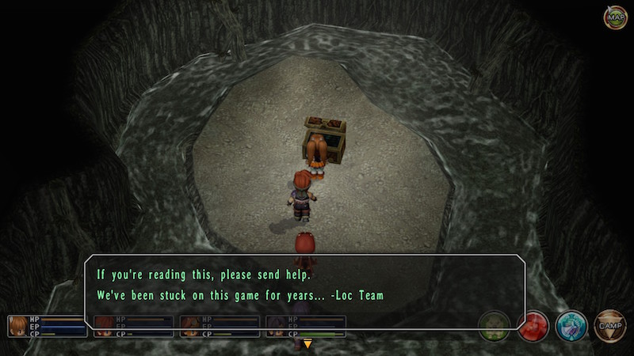
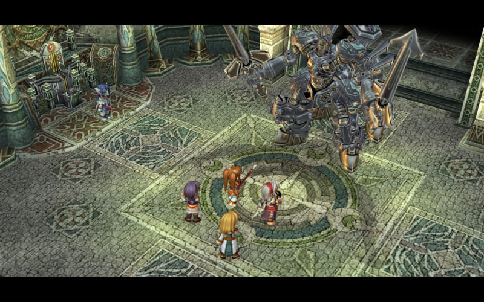
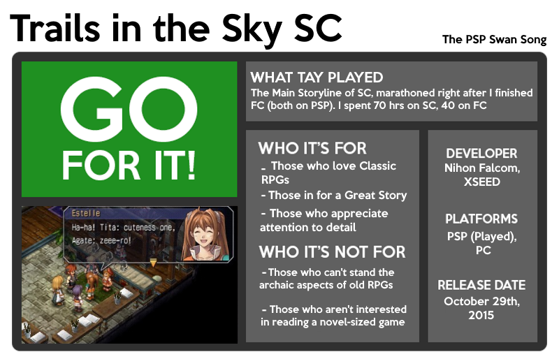

---
{
	title: "The Legend of Heroes: Trails in the Sky SC: The TAY Review",
	published: "2015-12-21T16:30:00-05:00",
	tags: ["The TAY Review", "TAY Review", "Rockmandash Reviews", "The Legend of Heroes", "Trails in the Sky", "Trails in the Sky SC", "Falcom", "Xseed", "JRPG", "PSP"],
	kinjaArticle: true
}
---

[*The Legend of Heroes: Trails of the Sky SC (Second Chapter)* is truly remarkable](http://thebests.kotaku.com/the-best-jrpg-of-the-decade-so-far-1743320035#_ga=1.66073517.241020698.1444271310). This JRPG by Nihon Falcom and XSEED had fans waiting [4 long years for the localization as it went through development hell](http://kotaku.com/the-curse-of-kiseki-how-one-of-japans-biggest-rpgs-bar-1740055631?trending_test_five_c\&utm_expid=66866090-76.Xf7HV5ZSS3i8CtAkjmzQiA.3\&utm_referrer=http%3A%2F%2Fkotaku.com%2Ftag%2Ftrails-in-the-sky%3Ftrending_test_five_c#_ga=1.170228515.241020698.1444271310), but *SC* totally lives up to the wait that anyone had to endure for the game: it’s the perfect swan song for the PSP, being everything you loved about classic JRPGs.

***Note: This is a review of The Legend of Heroes: Trails in the Sky SC, which is a continuation from FC (First Chapter). While I tried to avoid explicitly spoiling anything, there may be slight spoilers due to how interconnected these games are and I would recommend either playing through FC or at least reading ***[Matt’s review of FC](http://tay.kinja.com/the-legend-of-heroes-trails-in-the-sky-is-worth-your-t-1564560412#_ga=1.89472920.241020698.1444271310)*** before you read this one.***

# A Continuation of The Great Story

Above anything else, *The Legend of Heroes: Trails of the Sky SC* is a continuation of the story that *FC* sets up, dealing with implications of the cliffhanger at the end of the game. *SC* follows our bracer friend Estelle Bright as she goes around trying to stop the plans of The Society, (also known as Ouroboros) who plan on building off the events in the first game and taking it further. While the story is structured around The Society and the events they cause, *The Legend of Heroes: Trails in the Sky SC* is really a story of people, focusing on the emotions that Estelle and Joshua go through in their journey to find out the truth.

SC takes everything further, taking what seemed like a relatively basic story and fleshing it out to an unbelievable extent. It goes through what you’re expecting, amping up and wrapping up the story so it doesn’t end on a cliffhanger, but it goes through so much more as well: it’s a tale of the brightness of those working together as we see the bracers and the community try to solve issues as one, but it’s also a sad story about the tragedies of a world. We see a touching love story and the creation of new bonds, but we also see people dealing with the loss of loved ones. We see the recovery and success of a society, but we also see the dealing with the aftermath of war and death. We have our heroes dedicated to save everything, confronting the enemies so convinced of their goals that they would be willing to massacre a complete society. It’s really a complete package, and it keeps the work interesting and varied while feeling compelling throughout.

Even though *Trails in the Sky SC* touches on many things, it never feels forced and it works because it uses all these things it covers to strengthen the main narrative. These are elements that make the world feel real - while obviously a fantasy scenario in a fantasy world, because of it’s focus on people and humanity, it feels like these people are alive and in a living and breathing world with so much going on. Everyone has a voice and a story to tell, with their own concerns and livelihoods. The world isn’t focused on you so much as the fact that as you’re existing in a fleshed out and thriving world that moves along and reacts to what happens around you, a world that feels truly real.

The world itself is interesting too, being a blend of your typical fantasy with a twist of semi futuristic sci fi to make a world that kinda feels like our modern world, but a world that feels completely unique. It has tons of lore and is one that’s deeply fleshed out in this game, a world that only adds to one’s experience with the game. There’s so much here, from the differences to how things are powered with this world controlled by orbit power instead of being run by the combustion engine like in ours, and cultural things like how people have the god Adios and pretty much say Adios when people would say God in our world.

Of course though, above the thematic aspects and world building is the dialogue that holds the story together, the writing that makes it feel like the world is complete... and like before, it’s really good here. With the main cast, the way the characters react to each other makes them feel truly real, and it’s always a blast to read. The relationships between the characters are fleshed out and engaging with witty and amusing dialogue,and it’s supported with interactions and charm that never cease to put a smile on your face. The main cast is absolutely amazing with stellar backstories, they have personalities that are well developed, they are likable and aren’t static, and the game really makes you care for the cast as much as they care for themselves. It’s just great writing here to the point that the main duo, Estelle and Joshua, became some of my favorite characters in JRPGs. The writing props extend to the NPCs as well - everyone has unique dialogue that changes, and it makes for a story and world that feels really polished.

*The Legend of Heroes: Trails in the Sky SC* has a story that’s written well enough and is long enough to be a Visual Novel (for reference, its script is 716,401 words, longer than books like *War and Peace* and RPGs like *FF7*, but shorter than VNs like *Fate/stay night* and *Clannad*), which is kind of amazing considering it’s an RPG. SC makes an living and breathing world out of this fact to add to an amazing story, one that sucks you in and keeps you engaged and one that had me playing it pretty much nonstop for like a week because I was so hooked. If you liked RPG stories in the past like *Chrono Trigger* and *Grandia* but wanted more, something that is more in depth and feels like you’re in a real world, then here you go... this is the most complete RPG style story I’ve ever experienced and it’s just amazing, an execution on a tried and true story that is absolutely gold.

# This Game Has a Heart

Talk to anyone who’s played this game and you’ll hear lots of love. When one sees all these comments then tries to look at a game objectively or without experiencing it, they may say that this game doesn’t really stand out, even to the point that they believe it’s another generic JPRG, but that totally misses the point. The reasons people fall in love with games like this, the games that are known as cult classics are the intangibles, the character and charm that they have to offer, the elements that create an emotional bond with the characters and keep the game memorable. One can tell there was a lot of love and care put into the work, and [when reading what they’ve gone through to make this possible here in the west](http://kotaku.com/the-curse-of-kiseki-how-one-of-japans-biggest-rpgs-bar-1740055631?trending_test_five_c\&utm_expid=66866090-76.Xf7HV5ZSS3i8CtAkjmzQiA.3\&utm_referrer=http%3A%2F%2Fkotaku.com%2Ftag%2Ftrails-in-the-sky%3Ftrending_test_five_c), this feeling only goes up more. *Trails in the Sky SC* feels distinct and unique because of this, and it’s climbed up my favorites list [along with Jason Schreier’s of Kotaku ](http://thebests.kotaku.com/the-best-jrpg-of-the-decade-so-far-1743320035#_ga=1.22380216.241020698.1444271310)because of it.

# Falcom’s the Jam

If you’ve ever played a Falcom game, you know what they sound like: they make some of the best music in the industry. While *Legend of Heroes: Trails in the Sky SC* mostly keeps the soundtrack from *FC* with some remixes and new tracks, that’s not really a negative as SC is pretty much just a continuation of the story and the soundtrack still does a great job. It’s a soundtrack that does what every great soundtrack does, one that makes events exciting and makes playing the game engaging, encapsulating the feeling of the story and the world to provide a better experience. It sounds great, it’s used really well to maximize your emotions, and there’s a lot of memorable tracks in this score, namely *Silver Will* and *The Whearabouts of Light* being some of my favorites. It’s a soundtrack that I loved and adored my whole way through, and I bet you’ll love it just as much as I did too.

Also worth noting is the incredible Zanmai score that just brings the awesome of this soundtrack to another level. While I couldn’t experience this because I pulled out my PSP to play this game, on the PC version you could actually swap the whole soundtrack, with people swapping in the absolutely amazing Zanmai version to listen throughout the game. The clip above is from Zanmai and it really makes the music feel alive, music I’d listen to all day.... so good.

# A Blast to the Past, for Better or For Worse

That’s not to say that all of *Trails in the Sky SC* is perfect: if you didn’t care for *FC*, it’s more of the same. That’s to be expected, as it’s a direct continuation of the original game to the point that you can transfer your save over but really, *SC* is just *FC* but amplified. *The Legend of Heroes: Trails of the Sky* is a love story to old RPGs out there, and that’s exactly what you’re getting, like it or not (it even has disk switching!). One might hope that it would jump straight to the action, but it starts slow again by making you go through the rounds again, trying to figure out another mystery, and going around the country again. Like before, the characters keep it interesting and engaging, but if you didn’t care for its old school gameplay or wanted a less text focused story, you won’t get that here.

This is most obvious part about this is the gameplay which is still an old school *Grandia*-like affair, so if you liked it back then, you’ll like it now. It’s a game with an action sensitive turn based system in a 2.5D arena that is location sensitive, mixed with attacks, magical arts (which use MP which is easily replenishable and are delayed) and physical crafts (which use CP and are instant, but are harder to get). It has its fair share of positives, with [Matt’s review being mostly positive about it](http://tay.kinja.com/the-legend-of-heroes-trails-in-the-sky-is-worth-your-t-1564560412), but personally it’s a bit too slow for my tastes and at times feeling like a slog. One thing that personally bugged me about the gameplay is how it forces you to use some characters at points in the game, making you fight with people even if you don’t like their style or if they are like 10 levels under your current level (luckily, they level up back quickly, but it’s still annoying). Also, while you can get away with minimal grinding for a fair bit of the game, the game wants you to do a decent bit of grinding at certain points in time, which is pretty much the bane of my existence when it comes to JRPGs and detracted from my experience.

That being said, this game isn’t an old RPG and it does modernize many aspects: if you die, you can just restart the battle itself, many situations where characters need to backtrack are done for you (not that backtracking is completely eliminated though...), random encounters are totally gone, instead faced with a situation similar to *Chrono Trigger*, there are no arbitrary save points, etc. If you’re a fan of classic JRPGs, you’re gonna love this one as it provides everything you want out of an RPG but gets rid of a lot of the BS that they have, but if you prefer newer RPGs or action games, this isn’t gonna be your cup of tea.

# A Charming, but Dated Aesthetic

Let’s be real here: *The Legend of Heroes: Trails in the Sky SC* *is* a 9 year old PSP game, so throw any assumptions away that this is going to be a technical feat in visual fluidity. This game reuses pretty much all its assets from *FC* and it looks perfectly at home for the PSP, a low polygon count affair with sprites for a majority of the characters. It doesn’t look bad as the game makes up for a lot of this with aesthetic consistency, detail and charm in design [(see fishing)](http://www.trailsinthesky.com/sc/_images/trouble9.jpg), and solid quality overall, but it’s not the best either, pretty middle of the road with visuals. This is something I had absolutely no problem with, and if you’re playing this you’re probably OK with how it looks as this game’s intended audience pretty much grew up on this style.

# Boss Heavy Ending

***Note: This picture is not from the end game.***

It’s the big finale, the long stretch! If you thought you could sit around and stroll by at the end, you can’t, as you’re faced with what’s essentially a boss rush at the end of the game, the finals, as you will. Like the ending of the first game, the situation of the bosses near the end of the game exponentially gets more asinine and absurd, leading to frustration, at least for me. (The final boss itself however wasn’t actually that bad. Just a slow and tedious boss fight.)

I really wonder who thought it was a good idea to put variations of bosses you’ve already played only a little while ago but in a more frustrating package. While this makes sense in a story aspect, this really shows how much this game is story first instead of gameplay... throwing hard bosses so close to another with frustrating abilities like being able to spawn enemies that can heal the boss themselves then self destruct to take like half of your HP away or take control from you the player completely. It’s definitely frustrating to say the least, and almost started to make me hate the game I adore.

The ending itself however is pretty satisfying, with no issues. While a tad bit bittersweet in some aspects, it perfectly encapsulates what the story has to tell, it’s an engaging and moving ending that really works with the content of the story and is an ending that puts some closure to a series that really needed it. (Even though there’s a third chapter, but who knows if we’re getting it at this point.)

*The Legend of Heroes: Trails of the Sky SC* is many things. From being claimed as [The Best JRPG of the Decade thus far according to Kotaku](http://thebests.kotaku.com/the-best-jrpg-of-the-decade-so-far-1743320035#_ga=1.65467693.241020698.1444271310) to the continuation of the amazing story that *FC* presented, *Trails of the Sky SC* is a love story to a style of gameplay and a style of story that many thought was dead, an amazing game that demands to be played. If you’re a fan of classic JRPGs or looking for a great story, you will adore this game, just as much as many have thus far. [It was worth the hell you guys had to go through XSEED](http://kotaku.com/the-curse-of-kiseki-how-one-of-japans-biggest-rpgs-bar-1740055631), thank you for this great game.

***

*You’re reading TAY, Kotaku’s community-run blog. TAY is written by and for Kotaku readers like you. We write about games, art, culture and everything in between. Want to write with us? Check out our tutorial *[*here*](http://tay.kotaku.com/the-new-taytorial-1659855583)* and join in. If you want to read more of my writing, check out *[*AniTAY*](http://anitay.kinja.com/)*, *[*RockmanDash Reviews*](/people/reikaze)* and *[*KMTech*](http://kmtech.kinja.com/)*.*
